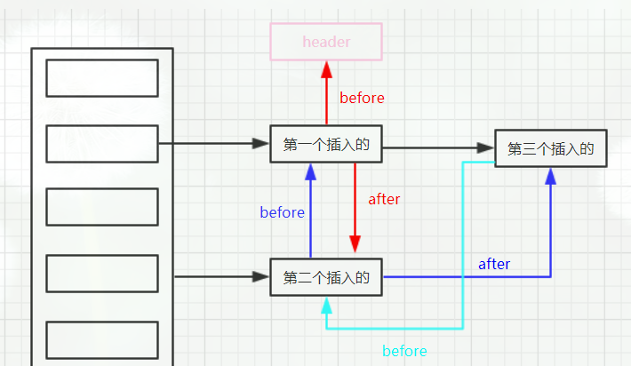
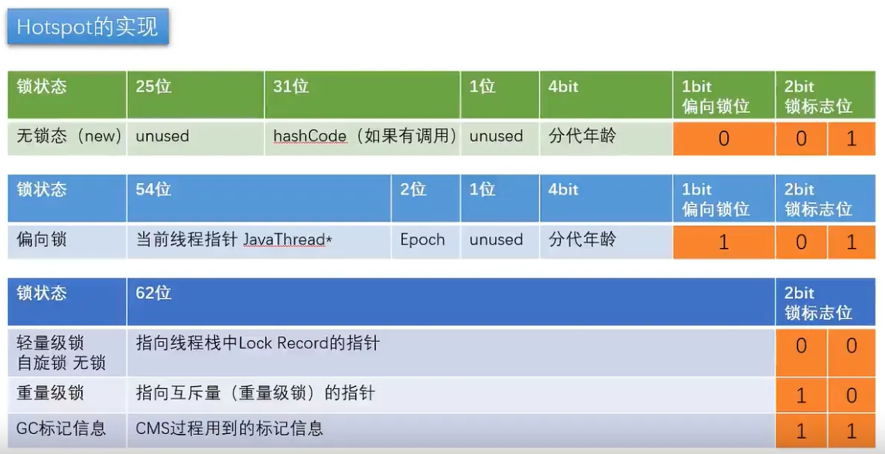
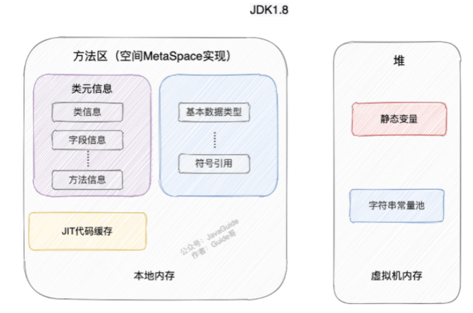
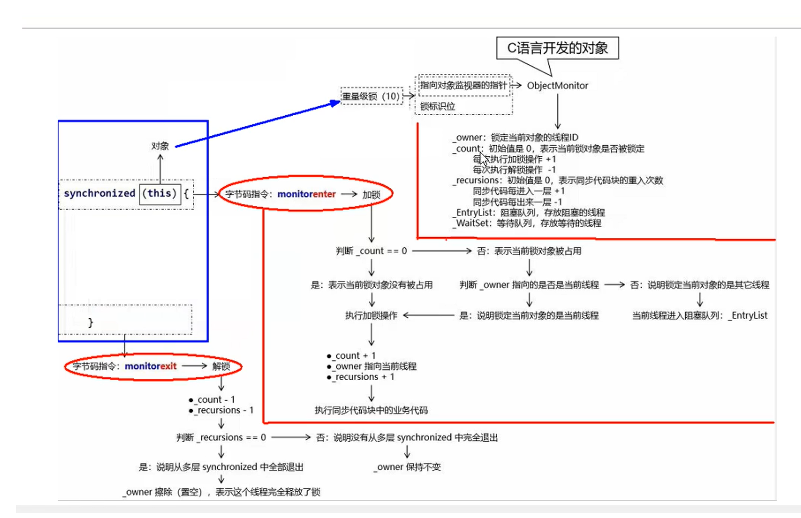

## 泛型

泛型擦除，写入没问题，读取的时候会有问题

json 转换，jackson

1.Java 在编译时会在字节码里指令集之外的地方保留**部分**泛型信息 

2.泛型接口、类、方法定义上的所有泛型、成员变量声明处的泛型**都会**被保留类型信息，**其它地方**的泛型信息都会被擦除

官方早早就为我们考虑好了这类泛型擦除的问题，所以它提供了`TypeReference<T>`方便我们把泛型类型保留下来，使用起来是非常的方便的：

# 基础定义

bit 比特 二进制的1位 0或1

byte 字节8位  1byte=8bit 英文1B 中文2B 范围-2^7 ~ 2^7-1 最前位是正负

short char 16位

int float 32位

long double 64位

# java基础

## 1、集合数据结构

### **单列集合：collection接口**

#### list

**arraylist、linkedlist**

**arraylist：**数组实现、默认静态空数组（new出来的，没有add时）

当第一次add时，直接将数组大小设置为10。

当添加完10个后，添加第11个，大小是size+1 和当前数组的length比较，如果大了就要进行扩容

扩容大小是数组length+length>>1（1.5倍），判断是否满足，**判断是否溢出integer.maxvalue-8。**

在通过system.arraycopyof复制数据

remove时，会调用system.arraycopy方法，影响效率

**linkedlist**：链接实现、双向链表

#### **set**

**hashset、treeset**

### **双列集合：map**接口

#### hashmap

无序、查询效率高，线程不安全 **数组+链表+红黑树**


HashMap 底层是一个哈希桶数组，名为 table，数组内存储的是基于 Node 类型的数据

最大容量2^30（1<<30），大于这个数量将无法扩容，只能hash碰撞

负载因子是0.75f、初始容量16、当达到16x0.75=12时，进行扩容，扩容为lengthx2倍

负载因子大，会出现大量hash碰撞，虽然空间利用率上去了，但是时间效率降低了。

**扩容代码**

```java
final Node<K,V>[] resize() {
    // 当前 table
    Node<K,V>[] oldTab = table;
    // 当前的 table 的大小
    int oldCap = (oldTab == null) ? 0 : oldTab.length;
    // 当前 table 的 threshold，即允许存储的数据量阀值
    int oldThr = threshold;
    // 新的 table 的大小和阀值暂时初始化为 0
    int newCap, newThr = 0;
    // ① 开始计算新的 table 的大小和阀值
    // a、当前 table 的大小大于 0，则意味着当前的 table 肯定是有数据的
    if (oldCap > 0) {
        // 当前 table 的大小已经到了上线了，还咋扩容，自个儿继续哈希碰撞去吧 
        if (oldCap >= MAXIMUM_CAPACITY) {
            threshold = Integer.MAX_VALUE;
            return oldTab;
        }
        // 新的 table 的大小直接翻倍，阀值也直接翻倍
        else if ((newCap = oldCap << 1) < MAXIMUM_CAPACITY &&
                 oldCap >= DEFAULT_INITIAL_CAPACITY)
            newThr = oldThr << 1; // double threshold
    }
    // b、当前的 table 中无数据，但是阀值不为零，说明初始化的时候指定过容量或者阀值，但是没有被 put 过数据，因为在上文中有提到过，此时的阀值就是数组的大小，所以直接把当前的阀值当做新 table 的数组大小即可
    // 回忆一下：threshold = tableSizeFor(t);
    else if (oldThr > 0) // initial capacity was placed in threshold
        newCap = oldThr;
    // c、这种情况就代表当前的 table 是调用的空参构造来初始化的，所有的数据都是默认值，所以新的 table 也只要使用默认值即可
    else {               // zero initial threshold signifies using defaults
        newCap = DEFAULT_INITIAL_CAPACITY;
        newThr = (int)(DEFAULT_LOAD_FACTOR * DEFAULT_INITIAL_CAPACITY);
    }
    // 如果新的阀值是 0，那么就简单计算一遍就行了
    if (newThr == 0) {
        float ft = (float)newCap * loadFactor;
        newThr = (newCap < MAXIMUM_CAPACITY && ft < (float)MAXIMUM_CAPACITY ?
                  (int)ft : Integer.MAX_VALUE);
    }
    threshold = newThr;
    // ② 初始化新的 table
    // 这个 newTab 就是新的 table，数组大小就是上面这一堆逻辑所计算出来的
    @SuppressWarnings({"rawtypes","unchecked"})
    Node<K,V>[] newTab = (Node<K,V>[])new Node[newCap];
    table = newTab;
    if (oldTab != null) {
        // 遍历当前 table，处理每个下标处的 bucket，将其处理到新的 table 中去
        for (int j = 0; j < oldCap; ++j) {
            Node<K,V> e;
            if ((e = oldTab[j]) != null) {
                // 释放当前 table 数组的对象引用（for循环后，当前 table 数组不再引用任何对象）
                oldTab[j] = null;
                // a、只有一个 Node，则直接 rehash 赋值即可
                if (e.next == null)
                    newTab[e.hash & (newCap - 1)] = e;
                // b、当前的 bucket 是红黑树，直接进行红黑树的 rehash 即可
                else if (e instanceof TreeNode)
                    ((TreeNode<K,V>)e).split(this, newTab, j, oldCap);
                // c、当前的 bucket 是链表
                else { // preserve order
                    Node<K,V> loHead = null, loTail = null;
                    Node<K,V> hiHead = null, hiTail = null;
                    Node<K,V> next;
                    // 遍历链表中的每个 Node，分别判断是否需要进行 rehash 操作
                    // (e.hash & oldCap) == 0 算法是精髓，充分运用了上文提到的 table 大小为 2 的幂次方这一优势，下文会细讲
                    do {
                        next = e.next;
                        // 根据 e.hash & oldCap 算法来判断节点位置是否需要变更
                        // 索引不变
                        if ((e.hash & oldCap) == 0) {
                            if (loTail == null)
                                loHead = e;
                            else
                                loTail.next = e;
                            loTail = e;
                        }
                        // 原索引 + oldCap
                        else {
                            if (hiTail == null)
                                hiHead = e;
                            else
                                hiTail.next = e;
                            hiTail = e;
                        }
                    } while ((e = next) != null);
                    // 原 bucket 位置的尾指针不为空(即还有 node )
                    if (loTail != null) {
                        // 链表末尾必须置为 null
                        loTail.next = null;
                        newTab[j] = loHead;
                    }
                    if (hiTail != null) {
                        // 链表末尾必须置为 null
                        hiTail.next = null;
                        newTab[j + oldCap] = hiHead;
                    }
                }
            }
        }
    }
    return newTab;
}
```

##### 牛逼的地方，也是为什么长度会取值 2^n ？

**1.hash（key）取下标index**

index 的取值 hash(key) % n 和 hash(key) & (n-1) 取模效果一样

比如hash是10，n是4 那么相当于就是10里面剩出去4的倍数剩几，换成2进制，其实就是4的2进制100最后面那两位是多少，省的就是多少，因为他只能已这个倍数去向上加。n-1 & 正好可以把这个数字取出来。

**2.同时还有扩容后重新计算key值**，key要么是原来的值，要么是原值+数组长度。

这是因为8->1000 16->10000，取key时，只差最左1位，如果是0 则，不变，如果是1，则相差16（也就是新数组的长度）

**链表、红黑树转换。**

红黑树的平均查找长度是log(n)，长度为8，查找长度为log(8)=3，链表的平均查找长度为n/2，当长度为8时，平均查找长度为8/2=4，这才有转换成树的必要；链表长度如果是小于等于6，6/2=3，虽然速度也很快的，但是转化为树结构和生成树的时间并不会太短。

还有选择6和8的原因是：

中间有个差值7可以防止链表和树之间频繁的转换。假设一下，如果设计成链表个数超过8则链表转换成树结构，链表个数小于8则树结构转换成链表，如果一个HashMap不停的插入、删除元素，链表个数在8左右徘徊，就会频繁的发生树转链表、链表转树，效率会很低。

除了满足 8 之外，还要看table是否大于64，小于先扩容，大于在转换。

table长度足够，hash冲突过多

hash没有冲突，但是在计算table下标的时候，由于table长度太小，导致很多hash不一致的
第二种情况是可以用扩容的方式来避免的，扩容后链表长度变短，读写效率自然提高。

#### linkedhashmap

继承 hashmap 多维护了一个双向链表，有序的

通过双向链表进行维护数据的存取有序，第一个head是-1



#### treemap

红黑树，可以自定义比较器，进行key排序。

#### CopyOnWriteArrayList 通过 ReentrantLock 保证并发安全

#### ConcurrentHashMap

**hashmap多线程不安全分析**

1.当key没有链表时，同时 putkey，p.next 同时执行，就会丢失一个key。

```java
// 新建节点并追加到链表
if ((e = p.next) == null) { // #1
    p.next = newNode(hash, key, value, null); // #2
    if (binCount >= TREEIFY_THRESHOLD - 1) // -1 for 1st
        treeifyBin(tab, hash);
    break;
}
```

2.获取在扩容时，getkey，会造成null。

```java
Node<K,V>[] newTab = (Node<K,V>[])new Node[newCap]; // #1
table = newTab; // #2
```

**如何保证线程安全**

针对问题1：

如果key的地址没有链表，则使用 cas 进行赋值，如果有值，则使用第一个object加synchronize锁。锁的力度都是数组中的元素，效率高。

针对问题2：

resize时，会将第一个标记为 move -1 说明是扩容，就一起参与扩容。

## 2、多线程、并发

进程和线程。进程之间独立，进程有多个线程，cpu来回在线程件切换

### **创建多线程**：

继承thread类、实现Runable接口、实现Callable接口

### **线程状态**


- New：新创建的线程，尚未执行；
- Runnable：运行中的线程，正在执行`run()`方法的Java代码；
- Blocked：运行中的线程，因为某些操作被阻塞而挂起；
- Waiting：运行中的线程，因为某些操作在等待中；
- Timed Waiting：运行中的线程，因为执行`sleep()`方法正在计时等待；
- Terminated：线程已终止，因为`run()`方法执行完毕。

### **常用方法**

1. start 启动一个线程，进入排队状态，等待cpu启动。
2. run 执行命令。
3. sleep 暂停执行，让出cpu，但监控状态、锁不会释放。
4. wait 释放锁，等待其他线程唤醒，但不会得到锁，需要重新竞争
5. yield 让出cpu资源
6. join 阻塞其他线程，直到我结束，你在执行，强插一脚。

## 3、线程池七大参数、执行流程

### **ThreadPoolExecutor 7个参数如下**

（1）corePoolSize：核心线程数，线程池中始终存活的线程数。

（2）maximumPoolSize: 最大线程数，线程池中允许的最大线程数。

（3）keepAliveTime: 存活时间，线程没有任务执行时最多保持多久时间会终止。

（4）unit: 单位，参数keepAliveTime的时间单位，7种可选。

（5）workQueue: 一个阻塞队列，用来存储等待执行的任务，均为线程安全，7种可选。

| 参数                  | 描述                                                         |
| --------------------- | ------------------------------------------------------------ |
| ArrayBlockingQueue    | 一个由数组结构组成的有界阻塞队列。                           |
| LinkedBlockingQueue   | 一个由链表结构组成的有界阻塞队列。                           |
| SynchronousQueue      | 一个不存储元素的阻塞队列，即直接提交给线程不保持它们。       |
| PriorityBlockingQueue | 一个支持优先级排序的无界阻塞队列。                           |
| DelayQueue            | 一个使用优先级队列实现的无界阻塞队列，只有在延迟期满时才能从中提取元素。 |
| LinkedTransferQueue   | 一个由链表结构组成的无界阻塞队列。与SynchronousQueue类似，还含有非阻塞方法。 |
| LinkedBlockingDeque   | 一个由链表结构组成的双向阻塞队列。                           |

（6）threadFactory: 线程工厂，主要用来创建线程，默及正常优先级、非守护线程。

（7）handler：拒绝策略，拒绝处理任务时的策略，4种可选，默认为AbortPolicy。

| 参数                | 描述                                                      |
| ------------------- | --------------------------------------------------------- |
| AbortPolicy         | 拒绝并抛出异常。                                          |
| CallerRunsPolicy    | 重试提交当前的任务，即再次调用运行该任务的execute()方法。 |
| DiscardOldestPolicy | 抛弃队列头部（最旧）的一个任务，并执行当前任务。          |
| DiscardPolicy       | 抛弃当前任务。                                            |

### **执行流程**


### **实际方案**

参数配置：IO密集型（cpu核心*2）、CPU密集型（cpu+1）。核心数量、最大数量、队列长度配置。

优化方案，动态调优。通过线程实例动态设置 核心、动态数量。

线程池监控：

activecount数量/max数量 = 阀值 说明线程都在使用。

reject数量、队列中的等待任务。综合判定。

## 4、常见设计模式、实际应用

## 5、锁机制、可重入锁、公平锁、悲观锁

**java对象头存储结构**

markword、classpoint、实例数据、padding对齐。




**Monitor**：一个同步工具或一种同步机制，通常被描述为一个对象。依赖于底层的操作系统的Mutex Lock（互斥锁）来实现的线程同步。需要cpu来回切换状态，属于重量级锁。

markword前四位代表锁，001是无锁，其他是有锁。

**automicInteger**，乐观锁保证，实现的是c++，cpu的lock指令。

### synchronize 锁

**锁状态：无锁 VS 偏向锁 VS 轻量级锁 VS 重量级锁**

偏向锁通过对比Mark Word解决加锁问题，避免执行CAS操作。而轻量级锁是通过用CAS操作和自旋来解决加锁问题，避免线程阻塞和唤醒而影响性能。重量级锁是将除了拥有锁的线程以外的线程都阻塞。

A线程拿锁，把你自己名字贴上，就是偏向锁。如果下一次来，看见还有这个标记，就直接使用，省了竞争的过程。但是，如果B线程来了，就会撕下去，变成轻量级锁，一直等待。

一开始是轻量级锁，默认4秒后，变成偏向锁，可以通过jvm参数修改。

轻量级锁：乐观锁，线程存活、一直等待、消耗cpu、jvm自己可以搞定。

重量级锁：线程进入队列、等待唤醒，竞争激烈时可用。但是需要系统协调。

### reentrantlock 可重入锁

**AbstractQueuedSynchronizer（简称为AQS）**，

接口，规定锁，使用一个FIFO的等待队列表示排队等待锁的线程，state使用volatile标记。采用cas操作保证原子性。

默认使用非公平锁，

**其原理大致为**：

当某一线程获取锁后，将state值+1，并记录下当前持有锁的线程，再有线程来获取锁时，判断这个线程与持有锁的线程是否是同一个线程，如果是，将state值再+1，如果不是，阻塞线程。

AQS内部实际上是一个FIFO的双端队列，当线程获取同步状态失败时，就会构建一个Node并添加到队列尾部（此过程是线程安全的，CAS实现），并阻塞当前线程（通过**LockSupport.park()**方法）； 当释放同步状态时，AQS会先判断head节点是否为null，如果不是null，说明有等待同步状态的线程，就会尝试唤醒head节点，使其重新竞争同步状态。

park wait 都不会释放锁，unpark可以精准唤起线程 unsafe native方法


### volatile 关键字

保证操作的顺序性、可见性。使用汇编的lock，有load和store锁，这样保证是顺序进行的。

还有缓存一致性协议，esmi，本地内存失效，需要去主内存重新读取， 我改了这个内存，你们都要等着我改完再用。

### cpu 3级缓存，调优

cpu3级缓存，每次缓存64byte数据，如果多个cpu的缓存有相同的数据，需要保持数据一致性，这样会消耗一部分时间，优化的话，就让数据独享一个缓存块，一般是前后各加8个long型变量，一个long是8byte。

### new 对象过程

```c++
汇编码：
0 new #2 <T>  申请一片空间  同时赋予默认数据（c++不会，使用上次的值）
3 dup
4 invokespecial #3 <T.<inti>> 构造赋值
7 astore_1  t 的指针指向 new 的空间
8 return
```

### double check lock

双 null 检测，sync不保有序性，可能会指令重排（概率很小）。加 volatile 保证可见性、有序性，不保证原子性。用内存屏障保证指令不被中断。

load、store。jvm内存屏障，保证不让其线程他操作。

## 6、java memory model （jmm）模型


在此交互过程中，Java内存模型定义了8种操作来完成，虚拟机实现必须保证每一种操作都是原子的、不可再拆分的（double和long类型例外）。

- lock（锁定）：作用于主内存的变量，它把一个变量标识为一条线程独占的状态。
- unlock（解锁）：作用于主内存的变量，它把一个处于锁定状态的变量释放出来，释放后的变量才可以被其他线程锁定。
- read（读取）：作用于主内存的变量，它把一个变量的值从主内存传输到线程的工作内存中，以便随后的load动作使用。
- load（载入）：作用于工作内存的变量，它把read操作从主内存中得到的变量值放入工作内存的变量副本中。
- use（使用）：作用于工作内存的变量，它把工作内存中一个变量的值传递给执行引擎，每当虚拟机遇到一个需要使用到变量的值的字节码指令时将会执行这个操作。
- assign（赋值）：作用于工作内存的变量，它把一个从执行引擎接收到的值赋给工作内存的变量，每当虚拟机遇到一个给变量赋值的字节码指令时执行这个操作。
- store（存储）：作用于工作内存的变量，它把工作内存中一个变量的值传送到主内存中，以便随后的write操作使用。
- write（写入）：作用于主内存的变量，它把store操作从工作内存中得到的变量的值放入主内存的变量中。

## 7、jvm内存划分、垃圾回收算法、垃圾回收器、调优

### jvm  JDK1.6、JDK1.7、JDK1.8 内存模型演变




元数据区：2个常量池 运行时常量池、类常量池、类信息（编译后的class文件)

### **什么是运行时常量池？**

Class 文件中除了有类的版本、字段、方法、接口等描述信息外，还有用于存放编译期生成的各种字面量（Literal）和符号引用（Symbolic Reference）的常量池表(Constant Pool Table)。常量池表会在类加载后存放到方法区的运行时常量池中。

字面量是源代码中的固定值的表示法，即通过字面我们就能知道其值的含义。字面量包括整数、浮点数和字符串字面量，符号引用包括类符号引用、字段符号引用、方法符号引用和接口方法符号引用。

运行时常量池的功能类似于传统编程语言的符号表，尽管它包含了比典型符号表更广泛的数据。

既然运行时常量池是方法区的一部分，自然受到方法区内存的限制，当常量池无法再申请到内存时会抛出 `OutOfMemoryError` 错误。

### 垃圾回收

堆划分：

#### 垃圾判断算法

1、引用计数法：用+1 不用-1 无法检测循环引用，造成内存泄漏，无法回收

2、可达性分析算法：从一个节点 GC ROOT 开始，寻找节点引用，无用节点将被回收。

- 虚拟机栈（栈帧中的本地变量表）中引用的对象
- 方法区中的常量引用的对象
- 方法区中的类静态属性引用的对象
- 本地方法栈中 JNI（Native 方法）的引用对象
- 活跃线程（已启动且未停止的 Java 线程）

#### 垃圾回收算法

1、标记-清除，造成内存碎片

2、标记-复制，直接复制到另一块上，新生代

3、标记-整理，老年代

新生代进入老年代，15岁（在幸存区15次都没有被清除）

#### 垃圾回收器分类

1、Serial/Serial Old 单线程

2、ParNew/ParNew Old 多线程

3、Parallel Scavenge 新生代、标记-复制算法、并发，注重垃圾收集吞吐量

4、CMS 并发，老年代、最短回收停顿时间、标记-清除算法  依赖cpu、抢占用户资源

5、G1 充分利用cpu、打破分代模型，划分区域。

#### 你们现在使用的是什么回收器：默认

因为我们系统是业务相对复杂，但并发并不是⾮常⾼，所以希望尽可能的利用处理器资源，出于提⾼吞吐量的考虑采⽤ Parallel Scavenge + Parallel Old 的组合。

## 8、强软弱虚引用

强：A a = new A ( )

软：SoftReference<byte[]> sr = new SoftReference<>(new byte[1024\*1024\*10]);

= 是强引用  soft里面是软引用  sr.get() 获取对象 空间不足时，会被清理掉。


弱：WeakReference\<M> wr = new WeakReference<>(new M()); 类似软引用图。当gc执行时，不管内存是否充足，直接被干掉。

#### threadlocal两层内存泄漏


第一层：如果用的不是软引用的话，threadlocal 会被 tl 和 key 一同指向，如果只释放 tl，那么key的指向还在，threadlocal对象就不会被回收掉。造成内存泄漏。

第二层：使用的是线程池，线程如果不会被干掉，线程的threadlocalmap会一直存在，如果key value的数据一直存在，value引用的对象就不会被回收，也会造成内存泄漏，所以需要每次使用完之后，进行remove操作。  

# JUC 并发编程

## 回顾

### 0. java8 函数式编程

runnable、function、consumer（BiConsumer）、supplier

参数、返回，用一个接口代替（接口只能有一个方法）

**作为参数：**

```java
interface DemoI {
    void eat();
}

public static void anyMeth(DemoI demoI) {
    demoI.eat();
}

public static void main(String[] args) {
    anyMeth(new DemoI() {
        @Override
        public void eat() {
		
        }
    });
    // 作为参数
    anyMeth(() -> {

    });
}
```

**作为返回：**

```java
public static DemoI anyMeth2(){
    return new DemoI() {
        @Override
        public void eat() {

        }
    };
}

public static DemoI anyMeth3(){
    // 作为返回
    return () -> {

    };
}
```

#### 1. Supplier

用来获取一个泛型参数指定类型的对象数据

该接口被称为生产型接口，指定接口的泛型是什么类型，那么get方法就会产生什么类型的数据

```java
@FunctionalInterface
public interface Supplier<T> {
    T get();
}
```

作用入参时，可以是一个方法，方法中返回泛型类

```java
public static void main(String[] args) {
    getS(() -> {
        String s = "adb";
        return s + "234";
    });
}

public static String getS(Supplier<String> supplier) {
    return supplier.get();
}
```

#### 2. Consumer

它不是生产一个数据，而是消费一个数据，其数据类型由指定的泛型决定

该接口包含抽象方法`void accept(T t)`，作用是消费一个指定泛型的数据，消费是自定义的(输出、计算....)

```java
@FunctionalInterface
public interface Consumer<T> {
    void accept(T t);
    default Consumer<T> andThen(Consumer<? super T> after) {
        Objects.requireNonNull(after);
        return (T t) -> { accept(t); after.accept(t); };
    }
}
```

#### 3. Predicate

当我们需要对某种类型的数据进行判断，从而得到一个boolean值结果，这时可以使用`java.util.function.Predicate<T>` 接口

```java
@FunctionalInterface
public interface Predicate<T> {

    boolean test(T t);

    default Predicate<T> and(Predicate<? super T> other) {
        Objects.requireNonNull(other);
        return (t) -> test(t) && other.test(t);
    }

    default Predicate<T> negate() {
        return (t) -> !test(t);
    }

    default Predicate<T> or(Predicate<? super T> other) {
        Objects.requireNonNull(other);
        return (t) -> test(t) || other.test(t);
    }

    static <T> Predicate<T> isEqual(Object targetRef) {
        return (null == targetRef)
                ? Objects::isNull
                : object -> targetRef.equals(object);
    }

    @SuppressWarnings("unchecked")
    static <T> Predicate<T> not(Predicate<? super T> target) {
        Objects.requireNonNull(target);
        return (Predicate<T>)target.negate();
    }
}
```

#### 4. Function

`java.util.function.Function<T,R>` 接口为一个转换类型的接口，用来根据一个类型的数据得到另一个类型的数据，T 称为前置条件，R 称为后置条件

```java
@FunctionalInterface
public interface Function<T, R> {
    R apply(T t);

    default <V> Function<V, R> compose(Function<? super V, ? extends T> before) {
        Objects.requireNonNull(before);
        return (V v) -> apply(before.apply(v));
    }

    default <V> Function<T, V> andThen(Function<? super R, ? extends V> after) {
        Objects.requireNonNull(after);
        return (T t) -> after.apply(apply(t));
    }

    static <T> Function<T, T> identity() {
        return t -> t;
    }
}
```


### 1. thread.start() 解析

**最基本的开启线程**

```java
Thread thread = new Thread(() -> {
    // do something...
});
thread.start();
```

start 方法中，最终调用 native 方法开启线程

```java
private native void start0();
```

**native 方法实现**

openjdk 源码地址：https://hg.openjdk.org/

涉及到的类：


在线地址：

https://hg.openjdk.org/jdk8u/jdk8u/jdk/file/7fcf35286d52/src/share/native/java/lang/Thread.c

https://hg.openjdk.org/jdk8u/jdk8u/hotspot/file/69087d08d473/src/share/vm/prims/jvm.cpp

https://hg.openjdk.org/jdk8u/jdk8u/hotspot/file/69087d08d473/src/share/vm/runtime/thread.cpp

JNI 一般与 java 文件一一对应，Thread.java 对应的就是 Thread.c，在 Thread.c 中找打对应方法 JVM_StartThread


JVM_StartThread具体实现在 jvm.cpp 中


方法最后调用 thread.cpp 中 的 Thread::start 方法


thread.cpp 中 的 Thread::start 方法，最终调用系统开启线程


整体图：


### 2. 线程状态

#### 1. 从操作系统上看，有 5 种状态


**【初始状态】**：仅是在语言层面创建了线程对象，还未与操作系统线程关联

**【可运行状态（就绪状态）】**：指该线程已经被创建（与操作系统线程关联），可以由CPU调度执行

**【运行状态】**：指获取了CPU时间片运行中的状态

- 当CPU时间片用完，会从**【运行状态】**切换至**【可运行状态】**，会导致线程上下文切换

**【阻塞状态】**

- 如果调用了阻塞API，如BIO读写文件，这时该线程实际不会用到CPU，会导致线程上下文切换，进入**【阻塞状态】**
- 等BIO操作完毕，会由操作系统唤醒阻塞的线程，转换至**【可运行状态】**
- 与**【可运行状态】**的区别是，对**【阻塞状态】**的线程来说只要它们一直不唤醒，调度器就一直不会考虑调度它们

**【终止状态】**：表示线程已经执行完毕，生命周期已经结束，不会再切换为其它状态

#### 2. 从 java api 来看 是 6 种状态


### 3. 常问

1. 核心线程、最大线程、队列
2. 任务满了的拒绝模式
3. 创建线程池的方法

## 线程

### 1. Runnable


### 2. FutureTask

```java
// 创建线程池
ExecutorService threadPool = Executors.newFixedThreadPool(3);

FutureTask<String> task1 = new FutureTask<>(() -> {
    TimeUnit.MILLISECONDS.sleep(200);
    return "task1 over";
});
// 提交
threadPool.submit(task1);
System.out.println(task1.get());
// 销毁
threadPool.shutdown();
```

**缺点**

**1.get() 会阻塞其他线程**

```java
// 第一种
threadPool.submit(task1);
System.out.println(task1.get());

threadPool.submit(task2);
System.out.println(task2.get());

vs
// 第二种
threadPool.submit(task1);
threadPool.submit(task2);

System.out.println(task1.get());
System.out.println(task2.get());    
```

第一种：时间是 task1+task2

第二种：时间是 max（task1，task2）

如果不愿意等待，可以添加超时设置，到时直接抛异常（TimeoutException）

```java
task3.get(3,TimeUnit.SECONDS)
```


**2.容易造成 cpu 空转**

实际中，并不会直接会用 get()，会轮询判断 task 是否完成（task.isDone()），完成后在调用 get() 获取值。

但这种情况需要定时去查询是否完成，造成 cpu 性能浪费

```
// task3 5s 执行完成
// 每 0.5s 查看是否完成
while (true) {
    if (task3.isDone()) {
        System.out.println(task3.get());
        break;
    } else {
        TimeUnit.MILLISECONDS.sleep(500);
        System.out.println("正在处理中");
    }
}
```


### 3. CompletableFuture

基于 FutureTask 缺点，以及无法处理复杂组合任务（有先后依赖关系），JDK8 设计出 CompletableFuture。提供观察者模式，完成后可以通知监听的一方。

```java
public class CompletableFuture<T> implements Future<T>, CompletionStage<T> 
```

CompletionStage：

- 代表异步计算的某一个阶段，一个完成后触发另一个
- 一个阶段的计算执行可以是一个 Function、Consumer、Runnable
- 可以单个触发，也可以多个阶段一起触发

#### 3.1 四大静态方法调用

1. runAsync 无返回值（是否传入线程池）
   - public static CompletableFuture<Void> runAsync(Runnable runnable)
   - public static CompletableFuture<Void> runAsync(Runnable runnable,Executor executor)
2. supplyAsync 有返回值（是否传入线程池）
   - public static <U> CompletableFuture<U> supplyAsync(Supplier<U> supplier)
   - public static <U> CompletableFuture<U> supplyAsync(Supplier<U> supplier,Executor executor)

不传入线程池时，默认使用 ForkJoinPool 线程池。默认创建的线程数是 CPU 的核数（可通过 JVM option:-Djava.util.concurrent.ForkJoinPool.common.parallelism 设置线程数）。

**main结束 会自动关闭，切记！**

```
import java.util.concurrent.*;

ExecutorService threadPool = Executors.newFixedThreadPool(3);
CompletableFuture<Void> runAsync = CompletableFuture.runAsync(() -> {
    System.out.println(Thread.currentThread().getName());
    try {
        TimeUnit.MILLISECONDS.sleep(200);
    } catch (InterruptedException e) {
        e.printStackTrace();
    }
}, threadPool);
System.out.println(runAsync.get());

CompletableFuture<String> supplyAsync = CompletableFuture.supplyAsync(() -> {
    System.out.println(Thread.currentThread().getName());
    try {
        TimeUnit.MILLISECONDS.sleep(200);
    } catch (InterruptedException e) {
        e.printStackTrace();
    }
    return "supplyAsync";
});
System.out.println(supplyAsync.get());
```

#### 3.2 任务异步回调


**不传、无返 thenRun/thenRunAsync**

**传参、无返 thenAccept/thenAcceptAsync**

**传参、有返 thenApply/thenApplyAsync**

**额外处理、有返 whenComplete**

**额外处理、无返 handle**

**异常处理 exceptionally**

**有无 async 区别：**

**无 async 共用同一个线程池**

**有 async 第一个用传入，第二个用ForkJoin**

#### 3.3 任务异步组合


#### 参考：

[异步编程利器：CompletableFuture详解 ｜Java 开发实战](https://juejin.cn/post/6970558076642394142)

#### 3.4 常用方法

1. 获得结果和触发计算
   - 获取结果：
     - T get：阻塞，可选超时方法
     - T join：
     - T getNow（T valueIfAbsent）：立即获取结果，不阻塞，没算完给传入值
   - 计算：
     - boolean complete（T value）：告诉是否计算完，没算完给传入值
2. 对计算结果进行处理，串行化
   - thenApply
   - handle
3. 对计算结果进行消费，无返回
4. 对计算结果进行选用
5. 对计算结果进行合并

## 锁

### 1. synchronized

修饰 方法、静态方法、代码块

锁当前对象(object)、锁类模板(.class文件)、锁指定对象(object)

.class 只有一份，锁的最高，不管你 new 多少对象，都是可以锁

object 同一个对象是锁一个，但是 new 多个时，不同对象无法相互锁

```
// -c 代码反汇编
javap -c *.class
// -v verbose 输出附加信息
javap -p *.class
```

#### 同步代码块

```
public void add() {
    synchronized (this) {
        i++;
    }
}
```

反编译字节码：

```
public class com.zhangpan.text.TestSync {
  public com.zhangpan.text.TestSync();
    Code:
       0: aload_0
       1: invokespecial #1                  // Method java/lang/Object."<init>":()V
       4: return

  public void add();
    Code:
       0: aload_0
       1: dup
       2: astore_1
       3: monitorenter    // synchronized关键字的入口
       4: getstatic     #2                  // Field i:I
       7: iconst_1
       8: iadd
       9: putstatic     #2                  // Field i:I
      12: aload_1
      13: monitorexit  // synchronized关键字的出口
      14: goto          22
      17: astore_2
      18: aload_1
      19: monitorexit // synchronized关键字的出口
      20: aload_2
      21: athrow
      22: return
    Exception table:
       from    to  target type
           4    14    17   any
          17    20    17   any
}
```

monitorenter 和 moniterexit 两条指令

当执行到monitorenter指令时，线程就会去尝试获取该对象对应的Monitor的所有权，即尝试获得该对象的锁。

当该对象的 monitor 的计数器count为0时，那线程可以成功取得 monitor，并将计数器值设置为 1，取锁成功。如果当前线程已经拥有该对象monitor的持有权，那它可以重入这个 monitor ，计数器的值也会加 1。而当执行monitorexit指令时，锁的计数器会减1。

倘若其他线程已经拥有monitor 的所有权，那么当前线程获取锁失败将被阻塞并进入到_EntryList中，直到等待的锁被释放为止。也就是说，当所有相应的monitorexit指令都被执行，计数器的值减为0，执行线程将释放 monitor(锁)，其他线程才有机会持有 monitor 。

#### 同步方法

```
public synchronized void add(){
       i++;
}
```

反编译字节码：

```
public synchronized void add();
    descriptor: ()V
    flags: (0x0021) ACC_PUBLIC, ACC_SYNCHRONIZED
    Code:
      stack=3, locals=1, args_size=1
         0: aload_0
         1: dup
         2: getfield      #2                  // Field i:I
         5: iconst_1
         6: iadd
         7: putfield      #2                  // Field i:I
        10: return
      LineNumberTable:
        line 5: 0
        line 6: 10
```

方法的 flag 上加入了 ACC_SYNCHRONIZED 的标记位。如果有的话则会尝试获取 monitor 对象锁。

### 2. 底层原理

#### 2.1 monitor 对象


#### 2.2 ObjectMonitor 实现类

每一个实例都会关联一个 monitor 对象，这个对象可以与对象一起创建销毁，也可以在线程获取锁的时候生成。monitor 对象被持有的时候，便处于锁定状态。

在HotSpot虚拟机中，Monitor是由 [ObjectMonitor](https://link.juejin.cn/?target=https%3A%2F%2Fhg.openjdk.java.net%2Fjdk8u%2Fjdk8u%2Fhotspot%2Ffile%2F782f3b88b5ba%2Fsrc%2Fshare%2Fvm%2Fruntime%2FobjectMonitor.hpp) 实现的,它是一个使用C++实现的类，主要数据结构如下：

```
ObjectMonitor() {
    _header       = NULL;
    _count        = 0; //记录个数
    _waiters      = 0,
    _recursions   = 0;  // 线程重入次数
    _object       = NULL;
    _owner        = NULL;
    _WaitSet      = NULL; // 调用wait方法后的线程会被加入到_WaitSet
    _WaitSetLock  = 0 ;
    _Responsible  = NULL ;
    _succ         = NULL ;
    _cxq          = NULL ; // 阻塞队列，线程被唤醒后根据决策判读是放入cxq还是EntryList
    FreeNext      = NULL ;
    _EntryList    = NULL ; // 没有抢到锁的线程会被放到这个队列
    _SpinFreq     = 0 ;
    _SpinClock    = 0 ;
    OwnerIsThread = 0 ;
  }
```

ObjectMonitor 中有五个重要部分，分别为 _ower, _WaitSet, _cxq, _EntryList 和 count。

- **_ower** 用来指向持有monitor的线程，它的初始值为NULL,表示当前没有任何线程持有monitor。当一个线程成功持有该锁之后会保存线程的ID标识，等到线程释放锁后_ower又会被重置为NULL;
- **_WaitSet** 调用了锁对象的wait方法后的线程会被加入到这个队列中；
- **_cxq**  是一个阻塞队列，线程被唤醒后根据决策判读是放入cxq还是EntryList;
- **_EntryList** 没有抢到锁的线程会被放到这个队列；
- **count** 用于记录线程获取锁的次数，成功获取到锁后count会加1，释放锁时count减1。

#### 2.3 具体过程


> 如果线程获取到对象的monitor后，就会将monitor中的ower设置为该线程的ID，同时monitor中的count进行加1. 如果调用锁对象的wait()方法，线程会释放当前持有的monitor，并将owner变量重置为NULL，且count减1,同时该线程会进入到_WaitSet集合中等待被唤醒。
>
> 另外_WaitSet，_cxq与_EntryList都是链表结构的队列，存放的是封装了线程的ObjectWaiter对象。如果不深入虚拟机查看相关源码很难理解这几个队列的作用，关于源码会在后边系列文章中分析。这里我简单说下它们之间的关系，如下：
>
> 在多条线程竞争monitor锁的时候，所有没有竞争到锁的线程会被封装成ObjectWaiter并加入_EntryList队列。 当一个已经获取到锁的线程，调用锁对象的wait方法后，线程也会被封装成一个ObjectWaiter并加入到_WaitSet队列中。 当调用锁对象的notify方法后，会根据不同的情况来决定是将_WaitSet集合中的元素转移到_cxq队列还是_EntryList队列。 等到获得锁的线程释放锁后，又会根据条件来执行_EntryList中的线程或者将_cxq转移到_EntryList中再执行_EntryList中的线程。
>
> 所以，可以看得出来，_WaitSet存放的是处于WAITING状态等待被唤醒的线程。而_EntryList队列中存放的是等待锁的BLOCKED状态。_cxq队列仅仅是临时存放，最终还是会被转移到_EntryList中等待获取锁。
>
> 链接：https://juejin.cn/post/6973571891915128846



### 3. 死锁

本质上是两个线程持有各自的锁，在没有释放的时候都想要获取对方的锁，进入等待状态。

手写一个死锁的例子：

```java
public class DeathLock {
    public static void main(String[] args) {
        // 锁1
        Object object1 = new Object();
        // 锁2
        Object object2 = new Object();

        new Thread(() -> {
            synchronized (object1) {
                System.out.println(Thread.currentThread().getName() + " 持有 obj1 希望获取 obj2");
                synchronized (object2) {
                    System.out.println(Thread.currentThread().getName() + "成功获取 obj2");
                }
            }
        }, "t1").start();
        new Thread(() -> {
            synchronized (object2) {
                System.out.println(Thread.currentThread().getName() + " 持有 obj2 希望获取 obj1");
                synchronized (object1) {
                    System.out.println(Thread.currentThread().getName() + "成功获取 obj1");
                }
            }
        }, "t2").start();
    }
}
```

当发生死锁时，排查方法：

```
// JVM Process Status Tool 获取当前所有 java 进程 pid 命令
jps -l
```

其他方式获取

```
top | grep java
ps -ef | grep java
```


```
//jstack pid 查看堆栈
jstack 15180
```


### 4. 线程中断机制

线程应该由自己进行停止或者中断，在 java 没有立即停止，java 提供了一种用于停止的协商机制——**中断**，中断标识协商机制。

#### 4.1 相关 API 

- **void interrupt()**：仅仅设置正常活动的线程中断状态为 true，发起协商不会立刻停止
- **static boolean interrupted()**：Thread.interrupted()。
  - 返回当前线程的中断状态
  - 清除线程的中断状态，重新设置为 false( 清除 通过 native 方法 private static native void clearInterruptEvent();)
- **boolean isInterrupted()**：返回当前线程的中断状态

底层都是通过 native interrupt0() 方法进行中断操作。

```java
public void interrupt() {
    if (this != Thread.currentThread()) {
        checkAccess();

        // thread may be blocked in an I/O operation
        synchronized (blockerLock) {
            Interruptible b = blocker;
            if (b != null) {
                interrupted = true;
                interrupt0();  // inform VM of interrupt
                b.interrupt(this);
                return;
            }
        }
    }
    interrupted = true;
    // inform VM of interrupt
    interrupt0();
}
private native void interrupt0();
```

#### 4.2 注意

**1.如果线程不活动了，不会产生任何影响。**

**2.异常情况：**

中断标志位 true，但线程调用 sleep、wait、join 等方法，会抛出异常（InterruptedException）

当抛出异常时，会清除中断标志位 false，造成无限循环

需要在 catch 中，再次调用中断方法，设置为 true，才可以停止程序

**sleep 异常例子：**

```java
package com.juc.zz;

import java.util.concurrent.TimeUnit;

public class InterruptDemo {
    public static void main(String[] args) {
        Thread t1 = new Thread(() -> {
            int i = 0;
            while (true) {
                if (Thread.currentThread().isInterrupted()) {
                    // 发现中止标记后 自己要定义处理逻辑
                    System.out.println(Thread.currentThread().getName() + " 标志位停止");
                    break;
                }
                try {
                    // 中断 sleep 状态  会把中断状态清除，同时抛出异常
                    TimeUnit.SECONDS.sleep(1);
                } catch (InterruptedException e) {
                    // 需要在重新进行中断
                    Thread.currentThread().interrupt();
                    e.printStackTrace();
                }
                i++;
                System.out.println("---> hello" + i);
            }
        }, "t1");
        t1.start();

        new Thread(() -> {
            try {
                TimeUnit.SECONDS.sleep(2);
                t1.interrupt();
                System.out.println(Thread.currentThread().getName() + " 设置 t1 中止");
            } catch (InterruptedException e) {
                e.printStackTrace();
            }
        }, "t2").start();
    }
}
```

**wait 异常例子：**

```java
package com.juc.zz;

import java.util.concurrent.TimeUnit;

public class InterruptDemo {
    public static void main(String[] args) {
        Thread t1 = new Thread(() -> {
            while (true) {
                if (Thread.currentThread().isInterrupted()) {
                    // 发现中止标记后 自己要定义处理逻辑
                    System.out.println(Thread.currentThread().getName() + " 标志位停止");
                    break;
                }
                System.out.println("启动");
                synchronized (Thread.currentThread()) {
                    try {
                        System.out.println("等待");
                        Thread.currentThread().wait();
                    } catch (InterruptedException e) {
                        // 异常后需要再次中止
                        Thread.currentThread().interrupt();
                        e.printStackTrace();
                    }
                }
            }
        });
        t1.start();
        
        try {
            TimeUnit.SECONDS.sleep(2);
            System.out.println("中断");
            synchronized (t1) {
                // wait 会抛出异常
                t1.interrupt();
            }
        } catch (InterruptedException e) {
            e.printStackTrace();
        }
    }
}
```


**使用例子：**

```
package com.juc.zz;

import java.util.concurrent.TimeUnit;

public class InterruptDemo {
    public static void main(String[] args) {
        Thread t1 = new Thread(() -> {
            while (true) {
                if (Thread.currentThread().isInterrupted()) {
                    // 发现中止标记后 自己要定义处理逻辑
                    System.out.println(Thread.currentThread().getName() + " 标志位停止");
                    break;
                }
                System.out.println("---> hello");
            }
        }, "t1");
        t1.start();

        new Thread(() -> {
            try {
                TimeUnit.SECONDS.sleep(2);
                t1.interrupt();
                System.out.println(Thread.currentThread().getName() + " 设置 t1 中止");
            } catch (InterruptedException e) {
                e.printStackTrace();
            }
        }, "t2").start();
    }
}
```

#### 4.3 LockSupport 

**阻塞、唤醒实现：**

1.object：wait、notify

2.Lock 的 Condition：await、signal

```java
Lock lock = new ReentrantLock();
Condition condition = new ReentrantLock().newCondition();
condition.await();
condition.signal();
```

3.LockSupport：park、unpark

一个线程阻塞工具类，所有方法都是静态方法，任意位置阻塞、唤醒。

使用 permit（许可）的概念，每个线程都有一个许可（最多一个，不能累加）。

**使用**

```java
package com.juc.zz;

import java.util.concurrent.TimeUnit;
import java.util.concurrent.locks.LockSupport;

public class LockSupportDemo {
    public static void main(String[] args) {
        Thread t1 = new Thread(() -> {
            System.out.println(Thread.currentThread().getName() + " come in");
            LockSupport.park();
            System.out.println(Thread.currentThread().getName() + " 被唤醒");
        }, "t1");
        t1.start();

        try {
            TimeUnit.SECONDS.sleep(2);
            System.out.println("发放通行证给 t1");
            LockSupport.unpark(t1);
        } catch (InterruptedException e) {
            e.printStackTrace();
        }

    }
}
```

**原理解析**

调用 unsafe 的 native 代码


LockSupport 和每个使用它的线程都有一个许可（permit）关联

park：如果有凭证，消耗凭证，正常退出（不阻塞）

如果没有凭证，就必须阻塞等待凭证可用

unpark：增加一个凭证，但凭证最多只有一个，累加无效。

### 其他

#### 1. ReentrantLock 非公平锁

```
// 默认非公平锁 true 公平
ReentrantLock lock = new ReentrantLock(true);
```

为什么默认非公平锁？（核心 减少切换，省cpu时间，减少其他开销）

1. 线程恢复挂起有时间差，不公平减少恢复挂起，可以较少 cpu 空闲
2. 线程切换也需要开销，不公平不需要来回切换，减少开销

**可重入锁**

synchronized 隐式重入，又计数器计数

reentrantLock 显示重入，需要自己加解锁

#### 2. synchronized 和 Lock 的区别？

- Lock是显示锁，需要手动开启和关闭。synchronized是隐士锁，可以自动释放锁。
- Lock是一个接口，是JDK实现的。synchronized是一个关键字，是依赖JVM实现的。
- Lock是可中断锁，synchronized是不可中断锁，需要线程执行完才能释放锁。
- 发生异常时，Lock不会主动释放占有的锁，必须通过unlock进行手动释放，因此可能引发死锁。synchronized在发生异常时会自动释放占有的锁，不会出现死锁的情况。
- Lock可以判断锁的状态，synchronized不可以判断锁的状态。
- Lock实现锁的类型是可重入锁、公平锁。synchronized 实现锁的类型是可重入锁，非公平锁。
- Lock适用于大量同步代码块的场景，synchronized适用于少量同步代码块的场景。

### 5. 锁优化

因为Java虚拟机是通过进入和退出Monitor对象来实现代码块同步和方法同步的，而Monitor是依靠底层操作系统的`Mutex Lock`来实现的，操作系统实现线程之间的切换需要从用户态转换到内核态，这个切换成本比较高，对性能影响较大

## 关键字

### 0. 内存模型 JMM

定义了一种 java 内存模型，屏蔽各种硬件和操作系统的内存访问差异，到达一致的内存访问效果。


规范：原子性、可见性、有序性

#### 可见性 

当一个线程修改了某一个共享变量的值，其他线程是否能够立即知道该变更，JMM 规定所有变量都存储在**主内存**中。

修改时，不直接修改主内存数据，需要拷贝一份到线程的本地内存，修改完成刷新回主内存。


#### 原子性

一个操作过程不可打断的，最小操作单元。即多线程下，操作也不能被其他线程干扰。

#### 有序性

代码不一定会从上到下，有序执行。编译器和处理器会对指令序列进行重新排序，只要最终结果相等，那么执行的执行顺序和代码顺序可以不一致。


#### 多线程先行先发原则 happens-before

1.第一个操作的如果发生在第二个操作之前，那么第一个操作的结果对第二个可见，第一个操作执行顺序排在第二个之前

2.如果重新排序后执行结果和 happens-before 一致，这种排序不非法

### 0. 缓存一致性协议

本质上来说就是数据读取时间大于计算时间，为了让 cpu 充分使用，设计 cpu 缓存，但多核 cpu 会有读取数据不一致问题，所以通过一致性协议来规避问题。

缓存一致性协议就是管理多个 CPU cache 之间数据的一致性。

#### 0.1 四种状态 MESI

协议在每一个 cache line 中维护一个两位的状态 “tag” ，这个 “tag” 在 cache line 的物理地址或者数据后。

四种状态

- M : modified（独占已修改数据）
- E : exclusive（独占未修改数据）
- S : shared（存在一个或多个 cpu cache 中）
- I : invalid（无数据）


|           | CPU是否独占数据 | cacheline数据 | memory数据 | 直接写数据 |
| --------- | --------------- | ------------- | ---------- | ---------- |
| modified  | 是              | 最新          | 最新       | 可以       |
| exclusive | 是              | 最新          | 最新       | 可以       |
| shared    | 否              | 最新          | 最新       | 不可以     |
| invalid   | 否（无数据）    | 无数据        | 最新       | 无数据     |

#### 0.2 六种操作

1. Read。"read" 消息用来获取指定物理地址上的 cache line 数据。
2. Read Response。该消息携带了 “read” 消息所请求的数据。read response 可能来自于 memory 或者是其他 CPU cache。
3. Invalidate。该消息将其他 CPU cache 中指定的数据设置为失效。该消息携带物理地址，其他 CPU cache 在收到该消息后，必须进行匹配，发现在自己的 cache line 中有该地址的数据，那么就将其从 cahe line 中移除，并响应 Invalidate Acknowledge 回应。
4. Invalidate Acknowledge。该消息用做回应 Invalidate 消息。
5. Read Invalidate。该消息中带有物理地址，用来说明想要读取哪一个 cache line 中的数据。这个消息还有 Invalidate 消息的效果。其实该消息是 read + Invalidate 消息的组合，发送该消息后 cache 期望收到一个 read response 消息。
6. Writeback。 该消息带有地址和数据，该消息用在 modified 状态的 cache line 被置换时发出，用来将最新的数据写回 memory 或其他下一级 cache 中。

#### 0.3 状态、操作转换图


根据 MESI 协议消息的发送和接收或者是对数据的读写，cache line 的状态会在 modified ， exclusive , shared , invalid 之间进行转换。


> a. cache 通过 writeback 将数据回写到 memory 或者下一级 cache 中。这时候状态由 modified 变成了 exclusive 。
>
> b. cpu 直接将数据写入 cache line ，导致状态变为了 modified 。
>
> c. CPU 收到一个 read invalidate 消息，此时 CPU 必须将对应 cache line 设置成 invalid 状态 , 并且响应一个 read response 消息和 invalidate acknowledge 消息。
>
> d. CPU 需要执行一个原子的 readmodify-write 操作，并且其 cache 中没有缓存数据。这时候 CPU 就会在总线上发送一个 read invalidate 消息来请求数据，并试图独占该数据。CPU 可以通过收到的 read response 消息获取到数据，并等待所有的 invalidate acknowledge 消息，然后将状态设置为 modifie 。
>
> e. CPU需要执行一个原子的readmodify-write操作，并且其local cache中有read only的缓存数据（cacheline处于shared状态），这时候，CPU就会在总线上发送一个invalidate请求其他cpu清空自己的local copy，以便完成其独自霸占对该数据的所有权的梦想。同样的，该cpu必须收集所有其他cpu发来的invalidate acknowledge之后才能更改状态为 modified。
>
> f. 在本cpu独自享受独占数据的时候，其他的cpu发起read请求，希望获取数据，这时候，本cpu必须以其local cacheline的数据回应，并以read response回应之前总线上的read请求。这时候，本cpu失去了独占权，该cacheline状态从Modified状态变成shared状态（有可能也会进行写回的动作）。
>
> g. 这个迁移和f类似，只不过开始cacheline的状态是exclusive，cacheline和memory的数据都是最新的，不存在写回的问题。总线上的操作也是在收到read请求之后，以read response回应。
>
> h. 如果cpu认为自己很快就会启动对处于shared状态的cacheline进行write操作，因此想提前先霸占上该数据。因此，该cpu会发送invalidate敦促其他cpu清空自己的local copy，当收到全部其他cpu的invalidate acknowledge之后，transaction完成，本cpu上对应的cacheline从shared状态切换exclusive状态。还有另外一种方法也可以完成这个状态切换：当所有其他的cpu对其local copy的cacheline进行写回操作，同时将cacheline中的数据设为无效（主要是为了为新的数据腾些地方），这时候，本cpu坐享其成，直接获得了对该数据的独占权。
>
> i. 其他的CPU进行一个原子的read-modify-write操作，但是，数据在本cpu的cacheline中，因此，其他的那个CPU会发送read invalidate，请求对该数据以及独占权。本cpu回送read response”和“invalidate acknowledge”，一方面把数据转移到其他cpu的cache中，另外一方面，清空自己的cacheline。
>
> j. cpu想要进行write的操作但是数据不在local cache中，因此，该cpu首先发送了read invalidate启动了一次总线transaction。在收到read response回应拿到数据，并且收集所有其他cpu发来的invalidate acknowledge之后（确保其他cpu没有local copy），完成整个bus transaction。当write操作完成之后，该cacheline的状态会从Exclusive状态迁移到Modified状态。
>
> k. 本CPU执行读操作，发现local cache没有数据，因此通过read发起一次bus transaction，来自其他的cpu local cache或者memory会通过read response回应，从而将该 cache line 从Invalid状态迁移到shared状态。
>
> l. 当cache line处于shared状态的时候，说明在多个cpu的local cache中存在副本，因此，这些cacheline中的数据都是read only的，一旦其中一个cpu想要执行数据写入的动作，必须先通过invalidate获取该数据的独占权，而其他的CPU会以invalidate acknowledge回应，清空数据并将其cacheline从shared状态修改成invalid状态。


### 0. 内存屏障

内存屏障 Memory Barrier

参考：https://zhuanlan.zhihu.com/p/125737864

**背景：**

在 缓存一致性协议中，由于需要发消息、等待消息回复、对于 cpu 来说，等待是很长的，所以暂时用一个 store-buffer 来存储等待消息的这个值，cpu 可以先做其他的事情，等收到其他 cpu 的消息后在进行处理。

这样做可以提高 cpu 效率，但是引入了新问题，就是 store-buffer 中如果存储了下一个计算需要使用的值，那么这个值就不是最新的值。

所以引入内存屏障（读、写屏障）来处理这个问题。强制让操作按照顺序执行，不可以跨越。

**含义：**

cpu 或编译器在对内存随机访问的操作中的一个同步点，使得此点之前的所有读写操作都执行之后才可开始执行此点之后的操作，避免代码重新排序。

**硬件层面：**

- **sfence**：即写屏障(Store Barrier)，在写指令之后插入写屏障，能让写入缓存的最新数据写回到主内存，以保证写入的数据立刻对其他线程可见
- **lfence**：即读屏障(Load Barrier)，在读指令前插入读屏障，可以让高速缓存中的数据失效，重新从主内存加载数据，以保证读取的是最新的数据。
- **mfence**：即全能屏障(modify/mix Barrier )，兼具sfence和lfence的功能

**硬件结构**


**JMM 四种策略**


**JMM 四种策略代码：**


### 1. volatile

#### 1.1 修饰变量特点

当写 volatile 变量时，JMM 会将本地内存中的变量立即刷新到主内存中

当读 volatile 变量时，JMM 将本地内存中的变量设置无效，重新回主内存中读取最新共享变量

相当于都从主内存读写变量。（严格来说都是从 store-buffer 刷到 cacheline）

#### 1.2 保证可见性

**volatile 读取过程**


- lock(锁定)：作用于主内存的变量，它把一个变量标识为一条线程独占的状态。
- unlock(解锁)：作用于主内存的变量，它把一个处于锁定状态的变量释放出来，释放后的变量才可以被其他线程锁定。
- read(读取)：作用于主内存的变量，它把一个变量的值从主内存传输到线程的工作内存中，以便随后的load动作使用。
- load(载入)：作用于工作内存的变量，它把read操作从主内存中得到的变量值放入工作内存的变量副本中。
- use(使用)：作用于工作内存的变量，它把工作内存中一个变量的值传递给执行引擎，每当虚拟机遇到一个需要使用到变量的值的字节码指令时将会执行这个操作。
- assign(赋值)：作用于工作内存的变量，它把一个从执行引擎接收到的值赋给工作内存的变量，每当虚拟机遇到一个给变量赋值的字节码指令时执行这个操作。
- store(存储)：作用于工作内存的变量，它把工作内存中一个变量的值传送到主内存中，以便随后的write操作使用。
- write(写入)：作用于主内存的变量，它把store操作从工作内存中得到的变量的值放入主内存的变量中。

**案例：**

```java
package com.juc.zz;

import java.util.concurrent.TimeUnit;

public class VolatileDemo {
    private static boolean flag1 = true;
    private static volatile boolean flag2 = true;

    public static void main(String[] args) throws InterruptedException {
        new Thread(() -> {
            while (flag2) {
            }
            System.out.println("感知 flag1 变化 停止循环 - " + System.currentTimeMillis());
        }, "t1").start();

        TimeUnit.SECONDS.sleep(2);
        flag2 = false;
        System.out.println("flag2 设置 false - " + System.currentTimeMillis());
    }
}
// 不添加 volatile 时，一直死循环
```

#### 1.3 不保证原子性

根据读取过程可知，如果是单 cpu，操作是顺序的，则不会发生问题。但实际的服务器都是多核 cpu，那么就会出现多并发问题。如下图：

当线程1对主内存对象发起 read 操作到 write 操作第一套流程的时间里，线程2都可以进行第二套操作


如：i++ 分为三步（加载、计算、赋值）


举例子：

A 、B 两个线程，共享变量 volatile 修饰，B 先读取变量（5）、+1操作（6），但是在写回的时候，A 线程也进行读取（5）、+1操作（6），并写回主内存，此时，主存更新，通知 B 失效，但是 B 此时进行完成了 +1 操作（通知的晚了），所以写回的也是 6 。


#### 1.4 保证顺序性

**总结：读之后，写之前 的顺序不能乱**


**volatile 读释义：**


**volatile写释义：**


案例：


#### 1.5 使用

1. 单一赋值，含有运算赋值不可以（i++）
2. 状态标记，boolean 这种
3. 开销比较低的读，写锁策略
4. DCL 双端锁（double check lock）

## CAS（compareAndSet）

### 0. Unsafe 类介绍

参考文章：https://zhuanlan.zhihu.com/p/82257645

Unsafe 类可以进行内存指针相关的操作（类似 c 直接控制内存）

#### 1. 相关 API 

开辟内存：allocateMemory 

扩充内存：reallocateMemory 

释放内存：freeMemory

在指定的内存块中设置值：setMemory 

未经安全检查的加载Class：defineClass

原子性的更新实例对象指定偏移内存地址的值：compareAndSwapObject 

获取系统的负载情况：getLoadAverage，等同于 linux 中的 uptime 不调用构造函数来创建一个类的实例：allocateInstance

#### 2. compareAndSwapInt

```java
/**
 * Atomically update Java variable to <tt>x</tt> if it is currently
 * holding <tt>expected</tt>.
 * 如果对象o指定offset所持有的值是expected，那么将它原子性的改为值x。
 * @return <tt>true</tt> if successful
 */
public final native boolean compareAndSwapInt(Object o, long offset,
                                              int expected,
                                              int x);
```

在OpenJDK中可以看到这个方法的native实现，在unsafe.cpp中。

```c
UNSAFE_ENTRY(jboolean, Unsafe_CompareAndSwapInt(JNIEnv *env, jobject unsafe, jobject obj, jlong offset, jint e, jint x))
  UnsafeWrapper("Unsafe_CompareAndSwapInt");
  // #1
  oop p = JNIHandles::resolve(obj);
  // #2
  jint* addr = (jint *) index_oop_from_field_offset_long(p, offset);
  // #3
  return (jint)(Atomic::cmpxchg(x, addr, e)) == e;
UNSAFE_END
```

代码#1将目标对象转换为oop，oop是本地实现中oopDesc类的实现，其定义在oop.hpp中。oopDesc是所有class的顶层baseClass，它描述了Java object的格式，使Java object中的field可以被C++访问。

代码#2负责获取oop中指定offset的内存地址，指针变量addr记录的就是这个地址中存储的int值。

代码#3调用Atomic::cmpxchg来原子性的完成值得替换。

#### 3. getAndAddInt

```java
/**
 * Atomically adds the given value to the current value of a field
 * or array element within the given object <code>o</code>
 * at the given <code>offset</code>.
 *
 * @param o object/array to update the field/element in
 * @param offset field/element offset
 * @param delta the value to add
 * @return the previous value
 * @since 1.8
 */
public final int getAndAddInt(Object o, long offset, int delta) {
    int v;
    do {
        v = getIntVolatile(o, offset);
    } while (!compareAndSwapInt(o, offset, v, v + delta));
    return v;
}
```

while 中的 compareAndSwapInt() 方法尝试修改 v 的值,具体地, 该方法也会通过obj和offset获取变量的值 如果这个值和v不一样, 说明其他线程修改了obj+offset地址处的值, 此时compareAndSwapInt()返回false, 继续循环 如果这个值和v一样, 说明没有其他线程修改obj+offset地址处的值, 此时可以将obj+offset地址处的值改为v+delta, compareAndSwapInt()返回true, 退出循环 Unsafe类中的compareAndSwapInt()方法是原子操作, 所以compareAndSwapInt()修改obj+offset地址处的值的时候不会被其他线程中断

### 1. 基础

CAS 是 jdk 提供的 非阻塞的原子性操作，通过硬件保证了比较-更新的原子性。

#### 1.1 原理

CAS 是一条指令（cmpxchg 指令），当执行时（具体由 Unsafe 类执行 native 底层），多核系统会给总线加锁，只有一个线程会对总线加锁成功，成功后执行 cas 操作（其他线程在执行时，不一致就会重新获取值在执行），实际上是 cpu 独占实现的，不需要内核切换，比 synchronized 消耗资源少。

#### 1.2 手写 CAS 锁

```java
package com.juc.zz;

import java.util.concurrent.TimeUnit;
import java.util.concurrent.atomic.AtomicReference;

public class CASDemo {
    AtomicReference<Thread> threadAtomicReference = new AtomicReference<>();

    public void lock() throws InterruptedException {
        Thread thread = Thread.currentThread();
        System.out.println(thread.getName() + " com in...");
        while (!threadAtomicReference.compareAndSet(null, thread)) {
            TimeUnit.MILLISECONDS.sleep(200);
            System.out.println(thread.getName() + " 自旋等待");
        }
    }

    public void unLock() {
        Thread thread = Thread.currentThread();
        threadAtomicReference.compareAndSet(thread, null);
        System.out.println(thread.getName() + " task over, unlock...");
    }

    public static void main(String[] args) throws InterruptedException {
        CASDemo demo = new CASDemo();

        new Thread(new Runnable() {
            @Override
            public void run() {
                System.out.println("线程 A 休眠开始");
                try {
                    demo.lock();
                    TimeUnit.SECONDS.sleep(2);
                } catch (InterruptedException e) {
                    e.printStackTrace();
                }
                System.out.println("线程 A 休眠结束");
                demo.unLock();
            }
        }, "A").start();
        TimeUnit.MILLISECONDS.sleep(500);
        new Thread(new Runnable() {
            @Override
            public void run() {
                System.out.println("线程 B 休眠开始");
                try {
                    demo.lock();
                    TimeUnit.SECONDS.sleep(2);
                } catch (InterruptedException e) {
                    e.printStackTrace();
                }
                System.out.println("线程 B 休眠结束");
                demo.unLock();
            }
        }, "B").start();
    }
}

```


#### 1.3 存在问题

1.cpu 空转，浪费性能

2.ABA 问题：添加版本号，类似于

#### 1.4 常用原子引用类

##### 1. 基本类型原子类

```java
// 可以原子方式更新的值 boolean
AtomicBoolean
// 可以原子方式更新的 int值
AtomicInteger
// 可以原子方式更新的 long值
AtomicLong
```

常用方法

```
public final int get();
public final int getAndSet(int new Value);
public final int getAndIncrement();
public final int getAndDecrement();
public final int getAndAdd(int delta);
public comapreAndSet(int expect,int update);
```

##### 2. 数组类型原子类

```java
// 一个 int数组，其中元素可以原子方式更新
AtomicIntegerArray
// 一个 long数组，其中元素可以原子方式更新
AtomicLongArray
// | 一组对象引用，其中元素可以原子方式更新
AtomicRreferenceArray
```

##### 3. 引用类型原子类

```java
// 可以原子方式更新的对象引用
AtomicReference
// AtomicStampedReference维护一个对象引用以及一个整数“标记”，可以原子方式更新
AtomicStampedReference
// AtomicMarkableReference维护一个对象引用以及一个标记位，可以原子方式更新
AtomicMarkableReference
```

AtomicStampedReference 携带版本号的引用类型原子类，可以解决ABA问题。解决修改过几次的问题

AtomicMarkableReference 解决是否修改过，它的定义就是将`状态戳`**简化**为`true|false`，类似一次性筷子

**AtomicReference 例子**

```java
package com.juc.zz;

import java.util.concurrent.atomic.AtomicInteger;
import java.util.concurrent.atomic.AtomicReference;

public class CASDemo {
    public static void main(String[] args) {
        // 常用 AtomicInteger 等
        AtomicReference<User> atomUser = new AtomicReference<>();
        
        User u1 = new User("zhangsan", 10);
        User u2 = new User("lisi", 15);

        atomUser.set(u1);
        boolean b = atomUser.compareAndSet(u1, u2);
        System.out.println("操作---" + b + " 当前值---" + atomUser.get().toString());
    }
}

class User {
    public User(String name, int age) {
        this.name = name;
        this.age = age;
    }

    @Override
    public String toString() {
        return "User{" +
                "name='" + name + '\'' +
                ", age=" + age +
                '}';
    }

    private String name;
    private int age;
}

```

##### 4. 对象的属性修改原子类

```java
// 原子更新对象中int类型字段的值
AtomicIntegerFieldUpdater
// 原子更新对象中Long类型字段的值
AtomicLongFieldUpdater
// 原子更新引用类型字段的值
AtomicReferenceFieldUpdater
```

**使用目的**

以一种线程安全带 方式操作非线程安全对象内的某些字段

**使用要求**

1. 更新的对象属性必须使用 public volatile 修饰符
2. 因为对象的属性修改类型原子类都是抽象类，所以每次使用都必须使用静态方法 newUpdater() 创建一个更新器，并且需要设置想要更新的类和属性

如果使用 synchronized，这种方法虽然安全了，但是锁的粒度太大了我只是修改money却把我真个bankAccount对象都给锁了

```java
class BankAccount {

    String bankName = "CCB";

    public int money = 0;
    
    public synchronized void add() {
        money ++;
    }
}

/**
 * @author zjh
 */
public class AtomicReferenceFieldUpdaterDemo {

    public static void main(String[] args) throws InterruptedException {

        BankAccount bankAccount = new BankAccount();
        CountDownLatch countDownLatch = new CountDownLatch(10);

        for (int i = 0; i < 10; i++) {
            new Thread(() -> {
                try {
                    for (int j = 0; j < 1000; j++) {
                        bankAccount.add();
                    }
                } finally {
                    countDownLatch.countDown();
                }
            }, String.valueOf(i)).start();
        }

        countDownLatch.await();
        System.out.println(Thread.currentThread().getName() + "\t" + "result：" + bankAccount.money);
    }
}
```

**AtomicReferenceFieldUpdater**

这块只针对 money 字段进行了原子操作

```java
class BankAccount {

    String bankName = "CCB";
    
    // 更新的对象属性必须使用public volatile修饰符
    public volatile int money = 0;
    
    // 因为对象的属性修改类型原子类都是抽象类，所以每次使用都必须使用静态方法newUpdater()创建一个更新器，并且需要设置想要更新的类和属性
    AtomicIntegerFieldUpdater<BankAccount> atomicIntegerFieldUpdater =
            AtomicIntegerFieldUpdater.newUpdater(BankAccount.class,"money");

    public void add(BankAccount bankAccount) {
        atomicIntegerFieldUpdater.getAndIncrement(bankAccount);
    }
}

/**
 * @author zjh
 */
public class AtomicReferenceFieldUpdaterDemo {

    public static void main(String[] args) throws InterruptedException {

        BankAccount bankAccount = new BankAccount();
        CountDownLatch countDownLatch = new CountDownLatch(10);

        for (int i = 0; i < 10; i++) {
            new Thread(() -> {
                try {
                    for (int j = 0; j < 1000; j++) {
                        bankAccount.add(bankAccount);
                    }
                } finally {
                    countDownLatch.countDown();
                }
            }, String.valueOf(i)).start();
        }

        countDownLatch.await();
        System.out.println(Thread.currentThread().getName() + "\t" + "result：" + bankAccount.money);
    }
}
```

##### java 8 新增

```java
// 前面所讲的几种类型java5就有了，下面这些是java8才有的
DoubleAccumulator
DoubleAdder
LongAccumulator
LongAdder
```


### 使用总结

#### AtomicLong

1. 线程安全，可允许一些性能损耗，要求高精度时可使用
2. 保证精度，性能代价
3. AtomicLong是多个线程针对单个热点值value进行原子操作

#### LongAdder

1. 当需要在高并发下有较好的性能表现，且对值的精确度要求不高时，可以使用
2. 保证性能，精度代价
3. LongAdder是每个线程拥有自己的槽，各个线程一般只对自己槽中的那个值进行CAS操作

原理：分散到多个 cell 中进行累加操作，取最终值时，再进行累加求和


LongAdder 的扩展类

LongAdder 只能从 0 开始，做加法，一些有初始值和其他计算方法无法实现，可以使用 LongAccumulator

```java
LongAdder longAdder = new LongAdder();
longAdder.increment();
longAdder.increment();
longAdder.increment();
longAdder.increment();
System.out.println(longAdder.sum());

LongAccumulator longAccumulator = new LongAccumulator(new LongBinaryOperator() {
    @Override
    public long applyAsLong(long left, long right) {
        // 自定义计算规则
        return left + right;
    }
// 自定义初始值
}, 10);

longAccumulator.accumulate(1);
longAccumulator.accumulate(3);
System.out.println(longAccumulator.get());
```


#### 总结

AtomicLong

1. 原理
   CAS+自旋
2. 场景
   低并发下的全局计算，AtomicLong 能保证并发情况下计数的准确性，其内部通过 CAS 来解决并发安全性的问题
3. 缺陷
   高并发后性能急剧下降，AtomicLong 的自旋会称为瓶颈（N个线程CAS操作修改线程的值，每次只有一个成功过，其它N - 1失败，失败的不停的自旋直到成功，这样大量失败自旋的情况，一下子cpu就打高了。）

LongAdder

1. 原理
   CAS + Base + Cell 数组分散，空间换时间并分散了热点数据
2. 场景
   高并发的全局计算
3. 缺陷
   sum 求和后还有计算线程修改结果的话，最后结果不够准确

## ThreaLocal

主要解决了让每个线程有自己的值，通过 get set 方法，获取修改值的副本，避免线程安全问题。

继承关系


为何使用软引用？为什么导致内存泄露？

四种对象引用（强软弱虚）


强：oom 也不回收，new 对象都是

软：不足回收，够了不回收 

```JAVA
SoftReference<Object> softReference = new SoftReference<>(new Object());
```

弱：gc 一启动，马上就回收（高速缓存、预览图片）

```java
WeakReference<Object> weakReference = new WeakReference<>(new Object());
```

虚：用的很少

引用关系


1.为什么不是强引用？

强引用时，如果对应的 threadlocal 对象销毁时，有 map 中的 key 指向它，这会导致对象无法销毁，造成内存泄露，弱引用则可一定程度避免。

2.为什么还可能泄露？

线程池一般都是复用，造成大量的 null -> value 冗余，还会泄露。

使用完 要调用 remove 清除无效引用。

3.为什么不直接使用 map，还要用 threadlocal 包装

只有 map，那么只能保存一个 value，而可以通过 new 多个 threadlocal 进行分别保存，类似：

```
userLocal -> 
t1 : userA
t2 : userB
t3 : userC
nameLocal -> 
t1 : nameA
t2 : nameB
t3 : nameC
```

4.为什么不放在 thread 中维护

threadlocalmap 不一定会使用，会增加成本。通过 threadlocal 管控。

## 内存布局

### 对象组成

对象头、实例数据、对齐填充

#### 对象头

类型指针：类型信息模板，来自于哪里 class 的内容


分代年龄是 4 位，所以就是 0-15 ，配置大于 15 时，启动失败。

压缩指针，默认开启

#### jol 工具

全称：java object layout，展现 java 对象

使用：pom 引入

```xml
<dependency>
            <groupId>org.openjdk.jol</groupId>
            <artifactId>jol-core</artifactId>
            <version>0.9</version>
</dependency>
```

```java
public class Test {

    public static void main(String[] args) {
        // 虚拟机详细信息
//        System.out.println(VM.current().details());
//        # Running 64-bit HotSpot VM.
//        # Using compressed oop with 3-bit shift.
//        # Using compressed klass with 3-bit shift.
//        # Objects are 8 bytes aligned.
//        # Field sizes by type: 4, 1, 1, 2, 2, 4, 4, 8, 8 [bytes]
//        # Array element sizes: 4, 1, 1, 2, 2, 4, 4, 8, 8 [bytes]
    }
}
```

对象信息

```java
 // 打印 object 对象信息
Object o = new Object();
System.out.println(ClassLayout.parseInstance(o).toPrintable());
```


打印内存等配置信息

```java
java -XX:+PrintCommandLineFlags -version
```


#### synchronized和对象头说明


偏向锁：线程id

轻量锁：指向线程栈中 lock record 指针

关于 lock record 指针：JVM 为每个线程在当前栈帧中创建存储锁记录的空间，称为 displaced mark word，如果是轻量级锁，会把锁的 markword 复制到 displaced mark word 中，线程使用 cas 将锁的 markword 替换为指向锁记录的指针。成功则获取锁，失败，则自旋。

重量锁：堆中 monitor 对象指针

#### markword 对象头对照


代码对照


#### 查看偏向锁配置

15默认关闭、17废弃，因为繁琐，维护成本高

```java
java -XX:+PrintFlagsInitial | grep BiasedLock*
```


#### 偏向锁、轻量锁、重量锁，hashcode 保存在哪里？

当一个对象已经计算过一致性哈希码后，它就再也无法进入偏向锁状态了;而当一个对象当前正处于偏向锁状态，又收到需要计算其一致性哈希码请求时，它的偏向状态会被立即撤销，并且锁会膨胀为重量级锁

在重量级锁的实现中，对象头指向了重量级锁的位置，代表重量级锁的ObiectMonitor类里有字段可以记录非加锁状态（标志位为“01”）下的Mark Word，其中自然可以存储原来的哈希码。

### 锁升级


锁消除

每个线程一个锁，jit 无视它，没有用，消除了锁的作用

锁粗化

方法中首尾相接，前后都是一个锁对象，会合并成一个大块

## AQS

抽象队列同步器，主要解决锁分配给谁的问题。通过抽象的 FIFO 队列来完成资源获取线程的排队工作，并通过一个 int 类变量表示持有锁的状态


关于 node 节点类的字段含义


#### ReentrantLock

```
lock.lock();
```

addWaiter 线程加入等待队列


acquireQueued 抢占不成阻塞


-1表示后面一个节点阻塞了，有唤醒下一个节点的责任

```
lock.unlock();
```

tryRelease 尝试释放


unparkSuccessor 解锁线程


cancelAcquire 取消，可能不排了，取消了之后的处理

#### 写锁饥饿

读多、写少，写迟迟得不到锁，那就是锁饥饿

锁降级：同一个线程有写锁时，可以在获取读锁，降级成了读锁。保证数据可见性。因为读读是共享的，所以目的是可见性，保证其他线程可以看到之后的值，不用等到写锁释放。

邮戳锁

读的时候也允许写锁介入

# GC和GC Tuning

### GC的基础知识

#### 1.什么是垃圾

> C语言申请内存：malloc free
>
> C++： new delete
>
> c/C++ 手动回收内存
>
> Java: new ？
>
> 自动内存回收，编程上简单，系统不容易出错，手动释放内存，容易出两种类型的问题：
>
> 1. 忘记回收
> 2. 多次回收

没有任何引用指向的一个对象或者多个对象（循环引用）

#### 2.如何定位垃圾

1. 引用计数（ReferenceCount）
2. 根可达算法(RootSearching)

#### 3.常见的垃圾回收算法

1. 标记清除(mark sweep) - 位置不连续 产生碎片 效率偏低（两遍扫描）
2. 拷贝算法 (copying) - 没有碎片，浪费空间
3. 标记压缩(mark compact) - 没有碎片，效率偏低（两遍扫描，指针需要调整）

#### 4.JVM内存分代模型（用于分代垃圾回收算法）

1. 部分垃圾回收器使用的模型

   > 除Epsilon ZGC Shenandoah之外的GC都是使用逻辑分代模型
   >
   > G1是逻辑分代，物理不分代
   >
   > 除此之外不仅逻辑分代，而且物理分代

2. 新生代 + 老年代 + 永久代（1.7）Perm Generation/ 元数据区(1.8) Metaspace

   1. 永久代 元数据 - Class
   2. 永久代必须指定大小限制 ，元数据可以设置，也可以不设置，无上限（受限于物理内存）
   3. 字符串常量 1.7 - 永久代，1.8 - 堆
   4. MethodArea逻辑概念 - 永久代、元数据

3. 新生代 = Eden + 2个suvivor区

   1. YGC回收之后，大多数的对象会被回收，活着的进入s0
   2. 再次YGC，活着的对象eden + s0 -> s1
   3. 再次YGC，eden + s1 -> s0
   4. 年龄足够 -> 老年代 （15 CMS 6）
   5. s区装不下 -> 老年代

4. 老年代

   1. 顽固分子
   2. 老年代满了FGC Full GC

5. GC Tuning (Generation)

   1. 尽量减少FGC
   2. MinorGC = YGC
   3. MajorGC = FGC

6. 对象分配过程图
   [图片上传失败...(image-dfc97-1593827615952)]

7. 动态年龄：（不重要）
   https://www.jianshu.com/p/989d3b06a49d

8. 分配担保：（不重要）
   YGC期间 survivor区空间不够了 空间担保直接进入老年代
   参考：[https://cloud.tencent.com/developer/article/1082730](https://links.jianshu.com/go?to=https%3A%2F%2Fcloud.tencent.com%2Fdeveloper%2Farticle%2F1082730)

#### 5.常见的垃圾回收器

[图片上传失败...(image-ba180e-1593827615952)]

1. 垃圾回收器的发展路线，是随着内存越来越大的过程而演进
   从分代算法演化到不分代算法
   Serial算法 几十兆
   Parallel算法 几个G
   CMS 几十个G  - 承上启下，开始并发回收 -
   .- 三色标记 -
2. JDK诞生 Serial追随 提高效率，诞生了PS，为了配合CMS，诞生了PN，CMS是1.4版本后期引入，CMS是里程碑式的GC，它开启了并发回收的过程，但是CMS毛病较多，因此目前任何一个JDK版本默认是CMS
   并发垃圾回收是因为无法忍受STW
3. Serial 年轻代 串行回收
4. PS 年轻代 并行回收
5. ParNew 年轻代 配合CMS的并行回收
6. SerialOld
7. ParallelOld
8. ConcurrentMarkSweep 老年代 并发的， 垃圾回收和应用程序同时运行，降低STW的时间(200ms)
   CMS问题比较多，所以现在没有一个版本默认是CMS，只能手工指定
   CMS既然是MarkSweep，就一定会有碎片化的问题，碎片到达一定程度，CMS的老年代分配对象分配不下的时候，使用SerialOld 进行老年代回收
   想象一下：
   PS + PO -> 加内存 换垃圾回收器 -> PN + CMS + SerialOld（几个小时 - 几天的STW）
   几十个G的内存，单线程回收 -> G1 + FGC 几十个G -> 上T内存的服务器 ZGC
   算法：三色标记 + Incremental Update
9. G1(200ms - 10ms)
   算法：三色标记 + SATB
10. ZGC (10ms - 1ms) PK C++
     算法：ColoredPointers + LoadBarrier
11. Shenandoah
     算法：ColoredPointers + WriteBarrier
12. Eplison
13. PS 和 PN区别的延伸阅读：
     ▪[https://docs.oracle.com/en/java/javase/13/gctuning/ergonomics.html#GUID-3D0BB91E-9BFF-4EBB-B523-14493A860E73](https://links.jianshu.com/go?to=https%3A%2F%2Fdocs.oracle.com%2Fen%2Fjava%2Fjavase%2F13%2Fgctuning%2Fergonomics.html)
14. 垃圾收集器跟内存大小的关系
    1. Serial 几十兆
    2. PS 上百兆 - 几个G
    3. CMS - 20G
    4. G1 - 上百G
    5. ZGC - 4T - 16T（JDK13）

1.8默认的垃圾回收：PS + ParallelOld

### 常见垃圾回收器组合参数设定：(1.8)

- -XX:+UseSerialGC = Serial New (DefNew) + Serial Old
  - 小型程序。默认情况下不会是这种选项，HotSpot会根据计算及配置和JDK版本自动选择收集器
- -XX:+UseParNewGC = ParNew + SerialOld
  - 这个组合已经很少用（在某些版本中已经废弃）
  - [https://stackoverflow.com/questions/34962257/why-remove-support-for-parnewserialold-anddefnewcms-in-the-future](https://links.jianshu.com/go?to=https%3A%2F%2Fstackoverflow.com%2Fquestions%2F34962257%2Fwhy-remove-support-for-parnewserialold-anddefnewcms-in-the-future)
- -XX:+UseConc<font color=red>(urrent)</font>MarkSweepGC = ParNew + CMS + Serial Old
- -XX:+UseParallelGC = Parallel Scavenge + Parallel Old (1.8默认) 【PS + SerialOld】
- -XX:+UseParallelOldGC = Parallel Scavenge + Parallel Old
- -XX:+UseG1GC = G1
- Linux中没找到默认GC的查看方法，而windows中会打印UseParallelGC
  - java +XX:+PrintCommandLineFlags -version
  - 通过GC的日志来分辨
- Linux下1.8版本默认的垃圾回收器到底是什么？
  - 1.8.0_181 默认（看不出来）Copy MarkCompact
  - 1.8.0_222 默认 PS + PO

### JVM调优第一步，了解JVM常用命令行参数

- JVM的命令行参数参考：[https://docs.oracle.com/javase/8/docs/technotes/tools/unix/java.html](https://links.jianshu.com/go?to=https%3A%2F%2Fdocs.oracle.com%2Fjavase%2F8%2Fdocs%2Ftechnotes%2Ftools%2Funix%2Fjava.html)

- HotSpot参数分类

  > 标准： - 开头，所有的HotSpot都支持
  >
  > 非标准：-X 开头，特定版本HotSpot支持特定命令
  >
  > 不稳定：-XX 开头，下个版本可能取消

  java -version

  java -X

java -XX:+PrintFlagsWithComments //只有debug版本能用

试验用程序：


```java
import java.util.List;
import java.util.LinkedList;

public class HelloGC {
  public static void main(String[] args) {
    System.out.println("HelloGC!");
    List list = new LinkedList();
    for(;;) {
      byte[] b = new byte[1024*1024];
      list.add(b);
  }
  }
}
```

1. 区分概念：内存泄漏memory leak，内存溢出out of memory
2. java -XX:+PrintCommandLineFlags HelloGC
3. java -Xmn10M -Xms40M -Xmx60M -XX:+PrintCommandLineFlags -XX:+PrintGC  HelloGC
   PrintGCDetails PrintGCTimeStamps PrintGCCauses
4. java -XX:+UseConcMarkSweepGC -XX:+PrintCommandLineFlags HelloGC
5. java -XX:+PrintFlagsInitial 默认参数值
6. java -XX:+PrintFlagsFinal 最终参数值
7. java -XX:+PrintFlagsFinal | grep xxx 找到对应的参数
8. java -XX:+PrintFlagsFinal -version |grep GC
9. java -XX:+PrintFlagsFinal -version | wc -l
   共728个参数

### PS GC日志详解

每种垃圾回收器的日志格式是不同的！

PS日志格式

[图片上传失败...(image-d3fd04-1593827615952)]

heap dump部分：


```java
eden space 5632K, 94% used [0x00000000ff980000,0x00000000ffeb3e28,0x00000000fff00000)
                            后面的内存地址指的是，起始地址，使用空间结束地址，整体空间结束地址
```

[图片上传失败...(image-d9947b-1593827615952)]

total = eden + 1个survivor

### 调优前的基础概念：

1. 吞吐量：用户代码时间 /（用户代码执行时间 + 垃圾回收时间）
2. 响应时间：STW越短，响应时间越好

所谓调优，首先确定，追求啥？吞吐量优先，还是响应时间优先？还是在满足一定的响应时间的情况下，要求达到多大的吞吐量...

问题：

科学计算，吞吐量。数据挖掘，thrput。吞吐量优先的一般：（PS + PO）

响应时间：网站 GUI API （1.8 G1）

### 什么是调优？

1. 根据需求进行JVM规划和预调优
2. 优化运行JVM运行环境（慢，卡顿）
3. 解决JVM运行过程中出现的各种问题(OOM)

### 调优，从规划开始

- 调优，从业务场景开始，没有业务场景的调优都是耍流氓

- 无监控（压力测试，能看到结果），不调优

- 步骤：

  1. 熟悉业务场景（没有最好的垃圾回收器，只有最合适的垃圾回收器）
     1. 响应时间、停顿时间 [CMS G1 ZGC] （需要给用户作响应）
     2. 吞吐量 = 用户时间 /( 用户时间 + GC时间) [PS]
  2. 选择回收器组合
  3. 计算内存需求（经验值 1.5G 16G）
  4. 选定CPU（越高越好）
  5. 设定年代大小、升级年龄
  6. 设定日志参数
     1. -Xloggc:/opt/xxx/logs/xxx-xxx-gc-%t.log -XX:+UseGCLogFileRotation -XX:NumberOfGCLogFiles=5 -XX:GCLogFileSize=20M -XX:+PrintGCDetails -XX:+PrintGCDateStamps -XX:+PrintGCCause
     2. 或者每天产生一个日志文件
  7. 观察日志情况

- 案例1：垂直电商，最高每日百万订单，处理订单系统需要什么样的服务器配置？

  > 这个问题比较业余，因为很多不同的服务器配置都能支撑(1.5G 16G)
  >
  > 1小时360000集中时间段， 100个订单/秒，（找一小时内的高峰期，1000订单/秒）
  >
  > 经验值，
  >
  > 非要计算：一个订单产生需要多少内存？512K * 1000 500M内存
  >
  > 专业一点儿问法：要求响应时间100ms
  >
  > 压测！

- 案例2：12306遭遇春节大规模抢票应该如何支撑？

  > 12306应该是中国并发量最大的秒杀网站：
  >
  > 号称并发量100W最高
  >
  > CDN -> LVS -> NGINX -> 业务系统 -> 每台机器1W并发（10K问题） 100台机器
  >
  > 普通电商订单 -> 下单 ->订单系统（IO）减库存 ->等待用户付款
  >
  > 12306的一种可能的模型： 下单 -> 减库存 和 订单(redis kafka) 同时异步进行 ->等付款
  >
  > 减库存最后还会把压力压到一台服务器
  >
  > 可以做分布式本地库存 + 单独服务器做库存均衡
  >
  > 大流量的处理方法：分而治之

- 怎么得到一个事务会消耗多少内存？

  > 1. 弄台机器，看能承受多少TPS？是不是达到目标？扩容或调优，让它达到
  > 2. 用压测来确定

### 优化环境

1. 有一个50万PV的资料类网站（从磁盘提取文档到内存）原服务器32位，1.5G

   的堆，用户反馈网站比较缓慢，因此公司决定升级，新的服务器为64位，16G

   的堆内存，结果用户反馈卡顿十分严重，反而比以前效率更低了

   1. 为什么原网站慢?
      很多用户浏览数据，很多数据load到内存，内存不足，频繁GC，STW长，响应时间变慢
   2. 为什么会更卡顿？
      内存越大，FGC时间越长
   3. 咋办？
      PS -> PN + CMS 或者 G1

2. 系统CPU经常100%，如何调优？(面试高频)

   CPU100%那么一定有线程在占用系统资源，

   1. 找出哪个进程cpu高（top）
   2. 该进程中的哪个线程cpu高（top -Hp）
   3. 导出该线程的堆栈 (jstack)
   4. 查找哪个方法（栈帧）消耗时间 (jstack)
   5. 工作线程占比高 | 垃圾回收线程占比高

3. 系统内存飙高，如何查找问题？（面试高频）

   1. 导出堆内存 (jmap)
   2. 分析 (jhat jvisualvm mat jprofiler ... )

4. 如何监控JVM

   1. jstat jvisualvm jprofiler arthas top...

### 解决JVM运行中的问题

#### 一个案例理解常用工具

1. 测试代码：

   ```java
   package com.mashibing.jvm.gc;
   
   import java.math.BigDecimal;
   import java.util.ArrayList;
   import java.util.Date;
   import java.util.List;
   import java.util.concurrent.ScheduledThreadPoolExecutor;
   import java.util.concurrent.ThreadPoolExecutor;
   import java.util.concurrent.TimeUnit;
   
   /**
    * 从数据库中读取信用数据，套用模型，并把结果进行记录和传输
    */
   
   public class T15_FullGC_Problem01 {
   
       private static class CardInfo {
           BigDecimal price = new BigDecimal(0.0);
           String name = "张三";
           int age = 5;
           Date birthdate = new Date();
   
           public void m() {}
       }
   
       private static ScheduledThreadPoolExecutor executor = new ScheduledThreadPoolExecutor(50,
               new ThreadPoolExecutor.DiscardOldestPolicy());
   
       public static void main(String[] args) throws Exception {
           executor.setMaximumPoolSize(50);
   
           for (;;){
               modelFit();
               Thread.sleep(100);
           }
       }
   
       private static void modelFit(){
           List<CardInfo> taskList = getAllCardInfo();
           taskList.forEach(info -> {
               // do something
               executor.scheduleWithFixedDelay(() -> {
                   //do sth with info
                   info.m();
   
               }, 2, 3, TimeUnit.SECONDS);
           });
       }
   
       private static List<CardInfo> getAllCardInfo(){
           List<CardInfo> taskList = new ArrayList<>();
   
           for (int i = 0; i < 100; i++) {
               CardInfo ci = new CardInfo();
               taskList.add(ci);
           }
   
           return taskList;
       }
   }
   ```

2. java -Xms200M -Xmx200M -XX:+PrintGC com.mashibing.jvm.gc.T15_FullGC_Problem01

3. java -Xms200M -Xmx200M -XX:+PrintGC GC_Problem

4. 一般是运维团队首先受到报警信息（CPU Memory）

5. top命令观察到问题：内存不断增长 CPU占用率居高不下

6. top -Hp 观察进程中的线程，哪个线程CPU和内存占比高

7. jps定位具体java进程
   jstack 定位线程状况，重点关注：WAITING BLOCKED
   eg.
   waiting on <0x0000000088ca3310> (a java.lang.Object)
   假如有一个进程中100个线程，很多线程都在waiting on <xx> ，一定要找到是哪个线程持有这把锁
   怎么找？搜索jstack dump的信息，找<xx> ，看哪个线程持有这把锁RUNNABLE
   作业：1：写一个死锁程序，用jstack观察 2 ：写一个程序，一个线程持有锁不释放，其他线程等待

8. 为什么阿里规范里规定，线程的名称（尤其是线程池）都要写有意义的名称
   怎么样自定义线程池里的线程名称？（自定义ThreadFactory）

9. jinfo pid

10. jstat -gc 动态观察gc情况 / 阅读GC日志发现频繁GC / arthas观察 / jconsole/jvisualVM/ Jprofiler（最好用）
    jstat -gc 4655 500 : 每个500个毫秒打印GC的情况
    如果面试官问你是怎么定位OOM问题的？如果你回答用图形界面（错误）
    1：已经上线的系统不用图形界面用什么？（cmdline arthas）
    2：图形界面到底用在什么地方？测试！测试的时候进行监控！（压测观察）

11. jmap - histo 4655 | head -20，查找有多少对象产生

12. jmap -dump:format=b,file=xxx pid ：

    线上系统，内存特别大，jmap执行期间会对进程产生很大影响，甚至卡顿（电商不适合）
     1：设定了参数HeapDump，OOM的时候会自动产生堆转储文件（不是很专业，因为多有监控，内存增长就会报警）
     2：<font color='red'>很多服务器备份（高可用），停掉这台服务器对其他服务器不影响</font>
     3：在线定位(一般小点儿公司用不到)

    4：在测试环境中压测（产生类似内存增长问题，在堆还不是很大的时候进行转储）

13. java -Xms20M -Xmx20M -XX:+UseParallelGC -XX:+HeapDumpOnOutOfMemoryError com.mashibing.jvm.gc.T15_FullGC_Problem01

14. 使用MAT / jhat /jvisualvm 进行dump文件分析
     [https://www.cnblogs.com/baihuitestsoftware/articles/6406271.html](https://links.jianshu.com/go?to=https%3A%2F%2Fwww.cnblogs.com%2Fbaihuitestsoftware%2Farticles%2F6406271.html)
     jhat -J-mx512M xxx.dump
     http://192.168.17.11:7000
     拉到最后：找到对应链接
     可以使用OQL查找特定问题对象

15. 找到代码的问题

#### jconsole远程连接

1. 程序启动加入参数：

   > 
   >
   > ```shell
   > java -Djava.rmi.server.hostname=192.168.17.11 -Dcom.sun.management.jmxremote -Dcom.sun.management.jmxremote.port=11111 -Dcom.sun.management.jmxremote.authenticate=false -Dcom.sun.management.jmxremote.ssl=false XXX
   > ```

2. 如果遭遇 Local host name unknown：XXX的错误，修改/etc/hosts文件，把XXX加入进去

   > 
   >
   > ```java
   > 192.168.17.11 basic localhost localhost.localdomain localhost4 localhost4.localdomain4
   > ::1         localhost localhost.localdomain localhost6 localhost6.localdomain6
   > ```

3. 关闭linux防火墙（实战中应该打开对应端口）

   > 
   >
   > ```shell
   > service iptables stop
   > chkconfig iptables off #永久关闭
   > ```

4. windows上打开 jconsole远程连接 192.168.17.11:11111

#### jvisualvm远程连接

[https://www.cnblogs.com/liugh/p/7620336.html](https://links.jianshu.com/go?to=https%3A%2F%2Fwww.cnblogs.com%2Fliugh%2Fp%2F7620336.html) （简单做法）

#### jprofiler (收费)

#### arthas在线排查工具

- 为什么需要在线排查？
  在生产上我们经常会碰到一些不好排查的问题，例如线程安全问题，用最简单的threaddump或者heapdump不好查到问题原因。为了排查这些问题，有时我们会临时加一些日志，比如在一些关键的函数里打印出入参，然后重新打包发布，如果打了日志还是没找到问题，继续加日志，重新打包发布。对于上线流程复杂而且审核比较严的公司，从改代码到上线需要层层的流转，会大大影响问题排查的进度。
- jvm观察jvm信息
- thread定位线程问题
- dashboard 观察系统情况
- heapdump + jhat分析
- jad反编译
  动态代理生成类的问题定位
  第三方的类（观察代码）
  版本问题（确定自己最新提交的版本是不是被使用）
- redefine 热替换
  目前有些限制条件：只能改方法实现（方法已经运行完成），不能改方法名， 不能改属性
  m() -> mm()
- sc  - search class
- watch  - watch method
- 没有包含的功能：jmap

### GC算法的基础概念

- Card Table
  由于做YGC时，需要扫描整个OLD区，效率非常低，所以JVM设计了CardTable， 如果一个OLD区CardTable中有对象指向Y区，就将它设为Dirty，下次扫描时，只需要扫描Dirty Card
  在结构上，Card Table用BitMap来实现

### CMS

#### CMS的问题

1. Memory Fragmentation

   > -XX:+UseCMSCompactAtFullCollection
   > -XX:CMSFullGCsBeforeCompaction 默认为0 指的是经过多少次FGC才进行压缩

2. Floating Garbage

   > Concurrent Mode Failure
   > 产生：if the concurrent collector is unable to finish reclaiming the unreachable objects before the tenured generation fills up, or if an allocation cannot be satisfiedwith the available free space blocks in the tenured generation, then theapplication is paused and the collection is completed with all the applicationthreads stopped
   >
   > 解决方案：降低触发CMS的阈值
   >
   > PromotionFailed
   >
   > 解决方案类似，保持老年代有足够的空间
   >
   > –XX:CMSInitiatingOccupancyFraction 92% 可以降低这个值，让CMS保持老年代足够的空间

#### CMS日志分析

执行命令：java -Xms20M -Xmx20M -XX:+PrintGCDetails -XX:+UseConcMarkSweepGC com.mashibing.jvm.gc.T15_FullGC_Problem01

[GC (Allocation Failure) [ParNew: 6144K->640K(6144K), 0.0265885 secs] 6585K->2770K(19840K), 0.0268035 secs] [Times: user=0.02 sys=0.00, real=0.02 secs]

> ParNew：年轻代收集器
>
> 6144->640：收集前后的对比
>
> （6144）：整个年轻代容量
>
> 6585 -> 2770：整个堆的情况
>
> （19840）：整个堆大小


```java
[GC (CMS Initial Mark) [1 CMS-initial-mark: 8511K(13696K)] 9866K(19840K), 0.0040321 secs] [Times: user=0.01 sys=0.00, real=0.00 secs] 
    //8511 (13696) : 老年代使用（最大）
    //9866 (19840) : 整个堆使用（最大）
[CMS-concurrent-mark-start]
[CMS-concurrent-mark: 0.018/0.018 secs] [Times: user=0.01 sys=0.00, real=0.02 secs] 
    //这里的时间意义不大，因为是并发执行
[CMS-concurrent-preclean-start]
[CMS-concurrent-preclean: 0.000/0.000 secs] [Times: user=0.00 sys=0.00, real=0.00 secs] 
    //标记Card为Dirty，也称为Card Marking
[GC (CMS Final Remark) [YG occupancy: 1597 K (6144 K)][Rescan (parallel) , 0.0008396 secs][weak refs processing, 0.0000138 secs][class unloading, 0.0005404 secs][scrub symbol table, 0.0006169 secs][scrub string table, 0.0004903 secs][1 CMS-remark: 8511K(13696K)] 10108K(19840K), 0.0039567 secs] [Times: user=0.00 sys=0.00, real=0.00 secs] 
    //STW阶段，YG occupancy:年轻代占用及容量
    //[Rescan (parallel)：STW下的存活对象标记
    //weak refs processing: 弱引用处理
    //class unloading: 卸载用不到的class
    //scrub symbol(string) table: 
        //cleaning up symbol and string tables which hold class-level metadata and 
        //internalized string respectively
    //CMS-remark: 8511K(13696K): 阶段过后的老年代占用及容量
    //10108K(19840K): 阶段过后的堆占用及容量

[CMS-concurrent-sweep-start]
[CMS-concurrent-sweep: 0.005/0.005 secs] [Times: user=0.00 sys=0.00, real=0.01 secs] 
    //标记已经完成，进行并发清理
[CMS-concurrent-reset-start]
[CMS-concurrent-reset: 0.000/0.000 secs] [Times: user=0.00 sys=0.00, real=0.00 secs]
    //重置内部结构，为下次GC做准备
```

### G1

1. ▪[https://www.oracle.com/technical-resources/articles/java/g1gc.html](https://links.jianshu.com/go?to=https%3A%2F%2Fwww.oracle.com%2Ftechnical-resources%2Farticles%2Fjava%2Fg1gc.html)

#### G1日志详解


```java
[GC pause (G1 Evacuation Pause) (young) (initial-mark), 0.0015790 secs]
//young -> 年轻代 Evacuation-> 复制存活对象 
//initial-mark 混合回收的阶段，这里是YGC混合老年代回收
   [Parallel Time: 1.5 ms, GC Workers: 1] //一个GC线程
      [GC Worker Start (ms):  92635.7]
      [Ext Root Scanning (ms):  1.1]
      [Update RS (ms):  0.0]
         [Processed Buffers:  1]
      [Scan RS (ms):  0.0]
      [Code Root Scanning (ms):  0.0]
      [Object Copy (ms):  0.1]
      [Termination (ms):  0.0]
         [Termination Attempts:  1]
      [GC Worker Other (ms):  0.0]
      [GC Worker Total (ms):  1.2]
      [GC Worker End (ms):  92636.9]
   [Code Root Fixup: 0.0 ms]
   [Code Root Purge: 0.0 ms]
   [Clear CT: 0.0 ms]
   [Other: 0.1 ms]
      [Choose CSet: 0.0 ms]
      [Ref Proc: 0.0 ms]
      [Ref Enq: 0.0 ms]
      [Redirty Cards: 0.0 ms]
      [Humongous Register: 0.0 ms]
      [Humongous Reclaim: 0.0 ms]
      [Free CSet: 0.0 ms]
   [Eden: 0.0B(1024.0K)->0.0B(1024.0K) Survivors: 0.0B->0.0B Heap: 18.8M(20.0M)->18.8M(20.0M)]
 [Times: user=0.00 sys=0.00, real=0.00 secs] 
//以下是混合回收其他阶段
[GC concurrent-root-region-scan-start]
[GC concurrent-root-region-scan-end, 0.0000078 secs]
[GC concurrent-mark-start]
//无法evacuation，进行FGC
[Full GC (Allocation Failure)  18M->18M(20M), 0.0719656 secs]
   [Eden: 0.0B(1024.0K)->0.0B(1024.0K) Survivors: 0.0B->0.0B Heap: 18.8M(20.0M)->18.8M(20.0M)], [Metaspace: 38
76K->3876K(1056768K)] [Times: user=0.07 sys=0.00, real=0.07 secs]
```

### 案例汇总

OOM产生的原因多种多样，有些程序未必产生OOM，不断FGC(CPU飙高，但内存回收特别少) （上面案例）

1. 硬件升级系统反而卡顿的问题（见上）

2. 线程池不当运用产生OOM问题（见上）
   不断的往List里加对象（实在太LOW）

3. smile jira问题
   实际系统不断重启
   解决问题 加内存 + 更换垃圾回收器 G1
   真正问题在哪儿？不知道

4. tomcat http-header-size过大问题（Hector）

5. lambda表达式导致方法区溢出问题(MethodArea / Perm Metaspace)
   LambdaGC.java     -XX:MaxMetaspaceSize=9M -XX:+PrintGCDetails

   

   ```java
   "C:\Program Files\Java\jdk1.8.0_181\bin\java.exe" -XX:MaxMetaspaceSize=9M -XX:+PrintGCDetails "-javaagent:C:\Program Files\JetBrains\IntelliJ IDEA Community Edition 2019.1\lib\idea_rt.jar=49316:C:\Program Files\JetBrains\IntelliJ IDEA Community Edition 2019.1\bin" -Dfile.encoding=UTF-8 -classpath "C:\Program Files\Java\jdk1.8.0_181\jre\lib\charsets.jar;C:\Program Files\Java\jdk1.8.0_181\jre\lib\deploy.jar;C:\Program Files\Java\jdk1.8.0_181\jre\lib\ext\access-bridge-64.jar;C:\Program Files\Java\jdk1.8.0_181\jre\lib\ext\cldrdata.jar;C:\Program Files\Java\jdk1.8.0_181\jre\lib\ext\dnsns.jar;C:\Program Files\Java\jdk1.8.0_181\jre\lib\ext\jaccess.jar;C:\Program Files\Java\jdk1.8.0_181\jre\lib\ext\jfxrt.jar;C:\Program Files\Java\jdk1.8.0_181\jre\lib\ext\localedata.jar;C:\Program Files\Java\jdk1.8.0_181\jre\lib\ext\nashorn.jar;C:\Program Files\Java\jdk1.8.0_181\jre\lib\ext\sunec.jar;C:\Program Files\Java\jdk1.8.0_181\jre\lib\ext\sunjce_provider.jar;C:\Program Files\Java\jdk1.8.0_181\jre\lib\ext\sunmscapi.jar;C:\Program Files\Java\jdk1.8.0_181\jre\lib\ext\sunpkcs11.jar;C:\Program Files\Java\jdk1.8.0_181\jre\lib\ext\zipfs.jar;C:\Program Files\Java\jdk1.8.0_181\jre\lib\javaws.jar;C:\Program Files\Java\jdk1.8.0_181\jre\lib\jce.jar;C:\Program Files\Java\jdk1.8.0_181\jre\lib\jfr.jar;C:\Program Files\Java\jdk1.8.0_181\jre\lib\jfxswt.jar;C:\Program Files\Java\jdk1.8.0_181\jre\lib\jsse.jar;C:\Program Files\Java\jdk1.8.0_181\jre\lib\management-agent.jar;C:\Program Files\Java\jdk1.8.0_181\jre\lib\plugin.jar;C:\Program Files\Java\jdk1.8.0_181\jre\lib\resources.jar;C:\Program Files\Java\jdk1.8.0_181\jre\lib\rt.jar;C:\work\ijprojects\JVM\out\production\JVM;C:\work\ijprojects\ObjectSize\out\artifacts\ObjectSize_jar\ObjectSize.jar" com.mashibing.jvm.gc.LambdaGC
   [GC (Metadata GC Threshold) [PSYoungGen: 11341K->1880K(38400K)] 11341K->1888K(125952K), 0.0022190 secs] [Times: user=0.00 sys=0.00, real=0.00 secs] 
   [Full GC (Metadata GC Threshold) [PSYoungGen: 1880K->0K(38400K)] [ParOldGen: 8K->1777K(35328K)] 1888K->1777K(73728K), [Metaspace: 8164K->8164K(1056768K)], 0.0100681 secs] [Times: user=0.02 sys=0.00, real=0.01 secs] 
   [GC (Last ditch collection) [PSYoungGen: 0K->0K(38400K)] 1777K->1777K(73728K), 0.0005698 secs] [Times: user=0.00 sys=0.00, real=0.00 secs] 
   [Full GC (Last ditch collection) [PSYoungGen: 0K->0K(38400K)] [ParOldGen: 1777K->1629K(67584K)] 1777K->1629K(105984K), [Metaspace: 8164K->8156K(1056768K)], 0.0124299 secs] [Times: user=0.06 sys=0.00, real=0.01 secs] 
   java.lang.reflect.InvocationTargetException
    at sun.reflect.NativeMethodAccessorImpl.invoke0(Native Method)
    at sun.reflect.NativeMethodAccessorImpl.invoke(NativeMethodAccessorImpl.java:62)
    at sun.reflect.DelegatingMethodAccessorImpl.invoke(DelegatingMethodAccessorImpl.java:43)
    at java.lang.reflect.Method.invoke(Method.java:498)
    at sun.instrument.InstrumentationImpl.loadClassAndStartAgent(InstrumentationImpl.java:388)
    at sun.instrument.InstrumentationImpl.loadClassAndCallAgentmain(InstrumentationImpl.java:411)
   Caused by: java.lang.OutOfMemoryError: Compressed class space
    at sun.misc.Unsafe.defineClass(Native Method)
    at sun.reflect.ClassDefiner.defineClass(ClassDefiner.java:63)
    at sun.reflect.MethodAccessorGenerator$1.run(MethodAccessorGenerator.java:399)
    at sun.reflect.MethodAccessorGenerator$1.run(MethodAccessorGenerator.java:394)
    at java.security.AccessController.doPrivileged(Native Method)
    at sun.reflect.MethodAccessorGenerator.generate(MethodAccessorGenerator.java:393)
    at sun.reflect.MethodAccessorGenerator.generateSerializationConstructor(MethodAccessorGenerator.java:112)
    at sun.reflect.ReflectionFactory.generateConstructor(ReflectionFactory.java:398)
    at sun.reflect.ReflectionFactory.newConstructorForSerialization(ReflectionFactory.java:360)
    at java.io.ObjectStreamClass.getSerializableConstructor(ObjectStreamClass.java:1574)
    at java.io.ObjectStreamClass.access$1500(ObjectStreamClass.java:79)
    at java.io.ObjectStreamClass$3.run(ObjectStreamClass.java:519)
    at java.io.ObjectStreamClass$3.run(ObjectStreamClass.java:494)
    at java.security.AccessController.doPrivileged(Native Method)
    at java.io.ObjectStreamClass.<init>(ObjectStreamClass.java:494)
    at java.io.ObjectStreamClass.lookup(ObjectStreamClass.java:391)
    at java.io.ObjectOutputStream.writeObject0(ObjectOutputStream.java:1134)
    at java.io.ObjectOutputStream.defaultWriteFields(ObjectOutputStream.java:1548)
    at java.io.ObjectOutputStream.writeSerialData(ObjectOutputStream.java:1509)
    at java.io.ObjectOutputStream.writeOrdinaryObject(ObjectOutputStream.java:1432)
    at java.io.ObjectOutputStream.writeObject0(ObjectOutputStream.java:1178)
    at java.io.ObjectOutputStream.writeObject(ObjectOutputStream.java:348)
    at javax.management.remote.rmi.RMIConnectorServer.encodeJRMPStub(RMIConnectorServer.java:727)
    at javax.management.remote.rmi.RMIConnectorServer.encodeStub(RMIConnectorServer.java:719)
    at javax.management.remote.rmi.RMIConnectorServer.encodeStubInAddress(RMIConnectorServer.java:690)
    at javax.management.remote.rmi.RMIConnectorServer.start(RMIConnectorServer.java:439)
    at sun.management.jmxremote.ConnectorBootstrap.startLocalConnectorServer(ConnectorBootstrap.java:550)
    at sun.management.Agent.startLocalManagementAgent(Agent.java:137)
   ```

6. 直接内存溢出问题（少见）
   《深入理解Java虚拟机》P59，使用Unsafe分配直接内存，或者使用NIO的问题

7. 栈溢出问题
   -Xss设定太小

8. 比较一下这两段程序的异同，分析哪一个是更优的写法：

   

   ```java
   Object o = null;
   for(int i=0; i<100; i++) {
       o = new Object();
       //业务处理
   }
   ```

   

   ```java
   for(int i=0; i<100; i++) {
       Object o = new Object();
   }
   ```

9. 重写finalize引发频繁GC
   小米云，HBase同步系统，系统通过nginx访问超时报警，最后排查，C++程序员重写finalize引发频繁GC问题
   为什么C++程序员会重写finalize？（new delete）
   finalize耗时比较长（200ms）

10. 如果有一个系统，内存一直消耗不超过10%，但是观察GC日志，发现FGC总是频繁产生，会是什么引起的？
     System.gc() (这个比较Low)

11. Distuptor有个可以设置链的长度，如果过大，然后对象大，消费完不主动释放，会溢出 (来自 死物风情)

12. 用jvm都会溢出，mycat用崩过，1.6.5某个临时版本解析sql子查询算法有问题，9个exists的联合sql就导致生成几百万的对象（来自 死物风情）

13. new 大量线程，会产生 native thread OOM，（low）应该用线程池，
     解决方案：减少堆空间（太TMlow了）,预留更多内存产生native thread
     JVM内存占物理内存比例 50% - 80%

14. 近期学生案例SQLLite的类库，批处理的时候会把所有的结果加载内存，有的人一下子更新几十万条数据，结果就产生了内存溢出，定位上用的是排除法，去掉这个模块就没问题，加上该模块就会出问题

15. java在线解压以及压缩文件造成的内存溢出

16. java使用opencv造成的卡顿与缓慢

17. 最容易引起崩溃的报表系统

18. 分库分表所引起的系统崩溃

### GC常用参数

- -Xmn -Xms -Xmx -Xss
  年轻代 最小堆 最大堆 栈空间
- -XX:+UseTLAB
  使用TLAB，默认打开
- -XX:+PrintTLAB
  打印TLAB的使用情况
- -XX:TLABSize
  设置TLAB大小
- -XX:+DisableExplictGC
  System.gc()不管用 ，FGC
- -XX:+PrintGC
- -XX:+PrintGCDetails
- -XX:+PrintHeapAtGC
- -XX:+PrintGCTimeStamps
- -XX:+PrintGCApplicationConcurrentTime (低)
  打印应用程序时间
- -XX:+PrintGCApplicationStoppedTime （低）
  打印暂停时长
- -XX:+PrintReferenceGC （重要性低）
  记录回收了多少种不同引用类型的引用
- -verbose:class
  类加载详细过程
- -XX:+PrintVMOptions
- -XX:+PrintFlagsFinal  -XX:+PrintFlagsInitial
  必须会用
- -Xloggc:opt/log/gc.log
- -XX:MaxTenuringThreshold
  升代年龄，最大值15
- 锁自旋次数 -XX:PreBlockSpin 热点代码检测参数-XX:CompileThreshold 逃逸分析 标量替换 ...
  这些不建议设置

### Parallel常用参数

- -XX:SurvivorRatio
- -XX:PreTenureSizeThreshold
  大对象到底多大
- -XX:MaxTenuringThreshold
- -XX:+ParallelGCThreads
  并行收集器的线程数，同样适用于CMS，一般设为和CPU核数相同
- -XX:+UseAdaptiveSizePolicy
  自动选择各区大小比例

### CMS常用参数

- -XX:+UseConcMarkSweepGC
- -XX:ParallelCMSThreads
  CMS线程数量
- -XX:CMSInitiatingOccupancyFraction
  使用多少比例的老年代后开始CMS收集，默认是68%(近似值)，如果频繁发生SerialOld卡顿，应该调小，（频繁CMS回收）
- -XX:+UseCMSCompactAtFullCollection
  在FGC时进行压缩
- -XX:CMSFullGCsBeforeCompaction
  多少次FGC之后进行压缩
- -XX:+CMSClassUnloadingEnabled
- -XX:CMSInitiatingPermOccupancyFraction
  达到什么比例时进行Perm回收
- GCTimeRatio
  设置GC时间占用程序运行时间的百分比
- -XX:MaxGCPauseMillis
  停顿时间，是一个建议时间，GC会尝试用各种手段达到这个时间，比如减小年轻代

### G1常用参数

- -XX:+UseG1GC
- -XX:MaxGCPauseMillis
  建议值，G1会尝试调整Young区的块数来达到这个值
- -XX:GCPauseIntervalMillis
  ？GC的间隔时间
- -XX:+G1HeapRegionSize
  分区大小，建议逐渐增大该值，1 2 4 8 16 32。
  随着size增加，垃圾的存活时间更长，GC间隔更长，但每次GC的时间也会更长
  ZGC做了改进（动态区块大小）
- G1NewSizePercent
  新生代最小比例，默认为5%
- G1MaxNewSizePercent
  新生代最大比例，默认为60%
- GCTimeRatio
  GC时间建议比例，G1会根据这个值调整堆空间
- ConcGCThreads
  线程数量
- InitiatingHeapOccupancyPercent
  启动G1的堆空间占用比例

#### 作业

1. -XX:MaxTenuringThreshold控制的是什么？
   A: 对象升入老年代的年龄
   B: 老年代触发FGC时的内存垃圾比例

2. 生产环境中，倾向于将最大堆内存和最小堆内存设置为：（为什么？）
   A: 相同 B：不同

3. JDK1.8默认的垃圾回收器是：
   A: ParNew + CMS
   B: G1
   C: PS + ParallelOld
   D: 以上都不是

4. 什么是响应时间优先？

5. 什么是吞吐量优先？

6. ParNew和PS的区别是什么？

7. ParNew和ParallelOld的区别是什么？（年代不同，算法不同）

8. 长时间计算的场景应该选择：A：停顿时间 B: 吞吐量

9. 大规模电商网站应该选择：A：停顿时间 B: 吞吐量

10. HotSpot的垃圾收集器最常用有哪些？

11. 常见的HotSpot垃圾收集器组合有哪些？

12. JDK1.7 1.8 1.9的默认垃圾回收器是什么？如何查看？

13. 所谓调优，到底是在调什么？

14. 如果采用PS + ParrallelOld组合，怎么做才能让系统基本不产生FGC

15. 如果采用ParNew + CMS组合，怎样做才能够让系统基本不产生FGC

    1.加大JVM内存

    2.加大Young的比例

    3.提高Y-O的年龄

    4.提高S区比例

    5.避免代码内存泄漏

16. G1是否分代？G1垃圾回收器会产生FGC吗？

17. 如果G1产生FGC，你应该做什么？

    1. 扩内存
    2. 提高CPU性能（回收的快，业务逻辑产生对象的速度固定，垃圾回收越快，内存空间越大）
    3. 降低MixedGC触发的阈值，让MixedGC提早发生（默认是45%）

18. 问：生产环境中能够随随便便的dump吗？
     小堆影响不大，大堆会有服务暂停或卡顿（加live可以缓解），dump前会有FGC

19. 问：常见的OOM问题有哪些？
     栈 堆 MethodArea 直接内存

20. **如果JVM进程静悄悄退出怎么办？**

    1. JVM自身OOM导致
       1. heap dump on oom，这种最容易解决
    2. JVM自身故障
       1. -XX:ErrorFile=/var/log/hs_err_pid<pid>.log 超级复杂的文件 包括：crash线程信息 safepoint信息 锁信息 native code cache , 编译事件, gc相关记录 jvm内存映射 等等
    3. 被Linux OOM killer杀死
       1. 日志位于/var/log/messages
       2. egrep -i 'killed process' /var/log/messages
    4. 硬件或内核问题
       1. dmesg | grep java
    5. **找我！**

21. **如何排查直接内存**？

    1. NMT打开 -- -XX:NativeMemoryTracking=detail
    2. perf工具
    3. gperftools

22. 有哪些常用的日志分析工具？

    1. gceasy

23. CPU暴增如何排查？

    1. top -Hp  jstack
    2. arthas - dashboard thread thread XXXX
    3. 两种情况：1：业务线程 2：GC线程 - GC日志

24. 死锁如何排查？

    1. jstack 观察线程情况
    2. arthas -  thread -b

### 参考资料

1. [https://blogs.oracle.com/](https://links.jianshu.com/go?to=https%3A%2F%2Fblogs.oracle.com%2Fjonthecollector%2Four-collectors)[jonthecollector](https://links.jianshu.com/go?to=https%3A%2F%2Fblogs.oracle.com%2Fjonthecollector%2Four-collectors)[/our-collectors](https://links.jianshu.com/go?to=https%3A%2F%2Fblogs.oracle.com%2Fjonthecollector%2Four-collectors)

2. [https://docs.oracle.com/javase/8/docs/technotes/tools/unix/java.html](https://links.jianshu.com/go?to=https%3A%2F%2Fdocs.oracle.com%2Fjavase%2F8%2Fdocs%2Ftechnotes%2Ftools%2Funix%2Fjava.html)

3. [http://java.sun.com/javase/technologies/hotspot/vmoptions.jsp](https://links.jianshu.com/go?to=http%3A%2F%2Fjava.sun.com%2Fjavase%2Ftechnologies%2Fhotspot%2Fvmoptions.jsp)

4. JVM调优参考文档：[https://docs.oracle.com/en/java/javase/13/gctuning/introduction-garbage-collection-tuning.html#GUID-8A443184-7E07-4B71-9777-4F12947C8184](https://links.jianshu.com/go?to=https%3A%2F%2Fdocs.oracle.com%2Fen%2Fjava%2Fjavase%2F13%2Fgctuning%2Fintroduction-garbage-collection-tuning.html%23GUID-8A443184-7E07-4B71-9777-4F12947C8184)

5. [https://www.cnblogs.com/nxlhero/p/11660854.html](https://links.jianshu.com/go?to=https%3A%2F%2Fwww.cnblogs.com%2Fnxlhero%2Fp%2F11660854.html) 在线排查工具

6. https://www.jianshu.com/p/507f7e0cc3a3 arthas常用命令

7. Arthas手册：

   1. 启动arthas java -jar arthas-boot.jar
   2. 绑定java进程
   3. dashboard命令观察系统整体情况
   4. help 查看帮助
   5. help xx 查看具体命令帮助

8. jmap命令参考： 

   https://www.jianshu.com/p/507f7e0cc3a3

   1. jmap -heap pid
   2. jmap -histo pid
   3. jmap -clstats pid

9. [https://blog.csdn.net/chenssy/article/details/78271744](https://links.jianshu.com/go?to=https%3A%2F%2Fblog.csdn.net%2Fchenssy%2Farticle%2Fdetails%2F78271744) 分析hotspot error file