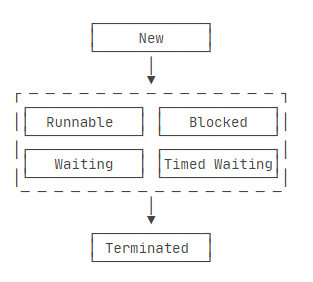
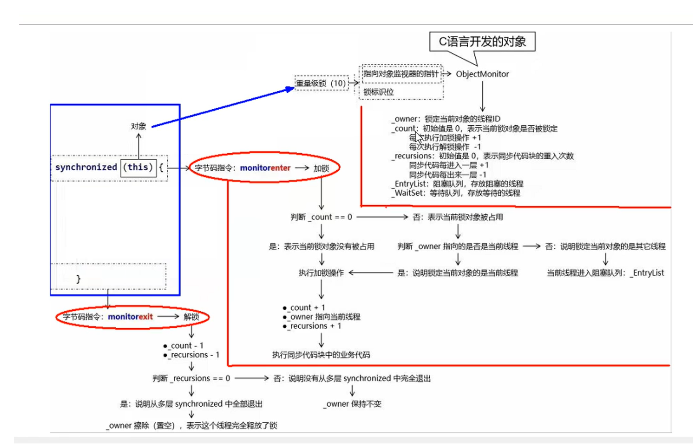

# Java并发编程

---
tags: [Java, 并发编程, 多线程, 线程池, synchronized, volatile, CAS, JUC]
created: 2026-02-21
updated: 2026-02-21
status: 已掌握
importance: ⭐⭐⭐⭐⭐
---

## 🎯 核心要点
> Java并发编程的核心概念和实现机制

- **线程创建**：继承Thread、实现Runnable、实现Callable三种方式
- **线程同步**：synchronized、volatile、Lock机制保证线程安全
- **线程池**：ThreadPoolExecutor七大参数控制线程执行
- **CAS机制**：无锁编程，解决并发问题的重要手段
- **JMM模型**：Java内存模型，理解并发编程的理论基础

## 💡 原理详解

### 1. 线程基础

#### 线程创建方式
1. **继承Thread类**
2. **实现Runnable接口**
3. **实现Callable接口**（支持返回值和异常）

#### 线程状态


- **New**：新创建的线程，尚未执行
- **Runnable**：运行中的线程，正在执行run()方法
- **Blocked**：运行中的线程，因某些操作被阻塞而挂起
- **Waiting**：运行中的线程，因某些操作在等待中
- **Timed Waiting**：运行中的线程，因执行sleep()方法正在计时等待
- **Terminated**：线程已终止，因为run()方法执行完毕

#### 常用方法
1. **start()**：启动线程，进入排队状态等待CPU调度
2. **run()**：执行线程任务
3. **sleep()**：暂停执行，让出CPU但不释放锁
4. **wait()**：释放锁，等待其他线程唤醒
5. **yield()**：让出CPU资源
6. **join()**：阻塞其他线程，直到当前线程结束

### 2. 线程池

#### ThreadPoolExecutor七大参数
1. **corePoolSize**：核心线程数，线程池中始终存活的线程数
2. **maximumPoolSize**：最大线程数，线程池中允许的最大线程数
3. **keepAliveTime**：存活时间，线程没有任务时最多保持多久会终止
4. **unit**：时间单位，keepAliveTime的时间单位
5. **workQueue**：阻塞队列，存储等待执行的任务
6. **threadFactory**：线程工厂，用于创建线程
7. **handler**：拒绝策略，队列满时的处理策略

#### 执行流程
1. 提交任务时，如果核心线程数未满，创建核心线程执行
2. 核心线程满了，任务放入阻塞队列
3. 队列满了，创建非核心线程执行
4. 线程数达到最大值，执行拒绝策略

#### 常用线程池
- **FixedThreadPool**：固定线程数
- **CachedThreadPool**：缓存线程池，线程数可变
- **SingleThreadExecutor**：单线程池
- **ScheduledThreadPool**：定时任务线程池

### 3. 同步机制

#### synchronized关键字

##### 同步代码块
```java
synchronized (object) {
    // 同步代码
}
```
编译后生成monitorenter和monitorexit指令

##### 同步方法
```java
public synchronized void method() {
    // 同步方法
}
```
方法标记ACC_SYNCHRONIZED标志位

##### 底层原理 - Monitor对象
每个对象关联一个monitor对象，包含：
- **_owner**：持有锁的线程ID
- **_WaitSet**：调用wait()方法的线程队列
- **_EntryList**：等待获取锁的线程队列
- **_cxq**：临时阻塞队列
- **count**：重入次数计数



#### volatile关键字

##### 特性
1. **保证可见性**：修改立即刷新到主内存
2. **禁止指令重排序**：通过内存屏障实现
3. **不保证原子性**：复合操作仍需要同步

##### 内存屏障
- **LoadLoad屏障**：禁止读操作重排序
- **StoreStore屏障**：禁止写操作重排序
- **LoadStore屏障**：禁止读写操作重排序
- **StoreLoad屏障**：禁止写读操作重排序

#### ReentrantLock可重入锁

##### 特点
- 支持公平锁和非公平锁
- 支持中断响应
- 支持超时获取锁
- 支持条件变量Condition

##### 与synchronized区别
| 特性 | synchronized | ReentrantLock |
|------|-------------|---------------|
| 锁实现 | JVM实现 | JDK实现 |
| 性能 | 优化后性能好 | 性能好 |
| 功能 | 简单 | 功能丰富 |
| 使用 | 自动释放 | 手动释放 |

### 4. CAS机制

#### 原理
Compare And Swap，比较并交换
- 包含三个参数：内存位置V、预期值A、新值B
- 当且仅当V的值等于A时，才将V的值设为B

#### Unsafe类
提供底层内存操作能力：
- **compareAndSwapInt**：比较并交换int值
- **getAndAddInt**：获取并增加int值
- **putOrderedObject**：有序写入对象引用

#### 存在问题
1. **ABA问题**：值被改变后又改回原值
2. **循环时间长开销大**：自旋消耗CPU
3. **只能保证一个共享变量的原子操作**

#### 原子类
- **基本类型**：AtomicInteger、AtomicLong、AtomicBoolean
- **数组类型**：AtomicIntegerArray、AtomicLongArray
- **引用类型**：AtomicReference、AtomicStampedReference
- **字段更新器**：AtomicIntegerFieldUpdater、AtomicLongFieldUpdater

### 5. JMM内存模型

#### 三大特性
1. **可见性**：一个线程修改的状态对另一个线程是可见的
2. **原子性**：操作不可被中断
3. **有序性**：程序执行的顺序按照代码的先后顺序执行

#### happens-before原则
1. 程序顺序规则
2. 监视器锁规则
3. volatile变量规则
4. 传递性规则
5. 线程启动规则
6. 线程中断规则
7. 线程终结规则
8. 对象终结规则

### 6. 线程中断机制

#### 相关API
- **interrupt()**：设置中断标志位为true
- **isInterrupted()**：返回中断状态
- **interrupted()**：返回并清除中断状态

#### 注意事项
1. 线程不活动时，中断无效果
2. sleep、wait、join方法会抛出InterruptedException
3. 异常抛出时会清除中断标志位，需要重新设置

## 🔧 代码示例

### 线程创建
```java
// 1. 继承Thread
class MyThread extends Thread {
    public void run() {
        System.out.println("Thread running");
    }
}

// 2. 实现Runnable
class MyRunnable implements Runnable {
    public void run() {
        System.out.println("Runnable running");
    }
}

// 3. 实现Callable
class MyCallable implements Callable<String> {
    public String call() throws Exception {
        return "Callable result";
    }
}
```

### 线程池使用
```java
ThreadPoolExecutor executor = new ThreadPoolExecutor(
    2,                      // corePoolSize
    4,                      // maximumPoolSize
    60L,                    // keepAliveTime
    TimeUnit.SECONDS,       // unit
    new LinkedBlockingQueue<>(10), // workQueue
    Executors.defaultThreadFactory(), // threadFactory
    new ThreadPoolExecutor.AbortPolicy() // handler
);
```

### synchronized使用
```java
public class SyncExample {
    private final Object lock = new Object();

    public void syncMethod() {
        synchronized(lock) {
            // 同步代码块
        }
    }

    public synchronized void syncMethod2() {
        // 同步方法
    }
}
```

### volatile使用
```java
public class VolatileExample {
    private volatile boolean flag = false;

    public void setFlag() {
        flag = true; // 立即刷新到主内存
    }

    public boolean getFlag() {
        return flag; // 从主内存读取最新值
    }
}
```

### CAS使用
```java
AtomicInteger atomicInt = new AtomicInteger(0);

// 原子递增
int newValue = atomicInt.incrementAndGet();

// CAS操作
boolean success = atomicInt.compareAndSet(0, 1);
```

## ⚡ 性能特点

| 同步机制 | 性能 | 功能 | 使用场景 |
|---------|------|------|----------|
| synchronized | 高（JVM优化） | 简单 | 一般同步需求 |
| ReentrantLock | 高 | 丰富 | 复杂同步需求 |
| volatile | 很高 | 有限 | 状态标志 |
| CAS | 很高 | 有限 | 简单原子操作 |

## 🔗 知识关联
- **前置知识**：[[Java基础语法#面向对象]]
- **相关技术**：[[Java集合框架#线程安全集合]]
- **实战应用**：[[Java问题解决#并发问题]]
- **底层原理**：[[Java虚拟机#内存模型]]

## 🏷️ 标签
#Java #并发编程 #多线程 #线程池 #synchronized #volatile #CAS #JUC