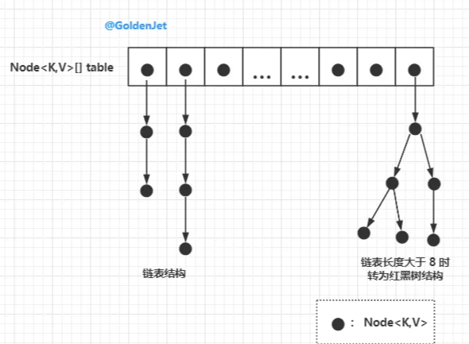
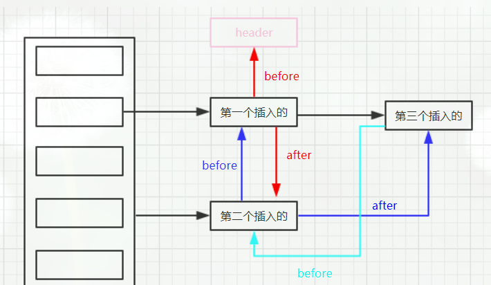

# Java集合框架

---
tags: [Java, 集合框架, ArrayList, HashMap, LinkedList, 数据结构, 核心概念]
created: 2026-02-21
updated: 2026-02-21
status: 已掌握
importance: ⭐⭐⭐⭐⭐
---

## 🎯 核心要点
> Java集合框架的核心数据结构和实现原理

- **ArrayList**：基于数组实现，支持动态扩容，查询快插入删除慢
- **LinkedList**：基于双向链表实现，插入删除快查询慢
- **HashMap**：基于数组+链表+红黑树，无序高效查询
- **LinkedHashMap**：继承HashMap，额外维护双向链表保证有序
- **TreeMap**：基于红黑树实现，支持排序

## 💡 原理详解

### 1. 单列集合：Collection接口

#### List接口实现

##### ArrayList
**数组实现、默认静态空数组**

- 初始化：new出来时是静态空数组，第一次add时直接设置为10
- 扩容机制：当添加第11个元素时，扩容为原长度的1.5倍（length + length>>1）
- 扩容限制：判断是否溢出Integer.MAX_VALUE-8
- 数据复制：通过System.arraycopy复制数据
- 删除操作：调用System.arraycopy方法，影响效率

##### LinkedList
**双向链表实现**

- 结构：每个节点包含数据、前驱指针、后继指针
- 优势：插入删除效率高O(1)
- 劣势：查询需要遍历O(n)

#### Set接口实现

##### HashSet
基于HashMap实现，值作为HashMap的key，value固定为PRESENT对象

##### TreeSet
基于TreeMap实现，支持自定义比较器排序

### 2. 双列集合：Map接口

#### HashMap
**数组+链表+红黑树结构**



**核心参数：**
- 初始容量：16
- 负载因子：0.75f
- 最大容量：2^30（1<<30）
- 扩容阈值：容量 × 负载因子

**扩容机制：**
当元素数量达到阈值时，容量扩大2倍，重新计算所有元素位置

**为什么容量是2的幂次方？**
1. hash(key) % n 等价于 hash(key) & (n-1)，位运算效率更高
2. 扩容时，元素新位置要么是原位置，要么是原位置+旧容量

**链表转红黑树条件：**
- 链表长度 ≥ 8
- 数组长度 ≥ 64
- 红黑树转链表：长度 ≤ 6

选择8和6的原因：中间差值7防止频繁转换

#### LinkedHashMap
**继承HashMap + 双向链表**

- 维护插入顺序或访问顺序
- 通过before/after指针维护链表关系
- 第一个节点head的hash值为-1



#### TreeMap
**红黑树实现**

- 支持自定义比较器进行key排序
- 查询、插入、删除时间复杂度：O(log n)

#### 线程安全的集合

##### CopyOnWriteArrayList
- 通过ReentrantLock保证并发安全
- 写时复制机制，读操作无锁

##### ConcurrentHashMap
**解决HashMap线程安全问题：**

问题1：并发put时可能丢失数据
- 解决：无链表时使用CAS，有链表时对首节点加synchronized锁

问题2：扩容时get可能返回null
- 解决：扩容时标记首节点为MOVED(-1)，其他线程协助扩容

## 🔧 代码示例

### ArrayList基础用法
```java
List<String> list = new ArrayList<>();
list.add("element1");
list.add("element2");
// 扩容演示
for(int i = 0; i < 15; i++) {
    list.add("item" + i); // 第11个元素时触发扩容
}
```

### HashMap基础用法
```java
Map<String, Integer> map = new HashMap<>();
map.put("key1", 1);
map.put("key2", 2);

// 自定义初始容量和负载因子
Map<String, Integer> customMap = new HashMap<>(32, 0.8f);
```

### LinkedHashMap保持顺序
```java
// 保持插入顺序
Map<String, Integer> insertOrderMap = new LinkedHashMap<>();

// 保持访问顺序（LRU缓存基础）
Map<String, Integer> accessOrderMap = new LinkedHashMap<>(16, 0.75f, true);
```

## ⚡ 性能特点

| 集合类型 | 查询 | 插入 | 删除 | 适用场景 |
|---------|------|------|------|----------|
| ArrayList | O(1) | O(n) | O(n) | 频繁随机访问 |
| LinkedList | O(n) | O(1) | O(1) | 频繁插入删除 |
| HashMap | O(1) | O(1) | O(1) | 快速查找 |
| TreeMap | O(log n) | O(log n) | O(log n) | 需要排序 |
| LinkedHashMap | O(1) | O(1) | O(1) | 需要保持顺序 |

## 🔗 知识关联
- **前置知识**：[[Java基础语法#数据类型]]
- **相关技术**：[[Java并发编程#线程安全集合]]
- **实战应用**：[[Java问题解决#集合选择]]
- **底层原理**：[[Java虚拟机#对象内存布局]]

## 🏷️ 标签
#Java #集合框架 #ArrayList #HashMap #LinkedList #数据结构 #核心概念