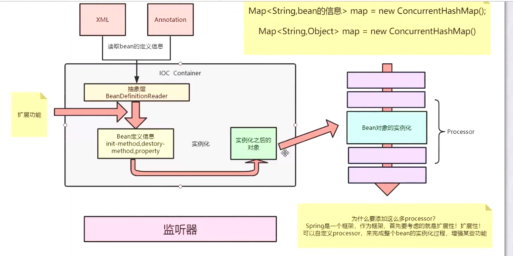
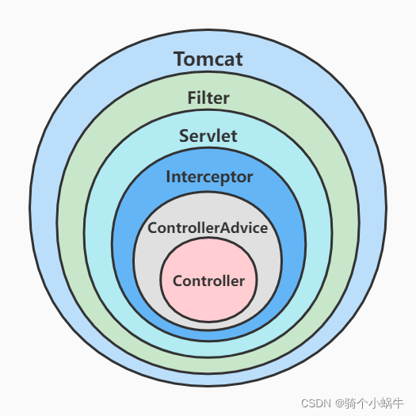
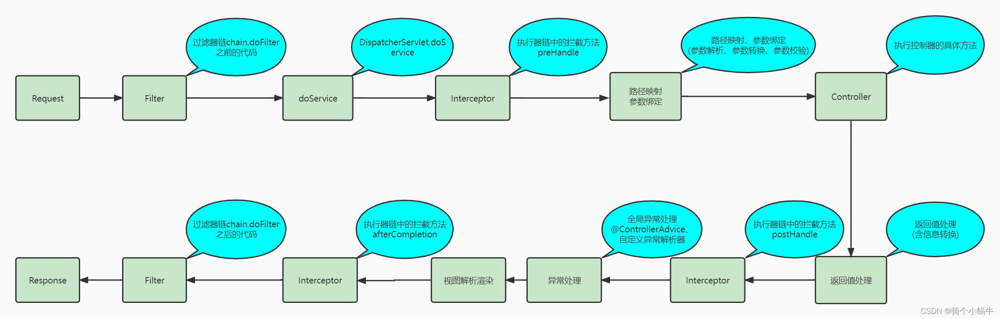
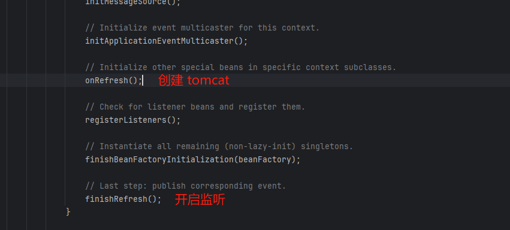
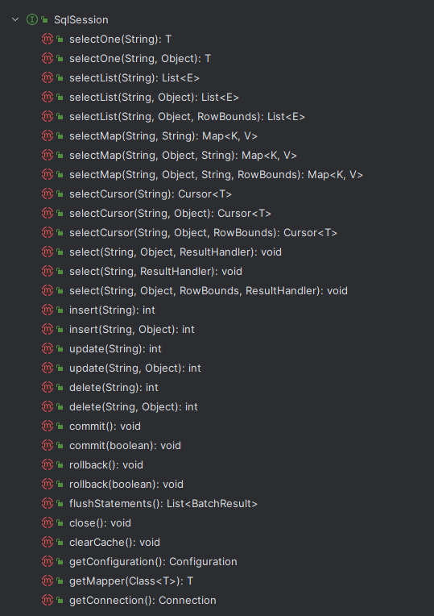

## 注解

# spring框架

## spring 

### 1、IOC 理解

总：

**控制反转：**原来的对象是由使用者进行控制，有了spring之后，就可以把对象交给spring管理

​	       DI：依赖注入，把对应的属性的值通过autowire注入。

**容器：**存放对象，使用map结构存储，在spring中有三级缓存，singletonObj获取完成对象。bean生命周期，有创建到销毁都是由容器来管理的。（bean生命周期）

分：

1、beanfactory、defaultlistablebeanfactory，想bean工厂中设置一些参数，beanpostprocessor

2、加载解析bean对象，创建beandefinition（xml、注解）解析

3、beanfactoryprostprocessor处理，这是扩展点。

4、beanpostprocessor注册功能，方便后续对bean对象挖完成具体的扩展功能

5、通过反射方式，将beandefinition对象生成具体对象

6、bean对象初始化，填充属性，调用aware子类方法、beanprostprocessor前置处理方法、init-method方法、beanpostprocessor后处理器方法

7、生成完成bean对象，通过getbean方法获取

8、销毁过程

### 2、底层实现

反射、工厂、设计模式。

createBeanFactory、getBean、doGetBean、createBean、doCreateBean、newIntance、populateBean、initializingBean

1、通过createBeanFactory创建出bean工厂（definitionlistablebeanfactory）

2、开始循环创建对象、因为bean默认是单例的，先通过getBean、doGetBean从容器中查找，找不到的话

3、在通过createBean、doCreateBean方法，以反射的方式创建对象，一般使用无参的getDeclaredConstructor、newIntance

4、进行对象的属性填充populateBean

5、进行其他的初始化操作initializingBean

### 3、bean的生命周期


1、实例化Bean：反射的方式生成对象

2、填充bean属性：populateBean、可以引发循环依赖问题，三级缓存

3、调用aware接口方法：invokeAwareMethod（完成BeanName、BeanFactory、BeanClassLoader对象的属性设置）

4、调用BeanPostProcessor前置处理器方法：有applicationContextPostProcessor设置applicationcontext、environment、resourceLoader、embeddValueResolver等对象。

5、调用initmethod方法：invokeInitmethod（）判断是否实现了initializingBean接口，有调用afterPropertiesset方法

6、调用BeanPostProcessor的后置处理方法，spring的aop就在此处实现的，abstractAutoProxy

Createor注册destuction相关的回调接口

7、获取完整地对象，通过getBean方式来进行对象的获取

8、销毁流程：1判断是否实现了dispoableBean接口调用destorymethod方法 

### 4、spring循环依赖

三级缓存、提前暴露对象、aop

总：什么事循环依赖，A依赖B、B依赖A

分：先说明bean创建过程：实例化、初始化（填充属性）


```java
// 从上至下 分表代表这“三级缓存”
	private final Map<String, Object> singletonObjects = new ConcurrentHashMap<>(256); //一级缓存
	private final Map<String, Object> earlySingletonObjects = new HashMap<>(16); // 二级缓存
	private final Map<String, ObjectFactory<?>> singletonFactories = new HashMap<>(16); // 三级缓存
```

singletonObjects：用于存放完全初始化好的 bean，从该缓存中取出的 bean 可以直接使用
earlySingletonObjects：提前曝光的单例对象的cache，存放原始的 bean 对象（尚未填充属性），用于解决循环依赖
singletonFactories：单例对象工厂的cache，存放 bean 工厂对象，用于解决循环依赖

1、先创建A对象，实例化A对象，此时B属性为空

2、从容器中查找B对象，如果存在，直接使用，找不到创建B对象

3、实例化B对象，此时B中的A为空，填充属性A

4、从容器中查找A对象，找不到，直接创建

此时，发现A对象存在，但是A是 不完整的状态，只是实例化了出来但未完成初始化，如果在程序的调用过程中，拥有了某个对象的引用，可以在后期给她赋值，可以有限把非完整状态的对象有限赋值，等待后续操作来完成赋值，相当于体现暴露了某个不完整对象的引用。

所以，核心在实例化和初始化操作分开，当所有对象都完成实例化、初始化操作之后，把完整地对象放到容器中。

### 5、beanfactory和factorybean区别

相同点：都是创建bean对象的

不同点：beanfactory创建的时候，必须严格遵循生命周期流程。如果想要自定义对象创建，交给spring来管理，就需要实现factorybean接口。主要有3个方法：

​	isSingleton：是否是单例对象 

​	getObjectType：获取返回对象类型

​	getObject：自定义创建对象的过程（new、反射、动态代理）

### 6、spring中的设计模式

工厂：beanfactory

模板：postprocessorbeanfactory

策略：xmlbeandefinitionreader

### 7、spring aop的底层实现原理

aop是ioc的一个扩展功能，现有ioc，再有aop，在ioc的BeanPostProcessor中对bean进行扩展实现。

1、代理对象的创建过程 advice、切面、切点

2、通过jdk或者cglib方式来生成代理对象

3、在执行方法调用的时候，会调用生成的字节码文件，直接找到拦截方法。

4、根据之前定义好的advice生成拦截器链

5、从拦截器链中依次获取每一个通知开发进行执行，从-1的位置开始查找执行的

### 8、sprinig的事务回滚

spring事务管理是如何实现的？

总：aop实现的，首先生成代理随想，然后按照aop流程来执行具体的操作逻辑，正常通过通知来完成核心功能，但是事务不是通过通知来实现的，是通过transactioninterceptor来实现的，然后调用invoke实现具体逻辑。

分：1、准备工作，解析各个放上事务相关的属性，根据具体的属性来判断是否开始新事务。

​		2、当需要开启时，获取数据库链接，关闭自动提交功能，开启事务

​		3、执行具体的sql逻辑操作

​		4、在操作过程中，失败了，通过completeTransactionAfterThrowing来完成事务的回滚操作，具体逻辑是通过dorollback方法实现，实现时也是先获取连接对象，通过连接 coon.rollback回滚

​		5、执行成功时，通过commitTransactionAfterReturning来完成事务提交操作，具体逻辑由doCommit实现。

​		6、当时吴执行完毕后需要清楚相关的事务信息 cleanupTransactionInfo

### 9、事务的传播特性

一共有7种

总：不同方法嵌套调用的过程中，事务应该如何处理，用一个还是不同事务，出现异常的时候是回滚还是提交，使用的比较多的是required、required_new、nested。

分：1、大概分为 3 类，支持当前事务、不支持当前事务、嵌套事务。

​		2、外层是required，内层是required、required_new、nested。

​		3、外层是required_new，内层是required、required_new、nested。

​		4、外层是nested，内层是required、required_new、nested。

核心逻辑：

1、判断内外方法是否是同一个事务，是：异常统一在外层方法处理 不是：内层方法有可能影响外层方法，但外层影响不到内层。

**REQUIRED**(Spring默认的事务传播类型 required：需要、依赖、依靠)：如果当前没有事务，则自己新建一个事务，如果当前存在事务则加入这个事务
当A调用B的时候：如果A中没有事务，B中有事务，那么B会新建一个事务；如果A中也有事务、B中也有事务，那么B会加入到A中去，变成一个事务，这时，要么都成功，要么都失败。（假如A中有2个SQL，B中有两个SQL，那么这四个SQL会变成一个SQL，要么都成功，要么都失败）

**SUPPORTS**（supports：支持;拥护）:当前存在事务，则加入当前事务，如果当前没有事务，就以非事务方法执行
如果A中有事务，则B方法的事务加入A事务中，成为一个事务（一起成功，一起失败），如果A中没有事务，那么B就以非事务方式运行（执行完直接提交）；

**MANDATORY**（mandatory：强制性的）:当前存在事务，则加入当前事务，如果当前事务不存在，则抛出异常。
如果A中有事务，则B方法的事务加入A事务中，成为一个事务（一起成功，一起失败）；如果A中没有事务，B中有事务，那么B就直接抛异常了，意思是B必须要支持回滚的事务中运行

**REQUIRES_NEW**（requires_new：需要新建）:创建一个新事务，如果存在当前事务，则挂起该事务。
B会新建一个事务，A和B事务互不干扰，他们出现问题回滚的时候，也都只回滚自己的事务；

**NOT_SUPPORTED**（not supported：不支持）:以非事务方式执行,如果当前存在事务，则挂起当前事务
被调用者B会以非事务方式运行（直接提交），如果当前有事务，也就是A中有事务，A会被挂起（不执行，等待B执行完，返回）；A和B出现异常需要回滚，互不影响

**NEVER**（never：从不）: 如果当前没有事务存在，就以非事务方式执行；如果有，就抛出异常。就是B从不以事务方式运行
A中不能有事务，如果没有，B就以非事务方式执行，如果A存在事务，那么直接抛异常

**NESTED**（nested：嵌套的）嵌套事务:如果当前事务存在，则在嵌套事务中执行，否则REQUIRED的操作一样(开启一个事务)
如果A中没有事务，那么B创建一个事务执行，如果A中也有事务，那么B会会把事务嵌套在里面。

### 源码理解

### 流程顺序




## springboot

自动装配、加载过程、springapplication注解

### 1、**核心注解 @SpringBootApplication：**

@ComponentScan扫描当钱包及子包下的所有类

@SpringBootConfiguration 组合了Configuration注解

@EnableAutoConfiguration 自动装配，META-INF/spring.factories文件加载需要自动注入的类

### 2、自动装配原理

在启动springboot项目的main方法的类中，有@SpringBootApplication 注解，包含了一个@EnableAutoConfiguration注解。这个就是自动装配，这个里面又包含了@Import注解，这个注解中引入了 importSelector 接口的类，在对应的selectImport方法中读取 META/INF 目录下的 spring.factories 文件中需要被加载的配置类，通过 spring-autoconfigure-metadata.properties文件做过滤。最后返回的就是需要自动装配的相关对象。

### 3、谈谈对starter的理解

starter作用是在 META/INF目录下提供了一个spring.factories文件，在该文件中添加了一个需要注入到容器中的对应配置类

第三方框架要想整合到springboot中，就需要提供spring.factories文件，相当于启动的同时，启动其他第三方框架。

### 4、常用starter

web，提供了springmvc+tomcat容器

### 5、bootstrap.yml文件作用？

在springcloud环境下支持，一个父容器，在springboot启动前加载初始化操作。

## springMVC


流程：

1、dispatcherServlet表示前端控制器，控制中心，用户发出请求，到这里拦截

2、handlerMapping为处理器映射，根据url查找对应handler

3、返回处理器执行链，根据url查找控制器，并且将解析后的信息传递给dispatcherServlet

4、handeradapter表示处理器适配器，按照特定规则执行handler

5、执行handler找到处理器

6、controller将具体的信息返回给handleradapter，如modelandview

7、由handleradapter传递给dispatcherServlet

8、dispatcherServlet调用视图解析器viewresolver解析modelandview

9、返回view对象给dispatcherServlet

10、调用具体的视图进行渲染

11、相应数据返回给客户端

### http 请求处理

#### 1.SpringBoot一个请求的处理全过程

容器关系图



请求流程图



详细流程图


**流程如下：**

1. tomcat 线程接收到请求，经过一系列调用，调用到 ApplicationFilterChain 的 doFilter 方法，在调用 internalDoFilter 方法，一次执行过滤器链的每个 Filter 的 doFilter

2. 过滤器链的所有 doFilter 执行完毕，控制权交回 ApplicationFilterChain，在经过一系列调用，调用到 DispatcherServlet 的 doDispatch 方法，

   **主要流程：**

   1. DispatcherServlet.getHandler 方法：获取处理执行器链（包含处理器和拦截器链）

   2. DispatcherServlet.getHandlerAdapter 方法：获取处理器适配器

   3. HandlerExecutionChain.applyPreHandle 方法：执行执行器链中的所有拦截器方法 preHandle

   4. AbstractHandlerMethodAdapter.handle 方法：该方法主要包含路径映射、参数 bangd (参数解析、参数转换、参数校验)、调用具体控制器方法、返回值处理（含信息转换）等操作。

      **handle  流程：**

      1. 调用 RequestMappingHandlerAdapter.handleInternal 方法，handleInternal 方法又调用RequestMappingHandlerAdapter.invokeHandlerMethod 方法。

         **invokeHandlerMethod 方法的主要流程：**

         1. 调用 RequestMappingHandlerAdapter.createInvocableHandlerMethod 方法：注册参数解析器、返回值处理器、信息转化器等到 ServletInvocableHandlerMethod 对象实例中。

         2. 调用 ServletInvocableHandlerMethod.invokeAndHandle 方法。

            **invokeAndHandle方法的主要流程：**

            1. 调用InvocableHandlerMethod的invokeForRequest方法，invokeForRequest方法又调用InvocableHandlerMethod的doInvoke方法。

               **doInvoke方法的主要流程：**

               1. 调用InvocableHandlerMethod的getMethodArgumentValues方法：路径映射、参数绑定(参数解析、参数转换、参数校验)。
               2. 调用Method的invoke方法，内部调用DelegatingMethodAccessorImpl的invoke方法，内部调用InvocableHandlerMethod的doInvoke方法，内部调用NativeMethodAccessorImpl的invoke方法，内部调用NativeMethodAccessorImpl的invoke0方法，内部调用具体Controller的具体方法，得到响应结果。

            2. 调用HandlerMethodReturnValueHandlerComposite的handleReturnValue方法：返回值处理（含信息转换）。

   5. 调用HandlerExecutionChain的applyPostHandle方法：执行执行器链中的所有拦截方法postHandle。

   6. 调用DispatcherServlet的processDispatchResult方法。

      **processDispatchResult方法的主要流程：**

      1. 调用DispatcherServlet的processHandlerException方法：异常处理（获取合适的异常解析器处理异常信息，@ControllerAdvice全局异常处理和自定义异常解析器都是在这一步执行的）。
      2. 调用DispatcherServlet的render方法：视图解析渲染。
      3. 调用HandlerExecutionChain的triggerAfterCompletion方法：执行执行器链中的所有拦截方法afterCompletion。

3. 控制权交回ApplicationFilterChain ， 继续执行过滤器链的所有doFIlter之后的代码。

#### 关于全局异常处理

ControllerAdvice作用范围

- 拦截器的preHandle方法、postHandle方法抛出的异常在ControllerAdvice处理范围内，但拦截器的afterCompletion方法抛出的异常不在处理范围内（拦截器的afterCompletion抛出的异常会被直接catch处理，不会往外抛出异常，只会打印错误日志）。

  HandlerExecutionChain类源码

  ```java
  void triggerAfterCompletion(HttpServletRequest request, HttpServletResponse response, @Nullable Exception ex)
  			throws Exception {
  
  		HandlerInterceptor[] interceptors = getInterceptors();
  		if (!ObjectUtils.isEmpty(interceptors)) {
  			for (int i = this.interceptorIndex; i >= 0; i--) {
  				HandlerInterceptor interceptor = interceptors[i];
  				try {
  					interceptor.afterCompletion(request, response, this.handler, ex);
  				}
  				catch (Throwable ex2) {
  					logger.error("HandlerInterceptor.afterCompletion threw exception", ex2);
  				}
  			}
  		}
  	}
  
  ```

- 过滤器抛出的异常不在ControllerAdvice处理范围内。如果要处理过滤器抛出的异常，可以自定义Filter并放在过滤链的最前面，catch处理异常。

多 ControllerAdvice 优先级问题

- 多个使用@ControllerAdvice 的Bean按执行顺序（通过Order注解设置执行顺序，值越小月优先执行）依次执行
- 当某个Bean的方法匹配上异常时，进行异常处理，直接返回，后续的方法和Bean不在执行。

## 环境搭建

### 源码版本 2.2.9

下载、maven 编译、打开项目、pom 检查 添加<disable.checks>true</disable.checks>

1.新建测试 model，创建 application

2.创建testcontroller 打印源码启动成功

3.启动，测试访问，无问题，启动成功

### pom 中 parent 属性都有什么

```xml
<!--属性定义-->
<properties>
	<main.basedir>${basedir}/../../..</main.basedir>
	<java.version>1.8</java.version>
	...
</properties>
<build>
    <!--资源位置、过滤-->
    <resources>
        <resource>
            <directory>${basedir}/src/main/resources</directory>
            <filtering>true</filtering>
            <!--配置文件位置-->
            <includes>
                <include>**/application*.yml</include>
                <include>**/application*.yaml</include>
                <include>**/application*.properties</include>
            </includes>
        </resource>
        <resource>
            ...
        </resource>
    </resources>
    <pluginManagement>
        <!--插件管理、编译、配置等等-->
        <plugins>
            <plugin>
           	...
            </plugin>
        </plugins>       
    </pluginManagement>
```

### start-web 分析

```xml
<dependency>
    <groupId>org.springframework.boot</groupId>
    <artifactId>spring-boot-starter-web</artifactId>
</dependency>
```

进入 spring-boot-starter-web.pom 中，常用的 web 相关的都有引入，如 tomcat

```xml
<dependency>
    <groupId>org.springframework.boot</groupId>
    <artifactId>spring-boot-starter</artifactId>
</dependency>
<dependency>
    <groupId>org.springframework.boot</groupId>
    <artifactId>spring-boot-starter-tomcat</artifactId>
</dependency>
<dependency>
    <groupId>org.springframework.boot</groupId>
    <artifactId>spring-boot-starter-validation</artifactId>
    <exclusions>
        <exclusion>
            <groupId>org.apache.tomcat.embed</groupId>
            <artifactId>tomcat-embed-el</artifactId>
        </exclusion>
    </exclusions>
</dependency>
<dependency>
    <groupId>org.springframework</groupId>
    <artifactId>spring-web</artifactId>
</dependency>
<dependency>
    <groupId>org.springframework</groupId>
    <artifactId>spring-webmvc</artifactId>
</dependency>
```

## 自动配置

核心启动类

```java
@SpringBootApplication
public class MytestApplication {
	public static void main(String[] args) {
		SpringApplication.run(MytestApplication.class, args);
	}
}
```

### @SpringBootApplication


#### @EnableAutoConfiguration

spring 中以 Enable 开头的注解，作用是借助 @Import 手机并注册特定场景相关的 Bean，并加载到 IOC 容器。


@AutoConfigurationPackage


Registrar 类

```java
static class Registrar implements ImportBeanDefinitionRegistrar, DeterminableImports {

    @Override
    public void registerBeanDefinitions(AnnotationMetadata metadata, BeanDefinitionRegistry registry) {
        // 将注解标注的元信息传入 获取到相应的包名
        register(registry, new PackageImport(metadata).getPackageName());
    }

    @Override
    public Set<Object> determineImports(AnnotationMetadata metadata) {
        return Collections.singleton(new PackageImport(metadata));
    }

}
```

regist 方法

```java
public static void register(BeanDefinitionRegistry registry, String... packageNames) {
    if (registry.containsBeanDefinition(BEAN)) {
        // 如果注册 则将包名添加进去
        BeanDefinition beanDefinition = registry.getBeanDefinition(BEAN);
        ConstructorArgumentValues constructorArguments = beanDefinition.getConstructorArgumentValues();
        constructorArguments.addIndexedArgumentValue(0, addBasePackages(constructorArguments, packageNames));
    }
    else {
        // 未注册 先注册 包名会被设置进去
        GenericBeanDefinition beanDefinition = new GenericBeanDefinition();
        beanDefinition.setBeanClass(BasePackages.class);
        beanDefinition.getConstructorArgumentValues().addIndexedArgumentValue(0, packageNames);
        beanDefinition.setRole(BeanDefinition.ROLE_INFRASTRUCTURE);
        registry.registerBeanDefinition(BEAN, beanDefinition);
    }
}
```

最终做的就是将 BasePackages 这个类注册进去，并保存包名，供其他包使用

#### @Import(AutoConfigurationImportSelector.class)

**ImportSelector 接口**

决定可引入哪些 @Configuration


整体流程


代码注释

```java
@Override
public String[] selectImports(AnnotationMetadata annotationMetadata) {
    // 检查自动配置功能是否开启，默认为开启
    if (!isEnabled(annotationMetadata)) {
        return NO_IMPORTS;
    }
    // 封装将被引入的自动配置信息
    AutoConfigurationEntry autoConfigurationEntry = getAutoConfigurationEntry(annotationMetadata);
    // 返回符合条件的配置类的全限定名数组
    return StringUtils.toStringArray(autoConfigurationEntry.getConfigurations());
}

/**
	 * 根据导入@Configuration类的AnnotationMetadata返回AutoConfigurationImportSelector.AutoConfigurationEntry。
	 * @param 配置类的注解元数据。
	 * @return 应该导入的自动配置。
	 */
protected AutoConfigurationEntry getAutoConfigurationEntry(AnnotationMetadata annotationMetadata) {
    if (!isEnabled(annotationMetadata)) {
        return EMPTY_ENTRY;
    }
    // 从AnnotationMetadata返回适当的AnnotationAttributes。默认情况下，此方法将返回getAnnotationClass()的属性。
    AnnotationAttributes attributes = getAttributes(annotationMetadata);
    // 通过 SpringFactoriesLoader 类提供的方法加载类路径中META-INF目录下的
    // spring.factories文件中针对 EnableAutoConfiguration 的注解配置类
    List<String> configurations = getCandidateConfigurations(annotationMetadata, attributes);
    // 对获得的注解配置类集合进行去重处理，防止多个项目引入同样的配置类
    configurations = removeDuplicates(configurations);
    // 获得注解中被 exclude 或 excludeName 所排除的类的集合
    Set<String> exclusions = getExclusions(annotationMetadata, attributes);
    // 检查被排除类是否可实例化，是否被自动注册配置所使用，不符合条件则抛出异常
    checkExcludedClasses(configurations, exclusions);
    // 从自动配置类集合中去除被排除的类
    configurations.removeAll(exclusions);
    // 检查配置类的注解是否符合 spring.factories 文件中 AutoConfigurationImportFilter 指定的注解检查条件
    configurations = getConfigurationClassFilter().filter(configurations);
    // 将筛选完成的配置类和排除的配置类构建为事件类，并传入监听器。监听器的配置在于 spring.factories 文件中，通过 AutoConfigurationImportListener 指定
    fireAutoConfigurationImportEvents(configurations, exclusions);
    // 创建并返回一个条目，其中包含了筛选完成的配置类和排除的配置
    return new AutoConfigurationEntry(configurations, exclusions);
}
```

疑问：为什么实现 DeferredImportSelector 接口，而不是 ImportSelector？

- **延迟导入**：DeferredImportSelector 具有延迟导入的能力，可以在所有的 @Configuration 类都被处理完毕之后再进行选择和导入。这样可以在整个配置加载过程完成后再根据某些条件或规则来决定要导入哪些类，从而实现更加动态和灵活的自动配置机制。
- **自定义扩展**：通过实现 DeferredImportSelector 接口，开发人员可以更方便地扩展和定制自动配置逻辑。可以根据实际需求重写相应方法，实现自定义的自动配置规则和行为。

### 自定义starter

理解：springboot 通过自动扫描 starter 配置信息，可以自动加载默认配置，不用在去手写。

同时可自定义 starter，满足自己模块的配置，使用时引入，就不用每个地方复制了。

命名规则：xxx-spring-boot-starter，用以区分

#### 实现

1.新建 maven jar 工程

pom 导入依赖

```shell
    <dependencies>
        <dependency>
            <groupId>org.springframework.boot</groupId>
            <artifactId>spring-boot-autoconfigure</artifactId>
        </dependency>
    </dependencies>
```

2.创建 javaBean

就是你需要封装的那些配置

```java
package com.demo;

import org.springframework.boot.context.properties.ConfigurationProperties;
import org.springframework.boot.context.properties.EnableConfigurationProperties;

@ConfigurationProperties(prefix = "starter")
@EnableConfigurationProperties(StarterBean.class)
public class StarterBean {
    private int id ;
    private String name;

    public int getId() {
        return id;
    }

    public void setId(int id) {
        this.id = id;
    }

    public String getName() {
        return name;
    }

    public void setName(String name) {
        this.name = name;
    }
}
```

3.编写配置类 MyAutoConfiguration

```java
package com.demo;

import org.springframework.context.annotation.Bean;
import org.springframework.context.annotation.Configuration;

@Configuration
public class MyAutoConfiguration {
    static {
        System.out.println("MyAutoConfiguration init...");
    }

    @Bean
    public StarterBean starterBean() {
        return new StarterBean();
    }
}
```

4.resources 下创建 /META-INF/spring.factories 文件

写入配置，让 spring 启动时加载 bean 到 ioc 容器中

```java
org.springframework.boot.autoconfigure.EnableAutoConfiguration=\
  com.demo.MyAutoConfiguration
```

#### 使用

1.pom 引入自定义 starter

```java
<dependency>
    <groupId>com.wxkjwlw.device</groupId>
    <artifactId>starter</artifactId>
    <version>0.0.1-SNAPSHOT</version>
</dependency>
```

2.application 中修改，不修改则使用默认

```java
starter:
  id: 1
  name: adoifa
```

3.注入使用

```java
@Autowired
StarterBean starterBean;

@PostConstruct
void sss() {
    System.out.println("--------自动导入");
    System.out.println(starterBean.toString());
}
```

结果：


#### 热插拔

重点是 @ConditionalOnBean(ConfigMarker.class) 这个注解

当有上下文种有注解的这个对象时，才会生效。

```
if（Bean have ConfigMarker）{
	执行导入注解的类
}
```

改造如下

1.创建 ConfigMarker 只用做标记

```
class ConfigMarker {}
```

2.自定义注解通过 @Import 导入标记类

```java
@Import(ConfigMarker.class)
@Target({ElementType.TYPE})
@Retention(RetentionPolicy.RUNTIME)
@interface EnableRegisterServer{}
```

3.在需要的地方 引入自定义注解 EnableRegisterServer，这样上下文中引入了 ConfigMarker ，@ConditionalOnBean 会生效

```java
@EnableRegisterServer
public class TaskService {}
```

## 请求接受处理

### web 服务器启动（tomcat）

spring 内嵌 tomcat（可修改为 netty），可作为服务的容器，处理请求。

tomcat 是 pom 中引入 spring-boot-starter-web 中引入的

```java
<dependency>
    <groupId>org.springframework.boot</groupId>
    <artifactId>spring-boot-starter-web</artifactId>
</dependency>
包含关系
<dependency>
    <groupId>org.springframework.boot</groupId>
    <artifactId>spring-boot-starter-tomcat</artifactId>
    <version>2.7.3</version>
</dependency>
```

java 和 tomcat 线程池差异如下：

在核心线程满了的情况下，接下来的处理方式不同

- java 去排队，排队满了开新线程处理。

- tomcat 去开新线程，满了在排队。

java 线程池


tomcat 线程池


#### 启动

关键的类 ServletWebServerApplicationContext

这个上下文，用于网络相关的类的实例化，tomcat、dispatchservlet 等都是在这里进行实例化。

最上层有 factorybean 接口，入口就是 refresh()，onRefresh() 实例化 bean，finishRefresh() 启动等。

> 一个 WebApplicationContext ，可用于从包含 ServletWebServerFactory 的 Bean 引导自身。
> 此上下文将通过在自身中ApplicationContext搜索单个 ServletWebServerFactory Bean 来创建、初始化和运行。WebServer可以ServletWebServerFactory自由使用标准的 Spring 概念（例如依赖注入、生命周期回调和属性占位符变量）。
> 此外，在上下文中定义的任何 Servlet or Filter bean 都将自动注册到 Web 服务器。对于单个 Servlet bean，将使用 '/' 映射。如果找到多个 Servlet bean，则将使用小写的 Bean 名称作为映射前缀。任何名为 'dispatcherServlet' 的 Servlet 将始终映射到 '/'。过滤器 bean 将映射到所有 URL （'/*'）。
> 对于更高级的配置，上下文可以改为定义实现接口 ServletContextInitializer 的 bean（最常见的 ServletRegistrationBean是 s 和/或 FilterRegistrationBeans）。为了防止重复注册，使用 ServletContextInitializer Bean 将禁用自动 Servlet 和 Filter Bean 注册。
> 尽管可以直接使用此上下文，但大多数开发人员应考虑使用 AnnotationConfigServletWebServerApplicationContext or XmlServletWebServerApplicationContext 变体。
> 因为：
> 2.0.0
> 另请参见：
> AnnotationConfigServletWebServerApplicationContext, XmlServletWebServerApplicationContext, ServletWebServerFactory
> 作者：
> 菲利普·韦伯、戴夫·西尔、斯科特·弗雷德里克

类图


关键类和代码，入口

```java
public abstract class AbstractApplicationContext extends DefaultResourceLoader
		implements ConfigurableApplicationContext {

	@Override
	public void refresh() throws BeansException, IllegalStateException {
		synchronized (this.startupShutdownMonitor) {
			StartupStep contextRefresh = this.applicationStartup.start("spring.context.refresh");

			// Prepare this context for refreshing.
			prepareRefresh();

			// Tell the subclass to refresh the internal bean factory.
			ConfigurableListableBeanFactory beanFactory = obtainFreshBeanFactory();

			// Prepare the bean factory for use in this context.
			prepareBeanFactory(beanFactory);

			try {
				// Allows post-processing of the bean factory in context subclasses.
				postProcessBeanFactory(beanFactory);

				StartupStep beanPostProcess = this.applicationStartup.start("spring.context.beans.post-process");
				// Invoke factory processors registered as beans in the context.
				invokeBeanFactoryPostProcessors(beanFactory);

				// Register bean processors that intercept bean creation.
				registerBeanPostProcessors(beanFactory);
				beanPostProcess.end();

				// Initialize message source for this context.
				initMessageSource();

				// Initialize event multicaster for this context.
				initApplicationEventMulticaster();

				// Initialize other special beans in specific context subclasses.
				onRefresh();

				// Check for listener beans and register them.
				registerListeners();

				// Instantiate all remaining (non-lazy-init) singletons.
				finishBeanFactoryInitialization(beanFactory);

				// Last step: publish corresponding event.
				finishRefresh();
			}

			catch (BeansException ex) {
				if (logger.isWarnEnabled()) {
					logger.warn("Exception encountered during context initialization - " +
							"cancelling refresh attempt: " + ex);
				}

				// Destroy already created singletons to avoid dangling resources.
				destroyBeans();

				// Reset 'active' flag.
				cancelRefresh(ex);

				// Propagate exception to caller.
				throw ex;
			}

			finally {
				// Reset common introspection caches in Spring's core, since we
				// might not ever need metadata for singleton beans anymore...
				resetCommonCaches();
				contextRefresh.end();
			}
		}
	}
}
```

关键方法如下



启动流程（通 ServletWebServerFactoryAutoConfiguration 类自动配置 tomcat。）


```java
class ServletWebServerApplicationContext extends GenericWebApplicationContext
		implements ConfigurableWebServerApplicationContext {
	// 重写 refresh 创建 bean
	@Override
	protected void onRefresh() {
		super.onRefresh();
		try {
			createWebServer();
		}
		catch (Throwable ex) {
			throw new ApplicationContextException("Unable to start web server", ex);
		}
	}
	
	private void createWebServer() {
		WebServer webServer = this.webServer;
		ServletContext servletContext = getServletContext();
		if (webServer == null && servletContext == null) {
			StartupStep createWebServer = this.getApplicationStartup().start("spring.boot.webserver.create");
			// 获取 factory tomcat 是 TomcatServletWebServerFactory
			ServletWebServerFactory factory = getWebServerFactory();
			createWebServer.tag("factory", factory.getClass().toString());
			// 通过 factory 创建 bean 
			this.webServer = factory.getWebServer(getSelfInitializer());
			createWebServer.end();
			getBeanFactory().registerSingleton("webServerGracefulShutdown",
					new WebServerGracefulShutdownLifecycle(this.webServer));
			getBeanFactory().registerSingleton("webServerStartStop",
					new WebServerStartStopLifecycle(this, this.webServer));
		}
		else if (servletContext != null) {
			try {
				getSelfInitializer().onStartup(servletContext);
			}
			catch (ServletException ex) {
				throw new ApplicationContextException("Cannot initialize servlet context", ex);
			}
		}
		initPropertySources();
	}
}
```

```java
class TomcatServletWebServerFactory{
	@Override
	public WebServer getWebServer(ServletContextInitializer... initializers) {
		if (this.disableMBeanRegistry) {
			Registry.disableRegistry();
		}
		Tomcat tomcat = new Tomcat();
		File baseDir = (this.baseDirectory != null) ? this.baseDirectory : createTempDir("tomcat");
		tomcat.setBaseDir(baseDir.getAbsolutePath());
		for (LifecycleListener listener : this.serverLifecycleListeners) {
			tomcat.getServer().addLifecycleListener(listener);
		}
		Connector connector = new Connector(this.protocol);
		connector.setThrowOnFailure(true);
		tomcat.getService().addConnector(connector);
		customizeConnector(connector);
		tomcat.setConnector(connector);
		tomcat.getHost().setAutoDeploy(false);
		configureEngine(tomcat.getEngine());
		for (Connector additionalConnector : this.additionalTomcatConnectors) {
			tomcat.getService().addConnector(additionalConnector);
		}
		prepareContext(tomcat.getHost(), initializers);
		return getTomcatWebServer(tomcat);
	}
	
	// 创建 tomcatwebserver
	protected TomcatWebServer getTomcatWebServer(Tomcat tomcat) {
		return new TomcatWebServer(tomcat, getPort() >= 0, getShutdown());
	}
}
```

```java
public class TomcatWebServer implements WebServer {
    
    // 构造方法
	public TomcatWebServer(Tomcat tomcat, boolean autoStart, Shutdown shutdown) {
		Assert.notNull(tomcat, "Tomcat Server must not be null");
		this.tomcat = tomcat;
		this.autoStart = autoStart;
		this.gracefulShutdown = (shutdown == Shutdown.GRACEFUL) ? new GracefulShutdown(tomcat) : null;
		initialize();
	}

    // 后续处理 启动
	private void initialize() throws WebServerException {
		logger.info("Tomcat initialized with port(s): " + getPortsDescription(false));
		synchronized (this.monitor) {
			try {
				addInstanceIdToEngineName();

				Context context = findContext();
				context.addLifecycleListener((event) -> {
					if (context.equals(event.getSource()) && Lifecycle.START_EVENT.equals(event.getType())) {
						// Remove service connectors so that protocol binding doesn't
						// happen when the service is started.
						removeServiceConnectors();
					}
				});

				// Start the server to trigger initialization listeners
				this.tomcat.start();

				// We can re-throw failure exception directly in the main thread
				rethrowDeferredStartupExceptions();

				try {
					ContextBindings.bindClassLoader(context, context.getNamingToken(), getClass().getClassLoader());
				}
				catch (NamingException ex) {
					// Naming is not enabled. Continue
				}

				// Unlike Jetty, all Tomcat threads are daemon threads. We create a
				// blocking non-daemon to stop immediate shutdown
				startDaemonAwaitThread();
			}
			catch (Exception ex) {
				stopSilently();
				destroySilently();
				throw new WebServerException("Unable to start embedded Tomcat", ex);
			}
		}
	}
}
```

factory 的三个实例（三种 web 服务容器）


创建流程：

spring bean -> ServletWebServerApplicationContext类中 createWebServer 创建  ->  调用 factory 生产 webserver -> 至于创建 tomcat 还是 netty，根据 pom 的引入决定 -> factory 通过 getWebServer 创建实例（Tomcat tomcat = new Tomcat()） -> 创建 TomcatWebServer initialize() 中 start -> tomcat 启动（初始化完成，如下一输出 initialized） 


监听流程：

2.2.9 版本，bean 创建完成后，在 finishrefresh 中启动 servlet

```java
public class ServletWebServerApplicationContext extends GenericWebApplicationContext
		implements ConfigurableWebServerApplicationContext {
	@Override
	protected void finishRefresh() {
		super.finishRefresh();
		WebServer webServer = startWebServer();
		if (webServer != null) {
			publishEvent(new ServletWebServerInitializedEvent(webServer, this));
		}
	}

	private WebServer startWebServer() {
		WebServer webServer = this.webServer;
		if (webServer != null) {
			webServer.start();
		}
		return webServer;
	}
}
```

```java
public class TomcatWebServer implements WebServer {	
    
    @Override
	public void start() throws WebServerException {
		synchronized (this.monitor) {
			if (this.started) {
				return;
			}
			try {
				addPreviouslyRemovedConnectors();
				Connector connector = this.tomcat.getConnector();
				if (connector != null && this.autoStart) {
					performDeferredLoadOnStartup();
				}
				checkThatConnectorsHaveStarted();
				this.started = true;
				logger.info("Tomcat started on port(s): " + getPortsDescription(true) + " with context path '"
						+ getContextPath() + "'");
			}
			catch (ConnectorStartFailedException ex) {
				stopSilently();
				throw ex;
			}
			catch (Exception ex) {
				PortInUseException.throwIfPortBindingException(ex, () -> this.tomcat.getConnector().getPort());
				throw new WebServerException("Unable to start embedded Tomcat server", ex);
			}
			finally {
				Context context = findContext();
				ContextBindings.unbindClassLoader(context, context.getNamingToken(), getClass().getClassLoader());
			}
		}
	}
}
```

2.7.3 版本不一致，引入了 Lifecycle 感知 server 的 start、stop（类似 Android 的 activity 的生命周期）

调用栈


```java
public abstract class AbstractApplicationContext extends DefaultResourceLoader
		implements ConfigurableApplicationContext {
    	
    protected void finishRefresh() {
		// Clear context-level resource caches (such as ASM metadata from scanning).
		clearResourceCaches();

		// Initialize lifecycle processor for this context.
		initLifecycleProcessor();

		// Propagate refresh to lifecycle processor first.
        // 通过改方法去调用刷新
		getLifecycleProcessor().onRefresh();

		// Publish the final event.
		publishEvent(new ContextRefreshedEvent(this));

		// Participate in LiveBeansView MBean, if active.
		if (!NativeDetector.inNativeImage()) {
			LiveBeansView.registerApplicationContext(this);
		}
	}
}

```

```java
public class DefaultLifecycleProcessor implements LifecycleProcessor, BeanFactoryAware {
    
	@Override
	public void onRefresh() {
        // 调用 start
		startBeans(true);
		this.running = true;
	}

	private void startBeans(boolean autoStartupOnly) {
		Map<String, Lifecycle> lifecycleBeans = getLifecycleBeans();
		Map<Integer, LifecycleGroup> phases = new TreeMap<>();

		lifecycleBeans.forEach((beanName, bean) -> {
			if (!autoStartupOnly || (bean instanceof SmartLifecycle && ((SmartLifecycle) bean).isAutoStartup())) {
				int phase = getPhase(bean);
				phases.computeIfAbsent(
						phase,
						p -> new LifecycleGroup(phase, this.timeoutPerShutdownPhase, lifecycleBeans, autoStartupOnly)
				).add(beanName, bean);
			}
		});
		if (!phases.isEmpty()) {
            // 遍历调用 start
			phases.values().forEach(LifecycleGroup::start);
		}
	}
    
    public void start() {
        if (this.members.isEmpty()) {
            return;
        }
        if (logger.isDebugEnabled()) {
            logger.debug("Starting beans in phase " + this.phase);
        }
        Collections.sort(this.members);
        for (LifecycleGroupMember member : this.members) {
            // 真实执行的方法
            doStart(this.lifecycleBeans, member.name, this.autoStartupOnly);
        }
	}
    
    private void doStart(Map<String, ? extends Lifecycle> lifecycleBeans, String beanName, boolean autoStartupOnly) {
		Lifecycle bean = lifecycleBeans.remove(beanName);
		if (bean != null && bean != this) {
			String[] dependenciesForBean = getBeanFactory().getDependenciesForBean(beanName);
			for (String dependency : dependenciesForBean) {
				doStart(lifecycleBeans, dependency, autoStartupOnly);
			}
			if (!bean.isRunning() &&
					(!autoStartupOnly || !(bean instanceof SmartLifecycle) || ((SmartLifecycle) bean).isAutoStartup())) {
				if (logger.isTraceEnabled()) {
					logger.trace("Starting bean '" + beanName + "' of type [" + bean.getClass().getName() + "]");
				}
				try {
                    // 真实的start
					bean.start();
				}
				catch (Throwable ex) {
					throw new ApplicationContextException("Failed to start bean '" + beanName + "'", ex);
				}
				if (logger.isDebugEnabled()) {
					logger.debug("Successfully started bean '" + beanName + "'");
				}
			}
		}
	}
}
```

```java
class WebServerStartStopLifecycle implements SmartLifecycle {
    
    @Override
	public void start() {
		this.webServer.start();
		this.running = true;
		this.applicationContext
				.publishEvent(new ServletWebServerInitializedEvent(this.webServer, this.applicationContext));
	}
}
```

```java
public class TomcatWebServer implements WebServer {
    
    // 最终调用
    @Override
	public void start() throws WebServerException {
		synchronized (this.monitor) {
			if (this.started) {
				return;
			}
			try {
				addPreviouslyRemovedConnectors();
				Connector connector = this.tomcat.getConnector();
				if (connector != null && this.autoStart) {
					performDeferredLoadOnStartup();
				}
				checkThatConnectorsHaveStarted();
				this.started = true;
				logger.info("Tomcat started on port(s): " + getPortsDescription(true) + " with context path '"
						+ getContextPath() + "'");
			}
			catch (ConnectorStartFailedException ex) {
				stopSilently();
				throw ex;
			}
			catch (Exception ex) {
				PortInUseException.throwIfPortBindingException(ex, () -> this.tomcat.getConnector().getPort());
				throw new WebServerException("Unable to start embedded Tomcat server", ex);
			}
			finally {
				Context context = findContext();
				ContextBindings.unbindClassLoader(context, context.getNamingToken(), getClass().getClassLoader());
			}
		}
	}
}
```

最后的输出如下：


### 响应请求

SpringMVC 处理和响应请求。

#### DispatcherServlet 前置控制器。

拦截匹配的请求，交给对应的 Controller 处理。

> 请求接收：DispatcherServlet接收客户端发送的请求，并将其封装为HttpServletRequest对象。
>
> 请求分发：根据请求的URL路径和处理器映射信息，DispatcherServlet将请求分发到相应的处理器（Controller）进行处理。
>
> 处理器调用：DispatcherServlet根据请求的URL路径和处理器映射信息，找到相应的处理器，并调用其相应的方法进行处理。
>
> 视图渲染：处理器处理完请求后，可以返回一个视图名称或一个包含视图名称的ModelAndView对象。DispatcherServlet根据返回的视图名称或ModelAndView对象，找到相应的视图（View）进行渲染，最终将渲染后的结果返回给客户端。
>
> 异常处理：如果在请求处理过程中出现异常，DispatcherServlet会根据异常类型和处理器映射信息，找到相应的异常处理器（ExceptionHandler）进行处理。

DispatcherServlet 实例化后会放到 ioc 容器中，但是如果想要把请求从 tomcat 中拦截到，还需要放到 servlet 中，以前是通过 web.xml 进行配置，把他放到 tomcat 中。servlet 3.0 后（tomcat7 以上），会通过 SPI 扩展机制自动加载。

自动加载过程：

1.容器启动，自动扫描包下 `META-INF\services\javax.servlet.ServletContainerInitializer` 指定类，实例化类（spring-web:5.3.22）


2.实例化后在回调该实现类中的 onStartup 方法，添加到 servlet 容器中

```java
// 伪代码
servletContext.addServlet(name,this.servlet);
```

#### 自动配置类 DispatcherServletAutoConfiguration

主要有 2 个类

1.DispatcherServletConfiguration

创建 DispatcherServlet 类，放入到 spring 的 ioc 容器中

```java
@Configuration(proxyBeanMethods = false)
@Conditional(DefaultDispatcherServletCondition.class)
@ConditionalOnClass(ServletRegistration.class)
@EnableConfigurationProperties(WebMvcProperties.class)
protected static class DispatcherServletConfiguration {

    @Bean(name = DEFAULT_DISPATCHER_SERVLET_BEAN_NAME)
    public DispatcherServlet dispatcherServlet(WebMvcProperties webMvcProperties) {
        DispatcherServlet dispatcherServlet = new DispatcherServlet();
        dispatcherServlet.setDispatchOptionsRequest(webMvcProperties.isDispatchOptionsRequest());
        dispatcherServlet.setDispatchTraceRequest(webMvcProperties.isDispatchTraceRequest());
        dispatcherServlet.setThrowExceptionIfNoHandlerFound(webMvcProperties.isThrowExceptionIfNoHandlerFound());
        dispatcherServlet.setPublishEvents(webMvcProperties.isPublishRequestHandledEvents());
        dispatcherServlet.setEnableLoggingRequestDetails(webMvcProperties.isLogRequestDetails());
        return dispatcherServlet;
    }
	...
}
```

2.DispatcherServletRegistrationConfiguration 

将 DispatcherServlet 对象，添加到 servletContext 中，通过调用 onstartup 方法（DispatcherServletRegistrationBean 负责）

```java
@Configuration(proxyBeanMethods = false)
@Conditional(DispatcherServletRegistrationCondition.class)
@ConditionalOnClass(ServletRegistration.class)
@EnableConfigurationProperties(WebMvcProperties.class)
@Import(DispatcherServletConfiguration.class)
protected static class DispatcherServletRegistrationConfiguration {

	@Bean(name = DEFAULT_DISPATCHER_SERVLET_REGISTRATION_BEAN_NAME)
	@ConditionalOnBean(value = DispatcherServlet.class, name = DEFAULT_DISPATCHER_SERVLET_BEAN_NAME)
	public DispatcherServletRegistrationBean dispatcherServletRegistration(DispatcherServlet dispatcherServlet,
			WebMvcProperties webMvcProperties, ObjectProvider<MultipartConfigElement> multipartConfig) {
		DispatcherServletRegistrationBean registration = new DispatcherServletRegistrationBean(dispatcherServlet,
				webMvcProperties.getServlet().getPath());
		registration.setName(DEFAULT_DISPATCHER_SERVLET_BEAN_NAME);
		registration.setLoadOnStartup(webMvcProperties.getServlet().getLoadOnStartup());
		multipartConfig.ifAvailable(registration::setMultipartConfig);
		return registration;
	}

}
```

DispatcherServletRegistrationBean 类图


调用过程：

和 tomcat 创建的时候一起初始化，在 createWebServer 方法中，有 getSelfInitializer() 方法，通过这个方法实现。

```java
public class ServletWebServerApplicationContext extends GenericWebApplicationContext
		implements ConfigurableWebServerApplicationContext {
    
	private void createWebServer() {
		WebServer webServer = this.webServer;
		ServletContext servletContext = getServletContext();
		if (webServer == null && servletContext == null) {
			StartupStep createWebServer = this.getApplicationStartup().start("spring.boot.webserver.create");
			ServletWebServerFactory factory = getWebServerFactory();
			createWebServer.tag("factory", factory.getClass().toString());
            // 这里进行初始化
			this.webServer = factory.getWebServer(getSelfInitializer());
			createWebServer.end();
			getBeanFactory().registerSingleton("webServerGracefulShutdown",
					new WebServerGracefulShutdownLifecycle(this.webServer));
			getBeanFactory().registerSingleton("webServerStartStop",
					new WebServerStartStopLifecycle(this, this.webServer));
		}
		else if (servletContext != null) {
			try {
				getSelfInitializer().onStartup(servletContext);
			}
			catch (ServletException ex) {
				throw new ApplicationContextException("Cannot initialize servlet context", ex);
			}
		}
		initPropertySources();
	}
    
	private org.springframework.boot.web.servlet.ServletContextInitializer getSelfInitializer() {
		return this::selfInitialize;
	}

	private void selfInitialize(ServletContext servletContext) throws ServletException {
		prepareWebApplicationContext(servletContext);
		registerApplicationScope(servletContext);
		WebApplicationContextUtils.registerEnvironmentBeans(getBeanFactory(), servletContext);
		for (ServletContextInitializer beans : getServletContextInitializerBeans()) {
            // 调用 onStartup 方法
			beans.onStartup(servletContext);
		}
	}
}
```

```java
public abstract class RegistrationBean implements ServletContextInitializer, Ordered {
    @Override
	public final void onStartup(ServletContext servletContext) throws ServletException {
		String description = getDescription();
		if (!isEnabled()) {
			logger.info(StringUtils.capitalize(description) + " was not registered (disabled)");
			return;
		}
		register(description, servletContext);
	}
}
```

```java
public abstract class DynamicRegistrationBean<D extends Registration.Dynamic> extends RegistrationBean {
	@Override
	protected final void register(String description, ServletContext servletContext) {
		D registration = addRegistration(description, servletContext);
		if (registration == null) {
			logger.info(StringUtils.capitalize(description) + " was not registered (possibly already registered?)");
			return;
		}
		configure(registration);
	}
}
```

```java
public class ServletRegistrationBean<T extends Servlet> extends DynamicRegistrationBean<ServletRegistration.Dynamic> {
	@Override
	protected ServletRegistration.Dynamic addRegistration(String description, ServletContext servletContext) {
		String name = getServletName();
        // 通过这里添加到 servlet 容器中
		return servletContext.addServlet(name, this.servlet);
	}
}
```

## 数据连接

### 数据库连接池

```java
<dependency>
    <groupId>org.springframework.boot</groupId>
    <artifactId>spring-boot-starter-jdbc</artifactId>
</dependency>
```

查看 pom，看到 starter 引入的是 HikariCP。


在通过注入的 DataSource 对象，打印日志，可以知道是com.zaxxer.hikari.HikariDataSource。


实例化过程：

1.通过 autoconfiguration 自动配置引入 DataSourceAutoConfiguration


2.DataSourceAutoConfiguration 两个关键 bean 如下：

```java
@AutoConfiguration(before = SqlInitializationAutoConfiguration.class)
@ConditionalOnClass({ DataSource.class, EmbeddedDatabaseType.class })
@ConditionalOnMissingBean(type = "io.r2dbc.spi.ConnectionFactory")
@EnableConfigurationProperties(DataSourceProperties.class)
@Import(DataSourcePoolMetadataProvidersConfiguration.class)
public class DataSourceAutoConfiguration {

	@Configuration(proxyBeanMethods = false)
	@Conditional(EmbeddedDatabaseCondition.class)
	@ConditionalOnMissingBean({ DataSource.class, XADataSource.class })
	@Import(EmbeddedDataSourceConfiguration.class)
	protected static class EmbeddedDatabaseConfiguration {

	}

	@Configuration(proxyBeanMethods = false)
	@Conditional(PooledDataSourceCondition.class)
	@ConditionalOnMissingBean({ DataSource.class, XADataSource.class })
	@Import({ DataSourceConfiguration.Hikari.class, DataSourceConfiguration.Tomcat.class,
			DataSourceConfiguration.Dbcp2.class, DataSourceConfiguration.OracleUcp.class,
			DataSourceConfiguration.Generic.class, DataSourceJmxConfiguration.class })
	protected static class PooledDataSourceConfiguration {

	}
}
```

3.导入 DataSourceConfiguration.Hikari.class

```java
	@Configuration(proxyBeanMethods = false)
	@ConditionalOnClass(HikariDataSource.class)
	@ConditionalOnMissingBean(DataSource.class)
	@ConditionalOnProperty(name = "spring.datasource.type", havingValue = "com.zaxxer.hikari.HikariDataSource",
			matchIfMissing = true)
	static class Hikari {

		@Bean
		@ConfigurationProperties(prefix = "spring.datasource.hikari")
		HikariDataSource dataSource(DataSourceProperties properties) {
			HikariDataSource dataSource = createDataSource(properties, HikariDataSource.class);
			if (StringUtils.hasText(properties.getName())) {
				dataSource.setPoolName(properties.getName());
			}
			return dataSource;
		}

	}
```

4.createDataSource 创建，反射方式

```java
	protected static <T> T createDataSource(DataSourceProperties properties, Class<? extends DataSource> type) {
		return (T) properties.initializeDataSourceBuilder().type(type).build();
	}
```

```java
	public T build() {
		DataSourceProperties<T> properties = DataSourceProperties.forType(this.classLoader, this.type);
		DataSourceProperties<DataSource> deriveFromProperties = getDeriveFromProperties();
		Class<? extends T> instanceType = (this.type != null) ? this.type : properties.getDataSourceInstanceType();
		T dataSource = BeanUtils.instantiateClass(instanceType);
		Set<DataSourceProperty> applied = new HashSet<>();
		for (DataSourceProperty property : DataSourceProperty.values()) {
			String value = this.values.get(property);
			if (value == null && deriveFromProperties != null && properties.canSet(property)) {
				value = deriveFromProperties.get(this.deriveFrom, property);
			}
			if (value != null) {
				properties.set(dataSource, property, value);
				applied.add(property);
			}
		}
		if (!applied.contains(DataSourceProperty.DRIVER_CLASS_NAME)
				&& properties.canSet(DataSourceProperty.DRIVER_CLASS_NAME)
				&& this.values.containsKey(DataSourceProperty.URL)) {
			String url = this.values.get(DataSourceProperty.URL);
			DatabaseDriver driver = DatabaseDriver.fromJdbcUrl(url);
			properties.set(dataSource, DataSourceProperty.DRIVER_CLASS_NAME, driver.getDriverClassName());
		}
		return dataSource;
	}
```

### 其他连接池

如果是 springboot 自带连接池，可以直接读取 DataSourceProperties 的 yaml 配置（连接线程数、等待时间），非自带就需要自己写 DataSourceProperties 否则读取不到配置。

### Druid 使用

pom 依赖

```xml
    <!--引入druid数据源-->
    <dependency>
        <groupId>com.alibaba</groupId>
        <artifactId>druid-spring-boot-starter</artifactId>
        <version>1.2.6</version>
    </dependency>
```

连接池配置

```yaml
spring:
  datasource:
   #数据源基本配置
    username: root
    password: 123456
    driver-class-name: com.mysql.jdbc.Driver
    url: jdbc:mysql://localhost:3306/ssm_crud
    type: com.alibaba.druid.pool.DruidDataSource
   #数据源其他配置
    druid:
      #配置初始化大小、最小、最大线程数
      initialSize: 5
      minIdle: 5
      #CPU核数+1，也可以大些但不要超过20，数据库加锁时连接过多性能下降
      maxActive: 20
     # 最大等待时间，内网：800，外网：1200（三次握手1s）
      maxWait: 60000
      timeBetweenEvictionRunsMillis: 60000
     #配置一个连接在池中最大空间时间，单位是毫秒
      minEvictableIdleTimeMillis: 300000
      validationQuery: SELECT 1 
      testWhileIdle: true
     # 设置从连接池获取连接时是否检查连接有效性，true检查，false不检查
      testOnBorrow: true
      # 设置从连接池归还连接时是否检查连接有效性，true检查，false不检查
      testOnReturn: true
      #可以支持PSCache（提升写入、查询效率）
      poolPreparedStatements: true
      #配置监控统计拦截的filters，去掉后监控界面sql无法统计，'wall'用于防火墙  
      filters: stat,wall,log4j
      maxPoolPreparedStatementPerConnectionSize: 20
      useGlobalDataSourceStat: true  
      connectionProperties: druid.stat.mergeSql=true;druid.stat.slowSqlMillis=500
```

### mybatis

#### SqlSession

接口，对 Connection 的包装，代表与数据库的一次会话，类似于上下文，用于执行 SQL 语句和与数据库进行交互。所以获取到一个 SqlSession 就相当于获取到一个数据库连接，就可以对数据库进行操作。

主要功能：

1. 执行 SQL 语句：通过 SqlSession，你可以执行查询、插入、更新和删除操作。
2. 事务管理：SqlSession 允许你管理事务，例如提交或回滚。
3. 映射器访问：SqlSession 提供了访问 Mapper 接口实例的方法，这些接口定义了与数据库交互的业务逻辑。
4. 缓存管理：MyBatis 拥有自己的一级和二级缓存机制，SqlSession 可以用于管理这些缓存。

使用 SqlSession 时，通常遵循以下步骤：

1. 获取 SqlSession 实例：通过 MyBatis 的 SqlSessionFactory 获取一个 SqlSession 实例。
2. 执行操作：使用 SqlSession 执行所需的数据库操作。
3. 提交或回滚事务：根据操作结果，提交或回滚事务。
4. 关闭 SqlSession：操作完成后，关闭 SqlSession 以释放资源。

方法如图



#### SqlSessionTemplate

是 Mybatis 为了接入 Spring 提供的 Bean。通过 TransactionSynchronizationManager 中的 ThreadLocal<Map<Object, Object>> 保存线程对应的 SqlSession，实现 session 的线程安全。

#### 生成代理对象的过程

通过 @mapperscan 引入 MapperScannerRegistrar 类

该类中的 registerBeanDefinitions 方法注入代码

```java
registry.registerBeanDefinition(beanName, builder.getBeanDefinition());
```

#### 多数据源配置

原理

sqlsession 创建时，会读取 datasource 数据源的配置建立连接，可以自己写代码实现获取的逻辑，从而连接不同的数据库。

mybatis-plus 可直接使用现有插件 dynamic-datasource 进行配置，可配置主从、不同的数据库、等等。

地址：https://github.com/baomidou/dynamic-datasource

核心是 AbstractRoutingDataSource 数据源抽象类，DynamicRoutingDataSource 继承该类，使用 ConcurrentHashMap 存储数据源

```java
    /**
     * 所有数据库
     */
    private final Map<String, DataSource> dataSourceMap = new ConcurrentHashMap<>();
    /**
     * 分组数据库
     */
    private final Map<String, GroupDataSource> groupDataSources = new ConcurrentHashMap<>();
```

pom 引入（版本对应看官方文档）

```xml
<dependency>
    <groupId>com.baomidou</groupId>
    <artifactId>dynamic-datasource-spring-boot-starter</artifactId>
    <version> 3.6.0</version>
</dependency>
```

yaml 配置

```yaml
spring:
  application:
    name: moredata
  datasource:
    dynamic:
      primary: master
      strict: false
      datasource:
        master:
          url: jdbc:mysql://localhost:3306/test
          username: root
          password: root
        slave:
          url: jdbc:mysql://localhost:3306/web3
          username: root
          password: root
server:
  port: 8080
```

server 添加注解指定使用的库，不添加默认使用 master

```java
@Service
@DS("slave")
public class GamefiServiceImpl extends ServiceImpl<GamefiMapper, Gamefi>
    implements GamefiService{

}
```

#### mybatis-plus 分页插件

通过 config 配置，插件自带。

```java
@Configuration
public class MybatisPlusConfig {
    @Bean
    public MybatisPlusInterceptor mybatisPlusInterceptor() {
        MybatisPlusInterceptor interceptor = new MybatisPlusInterceptor();
        interceptor.addInnerInterceptor(new PaginationInnerInterceptor(DbType.MYSQL));
        return interceptor;
    }
}
```

page 类属性

|         属性名         |      类型       |  默认值   |                    描述                     |
| :--------------------: | :-------------: | :-------: | :-----------------------------------------: |
|        records         |     List<T>     | emptyList |                查询数据列表                 |
|         total          |      Long       |     0     |              查询列表总记录数               |
|          size          |      Long       |    10     |            每页显示条数，默认 10            |
|        current         |      Long       |     1     |                   当前页                    |
|         orders         | List<OrderItem> | emptyList |                排序字段信息                 |
|    optimizeCountSql    |     boolean     |   true    |             自动优化 COUNT SQL              |
| optimizeJoinOfCountSql |     boolean     |   true    | 自动优化 COUNT SQL 是否把 join 查询部分移除 |
|      searchCount       |     boolean     |   true    |             是否进行 count 查询             |
|        maxLimit        |      Long       |           |              单页分页条数限制               |
|        countId         |     String      |           |     XML 自定义 count 查询的 statementId     |

上一页、下一页，可以自己集成 page 然后把方法赋值给字段带出这两个。

```java
/**
 * 是否存在上一页
 *
 * @return true / false
 */
public boolean hasPrevious() {
	return this.current > 1;
}

/**
 * 是否存在下一页
 *
 * @return true / false
 */
public boolean hasNext() {
	return this.current < this.getPages();
}
```

## 缓存

spring 3.1 定义 cache、cachemanager 统一缓存，维护抽象层，具体实自己决定。

### 原理

springAOP 拦截，查询时在方法执行前进行判断，有就返回。默认的缓存是本地缓存，使用 ConcurrentHashMap 进行数据缓存。可以通过配置修改第三方中间件缓存（如：redis）

源码分析参考：https://www.jianshu.com/p/c1a22bcc3ac2

1.EnableCaching 注解引入 CachingConfigurationSelector

```java
@Target(ElementType.TYPE)
@Retention(RetentionPolicy.RUNTIME)
@Documented
@Import(CachingConfigurationSelector.class)
public @interface EnableCaching {
    boolean proxyTargetClass() default false;
    AdviceMode mode() default AdviceMode.PROXY;
    int order() default Ordered.LOWEST_PRECEDENCE;
}
```

2.CachingConfigurationSelector 注入

```java
public class CachingConfigurationSelector extends AdviceModeImportSelector<EnableCaching> {
    ......
    
    @Override
    public String[] selectImports(AdviceMode adviceMode) {
        switch (adviceMode) {
            //默认的是PROXY类型的，返回需要支持这个类型需要注入的bean
            case PROXY:
                return getProxyImports();
            case ASPECTJ:
                return getAspectJImports();
            default:
                return null;
        }
    }
    
    private String[] getProxyImports() {
        List<String> result = new ArrayList<>(3);
        //启动aop的注解
        result.add(AutoProxyRegistrar.class.getName());
        //代理配置类，这里会注入，
        // BeanFactoryCacheOperationSourceAdvisor类
        // CacheInterceptor类
        result.add(ProxyCachingConfiguration.class.getName());
        if (jsr107Present && jcacheImplPresent) {
            //注入BeanFactoryJCacheOperationSourceAdvisor
            //JCacheInterceptor类
            result.add(PROXY_JCACHE_CONFIGURATION_CLASS);
        }
        return StringUtils.toStringArray(result);
    }
    ......
}
```

通过父类 AdviceModeImportSelector 导入

```java
    public final String[] selectImports(AnnotationMetadata importingClassMetadata) {
        //获取AdviceModeImportSelector中的注解泛型的Class对象
        Class<?> annType = GenericTypeResolver.resolveTypeArgument(getClass(), AdviceModeImportSelector.class);
        Assert.state(annType != null, "Unresolvable type argument for AdviceModeImportSelector");
        //从传入的importingClassMetadata对象中获取对应的Class类型的注解的内部属性
        AnnotationAttributes attributes = AnnotationConfigUtils.attributesFor(importingClassMetadata, annType);
        if (attributes == null) {
            throw new IllegalArgumentException(String.format(
                    "@%s is not present on importing class '%s' as expected",
                    annType.getSimpleName(), importingClassMetadata.getClassName()));
        }
        //获取属性中的代理类型属性“mode”的值
        AdviceMode adviceMode = attributes.getEnum(getAdviceModeAttributeName());
        //根据代理类型获取需要注入的bean
        String[] imports = selectImports(adviceMode);
        if (imports == null) {
            throw new IllegalArgumentException("Unknown AdviceMode: " + adviceMode);
        }
        return imports;
    }
```

3.注入的 AutoProxyRegistrar、ProxyCachingConfiguration

| bean                        | 作用                                                         |
| --------------------------- | ------------------------------------------------------------ |
| `AutoProxyRegistrar`        | 缓存的值的保存跟获取，会用到aop，这个类是启动aop。是`@EnableAspectJAutoProxy`注解实现类 |
| `ProxyCachingConfiguration` | 缓存的配置信息类                                             |

注入后，就是 aop 操作了

CacheInterceptor 缓存基础设施的声明式缓存管理

CacheAspectSupport 缓存基类

具体的方法

```java
    private Object execute(final CacheOperationInvoker invoker, Method method, CacheOperationContexts contexts) {
        // Special handling of synchronized invocation
        //是否是同步的方法
        if (contexts.isSynchronized()) {
            CacheOperationContext context = contexts.get(CacheableOperation.class).iterator().next();
            if (isConditionPassing(context, CacheOperationExpressionEvaluator.NO_RESULT)) {
                //生成key
                Object key = generateKey(context, CacheOperationExpressionEvaluator.NO_RESULT);
                //从缓存操作上下文中获取cache
                Cache cache = context.getCaches().iterator().next();
                try {
                    //调用invoke方法，然后把调用的结果保存起来
                    return wrapCacheValue(method, cache.get(key, () -> unwrapReturnValue(invokeOperation(invoker))));
                }
                catch (Cache.ValueRetrievalException ex) {
                    // The invoker wraps any Throwable in a ThrowableWrapper instance so we
                    // can just make sure that one bubbles up the stack.
                    throw (CacheOperationInvoker.ThrowableWrapper) ex.getCause();
                }
            }
            else {
                // No caching required, only call the underlying method
                //如果不需要缓存，则直接调用方法
                return invokeOperation(invoker);
            }
        }


        // Process any early evictions
        //执行@CacheEvict注解的处理逻辑类CacheEvictOperation，如果CacheEvictOperation=true
        processCacheEvicts(contexts.get(CacheEvictOperation.class), true,
                CacheOperationExpressionEvaluator.NO_RESULT);

        // Check if we have a cached item matching the conditions
        //执行@Cacheable注解的处理逻辑类CacheableOperation，获取对应的缓存数据
        Cache.ValueWrapper cacheHit = findCachedItem(contexts.get(CacheableOperation.class));

        // Collect puts from any @Cacheable miss, if no cached item is found
        List<CachePutRequest> cachePutRequests = new LinkedList<>();
        //如果@Cacheable注解收集不到chache(condition 通过，且key对应的数据不在缓存)
        if (cacheHit == null) {
            //如果缓存不存在，但是存在@CachePut操作，则将缓存的值放到cachePutRequests中
            collectPutRequests(contexts.get(CacheableOperation.class),
                    CacheOperationExpressionEvaluator.NO_RESULT, cachePutRequests);
        }

        Object cacheValue;
        Object returnValue;
        //如果CachePutRequest不是空则说明存在缓存，并且没有CachePut操作，则直接从缓存获取。然后将缓存值包装未返回值
        if (cacheHit != null && !hasCachePut(contexts)) {
            // If there are no put requests, just use the cache hit
            cacheValue = cacheHit.get();
            returnValue = wrapCacheValue(method, cacheValue);
        }
        else {
            //todo 如果没有缓存或者说存在CachePut操作，这时候调用方法获取方法的返回值，然后将返回值包装为缓存值
            returnValue = invokeOperation(invoker);
            cacheValue = unwrapReturnValue(returnValue);
        }

        // Collect any explicit @CachePuts
        //将缓存的值放到cachePutRequests中
        collectPutRequests(contexts.get(CachePutOperation.class), cacheValue, cachePutRequests);

        // Process any collected put requests, either from @CachePut or a @Cacheable miss
        //将cachePutRequests中的值一次保存到缓存中
        for (CachePutRequest cachePutRequest : cachePutRequests) {
            cachePutRequest.apply(cacheValue);
        }

        // Process any late evictions
        //执行@CacheEvict，方法调用之后
        processCacheEvicts(contexts.get(CacheEvictOperation.class), false, cacheValue);

        return returnValue;
    }
```

1. 首先执行`@CacheEvict`（如果beforeInvocation=true且condition 通过），如果allEntries=true，则清空所有
2. 接着收集`@Cacheable`（如果condition 通过，且key对应的数据不在缓存），放入cachePutRequests（也就是说如果cachePutRequests为空，则数据在缓存中）
3. 如果cachePutRequests为空且没有`@CachePut`操作，那么将查找`@Cacheable`的缓存，否则result=缓存数据（也就是说只要当没有cache put请求时才会查找缓存）
4. 如果没有找到缓存，那么调用实际的API，把结果放入result
5. 如果有`@CachePut`操作(如果condition 通过)，那么放入cachePutRequests
6. 执行cachePutRequests，将数据写入缓存（unless为空或者unless解析结果为false）；
7. 执行`@CacheEvict`（如果beforeInvocation=false 且 condition 通过），如果allEntries=true，则清空所有
8. 返回结果值

### 使用

在 application 中添加 @EnableCaching 注解，开启使用

#### 注解

| 注解             | 作用                                                 |
| ---------------- | ---------------------------------------------------- |
| `@EnableCaching` | 是否开启缓存功能                                     |
| `@CacheConfig`   | 缓存配置                                             |
| `@Cacheable`     | 查询缓存数据，没有在执行方法，然后把结果加到缓存中   |
| `@CacheEvict`    | 移除缓存，对应 delete 方法调用                       |
| `@CachePut`      | 更新缓存，对应 update 方法调用                       |
| `@Caching`       | `@Cacheable`，`@CacheEvict`，`@CachePut`三个注解集合 |

Cacheable 的属性

```
cacheNames = value 缓存名
key 缓存的具体 key
value + key 相当于最终的 key
keyGenerator 可自定义生成规则 和 key 互斥
condition 缓存条件，满足该条件才可缓存（通常判断参数）
unless 否定缓存条件，方法后执行，可使用 result，如非空才缓存
sync 是否异步缓存 默认 false
```

SpEL 表达式

更多参考：https://www.iteye.com/blog/jinnianshilongnian-2001040

| **名字**        | **位置**   | **描述**                                                     | **示例**               |
| --------------- | ---------- | ------------------------------------------------------------ | ---------------------- |
| methodName      | root对象   | 当前被调用的方法名                                           | `#root.methodName`     |
| method          | root对象   | 当前被调用的方法                                             | `#root.method.name`    |
| target          | root对象   | 当前被调用的目标对象                                         | `#root.target`         |
| targetClass     | root对象   | 当前被调用的目标对象类                                       | `#root.targetClass`    |
| args            | root对象   | 当前被调用的方法的参数列表                                   | `#root.args[0]`        |
| caches          | root对象   | 当前方法调用使用的缓存列表（如@Cacheable(value={"cache1", "cache2"})），则有两个cache | `#root.caches[0].name` |
| *argument name* | 执行上下文 | 当前被调用的方法的参数，如findById(Long id)，我们可以通过#id拿到参数 | #user.id               |
| result          | 执行上下文 | 方法执行后的返回值（仅当方法执行之后的判断有效，如‘unless’，'cache evict'的beforeInvocation=false） | `#result`              |

举例

```java
@Override
@Cacheable(value = "device:product", key = "'all'", condition = "#result != null")
// 不为空 缓存 全部数据
public List<DeviceProduct> listAllAndCache() {
    return lambdaQuery().list();
}
```

```java
@Cacheable(value = "device:customer", key = "#customerId",condition = "#customerId>1")
// 只缓存 customerId > 1 的数据
public Customer findById(Integer customerId) {
    return getById(customerId);
}
```

#### 其他

1.cache 的 key 默认是两个冒号 ::，可以通过 config 修改

```
RedisCacheConfiguration.computePrefixWith(cacheName -> cacheName + ":")
```

2.由于 cache 是代理，方法调用同类方法（this.xxx）不走代理，无法缓存

可以通过注入本类实现。

```
@Resource
@Lazy
CustomerServiceImpl self;

@Override
public Customer getSecondLevelCustomerId(Integer customerId) {
	Customer customer = self.findById(customerId);
	if (Objects.isNull(customer)) {
		return null;
	}
	return self.findById(customer.getParentId());
}

@Cacheable(value = "device:customer#1#D", key = "#customerId",condition = "#customerId>1")
public Customer findById(Integer customerId) {
	return getById(customerId);
}
```

3.自定义 cachemanage 实现缓存时间自定义

1）继承 RedisCacheManager 处理缓存时间

```java
package com.wxkjwlw.device.common.redis;

import org.apache.commons.lang3.StringUtils;
import org.springframework.context.annotation.Configuration;
import org.springframework.data.redis.cache.RedisCache;
import org.springframework.data.redis.cache.RedisCacheConfiguration;
import org.springframework.data.redis.cache.RedisCacheManager;
import org.springframework.data.redis.cache.RedisCacheWriter;

import java.time.Duration;

public class MyCacheManager extends RedisCacheManager {

    public MyCacheManager(RedisCacheWriter cacheWriter, RedisCacheConfiguration defaultCacheConfiguration) {
        super(cacheWriter, defaultCacheConfiguration);
    }

    @Override
    protected RedisCache createRedisCache(String name, RedisCacheConfiguration cacheConfig) {
        if (StringUtils.isNotEmpty(name) && name.contains("#")) {
            String[] split = name.split("#");
            String cacheName = split[0];
            int expire = Integer.parseInt(split[1]);
            // 默认分钟
            Duration duration = Duration.ofMinutes(expire);
            if (split.length == 3) {
                switch (split[2].toUpperCase()) {
                    case "S":
                        duration = Duration.ofSeconds(expire);
                        break;
                    case "M":
                        duration = Duration.ofMinutes(expire);
                        break;
                    case "H":
                        duration = Duration.ofHours(expire);
                        break;
                    case "D":
                        duration = Duration.ofDays(expire);
                        break;
                }
            }
            return super.createRedisCache(cacheName, cacheConfig.entryTtl(duration));
        }
        return super.createRedisCache(name, cacheConfig);
    }
}
```

2）将 cachemanage 注入

```java
package com.wxkjwlw.device.common.redis;

import org.springframework.context.annotation.Bean;
import org.springframework.context.annotation.Configuration;
import org.springframework.data.redis.cache.RedisCacheConfiguration;
import org.springframework.data.redis.cache.RedisCacheWriter;
import org.springframework.data.redis.connection.RedisConnectionFactory;
import org.springframework.data.redis.serializer.GenericJackson2JsonRedisSerializer;
import org.springframework.data.redis.serializer.RedisSerializationContext;

@Configuration
public class CacheConfig {

    @Bean
    public RedisCacheConfiguration redisCacheConfiguration() {
        return RedisCacheConfiguration.defaultCacheConfig()
                .entryTtl(java.time.Duration.ofMinutes(60))
                .computePrefixWith(cacheName -> cacheName + ":")
                .serializeValuesWith(RedisSerializationContext.SerializationPair.fromSerializer(new GenericJackson2JsonRedisSerializer()));
    }

    @Bean
    public MyCacheManager cacheManager(RedisCacheWriter redisCacheWriter, RedisCacheConfiguration defaultCacheConfiguration) {
        return new MyCacheManager(redisCacheWriter, defaultCacheConfiguration);
    }

    @Bean
    public RedisCacheWriter redisCacheWriter(RedisConnectionFactory redisConnectionFactory) {
        return RedisCacheWriter.nonLockingRedisCacheWriter(redisConnectionFactory);
    }
}
```