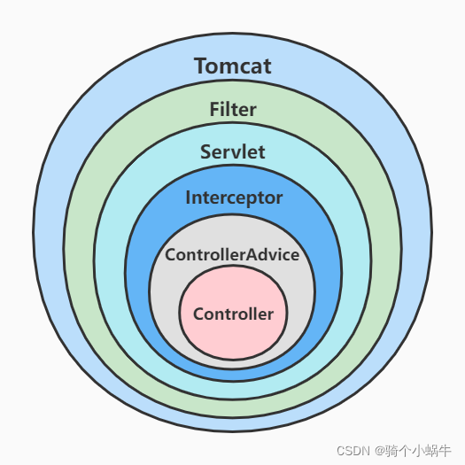
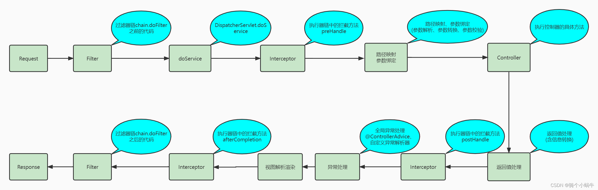
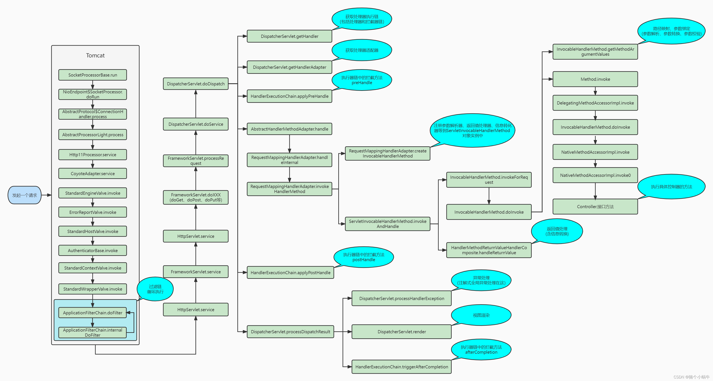

# SpringBoot实战

---
tags: [SpringBoot, 自动装配, Starter, 实战开发, Web开发]
created: 2026-02-21
updated: 2026-02-21
status: 已掌握
importance: ⭐⭐⭐⭐⭐
---

## 🎯 核心要点
> SpringBoot实战开发的核心技术和最佳实践

- **自动装配**：基于约定大于配置的自动化配置机制
- **Starter机制**：开箱即用的依赖管理和自动配置
- **Web开发**：快速构建RESTful API和Web应用
- **请求处理**：完整的HTTP请求处理流程
- **配置管理**：多环境配置和外部化配置

## 💡 SpringBoot核心特性

### 1. 核心注解 @SpringBootApplication

```java
@SpringBootApplication
public class Application {
    public static void main(String[] args) {
        SpringApplication.run(Application.class, args);
    }
}
```

**组合注解包含**：
- `@ComponentScan`：扫描当前包及子包下的所有类
- `@SpringBootConfiguration`：组合了@Configuration注解
- `@EnableAutoConfiguration`：自动装配，META-INF/spring.factories文件加载需要自动注入的类

### 2. 自动装配原理

在启动SpringBoot项目的main方法的类中，有@SpringBootApplication注解，包含了一个@EnableAutoConfiguration注解。这个就是自动装配，这个里面又包含了@Import注解，这个注解中引入了ImportSelector接口的类，在对应的selectImport方法中读取META-INF目录下的spring.factories文件中需要被加载的配置类，通过spring-autoconfigure-metadata.properties文件做过滤。最后返回的就是需要自动装配的相关对象。

**自动装配流程**：
1. @SpringBootApplication → @EnableAutoConfiguration
2. @EnableAutoConfiguration → @Import(AutoConfigurationImportSelector.class)
3. AutoConfigurationImportSelector.selectImports()
4. 读取META-INF/spring.factories文件
5. 通过spring-autoconfigure-metadata.properties过滤
6. 返回需要自动装配的配置类

### 3. Starter机制

**Starter作用**：在META-INF目录下提供了一个spring.factories文件，在该文件中添加了需要注入到容器中的对应配置类

**第三方整合**：第三方框架要想整合到SpringBoot中，就需要提供spring.factories文件，相当于启动的同时，启动其他第三方框架。

### 4. 常用Starter

- **spring-boot-starter-web**：提供了SpringMVC + Tomcat容器
- **spring-boot-starter-data-jpa**：JPA数据访问
- **spring-boot-starter-data-redis**：Redis缓存
- **spring-boot-starter-security**：安全框架
- **spring-boot-starter-test**：测试框架

## 🌐 Web开发实战

### SpringMVC处理流程


**详细流程**：
1. **DispatcherServlet**：前端控制器，控制中心，用户发出请求，到这里拦截
2. **HandlerMapping**：处理器映射，根据URL查找对应Handler
3. **返回处理器执行链**：根据URL查找控制器，并且将解析后的信息传递给DispatcherServlet
4. **HandlerAdapter**：处理器适配器，按照特定规则执行Handler
5. **执行Handler**：找到处理器
6. **Controller**：将具体的信息返回给HandlerAdapter，如ModelAndView
7. **由HandlerAdapter传递给DispatcherServlet**
8. **DispatcherServlet调用视图解析器ViewResolver**：解析ModelAndView
9. **返回View对象给DispatcherServlet**
10. **调用具体的视图进行渲染**
11. **响应数据返回给客户端**

### HTTP请求处理全过程

#### 容器关系图


#### 请求流程图


#### 详细流程图


**详细处理流程**：

1. **Tomcat线程接收请求**：经过一系列调用，调用到ApplicationFilterChain的doFilter方法，在调用internalDoFilter方法，依次执行过滤器链的每个Filter的doFilter

2. **过滤器链执行完毕**：控制权交回ApplicationFilterChain，再经过一系列调用，调用到DispatcherServlet的doDispatch方法

   **主要流程**：
   - `DispatcherServlet.getHandler`方法：获取处理执行器链（包含处理器和拦截器链）
   - `DispatcherServlet.getHandlerAdapter`方法：获取处理器适配器
   - `HandlerExecutionChain.applyPreHandle`方法：执行执行器链中的所有拦截器方法preHandle
   - `AbstractHandlerMethodAdapter.handle`方法：该方法主要包含路径映射、参数绑定（参数解析、参数转换、参数校验）、调用具体控制器方法、返回值处理（含信息转换）等操作

   **handle流程**：
   1. 调用`RequestMappingHandlerAdapter.handleInternal`方法，handleInternal方法又调用`RequestMappingHandlerAdapter.invokeHandlerMethod`方法

   **invokeHandlerMethod方法的主要流程**：
   1. 调用`RequestMappingHandlerAdapter.createInvocableHandlerMethod`方法：注册参数解析器、返回值处理器、信息转化器等到ServletInvocableHandlerMethod对象实例中
   2. 调用`ServletInvocableHandlerMethod.invokeAndHandle`方法

   **invokeAndHandle方法的主要流程**：
   1. 调用`InvocableHandlerMethod.invokeForRequest`方法，invokeForRequest方法又调用`InvocableHandlerMethod.doInvoke`方法

   **doInvoke方法的主要流程**：
   1. 调用`InvocableHandlerMethod.getMethodArgumentValues`方法：路径映射、参数绑定（参数解析、参数转换、参数校验）
   2. 调用`Method.invoke`方法：反射调用具体的控制器方法
   3. 调用`HandlerMethodReturnValueHandlerComposite.handleReturnValue`方法：返回值处理（含信息转换）

3. **拦截器后置处理**：`HandlerExecutionChain.applyPostHandle`方法：执行执行器链中的所有拦截器方法postHandle

4. **视图渲染**：`DispatcherServlet.processDispatchResult`方法：视图渲染

5. **拦截器完成处理**：`HandlerExecutionChain.triggerAfterCompletion`方法：执行执行器链中的所有拦截器方法afterCompletion

## 🔧 实战代码示例

### 基础Controller

```java
@RestController
@RequestMapping("/api")
public class UserController {

    @Autowired
    private UserService userService;

    @GetMapping("/users/{id}")
    public ResponseEntity<User> getUser(@PathVariable Long id) {
        User user = userService.findById(id);
        return ResponseEntity.ok(user);
    }

    @PostMapping("/users")
    public ResponseEntity<User> createUser(@RequestBody @Valid User user) {
        User savedUser = userService.save(user);
        return ResponseEntity.status(HttpStatus.CREATED).body(savedUser);
    }

    @PutMapping("/users/{id}")
    public ResponseEntity<User> updateUser(@PathVariable Long id, @RequestBody @Valid User user) {
        User updatedUser = userService.update(id, user);
        return ResponseEntity.ok(updatedUser);
    }

    @DeleteMapping("/users/{id}")
    public ResponseEntity<Void> deleteUser(@PathVariable Long id) {
        userService.deleteById(id);
        return ResponseEntity.noContent().build();
    }
}
```

### 配置类示例

```java
@Configuration
@EnableWebMvc
public class WebConfig implements WebMvcConfigurer {

    @Override
    public void addCorsMappings(CorsRegistry registry) {
        registry.addMapping("/api/**")
                .allowedOrigins("*")
                .allowedMethods("GET", "POST", "PUT", "DELETE")
                .allowedHeaders("*");
    }

    @Override
    public void addInterceptors(InterceptorRegistry registry) {
        registry.addInterceptor(new LoggingInterceptor())
                .addPathPatterns("/api/**");
    }
}
```

### 异常处理

```java
@ControllerAdvice
public class GlobalExceptionHandler {

    @ExceptionHandler(EntityNotFoundException.class)
    public ResponseEntity<ErrorResponse> handleEntityNotFound(EntityNotFoundException ex) {
        ErrorResponse error = new ErrorResponse("NOT_FOUND", ex.getMessage());
        return ResponseEntity.status(HttpStatus.NOT_FOUND).body(error);
    }

    @ExceptionHandler(ValidationException.class)
    public ResponseEntity<ErrorResponse> handleValidation(ValidationException ex) {
        ErrorResponse error = new ErrorResponse("VALIDATION_ERROR", ex.getMessage());
        return ResponseEntity.status(HttpStatus.BAD_REQUEST).body(error);
    }
}
```

### 自定义Starter

```java
// 自动配置类
@Configuration
@ConditionalOnClass(MyService.class)
@EnableConfigurationProperties(MyProperties.class)
public class MyAutoConfiguration {

    @Bean
    @ConditionalOnMissingBean
    public MyService myService(MyProperties properties) {
        return new MyService(properties);
    }
}

// 配置属性
@ConfigurationProperties(prefix = "my.service")
public class MyProperties {
    private String name;
    private int timeout = 5000;

    // getters and setters
}
```

## ⚙️ 配置管理

### application.yml配置

```yaml
server:
  port: 8080
  servlet:
    context-path: /api

spring:
  datasource:
    url: jdbc:mysql://localhost:3306/mydb
    username: ${DB_USERNAME:root}
    password: ${DB_PASSWORD:password}
    driver-class-name: com.mysql.cj.jdbc.Driver

  jpa:
    hibernate:
      ddl-auto: update
    show-sql: true
    properties:
      hibernate:
        format_sql: true

logging:
  level:
    com.example: DEBUG
    org.springframework.web: INFO
  pattern:
    console: "%d{yyyy-MM-dd HH:mm:ss} - %msg%n"
```

### bootstrap.yml文件作用

在SpringCloud环境下支持，一个父容器，在SpringBoot启动前加载初始化操作。

**使用场景**：
- 配置中心配置加载
- 应用上下文名称设置
- 加密/解密配置
- 其他需要在应用启动前加载的配置

## 🚀 性能优化

### 启动优化

```java
@SpringBootApplication
@EnableAutoConfiguration(exclude = {
    DataSourceAutoConfiguration.class,
    HibernateJpaAutoConfiguration.class
})
public class Application {
    public static void main(String[] args) {
        System.setProperty("spring.devtools.restart.enabled", "false");
        SpringApplication app = new SpringApplication(Application.class);
        app.setLazyInitialization(true);
        app.run(args);
    }
}
```

### 内存优化

```yaml
spring:
  jpa:
    properties:
      hibernate:
        jdbc:
          batch_size: 20
        order_inserts: true
        order_updates: true
        batch_versioned_data: true

server:
  tomcat:
    max-threads: 200
    min-spare-threads: 10
```

## 🔗 知识关联
- **核心原理**：[[Spring核心原理]]
- **微服务架构**：[[SpringCloud微服务]]
- **问题解决**：[[Spring问题解决]]
- **数据库集成**：[[../../04-mysql|MySQL数据库]]

## 🏷️ 标签
#SpringBoot #自动装配 #Starter #Web开发 #RESTful #配置管理 #实战开发