# SpringCloud微服务

---
tags: [SpringCloud, 微服务, 注册中心, 负载均衡, 网关, 分布式事务]
created: 2026-02-21
updated: 2026-02-21
status: 已掌握
importance: ⭐⭐⭐⭐⭐
---

## 🎯 核心要点
> SpringCloud微服务架构的核心组件和实现原理

- **注册中心**：服务注册与发现，支持Nacos、Eureka等
- **负载均衡**：客户端负载均衡，支持多种算法
- **服务调用**：OpenFeign声明式HTTP客户端
- **流量控制**：Sentinel流量防护和熔断降级
- **API网关**：Gateway统一入口和路由管理
- **分布式事务**：Seata分布式事务解决方案

## 🏢 注册中心

### 注册中心演变

跨进程通信RPC，使用HTTP请求进行数据访问获取。然后各服务把自己的地址记到一个表中，每次去查询表，获取地址。

### 功能需求

1. **服务管理**：一个服务用来管理和维护这些注册表
2. **服务注册**：客户端通过请求将自身的地址等信息告诉服务
3. **服务发现**：客户端通过请求将注册表拉取到本地，每隔一段时间都需要重复更新
4. **健康检查**：客户端发送心跳，证明自己还在，同时服务端检测客户端是否健康，否则停掉

### 架构图


### Nacos架构


### CAP理论

- **C (Consistency)**：一致性
- **A (Availability)**：可用性
- **P (Partition tolerance)**：分区容错

## ⚖️ 负载均衡

### 负载均衡类型

- **硬件负载均衡**：F5
- **软件负载均衡**：Nginx
- **客户端负载均衡**：Ribbon、LoadBalancer

### Ribbon vs LoadBalancer

**Ribbon**：
- 属于Netflix，目前已经不再维护
- 不支持WebClient（WebFlux）

**LoadBalancer**：
- Spring官方推荐
- 支持WebClient（WebFlux）
- 可自己实现，重写choose方法，搭建灰度发布功能

### 常见负载均衡算法

- **随机**：随机选择，使用很少
- **轮询**：默认算法，定义变量，每次请求变量+1，然后和服务数取模，模几用几
- **加权**：把所有权重排列成一个数组，然后请求随机落在某一个区间，如：20% 80%（0-20, 20-99）
- **地址Hash**：根据IP进行Hash进行选择，像HashMap一样
- **最小连接数**：根据积压数等参数，将请求分配在压力最小的服务器上

## 🌐 跨进程通讯 RPC

### HTTP客户端选择

- **HttpClient**
- **OkHttp**
- **HttpURLConnection**
- **RestTemplate**
- **WebClient**（WebFlux）

### OpenFeign原理

**本质**：还是HTTP通讯

**请求过程**：

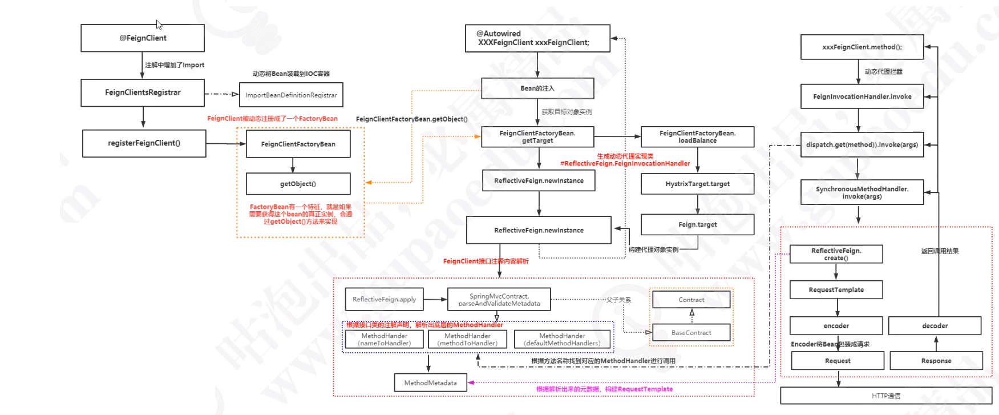

### OpenFeign使用示例

```java
@FeignClient(name = "user-service", fallback = UserServiceFallback.class)
public interface UserServiceClient {

    @GetMapping("/users/{id}")
    User getUserById(@PathVariable("id") Long id);

    @PostMapping("/users")
    User createUser(@RequestBody User user);
}

@Component
public class UserServiceFallback implements UserServiceClient {

    @Override
    public User getUserById(Long id) {
        return new User(id, "默认用户", "服务降级");
    }

    @Override
    public User createUser(User user) {
        return new User(0L, "创建失败", "服务降级");
    }
}
```

## 🛡️ 流量控制 - Sentinel

### 应用场景

- **应对洪峰流量**：秒杀、大促、下单、订单回流处理
- **消息性场景**：削峰填谷、冷热启动
- **付费系统**：根据使用流量付费
- **API Gateway**：精准控制API流量
- **任何应用**：探测应用中运行的慢程序块，进行限制

### 熔断机制

#### 1. 慢调用

下面配置为，1000ms内，统计5个请求，如果有10%（0.1）大于200ms的，则熔断5s，熔断后进入探测状态，响应小于RT，则关闭熔断，否则继续熔断。

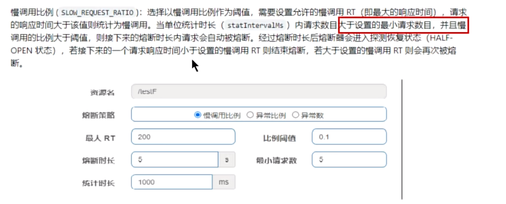

#### 2. 异常比例


#### 3. 异常数


### Sentinel注解使用

```java
// 添加依赖
<dependency>
    <groupId>com.alibaba.cloud</groupId>
    <artifactId>spring-cloud-starter-alibaba-sentinel</artifactId>
</dependency>

<dependency>
    <groupId>com.alibaba.csp</groupId>
    <artifactId>sentinel-transport-simple-http</artifactId>
    <version>1.8.6</version>
</dependency>

<dependency>
    <groupId>com.alibaba.csp</groupId>
    <artifactId>sentinel-datasource-nacos</artifactId>
</dependency>
```

```java
@GetMapping("/env")
// 添加资源注解 转发方法  同时指定  block 优先级最高
@SentinelResource(value = "env", blockHandler = "envHandler", fallback = "envFallback")
public String env(String str) {
    return str + "当前环境：" + env;
}

// 方法必须 public 且返回数据、参数与原方法都要保持一致
public String envHandler(String str, BlockException ex) {
    return ex.getMessage() + "阻塞后返回的数据";
}

// 方法必须 public 且返回数据、参数与原方法都要保持一致
public String envFallback(String str, Throwable ex) {
    return ex.getMessage() + "异常后返回的数据";
}
```

### 热点参数限流

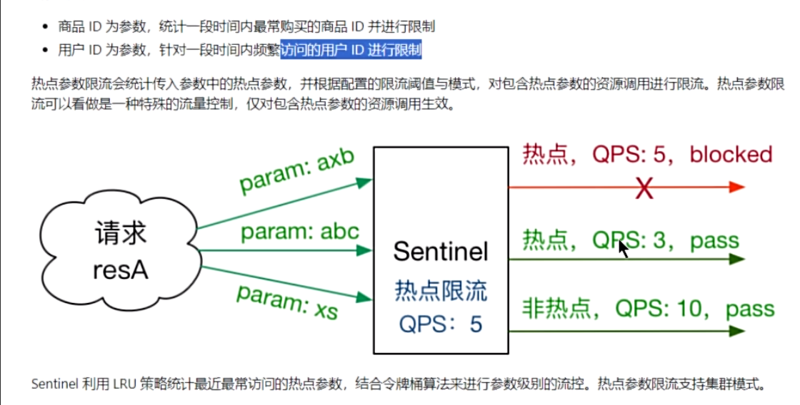

**参数例外项**：

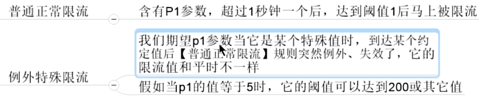

### 持久化配置

配置进Nacos中：

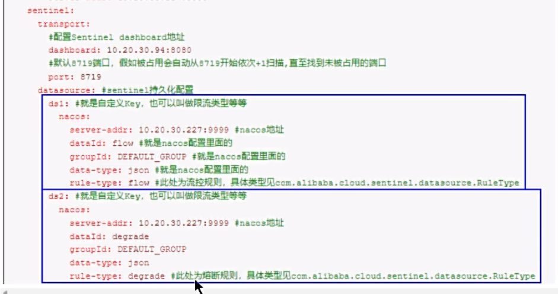

JSON配置文件：


### OpenFeign整合

1. **OpenFeign接口的统一fallback服务降级处理**
2. **配置blockHandler方法**

**配置**：


**接口添加降级操作**：


**添加实现类**：


## 🚪 API网关 - Gateway

### 三大核心

- **Route（路由）**：匹配到哪个URL地址
- **Predicate（断言）**：匹配参数、请求方式、body信息
- **Filter（过滤器）**：修改请求内容，token验证、过滤

### 请求过程


### 路由工厂


### 断言（Predicate）

路由配置，不止可以实现简单的路径跳转的功能，还可以通过配置predicate，进行条件的访问。

**时间相关**：
- **AfterRoutePredicateFactory**：可以在xx时间之后访问，场景：秒杀、开放
- **BeforeRoutePredicateFactory**：类似的：before、between

**请求相关**：
- **Cookie**、**Header**：请求携带的一些参数匹配
- **Query**：请求参数
- **RemoteAddr**：外部访问限制


### 过滤器（Filter）

**功能**：请求鉴权、异常处理、记录接口调用时长

**类型**：
- **全局默认过滤器**：GlobalFilter
- **网关过滤器**：GatewayFilter

**分类**：
1. 请求头RequestHeader相关
2. 请求参数RequestParameter相关
3. 响应头ResponseHeader相关
4. 前缀和路径相关
5. 其他

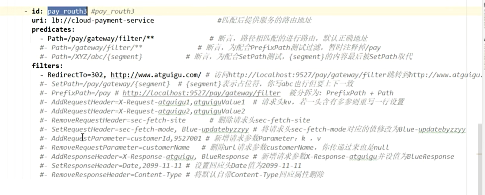

### 自定义过滤器

**需求**：统计接口请求耗时情况

```java
@Component
public class TimeGatewayFilterFactory extends AbstractGatewayFilterFactory<TimeGatewayFilterFactory.Config> {

    public TimeGatewayFilterFactory() {
        super(Config.class);
    }

    @Override
    public GatewayFilter apply(Config config) {
        return (exchange, chain) -> {
            long startTime = System.currentTimeMillis();
            return chain.filter(exchange).then(
                Mono.fromRunnable(() -> {
                    long endTime = System.currentTimeMillis();
                    System.out.println("请求耗时：" + (endTime - startTime) + "ms");
                })
            );
        };
    }

    public static class Config {
        // 配置属性
    }
}
```

### Gateway整合Sentinel

```java
<dependency>
    <groupId>com.alibaba.csp</groupId>
    <artifactId>sentinel-spring-cloud-gateway-adapter</artifactId>
    <version>x.y.z</version>
</dependency>
```

```java
@Configuration
public class GatewayConfiguration {

    private final List<ViewResolver> viewResolvers;
    private final ServerCodecConfigurer serverCodecConfigurer;

    public GatewayConfiguration(ObjectProvider<List<ViewResolver>> viewResolversProvider,
                                ServerCodecConfigurer serverCodecConfigurer) {
        this.viewResolvers = viewResolversProvider.getIfAvailable(Collections::emptyList);
        this.serverCodecConfigurer = serverCodecConfigurer;
    }

    @Bean
    @Order(Ordered.HIGHEST_PRECEDENCE)
    public SentinelGatewayBlockExceptionHandler sentinelGatewayBlockExceptionHandler() {
        return new SentinelGatewayBlockExceptionHandler(viewResolvers, serverCodecConfigurer);
    }

    @Bean
    @Order(Ordered.HIGHEST_PRECEDENCE)
    public GlobalFilter sentinelGatewayFilter() {
        return new SentinelGatewayFilter();
    }
}
```

## 💳 分布式事务 - Seata

### 核心组件

- **TC (Transaction Coordinator)**：Seata本身，负责维护全局事务和分支事务的状态，驱动全局事务提交或回滚
- **TM (Transaction Manager)**：事务发起者，负责定义全局事务范围，并根据TC维护的全局事务和分支事务状态，做出开始事务、提交事务、回滚事务的决议
- **RM (Resource Manager)**：MySQL本身，负责管理分支事务上的资源，向TC注册分支事务，汇报状态，驱动分支事务的提交和回滚

### 架构图

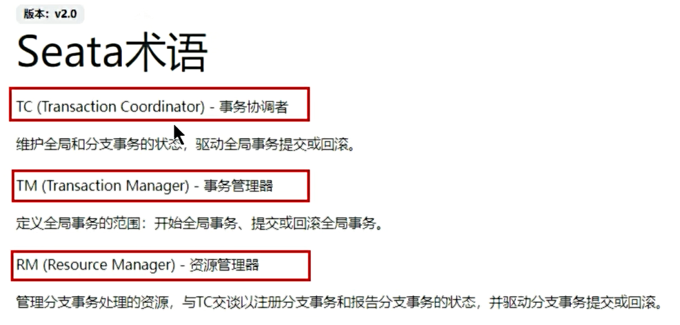

### 流程图

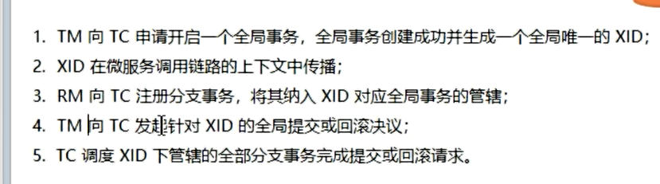

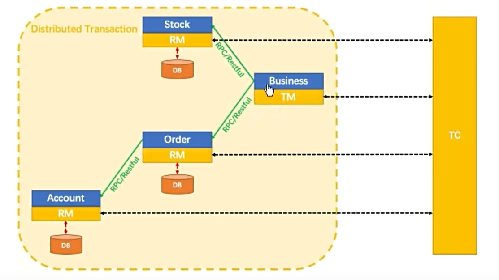

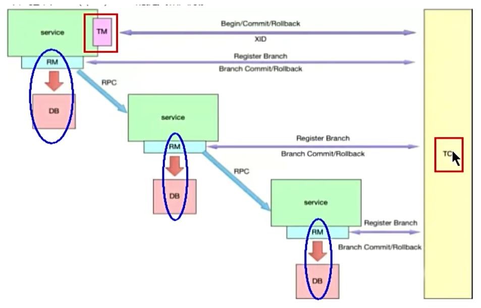

### 事务模式

- **AT（自动提交）**
- **TCC**
- **Saga**
- **XA**

### 使用示例

在方法上添加@GlobalTransactional注解，开启全局事务：

```java
@GlobalTransactional(name = "create-order", rollbackFor = Exception.class)
public void createOrder(Order order) {
    // 1. 创建订单
    orderService.create(order);

    // 2. 扣减库存
    stockService.decrease(order.getProductId(), order.getCount());

    // 3. 扣减账户余额
    accountService.decrease(order.getUserId(), order.getMoney());
}
```


### AT模式二阶段提交

**一阶段**：业务数据和回滚日志记录在同一个本地事务中提交，释放本地锁和连接资源

**二阶段**：提交异步化，快速完成。回滚通过一阶段的回滚日志反向补偿


## 🔍 链路追踪

### SkyWalking

分布式系统的应用程序性能监控工具，专为微服务、云原生架构和基于容器（Docker、K8s、Mesos）架构而设计。

**核心功能**：
- 服务、服务实例、端点指标分析
- 根本原因分析
- 服务拓扑图分析
- 服务、服务实例和端点依赖性分析
- 慢服务检测
- 性能优化

## 🔐 权限认证 - Spring Security

### 基础使用

#### 1. UsernamePasswordAuthenticationToken

用来封装用户的信息类，将用户的用户名、密码、权限等信息封装到该类中。

**构造方法**：

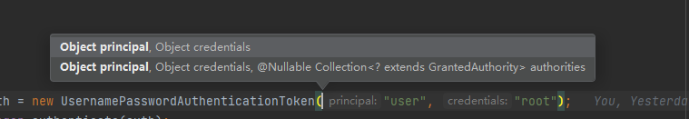

- **principal**：认证的主体信息，通常为用户名或者用户对象
- **credentials**：认证的凭证信息，通常为密码或者其他类似信息
- **authorities**：认证请求设置授权信息、权限列表等

**继承关系**：

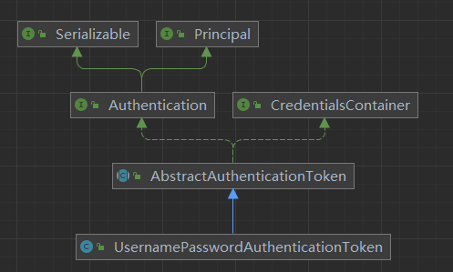

#### 2. SecurityContextHolder

将通过验证后的用户对象设置到SecurityContextHolder中，便于后续获取用户信息。

```java
// 设置用户信息到安全上下文
Authentication authentication = new UsernamePasswordAuthenticationToken(
    userDetails, null, userDetails.getAuthorities());
SecurityContextHolder.getContext().setAuthentication(authentication);

// 获取当前用户信息
Authentication auth = SecurityContextHolder.getContext().getAuthentication();
UserDetails userDetails = (UserDetails) auth.getPrincipal();
```

## 🔗 知识关联
- **核心原理**：[[Spring核心原理]]
- **实战开发**：[[SpringBoot实战]]
- **问题解决**：[[Spring问题解决]]
- **消息队列**：[[../../06-mq|消息队列]]
- **容器化部署**：[[../../08-docker|Docker容器]]

## 🏷️ 标签
#SpringCloud #微服务 #注册中心 #负载均衡 #OpenFeign #Sentinel #Gateway #Seata #分布式事务 #链路追踪