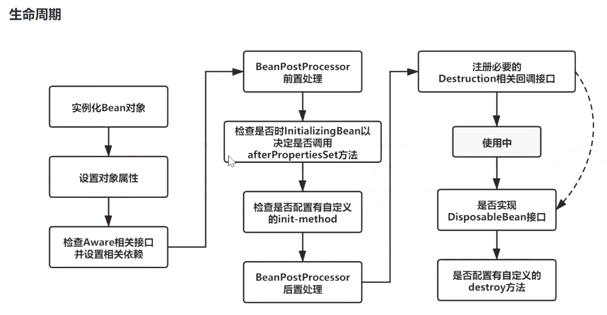
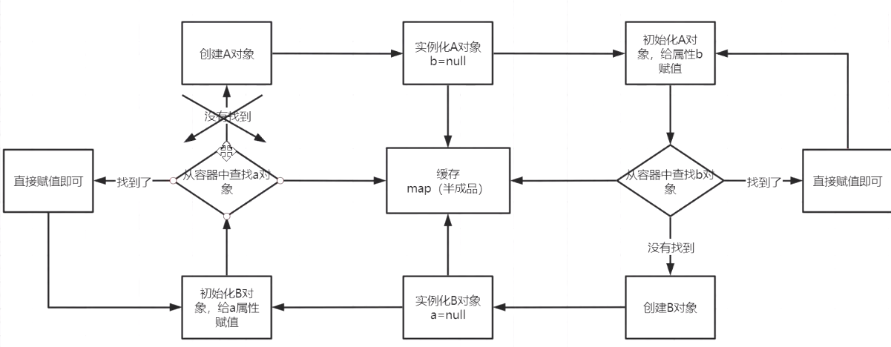

# Spring核心原理

---
tags: [Spring, IOC, AOP, Bean生命周期, 核心概念, 面试重点]
created: 2026-02-21
updated: 2026-02-21
status: 已掌握
importance: ⭐⭐⭐⭐⭐
---

## 🎯 核心要点
> Spring框架的核心机制和设计原理

- **IOC容器**：控制反转，对象创建和依赖管理由Spring容器负责
- **AOP机制**：面向切面编程，通过动态代理实现横切关注点
- **Bean生命周期**：从创建到销毁的完整管理流程
- **三级缓存**：解决循环依赖问题的核心机制
- **设计模式**：工厂、模板、策略等模式的综合运用

## 💡 IOC容器原理

### 1. IOC理解

**控制反转**：原来的对象是由使用者进行控制，有了Spring之后，就可以把对象交给Spring管理

**依赖注入(DI)**：把对应的属性的值通过@Autowired注入

**容器**：存放对象，使用Map结构存储，在Spring中有三级缓存，singletonObjects获取完成对象。Bean生命周期，从创建到销毁都是由容器来管理的。

### 2. 底层实现

**核心技术**：反射、工厂、设计模式

**关键方法**：createBeanFactory、getBean、doGetBean、createBean、doCreateBean、newInstance、populateBean、initializingBean

**实现流程**：
1. 通过createBeanFactory创建出Bean工厂（DefaultListableBeanFactory）
2. 开始循环创建对象，因为Bean默认是单例的，先通过getBean、doGetBean从容器中查找
3. 找不到的话，通过createBean、doCreateBean方法，以反射的方式创建对象，一般使用无参的getDeclaredConstructor、newInstance
4. 进行对象的属性填充populateBean
5. 进行其他的初始化操作initializingBean

### 3. Spring容器启动流程

1. **BeanFactory创建**：DefaultListableBeanFactory，设置BeanPostProcessor等参数
2. **Bean定义加载**：解析Bean对象，创建BeanDefinition（XML、注解）
3. **BeanFactoryPostProcessor处理**：扩展点，可以修改BeanDefinition
4. **BeanPostProcessor注册**：方便后续对Bean对象完成具体的扩展功能
5. **Bean实例化**：通过反射方式，将BeanDefinition对象生成具体对象
6. **Bean初始化**：填充属性，调用Aware子类方法、BeanPostProcessor前置处理方法、init-method方法、BeanPostProcessor后处理器方法
7. **Bean获取**：生成完成Bean对象，通过getBean方法获取
8. **销毁过程**：容器关闭时执行销毁逻辑

## 🔄 Bean生命周期



### 详细流程

1. **实例化Bean**：反射的方式生成对象
2. **填充Bean属性**：populateBean，可以引发循环依赖问题，通过三级缓存解决
3. **调用Aware接口方法**：invokeAwareMethod（完成BeanName、BeanFactory、BeanClassLoader对象的属性设置）
4. **调用BeanPostProcessor前置处理器方法**：ApplicationContextPostProcessor设置ApplicationContext、Environment、ResourceLoader、EmbeddedValueResolver等对象
5. **调用InitMethod方法**：invokeInitMethod()判断是否实现了InitializingBean接口，有则调用afterPropertiesSet方法
6. **调用BeanPostProcessor的后置处理方法**：Spring的AOP就在此处实现的，AbstractAutoProxyCreator
7. **注册Destruction相关的回调接口**
8. **获取完整的对象**：通过getBean方式来进行对象的获取
9. **销毁流程**：判断是否实现了DisposableBean接口，调用destroyMethod方法

## 🔄 循环依赖解决机制

### 三级缓存机制

```java
// 从上至下 分别代表这"三级缓存"
private final Map<String, Object> singletonObjects = new ConcurrentHashMap<>(256); //一级缓存
private final Map<String, Object> earlySingletonObjects = new HashMap<>(16); // 二级缓存
private final Map<String, ObjectFactory<?>> singletonFactories = new HashMap<>(16); // 三级缓存
```

**缓存说明**：
- **singletonObjects**：用于存放完全初始化好的Bean，从该缓存中取出的Bean可以直接使用
- **earlySingletonObjects**：提前曝光的单例对象的cache，存放原始的Bean对象（尚未填充属性），用于解决循环依赖
- **singletonFactories**：单例对象工厂的cache，存放Bean工厂对象，用于解决循环依赖

### 循环依赖解决流程



**解决过程**（以A依赖B、B依赖A为例）：

1. 先创建A对象，实例化A对象，此时B属性为空
2. 从容器中查找B对象，如果存在直接使用，找不到创建B对象
3. 实例化B对象，此时B中的A为空，填充属性A
4. 从容器中查找A对象，找不到，但发现A对象存在于三级缓存中

**核心思想**：实例化和初始化操作分开，当所有对象都完成实例化、初始化操作之后，把完整的对象放到容器中。

## 🎭 AOP实现原理

### 基本概念

AOP是IOC的一个扩展功能，先有IOC，再有AOP，在IOC的BeanPostProcessor中对Bean进行扩展实现。

### 实现流程

1. **代理对象的创建过程**：Advice、切面、切点
2. **通过JDK或者CGLIB方式来生成代理对象**
3. **在执行方法调用的时候**：会调用生成的字节码文件，直接找到拦截方法
4. **根据之前定义好的Advice生成拦截器链**
5. **从拦截器链中依次获取每一个通知开始进行执行**：从-1的位置开始查找执行

## 🏭 BeanFactory vs FactoryBean

### 相同点
都是创建Bean对象的

### 不同点

**BeanFactory**：创建的时候，必须严格遵循生命周期流程

**FactoryBean**：如果想要自定义对象创建，交给Spring来管理，就需要实现FactoryBean接口

**FactoryBean主要方法**：
- `isSingleton()`：是否是单例对象
- `getObjectType()`：获取返回对象类型
- `getObject()`：自定义创建对象的过程（new、反射、动态代理）

## 🎨 Spring中的设计模式

- **工厂模式**：BeanFactory
- **模板模式**：PostProcessorBeanFactory
- **策略模式**：XmlBeanDefinitionReader

## 💰 Spring事务管理

### 事务实现原理

**总体思路**：AOP实现的，首先生成代理对象，然后按照AOP流程来执行具体的操作逻辑，正常通过通知来完成核心功能，但是事务不是通过通知来实现的，是通过TransactionInterceptor来实现的，然后调用invoke实现具体逻辑。

**详细流程**：
1. **准备工作**：解析各个方法上事务相关的属性，根据具体的属性来判断是否开始新事务
2. **当需要开启时**：获取数据库连接，关闭自动提交功能，开启事务
3. **执行具体的SQL逻辑操作**
4. **失败处理**：通过completeTransactionAfterThrowing来完成事务的回滚操作，具体逻辑是通过doRollback方法实现，实现时也是先获取连接对象，通过连接conn.rollback()回滚
5. **成功处理**：通过commitTransactionAfterReturning来完成事务提交操作，具体逻辑由doCommit实现
6. **清理工作**：当事务执行完毕后需要清除相关的事务信息cleanupTransactionInfo

### 事务传播特性

一共有7种传播特性，分为3大类：支持当前事务、不支持当前事务、嵌套事务。

**核心逻辑**：
- 判断内外方法是否是同一个事务
- 是：异常统一在外层方法处理
- 不是：内层方法有可能影响外层方法，但外层影响不到内层

#### 主要传播特性

**REQUIRED**（Spring默认）：
- 如果当前没有事务，则自己新建一个事务
- 如果当前存在事务则加入这个事务

**REQUIRES_NEW**：
- 创建一个新事务，如果存在当前事务，则挂起该事务
- A和B事务互不干扰，出现问题回滚的时候，也都只回滚自己的事务

**NESTED**（嵌套事务）：
- 如果当前事务存在，则在嵌套事务中执行
- 否则REQUIRED的操作一样（开启一个事务）

**SUPPORTS**：
- 当前存在事务，则加入当前事务
- 如果当前没有事务，就以非事务方法执行

**MANDATORY**：
- 当前存在事务，则加入当前事务
- 如果当前事务不存在，则抛出异常

**NOT_SUPPORTED**：
- 以非事务方式执行，如果当前存在事务，则挂起当前事务

**NEVER**：
- 如果当前没有事务存在，就以非事务方式执行
- 如果有，就抛出异常

## 🔗 知识关联
- **实战应用**：[[SpringBoot实战]]
- **微服务架构**：[[SpringCloud微服务]]
- **问题解决**：[[Spring问题解决]]
- **相关技术**：[[../../04-mysql|MySQL数据库]]

## 🏷️ 标签
#Spring #IOC #AOP #Bean生命周期 #循环依赖 #事务管理 #核心概念 #面试重点