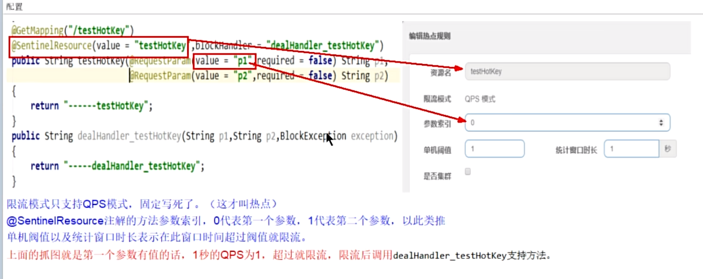

# 微服务

其他：

- resttemplate使用
- pom详解 dependencyManagement
- idea 启动 设置各种参数 port env参数
- jmeter 使用
- 日志 logback

# 注册中心

注册中心、配置中心、服务管理 平台

注册中心演变：

跨进程通信 RPC ，使用 http 请求进行数据访问获取。然后各服务把自己的地址记到一个表中，每次去查询表，获取地址。

如果完成上面的功能，需要什么？

1. 一个服务用来管理和维护这些注册表
2. 客户端通过请求将自身的地址等信息告诉服务
3. 客户端通过请求将注册表拉取到本地，每隔一段时间都需要重复更新
4. 客户端发送心跳，证明自己还在，同时服务端检测客户端是否健康，否则停掉

综合如下图：


nacos如下：


CAP C 一致性 A 可用性 P 分区容错

# 负载均衡

负载均衡 硬件 F5、软件 nginx、客户端自己做的负载均衡

**ribbon**

属于 netflix ，目前已经不在维护，可使用 loadbalancer，可自己实现，重写 choose 方法，搭建灰度发布功能

loadbalancer 支持 webclient（webflux），ribbon 不支持

常见负载均衡算法

- 随机：随机选择，使用很少
- 轮训：默认算法，定义变量，每次请求变量+1，然后和服务数取模，模几用几
- 加权：把所有权重排列成一个数据，然后请求随机落在某一个区间，如：20% 80%( 0-20, 20-99)
- 地址hash：根据 ip 进行 hash 进行选择，想 hashmap 一样
- 最小链接数：根据积压数等参数，将请求分配在压力最小的服务器上

# 跨进程通讯 RPC

不在一个服务上，如何请求数据，通过 http 请求调用数据。

http 选择：httpclient、okhttp、httpurlconnection、resttemplate、webclient（webflux）

**openfeign** 原理

本质还是 http 通讯


请求过程


# 流量控制

应对洪峰流量：秒杀、大促、下单、订单回流处理

消息性场景：削峰填谷、冷热启动

付费系统：根据使用流量付费

API Gateway：精准控制 API 流量

任何应用：探测应用中运行的慢程序块，进行限制

## **sentinel** 原理

#### 熔断

##### 1.慢调用

下面配置为，1000ms内，统计5个请求，如果有10%（0.1）大于200ms的，则熔断5s，熔断后进入探测状态，响应小雨rt，则关闭熔断，否则继续熔断。


##### 2.异常比例


##### 3.异常数


#### sentinel 注解

@SentinelResource是一个流量防卫防护注解，用于指定资源的防护，进行控制、熔断等功能。

使用：

1.dashboard 控制台

2.代码写规则

3.注解方式（推荐）

```
添加依赖
<!-- sentinel 流控管理 -->
<dependency>
	<groupId>com.alibaba.cloud</groupId>
	<artifactId>spring-cloud-starter-alibaba-sentinel</artifactId>
</dependency>

<!-- sentinel 看板 -->
<dependency>
	<groupId>com.alibaba.csp</groupId>
	<artifactId>sentinel-transport-simple-http</artifactId>
	<version>1.8.6</version>
</dependency>

<!-- sentinel 规则管理 -->
<dependency>
	<groupId>com.alibaba.csp</groupId>
	<artifactId>sentinel-datasource-nacos</artifactId>
</dependency>
```

```
@GetMapping("/env")
// 添加资源注解 转发方法  同时指定  block 优先级最高
@SentinelResource(value = "env", blockHandler = "envHandler", fallback = "envFallback")
public String env(String str) {
	return str + "当前环境：" + env;
}

// 方法必须 public 且返回数据、参数与原方法都要保持一致
public String envHandler(String str, BlockException ex) {
	return ex.getMessage() + "阻塞后返回的数据";
}

// 方法必须 public 且返回数据、参数与原方法都要保持一致
public String envFallback(String str, Throwable ex) {
	return ex.getMessage() + "异常后返回的数据";
}
```

统一异常处理 blockexceptionhandler

流控规则

QPS 信号量

流量控制

#### 热点




参数例外项


#### 授权

提供了黑白名单，两种授权类型。

#### 持久化

配置进 nacos 中


json 配置文件


#### openfeign 整合

1.openfeign几口的统一fallback服务降级处理

2.配置blockhandler方法

配置


接口添加降级操作，fallback


添加实现类


#### gateway 网关整合

1.引入pom依赖，

```
<dependency>
    <groupId>com.alibaba.csp</groupId>
    <artifactId>sentinel-spring-cloud-gateway-adapter</artifactId>
    <version>x.y.z</version>
</dependency>
```

2.使用时只需注入对应的 `SentinelGatewayFilter` 实例以及 `SentinelGatewayBlockExceptionHandler` 实例

```
@Configuration
public class GatewayConfiguration {

    private final List<ViewResolver> viewResolvers;
    private final ServerCodecConfigurer serverCodecConfigurer;

    public GatewayConfiguration(ObjectProvider<List<ViewResolver>> viewResolversProvider,
                                ServerCodecConfigurer serverCodecConfigurer) {
        this.viewResolvers = viewResolversProvider.getIfAvailable(Collections::emptyList);
        this.serverCodecConfigurer = serverCodecConfigurer;
    }

    @Bean
    @Order(Ordered.HIGHEST_PRECEDENCE)
    public SentinelGatewayBlockExceptionHandler sentinelGatewayBlockExceptionHandler() {
        // Register the block exception handler for Spring Cloud Gateway.
        return new SentinelGatewayBlockExceptionHandler(viewResolvers, serverCodecConfigurer);
    }

    @Bean
    @Order(Ordered.HIGHEST_PRECEDENCE)
    public GlobalFilter sentinelGatewayFilter() {
        return new SentinelGatewayFilter();
    }
}
```

参考地址：https://github.com/alibaba/Sentinel/wiki/%E7%BD%91%E5%85%B3%E9%99%90%E6%B5%81


# 分布式事务

seta：TC TM RM

TC：seta 本身，负责维护全局事务和分支事务的状态，驱动全局事务提交或回滚

TM：事务发起者，负责定义全局事务范围，并根据TC维护的全局事务和分支事务状态，做出开始事务、提交事务、回滚事务的决议

RM：mysql本身，负责管理分支事务上的资源，像TC注册分支事务，汇报状态，驱动分支事务的提交和回滚


流程


#### 事务模式

AT（自动提交）、TCC、Saga、XA

在方法上添加@GlobalTransactional注解，开启全局事务（加个名字，回滚）


后台


二阶段提交

一：业务数据和回滚日志记录在同一个本地事务中提交，释放本地锁和连接资源。

二：提交异步化，快速完成。回滚通过一阶段的回滚日志反向补偿。


# 网关

gateway

## 三大核心

route：路由，匹配到哪个url地址

predicate：断言，匹配参数、请求方式、body信息

filter：过滤器，修改请求内容，token验证、过滤

请求过程：


路由工厂


### 断言

路由配置，不止可以实现简单的路径跳转的功能，还可以通过配置predicate，进行条件的访问。

afterroutepredicate：可以在xx时间之后访问，场景：秒杀，开放

类似的：before、between

cookie、header：请求携带的一些参数匹配

query：请求参数

remoteaddr：外部访问限制


自定义断言功能

找一个照抄，修改

需求：一个根据会员等级进行访问的功能。

### 过滤器

功能：请求鉴权、异常处理、记录接口调用时长

全局默认过滤器：globalfilter

网关过滤器：gatewayfilter

1. 请求头requestheader相关
2. 请求参数requestparameter相关
3. 回应头responseheader相关
4. 前缀和路径相关
5. 其他


自定义过滤器 

需求：统计接口请求耗时情况


yaml配置过滤器

自定义条件过滤器


# 链路追踪

skywalking

# 权限认证 spring security

## 基础使用

### 1. UsernamePasswordAuthenticationToken

用来封装用户的信息类，将用户的用户名、密码、权限等信息封装到该类中。

**构造方法**


principal 是认证的主体信息，通常为用户名或者用户对象

credentials 是认证的凭证信息，通常为密码或者其他类似信息

authorities 认证请求设置授权信息、权限列表等

**继承关系**


### 2. SecurityContextHolder

将通过验证后的用户对象设置到 SecurityContextHolder 中，系统就可以在任何地方通过 holder 取出该用户的认证信息。SecurityContext 值与当前执行线程相关联，里面维护了一个 ThreadLocalSecurityContextHolderStrategy 类，具体使用的还是 ThreadLocal 存储信息。

设置代码


### 3. AuthenticationManager（interface）


认证处理接口，将用户信息（UsernamePasswordAuthenticationToken）传入后进行验证，最终调用 UserServiceImpl 接口的 loadUserByUsername 方法，通过后会返回 Authentication 对象，也就是需要存储在 SecurityContextHolder 的对象。

调用过程如图：

其中 TokenFilter（extends OncePerRequestFilter）是自定义的拦截请求类。

需要自定义类来实现 UserDetailsService 的 loadUserByUsername 方法，进行验证。


### 4. 简单的实现

#### 1. 拦截类

```java
package com.wxkj.iot.platform.security;

import com.wxkj.iot.platform.utils.RedisUtil;
import lombok.extern.slf4j.Slf4j;
import org.jetbrains.annotations.NotNull;
import org.springframework.security.authentication.AuthenticationManager;
import org.springframework.security.authentication.UsernamePasswordAuthenticationToken;
import org.springframework.security.core.Authentication;
import org.springframework.security.core.context.SecurityContextHolder;
import org.springframework.security.core.userdetails.User;
import org.springframework.stereotype.Component;
import org.springframework.web.filter.OncePerRequestFilter;

import javax.annotation.Resource;
import javax.servlet.FilterChain;
import javax.servlet.ServletException;
import javax.servlet.http.HttpServletRequest;
import javax.servlet.http.HttpServletResponse;
import java.io.IOException;

@Component
@Slf4j
public class TokenFilter extends OncePerRequestFilter {
    @Resource
    AuthenticationManager authenticationManager;

    private final static String AUTHORIZATION_HEADER_NAME = "Authorization";

    @Override
    protected void doFilterInternal(@NotNull HttpServletRequest request, @NotNull HttpServletResponse response,
                                    @NotNull FilterChain filterChain) throws ServletException, IOException {
        // 获取 token
        String token = request.getHeader(AUTHORIZATION_HEADER_NAME);

        // 通过 token 获取用户信息
        User user = (User) RedisUtil.get(token);

        // 封装用户信息
        UsernamePasswordAuthenticationToken authenticationToken = new UsernamePasswordAuthenticationToken(user.getUsername(), user.getPassword());

        // 调用方法进行认证
        Authentication authenticate = authenticationManager.authenticate(authenticationToken);

        // 设置到上下文
        SecurityContextHolder.getContext().setAuthentication(authenticate);
    }
}
```

#### 2. 用户信息处理类

```java
package com.wxkj.iot.platform.system;

import lombok.extern.slf4j.Slf4j;
import org.springframework.security.core.GrantedAuthority;
import org.springframework.security.core.userdetails.User;
import org.springframework.security.core.userdetails.UserDetails;
import org.springframework.security.core.userdetails.UserDetailsService;
import org.springframework.security.core.userdetails.UsernameNotFoundException;
import org.springframework.stereotype.Service;

import java.util.ArrayList;

@Slf4j
@Service
public class UserServiceImpl implements UserDetailsService {
    @Override
    public UserDetails loadUserByUsername(String username) throws UsernameNotFoundException {
        System.out.println("执行方法");
        ArrayList<GrantedAuthority> authorities = new ArrayList<>();
        // 通常需要查询数据库进行验证
        User user = new User("user", "root", authorities);
        return user;
    }
}
```

#### 3. Security 配置类

```java
package com.wxkj.iot.platform.security.config;

import com.wxkj.iot.platform.security.TokenFilter;
import org.springframework.context.annotation.Bean;
import org.springframework.context.annotation.Configuration;
import org.springframework.context.annotation.Lazy;
import org.springframework.security.authentication.AuthenticationManager;
import org.springframework.security.config.annotation.authentication.configuration.AuthenticationConfiguration;
import org.springframework.security.config.annotation.web.builders.HttpSecurity;
import org.springframework.security.config.annotation.web.configuration.EnableWebSecurity;
import org.springframework.security.core.userdetails.UserDetailsService;
import org.springframework.security.crypto.bcrypt.BCryptPasswordEncoder;
import org.springframework.security.crypto.password.PasswordEncoder;
import org.springframework.security.web.SecurityFilterChain;
import org.springframework.security.web.authentication.UsernamePasswordAuthenticationFilter;

import javax.annotation.Resource;

/**
 * @author zln
 * @description security  2.7 以上
 * @date 2022/11/24 15:38
 */
@EnableWebSecurity
@Configuration
public class WebSecurityConfig {

    @Resource
    UserDetailsService userDetailsService;
    @Resource
    @Lazy
    TokenFilter tokenFilter;
    
    /**
     * 不需要拦截的地址
     */
    public static final String[] excludeUrls = {
//            "/**",
            // knife4j 接口文档
            "/webjars/**",
            "/doc.html",
            "/v3/api-docs/**",
            "/favicon.ico",
            "/csrf",
            // druid
            "/druid/**"
    };

    /**
     * 解决无法注入问题
     * 密码明文加密方式配置
     *
     * @return
     */
    @Bean
    public PasswordEncoder passwordEncoder() {
        return new BCryptPasswordEncoder();
    }

    /**
     * 解决无法注入问题
     * 认证管理器
     *
     * @param authConfig
     * @return
     * @throws Exception
     */
    @Bean
    public AuthenticationManager authenticationManager(AuthenticationConfiguration authConfig) throws Exception {
        return authConfig.getAuthenticationManager();
    }

    @Bean
    public SecurityFilterChain securityFilterChain(HttpSecurity httpSecurity) throws Exception {

        httpSecurity
                // 放行的接口
                .authorizeRequests().antMatchers(excludeUrls).permitAll()
                .and()
                // 其余验证
                .authorizeRequests().anyRequest().authenticated()
                .and()
                // 使用自定义的校验
                .userDetailsService(userDetailsService)
                // 在认证前 自定义拦截处理 将用户信息设置到 SecurityContextHolder 中
                .addFilterBefore(tokenFilter, UsernamePasswordAuthenticationFilter.class)
                //其他配置
                .csrf().disable();

        return httpSecurity.build();
    }
}

```

## 权限校验

### 1.路径校验

WebSecurityConfig 配置类

```java
@EnableWebSecurity
@Configuration
// 开启校验
@EnableGlobalMethodSecurity(prePostEnabled = true)
public class WebSecurityConfig {
httpSecurity
    // 根据web路径校验
	.authorizeRequests().antMatchers("url1/**").hasRole("role1").and()
	.authorizeRequests().antMatchers("url2/**").hasAnyRole("role1","role2").and()
	.authorizeRequests().antMatchers("url3/**").hasAnyAuthority("system:add","system:delete").and()
}
```

权限集合在 UserDetails 实现类中的 Collection<? extends GrantedAuthority> getAuthorities(); 方法 需要自己实现

一般在查询用户信息时，设置进去，框架后期根据配置校验

### 2.注解校验

同样需要开启校验

1. **@PreAuthorize**：方法执行前检查
2. **@PostAuthorize**：方法执行后检查，失败抛异常
3. **@PostFilter**：允许方法调用，但是按照表达式过滤方法结果

```java
@PreAuthorize("hasRole('ADMIN')")
public void addUser(User user){
    //如果具有ROLE_ADMIN 权限 则访问该方法
    ....
}

@PostAuthorize：允许方法调用，但是，如果表达式结果为false抛出异常
//returnObject可以获取返回对象user，判断user属性username是否和访问该方法的用户对象的用户名一样。不一样则抛出异常。
@PostAuthorize("returnObject.user.username==principal.username")
public User getUser(int userId){
   //允许进入
...
    return user;
}

//将结果过滤，即选出性别为男的用户
@PostFilter("returnObject.user.sex=='男' ")
public List<User> getUserList(){
    //允许进入
    ...
    return user;
}
```

principal 可获取前登录用户信息

### 3.自定义校验

自定义校验使用 **@hasPermission** 校验

```java
@PreAuthorize("hasPermission('tagert','read')")
@GetMapping("/test")
public String test() {
    return "test";
}
```

需要自定义类实现接口，实现自己的校验逻辑

```java
@Component
@Slf4j
public class MyPermissionEvaluator implements PermissionEvaluator {
    @Override
    public boolean hasPermission(Authentication authentication, Object targetDomainObject, Object permission) {
        // 自己的校验逻辑
        // true 可以访问 
        // false 不可访问 并且抛出 accessdefine 异常
        return true;
    }

    @Override
    public boolean hasPermission(Authentication authentication, Serializable targetId, String targetType, Object permission) {
        return true;
    }
}
```

## 问题

### 1. 反序列化时，没有无参构造方法，反序列化异常

参考：https://zhuanlan.zhihu.com/p/497657071

原因：反序列化需要用到无参方法创建对象，然后在调用 set 方法赋值，如果没有无参方法，会报异常。

处理：使用 @JsonCreator @JsonProperty 处理

@JsonCreator 注解的作用就是指定反序列化时用的无参构造函数。构造方法的参数前面需要加上 @JsonProperty, 否则会报错！

```java
@Getter
@Setter
public class UserDto extends User implements Serializable {

    @Serial
    private static final long serialVersionUID = -5861077067941331352L;

    private String id;

    @JsonCreator
    public UserDto(@JsonProperty("username") String username,
                   @JsonProperty("password") String password,
                   @JsonProperty("authorities") Collection<? extends GrantedAuthority> authorities) {
        super(username, password, authorities);
    }
}
```

### 2. 在 1 的情况下，password = null 反序列化失败

security 处理的过程中，会将 password 置为 null，写入 redis 时，password 字段会忽略。

正常情况，字段忽略不影响反序列化，但是由于 password 是构造方法中的参数，不能为 null 或 无。

如果是继承 user 的类，password 没有 set 方法，只有 get ，无法重新赋值。

所以还会出现异常。

处理：

第一种方法：

1. redis 存储时，bean 转成 json string 存储。
2. 解析时，不直接通过 T.class 反序列化成实体类。
3. 使用 readTree 方法解析成节点，只解析需要的字段。`JsonNode jsonNode = mapper.readTree(json);`

第二种方法：

不继承 user 类，实现 userdetial 接口。要注意实现的权限等类型，要改成 true，涉及锁定、权限等。

```java
package com.wxkj.iot.platform.system.bean.response;

import lombok.Getter;
import lombok.Setter;
import org.springframework.security.core.GrantedAuthority;
import org.springframework.security.core.userdetails.UserDetails;

import java.io.Serial;
import java.io.Serializable;
import java.util.Collection;
import java.util.List;

@Getter
@Setter
public class UserDto implements UserDetails, Serializable {

    @Serial
    private static final long serialVersionUID = -5861077067941331352L;

    private String id;
    private String username;
    private String password;
    private List<? extends GrantedAuthority> authorities;

    @Override
    public Collection<? extends GrantedAuthority> getAuthorities() {
        return authorities;
    }

    @Override
    public String getPassword() {
        return password;
    }

    @Override
    public String getUsername() {
        return username;
    }

    @Override
    public boolean isAccountNonExpired() {
        return !false;
    }

    @Override
    public boolean isAccountNonLocked() {
        return !false;
    }

    @Override
    public boolean isCredentialsNonExpired() {
        return !false;
    }

    @Override
    public boolean isEnabled() {
        return !false;
    }
}

```

### 

## jwt 注意事项

生成的 token 结构组成：

JWT的结构：{header}.{payload}.{signature}, 其签名计算过程：HMACSHA256(base64UrlEncode(header) + "." + base64UrlEncode(payload), signature)

在线地址：https://www.toolhelper.cn/EncodeDecode/Base64EncodeDecode


注意，不要在JWT的payload或header中放置敏感信息，除非它们是加密的。

签名是用于验证消息在传递过程中有没有被更改，并且，对于使用私钥签名的token，它还可以验证JWT的发送方是否为它所称的发送方。

iss(Issuser)：代表这个JWT的签发主体；
sub(Subject)：代表这个JWT的主体，即它的所有人；
aud(Audience)：代表这个JWT的接收对象；
exp(Expiration time)：是一个时间戳，代表这个JWT的过期时间；
nbf(Not Before)：是一个时间戳，代表这个JWT生效的开始时间，意味着在这个时间之前验证JWT是会失败的；
iat(Issued at)：是一个时间戳，代表这个JWT的签发时间；
jti(JWT ID)：是JWT的唯一标识。