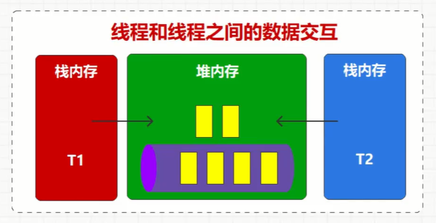
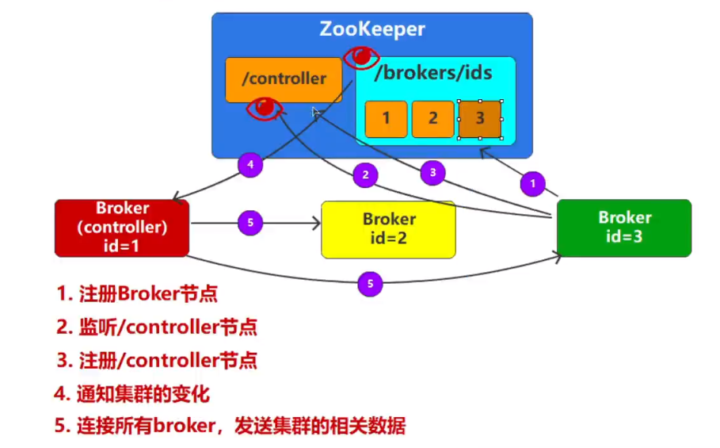

## 基础

### 1.需求背景

1.java 线程之间的数据交互



2.进程之间的数据交互


由于各种原因，消费速度、资源、耦合等问题，引入消息中间件的概念


JMS 模型（java message service）


消费模式：

1. P2P（点对点）只有一个接收成功
2. PS（发布订阅）订阅就可以收到

#### 常用中间件对比


大数据场景适用 kafka，javaee 适用 mq，可结合适用

#### kafka 组件


### 2.安装

#### 安装

依赖 zookeeper，也可以适用 raft。

需要修改配置文件

window 写命令：

zk.cmd

```shell
call bin/windows/zookeeper-server-start.bat config/zookeeper.properties
```

kfk.cmd

```shell
call bin/windows/kafka-server-start.bat config/server.properties
```

#### 简单指令

```shell
# 创建 topic
kafka-topics.bat --bootsrtap-server localhost:9092 --topic test --create
# 查看
kafka-topics.bat --bootsrtap-server localhost:9092 --list
# 查看详细
kafka-topics.bat --bootsrtap-server localhost:9092 --topic test --describe
# 修改
kafka-topics.bat --bootsrtap-server localhost:9092 --topic test --alter --partitions 2
# 删除
kafka-topics.bat --bootsrtap-server localhost:9092 --topic test --delete
```


```shell
# 启动消费者
kafka-console-consumer.bat --bootsrtap-server localhost:9092 --topic test 

# 发送测试消息
kafka-console-producer.bat --bootsrtap-server localhost:9092 --topic test 
```


### 3.引入

pom文件引入


构建生产者


构建消费者


### 4.客户端工具

kafkatool_64bit.exe

添加客户端连接


使用


## 原理

### 架构推演

单点 broker ，如果挂掉，则无法使用，那么可以有横向扩展（加多实例）纵向扩展（加内存）

横向扩展演进

1.多节点、分区（数据分散在各个broker）、

2.消费者组（防止单一节点请求）


3.单节点log文件副本

可以通过备份数据文件，保证可靠性。但是 kafka 没有备份概念，这里叫副本

多个副本同时只能有一个提供数据的读写操作

具有读写能力的副本称之为 Leader 副本，作为备份的副本称之为 Follower 副本


4.master 节点，controller 控制器

管理节点


但如果节点挂了怎么办？

1.管理者备份


2.选举 controller

使用 zookeeper 进行选举


### 最终架构

  

关于选举：

比如三个节点 1、2、3，当他们连接 zookeeper 时，第一个连上的做节点（controller），其他的监视这个节点，比如 1 当选，2、3 监视。当 1 挂掉时，2、3 发送请求，谁先建立连接谁就当选 controller。

### 底层通讯

多节点连接



通信


P19 集 底层深入分析

## 使用

### 主题


多个broker，放多个分区，放不同的副本


例子：三个topic，一个1分区、一个2分区、一个3分区


每个颜色的框是一个 topic，⭐️为 leader，这样每个节点更均衡。

### 数据发送


#### 自定义拦截器

1.在map中配置


2.创建类，实现拦截器接口


#### 分区计算

通过元数据拿到集群相关 数据，各个集群、分区等信息

通过计算，要发到那个分区

发送时有缓冲区，一批一批发送。默认缓存 32m，批次 16k。


数据通过 sender 线程发送。发送后，会有发送应答，通过回调方法


同步发送，等待成功在发下一条，逐条发送


#### 可配置应答模式 acks

acks = 0 （优先满足数据传输，传输快，但数据可能丢失）


acks = 1 leader 保存好了，就行了


acks = -1（all）最可靠，需要等待多副本同步数据


#### 失败重试

可能造成问题：

1.副本写入成功，acks 响应失败时，数据会重复。

2.数据乱序问题，重复推送时，造成的数据错乱。

#### 幂等性操作

开启幂等性配置（默认开启），幂等性只对同一个分区起作用

acks 必须为 -1，且开启重试。

基于生产者的produceid和序列号，比对数据、比对重复。


#### 生产者事务

当使用事务时，produceId和kafka实例是绑定的

添加事务id


使用事务


### 数据存储

数据保存在 .log 文件中，可以设置刷写时间，log 文件会根据策略生成小数据文件

kafka 工具类可以查看文件内容

执行 DumpLogSegments 类的方法

```shell
kafka-run-class.bat kafka.tools.DumpLogSegments --files D:/data/kafka/test-0/00000000.log --print-data-log
```


通过索引、偏移量定位数据。offset、position

#### 日志删除

index 文件是 kafka 的内存映射文件，kafka 启动时，无法删除。其他文件 log timestamp 可以删除。默认保存时间如下：


### 数据消费

#### 过程


根据主题和偏移量进行数据获取。

#### 偏移量配置：


消费者自动保存偏移量，防止重启时，不知道从什么地方开始（默认 5s 保存一次），但是也会有一些问题，重复消费。

**手动保存偏移量**

1.关闭自动提交


2.手动保存偏移量


#### 主题 topic 消费组 group

消费者一定是 < = 分区数，如果大于，则消费者相当于备用。

消费者构成组去组合消费，不用每一个都去消费。且拉取的数据不会重复。


分区分配策略

消费者中的每个消费者到底消费哪一个主题分区，策略由消费者的 Leader 决定，称为群主。

第一个加入组中的消费者就是群主，其他为 Follower。


加群时会发 JoinGroup 请求，群主负责给消费者分配分区。

分配策略

1.轮询分配


2.范围分配


3.粘性分配


4.优化后的分配


## 扩展

### 脑裂问题

集群中，有多个管理者，那么 broker 到底听谁的呢？

epoch纪元，会存储第几届管理者（相当于给管理者按顺序编号），如果发现某一个管理者不是最新编号，那么相当于他下台了，就不用听他的就好了

### 零拷贝

数据流转，如果是这种，cpu 会经常切换 -> 用户态、内核态，消耗资源。


优化后，直接走内核发送数据，不在通过 io 走到 broker


### 顺写日志

数据追加进去，类似于时序数据库，提高效率

顺序写入对机械和固态差别不大

### 集群

2.8 版本提供 KRaft，摆脱对 zookeeper 的依赖

## 优化

磁盘空间预估：


网络估算


内存配置


cpu 选择


配置参数


数据压缩


## 常见问题

### 1.LSO LEO HW 含义

都是 kafka 中的偏移量


### 2.Controller 选举怎么实现


### 3.分区副本 AR ISR OSR 含义


### 4.Producer ACK 应答策略

生产者发送数据后的 kafka 接收确认方式。有 三 种


### 5.Producer消息重复或丢失原因？


### 6.Consumer 消息重复或丢失的原因？


### 7.如何保证有序


 