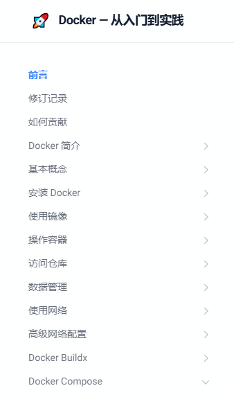
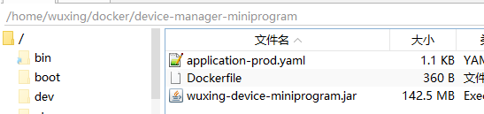
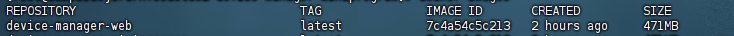

## 基础

### 基础

技术文档：https://yeasy.gitbook.io/docker_practice（很全面）



常用命令：

```shell
# 拉取镜像
docker pull [选项] [Docker Registry 地址[:端口号]/]仓库名[:标签]
```

### 代理

参考文章：https://blog.lalkk.com/4533/

代理地址：https://docker.m.daocloud.io

**修改地址方法：**

**1.拉取镜像时，添加地址**

灵活，推荐使用

```shell
# docker pull docker.m.daocloud.io（代理地址）/镜像名:版本
docker pull docker.m.daocloud.io/mysql:5.7.0
```

拉取后，使用时，要加上代理的前缀

```shell
docker run -d --name mysql -p 3306:3306 docker.m.daocloud.io/mysql:5.7.0
```

**2.修改默认的仓库地址**

这种方法需要重启 docker，已有容器在运行时，需要格外注意。

在 /etc/docker/daemon.json 修改（没有 json 文件新建即可）

```shell
{
    "registry-mirrors": [
        "https://docker.m.daocloud.io",
        "https://huecker.io",
        "https://dockerhub.timeweb.cloud",
        "https://dockerproxy.1panel.live"
    ]
}

# 完成后重启 docker
sudo systemctl daemon-reload
sudo systemctl restart docker
```

**3.本地镜像的导出导入**

```shell
# 保存到本地
docker save -o nginx.tar nginx

# 将保存的镜像上传到其他服务器

# 加载镜像
docker load -i /dockerfile/nginx.tar

# 启动镜像
docker run -d -p 80:80 nginx
```

## 生产使用

### 1.通用镜像启动

升级时，不需要重新构建镜像，只更新 jar 包即可，可以打一个通用的 Dockerfile 文件（只是为了制作通用镜像。）

启动容器的时候，将 jar 包、配置文件等一并配置上，在进行启动，后续版本升级时，只需要通过 restart 重新加载即可，不需要重新打包镜像。

**通用镜像文件**

```dockerfile
FROM docker.m.daocloud.io/openjdk:17

# 设置工作目录
WORKDIR /app

# （可选）如果需要，可以预先配置一些环境变量或默认配置
# ENV SOME_ENV_VAR=value

# 容器启动时的默认命令（可以被覆盖）
CMD ["sh", "-c", "echo 'No JAR file provided. Please mount a JAR file and restart the container.' && sleep infinity"]
```

放在服务器固定的一个目录，包括 jar、application、Dockerfile



打包通用镜像文件

```shell
docker build -t device-manager-miniprojram:0.1 .
docker build -t device-manager-web .
# 不制定版本时，则是 latest 版本
```



使用 docker run 启动容器

```shell
# 启动容器
docker run -d -m 3g --memory-swap -1 \
				-v /var/www:/var/www \
                -v /wxlogs/device-manager-miniprogram:/wxlogs/device-manager-miniprogram \
                -v /etc/localtime:/etc/localtime \
                -v /etc/timezone:/etc/timezone \
                -v /var/www/webapp/files:/var/www/webapp/files \
				-v /home/wuxing/docker/device-manager-miniprogram:/data \
                --log-opt max-size=100m \
                --log-opt max-file=3 \
                --net host \
				-p 9090:9090 \
                --name device-manager-miniprogram -it \
				device-manager-miniprogram \
				java -jar /data/wuxing-device-miniprogram.jar \
				-Xmx2048m -Xms1024m -Xmn512m \
				--spring.config.location=/data/application-prod.yaml \
				--add-opens=java.base/java.lang=ALL-UNNAMED
```

```shell
# 参数解释
run 启动
-d  后台执行
-m 3g 设置容器内存
-c|--cpu-shares[=0] 参数来调整容器使用 CPU 的权重
--memory-swap -1 交换内存
-v 挂在各种文件卷
--log-opt log 的设置
--net 网络使用
-p 端口 P 也是端口但是是随机的
--name 容器名称
-it 两个参数 -i 交互式操作 -t 终端
device-manager-miniprogram 使用的镜像，不制定则是 latest
java -jar 启动服务 /data/wuxing-device-miniprogram.jar jar包位置
-Xmx2048m -Xms1024m -Xmn512m 服务内存
--spring.config.location=/data/application-prod.yaml 服务的配置文件位置
--add-opens=java.base/java.lang=ALL-UNNAMED 启动参数（反射相关的）
```

后续升级，直接更换 jar 包，docker restart 即可。

### 2.固定镜像启动

dockerfile 文件打成标准的镜像，然后通过容器启动。

```dockerfile
FROM docker.m.daocloud.io/openjdk:17
VOLUME /tmp
ADD web.jar app.jar
ENTRYPOINT ["java","--add-opens=java.base/java.lang=ALL-UNNAMED","-jar","-Xmx2048m","-Xms1024m","-Xmn512m","-Dspring.profiles.active=prod","-Dfile.encoding=utf-8","/app.jar"]
ENV LANG=en_US.UTF-8
ENV DATABASE_URL=jdbc:mysql://127.0.0.1:3306
ENV DATABASE_USERNAME=root
ENV DATABASE_PASSWORD=root
ENV REDIS_HOST=127.0.0.1
ENV REDIS_PASSWORD=root
ENV RABBITMQ_HOST=127.0.0.1
ENV RABBITMQ_PASSWORD=root
ENV MQTT_HOST=tcp://127.0.0.1
ENV M2M_IP_ADDRESS=127.0.0.1
```

entrypoint 启动后执行的命令，这里配置的是 jar 启动后的 内存、配置文件、jar 文件等

env 是环境变量参数，可以在启动时，传入到 prod 中，替换对应的变量，application 中类似这种

```shell
redis:
    host: ${REDIS_HOST:127.0.0.1}
    port: ${REDIS_PORT:6379}
    password: ${REDIS_PASSWORD:root}
```

也可以在 docker run 的时候通过启动参数传入

```shell
docker run -d --name demo ...
		-e REDIS_HOST=172.17.0.1 \
        -e RABBITMQ_HOST=172.17.0.1  \
```

