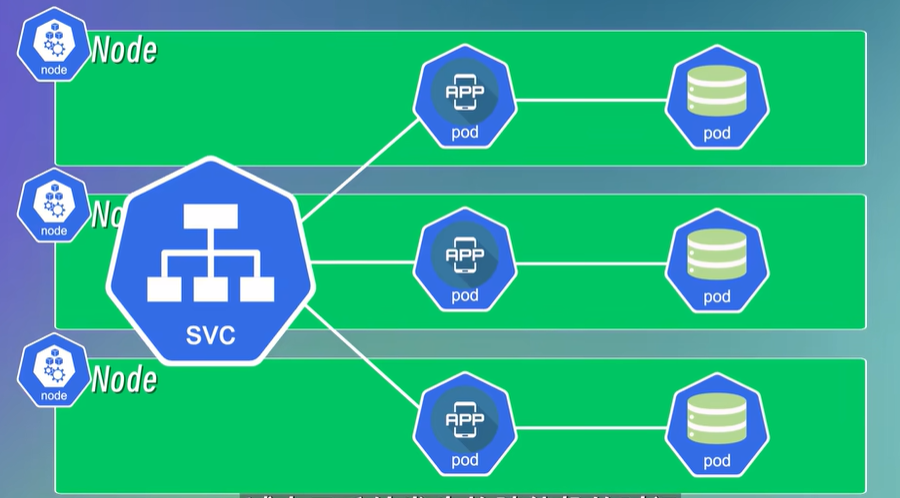
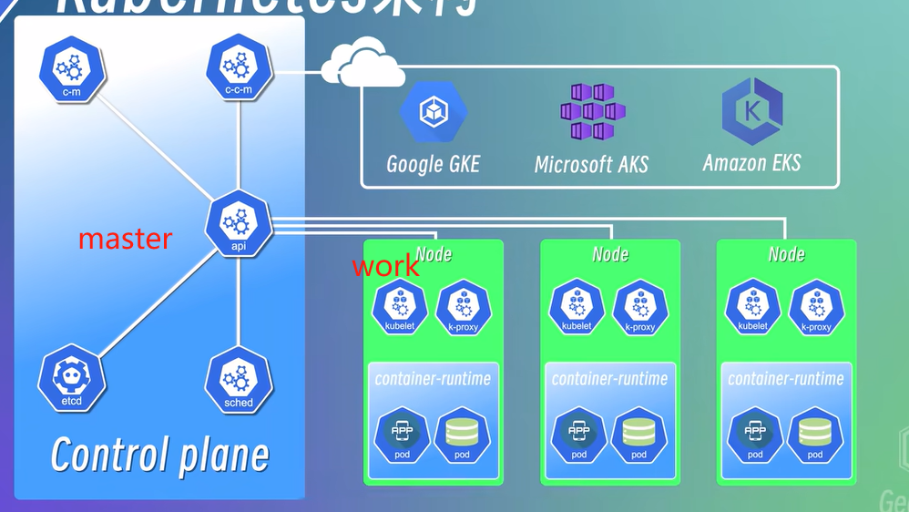
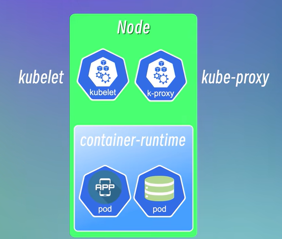
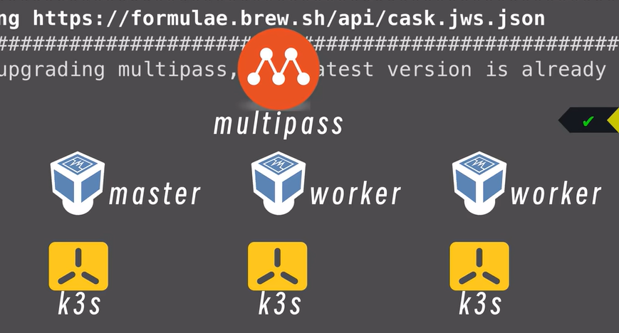
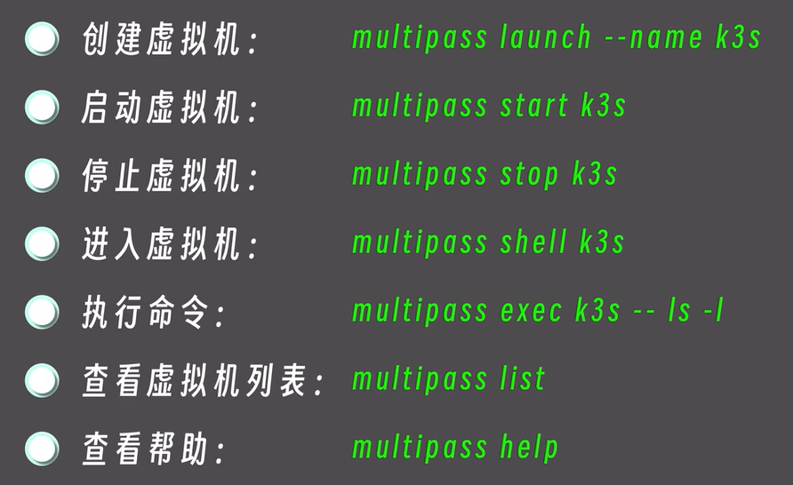
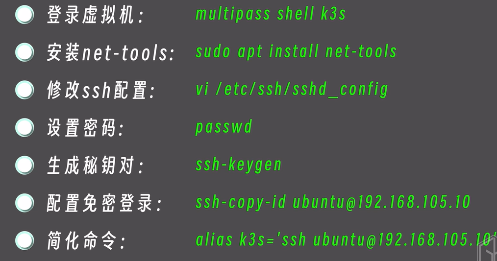
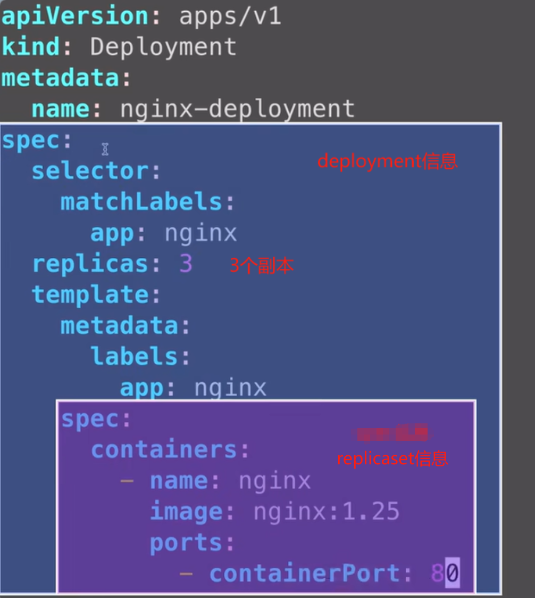
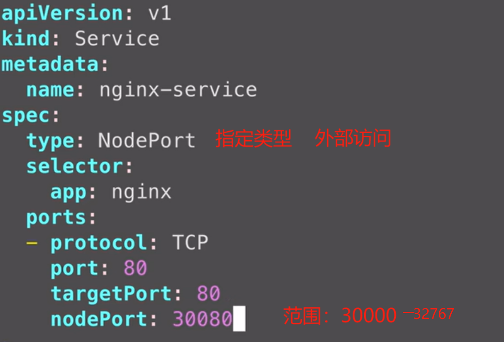
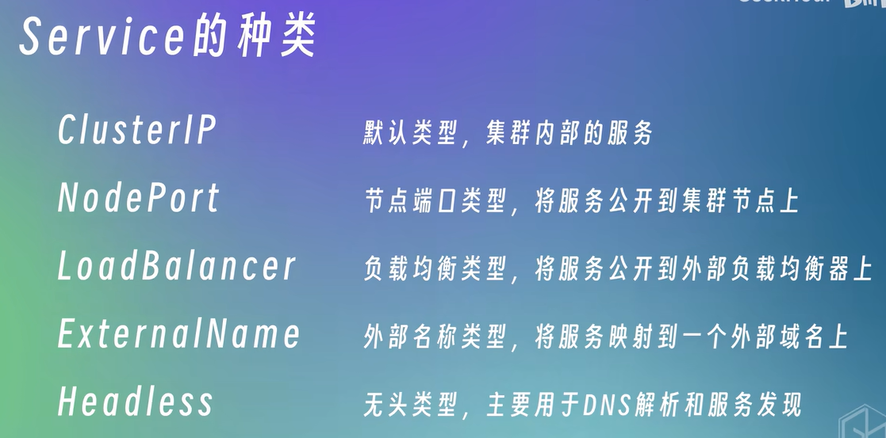

## 基础

### 基础

技术文档：https://yeasy.gitbook.io/docker_practice（很全面）


常用命令：

```shell
# 拉取镜像
docker pull [选项] [Docker Registry 地址[:端口号]/]仓库名[:标签]
```

### 代理

参考文章：https://blog.lalkk.com/4533/

代理地址：https://docker.m.daocloud.io

**修改地址方法：**

**1.拉取镜像时，添加地址**

灵活，推荐使用

```shell
# docker pull docker.m.daocloud.io（代理地址）/镜像名:版本
docker pull docker.m.daocloud.io/mysql:5.7.0
```

拉取后，使用时，要加上代理的前缀

```shell
docker run -d --name mysql -p 3306:3306 docker.m.daocloud.io/mysql:5.7.0
```

**2.修改默认的仓库地址**

这种方法需要重启 docker，已有容器在运行时，需要格外注意。

在 /etc/docker/daemon.json 修改（没有 json 文件新建即可）

```shell
{
    "registry-mirrors": [
        "https://docker.m.daocloud.io",
        "https://huecker.io",
        "https://dockerhub.timeweb.cloud",
        "https://dockerproxy.1panel.live"
    ]
}

# 完成后重启 docker
sudo systemctl daemon-reload
sudo systemctl restart docker
```

**3.本地镜像的导出导入**

```shell
# 保存到本地
docker save -o nginx.tar nginx

# 将保存的镜像上传到其他服务器

# 加载镜像
docker load -i /dockerfile/nginx.tar

# 启动镜像
docker run -d -p 80:80 nginx
```

## 生产使用

### 1.通用镜像启动

升级时，不需要重新构建镜像，只更新 jar 包即可，可以打一个通用的 Dockerfile 文件（只是为了制作通用镜像。）

启动容器的时候，将 jar 包、配置文件等一并配置上，在进行启动，后续版本升级时，只需要通过 restart 重新加载即可，不需要重新打包镜像。

**通用镜像文件**

```dockerfile
FROM docker.m.daocloud.io/openjdk:17

# 设置工作目录
WORKDIR /app

# （可选）如果需要，可以预先配置一些环境变量或默认配置
# ENV SOME_ENV_VAR=value

# 容器启动时的默认命令（可以被覆盖）
CMD ["sh", "-c", "echo 'No JAR file provided. Please mount a JAR file and restart the container.' && sleep infinity"]
```

放在服务器固定的一个目录，包括 jar、application、Dockerfile


打包通用镜像文件

```shell
docker build -t device-manager-miniprojram:0.1 .
docker build -t device-manager-web .
# 不制定版本时，则是 latest 版本
```


使用 docker run 启动容器

```shell
# 启动容器
docker run -d -m 3g --memory-swap -1 \
				-v /var/www:/var/www \
                -v /wxlogs/device-manager-miniprogram:/wxlogs/device-manager-miniprogram \
                -v /etc/localtime:/etc/localtime \
                -v /etc/timezone:/etc/timezone \
                -v /var/www/webapp/files:/var/www/webapp/files \
				-v /home/wuxing/docker/device-manager-miniprogram:/data \
                --log-opt max-size=100m \
                --log-opt max-file=3 \
                --net host \
				-p 9090:9090 \
                --name device-manager-miniprogram -it \
				device-manager-miniprogram \
				java -jar /data/wuxing-device-miniprogram.jar \
				-Xmx2048m -Xms1024m -Xmn512m \
				--spring.config.location=/data/application-prod.yaml \
				--add-opens=java.base/java.lang=ALL-UNNAMED
```

```shell
# 参数解释
run 启动
-d  后台执行
-m 3g 设置容器内存
-c|--cpu-shares[=0] 参数来调整容器使用 CPU 的权重
--memory-swap -1 交换内存
-v 挂在各种文件卷
--log-opt log 的设置
--net 网络使用
-p 端口 P 也是端口但是是随机的
--name 容器名称
-it 两个参数 -i 交互式操作 -t 终端
device-manager-miniprogram 使用的镜像，不制定则是 latest
java -jar 启动服务 /data/wuxing-device-miniprogram.jar jar包位置
-Xmx2048m -Xms1024m -Xmn512m 服务内存
--spring.config.location=/data/application-prod.yaml 服务的配置文件位置
--add-opens=java.base/java.lang=ALL-UNNAMED 启动参数（反射相关的）
```

后续升级，直接更换 jar 包，docker restart 即可。

### 2.固定镜像启动

dockerfile 文件打成标准的镜像，然后通过容器启动。

```dockerfile
FROM docker.m.daocloud.io/openjdk:17
VOLUME /tmp
ADD web.jar app.jar
ENTRYPOINT ["java","--add-opens=java.base/java.lang=ALL-UNNAMED","-jar","-Xmx2048m","-Xms1024m","-Xmn512m","-Dspring.profiles.active=prod","-Dfile.encoding=utf-8","/app.jar"]
ENV LANG=en_US.UTF-8
ENV DATABASE_URL=jdbc:mysql://127.0.0.1:3306
ENV DATABASE_USERNAME=root
ENV DATABASE_PASSWORD=root
ENV REDIS_HOST=127.0.0.1
ENV REDIS_PASSWORD=root
ENV RABBITMQ_HOST=127.0.0.1
ENV RABBITMQ_PASSWORD=root
ENV MQTT_HOST=tcp://127.0.0.1
ENV M2M_IP_ADDRESS=127.0.0.1
```

entrypoint 启动后执行的命令，这里配置的是 jar 启动后的 内存、配置文件、jar 文件等

env 是环境变量参数，可以在启动时，传入到 prod 中，替换对应的变量，application 中类似这种

```shell
redis:
    host: ${REDIS_HOST:127.0.0.1}
    port: ${REDIS_PORT:6379}
    password: ${REDIS_PASSWORD:root}
```

也可以在 docker run 的时候通过启动参数传入

```shell
docker run -d --name demo ...
		-e REDIS_HOST=172.17.0.1 \
        -e RABBITMQ_HOST=172.17.0.1  \
```

## kubernetes

### 作用

1.编排文件，部署服务 2.动态扩容服务

### 概念

**Pod**：最小调度单元，一个或多个容器的组合，共享网络、资源等（一般就部署一个容器）。Pod 创建后会有 ip 等，通过 ip 互相访问（仅限内部），Pod 出问题时，会被系统销毁然后在重建（ip 也会重新分配）。

**Service**：将一组 Pod 封装成一个服务，提供一个稳定的地址，里面的 Pod 重建，不会影响外面的访问。也分内（mysql、redis、kafka）、外服务（api、用户业务）。外部服务通过 node:port 提供访问，但这种方式只能通过 ip 访问。

**Ingress**：管理集群从外部访问内部服务的入口和方式，配置转发规则。配置域名、负载均衡、ssl 证书。

**ConfigMap**：将配置信息封装起来，应用中直接读取使用，分离配置的和镜像的耦合。明文存储，不适合 password 这些。

**Secret**：类似 configmap ，做了 base64 转码，配合其他工具进行使用。

**Volume**：持久化存储，类似 docker 的 volume。

**Deployment**：定义和管理应用程序的副本数量，应用更新策略。批量管理 Pod，如果定义副本数量是 3 个，那么 Pod 就是 3 个，出问题时，重新删除在创建。升级时，逐渐使用新版本替换掉旧的版本。

**StatefulSet**：Deployment 适合管理应用服务，但是不合适管理有状态的应用，如：mysql，因为多副本最终的数据要一致。一般 mysql 这种脱离 k8s 单独部署。



### 架构

k8s 是 master（管理）、work（运行）架构。



一个 master 节点包括四个部分：

**1.kube-apiserver**：提供集群 api 接口，组件的通信，认证、授权。类似：gateway、sql 服务端。

**2.scheduler**：监控节点使用，调度 Pod，合理利用资源。

**3.control-manager**：管理资源状态，处理故障，发出命令。

**4.etcd**：高可用键值存储系统，整个数据（存储服务状态等）的存储中心。

**5.cloud controller manager**（云服务商才会有）：云平台控制器

一个 work 节点包括三个部分：

**1.kubelet**：管理、维护 Pod，让 Pod 正常运行，定期从 api-server 接受新的 Pod 规范，传递信息

**2.kube-proxy**：提供网络代理、负载均衡

**3.container-runtime**：类似 docker 的 docker-engine 功能（创建、启动、销毁）



### 环境搭建

**本地单节点**

minikube：运行一个本地单节点的集群环境、用来开发、测试、验证部署

kubectl：命令行的交互工具，用来创建 Pod Service，与 apiservice 交互。

拉取镜像添加 --image-mirror-country = cn，指定镜像为国内

**多节点**

使用 multipass、k3s 进行搭建多节点集群



multipass：轻量级虚拟机，类似 virtual

k3s：轻量级 k8s

```shell
multipass launch --name k3s --cpus 2 --memeory 8G --disk 10G
// launch 创建 name 名字
```

常用命令：



默认不可使用 ssh 登录，需要进行修改配置



#### k3s 安装

1.安装

2.获取 token

3.新终端执行，加入集群

kubectl 方法：

```shell
# 创建 pod
kubectl run nginx --image=nginx
# 查看 pod、service、deployment、all 全部
kubectl get pod
# 创建各种类型资源
kubectl create deployment（类型，还可以 service） nginx-deployment --image=nginx
# 查看日志
kubectl logs pod名字
# 进入 Pod
kubectl exec -it pod名字 --/bin/bash
```

### 使用 yaml 配置集群，类似 docker-compose

创建一个 nginx-deployment.yaml 配置

通过 kubectl create -f nginx-deployment.yaml 启动 

通过 kubectl apply -f nginx-deployment.yaml 更新资源，类似 docker-compuse up



**创建 service**

对外访问

```shell
# 创建
kubectl create service nginx-service
# 使用现有的 deployment 导出一个
kubectl expose deployment nginx-deployment
# 查看详细信息 类似 docker inspect
kubectl describe service nginx-deployment
```

使用 yaml 创建服务






内网地址

万水（主）： 10.0.2.11  迈讯通（其他）：10.0.2.9

主节点安装：

```shell
curl -sfL https://rancher-mirror.rancher.cn/k3s/k3s-install.sh | INSTALL_K3S_MIRROR=cn sh -s - server --cluster-init --disable=traefik --flannel-backend=none --disable-network-policy --cluster-cidr=10.1.2.0/16
```

获取token：

```shell
cat /var/lib/rancher/k3s/server/token
```

K10a0b2213bb91770946780c9284a4a6c762cfd70b06fde3fe0cc1a40d91cc99e37::server:fa62216a91ac5572ece3cf6e73224ca7

其他节点安装：

```shell
curl -sfL https://rancher-mirror.rancher.cn/k3s/k3s-install.sh | INSTALL_K3S_MIRROR=cn K3S_TOKEN=K10a0b2213bb91770946780c9284a4a6c762cfd70b06fde3fe0cc1a40d91cc99e37::server:fa62216a91ac5572ece3cf6e73224ca7 sh -s - server --server https://10.0.2.11:6443 --cluster-init --disable=traefik --flannel-backend=none --disable-network-policy --cluster-cidr=10.1.2.0/16
```

#### k3s 卸载

直接执行自带的卸载命令，卸载文件位置如下：

```bash
# 主节点
$ /usr/local/bin/k3s-uninstall.sh

# 工作节点
$ /usr/local/bin/k3s-agent-uninstall.sh
```

## 清理磁盘 释放空间

`overlay2` 是 Docker 默认的存储驱动，如果磁盘满了，**通常是容器层、镜像层、日志或未清理资源堆积**导致的。清理需要分步骤安全执行，否则可能误删正在使用的数据。

下面给你一套 **生产常用、安全优先** 的排查 + 清理流程。

------

### 一、先确认是不是 overlay2 占满

1️⃣ 查看 Docker 总占用

```bash
docker system df
```

可以看到：

- Images（镜像）
- Containers（容器）
- Local Volumes（卷）
- Build Cache（构建缓存）

------

2️⃣ 查看 overlay2 真实占用

```bash
du -sh /var/lib/docker/overlay2
```

一般 Docker 数据默认在：

```
/var/lib/docker/
```

如果 overlay2 非常大，基本就确定问题来源。

------

### 二、安全清理（推荐顺序）

⚠️ 强烈建议按顺序执行

------

✅ 方法1：清理停止的容器（最安全）

```bash
docker container prune
```

只会删除：

👉 已停止容器

不会影响运行中的服务

------

✅ 方法2：清理未使用镜像

```bash
docker image prune
```

如果想清理更多：

```bash
docker image prune -a
```

区别：

- 默认：只删 dangling 镜像
- `-a`：删所有未被容器使用镜像

------

✅ 方法3：清理未使用 volume

```bash
docker volume prune
```

⚠️ 注意：

删除后数据不可恢复

------

✅ 方法4：清理 build cache

```bash
docker builder prune
```

或

```bash
docker builder prune -a
```

------

#### ⭐ 一键清理（最常用）

```bash
docker system prune
```

如果你想清理更彻底：

```bash
docker system prune -a --volumes
```

这个会删除：

- 停止容器
- 未使用镜像
- 未使用网络
- 未使用卷
- build cache

👉 通常能清理最多空间

------

### 三、日志文件经常是最大元凶（很多人忽略）

Docker 默认日志不会自动清理。

查看日志大小

```bash
du -sh /var/lib/docker/containers/*/*.log
```

------

直接清空日志（非常有效）

```bash
truncate -s 0 /var/lib/docker/containers/*/*.log
```

👉 不会影响容器运行
👉 只清空日志内容

------

### 四、找出占空间最大的 overlay 目录

如果你想精确定位：

```bash
du -h /var/lib/docker/overlay2 | sort -hr | head -20
```

------

### 五、如果空间仍然爆满（高级排查）

查看每个容器占用

```bash
docker ps -s
```

------

查看镜像层

```bash
docker images
```

------

### 六、长期解决方案（生产强烈建议）

1️⃣ 设置日志自动轮转

编辑：

```
/etc/docker/daemon.json
```

加入：

```json
{
  "log-driver":"json-file",
  "log-opts":{
    "max-size":"100m",
    "max-file":"3"
  }
}
```

然后重启：

```bash
systemctl restart docker
```

------

2️⃣ 定期自动清理（cron）

例如：

```bash
docker system prune -af
```

------

### 七、⚠️ 千万不要直接手动删除 overlay2 目录

很多人会：

```
rm -rf /var/lib/docker/overlay2/*
```

👉 这会直接破坏 Docker 元数据
👉 可能导致容器全部损坏

除非你准备 **重装 docker**

------

### 八、如果你现在磁盘已经100%满（紧急处理）

建议先执行：

```bash
truncate -s 0 /var/lib/docker/containers/*/*.log
```

这个通常立刻释放空间。

------

### 九、额外检查（很多人会漏）

查看系统整体占用

```bash
df -h
```

找最大目录

```bash
du -h --max-depth=1 / | sort -hr
```

------

#### 👉 推荐标准清理流程（运维常用）

```bash
docker container prune -f
docker image prune -af
docker volume prune -f
docker builder prune -af
```
