## 问题记录：

1.添加 @mapper 注解后，仍无法扫到
原因：配置了 @mapperscan ，当两者都存在时，以 @mapperscan 为主

2.Invalid bound statement (not found)
原因：mapper 对应的 xml 中 没有对应的方法
深层：@mapperscan 不要扫到无关的接口 比如：service 被扫到会报 但是测试无问题

3.granted authority textual representation is required
security 中 创建 SimpleGrantedAuthority 参数不能为null、空串

4.No spring.config.import property has been defined的问题
SpringCloud 2020.* 版本把bootstrap禁用了，导致在读取文件的时候读取不到而报错，所以我们只要把bootstrap从新导入进来就会生效了。

5.没有springbootstarter时，使用 slf4j 报错 找不到
需要单独引用 

```java
</dependency>
    <groupId>org.slf4j</groupId>
    <artifactId>slf4j-api</artifactId>
    <version>1.7.36</version>
</dependency>
```

## TDengine

1.创建数据库报错 DB error: Out of dnodes (0.000401s)

原因：

这个错误提示表明 TDengine 的数据节点已经用完，无法继续创建新的数据库。这可能是由于您的 TDengine 数据库中已经存在了大量的数据库或者数据表，并且系统没有足够的资源来支持创建新的数据库。

删除语句

```shell
DROP DATABASE [IF EXISTS] db_name
```

## 查看内存泄露

### 1.转储 hprof 文件

1）预配置 oom 时自动转储文件

本地 JVM 启动参数中添加堆内存溢出时自动生成堆转储的配置。

```bash
java \
  -XX:+HeapDumpOnOutOfMemoryError \  # 开启OOM时自动生成堆转储
  -XX:HeapDumpPath=/dump/heapdump.hprof \  # 指定堆转储文件路径
  -jar your-application.jar
```

docker 中启动

```bash
docker run -d \
  -v /path/on/host/dump:/dump \  # 宿主机目录映射到容器内的/dump
  your-docker-image \
  java -XX:+HeapDumpOnOutOfMemoryError -XX:HeapDumpPath=/dump/heapdump.hprof -jar app.jar
```

手动转储：

需要先知道 java 的进程 PID。如果是 docker 需要先 exec 进入 容器中。

```shell
# JVM Process Status Tool 获取当前所有 java 进程 pid 命令 
# 输出示例：1 app.jar
jps -l

# 或者
top | grep java
ps -ef | grep java
```

如果没有 java 命令，可以先进行安装 jdk

```bash
apt-get update && apt-get install -y openjdk-11-jdk  # 根据JVM版本调整
```

**生成堆转储**

```bash
jmap -dump:live,format=b,file=/dump/heapdump_manual.hprof 1  # 替换为实际PID
```

docker文件导出

```shell
# docker -> 宿主机
docker cp 容器id或名称:/path/filename /path/filename
# 宿主机 -> docker
docker cp /path/filename 容器id或名称:/path/filename
```

### 2.headdump.hprof 分析

使用 MAT 工具分析：（工具下载地址：https://eclipse.dev/mat/）

MemoryAnalyzer.ini 配置文件，配置最大内存，防止不够加载。

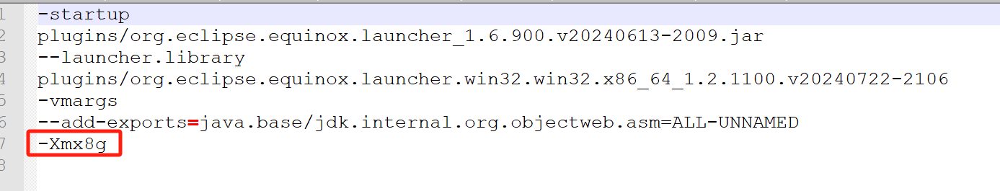

MemoryAnalyzer.exe 启动软件，加载堆转储文件。

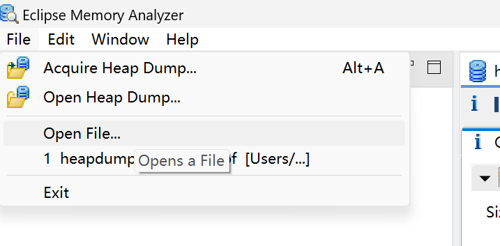

加载需要等待一段时间，可以先去做别的事情。

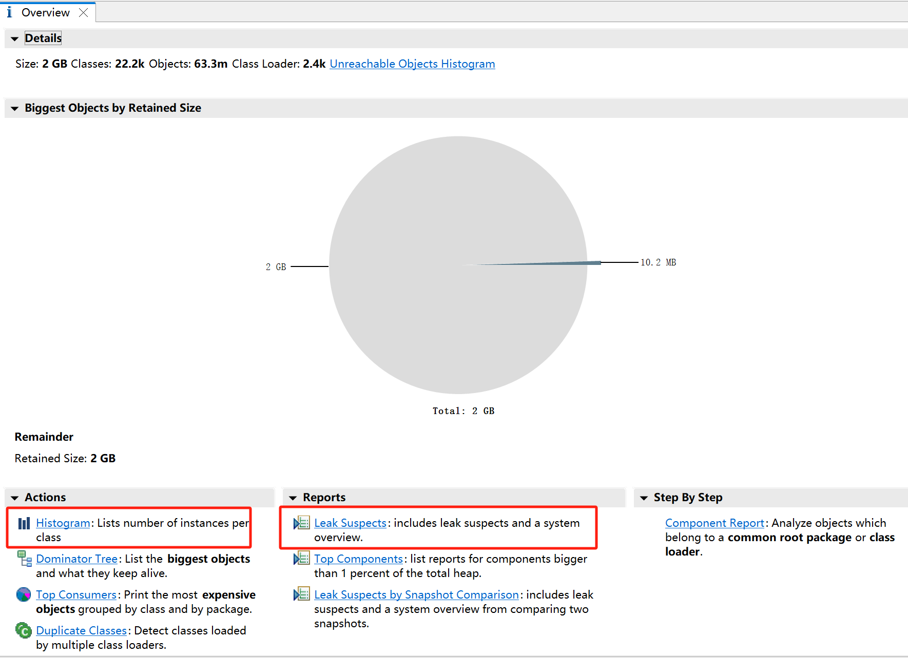

#### Histogram 视图

可以看到对象的数量和占用内存大小。右键 List objects 可以查看对象引用关系，这里查看引用功能，包括本对象引用外部对象 with outgoing references 与外部对象引用本对象 with incoming references。with outgoing references 使用该功能，可以查看对象内部都引用了哪些外部对象，

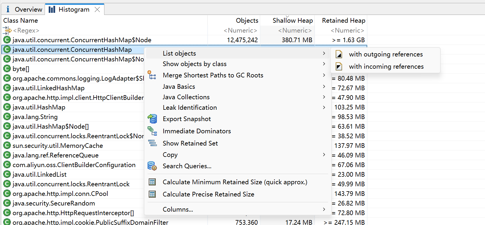

#### Leak Suspects报表（重点）

直观地展现了一个饼图，图中颜色深的部分表示可能存在内存泄漏的嫌疑。每一个模块都有对应的详情信息。

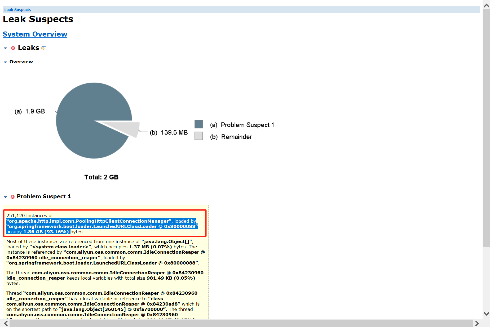

这里可以看到是这个地方内存泄露。

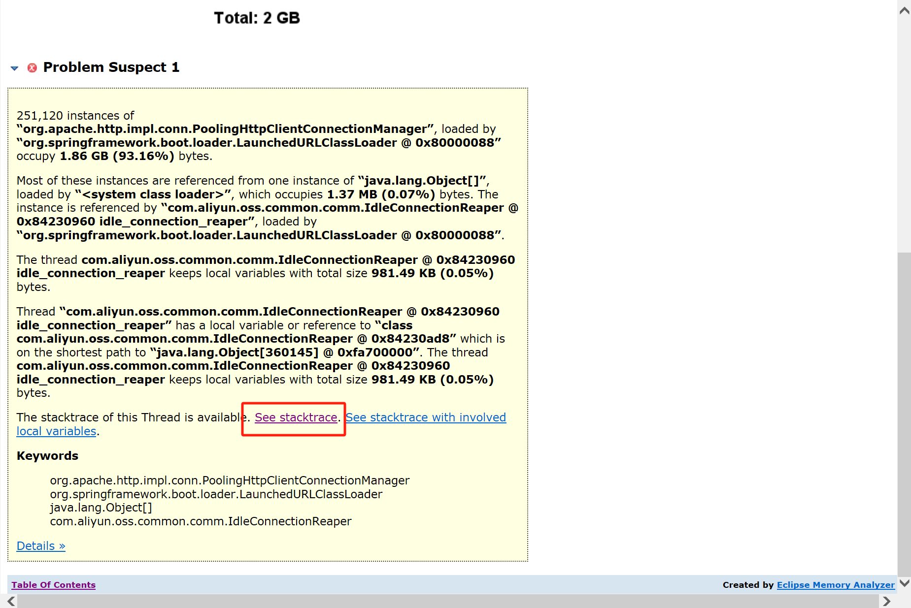

点击这里看具体的堆栈

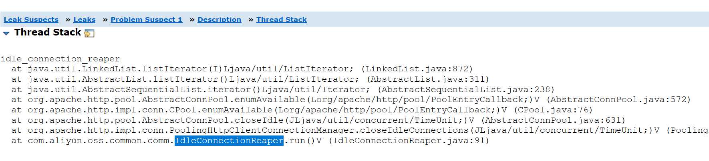

阿里云的问题

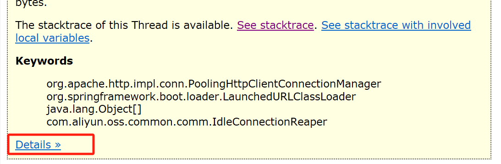

detail 看详情

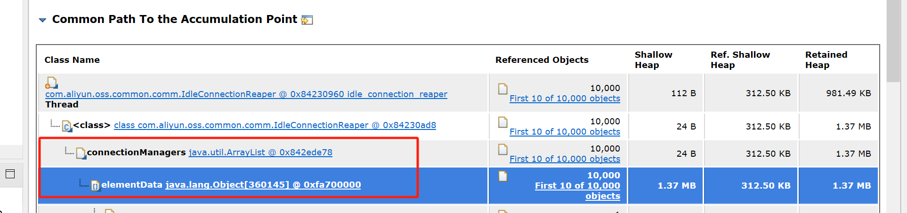

这里一堆引用。

到代码检查，是 client 是 new 出来的，使用 完成后没有销毁。约积累越多。

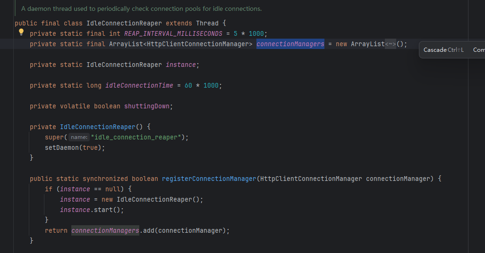

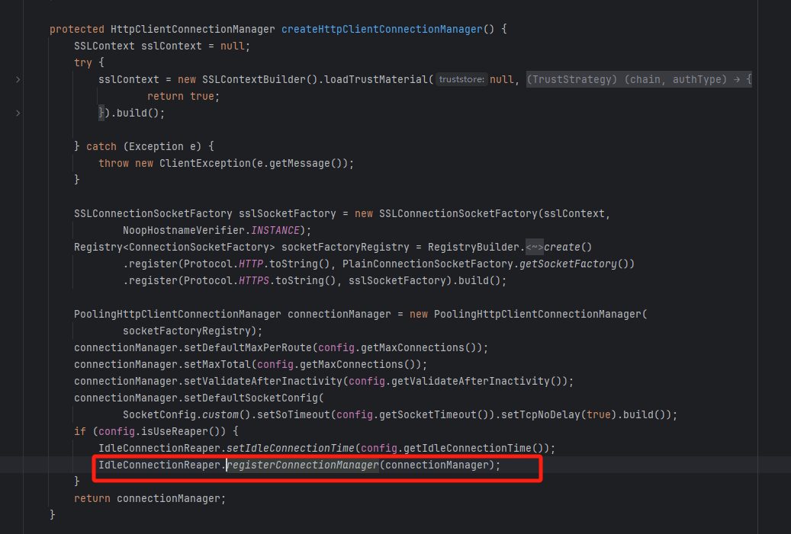

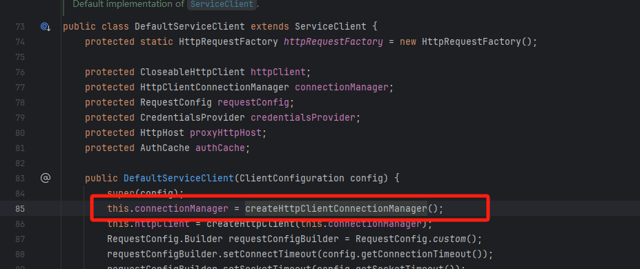

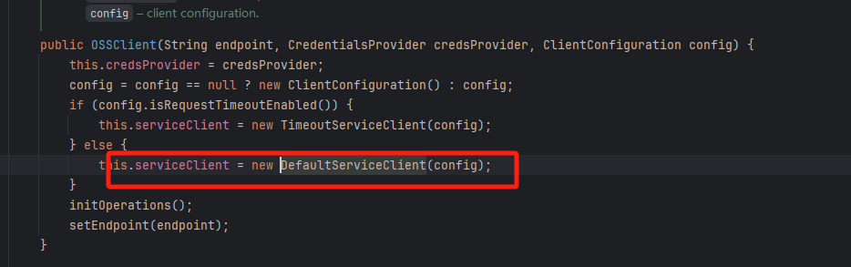

#### 解决办法

单例模式，或者使用完移除。

### 3.其他指令

查看堆栈

```shell
# jstack pid 查看堆栈
jstack 15180
```

查看已使用空间站总空间的百分比

```shell
# jstat [ option vmid [interval[s|ms] [count]] ]
jstat -gcutil pid 1000
# 	gcutil指：已使用空间站总空间的百分比。
# 	20954指：pid
# 	1000指：每1000毫秒查询一次，一直查。
```

查看堆快照

```shell
# jmap [ option ] vmid
jmap -histo:live pid

# heap dump，生成离线文件
jmap -dump:live,format=b,file=heap.hprof pid
```

文件查看

```shell
# 最后 20 行
tail -20 xx.log
# 实时监控
tail -f xx.log

# 前 20 行
head -20 xx.log
```


## redis cpu高 分析

cpu 高，一般是某些指令耗时比较久，例如 keys *、scan 指令。

分析方法：

``` shell
# 获取慢查询记录条数
slowlog len
```

```shell
# 获取慢查询记录指令
slowlog get 100
```

执行结果

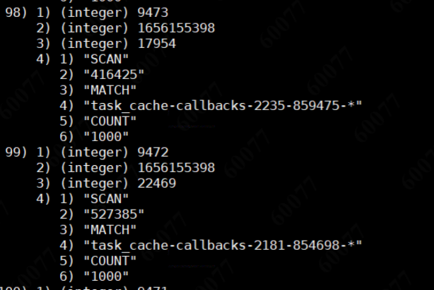

```shell
# 指令状态统计
info commandstats

calls: 执行总次数
usec：总耗时
usec_per_call：平均时间，单位：微秒
```

执行结果

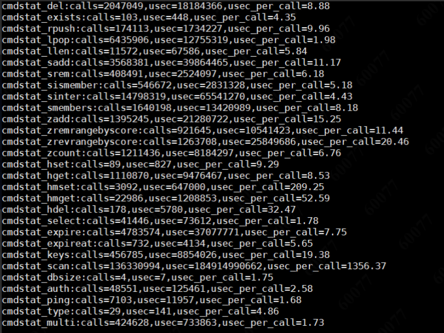

scan 调用次数为1.36亿，平均时间为 1356.37 微秒。这个意味，如果都是这样的操作，redis 每秒并发性能只能达到 1000。

```shell
# monitor 指令监控
monitor
# 可以在容器外执行 并导出一段时间的命令
redis-cli -h 127.0.0.1 -p 6379 -a password monitor > a.txt
```

内容预览

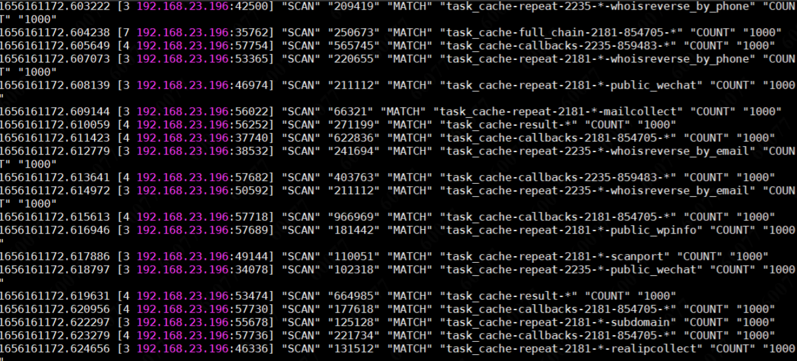

可以进行统计

```shell
# 统计总记录数
cat a.txt | wc -l
# 统计某一秒的记录
cat a.txt | grep 1656161170. | wc -l
# 统计某个指令次数
cat a.txt | grep SCAN | wc -l
# 查看具体内容
cat a.txt | grep SCAN 
```

其他命令

```shell
redis info xxx

# 例子：
redis info cpu
```

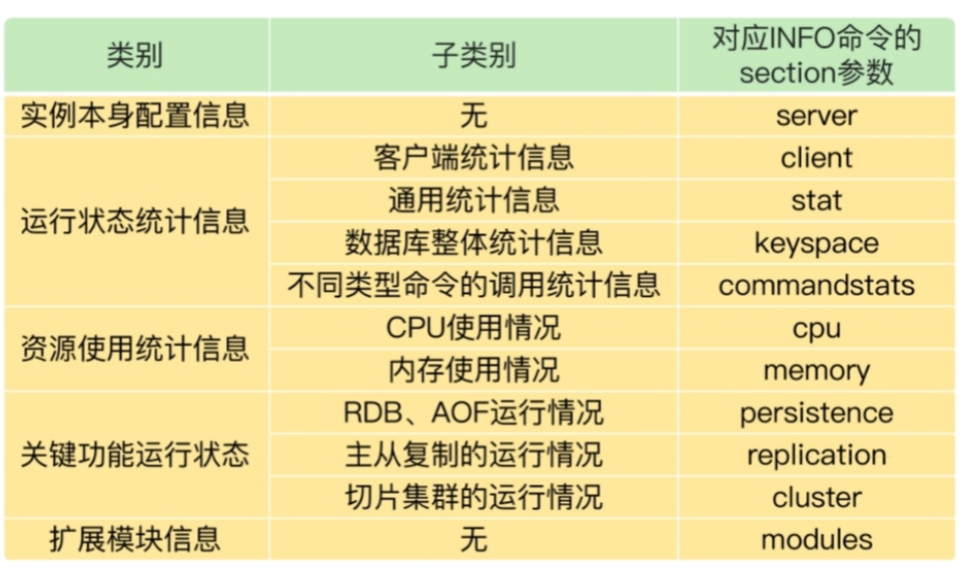

参考：

https://pdai.tech/md/db/nosql-redis/db-redis-x-performance.html

## 1. 通过 gateway、nacos 实现灰度用户功能

核心点：自定义 loadbalance、nacos metadata 标识、http头标识、openfeign透传

## 2. ssh远程通道转发请求，实现本地接入环境测试

ssh 通道服务器配置接收请求

ssh隧道 ssh -NR 6003:localhost:9080 root@139.9.177.138

## 3. nacos 使用权重 优雅发布升级

配置权重0，处理完所有请求，停机下线，升级上线，权重恢复

那么，到底什么才是SpringCloud 优雅下线呢？

包括以下内容：

- 处理没有完成的请求，注意，不再接收新的请求
- 池化资源的释放：数据库连接池，HTTP 连接池
- 处理线程的释放：请求处理线程的释放
- SpringCloud 微服务实例优雅的下线方式，主动从注册中心注销，保证其他的 RPC客户端不会发生错误的RPC调用

## 4. ssh 连接数据库

pom 引入

```java
<dependency>
    <groupId>com.jcraft</groupId>
    <artifactId>jsch</artifactId>
    <version>0.1.55</version>
    </dependency>
```

配置类

```java
package com.wxkjwlw.device.miniprogram.util;

import com.jcraft.jsch.JSch;
import com.jcraft.jsch.Session;

import java.util.Properties;

public class SshConnectionTool {
    //ssh连接的用户名
    private final static String SSH_USER = "root";
    //ssh连接的密码
    private final static String SSH_PASSWORD = "KM?]tX4J5P;w7hV";
    //ssh远程连接的ip地址
    private final static String SSH_REMOTE_SERVER = "106.55.181.213";
    //ssh连接的端口号
    private final static int SSH_REMOTE_PORT = 22;
    //本地mysql发起连接的IP地址
    private final static String MYSQL_REMOTE_SERVER = "127.0.0.1";
    //本地数据库连接时用的端口号
    private final static int LOCAl_PORT = 3307;
    //远程数据库端口用的端口号
    private final static int REMOTE_PORT = 3306;

    private Session session; //ssh 会话

    public void closeSSH() {
        session.disconnect();
    }


    public SshConnectionTool() throws Throwable {
        JSch jSch = new JSch();
        session = jSch.getSession(SSH_USER,SSH_REMOTE_SERVER,SSH_REMOTE_PORT);

        session.setPassword(SSH_PASSWORD);

        //设置连接过程不校验known_hosts文件中的信息
        Properties config = new Properties();
        config.put("StrictHostKeyChecking", "no");
        session.setConfig(config);

        session.connect(); //ssh 建立连接！

        //根据安全策略，您必须通过转发端口进行连接
        session.setPortForwardingL(LOCAl_PORT, MYSQL_REMOTE_SERVER, REMOTE_PORT);

    }
}

```

连接类

```java
package com.wxkjwlw.device.miniprogram.util;

import org.springframework.stereotype.Component;

import javax.servlet.ServletContextEvent;
import javax.servlet.ServletContextListener;

@Component
public class SshContextListener implements ServletContextListener {
    private SshConnectionTool conexionssh;

    public SshContextListener() {
        super();
    }

    /**
     * @see ServletContextListener#contextInitialized(ServletContextEvent)
     */
    public void contextInitialized(ServletContextEvent arg0) {
        System.out.println("Context initialized ... !");
        try {
            conexionssh = new SshConnectionTool();
        } catch (Throwable e) {
            e.printStackTrace(); // 连接失败
        }
    }

    /**
     * @see ServletContextListener#contextDestroyed(ServletContextEvent)
     */
    public void contextDestroyed(ServletContextEvent arg0) {
        System.out.println("Context destroyed ... !");
        conexionssh.closeSSH(); // 断开连接
    }

}

```

## 5.arthas 使用

文档：

https://arthas.aliyun.com/doc/quick-start.html

### 实际问题：

#### 1.发现 cpu 占用很高

1.通过 top 命令 查看那个进程（pid）占用，发现是 java


2.使用 arthas attach 到该进程

3.通过 dashboard 看板，查看具体是哪一个线程占用，发现是线程池的线程

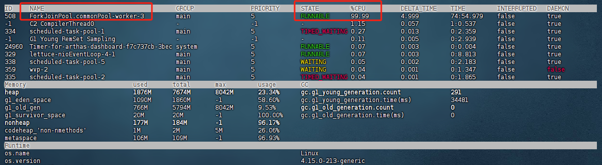

4.通过 thread -n 1（打印最烦忙的前几个）或 thread 508（指定线程 id），打印线程信息，发现是 hashmap 扩容导致的

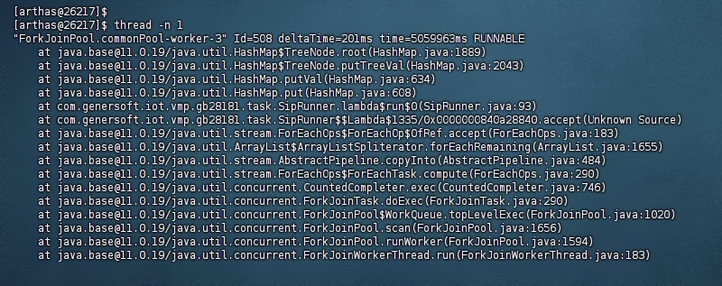

5.根据图片日志，定位到代码，SipRunner.java:93，

将 HashMap 调整为 ConcurrentHashMap

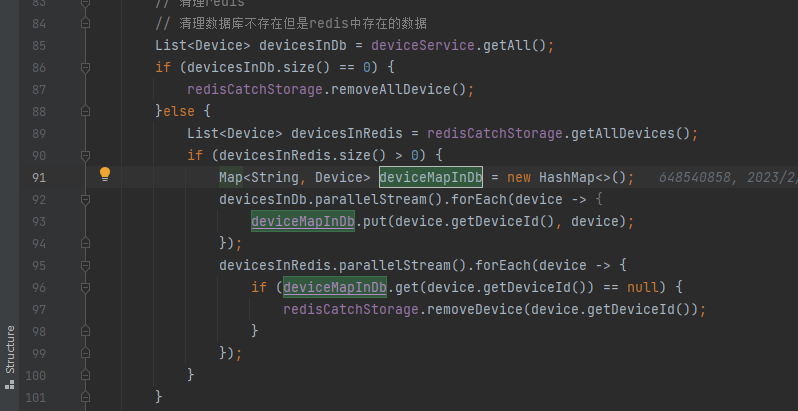

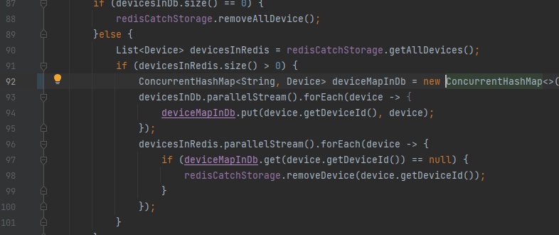

# 项目

### 1、springsecurity具体判定流程、jwt存储、token交互，登录拦截、权限认证

### 2、mqtt消息及流量控制

topic分级、设置4个级别

压缩mqtt消息，对具体内容gzip压缩传输

内容播放素材的md5校验，缓存设计。本机缓存的lru算法

中继服务器缓存，每个门店统一放一个，直接让设备请求

下载时间控制，非收银高峰期进行任务下载

### 3、同步播放算法、任务排期算法及优化

### 4、rbac权限模型、如何自定义的权限，

用户 角色 权限  还有一层门店的概念

### 5、openfeign超时时间

连接 10s 读取 60s 超时，并发场景下 大量占用资源，资源耗尽

默认不重试

### cpu飙升问题排查

**常规操作**

1、top找出那个进程cpu高

2、top -Hp pid 找到进程中那个线程cpu高

3、jstack 导出线程堆栈

4、根据16进制查找线程分析方法

如果是定位到自己的代码，则去看逻辑

第三方代码，去看源码

gc就要去看内存、

可能问题：

1、while死循环 链表

2、频繁的 young gc 垃圾回收需要内存和cpu

3、死锁 

4、序列化、反序列化

5、密集的计算  复杂的正则等

#### 内存标高问题排查

1、可以设置heapdump，自动转储文件

2、停掉一台服务器，单独排查（多服务器情况下）

3、测试环境压测

原因：

内存泄漏，静态对象引用，导致局部变量无法释放。io操作没有及时释放。单例模式线程池中的对象引用，threadlocal。

查询过程

```
free -h # linux 命令，看一下总内存使用情况
jmap -histo <进程号> # 查看对象数量和大小
# jmap生成堆转储文件最好不要再线上使用。
jmap -dump:format=b,file=<导出目录+文件名>heap.hprof <进程号> #内存镜像
```

查看虚拟机配置 

java -XX:+PrintFlagsFinal -version

设置堆转储文件  -XX:+HeapDumpOnOutOfMemoryError -XX:HeapDumpPath=E:\Java

**arthas（阿尔萨斯）**：

通过全局视角实时查看应用 load、内存、gc、线程的状态信息

- jvm观察jvm信息
- thread定位线程问题
- dashboard 观察系统情况
- heapdump + jhat分析
- jad反编译
  动态代理生成类的问题定位
  第三方的类（观察代码）
  版本问题（确定自己最新提交的版本是不是被使用）
- redefine 热替换
  目前有些限制条件：只能改方法实现（方法已经运行完成），不能改方法名， 不能改属性
  m() -> mm()
- sc  - search class
- watch  - watch method

### 6、单体架构拆分遇到的问题

相互依赖关系。商品    模板   设备三者关系

一开始模板中写入样板，从商品取数据注入。但是后来商品数据变化也需要出发模板下发。

单独把下发拆成一个模块，商品和模板都把数据给他 推送下来。


# 其他

1、最难的、最有成就感

写排序算法、同步播放算法。

2、怎么解决问题的

# 高并发、高性能、高可用

**在 4 核 8G 的机器上运 MySQL 5.7 时，大概可以支撑 500 的 TPS 和 10000 的 QPS**。

高并发：大流量

高性能：响应快速

高可用：不宕机，系统具备较高的无故障运行的能力。


可扩展性：弹性扩容

**数据库、缓存、依赖的第三方、负载均衡、交换机带宽等等** 都是系统扩展时需要考虑的因素。我们要知道系统并发到了某一个量级之后，哪一个因素会成为我们的瓶颈点，从而针对性地进行扩展。

解决方案

从请求发起开始，

app客户端缓存拦截、dns服务器、cdn服务、分配最近网络，nginx负载、网关拦截、流量控制、redis缓存、mq消息队列、mysql读写分离、分库分表。

黑名单：

运营商黑名单、服务器黑名单、nginx+redis+lua配置黑名单、网络拦截黑名单、后台查询账号禁用。

## 高并发流量治理：

1、横向扩展，分布式，把大流量分开，分到每一个机器上

2、缓存，减少对数据库的冲击

3、异步，现将请求返回，处理好之后在通知，aio

# 架构


我来解释一下这个分层架构中的每一层的作用：

- 终端显示层：

  各端模板渲染并执行显示的层。当前主要是 Velocity 渲染，JS 渲染， JSP 渲染，移动端展示等。

- 开放接口层：

  将 Service 层方法封装成开放接口，同时进行网关安全控制和流量控制等。

- Web 层：

  主要是对访问控制进行转发，各类基本参数校验，或者不复用的业务简单处理等。

- Service 层：业务逻辑层。

- Manager 层：

  通用业务处理层。这一层主要有两个作用：

  - 其一，你可以将原先 Service 层的一些通用能力下沉到这一层，比如 **与缓存和存储交互策略**，中间件的接入；
  - 其二，你也可以在这一层 **封装对第三方接口的调用，比如调用支付服务，调用审核服务等**。

- DAO 层：

  数据访问层，与底层 MySQL、Oracle、Hbase 等进行数据交互。

- 外部接口或第三方平台：

  包括其它部门 RPC 开放接口，基础平台，其它公司的 HTTP 接口。

## 对接

### 微信支付

1.分为 v2 v3 两个版本，安全升级，私钥有微信保管，防止泄露

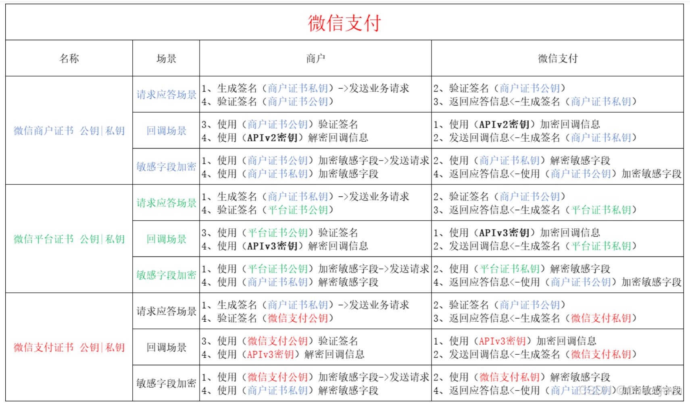

2.普通用户、服务商。理解上就是代理的区别，详细的见下：https://blog.csdn.net/weixin_64051447/article/details/129794828

### 小程序 v2 对接

官方文档：https://pay.weixin.qq.com/doc/v2/merchant/4011940985
