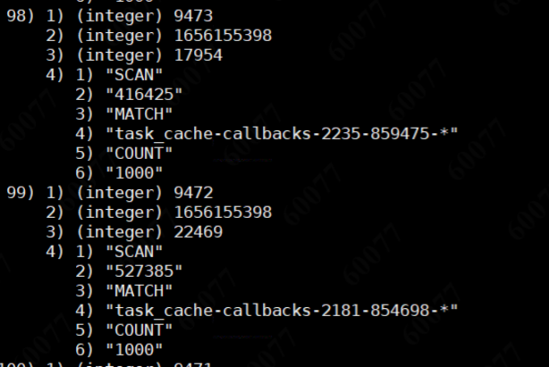
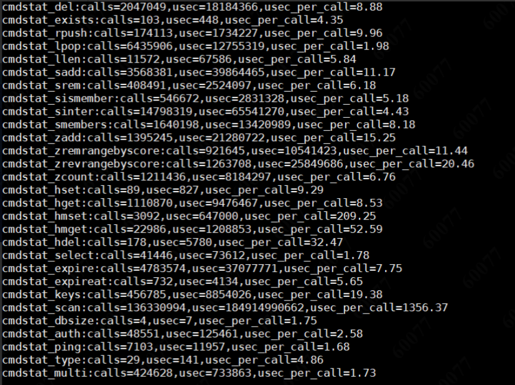
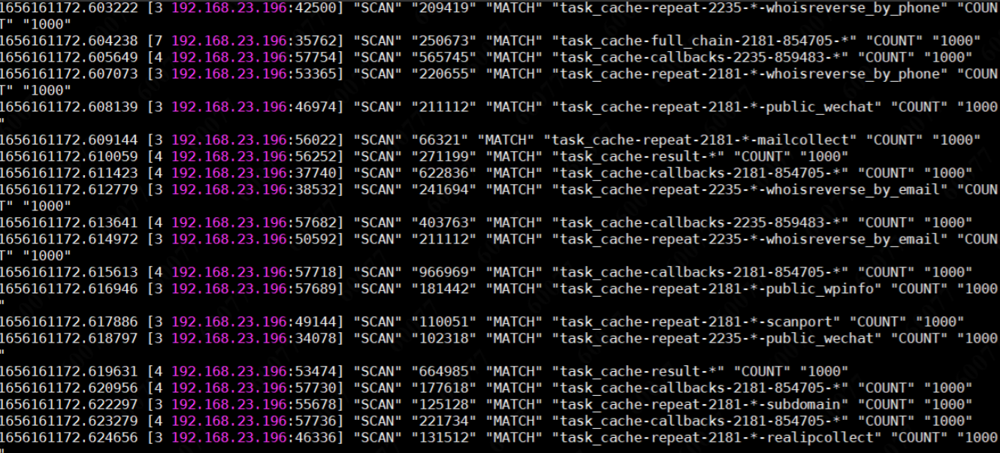
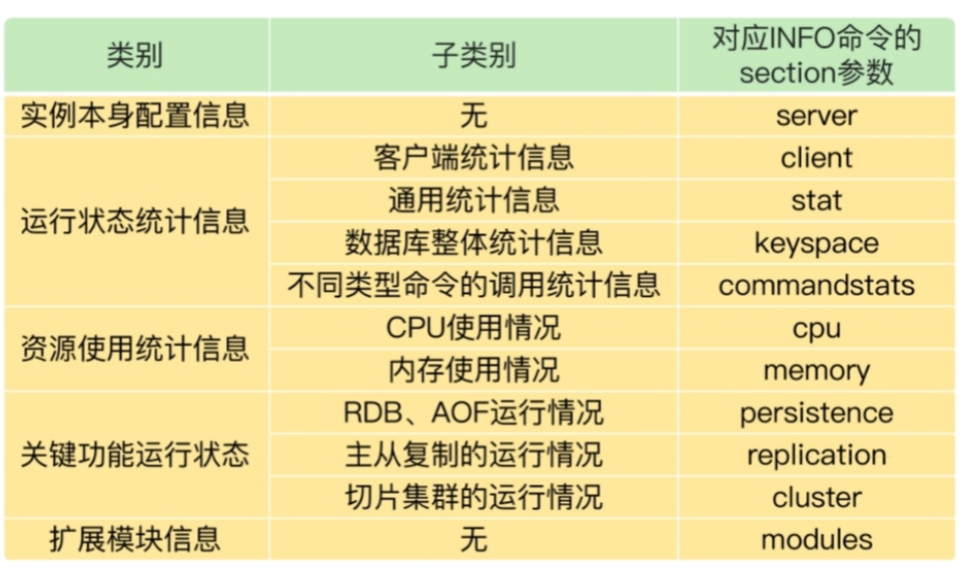

## 问题记录：

1.添加 @mapper 注解后，仍无法扫到
原因：配置了 @mapperscan ，当两者都存在时，以 @mapperscan 为主

2.Invalid bound statement (not found)
原因：mapper 对应的 xml 中 没有对应的方法
深层：@mapperscan 不要扫到无关的接口 比如：service 被扫到会报 但是测试无问题

3.granted authority textual representation is required
security 中 创建 SimpleGrantedAuthority 参数不能为null、空串

4.No spring.config.import property has been defined的问题
SpringCloud 2020.* 版本把bootstrap禁用了，导致在读取文件的时候读取不到而报错，所以我们只要把bootstrap从新导入进来就会生效了。

5.没有springbootstarter时，使用 slf4j 报错 找不到
需要单独引用 

```java
</dependency>
    <groupId>org.slf4j</groupId>
    <artifactId>slf4j-api</artifactId>
    <version>1.7.36</version>
</dependency>
```

## TDengine

1.创建数据库报错 DB error: Out of dnodes (0.000401s)

原因：

这个错误提示表明 TDengine 的数据节点已经用完，无法继续创建新的数据库。这可能是由于您的 TDengine 数据库中已经存在了大量的数据库或者数据表，并且系统没有足够的资源来支持创建新的数据库。

删除语句

```shell
DROP DATABASE [IF EXISTS] db_name
```

## 查看内存泄露

查看进程

```shell
# JVM Process Status Tool 获取当前所有 java 进程 pid 命令
jps -l

# 或者
top | grep java
ps -ef | grep java
```

查看堆栈

```shell
# jstack pid 查看堆栈
jstack 15180
```

查看已使用空间站总空间的百分比

```shell
# jstat [ option vmid [interval[s|ms] [count]] ]
jstat -gcutil pid 1000
# 	gcutil指：已使用空间站总空间的百分比。
# 	20954指：pid
# 	1000指：每1000毫秒查询一次，一直查。
```

查看堆快照

```shell
# jmap [ option ] vmid
jmap -histo:live pid

# heap dump，生成离线文件
jmap -dump:live,format=b,file=heap.hprof pid
```

文件查看

```shell
# 最后 20 行
tail -20 xx.log
# 实时监控
tail -f xx.log

# 前 20 行
head -20 xx.log
```

docker文件导出

```shell
# docker -> 宿主机
docker cp 容器id或名称:/path/filename /path/filename
# 宿主机 -> docker
docker cp /path/filename 容器id或名称:/path/filename
```

head.hprof 分析

## redis cpu高 分析

cpu 高，一般是某些指令耗时比较久，例如 keys *、scan 指令。

分析方法：

``` shell
# 获取慢查询记录条数
slowlog len
```

```shell
# 获取慢查询记录指令
slowlog get 100
```

执行结果



```shell
# 指令状态统计
info commandstats

calls: 执行总次数
usec：总耗时
usec_per_call：平均时间，单位：微秒
```

执行结果



scan 调用次数为1.36亿，平均时间为 1356.37 微秒。这个意味，如果都是这样的操作，redis 每秒并发性能只能达到 1000。

```shell
# monitor 指令监控
monitor
# 可以在容器外执行 并导出一段时间的命令
redis-cli -h 127.0.0.1 -p 6379 -a password monitor > a.txt
```

内容预览



可以进行统计

```shell
# 统计总记录数
cat a.txt | wc -l
# 统计某一秒的记录
cat a.txt | grep 1656161170. | wc -l
# 统计某个指令次数
cat a.txt | grep SCAN | wc -l
# 查看具体内容
cat a.txt | grep SCAN 
```

其他命令

```shell
redis info xxx

# 例子：
redis info cpu
```



参考：

https://pdai.tech/md/db/nosql-redis/db-redis-x-performance.html
