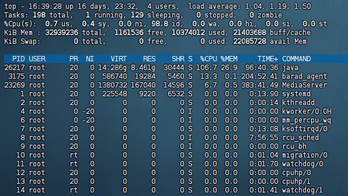
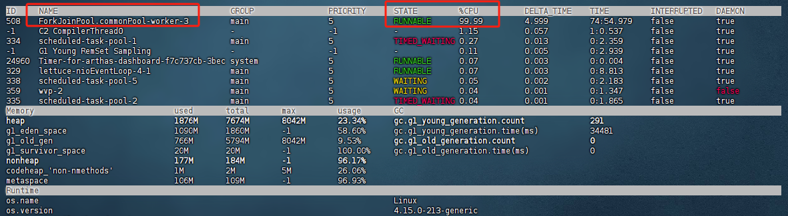
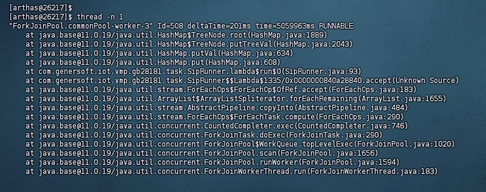
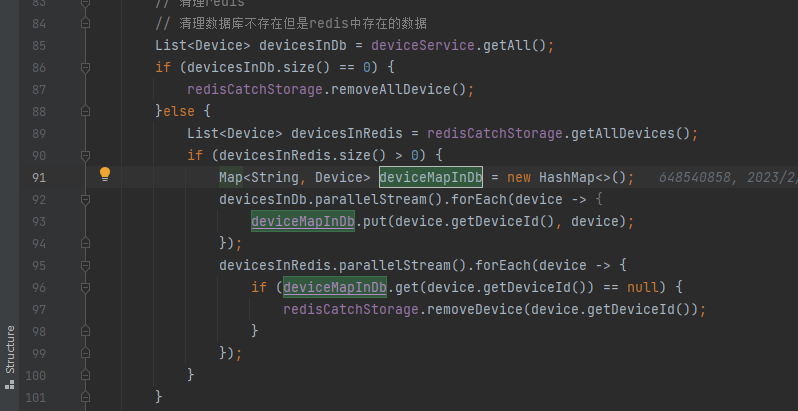
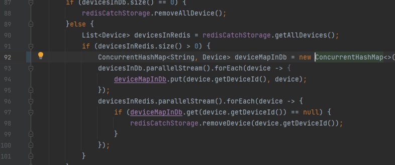

## 1. 通过 gateway、nacos 实现灰度用户功能

核心点：自定义 loadbalance、nacos metadata 标识、http头标识、openfeign透传

## 2. ssh远程通道转发请求，实现本地接入环境测试

ssh 通道服务器配置接收请求

ssh隧道 ssh -NR 6003:localhost:9080 root@139.9.177.138

## 3. nacos 使用权重 优雅发布升级

配置权重0，处理完所有请求，停机下线，升级上线，权重恢复

那么，到底什么才是SpringCloud 优雅下线呢？

包括以下内容：

- 处理没有完成的请求，注意，不再接收新的请求
- 池化资源的释放：数据库连接池，HTTP 连接池
- 处理线程的释放：请求处理线程的释放
- SpringCloud 微服务实例优雅的下线方式，主动从注册中心注销，保证其他的 RPC客户端不会发生错误的RPC调用

## 4. ssh 连接数据库

pom 引入

```java
<dependency>
    <groupId>com.jcraft</groupId>
    <artifactId>jsch</artifactId>
    <version>0.1.55</version>
    </dependency>
```

配置类

```java
package com.wxkjwlw.device.miniprogram.util;

import com.jcraft.jsch.JSch;
import com.jcraft.jsch.Session;

import java.util.Properties;

public class SshConnectionTool {
    //ssh连接的用户名
    private final static String SSH_USER = "root";
    //ssh连接的密码
    private final static String SSH_PASSWORD = "KM?]tX4J5P;w7hV";
    //ssh远程连接的ip地址
    private final static String SSH_REMOTE_SERVER = "106.55.181.213";
    //ssh连接的端口号
    private final static int SSH_REMOTE_PORT = 22;
    //本地mysql发起连接的IP地址
    private final static String MYSQL_REMOTE_SERVER = "127.0.0.1";
    //本地数据库连接时用的端口号
    private final static int LOCAl_PORT = 3307;
    //远程数据库端口用的端口号
    private final static int REMOTE_PORT = 3306;

    private Session session; //ssh 会话

    public void closeSSH() {
        session.disconnect();
    }


    public SshConnectionTool() throws Throwable {
        JSch jSch = new JSch();
        session = jSch.getSession(SSH_USER,SSH_REMOTE_SERVER,SSH_REMOTE_PORT);

        session.setPassword(SSH_PASSWORD);

        //设置连接过程不校验known_hosts文件中的信息
        Properties config = new Properties();
        config.put("StrictHostKeyChecking", "no");
        session.setConfig(config);

        session.connect(); //ssh 建立连接！

        //根据安全策略，您必须通过转发端口进行连接
        session.setPortForwardingL(LOCAl_PORT, MYSQL_REMOTE_SERVER, REMOTE_PORT);

    }
}

```

连接类

```java
package com.wxkjwlw.device.miniprogram.util;

import org.springframework.stereotype.Component;

import javax.servlet.ServletContextEvent;
import javax.servlet.ServletContextListener;

@Component
public class SshContextListener implements ServletContextListener {
    private SshConnectionTool conexionssh;

    public SshContextListener() {
        super();
    }

    /**
     * @see ServletContextListener#contextInitialized(ServletContextEvent)
     */
    public void contextInitialized(ServletContextEvent arg0) {
        System.out.println("Context initialized ... !");
        try {
            conexionssh = new SshConnectionTool();
        } catch (Throwable e) {
            e.printStackTrace(); // 连接失败
        }
    }

    /**
     * @see ServletContextListener#contextDestroyed(ServletContextEvent)
     */
    public void contextDestroyed(ServletContextEvent arg0) {
        System.out.println("Context destroyed ... !");
        conexionssh.closeSSH(); // 断开连接
    }

}

```

## 5.arthas 使用

文档：

https://arthas.aliyun.com/doc/quick-start.html

### 实际问题：

#### 1.发现 cpu 占用很高

1.通过 top 命令 查看那个进程（pid）占用，发现是 java



2.使用 arthas attach 到该进程

3.通过 dashboard 看板，查看具体是哪一个线程占用，发现是线程池的线程



4.通过 thread -n 1（打印最烦忙的前几个）或 thread 508（指定线程 id），打印线程信息，发现是 hashmap 扩容导致的



5.根据图片日志，定位到代码，SipRunner.java:93，

将 HashMap 调整为 ConcurrentHashMap




