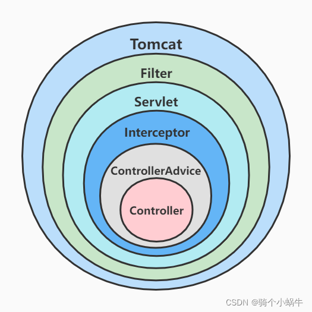
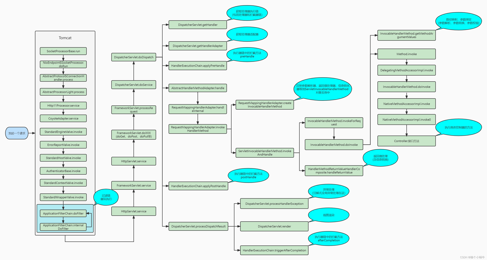

### http 请求处理

#### 1.SpringBoot一个请求的处理全过程

容器关系图



请求流程图


详细流程图



**流程如下：**

1. tomcat 线程接收到请求，经过一系列调用，调用到 ApplicationFilterChain 的 doFilter 方法，在调用 internalDoFilter 方法，一次执行过滤器链的每个 Filter 的 doFilter

2. 过滤器链的所有 doFilter 执行完毕，控制权交回 ApplicationFilterChain，在经过一系列调用，调用到 DispatcherServlet 的 doDispatch 方法，

   **主要流程：**

   1. DispatcherServlet.getHandler 方法：获取处理执行器链（包含处理器和拦截器链）

   2. DispatcherServlet.getHandlerAdapter 方法：获取处理器适配器

   3. HandlerExecutionChain.applyPreHandle 方法：执行执行器链中的所有拦截器方法 preHandle

   4. AbstractHandlerMethodAdapter.handle 方法：该方法主要包含路径映射、参数 bangd (参数解析、参数转换、参数校验)、调用具体控制器方法、返回值处理（含信息转换）等操作。

      **handle  流程：**

      1. 调用 RequestMappingHandlerAdapter.handleInternal 方法，handleInternal 方法又调用RequestMappingHandlerAdapter.invokeHandlerMethod 方法。

         **invokeHandlerMethod 方法的主要流程：**

         1. 调用 RequestMappingHandlerAdapter.createInvocableHandlerMethod 方法：注册参数解析器、返回值处理器、信息转化器等到 ServletInvocableHandlerMethod 对象实例中。

         2. 调用 ServletInvocableHandlerMethod.invokeAndHandle 方法。

            **invokeAndHandle方法的主要流程：**

            1. 调用InvocableHandlerMethod的invokeForRequest方法，invokeForRequest方法又调用InvocableHandlerMethod的doInvoke方法。

               **doInvoke方法的主要流程：**

               1. 调用InvocableHandlerMethod的getMethodArgumentValues方法：路径映射、参数绑定(参数解析、参数转换、参数校验)。
               2. 调用Method的invoke方法，内部调用DelegatingMethodAccessorImpl的invoke方法，内部调用InvocableHandlerMethod的doInvoke方法，内部调用NativeMethodAccessorImpl的invoke方法，内部调用NativeMethodAccessorImpl的invoke0方法，内部调用具体Controller的具体方法，得到响应结果。

            2. 调用HandlerMethodReturnValueHandlerComposite的handleReturnValue方法：返回值处理（含信息转换）。

   5. 调用HandlerExecutionChain的applyPostHandle方法：执行执行器链中的所有拦截方法postHandle。

   6. 调用DispatcherServlet的processDispatchResult方法。

      **processDispatchResult方法的主要流程：**

      1. 调用DispatcherServlet的processHandlerException方法：异常处理（获取合适的异常解析器处理异常信息，@ControllerAdvice全局异常处理和自定义异常解析器都是在这一步执行的）。
      2. 调用DispatcherServlet的render方法：视图解析渲染。
      3. 调用HandlerExecutionChain的triggerAfterCompletion方法：执行执行器链中的所有拦截方法afterCompletion。

3. 控制权交回ApplicationFilterChain ， 继续执行过滤器链的所有doFIlter之后的代码。

#### 关于全局异常处理

ControllerAdvice作用范围

- 拦截器的preHandle方法、postHandle方法抛出的异常在ControllerAdvice处理范围内，但拦截器的afterCompletion方法抛出的异常不在处理范围内（拦截器的afterCompletion抛出的异常会被直接catch处理，不会往外抛出异常，只会打印错误日志）。

  HandlerExecutionChain类源码

  ```java
  void triggerAfterCompletion(HttpServletRequest request, HttpServletResponse response, @Nullable Exception ex)
  			throws Exception {
  
  		HandlerInterceptor[] interceptors = getInterceptors();
  		if (!ObjectUtils.isEmpty(interceptors)) {
  			for (int i = this.interceptorIndex; i >= 0; i--) {
  				HandlerInterceptor interceptor = interceptors[i];
  				try {
  					interceptor.afterCompletion(request, response, this.handler, ex);
  				}
  				catch (Throwable ex2) {
  					logger.error("HandlerInterceptor.afterCompletion threw exception", ex2);
  				}
  			}
  		}
  	}
  
  ```

- 过滤器抛出的异常不在ControllerAdvice处理范围内。如果要处理过滤器抛出的异常，可以自定义Filter并放在过滤链的最前面，catch处理异常。

多 ControllerAdvice 优先级问题

- 多个使用@ControllerAdvice 的Bean按执行顺序（通过Order注解设置执行顺序，值越小月优先执行）依次执行
- 当某个Bean的方法匹配上异常时，进行异常处理，直接返回，后续的方法和Bean不在执行。