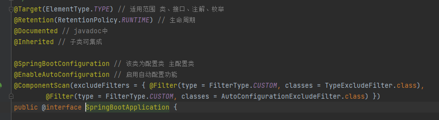
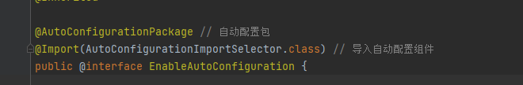
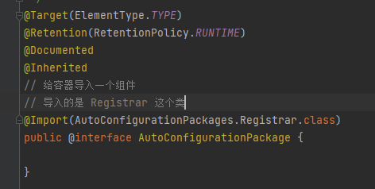
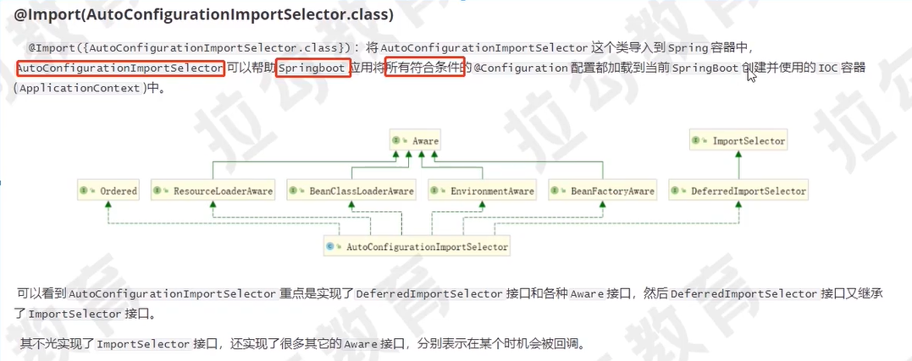
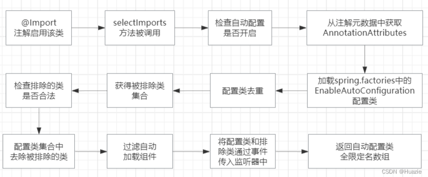

## 注解


### http 请求处理

#### 1.SpringBoot一个请求的处理全过程

容器关系图


请求流程图


详细流程图


**流程如下：**

1. tomcat 线程接收到请求，经过一系列调用，调用到 ApplicationFilterChain 的 doFilter 方法，在调用 internalDoFilter 方法，一次执行过滤器链的每个 Filter 的 doFilter

2. 过滤器链的所有 doFilter 执行完毕，控制权交回 ApplicationFilterChain，在经过一系列调用，调用到 DispatcherServlet 的 doDispatch 方法，

   **主要流程：**

   1. DispatcherServlet.getHandler 方法：获取处理执行器链（包含处理器和拦截器链）

   2. DispatcherServlet.getHandlerAdapter 方法：获取处理器适配器

   3. HandlerExecutionChain.applyPreHandle 方法：执行执行器链中的所有拦截器方法 preHandle

   4. AbstractHandlerMethodAdapter.handle 方法：该方法主要包含路径映射、参数 bangd (参数解析、参数转换、参数校验)、调用具体控制器方法、返回值处理（含信息转换）等操作。

      **handle  流程：**

      1. 调用 RequestMappingHandlerAdapter.handleInternal 方法，handleInternal 方法又调用RequestMappingHandlerAdapter.invokeHandlerMethod 方法。

         **invokeHandlerMethod 方法的主要流程：**

         1. 调用 RequestMappingHandlerAdapter.createInvocableHandlerMethod 方法：注册参数解析器、返回值处理器、信息转化器等到 ServletInvocableHandlerMethod 对象实例中。

         2. 调用 ServletInvocableHandlerMethod.invokeAndHandle 方法。

            **invokeAndHandle方法的主要流程：**

            1. 调用InvocableHandlerMethod的invokeForRequest方法，invokeForRequest方法又调用InvocableHandlerMethod的doInvoke方法。

               **doInvoke方法的主要流程：**

               1. 调用InvocableHandlerMethod的getMethodArgumentValues方法：路径映射、参数绑定(参数解析、参数转换、参数校验)。
               2. 调用Method的invoke方法，内部调用DelegatingMethodAccessorImpl的invoke方法，内部调用InvocableHandlerMethod的doInvoke方法，内部调用NativeMethodAccessorImpl的invoke方法，内部调用NativeMethodAccessorImpl的invoke0方法，内部调用具体Controller的具体方法，得到响应结果。

            2. 调用HandlerMethodReturnValueHandlerComposite的handleReturnValue方法：返回值处理（含信息转换）。

   5. 调用HandlerExecutionChain的applyPostHandle方法：执行执行器链中的所有拦截方法postHandle。

   6. 调用DispatcherServlet的processDispatchResult方法。

      **processDispatchResult方法的主要流程：**

      1. 调用DispatcherServlet的processHandlerException方法：异常处理（获取合适的异常解析器处理异常信息，@ControllerAdvice全局异常处理和自定义异常解析器都是在这一步执行的）。
      2. 调用DispatcherServlet的render方法：视图解析渲染。
      3. 调用HandlerExecutionChain的triggerAfterCompletion方法：执行执行器链中的所有拦截方法afterCompletion。

3. 控制权交回ApplicationFilterChain ， 继续执行过滤器链的所有doFIlter之后的代码。

#### 关于全局异常处理

ControllerAdvice作用范围

- 拦截器的preHandle方法、postHandle方法抛出的异常在ControllerAdvice处理范围内，但拦截器的afterCompletion方法抛出的异常不在处理范围内（拦截器的afterCompletion抛出的异常会被直接catch处理，不会往外抛出异常，只会打印错误日志）。

  HandlerExecutionChain类源码

  ```java
  void triggerAfterCompletion(HttpServletRequest request, HttpServletResponse response, @Nullable Exception ex)
  			throws Exception {
  
  		HandlerInterceptor[] interceptors = getInterceptors();
  		if (!ObjectUtils.isEmpty(interceptors)) {
  			for (int i = this.interceptorIndex; i >= 0; i--) {
  				HandlerInterceptor interceptor = interceptors[i];
  				try {
  					interceptor.afterCompletion(request, response, this.handler, ex);
  				}
  				catch (Throwable ex2) {
  					logger.error("HandlerInterceptor.afterCompletion threw exception", ex2);
  				}
  			}
  		}
  	}
  
  ```

- 过滤器抛出的异常不在ControllerAdvice处理范围内。如果要处理过滤器抛出的异常，可以自定义Filter并放在过滤链的最前面，catch处理异常。

多 ControllerAdvice 优先级问题

- 多个使用@ControllerAdvice 的Bean按执行顺序（通过Order注解设置执行顺序，值越小月优先执行）依次执行
- 当某个Bean的方法匹配上异常时，进行异常处理，直接返回，后续的方法和Bean不在执行。

## 环境搭建

### 源码版本 2.2.9

下载、maven 编译、打开项目、pom 检查 添加<disable.checks>true</disable.checks>

1.新建测试 model，创建 application

2.创建testcontroller 打印源码启动成功

3.启动，测试访问，无问题，启动成功

### pom 中 parent 属性都有什么

```xml
<!--属性定义-->
<properties>
	<main.basedir>${basedir}/../../..</main.basedir>
	<java.version>1.8</java.version>
	...
</properties>
<build>
    <!--资源位置、过滤-->
    <resources>
        <resource>
            <directory>${basedir}/src/main/resources</directory>
            <filtering>true</filtering>
            <!--配置文件位置-->
            <includes>
                <include>**/application*.yml</include>
                <include>**/application*.yaml</include>
                <include>**/application*.properties</include>
            </includes>
        </resource>
        <resource>
            ...
        </resource>
    </resources>
    <pluginManagement>
        <!--插件管理、编译、配置等等-->
        <plugins>
            <plugin>
           	...
            </plugin>
        </plugins>       
    </pluginManagement>
```

### start-web 分析

```xml
<dependency>
    <groupId>org.springframework.boot</groupId>
    <artifactId>spring-boot-starter-web</artifactId>
</dependency>
```

进入 spring-boot-starter-web.pom 中，常用的 web 相关的都有引入，如 tomcat

```xml
<dependency>
    <groupId>org.springframework.boot</groupId>
    <artifactId>spring-boot-starter</artifactId>
</dependency>
<dependency>
    <groupId>org.springframework.boot</groupId>
    <artifactId>spring-boot-starter-tomcat</artifactId>
</dependency>
<dependency>
    <groupId>org.springframework.boot</groupId>
    <artifactId>spring-boot-starter-validation</artifactId>
    <exclusions>
        <exclusion>
            <groupId>org.apache.tomcat.embed</groupId>
            <artifactId>tomcat-embed-el</artifactId>
        </exclusion>
    </exclusions>
</dependency>
<dependency>
    <groupId>org.springframework</groupId>
    <artifactId>spring-web</artifactId>
</dependency>
<dependency>
    <groupId>org.springframework</groupId>
    <artifactId>spring-webmvc</artifactId>
</dependency>
```

## 自动配置

核心启动类

```java
@SpringBootApplication
public class MytestApplication {
	public static void main(String[] args) {
		SpringApplication.run(MytestApplication.class, args);
	}
}
```

### @SpringBootApplication



#### @EnableAutoConfiguration

spring 中以 Enable 开头的注解，作用是借助 @Import 手机并注册特定场景相关的 Bean，并加载到 IOC 容器。



@AutoConfigurationPackage



Registrar 类

```java
static class Registrar implements ImportBeanDefinitionRegistrar, DeterminableImports {

    @Override
    public void registerBeanDefinitions(AnnotationMetadata metadata, BeanDefinitionRegistry registry) {
        // 将注解标注的元信息传入 获取到相应的包名
        register(registry, new PackageImport(metadata).getPackageName());
    }

    @Override
    public Set<Object> determineImports(AnnotationMetadata metadata) {
        return Collections.singleton(new PackageImport(metadata));
    }

}
```

regist 方法

```java
public static void register(BeanDefinitionRegistry registry, String... packageNames) {
    if (registry.containsBeanDefinition(BEAN)) {
        // 如果注册 则将包名添加进去
        BeanDefinition beanDefinition = registry.getBeanDefinition(BEAN);
        ConstructorArgumentValues constructorArguments = beanDefinition.getConstructorArgumentValues();
        constructorArguments.addIndexedArgumentValue(0, addBasePackages(constructorArguments, packageNames));
    }
    else {
        // 未注册 先注册 包名会被设置进去
        GenericBeanDefinition beanDefinition = new GenericBeanDefinition();
        beanDefinition.setBeanClass(BasePackages.class);
        beanDefinition.getConstructorArgumentValues().addIndexedArgumentValue(0, packageNames);
        beanDefinition.setRole(BeanDefinition.ROLE_INFRASTRUCTURE);
        registry.registerBeanDefinition(BEAN, beanDefinition);
    }
}
```

最终做的就是将 BasePackages 这个类注册进去，并保存包名，供其他包使用

#### @Import(AutoConfigurationImportSelector.class)

**ImportSelector 接口**

决定可引入哪些 @Configuration



整体流程



代码注释

```java
@Override
public String[] selectImports(AnnotationMetadata annotationMetadata) {
    // 检查自动配置功能是否开启，默认为开启
    if (!isEnabled(annotationMetadata)) {
        return NO_IMPORTS;
    }
    // 封装将被引入的自动配置信息
    AutoConfigurationEntry autoConfigurationEntry = getAutoConfigurationEntry(annotationMetadata);
    // 返回符合条件的配置类的全限定名数组
    return StringUtils.toStringArray(autoConfigurationEntry.getConfigurations());
}

/**
	 * 根据导入@Configuration类的AnnotationMetadata返回AutoConfigurationImportSelector.AutoConfigurationEntry。
	 * @param 配置类的注解元数据。
	 * @return 应该导入的自动配置。
	 */
protected AutoConfigurationEntry getAutoConfigurationEntry(AnnotationMetadata annotationMetadata) {
    if (!isEnabled(annotationMetadata)) {
        return EMPTY_ENTRY;
    }
    // 从AnnotationMetadata返回适当的AnnotationAttributes。默认情况下，此方法将返回getAnnotationClass()的属性。
    AnnotationAttributes attributes = getAttributes(annotationMetadata);
    // 通过 SpringFactoriesLoader 类提供的方法加载类路径中META-INF目录下的
    // spring.factories文件中针对 EnableAutoConfiguration 的注解配置类
    List<String> configurations = getCandidateConfigurations(annotationMetadata, attributes);
    // 对获得的注解配置类集合进行去重处理，防止多个项目引入同样的配置类
    configurations = removeDuplicates(configurations);
    // 获得注解中被 exclude 或 excludeName 所排除的类的集合
    Set<String> exclusions = getExclusions(annotationMetadata, attributes);
    // 检查被排除类是否可实例化，是否被自动注册配置所使用，不符合条件则抛出异常
    checkExcludedClasses(configurations, exclusions);
    // 从自动配置类集合中去除被排除的类
    configurations.removeAll(exclusions);
    // 检查配置类的注解是否符合 spring.factories 文件中 AutoConfigurationImportFilter 指定的注解检查条件
    configurations = getConfigurationClassFilter().filter(configurations);
    // 将筛选完成的配置类和排除的配置类构建为事件类，并传入监听器。监听器的配置在于 spring.factories 文件中，通过 AutoConfigurationImportListener 指定
    fireAutoConfigurationImportEvents(configurations, exclusions);
    // 创建并返回一个条目，其中包含了筛选完成的配置类和排除的配置
    return new AutoConfigurationEntry(configurations, exclusions);
}
```

疑问：为什么实现 DeferredImportSelector 接口，而不是 ImportSelector？

- **延迟导入**：DeferredImportSelector 具有延迟导入的能力，可以在所有的 @Configuration 类都被处理完毕之后再进行选择和导入。这样可以在整个配置加载过程完成后再根据某些条件或规则来决定要导入哪些类，从而实现更加动态和灵活的自动配置机制。
- **自定义扩展**：通过实现 DeferredImportSelector 接口，开发人员可以更方便地扩展和定制自动配置逻辑。可以根据实际需求重写相应方法，实现自定义的自动配置规则和行为。

## 自定义starter

理解：springboot 通过自动扫描 starter 配置信息，可以自动加载默认配置，不用在去手写。

同时可自定义 starter，满足自己模块的配置，使用时引入，就不用每个地方复制了。

命名规则：xxx-spring-boot-starter，用以区分

### 实现

1.新建 maven jar 工程

pom 导入依赖

```shell
    <dependencies>
        <dependency>
            <groupId>org.springframework.boot</groupId>
            <artifactId>spring-boot-autoconfigure</artifactId>
        </dependency>
    </dependencies>
```

2.创建 javaBean

就是你需要封装的那些配置

```java
package com.demo;

import org.springframework.boot.context.properties.ConfigurationProperties;
import org.springframework.boot.context.properties.EnableConfigurationProperties;

@ConfigurationProperties(prefix = "starter")
@EnableConfigurationProperties(StarterBean.class)
public class StarterBean {
    private int id ;
    private String name;

    public int getId() {
        return id;
    }

    public void setId(int id) {
        this.id = id;
    }

    public String getName() {
        return name;
    }

    public void setName(String name) {
        this.name = name;
    }
}
```

3.编写配置类 MyAutoConfiguration

```java
package com.demo;

import org.springframework.context.annotation.Bean;
import org.springframework.context.annotation.Configuration;

@Configuration
public class MyAutoConfiguration {
    static {
        System.out.println("MyAutoConfiguration init...");
    }

    @Bean
    public StarterBean starterBean() {
        return new StarterBean();
    }
}
```

4.resources 下创建 /META-INF/spring.factories 文件

写入配置，让 spring 启动时加载 bean 到 ioc 容器中

```java
org.springframework.boot.autoconfigure.EnableAutoConfiguration=\
  com.demo.MyAutoConfiguration
```

### 使用

1.pom 引入自定义 starter

```java
<dependency>
    <groupId>com.wxkjwlw.device</groupId>
    <artifactId>starter</artifactId>
    <version>0.0.1-SNAPSHOT</version>
</dependency>
```

2.application 中修改，不修改则使用默认

```java
starter:
  id: 1
  name: adoifa
```

3.注入使用

```java
@Autowired
StarterBean starterBean;

@PostConstruct
void sss() {
    System.out.println("--------自动导入");
    System.out.println(starterBean.toString());
}
```

结果：


### 热插拔