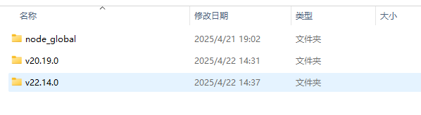
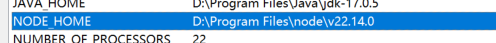
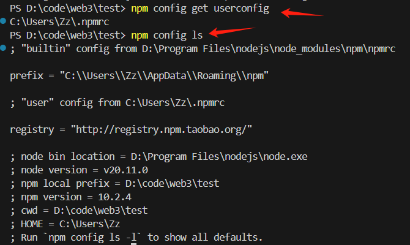
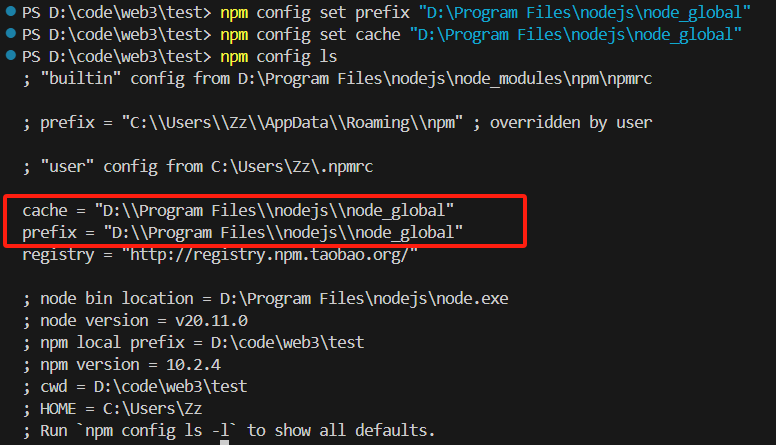
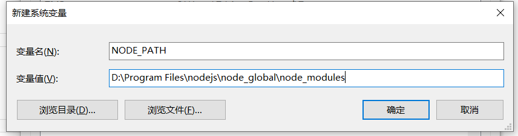
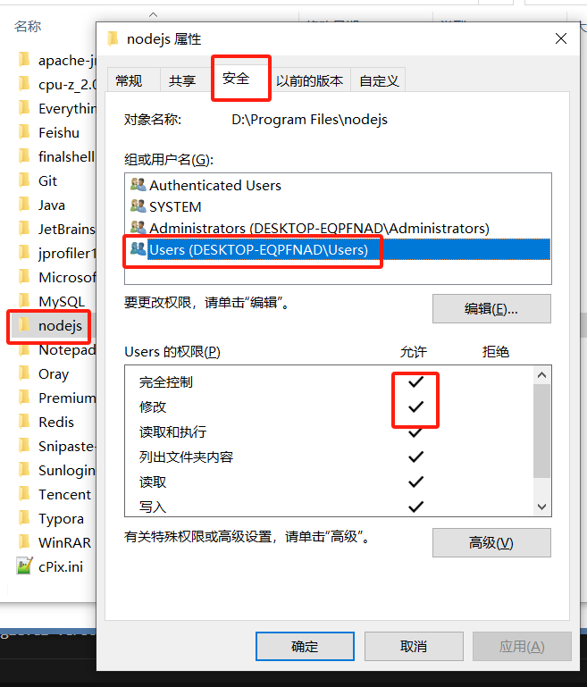
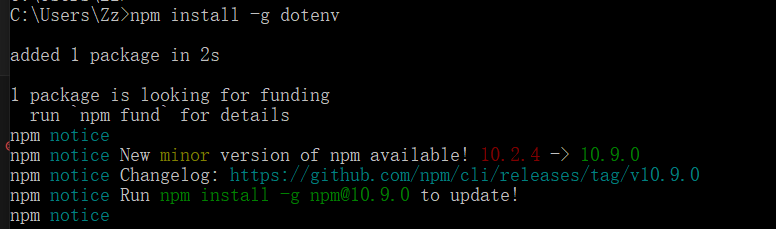
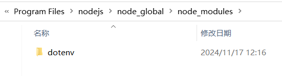

## npm命令

completeFunctionCalls 补全括号

### 0.多版本安装、切换

多版本安装时，需要新建不同的文件夹，然后在通过环境变量进行切换



新建环境变量 NODE_HOME 用来保存不同的目录地址，在 path 中引用改变量，直接使用。



### 1.install 命令

```JavaScript
npm install moduleName # 安装模块到项目目录
npm install -g moduleName # -g 意思是将模块安装到全局，具体安装到磁盘哪个位置，要看 npm config prefix 的位置。
npm install --save moduleName # --save 的意思是将模块安装到项目目录下，并在package文件的dependencies节点写入依赖。
npm install --save-dev moduleName # --save-dev 的意思是将模块安装到项目目录下，并在package文件的devDependencies节点写入依赖。
```

那么问题来了，在项目中我们应该使用四个命令中的哪个呢？下面对这四个命令进行了对比：

##### **npm install moduleName 命令**

1.**安装模块到项目** node_modules 目录下。

2.不会将模块依赖写入 devDependencies 或 dependencies 节点。

3.运行 npm install 初始化项目时不会下载模块。

##### **npm install -g moduleName 命令**

1.**安装模块到全局**，不会在项目 node_modules 目录中保存模块包。

2.不会将模块依赖写入 devDependencies 或 dependencies 节点。

3.运行 npm install 初始化项目时不会下载模块。

##### **npm install --save moduleName 命令**

1.安装模块到项目 node_modules 目录下。

2.会将模块依赖写入 dependencies 节点。

3.运行 npm install 初始化项目时，会将模块下载到项目目录下。

4.运行npm install --production 或者注明 NODE_ENV 变量值为 production 时，**会自动下载模块到** node_modules 目录中。

##### **npm install --save-dev moduleName 命令**

1.安装模块到项目 node_modules 目录下。

2.会将模块依赖写入 devDependencies 节点。

3.运行 npm install 初始化项目时，会将模块下载到项目目录下。

4.运行npm install --production 或者注明 NODE_ENV 变量值为 production 时，**不会自动下载模块到** node_modules 目录中。

##### **总结**

devDependencies 节点下的模块是我们在开发时需要用的，比如项目中使用的 gulp ，压缩 css、js 的模块。这些模块在我们的项目部署后是不需要的，所以我们可以使用 --save-dev 的形式安装。像 express 这些模块是项目运行必备的，应该安装在 dependencies 节点下，所以我们应该使用 --save 的形式安装。

### 2.config 命令

配置文件是 .npmrc ，默认在用户目录C:\Users\用户\下。

也可通过下面命令查看

```JavaScript
npm config get userconfig  ## 查看配置文件路径
```

其他指令

```JavaScript
npm config ls ## 查看简单的配置项
npm config ls -l  ##　查看所有配置项
npm config get cache  ## 查看缓存配置，get后面可以跟任意配置项
npm config edit  ## 直接编辑config文件，这个会打开文本
```



prefix 为安装路径，可以看到在 c 盘，修改位置如下：

```JavaScript
npm config set prefix "D:\Program Files\nodejs\node_global"
npm config set cache "D:\Program Files\nodejs\node_global"
```



修改完成后，如果报找不到文件文件，可以添加环境变量。



其他问题：

命令执行，报没权限创建文件：


右键属性 -> 安全 -> 选择用户 -> 添加权限，确定，就可以正常更新了。



再次执行命令，可以正常安装，本地缓存文件





