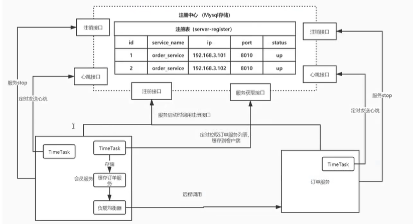
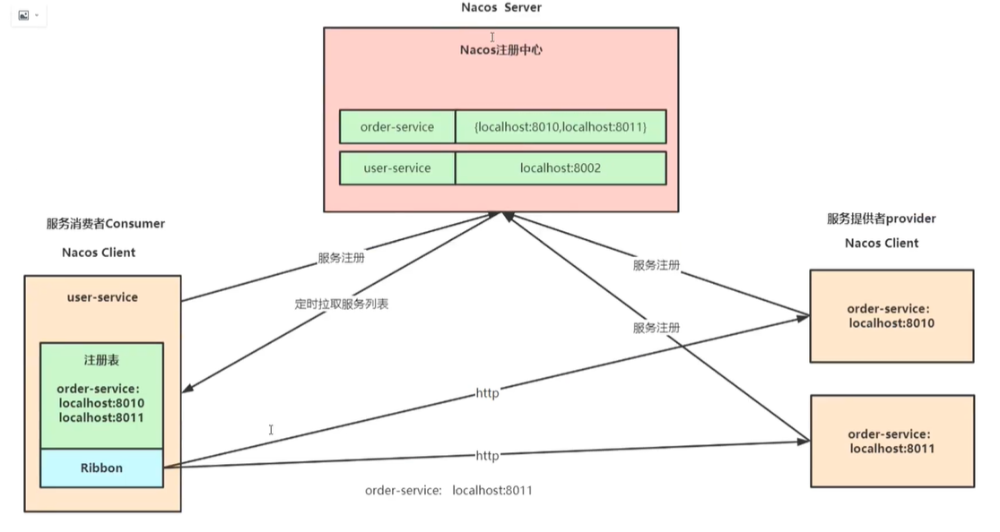

# 微服务

其他：

- resttemplate使用
- pom详解 dependencyManagement
- idea 启动 设置各种参数 port env参数

## 注册中心

**nacos**

注册中心、配置中心、服务管理 平台

注册中心演变：

跨进程通信 RPC ，使用 http 请求进行数据访问获取。然后各服务把自己的地址记到一个表中，每次去查询表，获取地址。

如果完成上面的功能，需要什么？

1. 一个服务用来管理和维护这些注册表
2. 客户端通过请求将自身的地址等信息告诉服务
3. 客户端通过请求将注册表拉取到本地，每隔一段时间都需要重复更新
4. 客户端发送心跳，证明自己还在，同时服务端检测客户端是否健康，否则停掉

综合如下图：

nacos如下：

CAP C 一致性 A 可用性 P 分区容错

## 负载均衡

负载均衡 硬件 F5、软件 nginx、客户端自己做的负载均衡

**ribbon**

属于 netflix ，目前已经不在维护，可使用 loadbalancer，可自己实现，重写 choose 方法，搭建灰度发布功能

loadbalancer 支持 webclient（webflux），ribbon 不支持

常见负载均衡算法

- 随机：随机选择，使用很少
- 轮训：默认算法，定义变量，每次请求变量+1，然后和服务数取模，模几用几
- 加权：把所有权重排列成一个数据，然后请求随机落在某一个区间，如：20% 80%( 0-20, 20-99)
- 地址hash：根据 ip 进行 hash 进行选择，想 hashmap 一样
- 最小链接数：根据积压数等参数，将请求分配在压力最小的服务器上

## 跨进程通讯 RPC

不在一个服务上，如何请求数据，通过 http 请求调用数据。

http 选择：httpclient、okhttp、httpurlconnection、resttemplate、webclient（webflux）

**openfeign**

## 流量控制

sentinel