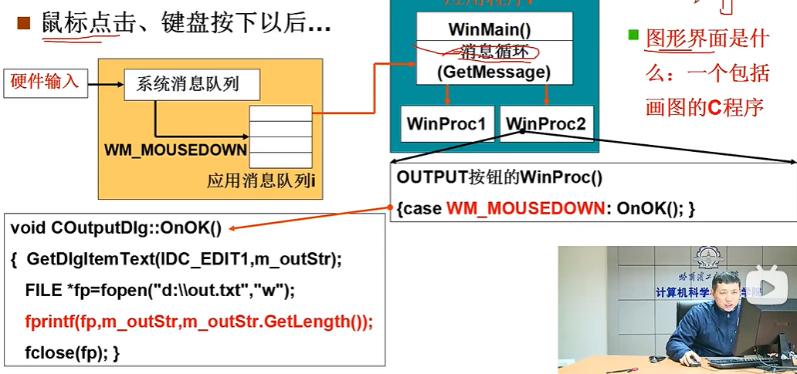
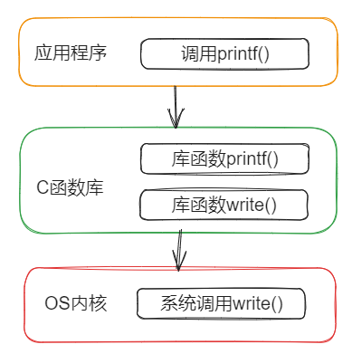
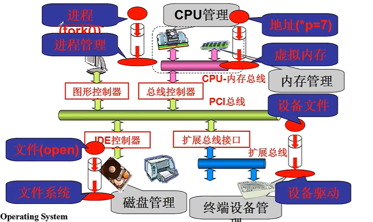
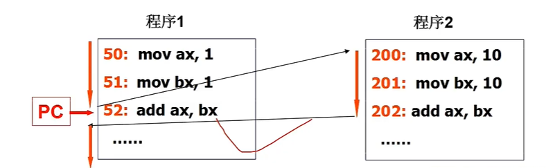
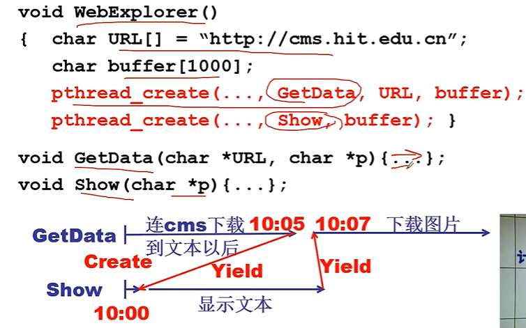
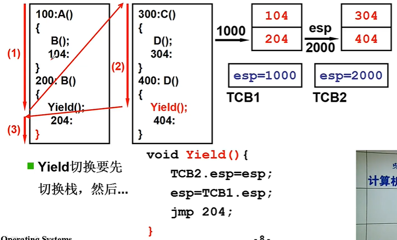
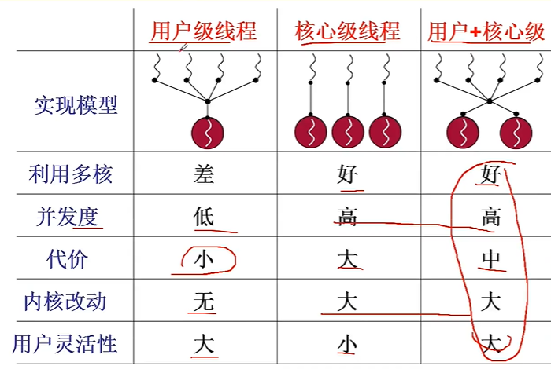

# 计算机操作系统

## 前言

**什么是操作系统？**

是计算机硬件和应用层之间的一层软件，是上层应用和硬件沟通的桥梁。

管理硬件：cpu、内存、终端、磁盘、文件、网络、电源、多核

**计算机打开时都发生了什么？**

以 x86 为例：

- 刚开机时，cpu处于实模式（和保护模式对应，实模式寻址CS:IP）
- 寻址0xFFFF0（rom BIOS映射区（BIOS系统地址开始））
- 检查 RAM、键盘、显示器、软硬磁盘、主板
- 将磁盘 0 磁道 0 扇区（操作系统引导扇区）读入内存 0x7c00 处

读取顺序 boot -> setup -> system

最后，执行 main 函数中的 fork() 创建了第一个进程

fork 中 调用 init 方法执行 shell(windows桌面)

启动桌面

**图形化页面，鼠标操作**

硬件输入 系统消息队列 循环从消息队列去消息 根据类型调用显示刷新页面

**系统调用：**

printf函数执行过程

**概念：**

**内核（用户）态、内核（用户）段**

由硬件设计实现，将内核程序和用户程序隔离，防止关键数据被用户程序访问

中断 int 指令是调用内核代码的唯一方式

### 需要学习的东西

## 第一章 CPU

### 1.CPU 工作原理

自动的**取值执行**（取出指令、执行指令）

> 50: mov ax, [100]
>
> 51: mov bx, [101]
>
> ....
>
> 100: 0
>
> 101: 1

把 地址为100里面的数据 0，取出，赋值给 ax，然后继续执行下一条。

执行 IO 指令特别慢，执行计算指令很快 1:10^6

### 2.多进程切换

**问题：**IO 和运算都有，CPU 利用率会很低，怎么解决？

遇到 IO 指令时，跳出执行其他命令，等待 IO 完成后在跳回执行。通过来回切换，充分使用 CPU。也就是并发。

**PCB（process control block ）**

用来记录进程信息的数据结构

**schedule** 切换函数

### 3.线程

**进程 = 资源 + 指令执行序列**

线程：保留了并发的优点，避免了进程切换的代价，资源不切换，只切换指令，内存地址是共享的，不需要地址隔离。

举一个浏览器请求 url 显示内容的例子

核心切换是 Yield

Yie切换：

#### 用户线程

#### 核心线程

### 4.CPU调度

总原则：系统专注于任务执行，又能合理调配任务

任务执行快、操作响应短、吞吐量大

