## 数据结构与算法

数据本质：

数据结构是现实世界的数据抽象的存储在物理设备上，将现实数据抽象成最小单元的数据，包括：数据本身的值，数据与数据的关系。

物理设备有两种存储方式，连续的存储（数组）、不连续的存储（链表）

由这两种方式，进一步抽象出其他结构：集合、树、图

算法本质：

已最有效率的方式穷举所有可能性，寻找计算结果。

### 基础

**空间复杂度 S(n) space**

**时间复杂度 T(n) time**

考虑两种情况：最坏情况复杂度 Tworst(n)、平均复杂度 Tavg(n)

**算法复杂度的直观体现**

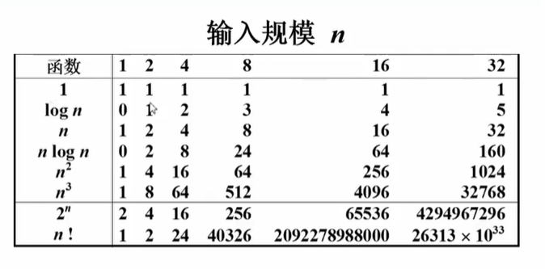

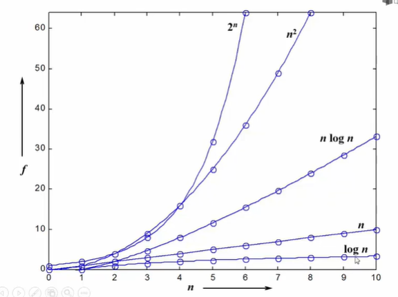

### 数组、链表

数据存储例子：

存储函数（一元多项式）：f(x) = ax2 + bx + c

1.可以使用数组记录，索引表示几次方，值表示系数

f(x) = [c,b,a]

2.如果 x 项的平方很大，系数有很多零，会造成浪费，可以在数组存储一个对象

f(x) = [(a,2), (b,1),(c,0)]

函数的计算，就是两个数组间的合并操作。

如果用数组时，2 的情况下，需要很多移位的操作，如果用链表就会很快。

十字链表存储二维稀疏矩阵

1.只存储矩阵非0元素项

2.每个节点通过两个指针，行指针、列指针串起来

### 堆、栈

计算机运算表达式

1.中缀表达式：运算符号位于两个运算数之间。a + b * c - d / e

2.后缀表达式：预算符号位于两个运算数之后。abc * + de / -

例子：6 2 / 3 - 4 2 * + = ?

```c
6 2 / 3 - 4 2 * +
// 6 2 / = 3
3 3 - 4 2 * + 
// 3 - 3 = 0
0 4 2 * +
// 0 先入栈 计算 4 * 2 = 8
0 8 +
// 0 + 8 = 8
```

这就是一种栈规律的计算（后入先出）。

1.可以用一个一维数组实现和一个记录栈顶元素位置的变量组成。

2.也可以用一个单向链表来实现，栈顶元素是头节点。

中缀转后缀

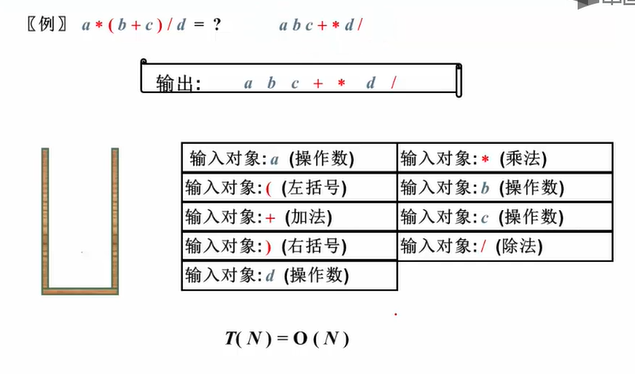

从头到尾读取中缀的每个对象，处理规则如下：

1. 运算数：直接输出
2. 左括号：压入栈中
3. 右括号：弹出左括号上面的所有运算符号
4. 运算符：和栈顶的运算符比较优先级，大于入栈，小于或等于弹出，再次比较，直到栈顶大于为止，然后入栈
5. 对象处理完毕，栈中所有运算符出栈

### 队列

队列只能从一边进，另一边出。

数组实现：一个一维数组，一个记录头元素，一个记录尾元素的变脸组成。特殊结构：顺环队列（头尾相连）。

链表实现：一个单向链表，头删除，尾插入。

### 树

一对多关系的集合，有一个根节点，叶子节点等。

二分查找：时间复杂度 logn

使用 儿子-兄弟表示法

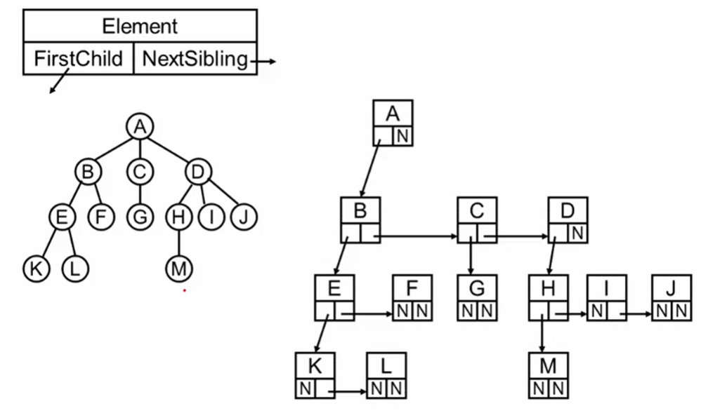

也可以看成是二叉树。

二叉树是左，右子节点，相当于二分查找，要么左，要么右。

特殊的完全二叉树可以使用数组存储，因为是满的，都是连续的，中间没有断的，这种符合数组的存储结构。

一般二叉树可以将其补成完全二叉树，再用数组存储，但是会空很多位置。

链表存储二叉树，左节点、子节点的头、右节点，没有就 null。

常用的遍历方法（重点）：

1. 先序 - 根、左子树、右子树
2. 中序 - 左子树、根、右子树
3. 后序 - 左子树、右子树、根
4. 层次遍历 - 上到下、左到右

```java
// 先序
public void PreOrderTraversal( BinTree BT ){
	if( BT ){
        // 根
        printf("%d", BT.value);
        // 左边
        PreOrderTraversal( BT.left );
        // 右边
        PreOrderTraversal( BT.right );
    }
}
```

先序：

输出结果：A ( B D F E ) ( B G H I )

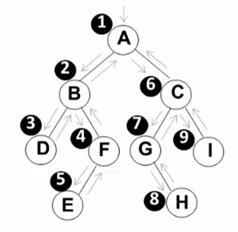


中序：

输出结果：( D B E F ) A ( G H C I )

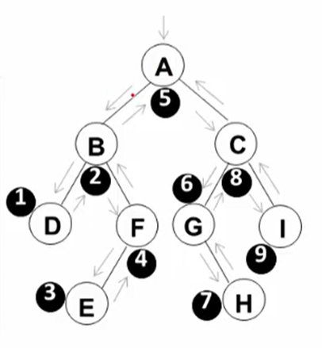

后序：

输出结果：( D E F B ) ( H G I C ) A

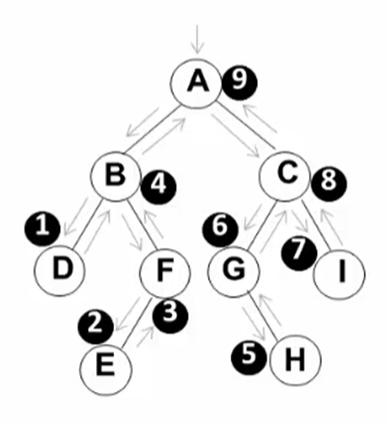

堆栈思想遍历算法：

每一个节点判断是否有子节点，有就进栈，直到没有子节点的节点，抛出节点元素，出栈，在看栈顶是否有其他子节点，有继续进栈，没有就重复抛出。

层序遍历：

二叉树遍历的本质是二维结构的线性化，堆栈是暂存了节点，因为不存储就无法找到右节点。

层序使用队列进行线性化，一层一层的遍历，先进入节点，然后打印节点，进入左右节点，然后在继续循环打印、进入，直到无子节点。

**遍历的基础上，变形**

1. 输出二叉树中的叶子节点：遍历时，添加左右都为空的判断
2. 二叉树的高度：利用后续遍历，分别求出左右子树高度，然后 max + 1
3. 运算表达式：
4. 两种遍历序列确定二叉树（必须要有中序）

#### 二叉搜索树

满足条件，

1. 左子树的所有值小于右子树
2. 右子树的所有值大于左子树
3. 左右子树都是二叉搜索树

小的在左边，大的在右边

操作：

1. 查找指定值的地址（尾递归、循环都可以实现）
2. 最大值（最右边的值）、最小值（最左边的值）
3. 插入
4. 删除

查找的递归实现、遍历实现

```
// 递归
Position Find( ElementType X, BinTree BST ){
	if( !BST ) return NULL;
	if( X > BST -> Data )
		return Find( X, BST -> Right );
	else if( X < BST -> Data )
		return Find( X, BST -> Left);
	else
		return BST;
}
// 遍历
Position IterFind( ElementType X, BinTree BST ){
	while( BST ){
		if( X > BST -> Data )
			BST = BST -> Right; // 大于 向右
		else if( X < BST -> Data )
			BST = BST -> Left; // 小于 向左
		else
			return BST;
	}
	return NULL;
}
```

查找的效率决定于树的高度。

最大、最小查找：就是找最左边、最右边的值（条件就是不空为止）。

插入：插入也简单，比较大小，找到最后一层为止

删除：删除分多种情况，如果是子节点，直接删除。父节点删除，要找到其子节点的最大或最小值进行代替。

#### 平衡二叉树

相同的节点，不同的插入次序，会导致不同的深度和平均查找长度

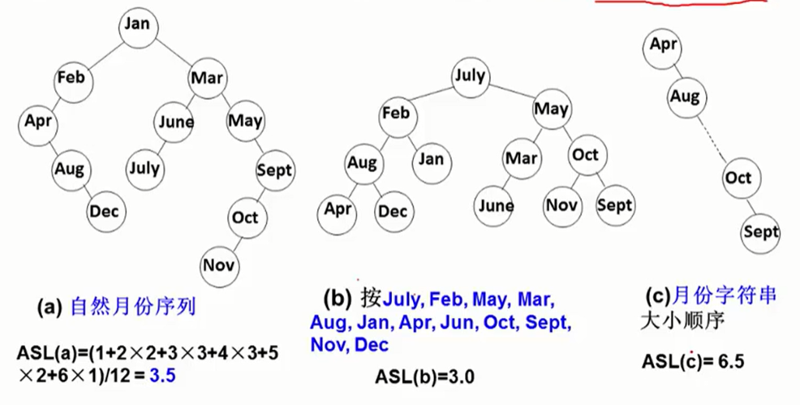

定义：任意节点的左右子树高度差的绝对值不超过 1

插入时可能会造成不平衡，所以会有调整，左旋、右旋

#### 哈夫曼树、哈夫曼编码

给定N个权值作为N个叶子结点，构造一棵二叉树，若该树的带权路径长度达到最小，称这样的二叉树为最优二叉树，也称为哈夫曼树(Huffman Tree)。

找两个最小的合并生成一个节点，不断的进行合并。

每次选取两个最小的进行合并，第一次是 1 3

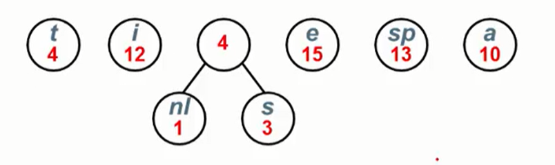

1 3 合并后是 4，在进行比较，找到两个最小的是 4 4，再进行合并，是 8 再找 10，合并后是 18.

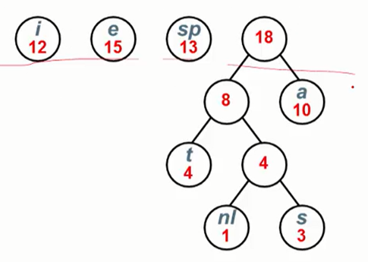

15 和 18 最小，合并后是 33 在和最后的 25 合并成最后一个树

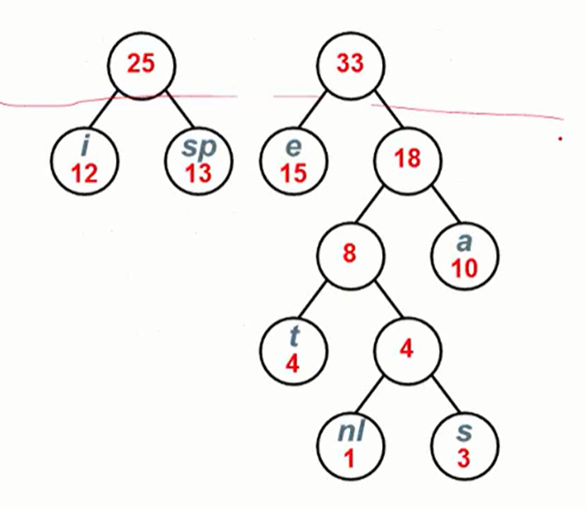

最终结果

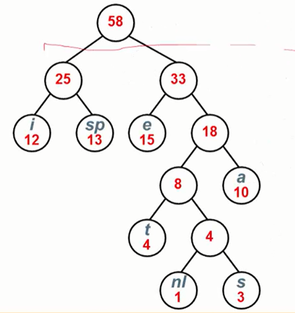

哈夫曼编码：

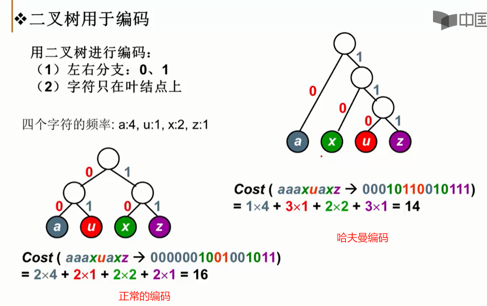

最终的路径结果：

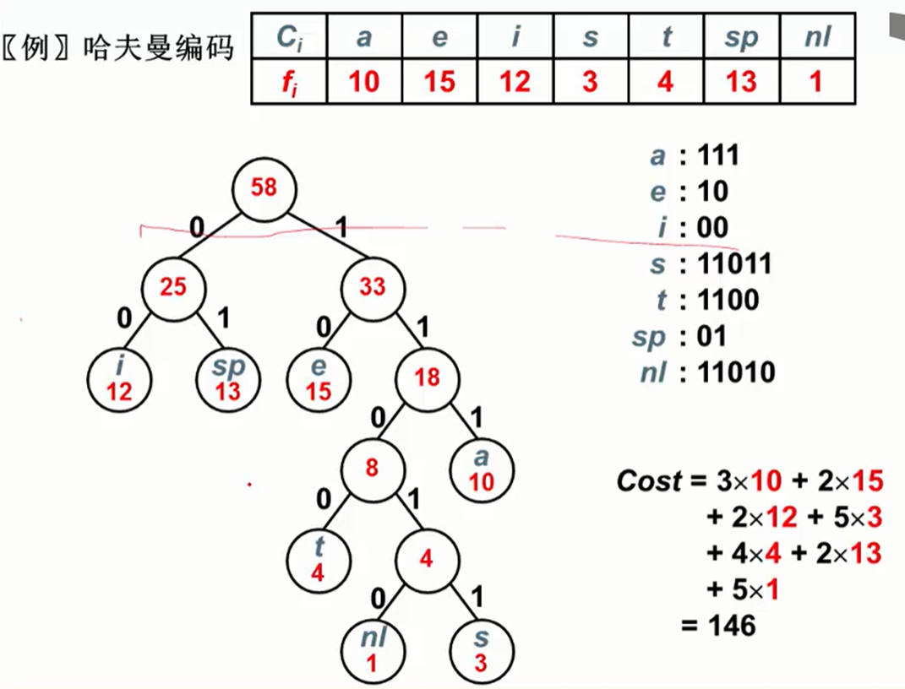

### 图

表示多对多的关系。包含：一组顶点（v 表示），一组边（e 表示），可以没有边，但至少有一个顶点。

边的方向有无向图（不在乎方向），有向图（单向、双向），边有权重，称为网络。

使用邻接矩阵表示一个图

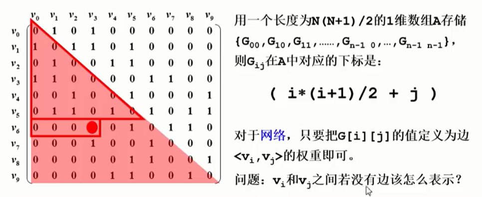

