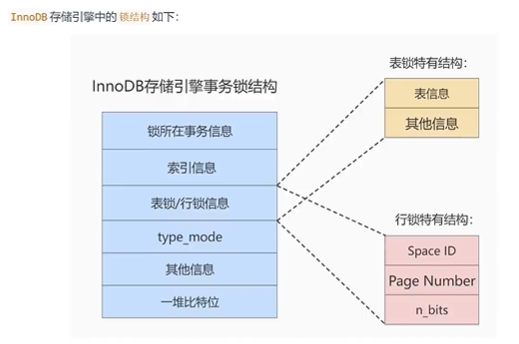
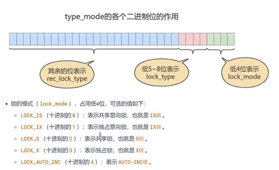
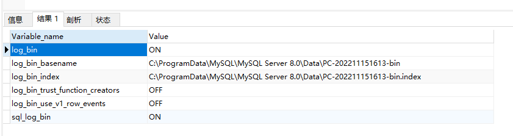
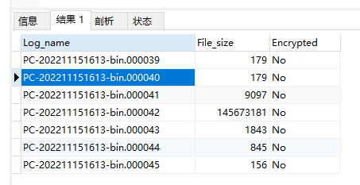
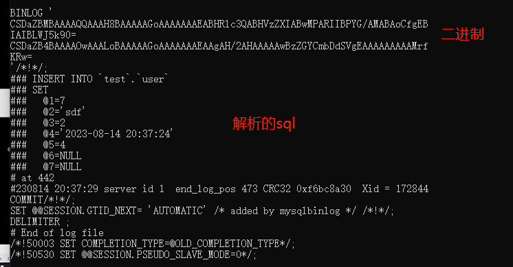
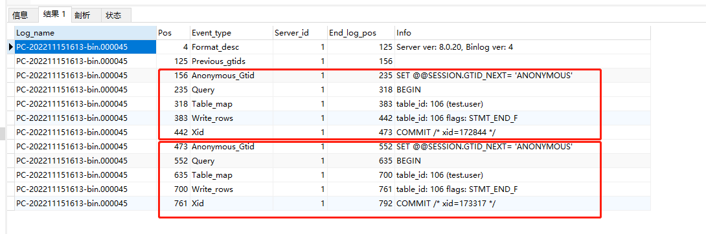
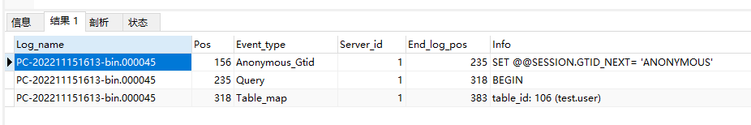
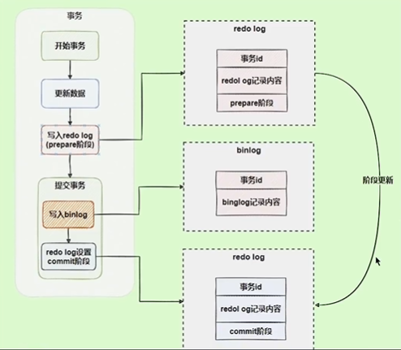
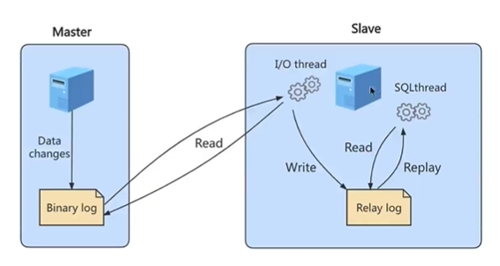

# 数据库

## 基础

### 1. 数据类型

**整数** tinyint(1byte(字节 8bit) 2^8 0-255(unsigned ))、int(4byte)、bigint(8btye)

> bigint(M) 数据宽度，补零 M取值范围0-255

**浮点数** float(4byte)、double(8byte)

> float(M,D) M精度、D标度  M(0-255)=整数位+小数位 D(0-30)=小数位
>
> float(5,2) -999.99~999.99

**定点数** decimal 底层字符串存储 存储空间=M+2位

> decimal(M,D) M精度、D标度  M(0-65)=整数位+小数位 D(0-30)=小数位 
>
> decimal(5,2) -999.99~999.99

**日期** year、date、time、datetime、timestamp

```sql
where 日期 可选用 >,< 或 between and
过滤时，不写时间，默认 0 点'2023-7-29 00:00:00'
如果需要其他格式，可使用 Date 获取日期 DATE_FORMAT(time,'%Y%m%d %H%i%s') 获取指定格式
```

**字符** varchar、char、text、longtext

> char(M) M字节
>
> varchar(M) M+1字节 因为长度可变需要额外1个字节记录长度

**其他** 枚举、二进制 blob 图片、json

> out of range value for column 'f1' at row x 数据超了范围

### 2. 关键字

**character set** 字符集 utf-8mb4 4位长度

**primary key** 主键

**auto_increment** 自增

**unsigned** 无符号

### 3. 视图、存储过程、函数

不常用


## 逻辑架构

### 1. 客户端请求过程


#### 1.1 连接池

创建一个连接池队列用于存放和数据库的连接，让访问数据库的客户端可以直接在队列中选取一个可用的连接去访问数据库，用完之后的连接不是被释放掉而是归还给了连接池队列，这样下一个客户端在访问数据库是还可以复用该连接，省去了每一条连接从TCP三次握手建立连接到MYSQL Server的连接认证和MYSQLServer关闭连接回收资源以及四次挥手所消耗的时间。

**druid 连接池设置**

```shell
url：数据库URL，格式为jdbc:xxx://host:port/database?connection_properties。
username：数据库用户名。
password：数据库密码。
initialSize：连接池初始大小，默认为0。
maxActive：连接池最大连接数，默认为8。
minIdle：连接池最小空闲连接数，默认为0。
maxWait：获取连接的最大等待时间，单位毫秒，默认为-1，表示永不超时。
testWhileIdle：连接空闲时是否进行检测，默认为false。
validationQuery：用于检测连接是否有效的SQL语句，默认为SELECT 1。
testOnBorrow：获取连接时是否进行检测，默认为false。
testOnReturn：归还连接时是否进行检测，默认为false。
poolPreparedStatements：是否缓存PreparedStatement，默认为false。
maxOpenPreparedStatements：缓存的PreparedStatement的最大数量，默认为-1，表示不限制。
filters：拦截器，用于防止SQL注入等问题，默认为空。
```

**连接参数设置**

```shell
1.最大连接数（max_connections）：允许同时连接到 MySQL 数据库的最大连接数，一般设置为 500-1000。
2.tcp积压请求栈大小（back_log）：相当于线程的队列外的队列，推荐小于512，最大不超900
3.线程池大小（thread_pool_size）：连接线程池的大小，一般设置为 CPU 核数的 2 倍。
4.日志大小（innodb_log_file_size）：InnoDB 存储引擎的日志大小，一般设置为 1GB-2GB。
5.日志缓存大小（innodb_log_buffer_size）：InnoDB 存储引擎的日志缓存大小，一般设置为 32MB-64MB。
6.最大事务数（innodb_max_dirty_pages_pct）：InnoDB 存储引擎的最大事务数，一般设置为 70%-80%。
```

查看 mysql 线程池`SHOW GLOBAL STATUS LIKE 'Thread%'` 当发生下面情况时，需要增加thread_pool_size 大小


**缓冲参数设置**

```shell
1.缓冲池大小（innodb_buffer_pool_size）：InnoDB 存储引擎缓存的数据和索引的大小，一般设置为物理内存的 60%-80%。
2.缓存索引大小（key_buffer_size）：线程共享，存储引擎缓存索引数据的大小，一般设置为物理内存的 10%。
3.同时打开表的个数（table_cache）：默认2402，调到 512-1024最佳，同时打开多影响性能
4.查询缓冲区大小（query_cache_size）：在mysql控制台观察，
	Qcache_lowmeme_prunes 值非常大，则表明缓冲不够。需要增加
	Qcache_hits 值非常大，则查询缓冲使用非常频繁，小影响效率
	Qcache_free_blocks 值非常大，则缓冲区碎片多。8.0失效
5.query_cache_type 是 0 时，不使用缓冲
```

文章参考 ：https://blog.csdn.net/weixin_45937536/article/details/122560631

### 2. sql 执行流程

一次 sql 查询请求通讯如下：


#### 2.1 解析器


#### 2.2 优化器

**逻辑查询优化**：条件表达式进行等价谓词重写，条件简化，对视图重写，对子查询优化，对连接语义进行外连接消除，嵌套连接消除等

**物理查询优化**：物理计算往往存在多种算法，因此需要计算各种物理路径的代价，从中选择代价最小的作为执行计划

#### 2.3 执行器

调用存储引擎API对表进行读写，存储引擎API只是抽象接口，下面还有个存储引擎层，具体实现需要看存储引擎层

### 3. select 执行顺序

```mysql
(7) select
(8) distinct <select_list>
(1) from <left_table>
(3) <join_type> join <right_table>
(2) on <join_condition>
(4) where <where_condition>
(5) group by <group_by_list>
(6) having <having_condition>
(9) order by <order_by_condition>
(10) limit <limit_number>
```

1. FROM：对 FROM 子句中的前两个表执行笛卡尔积(交叉联接)，生成虚拟表 VT1。
2. ON：对 VT1 应用 ON 筛选器，只有那些使为真才被插入到 TV2。
3. OUTER (JOIN):如果指定了 OUTER JOIN(相对于 CROSS JOIN 或 INNER JOIN)，保留表中未找到匹配的行将作为外部行添加到 VT2，生成 TV3。如果 FROM 子句包含两个以上的表，则对上一个联接生成的结果表和下一个表重复执行步骤 1 到步骤 3，直到处理完所有的表位置。
4. WHERE：对 TV3 应用 WHERE 筛选器，只有使为 true 的行才插入 TV4。
5. GROUP BY：按 GROUP BY 子句中的列列表对 TV4 中的行进行分组，生成 TV5。
6. CUTE|ROLLUP：把超组插入 VT5，生成 VT6。
7. HAVING：对 VT6 应用 HAVING 筛选器，只有使为 true 的组插入到 VT7。
8. SELECT：处理 SELECT 列表，产生 VT8。
9. DISTINCT：将重复的行从 VT8 中删除，产品 VT9。
10. ORDER BY：将 VT9 中的行按 ORDER BY 子句中的列列表顺序，生成一个游标(VC10)。
11. TOP：从 VC10 的开始处选择指定数量或比例的行，生成表 TV11，并返回给调用者。

### 4. 存储引擎

查看引擎：

```mysql
SHOW VARIABLES LIKE '%storage%'
```

**InnoDB、MyISAM** 区别：

InnoDB 支持**事务**、外键、**行级锁**、聚簇索引（数据在子节点）

MyISAM 非聚簇索引、只支持表级锁、不支持事务、外键，占用空间小，处理速度快

大量写入 InnoDB 最优，读写多更新删除少、原子性不高选 MyISAM


## 物理架构

### 1. 基本单位

**页**(page)：数据存放单位，一页=16kb

> 每页中的行数据是用链表连接

**区**(extent)：一个区 64个页 =1MB ，尽量让一些页连续存储，顺序io读取数据。碎片区：如果数据页没那么多的话，就让其他的段的数据先存进来。当占用 32个区时，在完成分配

**段**(segment)：一个或多个区组成（分叶子节点段、非叶子节点段，功能分类），数据段、索引段、回滚段

**表空间**：一个逻辑容器，存储段，


### 2. 页的内部结构

按类型划分：常见：数据页（保存B+树节点）、系统页、Undo页、事务数据页


**行格式** compact（经典） 、dynamic（默认）


记录是单向链表增删快，查找慢。那么如何处理？

**页目录**：相当于对每个页的记录分组，包括最小记录、每组最大记录。将数据缩小规模，如下图，每组保存最大记录。（1）（2、3、**4**）（5、**6**）（7、8、**9**）取出1 4 6 9查找


ibd文件解析：


NULL会占用1字节长度，如果设置非 NULL 则不会

行溢出：varchar65533字节时，一页存不下16KB，剩下的在别的页存储

除了本身的数据之外，还有其他的数据：

**DB_ROW_ID**：没有主键时，会自动添加隐藏列作为主键

**DB_TRX_ID**：每个事务分配一个事务ID，当对记录发生变更时，事务ID就会写入

**DB_ROLL_PRT**：回滚指针，本质上就是指向 undo log 的指针


## 索引

### 1. 基础

**分类**

功能逻辑上：普通索引、唯一索引、主键索引、全文索引

物理实现方式：聚簇索引、非聚簇索引（二级索引）

字段个数：单列索引、联合索引

**区别**

聚簇索引存储子节点存储真实数据

二级索引（非聚簇索引）存储自身的key和主键id，需要回表操作

联合索引，存储多个key和主键id，如果查询的字段就是key，不需要回表 

**B树 B+树**

B树所有节点都存储数据，所以范围查找效率低

B+树层级越少 和磁盘io次数就越少

查看索引：

```mysql
SHOW INDEX FROM 表名;
例子：
SHOW INDEX FROM student_info_1;
```

### 2. 操作

添加索引：

```mysql
ALTER  TABLE  表名  ADD  [索引类型]   INDEX   索引名称(作用的字段名称);
CREATE  [索引类型]   INDEX  索引名称   ON   表名(作用的字段名称);

索引类型 [UNIQUE | FULLTEXT | SPATIAL]

例子：
ALTER TABLE student_info_1 ADD UNIQUE INDEX idx_cre_time ( create_time );
CREATE INDEX idx_cre_time ON student_info_1 ( create_time );
```

删除索引：

```mysql
ALTER  TABLE  表名称  DROP  INDEX  索引名称;
DROP  INDEX  索引名称  ON  表名称;

例子：
ALTER TABLE student_info_1 DROP INDEX idx_cre_time;
DROP INDEX idx_cre_time ON student_info_1;
```

### 3. 索引使用

**注意**

1.单张表 最多不超过6个索引

2.数据量小不需要索引

3.更新、删除、新增频繁不适合索引

4.删除重复冗余索引

5.隐式转换索引失效。字段是varchar，条件是int。如：a varchar(100) ，查询 where a=100；

#### 3.1 什么时候适合添加索引？

**1.字段的值有唯一性限制**

**2.where 的查询条件**

**3.group order 的列**

联合索引时，先走group再走order创建联合

**4.update、delete、where的条件列**

**5.distinct去重的字段**

**6.多表join时，索引注意**

多表最好不超过3张，where添加索引、on的条件添加索引

**7.使用列的类型小的**

如：tinyint、int、bigint是，使用tinyint，因为一个页可以加载更多记录

**8.使用字符串前缀创建索引**

针对长字符串，取前几位创建索引，即：前缀索引。address varchar(120) 创建时：

```mysql
alter table shop add index(address(12));
```

如何计算长度多少？查看选择度：

```mysql
count(distinct left(列名,索引长度))/count(*)
```

长度从小到大，一次尝试，越接近1，说明重复读越低。一般20，会达到90%以上。

前缀不支持排序。

**9.区分度高（散列性高，不重复的多）的列适合索引**

**10.频繁使用的列放到联合索引最左侧**

**11.多个字段，联合索引优于单值索引**

#### 3.2 索引失效

**1.计算、函数、类型转换（自动或手动）导致**

LEFT(student.name,3)="abc" 此时 name 的索引失效

**常见：**

字段是 varchar 类型，但是查询使用的是 数值，需要自动转换，无法使用索引（手机号是varchar 但搜索时传入的是 int，需要隐式转换导致索引失效）

```mysql
EXPLAIN
SELECT * FROM device WHERE iccid = 8986112225504359453
```


日期的搜索查询

日期不要使用函数格式化，会导致索引失效。

如：查询某一天的记录

```mysql
-- 使用了函数 会导致索引失效
SELECT * FROM student_info WHERE DATE(create_time) = '2023-07-07';
-- 修改如下 create_time 是 datetime 类型，字符串会自动转成timestamp 比较
SELECT * FROM student_info WHERE create_time > '2023-07-07 00:00:00' AND create_time < '2023-07-08 00:00:00';
-- 如果只有日期 可以使用 concat 函数拼接
SELECT * FROM student_info WHERE create_time > CONCAT('2023-07-07',' 00:00:00') AND create_time < CONCAT_WS('-','2023-07-08','00:00:00');
```

**2.范围场景下，联合索引失效**

建议：联合索引时，等值、常用字段放在最左边  范围查询（日期、金额）的字段放在最右边

**3.!= 或者 <> 失效**

不等于无法使用，因为不知道那个不等于，需要扫描全表

**4.is null 可以使用索引，is not null 不能使用索引**

类似情况 3 ，一般加上非 null 条件。数值 0 字符 ''

5.like % 开头失效

**6.or 左右有非索引列 失效**

一个没有，一个有，没有的需要全表扫描，并集不如都全表

**案例**

假设：联合索引 index(a,b,c)


#### 3.3 索引、查询优化

分为：**物理查询优化**（索引、表连接）、**逻辑查询优化** （换一种写法，子查询 -> 内连接）

**1. 关联查询优化**

1.1 左(右)外连接

被驱动表(右表)添加索引。注意类型要一致，否则会有隐式转换。

1.2 内连接 inner join

- 最好都加索引。如果只有一个索引，优化器会自动优化有索引的表为被驱动表。


- 小表驱动大表

实质上是小的结果集驱动大的结果集（表行数*每行大小）。减少内层循环数据量。

> 关于join连接

开销统计


参数设置：

- block_nested_loop

通过 `SHOW VARIABLES LIKE '%optimizer_switch%'` 查询

```shell
index_merge=on,index_merge_union=on,index_merge_sort_union=on,index_merge_intersection=on,engine_condition_pushdown=on,index_condition_pushdown=on,mrr=on,mrr_cost_based=on,block_nested_loop=on,batched_key_access=off,materialization=on,semijoin=on,loosescan=on,firstmatch=on,duplicateweedout=on,subquery_materialization_cost_based=on,use_index_extensions=on,condition_fanout_filter=on,derived_merge=on
```

- join_buffer_size

通过 `SHOW VARIABLES LIKE '%join_buffer_size%'` 查询，默认 256KB 32位系统最大4G


mysql 8.0.20 后将废弃 BNLJ ，加入 **hash join**，默认都是 hash join

**hash join**


**2. 子查询优化**

子查询建立临时表，不存在索引，且较大时，影响性能

可以使用 join 链接代替

> 尽量不要使用 not in 或者 not exists，用 left join xxx on xx where xx is null 替代

**3. 排序优化**

排序的字段加索引，因为本身就是有序的，避免 filesort 排序

mysql 支持两种 filesort（差） index 排序

添加 limit 可以使用索引，因为条数少，走索引剩时间


**4. group by 优化**

类似 order by ，无法使用时，增大 max_length_for_sort_data sort_buffer_size 参数

**5. 分页查询优化**

查询大纪录的最后几个数据，如：`select * from table limit 2000000,10;`

1.如果主键自增的表，可以使用 where id > 2000000 查询那个位置的数据

2.非自增时，先用索引列进行排序，然后再去查找数据

`select * from student t,(select id from student order by id limit 200000,10) a where t.id = a.id`

**覆盖索引**：一个索引包含了满足查询结果的数据（不用回表，索引列+主键=select查询的数据）

`SELECT device_id FROM device_push_record WHERE device_id != 'HH_68079417_20'`

正常来说，!= 不会使用索引，但是由于 只查 device_id ，不用回表，走索引划算

**6. 索引条件下推**

`select * from student where key > z and key like '%a'`

这条查询先查询 > z，然后先不回表，进行下一次 like 判断，全判断完在去回表。通常用在联合索引

5.6新特性，默认开启，关闭如下

`SET optimizer_switch = 'index_condition_pushdown=off'`

**7. exists in 使用**


A 小用 in B 小用 exists

**8. count(*) count(1)**

MyISAM 中 复杂度 O(1) ，因为 meta 信息存储了 row_count 

InnoDB 中 扫描全表，复杂度 O(n)

如果是字段的话 count(字段) 尽量用 二级索引，因为主键聚簇索引数据多

#### 3.4 分析语句 explain


放在前面的是驱动表，后面是被驱动表

**重点列：**

**1.type**：`system const eq_ref ref fulltext ref_or_null index_merge unique_subquery index_subquery range index ALL` 越靠前越好

const：主键或者唯一二级索引，等值匹配

eq_ref：连接查询，on 主键或者唯一二级索引

ref：普通索引等值查询

ref_or_null：ref基础上 改了可能为 null

index_merge：or 连接时，左右都有索引，相当于合并

unique_subquery：in 查询转为 exists 子查询，子查询等值匹配

range：范围查询

index：索引覆盖，联合索引 不用回表查询 

**2.key_len**：实际索引长度，值越大越好。主要针对联合索引。值大条件多，数据精准

**3.rows**：预估读取记录数，越小越好。

**4.filtered**：真实需要的条数百分比，越大越好。连接查询重点关注。

**5.extra**：额外的信息。

no tables used：没有表

impossible where：where 的条件永远 false

using where：全表扫描，条件搜索，条件没索引

using index：使用索引

using index condition：使用索引条件 如：二级索引回表 索引下推

no matching min/max row：聚合函数的字段没查到

using filesort：没有索引的字段排序，规避，性能最差

using temporary：使用临时表，规避 


## 事务

### 1. 基础

ACID 四大特性： **原子性 一致性 隔离性 持久性（redo undo）**


#### 1.1 数据并发问题

**1. 脏写**，A 提交的数据被 B 给回滚了


**2. 脏读**，A 读取 B 数据没提交的数据


**3. 不可重复读**，多次读取 值不同


**4. 幻读**， 多次读取，数据增多


**总之，在一个事务中进行多次查询（单次查询就是脏读），另一个事务进行增删改，修改导致的不一致结果为不可重复读，增删导致的不一致结果为幻读。**

#### 1.2 隔离级别

查看：`SHOW VARIABLES LIKE 'transaction_isolation';`

设置：`SET TRANSACTION_ISOLATION = ''`

> READ-UNCOMMITTED 读未提交
> READ-COMMITTED       读已提交
> REPEATABLE-READ	   可重复读
> SERIALIZABLE				串行化


## 数据库锁

隔离性由锁保证

### 1. 高并发问题

**读-读**：无影响

**写-写**：避免脏写，通过锁来保证。当事务对记录修改时，先看看内存是否有这条记录的锁，没有则生成锁，其他事务操作需要等待锁释放。

**读-写/写-读**：会造成脏读、不可重复读、幻读。读通过 MVCC 处理，写通过锁。

### 2. 锁分类

**数据类型分**

读锁（共享锁s锁）、写锁（排他锁x锁）

**粒度划分**

表级锁（s锁、x锁、意向锁、自增锁、mdl 锁）

行级锁（记录锁（record）、间隙锁（gap）、临键锁（next-key）、插入意向锁）

页锁

**悲观度**

乐观锁、悲观锁

#### 2.1 读锁（共享锁s锁）、写锁（排他锁x锁）

**添加**

`select ... lock in share mode; 或 select ... for share;(8.0)`

`select ... for update`

5.7 之前会一直等待到超时（innodb_lock_wait_timeout），8.0 可以添加 nowait、skip locked 等跳过等待或跳过锁定。nowait 会报错，skip locked 会返回没有被锁住的数据。


#### 2.2 表级锁

**s锁 x锁**：添加：`lock tables 表 read/write` 解锁 `unlock tables 表 read/write`

**意向锁**：innodb允许行级锁和表级别锁共存。意向锁像是一个标志，当要添加表锁时，要看有没有行锁，如果每一行遍历看，非常消耗性能，所以，在添加行锁时，会在加上表级意向锁，这时看到有意向锁存在，就知道有行锁了。**意向排它锁**、**意向共享锁**、自动添加。

**自增锁**：自增时，自动赋值，保证单调递增，需要自增锁保证。

**mdl锁**：增删改查自动添加该锁，保证事务执行期间，表结构字段不被修改。

#### 2.3 行级锁

<u>注意：行级锁在存储引擎实现</u>

**记录锁**：锁住某一行

**间隙锁**：加在间隙上，一定程度解决幻读，可能会导致死锁

**临键锁**：

#### 2.4 页锁

介于表锁和行锁之间，对数据页进行锁定

#### 2.5 悲观锁、乐观锁

**乐观锁**：程序实现，不认为会有并发。适合读多场景，不存在死锁场景。使用版本号机制、时间戳机制实现

**悲观锁**：每次拿数据都认为有并发，所以都加锁。防止并发产生的问题

### 3. 锁结构



n_bits 对应记录 id ，每个记录是否有锁，如：1100  代表 1、2无锁 3、4有锁




## 日志

### 1. 基础

都是存储引擎生成的日志，

**redo**：记录的是“物理级别”上的页面修改，比如：页号xxx、偏移量yyy、写入了zzz数据，保证数据可靠性

**undo**：记录的是“逻辑操作”日志，insert执行会记录delete，用于事务回滚、一致性非锁定读（mvcc）

所有的数据都要先从磁盘加载到缓冲池（buffer pool）中，然后进行增删改查，最后以一定的频率刷入磁盘（checkpoint）

InnoDB事务采用了 wal 技术（write-ahead logging），这种思想是先写日志，在写磁盘，只有当日志写入成功才算事务提交成功。这里的日志就是 redo log，当宕机未刷盘时，可通过 redo log 恢复

### 2. redo

**redo 好处、特点**

好处：1.降低刷盘频率 2.日志占用空间非常小（表空间id、页号、偏移量、更新值）

特点：1.顺序写入磁盘 2.事务执行过程中，redo 不断记录


redo log 内存写入磁盘模式innodb_flush_log_at_trx_commit= 0, 1, 2

0：写入内存就完成，剩下的靠后台进程执行（buffer 到 page cache），系统os执行（page cache到硬盘）

1：每次写入都要刷盘到硬盘上才算上完成

2：写入后，需要写到 page cache 中，才算完成。剩下靠系统 os 执行

总结：0全部管 2管一部分 1全管  同理可靠性降低 效率升高

### 3. undo

保证原子性，记录 insert update delete 操作语句的逆向语句。mvcc，多版本并发控制。

undo redo 事务更新总过程：


### 4. MVCC 多版本并发控制

#### 4.1 基础

**快照读**：又叫一致性读，不加锁的简单 select 都属于此，快照读基于 mvcc 提高并发。

**当前读**：读取时，其他事务不能修改当前记录，加锁的 select。

实现依赖，隐藏字段（row_id trx_id roll_point）、undo log、read view

主要针对 读已提交（read committed） 可重复读（repeatable read） 这两种隔离级别，核心问题是需要判断版本链中的哪个版本是当前事务是可见的。

read view 包含 

- creator_trx_id：创建这个 read view 的事务 id
- trx_ids：生成 read view 时，当前系统中活跃的事务 id 列表
- up_limit_id：活跃事务中最小的事务 id
- low_limit_id：生成 read view 时，系统中应该分配给下一个事务的 id 值。系统中 max 事务。

#### 4.2 readview 过程

1.生成 readview ，记录此时活动的 trx_id ，找出最小 up_id ，生成 最大 low_id

2.查询数据 A，拿出第一条，比较 A trx_id，分三种情况：

 	1. A 小于 up_id 说明 该事务已经提交了，因为 trx_id 自增，比最小的活跃还小，说明完成
 	2. A 大于 low_id 因为是当前生成的，说明在 select 之后操作的，等待。
 	3. A 介于之间，判断是否在活跃 trx_id 里面，
 	 	1. 不在，说明事务已提交 取出值
 	 	2. 在 说明该事务未提交，不取，继续寻找下一个。直到找出不在的

read committed 时，每次 select 都会生成 read view，所以每次都取出的是最后一次提交的

repeatable read 时，只会在第一次查询的时候生成 read view，所以每次取的都是最近一次提交的

### 5. 二进制日志 bin.log

除查询外的所有日志。主要用于数据恢复、数据复制

#### 5.1 操作

**查看信息**： `SHOW VARIABLES LIKE '%log_bin%';`



**修改**：my.ini 文件

```mysql
log-bin=xxx  -- 文件名 可以添加目录
binlog_expire_logs_seconds=xxx  -- 过期时间 默认30天
max_binlog_size=xxx  -- 上线大小 默认 1GB
```

查看当前 binlog 的列表及大小 `SHOW BINARY LOGS;`



**查看 binlog** ：`mysqlbinlog -v 'var/lib/mysql/binlog/xx.0001'`



更为方便的查看：

`show binlog events [IN 'log_name'] [FROM pos] [LIMIT [offset,] row_count];`

`show binlog events in 'PC-202211151613-bin.000045';`



**范围查询**

`show binlog events in 'PC-202211151613-bin.000045' from 156 limit 0,3;`



#### 5.2 数据恢复

先 flush logs，生成新的 binlog，在读取之前的 binlog 恢复。

**使用position恢复**

```shell
mysqlbinlog --start-position=xx --stop-position=xx --database=xxtable /var/lib/mysql/xx-bin.0001 | mysql -u root -p root -v xxtable
指令 开始位置 结束位置 数据库名称 bin文件 | 数据库登录 -v 数据库名称
```

删除二进制日志

```mysql
purge master logs to '指定日志文件名'
purge master logs before '指定日期'
reset master 删除全部二进制日志文件
```

二阶段提交：

redo 和 bin 都是从内存刷到磁盘，如果某一时刻，redo刷盘了，bin没刷，就会造成主从复制的时候，数据不一致。主库有数据，但因为bin没有 从库没数据。

解决：存储引擎使用**两阶段提交**方案，分prepare和commit。



#### 5.3 中继日志 relay log

只存在主从架构中的从服务器上。

#### 5.4 主从复制

主从复制过程：

master写binlog，slave 读 binlog 写到 relay log（io复制），slave 重做中继日志，写到数据库



主从复制的延时问题处理：

1.降低多线程大事务并发的概率，优化业务逻辑

2.优化sql，避免慢查询，减少批量操作

3.提高从机配置，提高主库写binlog和从库读binlog效率

4.采用短链路，主库和从库的距离要短，提升端口带宽，减少binlog传输的网络延时

5.实时性要求高的读走主库，从库做备灾、备份


## 其他

### 1. mysql 8.0 自增

#### 1.1 窗口函数

将范围统计的数据，放在没一行上，对比 group 只返回一行数据

```mysql
SELECT
	*,
	SUM( NO ) over () a1,
	SUM( NO ) over ( PARTITION BY `name` ) a2
FROM
	`user`
```


over() 默认全部 和 group 相同

PARTITION BY name 根据 name 进行分别汇总

#### 1.2 公用表表达式

### 2. 性能分析

**查看系统性能参数**

```mysql
SHOW STATUS LIKE '参数';
connections：连接mysql服务器的次数。
uptime：mysql服务器的上线时间。
slow_queries：慢查询的次数。
innodb_rows_read：select查询返回的行数
innodb_rows_inserted：执行insert操作插入的行数
innodb_rows_updated：执行update操作更新的行数
innodb_rows_deleted：执行delete操作删除的行数
com_select：查询操作的次数。
com_insert：插入操作的次数。对于批量插入的insert操作，只累加一次。
com_update：更新操作 的次数。
com_delete：删除操作的次数。
```

**慢查询日志**

```mysq
-- 查询
SHOW VARIABLES LIKE '%slow_query_log%';
-- 开启
SET GLOBAL slow_query_log = ON;
-- 慢查询时间
SHOW VARIABLES LIKE '%long_query_time%';
-- 设置慢查询时间 1 秒
SET GLOBAL long_query_time = 1;
```

### 3. 自增id问题

1.可靠性不高，自增 id 回溯问题，8.0 修复

2.安全性不高，容易猜测数量、容易爬取

3.性能查，id在数据库服务端生成

4.交互多，需要额外执行 last_insert_id() 才可以知道自增的值是多少

5.局部唯一性，不是全局唯一，分布式是噩梦

### 4. QPS、TPS 计算

QPS 

```mysql
questions = show global status like 'questions';
uptime = show global status like 'uptime';
qps=questions/uptime
```

TPS

```mysql
com_commit = show global status like 'com_commit';
com_rollback = show global status like 'com_rollback';
com_select = show global status like 'com_select';
com_insert = show global status like 'com_insert';
com_delete = show global status like 'com_delete';
com_update = show global status like 'com_update';
uptime = show global status like 'uptime';
tps=(com_commit + com_rollback + com_select + com_insert + com_delete + com_update)/uptime
```

### 5. 演示数据

```mysql
CREATE DATABASE atguigudb1;
USE atguigudb1;
CREATE TABLE student_info (
id INT ( 11 ) NOT NULL auto_increment,
student_id INT NOT NULL,
`name` VARCHAR ( 20 ) DEFAULT NULL,
course_id INT NOT NULL,
class_id INT ( 11 ) DEFAULT NULL,
create_time datetime DEFAULT CURRENT_TIMESTAMP ON UPDATE CURRENT_TIMESTAMP,
PRIMARY KEY ( id ) 
) ENGINE = INNODB auto_increment = 1 DEFAULT charset = utf8;
CREATE TABLE course (
id INT ( 11 ) NOT NULL auto_increment,
course_id INT NOT NULL,
`course_name` VARCHAR ( 40 ) DEFAULT NULL,
PRIMARY KEY ( id ) 
) ENGINE = INNODB auto_increment = 1 DEFAULT charset = utf8;
-- 函数

delimiter //
CREATE FUNCTION rand_string ( n INT ) RETURNS VARCHAR ( 255 ) BEGIN
DECLARE
		chars_str VARCHAR ( 100 ) DEFAULT 'abcdefghijklmnopqrstuvwxyzABCDEFGHIJKLMNOPQRSTUVWXYZ';
	DECLARE
		return_str VARCHAR ( 255 ) DEFAULT '';
	DECLARE
		i INT DEFAULT 0;
	WHILE
			i < n DO
			
			SET return_str = CONCAT( return_str, SUBSTRING( chars_str, floor( 1+ rand( ) * 52 ), 1 ) );
		
		SET i = i + 1;
		
	END WHILE;
	RETURN return_str;
	
	END // 
delimiter;

delimiter //
CREATE FUNCTION rand_num ( from_num INT, to_num INT ) RETURNS INT ( 11 ) BEGIN
	DECLARE
		i INT DEFAULT 0;
	
	SET i = FLOOR( from_num + rand( ) * ( to_num - from_num + 1 ) );
	RETURN i;

END // 
delimiter;

-- 存储过程
delimiter //
CREATE PROCEDURE insert_course ( max_num INT ) BEGIN
DECLARE
	i INT DEFAULT 0;

SET autocommit = 0;
REPEAT
	
	SET i = i + 1;
INSERT INTO course ( course_id, course_name )
VALUES
	( rand_num ( 10000, 10100 ), rand_string ( 6 ) );
UNTIL i = max_num 
END REPEAT;
COMMIT;

END //
delimiter;

-- 存储过程
delimiter //
CREATE PROCEDURE insert_stu ( max_num INT ) BEGIN
DECLARE
	i INT DEFAULT 0;

SET autocommit = 0;
REPEAT
	
	SET i = i + 1;
INSERT INTO student_info ( course_id, class_id,student_id,`name` )
VALUES
	( rand_num ( 10000, 10100 ), rand_num ( 10000, 10200 ),rand_num ( 1, 200000 ),  rand_string ( 6 ) );
UNTIL i = max_num 
END REPEAT;
COMMIT;

END //
delimiter;

-- 调用
call insert_course(100);
call insert_stu(1000000);
```

### 
