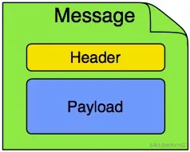
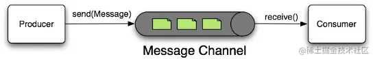
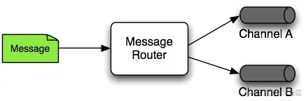
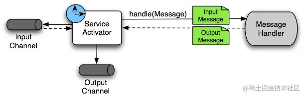
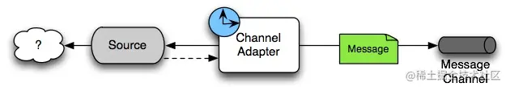
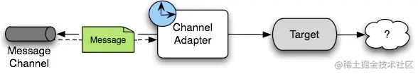
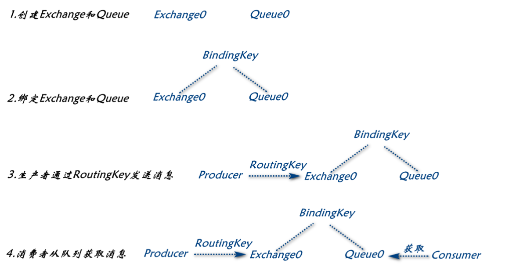
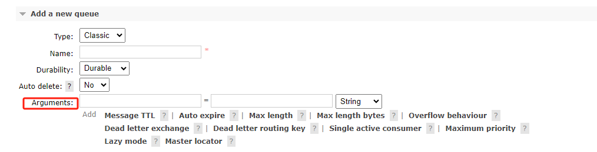
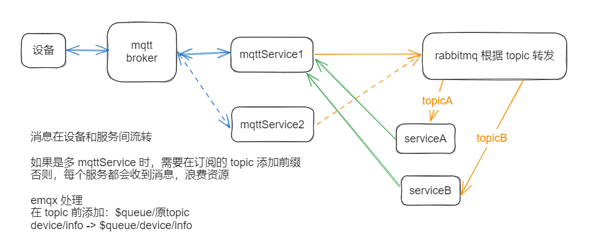
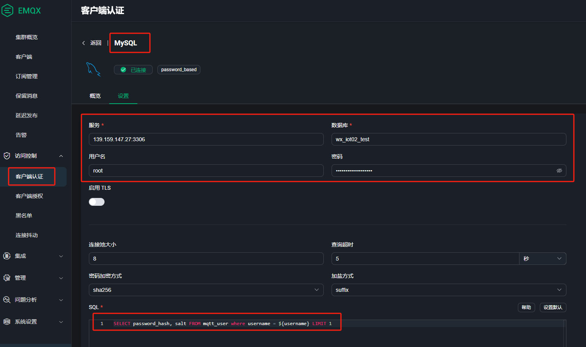

# 消息通信 MQ

## spring-integration

是一种**事件驱动消息框架**，用来在系统之间传递消息（抽象出了消息传递的规范）。

### 组件

#### Message 

包含 Header 和 Payload 两部分。



#### MessageChannel 

用于解耦生产者和消费者，实现消息发送。



#### MessageRouter 

用来控制消息转发的 Channel。



#### Service Activitor 

用来绑定 MessageHandler 和用于消费消息的 MessageChannel。



#### ChannelAdapter 

用来连接 MessageChannel 和具体的消息端口，例如通信的 topic。





### 交互逻辑

**对于发布者：**

1. 消息通过消息网关发送出去，由 `MessageChannel` 的实例 `DirectChannel` 处理发送的细节。
2. `DirectChannel` 收到消息后，内部通过 `MessageHandler` 的实例 `MqttPahoMessageHandler` 发送到指定的 Topic。

**对于订阅者：**

1. 通过注入 `MessageProducerSupport` 的实例 `MqttPahoMessageDrivenChannelAdapter`，实现订阅 Topic 和绑定消息消费的 `MessageChannel`。
2. 同样由 `MessageChannel` 的实例 `DirectChannel` 处理消费细节。Channel 消息后会发送给我们自定义的 `MqttInboundMessageHandler` 实例进行消费。


##  mqtt

emqx

官方文档：https://www.emqx.io/docs/zh/v5.1/getting-started/getting-started.html

## amqp（rabbitmq）

### 1. 基本

- Producer(生产者)： 将消息发送到Exchange
- Exchange(交换器)：将从生产者接收到的消息路由到Queue
- Queue(队列)：存放供消费者消费的消息
- BindingKey(绑定键)：建立Exchange与Queue之间的关系（个人看作是一种规则，也就是Exchange将什么样的消息路由到Queue）
- RoutingKey(路由键)：Producer发送消息与路由键给Exchange，Exchange将判断RoutingKey是否符合BindingKey，如何则将该消息路由到绑定的Queue
- Consumer(消费者)：从Queue中获取消息



### 2. Exchange

四种类型：**Direct、 topic、 Headers 、Fanout**

- Direct：direct 类型的行为是”先匹配, 再投送”. 即在绑定时设定一个 **routing_key**, 消息的 **routing_key** 匹配时, 才会被交换器投送到绑定的队列中去。（默认）
- Topic：按规则转发消息（最灵活）
- Headers：设置header attribute参数类型的交换机
- Fanout：转发消息到所有绑定队列

参数：

- exchange：名称
- type：类型
- durable：是否持久化，RabbitMQ关闭后，没有持久化的Exchange将被清除
  - （Dashboard 页面 transient 临时的， durable 持久化的）
- autoDelete：是否自动删除，如果没有与之绑定的Queue，直接删除
- internal：是否内置的，如果为true，只能通过Exchange到Exchange
- arguments：结构化参数

### 3. Queue

只有一种类型。

参数：

大部分和 exchange 一样，新参数 exclusive

exclusive：是否排他，如果未 true，则只在第一次创建它的 Connection 中有效，当 Connection 关闭，该 Queue 也会被删除（使用场景：系统内部的跨进程调用。生产者和消费者在同一系统内的连接中。）


Dashboard 配置页面中参数



Arguments

```shell
x-message-ttl
　　消息的最大存活时间，单位毫秒， 当超过时间后消息会被丢弃   默认消息存活时间为永久存在
x-expires
　　队列过期时间，当auto delete设置为true时，才会生效
x-max-length
　　队列存放最大就绪消息数量，超过限制时，从头部丢弃消息   默认最大数量限制与操作系统有关。
x-max-length-bytes
　　队列存放的所有消息总大小，超过限制时，从头部丢弃消息

x-overflow
消息超出最大数量时，溢出行为： drop-head 或 reject-publish
（drop-head:头部丢弃， reject-publish拒绝生产者发布消息）

x-dead-letter-exchange
当队列满时，被拒绝的消息，或者消息过期时，将被重新发布到死信交换机上。

x-dead-letter-routing-key
    消息被发布到死信交换机时，如果没设置这个路由键，则将使用消息的原始路由键，
    比如，消息发送到
    exchange=contract.exchange
    路由键 routeKey = contract.info
    当该队列满时，如果 x-dead-letter-exchange=contract.dead.exchange
    没有指定x-dead-letter-routing-key时，会将消息发送到队列为
    exchange=contract.dead.exchange
    routeKey = contract.info

    消息的原始路由键即时，消息原本要发送到的队列绑定路由键名
    
x-max-priority：
	队列支持的消息最大优先级数，没设置时，队列不支持消息优先级

x-queue-mode：lazy
	将队列设置为惰性模式，将消息保存在磁盘上，如果没设置，将保存内存缓存上以尽快传递消息

x-queue-master-locator
	将队列设置为 master 位置模式，确定队列 master 在节点集群上声明时的定位规则。
```

### 代码配置 exchange queue

```java
package com.wxkjwlw.device.common.rabbitmq;

import com.wxkjwlw.device.common.rabbitmq.enums.RabbitEnum;
import net.sf.jsqlparser.statement.select.Top;
import org.springframework.amqp.core.*;
import org.springframework.amqp.rabbit.annotation.EnableRabbit;
import org.springframework.amqp.rabbit.config.SimpleRabbitListenerContainerFactory;
import org.springframework.amqp.rabbit.connection.ConnectionFactory;
import org.springframework.amqp.rabbit.listener.RabbitListenerContainerFactory;
import org.springframework.context.annotation.Bean;
import org.springframework.context.annotation.Configuration;

import java.util.ArrayList;
import java.util.LinkedList;
import java.util.List;

/**
 * RabbitMq配置信息
 *
 * @author caobin
 * @date 2022-08-11 11:18:23
 */
@Configuration
@EnableRabbit
public class RabbitMqDirectConfig {

    /**
     * rabbitmq 2.2 以后需要通过 Declarables 批量创建队列
     * @return
     */
    @Bean
    public Declarables customDeclarables() {
        Declarables declarables = new Declarables();
        declarables.getDeclarables().addAll(allQueue());
        declarables.getDeclarables().addAll(allDirectExchange());
        declarables.getDeclarables().addAll(bindingDirect());
        return declarables;
    }

    /**
     * 创建队列
     *
     * @return LinkedList<Queue>
     */
    @Bean
    LinkedList<Queue> allQueue() {
        LinkedList<Queue> list = new LinkedList<>();
        RabbitEnum[] values = RabbitEnum.values();
        for (RabbitEnum rabbitEnum : values) {
            list.add(new Queue(rabbitEnum.getQueue(), true));
        }
        return list;
    }

    /**
     * 创建交换机
     *
     * @return LinkedList<DirectExchange>
     */
    @Bean
    LinkedList<DirectExchange> allDirectExchange() {
        LinkedList<DirectExchange> list = new LinkedList<>();
        RabbitEnum[] values = RabbitEnum.values();
        for (RabbitEnum rabbitEnum : values) {
            list.add(new DirectExchange(rabbitEnum.getExchange(), true, false));
        }
        return list;
    }

    /**
     * 将队列与交换机绑定
     *
     * @return List<Binding>
     */
    @Bean
    List<Binding> bindingDirect() {
        List<Binding> bindingList = new ArrayList<>(4);
        LinkedList<Queue> queues = allQueue();
        LinkedList<DirectExchange> directExchanges = allDirectExchange();
        for (int i = 0; i <= queues.size() - 1; i++) {
            Queue queue = queues.get(i);
            Binding with = BindingBuilder.bind(queue)
                    .to(directExchanges.get(i))
                    .with(RabbitEnum.getByQueueName(queue.getName()).getRouting());
            bindingList.add(with);
        }
        return bindingList;
    }

    @Bean
    DirectExchange lonelyDirectExchange() {
        return new DirectExchange("lonelyDirectExchange");
    }
    
    /**
     * 通用推送配置
     *
     * @param connectionFactory ConnectionFactory
     * @return RabbitListenerContainerFactory
     */
    @Bean(name = "commonContainerFactory")
    public RabbitListenerContainerFactory<?> commonContainerFactory(ConnectionFactory connectionFactory) {
        //SimpleRabbitListenerContainerFactory发现消息中有content_type有text就会默认将其转换成string类型的
        SimpleRabbitListenerContainerFactory factory = new SimpleRabbitListenerContainerFactory();
        factory.setConnectionFactory(connectionFactory);
        //配置消费者并发数量
        factory.setConcurrentConsumers(2);
        //预加载消息数量
        factory.setPrefetchCount(1);
        return factory;
    }
}

```


### 4. 配置

ConnectionFactory 

连接相关的配置

MessageConverter

消息转换，发送消息（convertAndSend）时的序列化方法是把数据转化为字节数组

```java
@Override
public void convertAndSend(String exchange, String routingKey, final Object object,
                           @Nullable CorrelationData correlationData) throws AmqpException {
    send(exchange, routingKey, convertMessageIfNecessary(object), correlationData);
}
```

### 5. 消息确认机制

#### Confirm 消息确认机制

生产者向MQ投递完消息后，要求MQ返回一个应答，生产者异步接收该应答，用来确定该消息是否正常的发送到了Broker, 从而保障消息的可靠性投递

**配置位置**

```yaml
spring:
  rabbitmq:
    host: 139.159.147.27
    password: IJGnier15PKR4ERI
    username: root
    port: 5672
    # Confirm 消息确认机制
    publisher-confirm-type: correlated
```

**类型：none、correlated、simple**

- none：表示禁用发布确认模式，默认值，使用此模式之后，不管消息有没有发送到 Broker 都不会触发 ConfirmCallback 回调。
- correlated：表示消息成功到达 Broker 后触发 ConfirmCalllBack 回调
- simple：simple模式下如果消息成功到达Broker后一样会触发

**代码** RabbitConfig

```java
rabbitTemplate.setConfirmCallback(new RabbitTemplate.ConfirmCallback() {
    @Override
    public void confirm(CorrelationData correlationData, boolean ack, String cause) {
        log.info("ConfirmCallback:     相关数据:{}", correlationData);
        log.info("ConfirmCallback:     确认情况:{}", ack);
        log.info("ConfirmCallback:     原因:{}", cause);
    }
});
```


#### Return 消息返回机制

该机制用于处理一些不可路由的消息。如果生产在发送消息时，发现当前的 exchange 不存在或者指定的路由key找不到时，生产者可以开启该模式来监听这种不可达的消息，以进行后续。（如果不开启的话，broker会自动删除该消息）
这里要注意的是，只要消息到达了MQ就换返回Confirm消息，接下来MQ再去判断能不能找到路由方式，找不到再返回Return消息

**配置位置**

```yaml
spring:
  rabbitmq:
    host: 139.159.147.27
    password: IJGnier15PKR4ERI
    username: root
    port: 5672
    # Return 消息返回机制
    publisher-returns: true
    template:
      mandatory: true
```

**代码** RabbitConfig

```java
rabbitTemplate.setReturnsCallback(new RabbitTemplate.ReturnsCallback() {
    @Override
    public void returnedMessage(@NotNull ReturnedMessage returned) {
        log.info("ReturnCallback:     消息:{}", returned.getMessage());
        log.info("ReturnCallback:     回应码:{}", returned.getReplyCode());
        log.info("ReturnCallback:     回应信息:{}", returned.getReplyText());
        log.info("ReturnCallback:     交换机:{}", returned.getExchange());
        log.info("ReturnCallback:     路由键:{}", returned.getRoutingKey());
    }
});
```

规范

```java
* 一、exchange命名规范：(名字之间使用 . 作为分割)
 * exchange.[使用的平台名称].[业务名].[路由特点]
 * 举例说明：
 * exchange.dmc.workflow.direct
 * exchange.dmc.workflow.direct.dlx
 * <p>
 * 二、queue命名规范：(名字之间使用 . 作为分割)
 * 1.[容器名称].[使用的平台名称].[业务名].[队列特点or路由特点].[功能]
 * 2.[容器名称].[使用的平台名称].[业务名].[功能]
 * 举例说明：
 * queue.dmc.workflow.delay.callback
 * queue.dmc.workflow.delay.callback.dlx
 * 名词解释：
 * 容器名称：queue|exchange
 * 使用的平台名称：dmc|evidence|xxx
 * 业务名: workflow|schedule|script|xxx
 * 队列特点：非持久化标记(undurable)、延时队列(delay)、优先级队列(priority)
 * 路由特点：direct、topic、fanout、headers
```


## 项目

### 1. 消息流转

消息流转，搭配 rabbitmq 进行业务处理，rabbit 可以换成 kafka



### 2. 设备验证

emqx 可以设置从数据库读取设备预先配置的用户密码进行验证。

文档：https://www.emqx.io/docs/zh/v5.1/access-control/authn/mysql.html

创建用户表（可以调整）

```sql
CREATE TABLE `mqtt_user` (
  `id` int(11) unsigned NOT NULL AUTO_INCREMENT,
  `username` varchar(100) DEFAULT NULL,
  `password_hash` varchar(100) DEFAULT NULL,
  `salt` varchar(35) DEFAULT NULL,
  `is_superuser` tinyint(1) DEFAULT 0,
  `created` datetime DEFAULT NULL,
  PRIMARY KEY (`id`),
  UNIQUE KEY `mqtt_username` (`username`)
) ENGINE=InnoDB DEFAULT CHARSET=utf8mb4;
```

添加用户（可以修改）

```sql
mysql> INSERT INTO mqtt_user(username, password_hash, salt, is_superuser) VALUES ('emqx_u', SHA2(concat('public', 'slat_foo123'), 256), 'slat_foo123', 1);
Query OK, 1 row affected (0,01 sec)
```

Dashboard 配置

