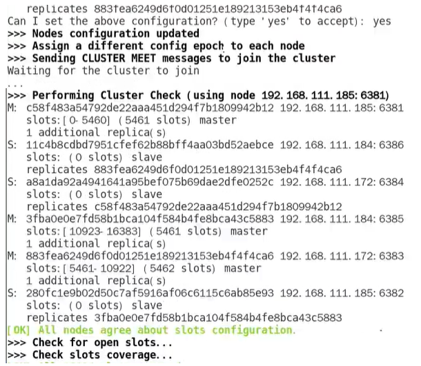
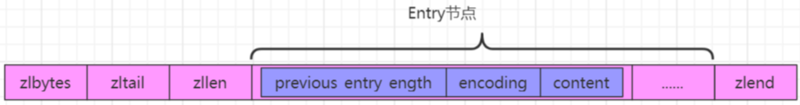

在 SpringBoot2.x 之后，原来使用的 jedis 被替换为了 lettuce

- jedis : 采用的直连，多个线程操作的话，是不安全的，如果想要避免不安全的，使用 jedis pool 连接池！ 更像 BIO 模式
- lettuce : 采用 netty，实例可以再多个线程中进行共享，不存在线程不安全的情况。可以减少线程数据，更像 NIO 模式

## 基础

### 1.10大数据类型

-  string
- list
- hash
- set
- Zset（有序集合）
- GEO（地理坐标）
- HyperLogLog（基数统计）
- bitmap
- bitfield（位域）
- stream

乱码时，使用 redis-cli --raw 重新进入

### 2.命令

#### 配置文件下载地址

```shell
cd /opt/redis   //进入目录
wget http://download.redis.io/redis-stable/redis.conf   //下载redis配置文件
vim redis.conf  //修改配置文件
```

#### 常见命令

官网查询：https://redis.io/docs/latest/commands/


#### config 命令可查询配置


### 3.持久化

#### RDB（redis database）：快照

在指定时间内，把某一刻的数据和状态写到磁盘上（dump.rdb）,恢复时，直接读到内存中。

config 配置文件中，save m n 表示


redis 7 中，对保存进行了调整。


可自动触发、手动触发 RDB 备份

手动有 SAVE BGSAVE 命令。但是当 save 时，会阻塞数据，不可在生产上用。bgsave 可用子进程进行备份操作，lastsave 最后保存时间。

fork：在 linux 中，fork() 会产生一个和父进程完全相同的子进程，但此后多会 exec 系统调用，出于效率考虑，尽量避免膨胀。


缺点：在异常情况下，会丢失未被写入磁盘的数据（内存中的未来得及保存到磁盘中的数据）。

rdb 修复命令：

```shell
redis-check-rdb xx.rdb
```

禁用 RDB（都可以）：

动态：

```shell
redis-cli config set save ""
```

config 配置文件

```
save ""
```


#### AOF（append only file）：记录指令

config 打开（默认 关闭）

```shell
appendonly yes
```

三种写回策略：

```shell
appendfsync everysec
```

always（每写一次保存一次）、everysec（默认 每秒写回）、no（依赖系统）


持久化流程：


redis 6.0 7.0 区别


aof 目录文件不同

6.0：aof、rdb 都在一起

7.0：aof 单独文件夹

aof 文件名称不同


AOF 重写机制


#### 混合模式

config

```shell
aof-use-rdb-preamble yes
```

RDB 全量 AOF 增量

#### 纯缓存模式

关闭 RDB AOF ，相当于不存储关键信息，只用做缓存

### 4.事务


### 5.管道

多条命令，批处理执行，类似合并发送

### 6.config 默认文件

```shell
# Redis configuration file example.
#
# Note that in order to read the configuration file, Redis must be
# started with the file path as first argument:
#
# ./redis-server /path/to/redis.conf

# Note on units: when memory size is needed, it is possible to specify
# it in the usual form of 1k 5GB 4M and so forth:
#
# 1k => 1000 bytes
# 1kb => 1024 bytes
# 1m => 1000000 bytes
# 1mb => 1024*1024 bytes
# 1g => 1000000000 bytes
# 1gb => 1024*1024*1024 bytes
#
# units are case insensitive so 1GB 1Gb 1gB are all the same.

################################## INCLUDES ###################################

# Include one or more other config files here.  This is useful if you
# have a standard template that goes to all Redis servers but also need
# to customize a few per-server settings.  Include files can include
# other files, so use this wisely.
#
# Note that option "include" won't be rewritten by command "CONFIG REWRITE"
# from admin or Redis Sentinel. Since Redis always uses the last processed
# line as value of a configuration directive, you'd better put includes
# at the beginning of this file to avoid overwriting config change at runtime.
#
# If instead you are interested in using includes to override configuration
# options, it is better to use include as the last line.
#
# Included paths may contain wildcards. All files matching the wildcards will
# be included in alphabetical order.
# Note that if an include path contains a wildcards but no files match it when
# the server is started, the include statement will be ignored and no error will
# be emitted.  It is safe, therefore, to include wildcard files from empty
# directories.
#
# include /path/to/local.conf
# include /path/to/other.conf
# include /path/to/fragments/*.conf
#

################################## MODULES #####################################

# Load modules at startup. If the server is not able to load modules
# it will abort. It is possible to use multiple loadmodule directives.
#
# loadmodule /path/to/my_module.so
# loadmodule /path/to/other_module.so

################################## NETWORK #####################################

# By default, if no "bind" configuration directive is specified, Redis listens
# for connections from all available network interfaces on the host machine.
# It is possible to listen to just one or multiple selected interfaces using
# the "bind" configuration directive, followed by one or more IP addresses.
# Each address can be prefixed by "-", which means that redis will not fail to
# start if the address is not available. Being not available only refers to
# addresses that does not correspond to any network interface. Addresses that
# are already in use will always fail, and unsupported protocols will always BE
# silently skipped.
#
# Examples:
#
# bind 192.168.1.100 10.0.0.1     # listens on two specific IPv4 addresses
# bind 127.0.0.1 ::1              # listens on loopback IPv4 and IPv6
# bind * -::*                     # like the default, all available interfaces
#
# ~~~ WARNING ~~~ If the computer running Redis is directly exposed to the
# internet, binding to all the interfaces is dangerous and will expose the
# instance to everybody on the internet. So by default we uncomment the
# following bind directive, that will force Redis to listen only on the
# IPv4 and IPv6 (if available) loopback interface addresses (this means Redis
# will only be able to accept client connections from the same host that it is
# running on).
#
# IF YOU ARE SURE YOU WANT YOUR INSTANCE TO LISTEN TO ALL THE INTERFACES
# COMMENT OUT THE FOLLOWING LINE.
#
# You will also need to set a password unless you explicitly disable protected
# mode.
# ~~~~~~~~~~~~~~~~~~~~~~~~~~~~~~~~~~~~~~~~~~~~~~~~~~~~~~~~~~~~~~~~~~~~~~~~
bind 127.0.0.1 -::1

# By default, outgoing connections (from replica to master, from Sentinel to
# instances, cluster bus, etc.) are not bound to a specific local address. In
# most cases, this means the operating system will handle that based on routing
# and the interface through which the connection goes out.
#
# Using bind-source-addr it is possible to configure a specific address to bind
# to, which may also affect how the connection gets routed.
#
# Example:
#
# bind-source-addr 10.0.0.1

# Protected mode is a layer of security protection, in order to avoid that
# Redis instances left open on the internet are accessed and exploited.
#
# When protected mode is on and the default user has no password, the server
# only accepts local connections from the IPv4 address (127.0.0.1), IPv6 address
# (::1) or Unix domain sockets.
#
# By default protected mode is enabled. You should disable it only if
# you are sure you want clients from other hosts to connect to Redis
# even if no authentication is configured.
protected-mode yes

# Redis uses default hardened security configuration directives to reduce the
# attack surface on innocent users. Therefore, several sensitive configuration
# directives are immutable, and some potentially-dangerous commands are blocked.
#
# Configuration directives that control files that Redis writes to (e.g., 'dir'
# and 'dbfilename') and that aren't usually modified during runtime
# are protected by making them immutable.
#
# Commands that can increase the attack surface of Redis and that aren't usually
# called by users are blocked by default.
#
# These can be exposed to either all connections or just local ones by setting
# each of the configs listed below to either of these values:
#
# no    - Block for any connection (remain immutable)
# yes   - Allow for any connection (no protection)
# local - Allow only for local connections. Ones originating from the
#         IPv4 address (127.0.0.1), IPv6 address (::1) or Unix domain sockets.
#
# enable-protected-configs no
# enable-debug-command no
# enable-module-command no

# Accept connections on the specified port, default is 6379 (IANA #815344).
# If port 0 is specified Redis will not listen on a TCP socket.
port 6379

# TCP listen() backlog.
#
# In high requests-per-second environments you need a high backlog in order
# to avoid slow clients connection issues. Note that the Linux kernel
# will silently truncate it to the value of /proc/sys/net/core/somaxconn so
# make sure to raise both the value of somaxconn and tcp_max_syn_backlog
# in order to get the desired effect.
tcp-backlog 511

# Unix socket.
#
# Specify the path for the Unix socket that will be used to listen for
# incoming connections. There is no default, so Redis will not listen
# on a unix socket when not specified.
#
# unixsocket /run/redis.sock
# unixsocketperm 700

# Close the connection after a client is idle for N seconds (0 to disable)
timeout 0

# TCP keepalive.
#
# If non-zero, use SO_KEEPALIVE to send TCP ACKs to clients in absence
# of communication. This is useful for two reasons:
#
# 1) Detect dead peers.
# 2) Force network equipment in the middle to consider the connection to be
#    alive.
#
# On Linux, the specified value (in seconds) is the period used to send ACKs.
# Note that to close the connection the double of the time is needed.
# On other kernels the period depends on the kernel configuration.
#
# A reasonable value for this option is 300 seconds, which is the new
# Redis default starting with Redis 3.2.1.
tcp-keepalive 300

# Apply OS-specific mechanism to mark the listening socket with the specified
# ID, to support advanced routing and filtering capabilities.
#
# On Linux, the ID represents a connection mark.
# On FreeBSD, the ID represents a socket cookie ID.
# On OpenBSD, the ID represents a route table ID.
#
# The default value is 0, which implies no marking is required.
# socket-mark-id 0

################################# TLS/SSL #####################################

# By default, TLS/SSL is disabled. To enable it, the "tls-port" configuration
# directive can be used to define TLS-listening ports. To enable TLS on the
# default port, use:
#
# port 0
# tls-port 6379

# Configure a X.509 certificate and private key to use for authenticating the
# server to connected clients, masters or cluster peers.  These files should be
# PEM formatted.
#
# tls-cert-file redis.crt
# tls-key-file redis.key
#
# If the key file is encrypted using a passphrase, it can be included here
# as well.
#
# tls-key-file-pass secret

# Normally Redis uses the same certificate for both server functions (accepting
# connections) and client functions (replicating from a master, establishing
# cluster bus connections, etc.).
#
# Sometimes certificates are issued with attributes that designate them as
# client-only or server-only certificates. In that case it may be desired to use
# different certificates for incoming (server) and outgoing (client)
# connections. To do that, use the following directives:
#
# tls-client-cert-file client.crt
# tls-client-key-file client.key
#
# If the key file is encrypted using a passphrase, it can be included here
# as well.
#
# tls-client-key-file-pass secret

# Configure a DH parameters file to enable Diffie-Hellman (DH) key exchange,
# required by older versions of OpenSSL (<3.0). Newer versions do not require
# this configuration and recommend against it.
#
# tls-dh-params-file redis.dh

# Configure a CA certificate(s) bundle or directory to authenticate TLS/SSL
# clients and peers.  Redis requires an explicit configuration of at least one
# of these, and will not implicitly use the system wide configuration.
#
# tls-ca-cert-file ca.crt
# tls-ca-cert-dir /etc/ssl/certs

# By default, clients (including replica servers) on a TLS port are required
# to authenticate using valid client side certificates.
#
# If "no" is specified, client certificates are not required and not accepted.
# If "optional" is specified, client certificates are accepted and must be
# valid if provided, but are not required.
#
# tls-auth-clients no
# tls-auth-clients optional

# By default, a Redis replica does not attempt to establish a TLS connection
# with its master.
#
# Use the following directive to enable TLS on replication links.
#
# tls-replication yes

# By default, the Redis Cluster bus uses a plain TCP connection. To enable
# TLS for the bus protocol, use the following directive:
#
# tls-cluster yes

# By default, only TLSv1.2 and TLSv1.3 are enabled and it is highly recommended
# that older formally deprecated versions are kept disabled to reduce the attack surface.
# You can explicitly specify TLS versions to support.
# Allowed values are case insensitive and include "TLSv1", "TLSv1.1", "TLSv1.2",
# "TLSv1.3" (OpenSSL >= 1.1.1) or any combination.
# To enable only TLSv1.2 and TLSv1.3, use:
#
# tls-protocols "TLSv1.2 TLSv1.3"

# Configure allowed ciphers.  See the ciphers(1ssl) manpage for more information
# about the syntax of this string.
#
# Note: this configuration applies only to <= TLSv1.2.
#
# tls-ciphers DEFAULT:!MEDIUM

# Configure allowed TLSv1.3 ciphersuites.  See the ciphers(1ssl) manpage for more
# information about the syntax of this string, and specifically for TLSv1.3
# ciphersuites.
#
# tls-ciphersuites TLS_CHACHA20_POLY1305_SHA256

# When choosing a cipher, use the server's preference instead of the client
# preference. By default, the server follows the client's preference.
#
# tls-prefer-server-ciphers yes

# By default, TLS session caching is enabled to allow faster and less expensive
# reconnections by clients that support it. Use the following directive to disable
# caching.
#
# tls-session-caching no

# Change the default number of TLS sessions cached. A zero value sets the cache
# to unlimited size. The default size is 20480.
#
# tls-session-cache-size 5000

# Change the default timeout of cached TLS sessions. The default timeout is 300
# seconds.
#
# tls-session-cache-timeout 60

################################# GENERAL #####################################

# By default Redis does not run as a daemon. Use 'yes' if you need it.
# Note that Redis will write a pid file in /var/run/redis.pid when daemonized.
# When Redis is supervised by upstart or systemd, this parameter has no impact.
daemonize no

# If you run Redis from upstart or systemd, Redis can interact with your
# supervision tree. Options:
#   supervised no      - no supervision interaction
#   supervised upstart - signal upstart by putting Redis into SIGSTOP mode
#                        requires "expect stop" in your upstart job config
#   supervised systemd - signal systemd by writing READY=1 to $NOTIFY_SOCKET
#                        on startup, and updating Redis status on a regular
#                        basis.
#   supervised auto    - detect upstart or systemd method based on
#                        UPSTART_JOB or NOTIFY_SOCKET environment variables
# Note: these supervision methods only signal "process is ready."
#       They do not enable continuous pings back to your supervisor.
#
# The default is "no". To run under upstart/systemd, you can simply uncomment
# the line below:
#
# supervised auto

# If a pid file is specified, Redis writes it where specified at startup
# and removes it at exit.
#
# When the server runs non daemonized, no pid file is created if none is
# specified in the configuration. When the server is daemonized, the pid file
# is used even if not specified, defaulting to "/var/run/redis.pid".
#
# Creating a pid file is best effort: if Redis is not able to create it
# nothing bad happens, the server will start and run normally.
#
# Note that on modern Linux systems "/run/redis.pid" is more conforming
# and should be used instead.
pidfile /var/run/redis_6379.pid

# Specify the server verbosity level.
# This can be one of:
# debug (a lot of information, useful for development/testing)
# verbose (many rarely useful info, but not a mess like the debug level)
# notice (moderately verbose, what you want in production probably)
# warning (only very important / critical messages are logged)
# nothing (nothing is logged)
loglevel notice

# Specify the log file name. Also the empty string can be used to force
# Redis to log on the standard output. Note that if you use standard
# output for logging but daemonize, logs will be sent to /dev/null
logfile ""

# To enable logging to the system logger, just set 'syslog-enabled' to yes,
# and optionally update the other syslog parameters to suit your needs.
# syslog-enabled no

# Specify the syslog identity.
# syslog-ident redis

# Specify the syslog facility. Must be USER or between LOCAL0-LOCAL7.
# syslog-facility local0

# To disable the built in crash log, which will possibly produce cleaner core
# dumps when they are needed, uncomment the following:
#
# crash-log-enabled no

# To disable the fast memory check that's run as part of the crash log, which
# will possibly let redis terminate sooner, uncomment the following:
#
# crash-memcheck-enabled no

# Set the number of databases. The default database is DB 0, you can select
# a different one on a per-connection basis using SELECT <dbid> where
# dbid is a number between 0 and 'databases'-1
databases 16

# By default Redis shows an ASCII art logo only when started to log to the
# standard output and if the standard output is a TTY and syslog logging is
# disabled. Basically this means that normally a logo is displayed only in
# interactive sessions.
#
# However it is possible to force the pre-4.0 behavior and always show a
# ASCII art logo in startup logs by setting the following option to yes.
always-show-logo no

# By default, Redis modifies the process title (as seen in 'top' and 'ps') to
# provide some runtime information. It is possible to disable this and leave
# the process name as executed by setting the following to no.
set-proc-title yes

# When changing the process title, Redis uses the following template to construct
# the modified title.
#
# Template variables are specified in curly brackets. The following variables are
# supported:
#
# {title}           Name of process as executed if parent, or type of child process.
# {listen-addr}     Bind address or '*' followed by TCP or TLS port listening on, or
#                   Unix socket if only that's available.
# {server-mode}     Special mode, i.e. "[sentinel]" or "[cluster]".
# {port}            TCP port listening on, or 0.
# {tls-port}        TLS port listening on, or 0.
# {unixsocket}      Unix domain socket listening on, or "".
# {config-file}     Name of configuration file used.
#
proc-title-template "{title} {listen-addr} {server-mode}"

# Set the local environment which is used for string comparison operations, and 
# also affect the performance of Lua scripts. Empty String indicates the locale 
# is derived from the environment variables.
locale-collate ""

################################ SNAPSHOTTING  ################################

# Save the DB to disk.
#
# save <seconds> <changes> [<seconds> <changes> ...]
#
# Redis will save the DB if the given number of seconds elapsed and it
# surpassed the given number of write operations against the DB.
#
# Snapshotting can be completely disabled with a single empty string argument
# as in following example:
#
# save ""
#
# Unless specified otherwise, by default Redis will save the DB:
#   * After 3600 seconds (an hour) if at least 1 change was performed
#   * After 300 seconds (5 minutes) if at least 100 changes were performed
#   * After 60 seconds if at least 10000 changes were performed
#
# You can set these explicitly by uncommenting the following line.
#
# save 3600 1 300 100 60 10000

# By default Redis will stop accepting writes if RDB snapshots are enabled
# (at least one save point) and the latest background save failed.
# This will make the user aware (in a hard way) that data is not persisting
# on disk properly, otherwise chances are that no one will notice and some
# disaster will happen.
#
# If the background saving process will start working again Redis will
# automatically allow writes again.
#
# However if you have setup your proper monitoring of the Redis server
# and persistence, you may want to disable this feature so that Redis will
# continue to work as usual even if there are problems with disk,
# permissions, and so forth.
stop-writes-on-bgsave-error yes

# Compress string objects using LZF when dump .rdb databases?
# By default compression is enabled as it's almost always a win.
# If you want to save some CPU in the saving child set it to 'no' but
# the dataset will likely be bigger if you have compressible values or keys.
rdbcompression yes

# Since version 5 of RDB a CRC64 checksum is placed at the end of the file.
# This makes the format more resistant to corruption but there is a performance
# hit to pay (around 10%) when saving and loading RDB files, so you can disable it
# for maximum performances.
#
# RDB files created with checksum disabled have a checksum of zero that will
# tell the loading code to skip the check.
rdbchecksum yes

# Enables or disables full sanitization checks for ziplist and listpack etc when
# loading an RDB or RESTORE payload. This reduces the chances of a assertion or
# crash later on while processing commands.
# Options:
#   no         - Never perform full sanitization
#   yes        - Always perform full sanitization
#   clients    - Perform full sanitization only for user connections.
#                Excludes: RDB files, RESTORE commands received from the master
#                connection, and client connections which have the
#                skip-sanitize-payload ACL flag.
# The default should be 'clients' but since it currently affects cluster
# resharding via MIGRATE, it is temporarily set to 'no' by default.
#
# sanitize-dump-payload no

# The filename where to dump the DB
dbfilename dump.rdb

# Remove RDB files used by replication in instances without persistence
# enabled. By default this option is disabled, however there are environments
# where for regulations or other security concerns, RDB files persisted on
# disk by masters in order to feed replicas, or stored on disk by replicas
# in order to load them for the initial synchronization, should be deleted
# ASAP. Note that this option ONLY WORKS in instances that have both AOF
# and RDB persistence disabled, otherwise is completely ignored.
#
# An alternative (and sometimes better) way to obtain the same effect is
# to use diskless replication on both master and replicas instances. However
# in the case of replicas, diskless is not always an option.
rdb-del-sync-files no

# The working directory.
#
# The DB will be written inside this directory, with the filename specified
# above using the 'dbfilename' configuration directive.
#
# The Append Only File will also be created inside this directory.
#
# Note that you must specify a directory here, not a file name.
dir ./

################################# REPLICATION #################################

# Master-Replica replication. Use replicaof to make a Redis instance a copy of
# another Redis server. A few things to understand ASAP about Redis replication.
#
#   +------------------+      +---------------+
#   |      Master      | ---> |    Replica    |
#   | (receive writes) |      |  (exact copy) |
#   +------------------+      +---------------+
#
# 1) Redis replication is asynchronous, but you can configure a master to
#    stop accepting writes if it appears to be not connected with at least
#    a given number of replicas.
# 2) Redis replicas are able to perform a partial resynchronization with the
#    master if the replication link is lost for a relatively small amount of
#    time. You may want to configure the replication backlog size (see the next
#    sections of this file) with a sensible value depending on your needs.
# 3) Replication is automatic and does not need user intervention. After a
#    network partition replicas automatically try to reconnect to masters
#    and resynchronize with them.
#
# replicaof <masterip> <masterport>

# If the master is password protected (using the "requirepass" configuration
# directive below) it is possible to tell the replica to authenticate before
# starting the replication synchronization process, otherwise the master will
# refuse the replica request.
#
# masterauth <master-password>
#
# However this is not enough if you are using Redis ACLs (for Redis version
# 6 or greater), and the default user is not capable of running the PSYNC
# command and/or other commands needed for replication. In this case it's
# better to configure a special user to use with replication, and specify the
# masteruser configuration as such:
#
# masteruser <username>
#
# When masteruser is specified, the replica will authenticate against its
# master using the new AUTH form: AUTH <username> <password>.

# When a replica loses its connection with the master, or when the replication
# is still in progress, the replica can act in two different ways:
#
# 1) if replica-serve-stale-data is set to 'yes' (the default) the replica will
#    still reply to client requests, possibly with out of date data, or the
#    data set may just be empty if this is the first synchronization.
#
# 2) If replica-serve-stale-data is set to 'no' the replica will reply with error
#    "MASTERDOWN Link with MASTER is down and replica-serve-stale-data is set to 'no'"
#    to all data access commands, excluding commands such as:
#    INFO, REPLICAOF, AUTH, SHUTDOWN, REPLCONF, ROLE, CONFIG, SUBSCRIBE,
#    UNSUBSCRIBE, PSUBSCRIBE, PUNSUBSCRIBE, PUBLISH, PUBSUB, COMMAND, POST,
#    HOST and LATENCY.
#
replica-serve-stale-data yes

# You can configure a replica instance to accept writes or not. Writing against
# a replica instance may be useful to store some ephemeral data (because data
# written on a replica will be easily deleted after resync with the master) but
# may also cause problems if clients are writing to it because of a
# misconfiguration.
#
# Since Redis 2.6 by default replicas are read-only.
#
# Note: read only replicas are not designed to be exposed to untrusted clients
# on the internet. It's just a protection layer against misuse of the instance.
# Still a read only replica exports by default all the administrative commands
# such as CONFIG, DEBUG, and so forth. To a limited extent you can improve
# security of read only replicas using 'rename-command' to shadow all the
# administrative / dangerous commands.
replica-read-only yes

# Replication SYNC strategy: disk or socket.
#
# New replicas and reconnecting replicas that are not able to continue the
# replication process just receiving differences, need to do what is called a
# "full synchronization". An RDB file is transmitted from the master to the
# replicas.
#
# The transmission can happen in two different ways:
#
# 1) Disk-backed: The Redis master creates a new process that writes the RDB
#                 file on disk. Later the file is transferred by the parent
#                 process to the replicas incrementally.
# 2) Diskless: The Redis master creates a new process that directly writes the
#              RDB file to replica sockets, without touching the disk at all.
#
# With disk-backed replication, while the RDB file is generated, more replicas
# can be queued and served with the RDB file as soon as the current child
# producing the RDB file finishes its work. With diskless replication instead
# once the transfer starts, new replicas arriving will be queued and a new
# transfer will start when the current one terminates.
#
# When diskless replication is used, the master waits a configurable amount of
# time (in seconds) before starting the transfer in the hope that multiple
# replicas will arrive and the transfer can be parallelized.
#
# With slow disks and fast (large bandwidth) networks, diskless replication
# works better.
repl-diskless-sync yes

# When diskless replication is enabled, it is possible to configure the delay
# the server waits in order to spawn the child that transfers the RDB via socket
# to the replicas.
#
# This is important since once the transfer starts, it is not possible to serve
# new replicas arriving, that will be queued for the next RDB transfer, so the
# server waits a delay in order to let more replicas arrive.
#
# The delay is specified in seconds, and by default is 5 seconds. To disable
# it entirely just set it to 0 seconds and the transfer will start ASAP.
repl-diskless-sync-delay 5

# When diskless replication is enabled with a delay, it is possible to let
# the replication start before the maximum delay is reached if the maximum
# number of replicas expected have connected. Default of 0 means that the
# maximum is not defined and Redis will wait the full delay.
repl-diskless-sync-max-replicas 0

# -----------------------------------------------------------------------------
# WARNING: Since in this setup the replica does not immediately store an RDB on
# disk, it may cause data loss during failovers. RDB diskless load + Redis
# modules not handling I/O reads may cause Redis to abort in case of I/O errors
# during the initial synchronization stage with the master.
# -----------------------------------------------------------------------------
#
# Replica can load the RDB it reads from the replication link directly from the
# socket, or store the RDB to a file and read that file after it was completely
# received from the master.
#
# In many cases the disk is slower than the network, and storing and loading
# the RDB file may increase replication time (and even increase the master's
# Copy on Write memory and replica buffers).
# However, when parsing the RDB file directly from the socket, in order to avoid
# data loss it's only safe to flush the current dataset when the new dataset is
# fully loaded in memory, resulting in higher memory usage.
# For this reason we have the following options:
#
# "disabled"    - Don't use diskless load (store the rdb file to the disk first)
# "swapdb"      - Keep current db contents in RAM while parsing the data directly
#                 from the socket. Replicas in this mode can keep serving current
#                 dataset while replication is in progress, except for cases where
#                 they can't recognize master as having a data set from same
#                 replication history.
#                 Note that this requires sufficient memory, if you don't have it,
#                 you risk an OOM kill.
# "on-empty-db" - Use diskless load only when current dataset is empty. This is 
#                 safer and avoid having old and new dataset loaded side by side
#                 during replication.
repl-diskless-load disabled

# Master send PINGs to its replicas in a predefined interval. It's possible to
# change this interval with the repl_ping_replica_period option. The default
# value is 10 seconds.
#
# repl-ping-replica-period 10

# The following option sets the replication timeout for:
#
# 1) Bulk transfer I/O during SYNC, from the point of view of replica.
# 2) Master timeout from the point of view of replicas (data, pings).
# 3) Replica timeout from the point of view of masters (REPLCONF ACK pings).
#
# It is important to make sure that this value is greater than the value
# specified for repl-ping-replica-period otherwise a timeout will be detected
# every time there is low traffic between the master and the replica. The default
# value is 60 seconds.
#
# repl-timeout 60

# Disable TCP_NODELAY on the replica socket after SYNC?
#
# If you select "yes" Redis will use a smaller number of TCP packets and
# less bandwidth to send data to replicas. But this can add a delay for
# the data to appear on the replica side, up to 40 milliseconds with
# Linux kernels using a default configuration.
#
# If you select "no" the delay for data to appear on the replica side will
# be reduced but more bandwidth will be used for replication.
#
# By default we optimize for low latency, but in very high traffic conditions
# or when the master and replicas are many hops away, turning this to "yes" may
# be a good idea.
repl-disable-tcp-nodelay no

# Set the replication backlog size. The backlog is a buffer that accumulates
# replica data when replicas are disconnected for some time, so that when a
# replica wants to reconnect again, often a full resync is not needed, but a
# partial resync is enough, just passing the portion of data the replica
# missed while disconnected.
#
# The bigger the replication backlog, the longer the replica can endure the
# disconnect and later be able to perform a partial resynchronization.
#
# The backlog is only allocated if there is at least one replica connected.
#
# repl-backlog-size 1mb

# After a master has no connected replicas for some time, the backlog will be
# freed. The following option configures the amount of seconds that need to
# elapse, starting from the time the last replica disconnected, for the backlog
# buffer to be freed.
#
# Note that replicas never free the backlog for timeout, since they may be
# promoted to masters later, and should be able to correctly "partially
# resynchronize" with other replicas: hence they should always accumulate backlog.
#
# A value of 0 means to never release the backlog.
#
# repl-backlog-ttl 3600

# The replica priority is an integer number published by Redis in the INFO
# output. It is used by Redis Sentinel in order to select a replica to promote
# into a master if the master is no longer working correctly.
#
# A replica with a low priority number is considered better for promotion, so
# for instance if there are three replicas with priority 10, 100, 25 Sentinel
# will pick the one with priority 10, that is the lowest.
#
# However a special priority of 0 marks the replica as not able to perform the
# role of master, so a replica with priority of 0 will never be selected by
# Redis Sentinel for promotion.
#
# By default the priority is 100.
replica-priority 100

# The propagation error behavior controls how Redis will behave when it is
# unable to handle a command being processed in the replication stream from a master
# or processed while reading from an AOF file. Errors that occur during propagation
# are unexpected, and can cause data inconsistency. However, there are edge cases
# in earlier versions of Redis where it was possible for the server to replicate or persist
# commands that would fail on future versions. For this reason the default behavior
# is to ignore such errors and continue processing commands.
#
# If an application wants to ensure there is no data divergence, this configuration
# should be set to 'panic' instead. The value can also be set to 'panic-on-replicas'
# to only panic when a replica encounters an error on the replication stream. One of
# these two panic values will become the default value in the future once there are
# sufficient safety mechanisms in place to prevent false positive crashes.
#
# propagation-error-behavior ignore

# Replica ignore disk write errors controls the behavior of a replica when it is
# unable to persist a write command received from its master to disk. By default,
# this configuration is set to 'no' and will crash the replica in this condition.
# It is not recommended to change this default, however in order to be compatible
# with older versions of Redis this config can be toggled to 'yes' which will just
# log a warning and execute the write command it got from the master.
#
# replica-ignore-disk-write-errors no

# -----------------------------------------------------------------------------
# By default, Redis Sentinel includes all replicas in its reports. A replica
# can be excluded from Redis Sentinel's announcements. An unannounced replica
# will be ignored by the 'sentinel replicas <master>' command and won't be
# exposed to Redis Sentinel's clients.
#
# This option does not change the behavior of replica-priority. Even with
# replica-announced set to 'no', the replica can be promoted to master. To
# prevent this behavior, set replica-priority to 0.
#
# replica-announced yes

# It is possible for a master to stop accepting writes if there are less than
# N replicas connected, having a lag less or equal than M seconds.
#
# The N replicas need to be in "online" state.
#
# The lag in seconds, that must be <= the specified value, is calculated from
# the last ping received from the replica, that is usually sent every second.
#
# This option does not GUARANTEE that N replicas will accept the write, but
# will limit the window of exposure for lost writes in case not enough replicas
# are available, to the specified number of seconds.
#
# For example to require at least 3 replicas with a lag <= 10 seconds use:
#
# min-replicas-to-write 3
# min-replicas-max-lag 10
#
# Setting one or the other to 0 disables the feature.
#
# By default min-replicas-to-write is set to 0 (feature disabled) and
# min-replicas-max-lag is set to 10.

# A Redis master is able to list the address and port of the attached
# replicas in different ways. For example the "INFO replication" section
# offers this information, which is used, among other tools, by
# Redis Sentinel in order to discover replica instances.
# Another place where this info is available is in the output of the
# "ROLE" command of a master.
#
# The listed IP address and port normally reported by a replica is
# obtained in the following way:
#
#   IP: The address is auto detected by checking the peer address
#   of the socket used by the replica to connect with the master.
#
#   Port: The port is communicated by the replica during the replication
#   handshake, and is normally the port that the replica is using to
#   listen for connections.
#
# However when port forwarding or Network Address Translation (NAT) is
# used, the replica may actually be reachable via different IP and port
# pairs. The following two options can be used by a replica in order to
# report to its master a specific set of IP and port, so that both INFO
# and ROLE will report those values.
#
# There is no need to use both the options if you need to override just
# the port or the IP address.
#
# replica-announce-ip 5.5.5.5
# replica-announce-port 1234

############################### KEYS TRACKING #################################

# Redis implements server assisted support for client side caching of values.
# This is implemented using an invalidation table that remembers, using
# a radix key indexed by key name, what clients have which keys. In turn
# this is used in order to send invalidation messages to clients. Please
# check this page to understand more about the feature:
#
#   https://redis.io/topics/client-side-caching
#
# When tracking is enabled for a client, all the read only queries are assumed
# to be cached: this will force Redis to store information in the invalidation
# table. When keys are modified, such information is flushed away, and
# invalidation messages are sent to the clients. However if the workload is
# heavily dominated by reads, Redis could use more and more memory in order
# to track the keys fetched by many clients.
#
# For this reason it is possible to configure a maximum fill value for the
# invalidation table. By default it is set to 1M of keys, and once this limit
# is reached, Redis will start to evict keys in the invalidation table
# even if they were not modified, just to reclaim memory: this will in turn
# force the clients to invalidate the cached values. Basically the table
# maximum size is a trade off between the memory you want to spend server
# side to track information about who cached what, and the ability of clients
# to retain cached objects in memory.
#
# If you set the value to 0, it means there are no limits, and Redis will
# retain as many keys as needed in the invalidation table.
# In the "stats" INFO section, you can find information about the number of
# keys in the invalidation table at every given moment.
#
# Note: when key tracking is used in broadcasting mode, no memory is used
# in the server side so this setting is useless.
#
# tracking-table-max-keys 1000000

################################## SECURITY ###################################

# Warning: since Redis is pretty fast, an outside user can try up to
# 1 million passwords per second against a modern box. This means that you
# should use very strong passwords, otherwise they will be very easy to break.
# Note that because the password is really a shared secret between the client
# and the server, and should not be memorized by any human, the password
# can be easily a long string from /dev/urandom or whatever, so by using a
# long and unguessable password no brute force attack will be possible.

# Redis ACL users are defined in the following format:
#
#   user <username> ... acl rules ...
#
# For example:
#
#   user worker +@list +@connection ~jobs:* on >ffa9203c493aa99
#
# The special username "default" is used for new connections. If this user
# has the "nopass" rule, then new connections will be immediately authenticated
# as the "default" user without the need of any password provided via the
# AUTH command. Otherwise if the "default" user is not flagged with "nopass"
# the connections will start in not authenticated state, and will require
# AUTH (or the HELLO command AUTH option) in order to be authenticated and
# start to work.
#
# The ACL rules that describe what a user can do are the following:
#
#  on           Enable the user: it is possible to authenticate as this user.
#  off          Disable the user: it's no longer possible to authenticate
#               with this user, however the already authenticated connections
#               will still work.
#  skip-sanitize-payload    RESTORE dump-payload sanitization is skipped.
#  sanitize-payload         RESTORE dump-payload is sanitized (default).
#  +<command>   Allow the execution of that command.
#               May be used with `|` for allowing subcommands (e.g "+config|get")
#  -<command>   Disallow the execution of that command.
#               May be used with `|` for blocking subcommands (e.g "-config|set")
#  +@<category> Allow the execution of all the commands in such category
#               with valid categories are like @admin, @set, @sortedset, ...
#               and so forth, see the full list in the server.c file where
#               the Redis command table is described and defined.
#               The special category @all means all the commands, but currently
#               present in the server, and that will be loaded in the future
#               via modules.
#  +<command>|first-arg  Allow a specific first argument of an otherwise
#                        disabled command. It is only supported on commands with
#                        no sub-commands, and is not allowed as negative form
#                        like -SELECT|1, only additive starting with "+". This
#                        feature is deprecated and may be removed in the future.
#  allcommands  Alias for +@all. Note that it implies the ability to execute
#               all the future commands loaded via the modules system.
#  nocommands   Alias for -@all.
#  ~<pattern>   Add a pattern of keys that can be mentioned as part of
#               commands. For instance ~* allows all the keys. The pattern
#               is a glob-style pattern like the one of KEYS.
#               It is possible to specify multiple patterns.
# %R~<pattern>  Add key read pattern that specifies which keys can be read 
#               from.
# %W~<pattern>  Add key write pattern that specifies which keys can be
#               written to. 
#  allkeys      Alias for ~*
#  resetkeys    Flush the list of allowed keys patterns.
#  &<pattern>   Add a glob-style pattern of Pub/Sub channels that can be
#               accessed by the user. It is possible to specify multiple channel
#               patterns.
#  allchannels  Alias for &*
#  resetchannels            Flush the list of allowed channel patterns.
#  ><password>  Add this password to the list of valid password for the user.
#               For example >mypass will add "mypass" to the list.
#               This directive clears the "nopass" flag (see later).
#  <<password>  Remove this password from the list of valid passwords.
#  nopass       All the set passwords of the user are removed, and the user
#               is flagged as requiring no password: it means that every
#               password will work against this user. If this directive is
#               used for the default user, every new connection will be
#               immediately authenticated with the default user without
#               any explicit AUTH command required. Note that the "resetpass"
#               directive will clear this condition.
#  resetpass    Flush the list of allowed passwords. Moreover removes the
#               "nopass" status. After "resetpass" the user has no associated
#               passwords and there is no way to authenticate without adding
#               some password (or setting it as "nopass" later).
#  reset        Performs the following actions: resetpass, resetkeys, resetchannels,
#               allchannels (if acl-pubsub-default is set), off, clearselectors, -@all.
#               The user returns to the same state it has immediately after its creation.
# (<options>)   Create a new selector with the options specified within the
#               parentheses and attach it to the user. Each option should be 
#               space separated. The first character must be ( and the last 
#               character must be ).
# clearselectors            Remove all of the currently attached selectors. 
#                           Note this does not change the "root" user permissions,
#                           which are the permissions directly applied onto the
#                           user (outside the parentheses).
#
# ACL rules can be specified in any order: for instance you can start with
# passwords, then flags, or key patterns. However note that the additive
# and subtractive rules will CHANGE MEANING depending on the ordering.
# For instance see the following example:
#
#   user alice on +@all -DEBUG ~* >somepassword
#
# This will allow "alice" to use all the commands with the exception of the
# DEBUG command, since +@all added all the commands to the set of the commands
# alice can use, and later DEBUG was removed. However if we invert the order
# of two ACL rules the result will be different:
#
#   user alice on -DEBUG +@all ~* >somepassword
#
# Now DEBUG was removed when alice had yet no commands in the set of allowed
# commands, later all the commands are added, so the user will be able to
# execute everything.
#
# Basically ACL rules are processed left-to-right.
#
# The following is a list of command categories and their meanings:
# * keyspace - Writing or reading from keys, databases, or their metadata 
#     in a type agnostic way. Includes DEL, RESTORE, DUMP, RENAME, EXISTS, DBSIZE,
#     KEYS, EXPIRE, TTL, FLUSHALL, etc. Commands that may modify the keyspace,
#     key or metadata will also have `write` category. Commands that only read
#     the keyspace, key or metadata will have the `read` category.
# * read - Reading from keys (values or metadata). Note that commands that don't
#     interact with keys, will not have either `read` or `write`.
# * write - Writing to keys (values or metadata)
# * admin - Administrative commands. Normal applications will never need to use
#     these. Includes REPLICAOF, CONFIG, DEBUG, SAVE, MONITOR, ACL, SHUTDOWN, etc.
# * dangerous - Potentially dangerous (each should be considered with care for
#     various reasons). This includes FLUSHALL, MIGRATE, RESTORE, SORT, KEYS,
#     CLIENT, DEBUG, INFO, CONFIG, SAVE, REPLICAOF, etc.
# * connection - Commands affecting the connection or other connections.
#     This includes AUTH, SELECT, COMMAND, CLIENT, ECHO, PING, etc.
# * blocking - Potentially blocking the connection until released by another
#     command.
# * fast - Fast O(1) commands. May loop on the number of arguments, but not the
#     number of elements in the key.
# * slow - All commands that are not Fast.
# * pubsub - PUBLISH / SUBSCRIBE related
# * transaction - WATCH / MULTI / EXEC related commands.
# * scripting - Scripting related.
# * set - Data type: sets related.
# * sortedset - Data type: zsets related.
# * list - Data type: lists related.
# * hash - Data type: hashes related.
# * string - Data type: strings related.
# * bitmap - Data type: bitmaps related.
# * hyperloglog - Data type: hyperloglog related.
# * geo - Data type: geo related.
# * stream - Data type: streams related.
#
# For more information about ACL configuration please refer to
# the Redis web site at https://redis.io/topics/acl

# ACL LOG
#
# The ACL Log tracks failed commands and authentication events associated
# with ACLs. The ACL Log is useful to troubleshoot failed commands blocked
# by ACLs. The ACL Log is stored in memory. You can reclaim memory with
# ACL LOG RESET. Define the maximum entry length of the ACL Log below.
acllog-max-len 128

# Using an external ACL file
#
# Instead of configuring users here in this file, it is possible to use
# a stand-alone file just listing users. The two methods cannot be mixed:
# if you configure users here and at the same time you activate the external
# ACL file, the server will refuse to start.
#
# The format of the external ACL user file is exactly the same as the
# format that is used inside redis.conf to describe users.
#
# aclfile /etc/redis/users.acl

# IMPORTANT NOTE: starting with Redis 6 "requirepass" is just a compatibility
# layer on top of the new ACL system. The option effect will be just setting
# the password for the default user. Clients will still authenticate using
# AUTH <password> as usually, or more explicitly with AUTH default <password>
# if they follow the new protocol: both will work.
#
# The requirepass is not compatible with aclfile option and the ACL LOAD
# command, these will cause requirepass to be ignored.
#
# requirepass foobared

# New users are initialized with restrictive permissions by default, via the
# equivalent of this ACL rule 'off resetkeys -@all'. Starting with Redis 6.2, it
# is possible to manage access to Pub/Sub channels with ACL rules as well. The
# default Pub/Sub channels permission if new users is controlled by the
# acl-pubsub-default configuration directive, which accepts one of these values:
#
# allchannels: grants access to all Pub/Sub channels
# resetchannels: revokes access to all Pub/Sub channels
#
# From Redis 7.0, acl-pubsub-default defaults to 'resetchannels' permission.
#
# acl-pubsub-default resetchannels

# Command renaming (DEPRECATED).
#
# ------------------------------------------------------------------------
# WARNING: avoid using this option if possible. Instead use ACLs to remove
# commands from the default user, and put them only in some admin user you
# create for administrative purposes.
# ------------------------------------------------------------------------
#
# It is possible to change the name of dangerous commands in a shared
# environment. For instance the CONFIG command may be renamed into something
# hard to guess so that it will still be available for internal-use tools
# but not available for general clients.
#
# Example:
#
# rename-command CONFIG b840fc02d524045429941cc15f59e41cb7be6c52
#
# It is also possible to completely kill a command by renaming it into
# an empty string:
#
# rename-command CONFIG ""
#
# Please note that changing the name of commands that are logged into the
# AOF file or transmitted to replicas may cause problems.

################################### CLIENTS ####################################

# Set the max number of connected clients at the same time. By default
# this limit is set to 10000 clients, however if the Redis server is not
# able to configure the process file limit to allow for the specified limit
# the max number of allowed clients is set to the current file limit
# minus 32 (as Redis reserves a few file descriptors for internal uses).
#
# Once the limit is reached Redis will close all the new connections sending
# an error 'max number of clients reached'.
#
# IMPORTANT: When Redis Cluster is used, the max number of connections is also
# shared with the cluster bus: every node in the cluster will use two
# connections, one incoming and another outgoing. It is important to size the
# limit accordingly in case of very large clusters.
#
# maxclients 10000

############################## MEMORY MANAGEMENT ################################

# Set a memory usage limit to the specified amount of bytes.
# When the memory limit is reached Redis will try to remove keys
# according to the eviction policy selected (see maxmemory-policy).
#
# If Redis can't remove keys according to the policy, or if the policy is
# set to 'noeviction', Redis will start to reply with errors to commands
# that would use more memory, like SET, LPUSH, and so on, and will continue
# to reply to read-only commands like GET.
#
# This option is usually useful when using Redis as an LRU or LFU cache, or to
# set a hard memory limit for an instance (using the 'noeviction' policy).
#
# WARNING: If you have replicas attached to an instance with maxmemory on,
# the size of the output buffers needed to feed the replicas are subtracted
# from the used memory count, so that network problems / resyncs will
# not trigger a loop where keys are evicted, and in turn the output
# buffer of replicas is full with DELs of keys evicted triggering the deletion
# of more keys, and so forth until the database is completely emptied.
#
# In short... if you have replicas attached it is suggested that you set a lower
# limit for maxmemory so that there is some free RAM on the system for replica
# output buffers (but this is not needed if the policy is 'noeviction').
#
# maxmemory <bytes>

# MAXMEMORY POLICY: how Redis will select what to remove when maxmemory
# is reached. You can select one from the following behaviors:
#
# volatile-lru -> Evict using approximated LRU, only keys with an expire set.
# allkeys-lru -> Evict any key using approximated LRU.
# volatile-lfu -> Evict using approximated LFU, only keys with an expire set.
# allkeys-lfu -> Evict any key using approximated LFU.
# volatile-random -> Remove a random key having an expire set.
# allkeys-random -> Remove a random key, any key.
# volatile-ttl -> Remove the key with the nearest expire time (minor TTL)
# noeviction -> Don't evict anything, just return an error on write operations.
#
# LRU means Least Recently Used
# LFU means Least Frequently Used
#
# Both LRU, LFU and volatile-ttl are implemented using approximated
# randomized algorithms.
#
# Note: with any of the above policies, when there are no suitable keys for
# eviction, Redis will return an error on write operations that require
# more memory. These are usually commands that create new keys, add data or
# modify existing keys. A few examples are: SET, INCR, HSET, LPUSH, SUNIONSTORE,
# SORT (due to the STORE argument), and EXEC (if the transaction includes any
# command that requires memory).
#
# The default is:
#
# maxmemory-policy noeviction

# LRU, LFU and minimal TTL algorithms are not precise algorithms but approximated
# algorithms (in order to save memory), so you can tune it for speed or
# accuracy. By default Redis will check five keys and pick the one that was
# used least recently, you can change the sample size using the following
# configuration directive.
#
# The default of 5 produces good enough results. 10 Approximates very closely
# true LRU but costs more CPU. 3 is faster but not very accurate.
#
# maxmemory-samples 5

# Eviction processing is designed to function well with the default setting.
# If there is an unusually large amount of write traffic, this value may need to
# be increased.  Decreasing this value may reduce latency at the risk of
# eviction processing effectiveness
#   0 = minimum latency, 10 = default, 100 = process without regard to latency
#
# maxmemory-eviction-tenacity 10

# Starting from Redis 5, by default a replica will ignore its maxmemory setting
# (unless it is promoted to master after a failover or manually). It means
# that the eviction of keys will be just handled by the master, sending the
# DEL commands to the replica as keys evict in the master side.
#
# This behavior ensures that masters and replicas stay consistent, and is usually
# what you want, however if your replica is writable, or you want the replica
# to have a different memory setting, and you are sure all the writes performed
# to the replica are idempotent, then you may change this default (but be sure
# to understand what you are doing).
#
# Note that since the replica by default does not evict, it may end using more
# memory than the one set via maxmemory (there are certain buffers that may
# be larger on the replica, or data structures may sometimes take more memory
# and so forth). So make sure you monitor your replicas and make sure they
# have enough memory to never hit a real out-of-memory condition before the
# master hits the configured maxmemory setting.
#
# replica-ignore-maxmemory yes

# Redis reclaims expired keys in two ways: upon access when those keys are
# found to be expired, and also in background, in what is called the
# "active expire key". The key space is slowly and interactively scanned
# looking for expired keys to reclaim, so that it is possible to free memory
# of keys that are expired and will never be accessed again in a short time.
#
# The default effort of the expire cycle will try to avoid having more than
# ten percent of expired keys still in memory, and will try to avoid consuming
# more than 25% of total memory and to add latency to the system. However
# it is possible to increase the expire "effort" that is normally set to
# "1", to a greater value, up to the value "10". At its maximum value the
# system will use more CPU, longer cycles (and technically may introduce
# more latency), and will tolerate less already expired keys still present
# in the system. It's a tradeoff between memory, CPU and latency.
#
# active-expire-effort 1

############################# LAZY FREEING ####################################

# Redis has two primitives to delete keys. One is called DEL and is a blocking
# deletion of the object. It means that the server stops processing new commands
# in order to reclaim all the memory associated with an object in a synchronous
# way. If the key deleted is associated with a small object, the time needed
# in order to execute the DEL command is very small and comparable to most other
# O(1) or O(log_N) commands in Redis. However if the key is associated with an
# aggregated value containing millions of elements, the server can block for
# a long time (even seconds) in order to complete the operation.
#
# For the above reasons Redis also offers non blocking deletion primitives
# such as UNLINK (non blocking DEL) and the ASYNC option of FLUSHALL and
# FLUSHDB commands, in order to reclaim memory in background. Those commands
# are executed in constant time. Another thread will incrementally free the
# object in the background as fast as possible.
#
# DEL, UNLINK and ASYNC option of FLUSHALL and FLUSHDB are user-controlled.
# It's up to the design of the application to understand when it is a good
# idea to use one or the other. However the Redis server sometimes has to
# delete keys or flush the whole database as a side effect of other operations.
# Specifically Redis deletes objects independently of a user call in the
# following scenarios:
#
# 1) On eviction, because of the maxmemory and maxmemory policy configurations,
#    in order to make room for new data, without going over the specified
#    memory limit.
# 2) Because of expire: when a key with an associated time to live (see the
#    EXPIRE command) must be deleted from memory.
# 3) Because of a side effect of a command that stores data on a key that may
#    already exist. For example the RENAME command may delete the old key
#    content when it is replaced with another one. Similarly SUNIONSTORE
#    or SORT with STORE option may delete existing keys. The SET command
#    itself removes any old content of the specified key in order to replace
#    it with the specified string.
# 4) During replication, when a replica performs a full resynchronization with
#    its master, the content of the whole database is removed in order to
#    load the RDB file just transferred.
#
# In all the above cases the default is to delete objects in a blocking way,
# like if DEL was called. However you can configure each case specifically
# in order to instead release memory in a non-blocking way like if UNLINK
# was called, using the following configuration directives.

lazyfree-lazy-eviction no
lazyfree-lazy-expire no
lazyfree-lazy-server-del no
replica-lazy-flush no

# It is also possible, for the case when to replace the user code DEL calls
# with UNLINK calls is not easy, to modify the default behavior of the DEL
# command to act exactly like UNLINK, using the following configuration
# directive:

lazyfree-lazy-user-del no

# FLUSHDB, FLUSHALL, SCRIPT FLUSH and FUNCTION FLUSH support both asynchronous and synchronous
# deletion, which can be controlled by passing the [SYNC|ASYNC] flags into the
# commands. When neither flag is passed, this directive will be used to determine
# if the data should be deleted asynchronously.

lazyfree-lazy-user-flush no

################################ THREADED I/O #################################

# Redis is mostly single threaded, however there are certain threaded
# operations such as UNLINK, slow I/O accesses and other things that are
# performed on side threads.
#
# Now it is also possible to handle Redis clients socket reads and writes
# in different I/O threads. Since especially writing is so slow, normally
# Redis users use pipelining in order to speed up the Redis performances per
# core, and spawn multiple instances in order to scale more. Using I/O
# threads it is possible to easily speedup two times Redis without resorting
# to pipelining nor sharding of the instance.
#
# By default threading is disabled, we suggest enabling it only in machines
# that have at least 4 or more cores, leaving at least one spare core.
# Using more than 8 threads is unlikely to help much. We also recommend using
# threaded I/O only if you actually have performance problems, with Redis
# instances being able to use a quite big percentage of CPU time, otherwise
# there is no point in using this feature.
#
# So for instance if you have a four cores boxes, try to use 2 or 3 I/O
# threads, if you have a 8 cores, try to use 6 threads. In order to
# enable I/O threads use the following configuration directive:
#
# io-threads 4
#
# Setting io-threads to 1 will just use the main thread as usual.
# When I/O threads are enabled, we only use threads for writes, that is
# to thread the write(2) syscall and transfer the client buffers to the
# socket. However it is also possible to enable threading of reads and
# protocol parsing using the following configuration directive, by setting
# it to yes:
#
# io-threads-do-reads no
#
# Usually threading reads doesn't help much.
#
# NOTE 1: This configuration directive cannot be changed at runtime via
# CONFIG SET. Also, this feature currently does not work when SSL is
# enabled.
#
# NOTE 2: If you want to test the Redis speedup using redis-benchmark, make
# sure you also run the benchmark itself in threaded mode, using the
# --threads option to match the number of Redis threads, otherwise you'll not
# be able to notice the improvements.

############################ KERNEL OOM CONTROL ##############################

# On Linux, it is possible to hint the kernel OOM killer on what processes
# should be killed first when out of memory.
#
# Enabling this feature makes Redis actively control the oom_score_adj value
# for all its processes, depending on their role. The default scores will
# attempt to have background child processes killed before all others, and
# replicas killed before masters.
#
# Redis supports these options:
#
# no:       Don't make changes to oom-score-adj (default).
# yes:      Alias to "relative" see below.
# absolute: Values in oom-score-adj-values are written as is to the kernel.
# relative: Values are used relative to the initial value of oom_score_adj when
#           the server starts and are then clamped to a range of -1000 to 1000.
#           Because typically the initial value is 0, they will often match the
#           absolute values.
oom-score-adj no

# When oom-score-adj is used, this directive controls the specific values used
# for master, replica and background child processes. Values range -2000 to
# 2000 (higher means more likely to be killed).
#
# Unprivileged processes (not root, and without CAP_SYS_RESOURCE capabilities)
# can freely increase their value, but not decrease it below its initial
# settings. This means that setting oom-score-adj to "relative" and setting the
# oom-score-adj-values to positive values will always succeed.
oom-score-adj-values 0 200 800


#################### KERNEL transparent hugepage CONTROL ######################

# Usually the kernel Transparent Huge Pages control is set to "madvise" or
# or "never" by default (/sys/kernel/mm/transparent_hugepage/enabled), in which
# case this config has no effect. On systems in which it is set to "always",
# redis will attempt to disable it specifically for the redis process in order
# to avoid latency problems specifically with fork(2) and CoW.
# If for some reason you prefer to keep it enabled, you can set this config to
# "no" and the kernel global to "always".

disable-thp yes

############################## APPEND ONLY MODE ###############################

# By default Redis asynchronously dumps the dataset on disk. This mode is
# good enough in many applications, but an issue with the Redis process or
# a power outage may result into a few minutes of writes lost (depending on
# the configured save points).
#
# The Append Only File is an alternative persistence mode that provides
# much better durability. For instance using the default data fsync policy
# (see later in the config file) Redis can lose just one second of writes in a
# dramatic event like a server power outage, or a single write if something
# wrong with the Redis process itself happens, but the operating system is
# still running correctly.
#
# AOF and RDB persistence can be enabled at the same time without problems.
# If the AOF is enabled on startup Redis will load the AOF, that is the file
# with the better durability guarantees.
#
# Please check https://redis.io/topics/persistence for more information.

appendonly no

# The base name of the append only file.
#
# Redis 7 and newer use a set of append-only files to persist the dataset
# and changes applied to it. There are two basic types of files in use:
#
# - Base files, which are a snapshot representing the complete state of the
#   dataset at the time the file was created. Base files can be either in
#   the form of RDB (binary serialized) or AOF (textual commands).
# - Incremental files, which contain additional commands that were applied
#   to the dataset following the previous file.
#
# In addition, manifest files are used to track the files and the order in
# which they were created and should be applied.
#
# Append-only file names are created by Redis following a specific pattern.
# The file name's prefix is based on the 'appendfilename' configuration
# parameter, followed by additional information about the sequence and type.
#
# For example, if appendfilename is set to appendonly.aof, the following file
# names could be derived:
#
# - appendonly.aof.1.base.rdb as a base file.
# - appendonly.aof.1.incr.aof, appendonly.aof.2.incr.aof as incremental files.
# - appendonly.aof.manifest as a manifest file.

appendfilename "appendonly.aof"

# For convenience, Redis stores all persistent append-only files in a dedicated
# directory. The name of the directory is determined by the appenddirname
# configuration parameter.

appenddirname "appendonlydir"

# The fsync() call tells the Operating System to actually write data on disk
# instead of waiting for more data in the output buffer. Some OS will really flush
# data on disk, some other OS will just try to do it ASAP.
#
# Redis supports three different modes:
#
# no: don't fsync, just let the OS flush the data when it wants. Faster.
# always: fsync after every write to the append only log. Slow, Safest.
# everysec: fsync only one time every second. Compromise.
#
# The default is "everysec", as that's usually the right compromise between
# speed and data safety. It's up to you to understand if you can relax this to
# "no" that will let the operating system flush the output buffer when
# it wants, for better performances (but if you can live with the idea of
# some data loss consider the default persistence mode that's snapshotting),
# or on the contrary, use "always" that's very slow but a bit safer than
# everysec.
#
# More details please check the following article:
# http://antirez.com/post/redis-persistence-demystified.html
#
# If unsure, use "everysec".

# appendfsync always
appendfsync everysec
# appendfsync no

# When the AOF fsync policy is set to always or everysec, and a background
# saving process (a background save or AOF log background rewriting) is
# performing a lot of I/O against the disk, in some Linux configurations
# Redis may block too long on the fsync() call. Note that there is no fix for
# this currently, as even performing fsync in a different thread will block
# our synchronous write(2) call.
#
# In order to mitigate this problem it's possible to use the following option
# that will prevent fsync() from being called in the main process while a
# BGSAVE or BGREWRITEAOF is in progress.
#
# This means that while another child is saving, the durability of Redis is
# the same as "appendfsync no". In practical terms, this means that it is
# possible to lose up to 30 seconds of log in the worst scenario (with the
# default Linux settings).
#
# If you have latency problems turn this to "yes". Otherwise leave it as
# "no" that is the safest pick from the point of view of durability.

no-appendfsync-on-rewrite no

# Automatic rewrite of the append only file.
# Redis is able to automatically rewrite the log file implicitly calling
# BGREWRITEAOF when the AOF log size grows by the specified percentage.
#
# This is how it works: Redis remembers the size of the AOF file after the
# latest rewrite (if no rewrite has happened since the restart, the size of
# the AOF at startup is used).
#
# This base size is compared to the current size. If the current size is
# bigger than the specified percentage, the rewrite is triggered. Also
# you need to specify a minimal size for the AOF file to be rewritten, this
# is useful to avoid rewriting the AOF file even if the percentage increase
# is reached but it is still pretty small.
#
# Specify a percentage of zero in order to disable the automatic AOF
# rewrite feature.

auto-aof-rewrite-percentage 100
auto-aof-rewrite-min-size 64mb

# An AOF file may be found to be truncated at the end during the Redis
# startup process, when the AOF data gets loaded back into memory.
# This may happen when the system where Redis is running
# crashes, especially when an ext4 filesystem is mounted without the
# data=ordered option (however this can't happen when Redis itself
# crashes or aborts but the operating system still works correctly).
#
# Redis can either exit with an error when this happens, or load as much
# data as possible (the default now) and start if the AOF file is found
# to be truncated at the end. The following option controls this behavior.
#
# If aof-load-truncated is set to yes, a truncated AOF file is loaded and
# the Redis server starts emitting a log to inform the user of the event.
# Otherwise if the option is set to no, the server aborts with an error
# and refuses to start. When the option is set to no, the user requires
# to fix the AOF file using the "redis-check-aof" utility before to restart
# the server.
#
# Note that if the AOF file will be found to be corrupted in the middle
# the server will still exit with an error. This option only applies when
# Redis will try to read more data from the AOF file but not enough bytes
# will be found.
aof-load-truncated yes

# Redis can create append-only base files in either RDB or AOF formats. Using
# the RDB format is always faster and more efficient, and disabling it is only
# supported for backward compatibility purposes.
aof-use-rdb-preamble yes

# Redis supports recording timestamp annotations in the AOF to support restoring
# the data from a specific point-in-time. However, using this capability changes
# the AOF format in a way that may not be compatible with existing AOF parsers.
aof-timestamp-enabled no

################################ SHUTDOWN #####################################

# Maximum time to wait for replicas when shutting down, in seconds.
#
# During shut down, a grace period allows any lagging replicas to catch up with
# the latest replication offset before the master exists. This period can
# prevent data loss, especially for deployments without configured disk backups.
#
# The 'shutdown-timeout' value is the grace period's duration in seconds. It is
# only applicable when the instance has replicas. To disable the feature, set
# the value to 0.
#
# shutdown-timeout 10

# When Redis receives a SIGINT or SIGTERM, shutdown is initiated and by default
# an RDB snapshot is written to disk in a blocking operation if save points are configured.
# The options used on signaled shutdown can include the following values:
# default:  Saves RDB snapshot only if save points are configured.
#           Waits for lagging replicas to catch up.
# save:     Forces a DB saving operation even if no save points are configured.
# nosave:   Prevents DB saving operation even if one or more save points are configured.
# now:      Skips waiting for lagging replicas.
# force:    Ignores any errors that would normally prevent the server from exiting.
#
# Any combination of values is allowed as long as "save" and "nosave" are not set simultaneously.
# Example: "nosave force now"
#
# shutdown-on-sigint default
# shutdown-on-sigterm default

################ NON-DETERMINISTIC LONG BLOCKING COMMANDS #####################

# Maximum time in milliseconds for EVAL scripts, functions and in some cases
# modules' commands before Redis can start processing or rejecting other clients.
#
# If the maximum execution time is reached Redis will start to reply to most
# commands with a BUSY error.
#
# In this state Redis will only allow a handful of commands to be executed.
# For instance, SCRIPT KILL, FUNCTION KILL, SHUTDOWN NOSAVE and possibly some
# module specific 'allow-busy' commands.
#
# SCRIPT KILL and FUNCTION KILL will only be able to stop a script that did not
# yet call any write commands, so SHUTDOWN NOSAVE may be the only way to stop
# the server in the case a write command was already issued by the script when
# the user doesn't want to wait for the natural termination of the script.
#
# The default is 5 seconds. It is possible to set it to 0 or a negative value
# to disable this mechanism (uninterrupted execution). Note that in the past
# this config had a different name, which is now an alias, so both of these do
# the same:
# lua-time-limit 5000
# busy-reply-threshold 5000

################################ REDIS CLUSTER  ###############################

# Normal Redis instances can't be part of a Redis Cluster; only nodes that are
# started as cluster nodes can. In order to start a Redis instance as a
# cluster node enable the cluster support uncommenting the following:
#
# cluster-enabled yes

# Every cluster node has a cluster configuration file. This file is not
# intended to be edited by hand. It is created and updated by Redis nodes.
# Every Redis Cluster node requires a different cluster configuration file.
# Make sure that instances running in the same system do not have
# overlapping cluster configuration file names.
#
# cluster-config-file nodes-6379.conf

# Cluster node timeout is the amount of milliseconds a node must be unreachable
# for it to be considered in failure state.
# Most other internal time limits are a multiple of the node timeout.
#
# cluster-node-timeout 15000

# The cluster port is the port that the cluster bus will listen for inbound connections on. When set 
# to the default value, 0, it will be bound to the command port + 10000. Setting this value requires 
# you to specify the cluster bus port when executing cluster meet.
# cluster-port 0

# A replica of a failing master will avoid to start a failover if its data
# looks too old.
#
# There is no simple way for a replica to actually have an exact measure of
# its "data age", so the following two checks are performed:
#
# 1) If there are multiple replicas able to failover, they exchange messages
#    in order to try to give an advantage to the replica with the best
#    replication offset (more data from the master processed).
#    Replicas will try to get their rank by offset, and apply to the start
#    of the failover a delay proportional to their rank.
#
# 2) Every single replica computes the time of the last interaction with
#    its master. This can be the last ping or command received (if the master
#    is still in the "connected" state), or the time that elapsed since the
#    disconnection with the master (if the replication link is currently down).
#    If the last interaction is too old, the replica will not try to failover
#    at all.
#
# The point "2" can be tuned by user. Specifically a replica will not perform
# the failover if, since the last interaction with the master, the time
# elapsed is greater than:
#
#   (node-timeout * cluster-replica-validity-factor) + repl-ping-replica-period
#
# So for example if node-timeout is 30 seconds, and the cluster-replica-validity-factor
# is 10, and assuming a default repl-ping-replica-period of 10 seconds, the
# replica will not try to failover if it was not able to talk with the master
# for longer than 310 seconds.
#
# A large cluster-replica-validity-factor may allow replicas with too old data to failover
# a master, while a too small value may prevent the cluster from being able to
# elect a replica at all.
#
# For maximum availability, it is possible to set the cluster-replica-validity-factor
# to a value of 0, which means, that replicas will always try to failover the
# master regardless of the last time they interacted with the master.
# (However they'll always try to apply a delay proportional to their
# offset rank).
#
# Zero is the only value able to guarantee that when all the partitions heal
# the cluster will always be able to continue.
#
# cluster-replica-validity-factor 10

# Cluster replicas are able to migrate to orphaned masters, that are masters
# that are left without working replicas. This improves the cluster ability
# to resist to failures as otherwise an orphaned master can't be failed over
# in case of failure if it has no working replicas.
#
# Replicas migrate to orphaned masters only if there are still at least a
# given number of other working replicas for their old master. This number
# is the "migration barrier". A migration barrier of 1 means that a replica
# will migrate only if there is at least 1 other working replica for its master
# and so forth. It usually reflects the number of replicas you want for every
# master in your cluster.
#
# Default is 1 (replicas migrate only if their masters remain with at least
# one replica). To disable migration just set it to a very large value or
# set cluster-allow-replica-migration to 'no'.
# A value of 0 can be set but is useful only for debugging and dangerous
# in production.
#
# cluster-migration-barrier 1

# Turning off this option allows to use less automatic cluster configuration.
# It both disables migration to orphaned masters and migration from masters
# that became empty.
#
# Default is 'yes' (allow automatic migrations).
#
# cluster-allow-replica-migration yes

# By default Redis Cluster nodes stop accepting queries if they detect there
# is at least a hash slot uncovered (no available node is serving it).
# This way if the cluster is partially down (for example a range of hash slots
# are no longer covered) all the cluster becomes, eventually, unavailable.
# It automatically returns available as soon as all the slots are covered again.
#
# However sometimes you want the subset of the cluster which is working,
# to continue to accept queries for the part of the key space that is still
# covered. In order to do so, just set the cluster-require-full-coverage
# option to no.
#
# cluster-require-full-coverage yes

# This option, when set to yes, prevents replicas from trying to failover its
# master during master failures. However the replica can still perform a
# manual failover, if forced to do so.
#
# This is useful in different scenarios, especially in the case of multiple
# data center operations, where we want one side to never be promoted if not
# in the case of a total DC failure.
#
# cluster-replica-no-failover no

# This option, when set to yes, allows nodes to serve read traffic while the
# cluster is in a down state, as long as it believes it owns the slots.
#
# This is useful for two cases.  The first case is for when an application
# doesn't require consistency of data during node failures or network partitions.
# One example of this is a cache, where as long as the node has the data it
# should be able to serve it.
#
# The second use case is for configurations that don't meet the recommended
# three shards but want to enable cluster mode and scale later. A
# master outage in a 1 or 2 shard configuration causes a read/write outage to the
# entire cluster without this option set, with it set there is only a write outage.
# Without a quorum of masters, slot ownership will not change automatically.
#
# cluster-allow-reads-when-down no

# This option, when set to yes, allows nodes to serve pubsub shard traffic while
# the cluster is in a down state, as long as it believes it owns the slots.
#
# This is useful if the application would like to use the pubsub feature even when
# the cluster global stable state is not OK. If the application wants to make sure only
# one shard is serving a given channel, this feature should be kept as yes.
#
# cluster-allow-pubsubshard-when-down yes

# Cluster link send buffer limit is the limit on the memory usage of an individual
# cluster bus link's send buffer in bytes. Cluster links would be freed if they exceed
# this limit. This is to primarily prevent send buffers from growing unbounded on links
# toward slow peers (E.g. PubSub messages being piled up).
# This limit is disabled by default. Enable this limit when 'mem_cluster_links' INFO field
# and/or 'send-buffer-allocated' entries in the 'CLUSTER LINKS` command output continuously increase.
# Minimum limit of 1gb is recommended so that cluster link buffer can fit in at least a single
# PubSub message by default. (client-query-buffer-limit default value is 1gb)
#
# cluster-link-sendbuf-limit 0
 
# Clusters can configure their announced hostname using this config. This is a common use case for 
# applications that need to use TLS Server Name Indication (SNI) or dealing with DNS based
# routing. By default this value is only shown as additional metadata in the CLUSTER SLOTS
# command, but can be changed using 'cluster-preferred-endpoint-type' config. This value is 
# communicated along the clusterbus to all nodes, setting it to an empty string will remove 
# the hostname and also propagate the removal.
#
# cluster-announce-hostname ""

# Clusters can configure an optional nodename to be used in addition to the node ID for
# debugging and admin information. This name is broadcasted between nodes, so will be used
# in addition to the node ID when reporting cross node events such as node failures.
# cluster-announce-human-nodename ""

# Clusters can advertise how clients should connect to them using either their IP address,
# a user defined hostname, or by declaring they have no endpoint. Which endpoint is
# shown as the preferred endpoint is set by using the cluster-preferred-endpoint-type
# config with values 'ip', 'hostname', or 'unknown-endpoint'. This value controls how
# the endpoint returned for MOVED/ASKING requests as well as the first field of CLUSTER SLOTS. 
# If the preferred endpoint type is set to hostname, but no announced hostname is set, a '?' 
# will be returned instead.
#
# When a cluster advertises itself as having an unknown endpoint, it's indicating that
# the server doesn't know how clients can reach the cluster. This can happen in certain 
# networking situations where there are multiple possible routes to the node, and the 
# server doesn't know which one the client took. In this case, the server is expecting
# the client to reach out on the same endpoint it used for making the last request, but use
# the port provided in the response.
#
# cluster-preferred-endpoint-type ip

# In order to setup your cluster make sure to read the documentation
# available at https://redis.io web site.

########################## CLUSTER DOCKER/NAT support  ########################

# In certain deployments, Redis Cluster nodes address discovery fails, because
# addresses are NAT-ted or because ports are forwarded (the typical case is
# Docker and other containers).
#
# In order to make Redis Cluster working in such environments, a static
# configuration where each node knows its public address is needed. The
# following four options are used for this scope, and are:
#
# * cluster-announce-ip
# * cluster-announce-port
# * cluster-announce-tls-port
# * cluster-announce-bus-port
#
# Each instructs the node about its address, client ports (for connections
# without and with TLS) and cluster message bus port. The information is then
# published in the header of the bus packets so that other nodes will be able to
# correctly map the address of the node publishing the information.
#
# If tls-cluster is set to yes and cluster-announce-tls-port is omitted or set
# to zero, then cluster-announce-port refers to the TLS port. Note also that
# cluster-announce-tls-port has no effect if tls-cluster is set to no.
#
# If the above options are not used, the normal Redis Cluster auto-detection
# will be used instead.
#
# Note that when remapped, the bus port may not be at the fixed offset of
# clients port + 10000, so you can specify any port and bus-port depending
# on how they get remapped. If the bus-port is not set, a fixed offset of
# 10000 will be used as usual.
#
# Example:
#
# cluster-announce-ip 10.1.1.5
# cluster-announce-tls-port 6379
# cluster-announce-port 0
# cluster-announce-bus-port 6380

################################## SLOW LOG ###################################

# The Redis Slow Log is a system to log queries that exceeded a specified
# execution time. The execution time does not include the I/O operations
# like talking with the client, sending the reply and so forth,
# but just the time needed to actually execute the command (this is the only
# stage of command execution where the thread is blocked and can not serve
# other requests in the meantime).
#
# You can configure the slow log with two parameters: one tells Redis
# what is the execution time, in microseconds, to exceed in order for the
# command to get logged, and the other parameter is the length of the
# slow log. When a new command is logged the oldest one is removed from the
# queue of logged commands.

# The following time is expressed in microseconds, so 1000000 is equivalent
# to one second. Note that a negative number disables the slow log, while
# a value of zero forces the logging of every command.
slowlog-log-slower-than 10000

# There is no limit to this length. Just be aware that it will consume memory.
# You can reclaim memory used by the slow log with SLOWLOG RESET.
slowlog-max-len 128

################################ LATENCY MONITOR ##############################

# The Redis latency monitoring subsystem samples different operations
# at runtime in order to collect data related to possible sources of
# latency of a Redis instance.
#
# Via the LATENCY command this information is available to the user that can
# print graphs and obtain reports.
#
# The system only logs operations that were performed in a time equal or
# greater than the amount of milliseconds specified via the
# latency-monitor-threshold configuration directive. When its value is set
# to zero, the latency monitor is turned off.
#
# By default latency monitoring is disabled since it is mostly not needed
# if you don't have latency issues, and collecting data has a performance
# impact, that while very small, can be measured under big load. Latency
# monitoring can easily be enabled at runtime using the command
# "CONFIG SET latency-monitor-threshold <milliseconds>" if needed.
latency-monitor-threshold 0

################################ LATENCY TRACKING ##############################

# The Redis extended latency monitoring tracks the per command latencies and enables
# exporting the percentile distribution via the INFO latencystats command,
# and cumulative latency distributions (histograms) via the LATENCY command.
#
# By default, the extended latency monitoring is enabled since the overhead
# of keeping track of the command latency is very small.
# latency-tracking yes

# By default the exported latency percentiles via the INFO latencystats command
# are the p50, p99, and p999.
# latency-tracking-info-percentiles 50 99 99.9

############################# EVENT NOTIFICATION ##############################

# Redis can notify Pub/Sub clients about events happening in the key space.
# This feature is documented at https://redis.io/topics/notifications
#
# For instance if keyspace events notification is enabled, and a client
# performs a DEL operation on key "foo" stored in the Database 0, two
# messages will be published via Pub/Sub:
#
# PUBLISH __keyspace@0__:foo del
# PUBLISH __keyevent@0__:del foo
#
# It is possible to select the events that Redis will notify among a set
# of classes. Every class is identified by a single character:
#
#  K     Keyspace events, published with __keyspace@<db>__ prefix.
#  E     Keyevent events, published with __keyevent@<db>__ prefix.
#  g     Generic commands (non-type specific) like DEL, EXPIRE, RENAME, ...
#  $     String commands
#  l     List commands
#  s     Set commands
#  h     Hash commands
#  z     Sorted set commands
#  x     Expired events (events generated every time a key expires)
#  e     Evicted events (events generated when a key is evicted for maxmemory)
#  n     New key events (Note: not included in the 'A' class)
#  t     Stream commands
#  d     Module key type events
#  m     Key-miss events (Note: It is not included in the 'A' class)
#  A     Alias for g$lshzxetd, so that the "AKE" string means all the events
#        (Except key-miss events which are excluded from 'A' due to their
#         unique nature).
#
#  The "notify-keyspace-events" takes as argument a string that is composed
#  of zero or multiple characters. The empty string means that notifications
#  are disabled.
#
#  Example: to enable list and generic events, from the point of view of the
#           event name, use:
#
#  notify-keyspace-events Elg
#
#  Example 2: to get the stream of the expired keys subscribing to channel
#             name __keyevent@0__:expired use:
#
#  notify-keyspace-events Ex
#
#  By default all notifications are disabled because most users don't need
#  this feature and the feature has some overhead. Note that if you don't
#  specify at least one of K or E, no events will be delivered.
notify-keyspace-events ""

############################### ADVANCED CONFIG ###############################

# Hashes are encoded using a memory efficient data structure when they have a
# small number of entries, and the biggest entry does not exceed a given
# threshold. These thresholds can be configured using the following directives.
hash-max-listpack-entries 512
hash-max-listpack-value 64

# Lists are also encoded in a special way to save a lot of space.
# The number of entries allowed per internal list node can be specified
# as a fixed maximum size or a maximum number of elements.
# For a fixed maximum size, use -5 through -1, meaning:
# -5: max size: 64 Kb  <-- not recommended for normal workloads
# -4: max size: 32 Kb  <-- not recommended
# -3: max size: 16 Kb  <-- probably not recommended
# -2: max size: 8 Kb   <-- good
# -1: max size: 4 Kb   <-- good
# Positive numbers mean store up to _exactly_ that number of elements
# per list node.
# The highest performing option is usually -2 (8 Kb size) or -1 (4 Kb size),
# but if your use case is unique, adjust the settings as necessary.
list-max-listpack-size -2

# Lists may also be compressed.
# Compress depth is the number of quicklist ziplist nodes from *each* side of
# the list to *exclude* from compression.  The head and tail of the list
# are always uncompressed for fast push/pop operations.  Settings are:
# 0: disable all list compression
# 1: depth 1 means "don't start compressing until after 1 node into the list,
#    going from either the head or tail"
#    So: [head]->node->node->...->node->[tail]
#    [head], [tail] will always be uncompressed; inner nodes will compress.
# 2: [head]->[next]->node->node->...->node->[prev]->[tail]
#    2 here means: don't compress head or head->next or tail->prev or tail,
#    but compress all nodes between them.
# 3: [head]->[next]->[next]->node->node->...->node->[prev]->[prev]->[tail]
# etc.
list-compress-depth 0

# Sets have a special encoding when a set is composed
# of just strings that happen to be integers in radix 10 in the range
# of 64 bit signed integers.
# The following configuration setting sets the limit in the size of the
# set in order to use this special memory saving encoding.
set-max-intset-entries 512

# Sets containing non-integer values are also encoded using a memory efficient
# data structure when they have a small number of entries, and the biggest entry
# does not exceed a given threshold. These thresholds can be configured using
# the following directives.
set-max-listpack-entries 128
set-max-listpack-value 64

# Similarly to hashes and lists, sorted sets are also specially encoded in
# order to save a lot of space. This encoding is only used when the length and
# elements of a sorted set are below the following limits:
zset-max-listpack-entries 128
zset-max-listpack-value 64

# HyperLogLog sparse representation bytes limit. The limit includes the
# 16 bytes header. When a HyperLogLog using the sparse representation crosses
# this limit, it is converted into the dense representation.
#
# A value greater than 16000 is totally useless, since at that point the
# dense representation is more memory efficient.
#
# The suggested value is ~ 3000 in order to have the benefits of
# the space efficient encoding without slowing down too much PFADD,
# which is O(N) with the sparse encoding. The value can be raised to
# ~ 10000 when CPU is not a concern, but space is, and the data set is
# composed of many HyperLogLogs with cardinality in the 0 - 15000 range.
hll-sparse-max-bytes 3000

# Streams macro node max size / items. The stream data structure is a radix
# tree of big nodes that encode multiple items inside. Using this configuration
# it is possible to configure how big a single node can be in bytes, and the
# maximum number of items it may contain before switching to a new node when
# appending new stream entries. If any of the following settings are set to
# zero, the limit is ignored, so for instance it is possible to set just a
# max entries limit by setting max-bytes to 0 and max-entries to the desired
# value.
stream-node-max-bytes 4096
stream-node-max-entries 100

# Active rehashing uses 1 millisecond every 100 milliseconds of CPU time in
# order to help rehashing the main Redis hash table (the one mapping top-level
# keys to values). The hash table implementation Redis uses (see dict.c)
# performs a lazy rehashing: the more operation you run into a hash table
# that is rehashing, the more rehashing "steps" are performed, so if the
# server is idle the rehashing is never complete and some more memory is used
# by the hash table.
#
# The default is to use this millisecond 10 times every second in order to
# actively rehash the main dictionaries, freeing memory when possible.
#
# If unsure:
# use "activerehashing no" if you have hard latency requirements and it is
# not a good thing in your environment that Redis can reply from time to time
# to queries with 2 milliseconds delay.
#
# use "activerehashing yes" if you don't have such hard requirements but
# want to free memory asap when possible.
activerehashing yes

# The client output buffer limits can be used to force disconnection of clients
# that are not reading data from the server fast enough for some reason (a
# common reason is that a Pub/Sub client can't consume messages as fast as the
# publisher can produce them).
#
# The limit can be set differently for the three different classes of clients:
#
# normal -> normal clients including MONITOR clients
# replica -> replica clients
# pubsub -> clients subscribed to at least one pubsub channel or pattern
#
# The syntax of every client-output-buffer-limit directive is the following:
#
# client-output-buffer-limit <class> <hard limit> <soft limit> <soft seconds>
#
# A client is immediately disconnected once the hard limit is reached, or if
# the soft limit is reached and remains reached for the specified number of
# seconds (continuously).
# So for instance if the hard limit is 32 megabytes and the soft limit is
# 16 megabytes / 10 seconds, the client will get disconnected immediately
# if the size of the output buffers reach 32 megabytes, but will also get
# disconnected if the client reaches 16 megabytes and continuously overcomes
# the limit for 10 seconds.
#
# By default normal clients are not limited because they don't receive data
# without asking (in a push way), but just after a request, so only
# asynchronous clients may create a scenario where data is requested faster
# than it can read.
#
# Instead there is a default limit for pubsub and replica clients, since
# subscribers and replicas receive data in a push fashion.
#
# Note that it doesn't make sense to set the replica clients output buffer
# limit lower than the repl-backlog-size config (partial sync will succeed
# and then replica will get disconnected).
# Such a configuration is ignored (the size of repl-backlog-size will be used).
# This doesn't have memory consumption implications since the replica client
# will share the backlog buffers memory.
#
# Both the hard or the soft limit can be disabled by setting them to zero.
client-output-buffer-limit normal 0 0 0
client-output-buffer-limit replica 256mb 64mb 60
client-output-buffer-limit pubsub 32mb 8mb 60

# Client query buffers accumulate new commands. They are limited to a fixed
# amount by default in order to avoid that a protocol desynchronization (for
# instance due to a bug in the client) will lead to unbound memory usage in
# the query buffer. However you can configure it here if you have very special
# needs, such us huge multi/exec requests or alike.
#
# client-query-buffer-limit 1gb

# In some scenarios client connections can hog up memory leading to OOM
# errors or data eviction. To avoid this we can cap the accumulated memory
# used by all client connections (all pubsub and normal clients). Once we
# reach that limit connections will be dropped by the server freeing up
# memory. The server will attempt to drop the connections using the most 
# memory first. We call this mechanism "client eviction".
#
# Client eviction is configured using the maxmemory-clients setting as follows:
# 0 - client eviction is disabled (default)
#
# A memory value can be used for the client eviction threshold,
# for example:
# maxmemory-clients 1g
#
# A percentage value (between 1% and 100%) means the client eviction threshold
# is based on a percentage of the maxmemory setting. For example to set client
# eviction at 5% of maxmemory:
# maxmemory-clients 5%

# In the Redis protocol, bulk requests, that are, elements representing single
# strings, are normally limited to 512 mb. However you can change this limit
# here, but must be 1mb or greater
#
# proto-max-bulk-len 512mb

# Redis calls an internal function to perform many background tasks, like
# closing connections of clients in timeout, purging expired keys that are
# never requested, and so forth.
#
# Not all tasks are performed with the same frequency, but Redis checks for
# tasks to perform according to the specified "hz" value.
#
# By default "hz" is set to 10. Raising the value will use more CPU when
# Redis is idle, but at the same time will make Redis more responsive when
# there are many keys expiring at the same time, and timeouts may be
# handled with more precision.
#
# The range is between 1 and 500, however a value over 100 is usually not
# a good idea. Most users should use the default of 10 and raise this up to
# 100 only in environments where very low latency is required.
hz 10

# Normally it is useful to have an HZ value which is proportional to the
# number of clients connected. This is useful in order, for instance, to
# avoid too many clients are processed for each background task invocation
# in order to avoid latency spikes.
#
# Since the default HZ value by default is conservatively set to 10, Redis
# offers, and enables by default, the ability to use an adaptive HZ value
# which will temporarily raise when there are many connected clients.
#
# When dynamic HZ is enabled, the actual configured HZ will be used
# as a baseline, but multiples of the configured HZ value will be actually
# used as needed once more clients are connected. In this way an idle
# instance will use very little CPU time while a busy instance will be
# more responsive.
dynamic-hz yes

# When a child rewrites the AOF file, if the following option is enabled
# the file will be fsync-ed every 4 MB of data generated. This is useful
# in order to commit the file to the disk more incrementally and avoid
# big latency spikes.
aof-rewrite-incremental-fsync yes

# When redis saves RDB file, if the following option is enabled
# the file will be fsync-ed every 4 MB of data generated. This is useful
# in order to commit the file to the disk more incrementally and avoid
# big latency spikes.
rdb-save-incremental-fsync yes

# Redis LFU eviction (see maxmemory setting) can be tuned. However it is a good
# idea to start with the default settings and only change them after investigating
# how to improve the performances and how the keys LFU change over time, which
# is possible to inspect via the OBJECT FREQ command.
#
# There are two tunable parameters in the Redis LFU implementation: the
# counter logarithm factor and the counter decay time. It is important to
# understand what the two parameters mean before changing them.
#
# The LFU counter is just 8 bits per key, it's maximum value is 255, so Redis
# uses a probabilistic increment with logarithmic behavior. Given the value
# of the old counter, when a key is accessed, the counter is incremented in
# this way:
#
# 1. A random number R between 0 and 1 is extracted.
# 2. A probability P is calculated as 1/(old_value*lfu_log_factor+1).
# 3. The counter is incremented only if R < P.
#
# The default lfu-log-factor is 10. This is a table of how the frequency
# counter changes with a different number of accesses with different
# logarithmic factors:
#
# +--------+------------+------------+------------+------------+------------+
# | factor | 100 hits   | 1000 hits  | 100K hits  | 1M hits    | 10M hits   |
# +--------+------------+------------+------------+------------+------------+
# | 0      | 104        | 255        | 255        | 255        | 255        |
# +--------+------------+------------+------------+------------+------------+
# | 1      | 18         | 49         | 255        | 255        | 255        |
# +--------+------------+------------+------------+------------+------------+
# | 10     | 10         | 18         | 142        | 255        | 255        |
# +--------+------------+------------+------------+------------+------------+
# | 100    | 8          | 11         | 49         | 143        | 255        |
# +--------+------------+------------+------------+------------+------------+
#
# NOTE: The above table was obtained by running the following commands:
#
#   redis-benchmark -n 1000000 incr foo
#   redis-cli object freq foo
#
# NOTE 2: The counter initial value is 5 in order to give new objects a chance
# to accumulate hits.
#
# The counter decay time is the time, in minutes, that must elapse in order
# for the key counter to be decremented.
#
# The default value for the lfu-decay-time is 1. A special value of 0 means we
# will never decay the counter.
#
# lfu-log-factor 10
# lfu-decay-time 1

########################### ACTIVE DEFRAGMENTATION #######################
#
# What is active defragmentation?
# -------------------------------
#
# Active (online) defragmentation allows a Redis server to compact the
# spaces left between small allocations and deallocations of data in memory,
# thus allowing to reclaim back memory.
#
# Fragmentation is a natural process that happens with every allocator (but
# less so with Jemalloc, fortunately) and certain workloads. Normally a server
# restart is needed in order to lower the fragmentation, or at least to flush
# away all the data and create it again. However thanks to this feature
# implemented by Oran Agra for Redis 4.0 this process can happen at runtime
# in a "hot" way, while the server is running.
#
# Basically when the fragmentation is over a certain level (see the
# configuration options below) Redis will start to create new copies of the
# values in contiguous memory regions by exploiting certain specific Jemalloc
# features (in order to understand if an allocation is causing fragmentation
# and to allocate it in a better place), and at the same time, will release the
# old copies of the data. This process, repeated incrementally for all the keys
# will cause the fragmentation to drop back to normal values.
#
# Important things to understand:
#
# 1. This feature is disabled by default, and only works if you compiled Redis
#    to use the copy of Jemalloc we ship with the source code of Redis.
#    This is the default with Linux builds.
#
# 2. You never need to enable this feature if you don't have fragmentation
#    issues.
#
# 3. Once you experience fragmentation, you can enable this feature when
#    needed with the command "CONFIG SET activedefrag yes".
#
# The configuration parameters are able to fine tune the behavior of the
# defragmentation process. If you are not sure about what they mean it is
# a good idea to leave the defaults untouched.

# Active defragmentation is disabled by default
# activedefrag no

# Minimum amount of fragmentation waste to start active defrag
# active-defrag-ignore-bytes 100mb

# Minimum percentage of fragmentation to start active defrag
# active-defrag-threshold-lower 10

# Maximum percentage of fragmentation at which we use maximum effort
# active-defrag-threshold-upper 100

# Minimal effort for defrag in CPU percentage, to be used when the lower
# threshold is reached
# active-defrag-cycle-min 1

# Maximal effort for defrag in CPU percentage, to be used when the upper
# threshold is reached
# active-defrag-cycle-max 25

# Maximum number of set/hash/zset/list fields that will be processed from
# the main dictionary scan
# active-defrag-max-scan-fields 1000

# Jemalloc background thread for purging will be enabled by default
jemalloc-bg-thread yes

# It is possible to pin different threads and processes of Redis to specific
# CPUs in your system, in order to maximize the performances of the server.
# This is useful both in order to pin different Redis threads in different
# CPUs, but also in order to make sure that multiple Redis instances running
# in the same host will be pinned to different CPUs.
#
# Normally you can do this using the "taskset" command, however it is also
# possible to this via Redis configuration directly, both in Linux and FreeBSD.
#
# You can pin the server/IO threads, bio threads, aof rewrite child process, and
# the bgsave child process. The syntax to specify the cpu list is the same as
# the taskset command:
#
# Set redis server/io threads to cpu affinity 0,2,4,6:
# server_cpulist 0-7:2
#
# Set bio threads to cpu affinity 1,3:
# bio_cpulist 1,3
#
# Set aof rewrite child process to cpu affinity 8,9,10,11:
# aof_rewrite_cpulist 8-11
#
# Set bgsave child process to cpu affinity 1,10,11
# bgsave_cpulist 1,10-11

# In some cases redis will emit warnings and even refuse to start if it detects
# that the system is in bad state, it is possible to suppress these warnings
# by setting the following config which takes a space delimited list of warnings
# to suppress
#
# ignore-warnings ARM64-COW-BUG

```

## 主从、哨兵、集群

### 1.复制 replication

主从复制，maser以写为主，slave以读为主

#### 基本命令

info replication：查看主从关系、配置信息


replicaof：主库 ip port

slaveof：主库 ip port

slaveof no one：

原理工作流程

1. slave 启动，首次同步清空自己数据
2. 全量复制，master 保存快照（RDB），发给 slave，slave 存盘加载
3. 心跳持续，保持通信，repl-ping-replica-period 10 （10s 心跳包）
4. 进入平稳，增量复制，master 将新指令集传给 slave
5. 从机下线，重连续传，共同保存 offset、masterId，断电续传

缺点：

复制延迟，从机越多越慢

master 挂了，slave 只会等

### 2.哨兵 sentinel 

#### 作用（一般配 3 台）：

1.监控 redis 状态，包括 master slave

2.master down 时，自动将 slave 切换成 master

#### 配置

```shell
# 设置要监控的 master 服务器
sentinel monitor <master-name> <ip> <redis-port> <quorum>
# quorum 表示最少有几个哨兵认可客观下线 
```

```shell
# master 密码
sentinel auth-pass <master-name> <password>
```


#### 故障切换过程


主观下线（SDown subjectively down）：

一个 sentinel ping master 时，没有回复，超过配置等待时长（可配置，默认 30s），则判断主观下线。

客观下线（ODown objectively down）：

多个哨兵 ping master，都 ping 不通，有问题时，进行客观下线。

选出领导者哨兵：

三个哨兵选 leader，在由 leader 选新的 master


#### raft 算法 选举 sentinel leader


#### slave  -> master 选举规则

priority：配置文件中，默认 100，越小优先级越高

offset：偏移量谁靠前，谁就当选

run id：从节点 id 排序

过程：

1. slaveof no one 让从节点变成主节点
2. slaveof 让其他节点成为其从节点
3. leader 对选举出的新 master 执行 slaveof no one ，提升为 master 节点
4. leader 向其他 slave 发送命令，成为新 master 的 slave


虽然是哨兵，但是 master 断掉的时候，无法写入数据，所以引入集群。

### 3.集群

集群相关命令

```shell
# 帮助 会列举所有的操作指令
help cluster
# 节点信息
cluster info
# 节点状态
cluster nodes
```

集群不保证强一致性，槽位最多 16384，建议 1000 左右，集群没有使用 一致性 hash，使用 哈希槽的概念，一般三主三从配置。

假设 3 台机器，可以 通过 CRC16 算法得出一个值，在和 16384 取模就是最终位置


最大优势，可以不停机扩容、缩容

槽解决粒度问题，哈希解决映射问题。

#### 面试题

为啥 16384（2^14） 个槽？

CRC16 算法产生的 hash 有 16bit，可有 2^16 = 65536 个值。

原因如下：

主要还是考虑心跳包，16384 / 8 / 1024 = 2kb 65536 / 8 / 1024 = 8kb

而且节点越多，心跳就越多，造成网络拥堵


#### 集群命令

```shell
redis-cli -a 密码 --cluster create --cluster-replicas 1 ip1:port1 ip2:port2 ip3:port3 ip4:port4 ip5:port5 ip6:port6

# --cluster-replicas 1 表示为每个 master 创建一个 slave 节点
```

执行结果


yes 确定



#### 集群读写

和单机不通，key 会计算应在的槽位的机器，如果不在，则不让存储。

如何解决：连接时添加参数 -c（路由）

```shell
redis-cli -a 密码 -p 端口 -c
```

保存时，会重定向


节点从属调整，登录从机

```shell
cluster failover
```

#### 扩容

将新增机器 6387 作为 master 加入集群

```shell
redis-cli -a 密码 --cluster add-node ip:6387 ip:6381
```

6387 新机器作为 master 新增节点

6381 原来集群的领路人


重新分配槽号 reshard

```shell
redis-cli -a 密码 --cluster reshard ip:port
```


分配时，是各自取出一部分，分给新节点


添加新的从节点

```shell
redis-cli -a 密码 --cluster add-node ip:6388 ip:6387 --cluster-slave --cluster-master-id 6387节点编号
```

#### 缩容


#### 其他：

1.不在同一个 slot 槽位下的键值无法使用 mset、mget 等多键操作

可通过 {} 定义同一个组的概念，放到同一个槽位


2.cluster-require-full-coverage 不完整是否提供服务

默认 yes，如果 3 主 3 从，那么如果有一个挂了，就不再提供服务，如果需要提供，设置为 no

3.槽位是否被占用

```shell
cluster countkeysinslot 槽位编号
1 占用 0 没占用
```

4.key 应该放在那个槽

```shell
cluster keyslot key名称
```


## springboot集成

连接驱动（类似 jdbc）：jedis、lettuce、redistemplate

### jedis、lettuce区别

jedis 和 Lettuce 都是 Redis 的客户端，SpringBoot2.0 之后默认都是使用的 Lettuce。因为当使用 Jedis 客户端连接的时候，每个线程都要拿自己创建的 Jedis 实例去连接 Redis 客户端，当有很多个线程的时候，不仅开销大需要反复的创建关闭一个 Jedis 连接，而且也是线程不安全的，一个线程通过 Jedis 实例更改 Redis 服务器中的数据之后会影响另一个线程；

Lettuce 连接 Redis 服务器的时候，就不会出现上面的情况，Lettuce 底层使用的是Netty，当有多个线程都需要连接 Redis 服务器的时候，可以保证只创建一个 Lettuce 连接，使所有的线程共享这一个 Lettuce 连接，这样可以减少创建关闭一个 Lettuce 连接时候的开销；而且这种方式也是线程安全的，不会出现一个线程通过 Lettuce 更改 Redis 服务器中的数据之后而影响另一个线程的情况

### 集成

#### 单机

pom 依赖

```xml
<!--添加redis依赖-->
<dependency>
    <groupId>org.springframework.boot</groupId>
    <artifactId>spring-boot-starter-data-redis</artifactId>
</dependency>
<dependency>
    <groupId>org.apache.commons</groupId>
    <artifactId>commons-pool2</artifactId>
</dependency>
```

yaml 配置

```yaml
spring:
  redis:
    host:
    port:
    password:
    lettuce:
      pool:
        max-active: 8
        max-wait: 1ms
        # 当池耗尽时，连接分配在引发异常之前应阻塞的最大时间。使用负值无限期阻止
        max-idle: 8
        # 以池中要维护的最小空闲连接数为目标。仅当此设置和逐出运行之间的时间均为正时，此设置才有效。
        min-idle: 0
```

config 配置类

配置序列化器，否则会有问题（用的序列化器不通）

```java
@Configuration
public class RedisConfig {
    @Bean
    public  RedisTemplate<String,Object> redisTemplate(LettuceConnectionFactory lettuceConnectionFactory){
        RedisTemplate<String,Object> redisTemplate = new RedisTemplate<>();
        
        redisTemplate.setConnectionFactory(lettuceConnectionFactory);
        
        redisTemplate.setKeySerializer(new StringRedisSerializer());
        redisTemplate.setValueSerializer(new GenericJackson2JsonRedisSerializer());

        redisTemplate.setHashKeySerializer(new StringRedisSerializer());
        redisTemplate.setHashValueSerializer(new GenericJackson2JsonRedisSerializer());

        redisTemplate.afterPropertiesSet();
        return redisTemplate;
    }
}
```

#### 集群

yaml 多一个 node 配置

```yaml
spring:
  redis:
    password:
    lettuce:
      pool:
        max-active: 8
        max-wait: 1ms
        # 当池耗尽时，连接分配在引发异常之前应阻塞的最大时间。使用负值无限期阻止
        max-idle: 8
        # 以池中要维护的最小空闲连接数为目标。仅当此设置和逐出运行之间的时间均为正时，此设置才有效。
        min-idle: 0
    cluster:
      nodes: 192.168.1.1:6379,192.168.1.2:6379
```

#### 出现的问题

当有一台 master 下线时，springboot 访问将不可用，连接超时。

原因：springboot 没有动态感知到 rediscluster 的最新集群信息。lettuce 默认不刷新节点拓扑。

解决方法：

1. 换成 jedis
2. 重写 lettuce 连接工厂实例
3. 刷新节点集群拓扑动态感应（推荐）

添加 yaml 配置（2 个）

```yaml
spring:
  redis:
    password:
    lettuce:
      cluster:
        refresh:
          # 支持集群感应刷新，默认false
          adaptive: true
          # 定时刷新
          period: 2000
```

## 高阶

### 1.redis 单线程 vs 多线程

#### redis 重大版本变更


#### redis 6、7 支持多线程

#### 单线程解释：

网络 IO 和键值对读写是由一个线程完成，


但其他功能，RDB、AOF、异步删除、集群数据同步等，都是由其他线程执行。

所以，工作线程是单线程，其他指令是多线程。

#### 为什么 3.0 依旧很快

1. 基于内存
2. 数据结构简单
3. 多路复用，非阻塞 I/O
4. 避免上下文切换

#### 单线程问题

key 的删除是工作线程，单线程执行时，大 key 删除很耗时，会阻塞线程，服务卡顿。

处理方法：

4.0 后，添加 unlink key 删除、flushdb async、flushall async，使用 子线程操作。

redis 6/7 时，单线程处理网络请求已经跟不上底层网络硬件的速度，采用多个 I/O 线程处理请求（仅仅是网络并行），提高并发。但读写命令依旧是单线程处理，不用线程加锁，多线程并发这种问题。

#### 开启多线程

redis 极限：小包数据 8w-10w QPS，多数公司已经够用了

redis6、7 默认多线程关闭。如果发现 cpu 开销不大，吞吐量没提升，考虑使用多线程。

conf 配置

```shell
# 建议 4 核配 2-3，8 核配 6
io-threads 6
# 开启
io-threads-do-reads yes
```

### 2.BigKey

写 100w 数据到 redis

```shell
# 生成文件
for((i=1;i<=100*10000;i++)); do echo "set k$i v$i" >> /tmp/redisTest.txt ;done;
# 写入数据
cat /tmp/redisTest.txt | redis-cli --pipe
```

#### 危险命令

```shell
key * 
flushdb
flushall
```

config 配置禁用（rename-command 修改命令）

```shell
rename-command keys ""
rename-command flushdb ""
rename-command flushall ""
```

keys * 代替命令

```shell
scan cursor [MATCH pattern] [COUNT count]
```


#### 大 key

那么多大算大？

参考「阿里云redis开发规范」string 10kb 以内，hash、list、set、zset 不超过 5000

非字符串的 bigkey，不是使用 del 删除，使用 hscan、sscan、zscan 方式渐进式删除。避免 bigkey 过期自动删除，会造成阻塞。

如何发现？

```shell
# 统计
redis-cli --bigkeys
```


```shell
# 计算字节数
memory usage key
```


各类型删除命令：

- string：一般 del，过大用 unlink
- hash：用 hscan 每次获取少量 field-value，在使用 hdel 删除每个 field
- list：ltrim 渐进式逐步删除
- set：sscan 获取，srem 删除
- zset：zscan 获取，zremrangebyrank 删除每个元素

lazyfree 惰性删除：

config 配置

```shell
lazyfree-lazy-server-del yes
replica-lazy-flush yes
lazyfree-lazy-user-del yes 
```

### 3.缓存双写一致性

#### 双检加锁机制

高并发场景下，防止在 查询 mysql -> 缓存 redis，这个过程中，有很多请求过来，通过加锁防止过量请求过量打爆 MySQL，伪代码如下：

```java
public String getValue(String key) {
    String value = redisTemplate.opsForValue().get(key);
    if (value != null) {
        return value;
    } else {
        synchronized (类名.class) {
            value = redisTemplate.opsForValue().get(key);
            if (value != null) {
                return value;
            } else {
                value = mapper.get(key);
                redisTemplate.opsForValue().setIfAbsent(key, value);
                return value;
            }
        }
    }
}
```

#### 数据库和缓存一致性

1.先更新数据库，再更新缓存：停机可用，缓存可能失败，仍是旧数据

2.先更新缓存，再更新数据库：不推荐，数据库是最低标准

3.先删除缓存，再更新数据库：数据不一致，并发有问题。

可用延时双删。

但删除休眠多久？根据项目评估时间，按经验。使用 watchdog 看门狗 监控。

吞吐量会降低怎么办？异步线程删除

4.先更新数据库，在删除缓存：缓存删除失败有问题。但稍微稳妥。

#### 如何保证强一致性

通过消息中间件


#### Canal 中间件

地址：https://github.com/alibaba/canal

伪装 slave 进行通讯，读 bin.log 获取变更

编码：

1.mysql 配置

```mysql
-- 看版本
SELECT VERSION();
-- 看bin.log
SHOW MASTER STATUS;
-- 是否打开
SHOW VARIABLES LIKE 'log_bin';
```

如果是 OFF ，需要更改配置文件，开启写入

my.ini

```shell
log-bin="PC-202211151613-bin"
binlog_format=ROW
server-id=1
```

2.安装

https://github.com/alibaba/canal/wiki/QuickStart

3.springboot 引入

https://github.com/alibaba/canal/wiki/ClientExample

4.示例

insert


update


delete


对应的 redis


5.修改

```java
// 不要订阅所有库的所有表 根据自己实际需求来

// 全库全表
connector.subscribe(".*\\..*");
// 指定库全表
connector.subscribe("test\\..*");
// 单表
connector.subscribe("test.user");
// 多规则
connector.subscribe("test\\..*,test2.user1,test3.user2");

// 监听时间
while (emptyCount < totalEmptyCount) 
```

### 4.统计数据

hyperloglog

### 5.经纬度 GEO

附近多少设备，

命令

```shell
# 添加经纬度坐标
GEOADD key 137.80182104995686 35.762939159502 "日本" 126.01900575682936 39.54135204562315 "越南"
```

```shell
# 返回经纬度
GEOPOS key member
```


```shell
# 返回坐标的 hash 值 生成 base32 位坐标
GEOHASH key memeber
```


```shell
# 两个位置之间的距离
GEODIST key member1 member2 km(单位：m | km | ft | mi)
```


```shell
# 半径 常用以 xx 半径 查找商家、用户等
GEORADIUS key 圆心坐标 距离 单位 可选参数 返回条数 可选参数 排序
withdist：将距离一并返回
withcoord：经纬度一并返回
withhash：返回 hash 多用于调试
count：返回限定数量

GEORADIUS city 137.82924994972302 35.70471039813368 100 km withdist withcoord count 10
```


```shell
# 通过已有的位置来确定
GEORADIUSBYMEMBER
```


实例代码：

```java
@Autowired
RedisTemplate redisTemplate;

/**
     * 根据给定坐标  返回半径范围数据
     *
     * @param key
     * @param x
     * @param y
     * @param dis
     * @return
     */
public GeoResults<RedisGeoCommands.GeoLocation<String>> radiusByXY(String key, double x, double y, Integer dis) {
    Point point = new Point(x, y);
    Distance distance = new Distance(dis, Metrics.KILOMETERS);
    Circle circle = new Circle(point, distance);
    RedisGeoCommands.GeoRadiusCommandArgs args = RedisGeoCommands.GeoRadiusCommandArgs.newGeoRadiusArgs().includeCoordinates()
        .sortAscending().limit(10);
    GeoResults<RedisGeoCommands.GeoLocation<String>> geoResults = redisTemplate.opsForGeo().radius(key, circle, args);
    return geoResults;
}

/**
     * 根据给定地点 返回半径范围数据
     *
     * @param key
     * @param member
     * @param dis
     * @return
     */
public GeoResults<RedisGeoCommands.GeoLocation<String>> radiusByMember(String key, String member, Integer dis) {
    RedisGeoCommands.GeoRadiusCommandArgs args = RedisGeoCommands.GeoRadiusCommandArgs.newGeoRadiusArgs().includeCoordinates()
        .sortAscending().limit(10);
    Distance distance = new Distance(dis, Metrics.KILOMETERS);
    GeoResults<RedisGeoCommands.GeoLocation<String>> geoResults = redisTemplate.opsForGeo().radius(key, member, distance, args);
    return geoResults;
}
```

### 6.布隆过滤器 bloomfilter

海量数据的 是否存在 判断

特点：

因为会有 hash 冲突问题，那么如果布隆存在时，数据不一定存在，但布隆不存在时，则一定不存在

不可删除元素，可以添加元素，因为 hashcode 判断，删除导致误判率增加

手写 utils 类

```java
import org.springframework.data.redis.core.RedisTemplate;
import org.springframework.stereotype.Component;

import javax.annotation.Resource;

@Component
public class CheckUtils {
    @Resource
    RedisTemplate redisTemplate;

    public boolean checkWithBloomFilter(String key, String member) {
        int hash = Math.abs(member.hashCode());
        long index = (long) (hash % Math.pow(2, 32));
        boolean exist = redisTemplate.opsForValue().getBit(key, index);
        return exist;
    }

    public void addBloomFilter(String key, String member) {
        int hash = Math.abs(member.hashCode());
        long index = (long) (hash % Math.pow(2, 32));
        redisTemplate.opsForValue().setBit(key, index, true);
    }
}
```

### 7.缓存击穿、穿透、雪崩、热点

双缓存机制


总结


## redis 分布式锁

锁的基本要求

独占性、高可用、防死锁、不乱抢、重入性

setnx 命令可实现，但是有问题，因为原子性的问题。

### lua脚本

```shell
# hello word
EVAL "return 'hello lua'" 0
```


命令解析


#### 1.组合命令

```shell
# 将 set k1 v1 expire k1 30 get k1 这三个命令组合
EVAL "redis.call('set','k1','v1') redis.call('expire','k1','30') return redis.call('get','k1')" 0
```


#### 2.动态参数

下表参数从 1 开始

```shell
# 将 mset k1 v1 k2 v2 写入，使用动态参数
EVAL "return redis.call('mset',KEYS[1],ARGV[1],KEYS[2],ARGV[2])" 2 k1 k2 v1 v2
```


#### 3.条件语法

```lua
if(condition) then
    ...
elseif(condition) then
    ...
else
    ...
end
```

```shell
# 比较 key1 key2 大小，然后返回 v1 v2 v3
EVAL "if KEYS[1] > KEYS[2] then return ARGV[1] elseif KEYS[1] < KEYS[2] then return ARGV[2] else return ARGV[3] end" 2 5 7 1 2 3
```


#### 4.java 使用

```java
@Resource
RedisTemplate redisTemplate;

public void exec() {
    String luaScript = "if redis.call('get',KEYS[1]) == ARGV[1] then " +
                "return redis.call('del',KEYS[1]) " +
            "else " +
                "return 0 " +
            "end";
    redisTemplate.execute(new DefaultRedisScript(luaScript, Long.class), Arrays.asList("k1"), "v1");
}
```

### redlock

原理：集群里面每一个都是平等的 master，分别从每个 master 获取锁，如果超过半数，就加锁成功，这样即使某个服务器宕机，其他服务器也会有锁信息，保证锁的正确性。

#### redissons 使用

config 配置（也可以 yaml 配置）

```java
import org.redisson.Redisson;
import org.redisson.api.RedissonClient;
import org.redisson.config.Config;
import org.springframework.context.annotation.Bean;
import org.springframework.stereotype.Component;

@Component
public class RedissonConfig {
    @Bean
    public Redisson redisson() {
        Config config = new Config();
        config.useClusterServers().addNodeAddress(
                // 多节点
                "redis://127.0.0.1:7181"
        ).setPassword("12345");
        RedissonClient client = Redisson.create(config);
        return (Redisson) client;
    }
}
```

使用

```java
@Resource
Redisson redisson;

public void demoLock() {
    RLock lock = redisson.getLock("lock");
    lock.lock();
    try {
        //业务代码
    } catch (Exception e) {
        e.printStackTrace();
    } finally {
        if (lock.isLocked() && lock.isHeldByCurrentThread()) {
            lock.unlock();
        }
    }
}
```

### 多重锁

redlock 已经不在被推荐使用，推荐使用 multilock

将多个锁，合并为一个锁（循环调用），成功为加锁成功

config 配置，创建三个实例

```java
import org.redisson.Redisson;
import org.redisson.api.RedissonClient;
import org.redisson.config.Config;
import org.springframework.context.annotation.Bean;
import org.springframework.stereotype.Component;

@Component
public class RedissonConfig {
    @Bean
    RedissonClient redissonClient1(){
        Config config = new Config();
        config.useSingleServer().setAddress("node1");
        return Redisson.create(config);
    }
    @Bean
    RedissonClient redissonClient2(){
        Config config = new Config();
        config.useSingleServer().setAddress("node2");
        return Redisson.create(config);
    }
    @Bean
    RedissonClient redissonClient3(){
        Config config = new Config();
        config.useSingleServer().setAddress("node3");
        return Redisson.create(config);
    }
}
```

引入使用

```java
import org.redisson.Redisson;
import org.redisson.RedissonMultiLock;
import org.redisson.api.RLock;
import org.redisson.api.RedissonClient;

@Autowired
RedissonClient redissonClient1;
@Autowired
RedissonClient redissonClient2;
@Autowired
RedissonClient redissonClient3;

public void multiLock() {
    RLock lock1 = redissonClient1.getLock("lock1");
    RLock lock2 = redissonClient1.getLock("lock2");
    RLock lock3 = redissonClient1.getLock("lock3");

    RedissonMultiLock multiLock = new RedissonMultiLock(lock1, lock2, lock3);

    multiLock.lock();
    try {
        // 业务
    } catch (Exception e) {
        e.printStackTrace();
    } finally {
        if (multiLock.isLocked() && multiLock.isHeldByCurrentThread()) {
            multiLock.unlock();
        }
    }
}
```

## 缓存过期淘汰策略

### 内存操作

默认内存是 0（64位不限制使用，32位默认 3G）推荐设置最大物理内存 3/4

config 配置文件中 memory management 模块

maxmemory 字段：单位是 bytes，下图为 100G


查看命令

```
info memory
config get maxmemory
```

超过内存上限也会报出 OOM 内存溢出

### 删除策略

有立刻删除（拿 cpu 时间换内存空间）、惰性删除（等下次访问时在看）、定期删除（随机抽查）

config 开启 lazyfree-lazy-eviction yes （默认 no）

删除策略


LRU：最近最少使用，淘汰长时间不用

LFU：最近最不常用，淘汰使用最少


总结：

2 个维度（过期，所有）4 个方面（lru、lfu、random、ttl）

## 面试题

### 影响 redis 因素

网络 I/O（最大可能）、内存（小可能）、cpu（不太可能）

### 整体流程

类似多个货车卸货，仓管只有一个，来了都先到停车点卸货，谁先卸完仓管处理那个车。


### I/O 多路复用

linux 里面 一切皆文件，文件描述符：句柄（FD FileDescripton），可以理解为对象的内存地址。

一种同步的 IO 模型，实现一个线程监视多个文件句柄，一旦某个文件句柄就绪就能够通知到对应应用程序进行相应的读写操作，没有文件句柄就绪时，就会阻塞程序，释放 cpu 资源。（叫号机制）

IO：网络 IO，内核态和用户态的切换

多路：多个客户端连接，socket、channel

复用：复用一个或几个线程

IO 多路复用：一个或一组线程处理多个 TCP 连接，单线程即可处理

模型：三种，阶段：select -> poll -> epoll


在单个线程通过记录跟踪每一个 socket 张台同时管理多个 IO 流，nginx 底层也是如此。

对下前后

redis6 之前


redis6 以后


将耗时的 io 操作单独使用多线程执行。工作线程仍是单线程，安全，无需锁。

### 如果自研锁，要怎么实现

1. 按照 juc lock 接口规范编写
2. 加锁逻辑：加锁（防死锁）、自旋、续期
3. 解锁逻辑：自己删除自己锁，自旋删除

### 数据结构

string、list、hash、set、zset 这 5 种是对外的数据编码。对应的内部底层编码如下

内部编码：


内部编码又统一由 redisobject 封装，类似 java 万物皆 object


SDS 动态字符串

双向链表

压缩列表 ziplist

哈希表 hashtable

跳表 skiplist

整数集合 intset

快速列表 quicklist

紧凑列表 listpack

#### String

区别于 c 的 string，使用的是 embstr（简单动态字符串），有三种编码方式：int、embstr、raw

- int：保存 long 型（长整型）64 位（8 个字节）有符号整数，小数不存
- embstr：动态字符串，小于 44 字节字符串
- raw：大于 44 字节的字符串

##### sds 结构

```c
struct sdshdr {
    // 记录buf数组中已使用字节的数量
    // 等于SDS所保存字符串的长度
    int len;
    
    // 记录buf数组中未使用字节的数量
    int free;
    
    // 字节数组，用于保存字符串
    char buf[];
};
```

##### 内存结构


redis 3.2 之后对 SDS 进行优化，

如果很短的字符串还用相同的头存就很浪费，例如：每个字符串都用 4 字节存储。

衍生出 sdshdr8、sdshdr16、sdshdr32、sdshdr64 这几个长度

##### 与 c 的区别


##### raw 和 embstr 区别

一个连续、一个不连续。一个寻找方便但扩展麻烦，一个寻找慢但扩展好


##### 应用

存储序列化 json，图片（base64 转码）、视频、统计等。

#### hash

存储方式

redis6：hashtable、ziplist（压缩列表，时间换空间）

redis7：hashtable、listpack（紧凑列表）

查看 hash 相关的容量配置（7.0）

```shell
# 查询
config get hash*
# 修改
config set hash-max-ziplist-entries xx
```


entries：最大元素个数

value：元素最大长度

6.0 时，什么时候用 ziplist？什么时候用 hashtable？

小于 个数和长度 时，使用 ziplist，大于任何一个，使用 hashtable

##### hashtable

类似 hashmap，当扩所容时，即 rehash 会有 rehashindex 标识（-1 没有 rehash 操作 0 开始操作），不会阻塞主线程操作。

渐进式 rehash 的过程，更新、删除、查询会在 ht[0] 和 ht[1] 中都进行，新增操作到 ht[1] 表中，ht[0] 只减不增，直到最后的某一个时刻变成空表，这样 rehash 操作完成


##### ziplist

压缩列表，分配了一段连续的内存，将所有的数据顺序的存储在上面，类似 java 的数据组。


1. zlbytes：4 字节，记录压缩列表占用内存的字节数。
2. zltail：4 字节，记录表尾节点距离起始地址的偏移量，用于快速定位到尾节点的地址。
3. zllen：2 字节，记录压缩列表中的节点数。
4. entry：表示列表中的每一个节点。
5. zlend：表示压缩列表的特殊结束符号 '0xFF'。

再压缩列表中每一个entry节点又有三部分组成，包括 previous_entry_ength、encoding、content。



1. previous_entry_ength：前一个节点 entry 的长度，可用于计算前一个节点的其实地址，因为他们的地址是连续的。
2. encoding：保存的是 content 的内容类型和长度。
3. content：保存的是每一个节点的内容。

好处就是，因为是连续的，可以直接根据上一个的长度找出下一个地址。

当添加或删除节点时，可能就会因为 previous_entry_length（1个字节最多记录 254（2^8） 的长度（255为结束标记），如果长了需要变成 4 字节存储，那么后面的数据都要进行移动） 的变化导致连锁更新

##### listpack

由于 ziplist 的连锁更新问题，使用 listpack

数据结构


和 ziplist 的区别在于 entry 中不在存储 上一个的长度，而记录自己的长度，这样就不会造成连锁更新。


**插入、删除、更新**

通过内存数据移动和拷贝赋值来进行的

- 插入：对待插入数据进行编码完成后，判断是否需要内存进行扩容处理，需要则扩容，否则，搜索、定位到具体插入位置偏移，通过调用memmove函数把该位置的数据往后移动，腾出匹配长度的空位，然后把新条目数据填写到该空位当中，最后更新listpack的元素个数。
- 删除：搜索、定位到具体删除位置偏移，计算待删除的数据元素总长度n，把待删除条目后续所有的元素数据统一往前移动n偏移量，这样数据就被删除了(实际上是覆盖了待删除的数据)；最后检查是否需要对容量进行缩减；
- 更新：更新操作稍微复杂点，需要计算新旧数据的长度差异化diff。新数据比旧数据长，判断是否需要内存进行扩容处理，需要则扩容。然后待更新元素后续的全部元素需要往后(右）移动diff偏移，以便新数据够空间容纳；如果新数据比旧数据短，待更新元素后续的所有元素数据往前（左）移动diff偏移；然后把跟新的数据填写到新的空位当中，最后检查是否需要对容量进行缩减；

#### List

redis 3.2 之前使用的是 ziplist linkedlist 实现，3.2 之后引入 quicklist


##### linkedlist

双向链表，redis 自己实现。


##### quicklist

是 ziplist 和 linkedlist 的混合体，一个双向链表，每个节点都是一个 ziplist

redis 7 中，去掉了 quicklist


#### Set

底层实现是 hashtable 和 intset

不重复的 list，无序，有序使用 ZSet

config 获取配置

512 元素且整数以内 intset，512 以外 hashtable

```
config get set*
```


#### ZSet

redis 6： ziplist、skiplist

redis 7：listpack、skiplist

##### skiplist 跳跃表

单链痛点：查询只能遍历，效率慢，复杂度 O(N)

尝试空间换时间，给链表加一个索引。可以实现二分查找的链表，先在关键节点上查找，再进入下层链表查找，提取多层关键节点，形成跳跃表。


底层结构存储


#### 总结

除了 string 外，其他的都有两种类型，listpack 是贯串的，为的就是小数据量的存储打造的，代替ziplist 的，剩余的都是自己独有的 哈希表、跳表、quicklist


