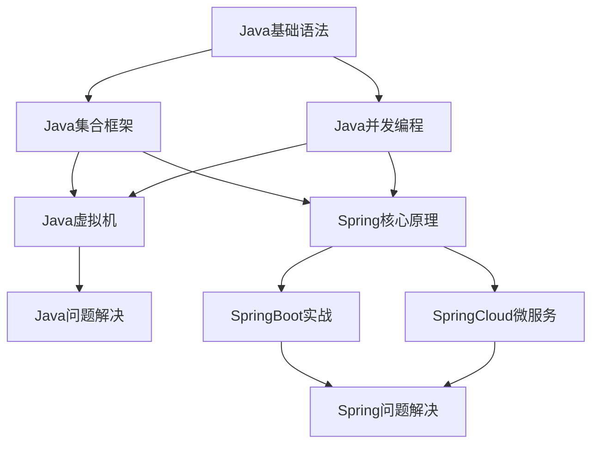

# 🔗 知识关联图

---
tags: [知识关联, 学习路径, 技术图谱]
created: 2026-02-21
updated: 2026-02-21
status: 知识图谱
importance: ⭐⭐⭐⭐⭐
---

## 🎯 核心技术关联图

### ☕ Java技术栈关联



### 🗄️ 数据存储技术关联


### 🌐 前端技术关联


### ⚙️ 基础设施关联


## 🛤️ 学习路径建议

### 🎓 初学者路径

1. **基础阶段**
   - [[Java基础语法]] → [[JavaScript核心概念]]
   - [[计算机网络]] → [[操作系统原理]]
   - [[数据结构与算法]]

2. **进阶阶段**
   - [[Java集合框架]] → [[MySQL基础原理]]
   - [[Spring核心原理]] → [[SpringBoot实战]]
   - [[React核心概念]] → [[JavaScript异步编程]]

3. **高级阶段**
   - [[Java并发编程]] → [[Java虚拟机]]
   - [[SpringCloud微服务]] → [[Redis实战应用]]
   - [[Docker核心概念]] → [[Kafka实战]]

### 🚀 项目实战路径

1. **Web开发全栈**
   - [[SpringBoot实战]] + [[React核心概念]]
   - [[MySQL性能优化]] + [[Redis实战应用]]
   - [[Nginx配置实战]] + [[Docker核心概念]]

2. **微服务架构**
   - [[SpringCloud微服务]] + [[消息队列原理]]
   - [[Kafka实战]] + [[Redis实战应用]]
   - [[Docker核心概念]] + [[性能优化实践]]

3. **性能优化专题**
   - [[Java虚拟机]] + [[MySQL性能优化]]
   - [[Redis实战应用]] + [[性能优化实践]]
   - [[Nginx配置实战]] + [[项目问题总结]]

## 🔍 问题解决路径

### 🚨 性能问题解决路径

```
遇到性能问题
    ↓
[[快速索引#问题速查]]
    ↓
具体问题类型判断
    ├── 内存问题 → [[Java问题解决#内存问题排查]]
    ├── 查询慢 → [[MySQL问题解决#查询性能优化]]
    ├── 接口超时 → [[Spring问题解决#接口性能问题]]
    └── 缓存问题 → [[Redis问题解决#缓存问题]]
    ↓
深入学习相关原理
    ├── [[Java虚拟机#垃圾回收机制]]
    ├── [[MySQL基础原理#索引实现原理]]
    ├── [[Spring核心原理#AOP实现原理]]
    └── [[Redis核心原理#五种数据类型]]
```

### 🔧 技术选型路径

```
技术选型需求
    ↓
[[快速索引#原理速查]]
    ↓
对比相关技术
    ├── 数据存储 → [[MySQL基础原理]] vs [[Redis核心原理]]
    ├── 消息队列 → [[消息队列原理]] vs [[Kafka实战]]
    ├── 前端框架 → [[React核心概念]] vs [[JavaScript核心概念]]
    └── 部署方案 → [[Docker核心概念]] vs [[Nginx配置实战]]
    ↓
查看实战应用
    └── [[项目问题总结]] + [[性能优化实践]]
```

## 📊 知识点关联统计

### 高关联度概念 (被引用次数 > 5)
- `HashMap原理` - 在Java集合、并发编程、问题解决中被引用
- `Spring IOC` - 在Spring核心、SpringBoot、微服务中被引用
- `MySQL索引` - 在基础原理、性能优化、问题解决中被引用
- `Redis缓存` - 在核心原理、实战应用、Spring集成中被引用
- `Docker容器` - 在容器化、微服务、部署实践中被引用

### 核心技术节点
- [[Java集合框架]] - 连接基础语法和并发编程
- [[Spring核心原理]] - 连接Java基础和企业级开发
- [[MySQL基础原理]] - 连接数据存储和性能优化
- [[Docker核心概念]] - 连接开发和部署运维

### 问题解决枢纽
- [[Java问题解决]] - 汇聚JVM、并发、集合相关问题
- [[Spring问题解决]] - 汇聚框架、配置、性能相关问题
- [[MySQL问题解决]] - 汇聚查询、索引、事务相关问题
- [[性能优化实践]] - 汇聚各技术栈的性能问题

## 🎯 使用建议

### 学习新技术时
1. 先查看 [[快速索引#原理速查]] 了解核心概念
2. 阅读对应的原理文档深入理解
3. 查看相关的实战应用文档
4. 遇到问题时查看问题解决文档

### 解决问题时
1. 使用 [[快速索引#问题速查]] 快速定位
2. 查看具体的问题解决文档
3. 如需深入理解，回到原理文档
4. 总结经验，更新到相关文档

### 技术复习时
1. 使用标签搜索相关内容：`tag:#重要`
2. 按照学习路径系统复习
3. 重点关注高关联度的核心概念
4. 定期查看问题解决文档保持敏感度

---

*创建时间：2026-02-21 | 最后更新：2026-02-21*