# IOT

# 时序数据库

## 基本概念

### 1. 时序数据、数据数据库、时序点

**时序数据**
随时间不断产生的一系列数据，每个数据都有时间戳。数据特点是写多读少，按时间排序写入。例如：服务器监控插件（每隔几秒采集服务信息）
**时序数据库**
用来存储这些数据，同时还支持对这些数据的搜索、筛选、处理。
**时序点**
每个时间点的数据，以 influxDB 举例：


- measurement（测量名称）类似数据库的表
- Tag Set（标签集）类似索引，用来分类，标记
- Field Set（字段集）类似于字段，用来存储数据
- Timestamp（时间戳）时间

> parking,name=1 num=50,remain=30 1698661720821
>
> 停车场,1号	总共 50 个停车位，剩余 30 个  时间戳

### 2. 与关系型数据库区别是什么

**存储结构不同**

关系型数据库数 B+ 树

时序数据库 LSM （日志结构合并树）树变种

**为什么不用 B+ 树？**

写入数据时，B+ 树可能会造成叶分裂，造成随机 IO ，降低写入性能。

单表特大量数据时，不及时分表，B+ 树层级变高了，查找的 IO 时间会变大。同时结合时序的特点，写多读少、几乎不会更新删除、一般只查询最近的数据、数据关联性小，B+ 树就不适合了。

### 3. LSM 结构

存储引擎 B-Tree、LSM、TDengine

LSM-Tree，全程为日志结构合并树

LSM树并没有一种固定死的实现方式，更多的是一种将：

“磁盘顺序写” + “多个树(状数据结构)” + “冷热（新老）数据分级” + “定期归并” + “非原地更新”这几种特性统一在一起的思想。

顺序写、顺序读，提升写入速度（牺牲部分查询速度）

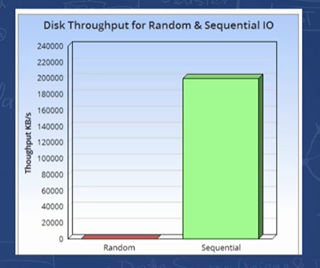


**LSM树的定义：**

1. LSM树是一个横跨内存和磁盘的，包含多颗"子树"的一个森林。
2. LSM树分为Level 0，Level 1，Level 2 ... Level n 多颗子树，其中只有Level 0在内存中，其余Level 1-n在磁盘中。
3. 内存中的Level 0子树一般采用排序树（红黑树/AVL树）、跳表或者TreeMap等这类有序的数据结构，方便后续顺序写磁盘。
4. 磁盘中的Level 1-n子树，本质是数据排好序后顺序写到磁盘上的文件，只是叫做树而已。
5. 每一层的子树都有一个阈值大小，达到阈值后会进行合并，合并结果写入下一层。
6. 只有内存中数据允许原地更新，磁盘上数据的变更只允许追加写，不做原地更新。

以上6条定义组成了LSM树，如图1所示。

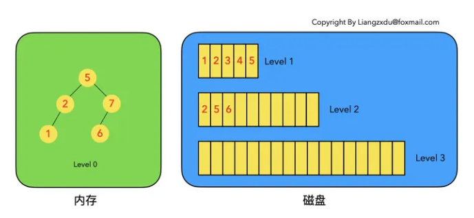

- 图1中分成了左侧绿色的内存部分和右侧蓝色的磁盘部分（定义1）。
- 图1左侧绿色的内存部分只包含Level 0树，右侧蓝色的磁盘部分则包含Level 1-n等多棵"树"（定义2）
- 图1左侧绿色的内存部分中Level 0是一颗二叉排序树（定义3）。注意这里的有序性，该性质决定了LSM树优异的读写性能。
- 图1右侧蓝色的磁盘部分所包含的Level 1到Level n多颗树，虽然叫做“树”，但本质是按数据key排好序后，顺序写在磁盘上的一个个文件（定义4） ，注意这里再次出现了有序性。
- 内存中的Level 0树在达到阈值后，会在内存中遍历排好序的Level 0树并顺序写入磁盘的Level 1。同样的，在磁盘中的Level n（n>0）达到阈值时，则会将Level n层的多个文件进行归并，写入Level n+1层。（定义5）
- 除了内存中的Level 0层做原地更新外，对已写入磁盘上的数据，都采用Append形式的磁盘顺序写，即更新和删除操作并不去修改老数据，只是简单的追加新数据。图1中右侧蓝色的磁盘部分，Level 1和Level 2均包含key为2的数据，同时图1左侧绿色内存中的Level 0树也包含key为2的数据节点。（定义6）

文章参考：https://zhuanlan.zhihu.com/p/415799237

### 4. 排名

排名参考：[DB-Engines Ranking - popularity ranking of time Series DBMS](https://db-engines.com/en/ranking/time+series+dbms)

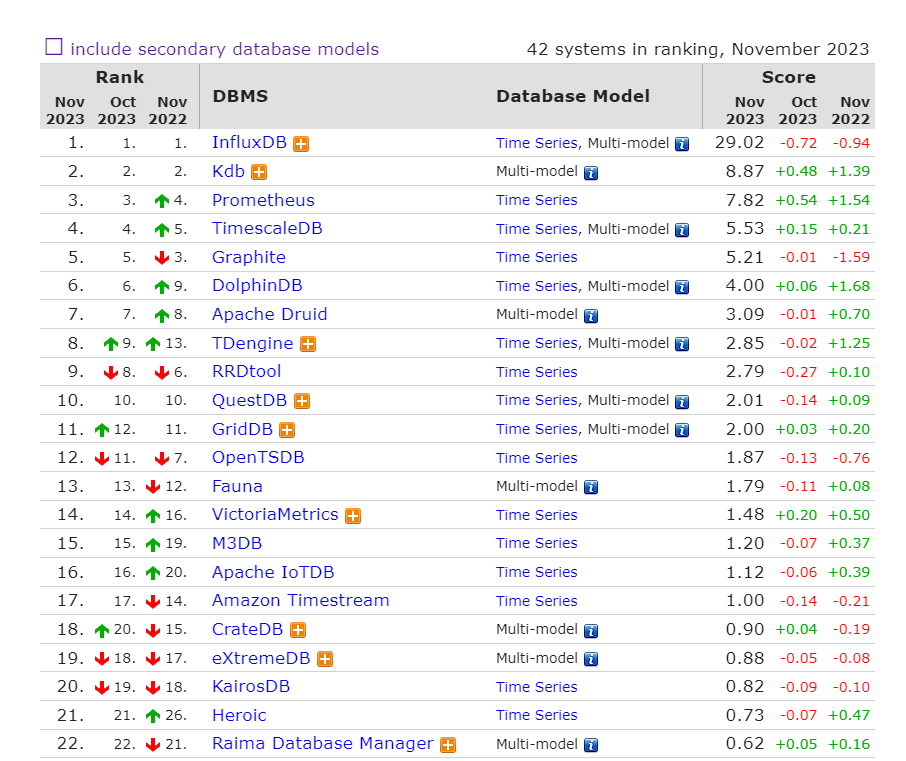

## 时序数据库 TDengine

官网：[TDengine 文档 | TDengine 文档 | 涛思数据](https://docs.taosdata.com/)

### 1. 简介

TDengine 是一款专为物联网、工业互联网等场景设计并优化的大数据平台，它能安全高效地将大量设备、数据采集器每天产生的高达 TB 甚至 PB 级的数据进行汇聚、存储、分析和分发，对业务运行状态进行实时监测、预警，提供实时的商业洞察。其核心模块是高性能、集群开源、云原生、极简的时序数据库 TDengine OSS。

### 2. 基本结构

时序数据：

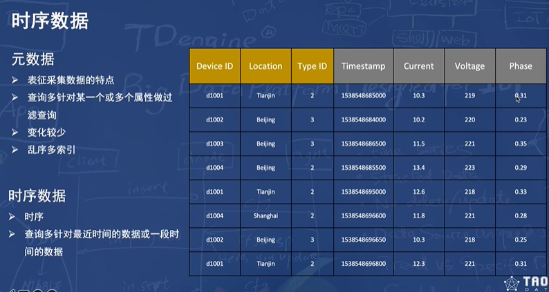

数据模型：

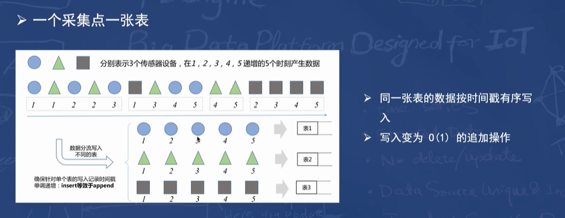

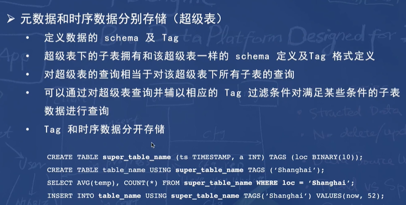

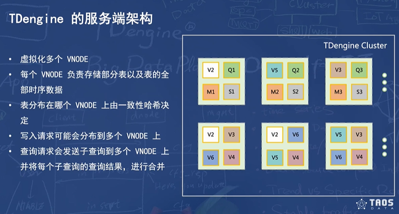

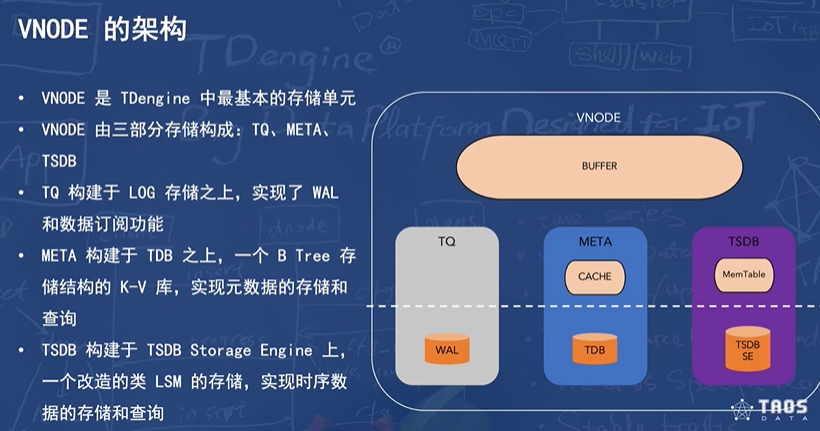

少表高频（采集高）

多表低频（采集低）

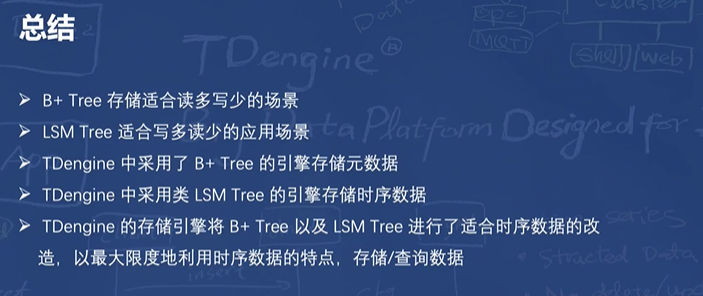

### 3. 安装

**docker 部署**

```
# 拉取镜像
docker pull tdengine/tdengine:latest
# 启动容器
docker run -d -p 6030:6030 -p 6041:6041 -p 6043-6049:6043-6049 -p 6043-6049:6043-6049/udp tdengine/tdengine
```

注意：TDengine 3.0 服务端仅使用 6030 TCP 端口。6041 为 taosAdapter 所使用提供 REST 服务端口。6043-6049 为 taosAdapter 提供第三方应用接入所使用端口，可根据需要选择是否打开。

**数据持久化**

```
docker run -d -v ~/data/taos/dnode/data:/var/lib/taos \
  -v ~/data/taos/dnode/log:/var/log/taos \
  -p 6030:6030 -p 6041:6041 -p 6043-6049:6043-6049 -p 6043-6049:6043-6049/udp tdengine/tdengine
```

/var/lib/taos: TDengine 默认数据文件目录。可通过[配置文件]修改位置。你可以修改~/data/taos/dnode/data为你自己的数据目录

/var/log/taos: TDengine 默认日志文件目录。可通过[配置文件]修改位置。你可以修改~/data/taos/dnode/log为你自己的日志目录

### 4. 使用

#### 4.1 命令行

进入容器

```
docker exec -it <container name> bash
```

执行 taos：

```
$ taos

taos>
```

#### 4.2 java 接入

pom 文件引入

```
<dependency>
    <groupId>com.taosdata.jdbc</groupId>
    <artifactId>taos-jdbcdriver</artifactId>
    <version>3.2.7</version>
</dependency>
```

原生方式连接需要下载 TDenginecli 

REST 方式连接

```
String jdbcUrl = "jdbc:TAOS-RS://1.117.230.226:6041?user=root&password=taosdata";
Connection conn = DriverManager.getConnection(jdbcUrl);
System.out.println("Connected");
conn.close();
```

#### 4.3 写入数据

```
package com.demo.td;

import com.taosdata.jdbc.SchemalessWriter;
import com.taosdata.jdbc.enums.SchemalessProtocolType;
import com.taosdata.jdbc.enums.SchemalessTimestampType;

import java.sql.Connection;
import java.sql.DriverManager;
import java.sql.SQLException;
import java.sql.Statement;

public class Demo {
    private static String[] lines = {
            // micro seconds
            "meters,location=California.LosAngeles,groupid=2 current=11.8,voltage=221,phase=0.28 1648432611249000",
            "meters,location=California.LosAngeles,groupid=2 current=13.4,voltage=223,phase=0.29 1648432611249500",
            "meters,location=California.LosAngeles,groupid=3 current=10.8,voltage=223,phase=0.29 1648432611249300",
            "meters,location=California.LosAngeles,groupid=3 current=11.3,voltage=221,phase=0.35 1648432611249800",
    };

    private static Connection getConnection() throws SQLException {
        String jdbcUrl = "jdbc:TAOS-RS://1.117.230.226:6041?user=root&password=taosdata";
        return DriverManager.getConnection(jdbcUrl);
    }


    private static void createDatabase(Connection conn) throws SQLException {
        try (Statement stmt = conn.createStatement()) {
            // the default precision is ms (millisecond), but we use us(microsecond) here.
            stmt.execute("CREATE DATABASE IF NOT EXISTS test PRECISION 'us'");
            stmt.execute("USE test");
        }catch (Exception e) {
            System.out.println(e.getMessage());
        }
    }


    public static void main(String[] args) throws SQLException {
        try (Connection conn = getConnection()) {
            System.out.println("连接完成");
            createDatabase(conn);
            System.out.println("创建库");
            SchemalessWriter writer = new SchemalessWriter(conn);
            writer.write(lines, SchemalessProtocolType.LINE, SchemalessTimestampType.MICRO_SECONDS);
            System.out.println("写入完成");
        } catch (Exception e) {
            System.out.println(e.getMessage());
        }
    }
}
```

#### 4.4 时序库查询数据

```
docker exec -it <> bash 
```

进入 容器

```
taos;
use test;
SELECT * FROM meters WHERE location = "California.LosAngeles" AND groupid = 2;
```

结果

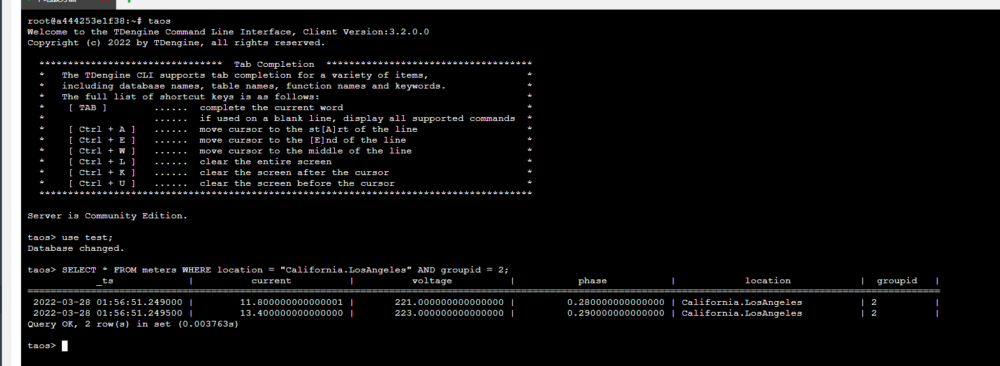

#### 4.5 idea 连接 TDengine

下载项目编译，生成 jdbc

```
git clone https://github.com/taosdata/taos-connector-jdbc.git
cd taos-connector-jdbc
mvn clean install -Dmaven.test.skip=true
```

[taos-jdbcdriver-3.2.7-dist.jar](./taos-jdbcdriver-3.2.7-dist.jar)

idea 连接

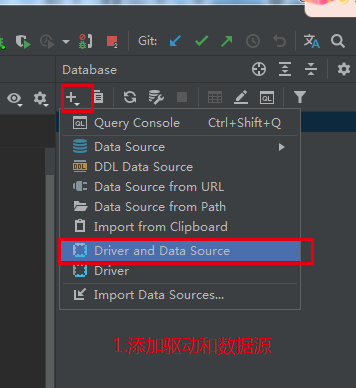

注意连接方式、库名

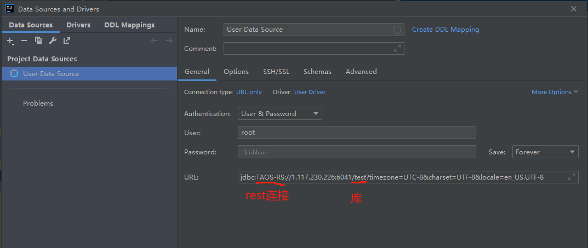

测试连接，配置 jdbc

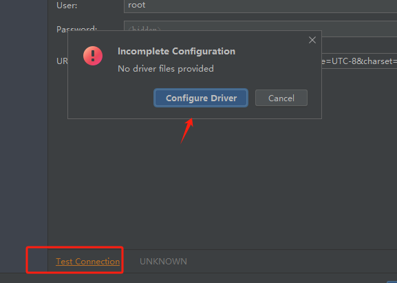

添加生成的 jar，选择 restful


点击完成，刷新数据库连接

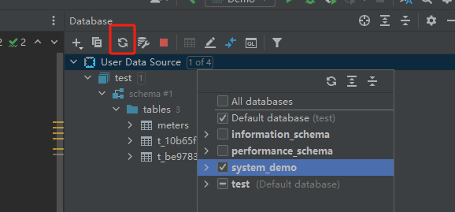

即可看到数据

### 5. TDengine-client

下载安装：https://docs.taosdata.com/connector/

默认安装 C 盘，点击 Taos Shell 启动

连接命令：

```
taos -h 1.117.230.226
```


### 6. telegraf 采集

需要提前准备好 TDengine 配置信息

```
db = system_demo
```

**telegraf 安装**

下载

```shell
wget https://dl.influxdata.com/telegraf/releases/telegraf-1.23.4_linux_amd64.tar.gz 
```

解压到目标路径

```shell
tar -zxvf telegraf-1.23.4_linux_amd64.tar.gz -C /root/influx
```

**配置文件生成**

```
# 打开到执行文件
cd /root/influx/telegraf-1.23.4/usr/bin
# 生成
./telegraf --sample-config --input-filter cpu:mem --output-filter http > telegraf.conf
```

**修改配置文件**

```
[[outputs.http]]
  ## URL is the address to send metrics to
  url = "http://127.0.0.1:6041/influxdb/v1/write?db=system_demo"
  method = "POST"
  username = "root"
  password = "taosdata"
  data_format = "influx"
```

**执行配置文件**

```
./telegraf --config telegraf.conf
```

TDengine 查看数据

```
taos

show databases;

use system_demo;

show tables;

select * from <table>; -- cpu diskio
```

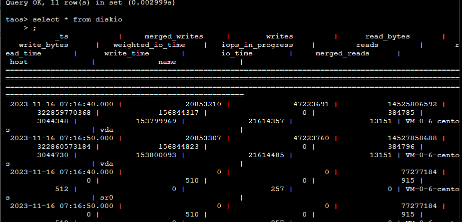

## 时序数据库 influxdb

### 1.简介

#### 1.1 influxdb

LSM 日志结构化合并树（非关系型B+树），主流版本：1.8 2.4

特点

时间维度写入数据

数据冷热分离

数据只写不改、不支持事务、不能删除

**为什么不用关系型数据库？**

虽然支持时间戳查询，但从实际场景来看写入性能，B+树添加数据会触发叶分裂，产生磁盘随机读写，降低速度。时序库一般是 LSM tree 变种，顺序写磁盘，通常保证：**单点每秒数十万的写入**

**TICK生态**

telegraf：数据采集组件，收集发送数据到 influxDB

influxDB：存储数据、发送数据到 Chronograf

Chronograf：总的用户页面，总管理（2.0 后 influx 自带）

Kapacitor：后台处理报警信息，定时任务等（2.0 后 influx 自带）

#### 1.2 Telegraf 

一个数据采集组件，很多时序数据库都支持与 Telegraf 进行协作，不少类似的时序数据收集组件选择在 Telegraf 的基础上二次开发。如:有很多的服务器,每个服务器上都有一个 Telegraf 服务采集服务器的各项数据。InfluxDB 会对外暴露一个 URL，各个 Telegraf 就可以向这个 URL 提交数据,直接写入 InfluxDB 中保存

### 2. 安装

#### 2.1 influxDB

docker 安装

```sh
docker run --name influxdb -p 8086:8086 influxdb:2.4.0
```
1.数据持久化到外部容器

```sh
mkdir path/to/influxdb-docker-data-volume && cd $_

docker run \
    --name influxdb \
    -p 8086:8086 \
    --volume $PWD:/var/lib/influxdb2 \
    influxdb:2.4.0
```

2.配置文件形式启动

1. 使用以下命令在主机文件系统上生成默认配置文件：

```shell
docker run --rm influxdb:2.4.0 influx server-config > config.yml
```

1. 修改默认配置,改配置现在将在当前目录下可用
2. 根据配置文件配置启动容器

```shell
docker run -p 8086:8086 \
  -v $PWD/config.yml:/etc/influxdb2/config.yml \
  influxdb:2.4.0
```

### 3. 使用

访问地址：127.0.0.1:8086 初次进入需要初始化

数据桶：存储数据

#### 3.1 导入数据

文件（CSV、fluxCSV、行协议）、客户端（java、python、node等）、插件（ActiveMQ、Kafka等）

行协议：每条数据用换行符分隔，由 4 种元素组成


parking,name=1 num=50,remain=30 1698661720821

停车场,1号	总共 50 个停车位，剩余 30 个  时间戳

时间戳可省略，自动填入插入时间

#### 3.2 Telegraf 采集数据

安装完成后，配置环境变量：

```shell
export INFLUX_TOKEN=aYC-5cMvRBzpTL8lSkQ5VaQ2zZvfwfrd_zBSH86ddcXEd1U9e83mqIa3qlq3lE-Y4YHd0lxAwpxdaOjjYQWsIQ==
```

到目录执行命令 （/root/influx/telegraf-1.23.4/usr/bin）

```shell
./telegraf --config http://1.117.230.226:8086/api/v2/telegrafs/0c0c1143646c9000
```

启动成功，每隔 10s 插入数据


#### 3.3 Scrapers 抓取数据

### 4. influx 数据存储

### 5. flux 语言

图形化查询：data explorer、notebooks 模块

Flux 是一种函数式的数据脚本语言，它旨在将查询、处理、分析和操作数据统一为一种语法。

例子：

```shell
from(bucket: "example-bucket") 
	|> range(start: -1d) 
	|> filter(fn: (r) => r._measurement == "example-measurement") 
	|> mean() 
	|> yield(name: "_results") 
```

1. from( )函数可以指定数据源。
2. | > 管道转发符，将一个函数的输出转发给下一个函数。
3. range( )，fliter( ) 两个函数在根据列的值对数据进行过滤
4. mean( )函数在计算所剩数据的平均值。
5. yield( ) 将最终的计算结果返回给用户。

flux 语言版本与 influx 支持关系

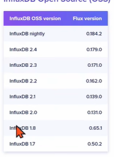

#### 编辑器


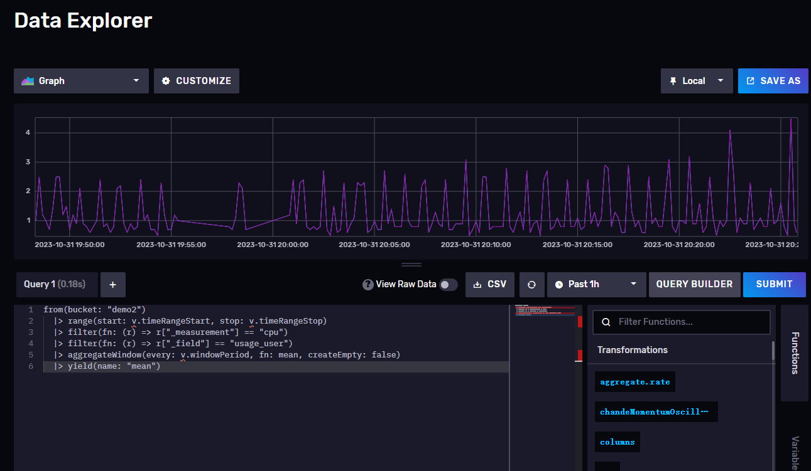

#### 基础数据类型

##### 1. Boolean （布尔型）

```
布尔类型只包括:true false
```

**将以下的4 个基本数据类型转换为 boolean**：

1. string（字符串）：字符串必须是 "true" 或 "false"
2. float（浮点数）：值必须是 0.0（false）或 1.0（true）
3. int（整数）：值必须是 0（false）或 1（true）
4. uint（无符号整数）：值必须是 0（false）或 1（true）示例：

```go
bool(v: "true") 	 // Returns true    
bool(v: 0.0) 		 // Returns false     
bool(v: 0) 			 // Returns false    
bool(v: uint(v: 1))   // Returns true   
```

##### 2. **bytes** （字节序列）

**注意是 bytes（复数）不是 byte，bytes 类型表示一个由字节组成的序列。**

**2.1 定义 bytes**

```
FLUX 没有提供关于 bytes 的语法。可以使用 bytes 函数将字符串转为 bytes,InfluxDB底层不支持字节类型
bytes(v:"hello")    // Returns [104 101 108 108 111] 
注意：只有字符串类型可以转换为 bytes。
```

**2.2 将表示十六进制的字符串转为 bytes**

1. 引入"contrib/bonitoo-io/hex"包
2. 使用 hex.bytes() 将表示十六进制的字符串转为 bytes

```go
import "contrib/bonitoo-io/hex" 

hex.bytes(v: "FF5733") // Returns [255 87 51] (bytes) 
```

**2.3 使用 display( )函数获取 bytes 的字符串形式**

```
使用 display( )返回字节的字符串表示形式。bytes 的字符串表示是 0x 开头的十六进制表示。
// 基本使用
a = "abc"
b = bytes(v:a)
c = dispaly(v:b)

// 高级使用
import "sampledata" 

sampledata.string() 
|> map(fn: (r) => ({r with _value: display(v: bytes(v: r._value))}))  
```


##### 3. Duration 持续时间

持续时间提供了纳秒级精度的时间长度。

**3.1 语法**

```go
1ns // 1 纳秒 
1us // 1 微妙 
1ms // 1 毫秒 
1s // 1 秒 
1m // 1 分钟 
1h // 1 小时 
1d // 1 天 
1w // 1 星期 
1mo // 1 日历月 
1y // 1 日历年 
3d12h4m25s // 3天12小时4分钟又25秒 
```

**注意: 持续时间的声明不要包含先导 0**

```go
01m 	// 解析为整数0和1分钟的持续时间 

02h05m  //解析为整数0、2小时的持续时间，整数0和5分钟的持续时间。而不是2 小时又5分钟 
```

**3.2 将其他数据类型解释为持续时间**

```
使用 duration( )函数可以将以下基本数据类型转换为持续时间字符串：将表示持续时间字符串的函数转换为持续时间。
```

1. int：将整数先解释为纳秒再转换为持续时间
2. unit：将整数先解释为纳秒再转换为持续时间。

```go
duration(v: "1h30m")   // Returns 1h30m    
duration(v: 1000000)   // Returns 1ms      
duration(v: uint(v: 3000000000))   // Returns 3s   
注意！你可以在 FLUX 语言中使用 duration 类型的变量与时间做运算，但是你不能在 table 中创建 duration 类型的列。
```

**3.3 duration的算术运算**

```
要对 duration 进行加法、减法、乘法或除法操作，需要按下面的步骤来。
```

1. 使用 int( )或 unit()将持续时间转换为 int 数值
2. 使用算术运算符进行运算
3. 把运算的结果再转换回 Duration 类型示例：

```go
duration(v: int(v: 6h4m) + int(v: 22h32s))   // 返回 1d4h4m32s 

duration(v: int(v: 22h32s) - int(v: 6h4m))   // 返回 15h56m32s 

duration(v: int(v: 32m10s) * 10)             // 返回 5h21m40s 

duration(v: int(v: 24h) / 2)                 // 返回 12h 
注意！声明持续时间的时候不要包含前导 0，前面的零会被 FLUX 识别为整数
```

**3.4 时间和持续时间相加运算**

1. 导入 date 包
2. 使用 date.add( )函数将持续时间和时间相加示例：

```go
import "date" 

date.add(d: 1w, to: 2021-01-01T00:00:00Z) // 2021-01-01加上一周 

// Returns 2021-01-08T00:00:00.000000000Z 
```

**3.5 时间和持续时间相减运算**

1. 导入 date 包
2. 使用 date.add( )函数从时间中减去持续时间示例：

```go
mport "date" 

 

date.sub(d: 1w, from: 2021-01-01T00:00:00Z)   // 2021-01-01 减去一周 

// Returns 2020-12-25T00:00:00.000000000Z 
```

##### 4. Regular expression 正则表达式

**4.1 定义一个正则表达式**

FLUX 语言是 GO 语言实现的，因此使用 GO 的正则表达式语法。正则表达式需要声明在正斜杠之间 / /

**4.2 使用正则表达式进行逻辑判断使用正则表达式进行逻辑判断**

需要使用 =~ 和 != 操作符。=~ 的意思是左值（字符串）能够被右值匹配，!~表示左值（字符串）不能被右值匹配。

```go
"abc" =~ /\w/  // Returns true 
 
"z09se89" =~ /^[a-z0-9]{7}$/  // Returns true 

"foo" !~ /^f/       // Returns false 

"FOO" =~ /(?i)foo/   // Returns true 
```

**4.3 将字符串转为正则表达式**

1. 引入 regexp 包
2. 使用 regexp.compile( ) 函数可以将字符串转为正则表达式

```go
import "regexp" 

regexp.compile(v: "^- [a-z0-9]{7}") // Returns ^- [a-z0-9]{7} (regexp type) 
```

**4.4 将匹配的子字符串全部替换**

1. 引入 regexp 包
2. 使用 regexp.replaceAllString( )函数，并提供下列参数：
   1. r：正则表达式
   2. v：要搜索的字符串
   3. t： 一旦匹配，就替换为该字符串示例：

```go
import "regexp" 

regexp.replaceAllString(r: /a(x*)b/, v: "-ab-axxb-", t: "T") // Returns "-T-T-" 
```

**4.5 得到字符串中第一个匹配成功的结果**

1. 导入 regexp 包
2. 使用 regexp.findString( )来返回正则表达式匹配中的第一个字符串，需要传递以下参数：
   1. r：正则表达式
   2. v：要进行匹配的字符串示例：

```go
import "regexp" 

regexp.findString(r:"abc|bcd",v:"xxabcwwed")  // Returns "abc" 
```

##### 5. String 字符串

**5.1 定义一个字符串**

字符串类型表示一个字符序列。字符串是不可改变的，一旦创建就无法修改。

```
字符串是一个由双引号括起来的字符序列，在 FLUX 中，还支持你用\x 作为前缀的十六进制编码来声明字符串。
"abc" 

"string with double \" quote" 

"string with backslash \\" 

"日本語" 

"\xe6\x97\xa5\xe6\x9c\xac\xe8\xaa\x9e"
```

**5.2 将其他基本数据类型转换为字符串使用 srting( )函数可以将下述基本类型转换为字符串：**

| boolean  | 布尔值     |
| -------- | ---------- |
| bytes    | 字节序列   |
| duration | 持续时间   |
| float    | 浮点数     |
| uint     | 无符号整数 |
| time     | 时间       |

```go
string(v: 42) 	 // 返回 "42" 
```

**5.3 将正则表达式转换为字符串**

```
因为正则表达式也是一个基本数据类型，所以正则表达式也可以转换为字符串，但是需要借助额外的包。
```

1. 引入 regexp 包
2. 使用 regexp.compile( )

##### 6. Time 时间点

**6.1 定义一个时间点**

```
一个 time 类型的变量其实是一个纳秒精度的时间.
```

示例：**时间点必须使用 RFC3339 的时间格式进行声明**

```go
YYYY-MM-DD 

YYYY-MM-DDT00:00:00Z       

YYYY-MM-DDT00:00:00.000Z    // 毫秒级
```

**6.2 时间戳转成UTC格式**

```go
a = time(v:1664401985000*1000*1000)   // v接收纳秒级的时间戳
```

**6.3 UTC时间转成时间戳**

```go
a = uint(v:2023-09-19T00:00:00.000Z)   // 得到的同样是纳秒级的时间戳
```

##### 7. Float 浮点数

**7.1 定义一个浮点数**

```
FLUX 中的浮点数是 64 位的浮点数。一个浮点数包含整数位，小数点，和小数位。
0.0 

123.4 

-123.456 
```

**7.2 科学计数法**

```
FLUX 没有直接提供科学计数法语法，但是你可以使用字符换写出一个科学计数法表示的浮点数，再使用 float( )函数将该字符串转换为浮点数。
1.23456e+78  	 // Error: error @1:8-1:9: undefined  identifier e      
float(v: "1.23456e+78") // Returns 1.23456e+78  (float)   e+78表示 1.23456的78次方
```

**7.3 无限大的整数**

```
FLUX 也没有提供关于无限的语法，定义无限要使用字符串与 float( )函数结合的方式。
+Inf   // Error: error @1:2-1:5: undefined  identifier Inf      

float(v: "+Inf") // Returns +Inf (float)   
```

**7.4 Not a Number 非数字**

```
FLUX 语言不支持直接从语法上声明 NAN，但是你可以使用字符串与 float( )函数的方法声明一个 NaN 的 float 类型变量。
NaN   // Error: error @1:2-1:5: undefined identifier NaN 

float(v: "NaN") // Returns NaN (float) 
```

**7.5 将其他基本类型转换为 float**

```
使用 float 函数可以将基本数据类型转换为 float 类型的值。 string：必须得是一个符合数字格式的字符串或者科学计数法。
bool：true 转换为 1.0，false 转换为 0.0 int（整数） uint（无符号整数：
float(v: "1.23")   // 1.23 
float(v: true)  // Returns 1.0    
float(v: 123) //  Returns 123.0   
```

**7.6 对浮点数进行逻辑判断**

```
使用 FLUX 表达式来比较浮点数。逻辑表达式两侧必须是同一种类型。
12345600.0 == float(v: "1.23456e+07")    // Returns true 

1.2 > -2.1 // Returns true 
```

##### 8. Integer 整数

**8.1 定义一个整数**

```
一个 integer 的变量是一个 64 位有符号的整数。
类型名称：int
最小值：-9223372036854775808 最大值：9223372036854775807
一个整数的声明就是普通的整数写法，前面可以加 - 表示负数。-0 和 0 是等效的。
0 

2 

1254 

-1254 
```

**8.2 将数据类型转换为整数**

使用 int( )函数可以将下述的基本类型转换为整数：

1. string：字符串必须符合整数格式，由数字[0-9]组成
2. bool：true 返回 1，0 返回 false
3. duration：返回持续时间的纳秒数
4. time：返回时间点对应的 Unix 时间戳纳秒数 float：返回小数点前的整数部分，也就是截断
5. unit：返回等效于无符号整数的整数，如果超出范围，就会发生整数环绕

```go
int(v: "123")   // 123 
int(v: true) //  Returns 1      
int(v: 1d3h24m)   // Returns 98640000000000    
int(v:  2021-01-01T00:00:00Z) // Returns 1609459200000000000    
int(v: 12.54) //  Returns 12   
你可以在将浮点数转换为整数之前进行舍入操作。 当你将浮点数转换为整数时，会进行截断操作。如果你想进行四舍五入，可以使用 math 包中的 round( )函数。
```

**8.3 将表示十六进制数字的字符串转换为整数**

将表示十六进制数字的字符串转换为整数，需要。

1. 引入 contrib/bonito-io/hex 包
2. 使用 hex.int( )函数将表示十六进制数字的字符串转换为整数

```go
import  "contrib/bonitoo-io/hex"    

hex.int(v:  "e240") 	// Returns 123456   
```

##### 9. UIntegers 无符号整数

```
FLUX 语言里不能直接声明无符号整数，但这却是一个 InfluxDB 中具备的类型。在 FLUX 语言中，我们需要使用 uint 函数来讲字符串、整数或者其他数据类型转换成无符号整数。
uint(v: "123")   	// 123 
uint(v: true)   	// Returns 1      
uint(v: 1d3h24m)    // Returns 98640000000000    
uint(v:  2021-01-01T00:00:00Z) // Returns 1609459200000000000    
uint(v: 12.54)      // Returns 12      
uint(v: -54321)     // Returns 18446744073709497295  
unit(v:"9223372036854775808")   // int的最大值为9223372036854775807,如果这里v传的是整数型的9223372036854775808,会因为超过了int的最大值而报错,所以用字符串传参
```

##### 10. Null 空值

**10.1 定义一个 Null 值**

```
FLUX 语言并不能在语法上直接支持声明一个 Null，注意！空字符串不是 null 值 ,但是我们可以通过 debug.null 这个函数来声明一个指定类型的空值。
import "internal/debug" 

debug.null(type: "string") // Return a null string 
debug.null(type: "int")    // Return a null integer 
debug.null(type: "bool")   // Return a null boolean 
```

**10.2 判断值是否为 null**

```
你可以使用 exists（存在）这个关键字来判断目标值是不是非空，如果是空值我们会得到一个 false，如果不是空值我们会得到一个 true。
import "array" import "internal/debug" 

x = debug.null(type: "string") 
y = exists x // Returns false 
```

##### 11. 正则表达式类型

```
正则表达式在 FLUX 中作为一种数据类型，而且在语法上提供直接的支持，可以在谓词表达式中使用正则表达式。
regex = /^foo/ 

"foo" =~ regex  // Returns true 
"bar" =~ regex  // Returns false 
```

##### 12. display 函数

```
使用 display( )函数可以将任何类型的值输出为相应的字符串类型。
x = bytes(v: "foo") 

display(v: x) // Returns "0x666f6f" 
```

####  复合类型

##### 1. Record（记录）

**1.1 Record 定义**

```
一个记录是一堆键值对的集合，其中键必须是字符串，值可以是任意类型，在键上没有空白字符的前提下，键上的双引号可以省略。在语法上，record 需要使用{}声明，键值对之间使用英文逗号（,）分开。另外，一个Record 的内容可以为空，也就是里面没有键值对
{foo: "bar", baz: 123.4, quz: -2} 
 
{"Company Name": "ACME", "Street Address": "123 Main St.", id: 1123445} 
```

**1.2 Record 取值**

1. 点表示法 取值

   `如果 key 中没有空白字符，那么你可以使用 .key 的方式从 record 中取值.`

   ```go
   c = {name: "John Doe", address: "123 Main St.", id: 1123445} 
   
   c.name     // Returns John Doe 
   c.id       // Returns 1123445
   ```

2. 中括号方式取值

   `可以使用[" "]的方式取值，当 key 中有空白字符的时候，也只能用这种方式来取值。`

   ```go
   c = {"Company Name": "ACME", "Street  Address": "123 Main St.", id: 1123445}    
   
   c["Company  Name"]   // Returns ACME    
   c["id"]   		    // Returns 1123445   
   ```

3. 嵌套与链式取值

   `Record 类型可以进行嵌套引用。从嵌套的 Record 中引用值的时候可以采用链式调用的方式。链式调用时，点表示法和中括号还可以混用。但是不能当做第二层record不能当做记录存储在InfluxDB中 ,可以将整体转成json再存储`

   ```go
   customer =   {   
       name: "John  Doe",     
       address: {   
           street: "123 Main  St.",       
           city:  "Pleasantville",        
           state: "New York"         
       }     
   } 
   
   
   customer.address.street 	   // Returns 123 Main  St.    
   customer["address"]["city"]    // Returns Pleasantville    
   customer["address"].state      // Returns New York   
   ```

**1.3 Record 的 key 是静态的**

```
record 类型变量中的 key 是静态的，一旦声明，其中的 key 就被定死了。一旦你访问这个 record 中一个没有的 key，就会直接抛出异常。正常的话应该返回 null。
o = {foo: "bar", baz: 123.4} 

o.key     // Error: type error: record is missing label haha 

b = "foo"
o[b]     // 错误,禁止使用变量来访问Record的值
```

**1.4 Records常用操作方法**

1. 拓展一个 **Record**

   `使用 with 操作符可以拓展一个 record，当原始的 record 中有这个 key 时，原先 record 的值会被覆盖；如果原先的 record 中没有制定的 key，那么会将旧 record 中的所有元素和 with 中指定的元素复制到一个新的 record 中。`

   ```go
   // 覆盖原先的值，并添加一个 key 为 pet，value 为"Spot"的元素
   c = {name: "John Doe", id: 1123445} 
   
   {c with name: "Xiao Ming", pet: "Spot"}     // Returns {id: 1123445, name: Xiao Ming, pet: Spot} 
   ```

   

2. 列出 **Record** 的所有keys

   1. 导入 experimental（实验的）包。

   2. 使用 expertimental.objectyKeys(o:c)方法来拿到一个 record 的所有 key。

      ```go
      import "experimental" 
      
       c = {name: "John Doe", id: 1123445} 
      
       experimental.objectKeys(o: c)  // Returns [name, id] 
      ```

3. 比较两个 **Record** 是否相等

   `可以使用双等号= =来判断两个 record 是否相等。如果两个 record 的每个 key，每个key 对应的 value 和类型都相同，那么两个 record 就相等.`

   ```go
   {id: 1, msg: "hello"} == {id: 1, msg: "goodbye"}     // Returns false 
   
   {foo: 12300.0, bar: 34500.0} == {bar: float(v: "3.45e+04"), foo: float(v: "1.23e+04")} // Returns true 
   ```

4. 将 **Record** 转为字符串

   `使用 display( )函数可以将 record 转为字符串。`

   ```go
   x = {a: 1, b: 2, c: 3} 
   
   display(v: x)     // Returns "{a: 1, b: 2, c: 3}" 
   ```

**1.5 嵌套 Record 的意义**

```
注意，嵌套的 Record 无法放到 FLUX 语言返回的表流中，这个时候会发生类型错误，它会说 Record 类型不能充当某一列的类型。那 FLUX 为什么还支持对 Record 进行嵌套使用呢？其实这是为了一些网络通讯的功能来服务，在 FLUX 语言中我们有一个 http 库。借助这个函数库，我们可以向外发送 http post 请求，而这种时候我们就有可能要发送嵌套的 json。细心的同学可能发现，我们的 record 在语法层面上和 json 语法是统一的，而且 FLUX 语言提供了一个 json 函数库，借助这个库中的 encode 函数，我们可以轻易地将一个record 转为 json 字符串然后发送出去。
```

##### 2. Array（数组）

**2.1 Array定义**

```
Array 是一个由相同类型的值构成的有序序列。 在语法上，数组是用方括号[ ]起来的一堆同类型元素，元素之间用英文逗号( , )分隔，并且类型必须相同。
["1st", "2nd", "3rd"] 

[1.23, 4.56, 7.89] 

[10, 25, -15] 
```

**2.2 Array 取值**

```
可以使用中括号 [ ] 加索引的方式从数组中取值，数组索引从 0 开始
arr = ["one",  "two", "three"]   

arr[0]   // Returns one    
arr[2]   // Returns two   
```

**2.3 判断数组相等**

```go
a = [1,2,3]
b = [2,3,1]
a == b      // false


a = [1,2,3]
b = [1,2,3]
a == b      // true
```

**2.4 检查一个数组中是否包含某元素**

```
使用 contains( )函数可以检查一个数组中是否包含某个元素。
names = ["John", "Jane", "Joe", "Sam"] 

contains(value: "Joe", set: names) 	  // Returns true 
```

##### 3. **Dictionary**（字典）

**3.1 字典定义**

```
字典和记录很像，但是 key-value 上的要求有所不同。 一个字典是一堆键值对的集合，其中所有键的类型必须相同，且所有值的的类型必须相同。 在语法上，dictionary 需要使用方括号[ ]声明，键的后面跟冒号（:）键值对之间需要使用英文逗号（ , ）分隔。
[0: "Sun", 1:  "Mon", 2: "Tue"]    

["red": "#FF0000", "green":  "#00FF00", "blue": "#0000FF"]   

[1.0: {stable: 12, latest: 12}, 1.1:  {stable: 3, latest: 15}]   
```

**3.2 字典取值**

1. 导入 dict 包
2. 使用 dict.get( )并提供下述参数:
   1. **dict**：要取值的字典
   2. **key**：要用到的 key
   3. **default**：默认值，如果对应的 key 不存在就返回该值

```go
import "dict"    
positions = [ 
    "Manager": "Jane Doe",
    "Asst. Manager": "Jack Smith",
    "Clerk": "John Doe",
]   

a = "Manager"
dict.get(dict: positions, key:  a, default: "Unknown position")   	      // 可以使用变量取值
dict.get(dict: positions, key:  "Manager", default: "Unknown position")   // Returns Jane Doe
dict.get(dict: positions, key:  "Teller", default: "Unknown position")    // Returns Unknown position 
```

**3.3 从列表创建字典**

1. 导入 dict 包
2. 使用 dict.fromList( )函数从一个由 records 组成的数组中创建字典。其中，数组中的每个 record 必须是{key:xxx,value:xxx}形式

```go
import "dict"      
list = [{key: "k1", value:  "v1"}, {key: "k2", value: "v2"}]    

dict.fromList(pairs:  list) 	// Returns [k1: v1, k2: v2]   
```

**3.4 向字典中插入键值对**

1. 导入 dict 包
2. 使用 dict.insert( )函数添加一个新的键值对，如果 key 早就存在，那么就会覆盖这个 key 对应的 value。

```go
import "dict" 

exampleDict = ["k1": "v1", "k2": "v2"] 

dict.insert(dict: exampleDict, key: "k3 ", value: "v3") // Returns [k1: v1, k2: v2, k3: v3] 
```

**3.5 从字典中移除键值对**

1. 引入 dict 包
2. 使用 dict.remove 方法从字典中删除一个键值对示例：

```go
import "dict" 

exampleDict = ["k1": "v1", "k2": "v2"] 

dict.remove(dict: exampleDict, key: "k2")     // Returns [k1: v1] 
```

##### 4. **function**（函数）

**4.1 函数声明**

```
一个函数是使用一组参数来执行操作的代码块。函数可以是命名的，也可以是匿名的。在小括号( )中声明参数，并使用箭头=>将参数传递到代码块中。
square = (n) => n * n    

square(n:3) 	// Returns  9   

// FLUX 不支持位置参数。调用函数时，必须显示指定参数名称。

chengfa =(x,y)=>{
    return x*y     // 如果是{}这种代码块,就必须有返回值
}
b = chengfa(x:10,y:48)


// 闭包
getChengfa = ()=>{
   chengfa =(x,y)=> x*y
   return chengfa
}
b = getChengfa()(x:10,y:48)
```

**4.2 为函数提供默认值**

```
我们可以为某些函数指定默认值，如果为函数指定了默认值，也就意味着在调用这个函数时，有默认值的函数时非必须的。
chengfa = (a,b=100) => a * b

chengfa(a:3)   // Returns 300
```

**4.3 函数包导入**

```
Flux 的标准库使用包组织起来的。包将 Flux 的众多函数分门别类，默认情况下加载 universe 包，这个包中的函数可以不用 import 直接使用。其他包的函数需要在你的 Flux 脚本中先用 import 语法导入一下。
import "array" 
import "math"   
import  "influxdata/influxdb/sample"   

//  但是，截至目前，虽然你可以自定义函数，但是你无法自定义包。如果希望将自己的自定义函数封装在一个包里以供复用，那就必须从源码上进行修改。 
```

#### 常用包

##### 1. date (操作时间的包)

```
提取年月日秒等信息的。
import "date" 

a = 2020-01-01T19:22:31Z 

date.year(t:a) 			// 年
m = date.yearDay(t: a)   // 一年的第多少天
date.month(t:a) 		// 月
date.monthDay(t:a) 		// 日
date.weekDay(t: a)  	// 这个月的第几周
date.hour(t:a) 			// 时
date.minute(t:a) 		// 分
date.second(t:a)    	// 秒
date.quarter(t: a)      // 季度
时间相加
import "array"
import "date"
a = 2023-09-19T17:00:00Z
b = 2h
b1 = -2h

c = date.add(d: b, to: a)
c1 = date.add(d: b1, to: a)

array.from(rows: [{"a":c}])
```

##### 2.now()

```
获取当前时间
t = now()
```

##### 3.strings(操作字符串的包)

##### Flux类型不代表InfluxDB类型

```
`需要注意，FLUX 语言里有些基本数据类型比如持续时间(Duration)和正则表达式是不能放在表流里面充当字段类型的。简单来说，Duration 类型和正则表达式类型都是 FLUX 语言特有的。有些类型是为了让 FLUX 在编写代码时更加方便，让它能够拥有更多的特性，但这并不代表这些类型能够存储到 InfluxDB 中。 `
```

### 6. java 接入

pom 导入

```
<dependency>
<groupId>com.influxdb</groupId>
<artifactId>influxdb-client-java</artifactId>
<version>6.5.0</version>
</dependency>
```

创建连接

```
//参数
private static String token = "ltJc6ab2Rkm0y80dCjnn4L58EvCr3VVjDTY-55PSOQGyCHWqtT7K_6Y0MK6ia9iZLSYiw0ZBw4ayc8FrtNa-PA==";
private static String bucket = "java02";
private static String org = "at";
private static String url = "http://1.117.230.226:8086";

InfluxDBClient client = InfluxDBClientFactory.create(url, token.toCharArray(), org, bucket);
```

同步写

```
// 同步写对象
WriteApiBlocking writeApiBlocking = client.getWriteApiBlocking();

// 行协议写入
writeApiBlocking.writeRecord(WritePrecision.MS, "temperature,location=north value=22");

// point对象写入
Point point = Point.measurement("temperature").addTag("location", "west").addField("value", 13.8);
writeApiBlocking.writePoint(point);

// 实体类写入
DemoPOJO demoPOJO = new DemoPOJO("temperature", "east", 38.3, Instant.now());
// 可以直接在类上标注 measurement
DemoPOJO demoPOJO = new DemoPOJO("east", 33.3, Instant.now());

writeApiBlocking.writeMeasurement(WritePrecision.MS, demoPOJO);

// 写完关闭
client.close();
```

DemoPOJO 对象

Measurement 可以定义在类上，也可以写在字段中

```
package com.influx.demo;

import com.influxdb.annotations.Column;
import com.influxdb.annotations.Measurement;

import java.time.Instant;

@Measurement(name = "temperature")
public class DemoPOJO {
//    @Column(measurement = true)
//    String measurement;

    @Column(tag = true)
    String location;

    @Column
    Double value;

    @Column(timestamp = true)
    Instant timestamp;

//    public DemoPOJO(String measurement, String location, Double value, Instant timestamp) {
//        this.measurement = measurement;
//        this.location = location;
//        this.value = value;
//        this.timestamp = timestamp;
//    }


    public DemoPOJO(String location, Double value, Instant timestamp) {
        this.location = location;
        this.value = value;
        this.timestamp = timestamp;
    }
}
```


异步写

```
InfluxDBClient client = InfluxDBClientFactory.create(url, token.toCharArray(), org, bucket);
// 异步写对象
// 可配置选项
WriteOptions options = WriteOptions.builder()
        // 999条 或者 10s 刷入数据 自动触发
        .batchSize(999).flushInterval(10000)
        .build();
WriteApi writeApi = client.makeWriteApi(options);
//        for (int i = 0; i < 999; i++) {
//            writeApi.writeRecord(WritePrecision.MS, "temperature,location=south value=1" + i);
//        }

// 因为是异步 需要手动刷新缓冲区才会主动提交
writeApi.flush();
// close 也会进行刷新
/client.close();
```


