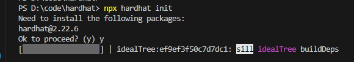
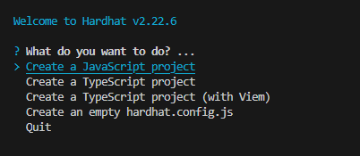
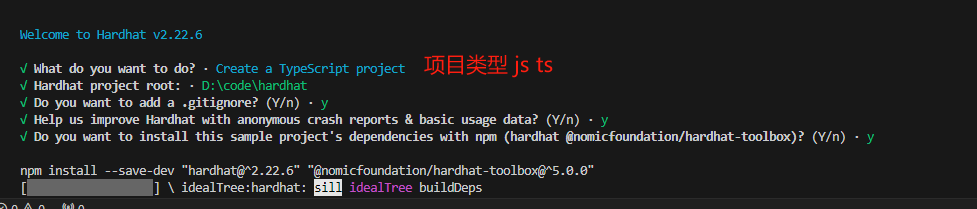
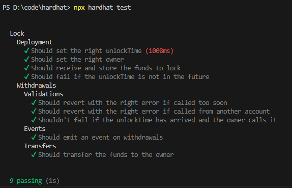
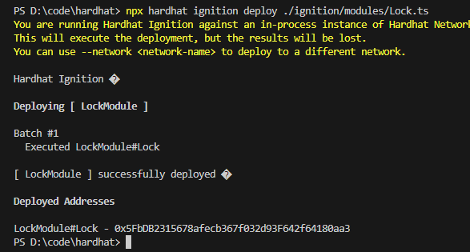
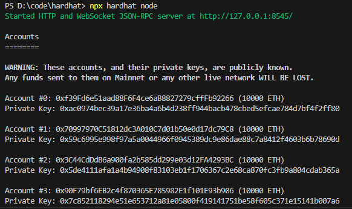

## hardhat

### 基本

基于 JavaScript、solidity 的开发框架，实现编译、部署、测试、开原和调试以太坊应用的开发环境。

官网文档

https://hardhat.org

快速开发

https://hardhat.org/hardhat-runner/docs/getting-started#overview

### 使用

安装

```javascript
npm install --save-dev hardhat
```

初始化项目

```javascript
npx hardhat init
```

需要安装依赖包，安装



选择语言类型



全部选项



常用命令

```javascript
// 编译
npx hardhat compile
// 测试
npx hardhat test
// 启动一个节点
npx hardhat node
// 部署合约
// 可通过 --network localhost 指定 部署w
// npx hardhat ignition deploy ./ignition/modules/Lock.ts --network localhost
npx hardhat ignition deploy ./ignition/modules/Lock.ts

```

测试结果



部署结果



节点结果



### 配置文件

hardhat.config.js

``` javascript
module.exports = {
  defaultNetwork: "sepolia",
  networks: {
    hardhat: {
    },
    sepolia: {
      url: "https://sepolia.infura.io/v3/<key>",
      accounts: [privateKey1, privateKey2, ...]
    }
  },
  solidity: {
    version: "0.8.24",
    settings: {
      optimizer: {
        enabled: true,
        runs: 200
      }
    }
  },
  paths: {
    sources: "./contracts",
    tests: "./test",
    cache: "./cache",
    artifacts: "./artifacts"
  },
  mocha: {
    timeout: 40000
  }
}
```

