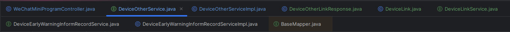

## idea 2023.2

总的来说新版本就是所有的操作、位置，都可以自定义，非常个性化。旧版本底部操作图标都移到了右下侧。配置完后记得导出 setting 文件，可以在新环境快速配置。

### 安装激活

历史版本下载地址：

https://www.jetbrains.com/idea/download/other.html

激活参考地址：

https://www.exception.site/ 

### 顺手的插件

#### MybatisX

#### Translation

一款翻译插件，支持Google、有道、百度翻译，对我们看源码时看注释很有帮助

#### GsonFormat

这款插件可以把JSON格式的字符串转化为实体类，当我们要根据JSON字符串来创建实体类的时候用起来很方便。

#### Grep Console

一款帮你分析控制台日志的插件，可以对不同级别的日志进行不同颜色的高亮显示，还可以用来按关键字搜索日志内容。

#### Alibaba Java Coding Guidelines

阿里巴巴《Java 开发手册》配套插件，可以实时检测代码中不符合手册规约的地方，助你码出高效，码出质量。

#### Maven Helper

解决Maven依赖冲突的好帮手，可以快速查找项目中的依赖冲突，并予以解决！

#### RestfulToolkit

一套Restful服务开发辅助工具集，提供了项目中的接口概览信息，可以根据URL跳转到对应的接口方法中去，内置了HTTP请求工具，对请求方法做了一些增强功能，总之功能很强大！

#### apifox

apifox 配套的插件，可以直接同步

### 个性化配置

#### 1.不升级 idea

点击菜单 `File` -> `Settings`

找到 `Updates` 菜单，取消勾选 IDEA 更新提示

#### 2.调出 git Local Changes 菜单

旧版本可以通过 local changes 看到本地的修改内容，新版需要设置才可看到。

点击菜单 `File` -> `Settings`

找到 `Commit` 菜单，取消勾选 Use non-modal 选项

apply 以后的变化，这里的 commit 图标不见了，git 里面的 local change 出来了

#### 3.调出菜单栏

顶部菜单栏，目前隐藏，需要点击才可显示，可通过鼠标右键设置显示，勾选 show main menu in separate toolbar，即可显示。

同时，customize toolbar 可以自定义一些选项。

#### 4.maven 换成树状结构（root 根节点）

就是展示成右侧的样子，默认左侧

maven 条目右键，勾选 group modeules，即可

#### 5.不打开最近的项目，自己选择

#### 6.项目文件设置 utf-8 编码

#### 7.不区分大小写匹配

#### 8.设置 idea 内存大小

Help 中 Edit Custom VM Options 配置文件

跟 java 配置类似，直接修改即可

#### 9.设置代码页多行显示

效果：不需要滚动直接全部显示

代码栏点击三个点，选择 configure editor tabs 选项

选择多行显示

