# 基础定义

bit 比特 二进制的1位 0或1

byte 字节8位  1byte=8bit 英文1B 中文2B 范围-2^7 ~ 2^7-1 最前位是正负

short char 16位

int float 32位

long double 64位

# java基础

## 1、集合数据结构

### **单列集合：collection接口**

#### list

**arraylist、linkedlist**

**arraylist：**数组实现、默认静态空数组（new出来的，没有add时）

当第一次add时，直接将数组大小设置为10。

当添加完10个后，添加第11个，大小是size+1 和当前数组的length比较，如果大了就要进行扩容

扩容大小是数组length+length>>1（1.5倍），判断是否满足，**判断是否溢出integer.maxvalue-8。**

在通过system.arraycopyof复制数据

remove时，会调用system.arraycopy方法，影响效率

**linkedlist**：链接实现、双向链表

#### **set**

**hashset、treeset**

### **双列集合：map**接口

#### hashmap

无序、查询效率高，线程不安全 **数组+链表+红黑树**


HashMap 底层是一个哈希桶数组，名为 table，数组内存储的是基于 Node 类型的数据

最大容量2^30（1<<30），大于这个数量将无法扩容，只能hash碰撞

负载因子是0.75f、初始容量16、当达到16x0.75=12时，进行扩容，扩容为lengthx2倍

负载因子大，会出现大量hash碰撞，虽然空间利用率上去了，但是时间效率降低了。

**扩容代码**

```java
final Node<K,V>[] resize() {
    // 当前 table
    Node<K,V>[] oldTab = table;
    // 当前的 table 的大小
    int oldCap = (oldTab == null) ? 0 : oldTab.length;
    // 当前 table 的 threshold，即允许存储的数据量阀值
    int oldThr = threshold;
    // 新的 table 的大小和阀值暂时初始化为 0
    int newCap, newThr = 0;
    // ① 开始计算新的 table 的大小和阀值
    // a、当前 table 的大小大于 0，则意味着当前的 table 肯定是有数据的
    if (oldCap > 0) {
        // 当前 table 的大小已经到了上线了，还咋扩容，自个儿继续哈希碰撞去吧 
        if (oldCap >= MAXIMUM_CAPACITY) {
            threshold = Integer.MAX_VALUE;
            return oldTab;
        }
        // 新的 table 的大小直接翻倍，阀值也直接翻倍
        else if ((newCap = oldCap << 1) < MAXIMUM_CAPACITY &&
                 oldCap >= DEFAULT_INITIAL_CAPACITY)
            newThr = oldThr << 1; // double threshold
    }
    // b、当前的 table 中无数据，但是阀值不为零，说明初始化的时候指定过容量或者阀值，但是没有被 put 过数据，因为在上文中有提到过，此时的阀值就是数组的大小，所以直接把当前的阀值当做新 table 的数组大小即可
    // 回忆一下：threshold = tableSizeFor(t);
    else if (oldThr > 0) // initial capacity was placed in threshold
        newCap = oldThr;
    // c、这种情况就代表当前的 table 是调用的空参构造来初始化的，所有的数据都是默认值，所以新的 table 也只要使用默认值即可
    else {               // zero initial threshold signifies using defaults
        newCap = DEFAULT_INITIAL_CAPACITY;
        newThr = (int)(DEFAULT_LOAD_FACTOR * DEFAULT_INITIAL_CAPACITY);
    }
    // 如果新的阀值是 0，那么就简单计算一遍就行了
    if (newThr == 0) {
        float ft = (float)newCap * loadFactor;
        newThr = (newCap < MAXIMUM_CAPACITY && ft < (float)MAXIMUM_CAPACITY ?
                  (int)ft : Integer.MAX_VALUE);
    }
    threshold = newThr;
    // ② 初始化新的 table
    // 这个 newTab 就是新的 table，数组大小就是上面这一堆逻辑所计算出来的
    @SuppressWarnings({"rawtypes","unchecked"})
    Node<K,V>[] newTab = (Node<K,V>[])new Node[newCap];
    table = newTab;
    if (oldTab != null) {
        // 遍历当前 table，处理每个下标处的 bucket，将其处理到新的 table 中去
        for (int j = 0; j < oldCap; ++j) {
            Node<K,V> e;
            if ((e = oldTab[j]) != null) {
                // 释放当前 table 数组的对象引用（for循环后，当前 table 数组不再引用任何对象）
                oldTab[j] = null;
                // a、只有一个 Node，则直接 rehash 赋值即可
                if (e.next == null)
                    newTab[e.hash & (newCap - 1)] = e;
                // b、当前的 bucket 是红黑树，直接进行红黑树的 rehash 即可
                else if (e instanceof TreeNode)
                    ((TreeNode<K,V>)e).split(this, newTab, j, oldCap);
                // c、当前的 bucket 是链表
                else { // preserve order
                    Node<K,V> loHead = null, loTail = null;
                    Node<K,V> hiHead = null, hiTail = null;
                    Node<K,V> next;
                    // 遍历链表中的每个 Node，分别判断是否需要进行 rehash 操作
                    // (e.hash & oldCap) == 0 算法是精髓，充分运用了上文提到的 table 大小为 2 的幂次方这一优势，下文会细讲
                    do {
                        next = e.next;
                        // 根据 e.hash & oldCap 算法来判断节点位置是否需要变更
                        // 索引不变
                        if ((e.hash & oldCap) == 0) {
                            if (loTail == null)
                                loHead = e;
                            else
                                loTail.next = e;
                            loTail = e;
                        }
                        // 原索引 + oldCap
                        else {
                            if (hiTail == null)
                                hiHead = e;
                            else
                                hiTail.next = e;
                            hiTail = e;
                        }
                    } while ((e = next) != null);
                    // 原 bucket 位置的尾指针不为空(即还有 node )
                    if (loTail != null) {
                        // 链表末尾必须置为 null
                        loTail.next = null;
                        newTab[j] = loHead;
                    }
                    if (hiTail != null) {
                        // 链表末尾必须置为 null
                        hiTail.next = null;
                        newTab[j + oldCap] = hiHead;
                    }
                }
            }
        }
    }
    return newTab;
}
```

##### 牛逼的地方，也是为什么长度会取值 2^n ？

**1.hash（key）取下标index**

index 的取值 hash(key) % n 和 hash(key) & (n-1) 取模效果一样

比如hash是10，n是4 那么相当于就是10里面剩出去4的倍数剩几，换成2进制，其实就是4的2进制100最后面那两位是多少，省的就是多少，因为他只能已这个倍数去向上加。n-1 & 正好可以把这个数字取出来。

**2.同时还有扩容后重新计算key值**，key要么是原来的值，要么是原值+数组长度。

这是因为8->1000 16->10000，取key时，只差最左1位，如果是0 则，不变，如果是1，则相差16（也就是新数组的长度）

**链表、红黑树转换。**

红黑树的平均查找长度是log(n)，长度为8，查找长度为log(8)=3，链表的平均查找长度为n/2，当长度为8时，平均查找长度为8/2=4，这才有转换成树的必要；链表长度如果是小于等于6，6/2=3，虽然速度也很快的，但是转化为树结构和生成树的时间并不会太短。

还有选择6和8的原因是：

中间有个差值7可以防止链表和树之间频繁的转换。假设一下，如果设计成链表个数超过8则链表转换成树结构，链表个数小于8则树结构转换成链表，如果一个HashMap不停的插入、删除元素，链表个数在8左右徘徊，就会频繁的发生树转链表、链表转树，效率会很低。

除了满足 8 之外，还要看table是否大于64，小于先扩容，大于在转换。

table长度足够，hash冲突过多

hash没有冲突，但是在计算table下标的时候，由于table长度太小，导致很多hash不一致的
第二种情况是可以用扩容的方式来避免的，扩容后链表长度变短，读写效率自然提高。

#### linkedhashmap

继承 hashmap 多维护了一个双向链表，有序的

通过双向链表进行维护数据的存取有序，第一个head是-1

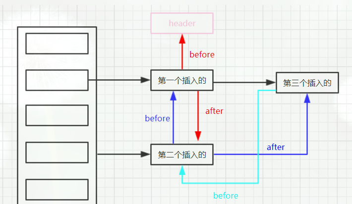

#### treemap

红黑树，可以自定义比较器，进行key排序。

#### CopyOnWriteArrayList 通过 ReentrantLock 保证并发安全

#### ConcurrentHashMap

**hashmap多线程不安全分析**

1.当key没有链表时，同时 putkey，p.next 同时执行，就会丢失一个key。

```java
// 新建节点并追加到链表
if ((e = p.next) == null) { // #1
    p.next = newNode(hash, key, value, null); // #2
    if (binCount >= TREEIFY_THRESHOLD - 1) // -1 for 1st
        treeifyBin(tab, hash);
    break;
}
```

2.获取在扩容时，getkey，会造成null。

```java
Node<K,V>[] newTab = (Node<K,V>[])new Node[newCap]; // #1
table = newTab; // #2
```

**如何保证线程安全**

针对问题1：

如果key的地址没有链表，则使用 cas 进行赋值，如果有值，则使用第一个object加synchronize锁。锁的力度都是数组中的元素，效率高。

针对问题2：

resize时，会将第一个标记为 move -1 说明是扩容，就一起参与扩容。

## 2、多线程、并发

进程和线程。进程之间独立，进程有多个线程，cpu来回在线程件切换

### **创建多线程**：

继承thread类、实现Runable接口、实现Callable接口

### **线程状态**

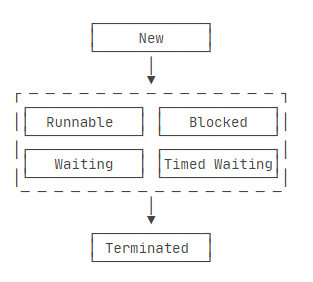

- New：新创建的线程，尚未执行；
- Runnable：运行中的线程，正在执行`run()`方法的Java代码；
- Blocked：运行中的线程，因为某些操作被阻塞而挂起；
- Waiting：运行中的线程，因为某些操作在等待中；
- Timed Waiting：运行中的线程，因为执行`sleep()`方法正在计时等待；
- Terminated：线程已终止，因为`run()`方法执行完毕。

### **常用方法**

1. start 启动一个线程，进入排队状态，等待cpu启动。
2. run 执行命令。
3. sleep 暂停执行，让出cpu，但监控状态、锁不会释放。
4. wait 释放锁，等待其他线程唤醒，但不会得到锁，需要重新竞争
5. yield 让出cpu资源
6. join 阻塞其他线程，直到我结束，你在执行，强插一脚。

## 3、线程池七大参数、执行流程

### **ThreadPoolExecutor 7个参数如下**

（1）corePoolSize：核心线程数，线程池中始终存活的线程数。

（2）maximumPoolSize: 最大线程数，线程池中允许的最大线程数。

（3）keepAliveTime: 存活时间，线程没有任务执行时最多保持多久时间会终止。

（4）unit: 单位，参数keepAliveTime的时间单位，7种可选。

（5）workQueue: 一个阻塞队列，用来存储等待执行的任务，均为线程安全，7种可选。

| 参数                  | 描述                                                         |
| --------------------- | ------------------------------------------------------------ |
| ArrayBlockingQueue    | 一个由数组结构组成的有界阻塞队列。                           |
| LinkedBlockingQueue   | 一个由链表结构组成的有界阻塞队列。                           |
| SynchronousQueue      | 一个不存储元素的阻塞队列，即直接提交给线程不保持它们。       |
| PriorityBlockingQueue | 一个支持优先级排序的无界阻塞队列。                           |
| DelayQueue            | 一个使用优先级队列实现的无界阻塞队列，只有在延迟期满时才能从中提取元素。 |
| LinkedTransferQueue   | 一个由链表结构组成的无界阻塞队列。与SynchronousQueue类似，还含有非阻塞方法。 |
| LinkedBlockingDeque   | 一个由链表结构组成的双向阻塞队列。                           |

（6）threadFactory: 线程工厂，主要用来创建线程，默及正常优先级、非守护线程。

（7）handler：拒绝策略，拒绝处理任务时的策略，4种可选，默认为AbortPolicy。

| 参数                | 描述                                                      |
| ------------------- | --------------------------------------------------------- |
| AbortPolicy         | 拒绝并抛出异常。                                          |
| CallerRunsPolicy    | 重试提交当前的任务，即再次调用运行该任务的execute()方法。 |
| DiscardOldestPolicy | 抛弃队列头部（最旧）的一个任务，并执行当前任务。          |
| DiscardPolicy       | 抛弃当前任务。                                            |

### **执行流程**


### **实际方案**

参数配置：IO密集型（cpu核心*2）、CPU密集型（cpu+1）。核心数量、最大数量、队列长度配置。

优化方案，动态调优。通过线程实例动态设置 核心、动态数量。

线程池监控：

activecount数量/max数量 = 阀值 说明线程都在使用。

reject数量、队列中的等待任务。综合判定。

## 4、常见设计模式、实际应用

## 5、锁机制、可重入锁、公平锁、悲观锁

**java对象头存储结构**

markword、classpoint、实例数据、padding对齐。

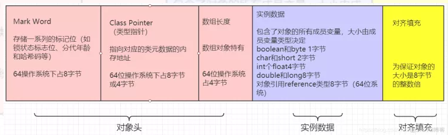

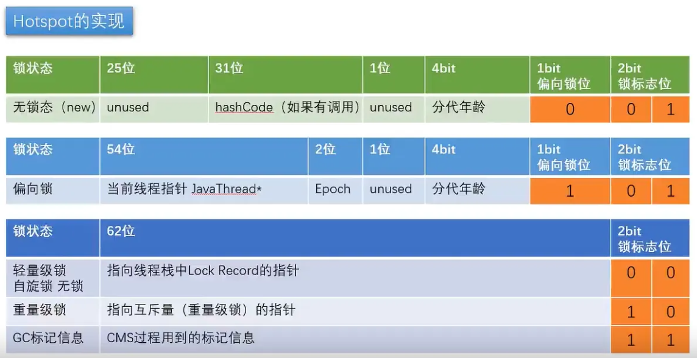

**Monitor**：一个同步工具或一种同步机制，通常被描述为一个对象。依赖于底层的操作系统的Mutex Lock（互斥锁）来实现的线程同步。需要cpu来回切换状态，属于重量级锁。

markword前四位代表锁，001是无锁，其他是有锁。

**automicInteger**，乐观锁保证，实现的是c++，cpu的lock指令。

### synchronize 锁

**锁状态：无锁 VS 偏向锁 VS 轻量级锁 VS 重量级锁**

偏向锁通过对比Mark Word解决加锁问题，避免执行CAS操作。而轻量级锁是通过用CAS操作和自旋来解决加锁问题，避免线程阻塞和唤醒而影响性能。重量级锁是将除了拥有锁的线程以外的线程都阻塞。

A线程拿锁，把你自己名字贴上，就是偏向锁。如果下一次来，看见还有这个标记，就直接使用，省了竞争的过程。但是，如果B线程来了，就会撕下去，变成轻量级锁，一直等待。

一开始是轻量级锁，默认4秒后，变成偏向锁，可以通过jvm参数修改。

轻量级锁：乐观锁，线程存活、一直等待、消耗cpu、jvm自己可以搞定。

重量级锁：线程进入队列、等待唤醒，竞争激烈时可用。但是需要系统协调。

### reentrantlock 可重入锁

**AbstractQueuedSynchronizer（简称为AQS）**，

接口，规定锁，使用一个FIFO的等待队列表示排队等待锁的线程，state使用volatile标记。采用cas操作保证原子性。

默认使用非公平锁，

**其原理大致为**：

当某一线程获取锁后，将state值+1，并记录下当前持有锁的线程，再有线程来获取锁时，判断这个线程与持有锁的线程是否是同一个线程，如果是，将state值再+1，如果不是，阻塞线程。

AQS内部实际上是一个FIFO的双端队列，当线程获取同步状态失败时，就会构建一个Node并添加到队列尾部（此过程是线程安全的，CAS实现），并阻塞当前线程（通过**LockSupport.park()**方法）； 当释放同步状态时，AQS会先判断head节点是否为null，如果不是null，说明有等待同步状态的线程，就会尝试唤醒head节点，使其重新竞争同步状态。

park wait 都不会释放锁，unpark可以精准唤起线程 unsafe native方法


### volatile 关键字

保证操作的顺序性、可见性。使用汇编的lock，有load和store锁，这样保证是顺序进行的。

还有缓存一致性协议，esmi，本地内存失效，需要去主内存重新读取， 我改了这个内存，你们都要等着我改完再用。

### cpu 3级缓存，调优

cpu3级缓存，每次缓存64byte数据，如果多个cpu的缓存有相同的数据，需要保持数据一致性，这样会消耗一部分时间，优化的话，就让数据独享一个缓存块，一般是前后各加8个long型变量，一个long是8byte。

### new 对象过程

```c++
汇编码：
0 new #2 <T>  申请一片空间  同时赋予默认数据（c++不会，使用上次的值）
3 dup
4 invokespecial #3 <T.<inti>> 构造赋值
7 astore_1  t 的指针指向 new 的空间
8 return
```

### double check lock

双 null 检测，sync不保有序性，可能会指令重排（概率很小）。加 volatile 保证可见性、有序性，不保证原子性。用内存屏障保证指令不被中断。

load、store。jvm内存屏障，保证不让其线程他操作。

## 6、java memory model （jmm）模型

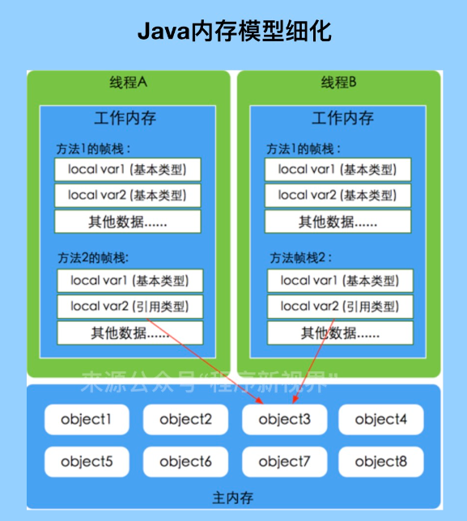


在此交互过程中，Java内存模型定义了8种操作来完成，虚拟机实现必须保证每一种操作都是原子的、不可再拆分的（double和long类型例外）。

- lock（锁定）：作用于主内存的变量，它把一个变量标识为一条线程独占的状态。
- unlock（解锁）：作用于主内存的变量，它把一个处于锁定状态的变量释放出来，释放后的变量才可以被其他线程锁定。
- read（读取）：作用于主内存的变量，它把一个变量的值从主内存传输到线程的工作内存中，以便随后的load动作使用。
- load（载入）：作用于工作内存的变量，它把read操作从主内存中得到的变量值放入工作内存的变量副本中。
- use（使用）：作用于工作内存的变量，它把工作内存中一个变量的值传递给执行引擎，每当虚拟机遇到一个需要使用到变量的值的字节码指令时将会执行这个操作。
- assign（赋值）：作用于工作内存的变量，它把一个从执行引擎接收到的值赋给工作内存的变量，每当虚拟机遇到一个给变量赋值的字节码指令时执行这个操作。
- store（存储）：作用于工作内存的变量，它把工作内存中一个变量的值传送到主内存中，以便随后的write操作使用。
- write（写入）：作用于主内存的变量，它把store操作从工作内存中得到的变量的值放入主内存的变量中。

## 7、jvm内存划分、垃圾回收算法、垃圾回收器、调优

### jvm  JDK1.6、JDK1.7、JDK1.8 内存模型演变

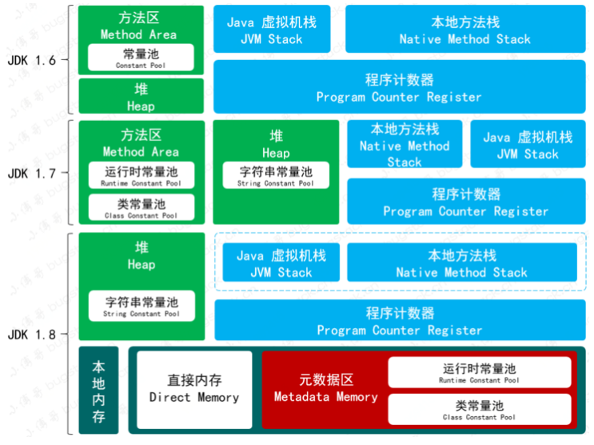

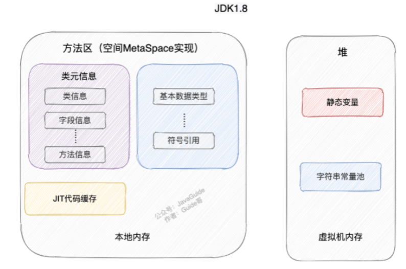

元数据区：2个常量池 运行时常量池、类常量池、类信息（编译后的class文件)

### **什么是运行时常量池？**

Class 文件中除了有类的版本、字段、方法、接口等描述信息外，还有用于存放编译期生成的各种字面量（Literal）和符号引用（Symbolic Reference）的常量池表(Constant Pool Table)。常量池表会在类加载后存放到方法区的运行时常量池中。

字面量是源代码中的固定值的表示法，即通过字面我们就能知道其值的含义。字面量包括整数、浮点数和字符串字面量，符号引用包括类符号引用、字段符号引用、方法符号引用和接口方法符号引用。

运行时常量池的功能类似于传统编程语言的符号表，尽管它包含了比典型符号表更广泛的数据。

既然运行时常量池是方法区的一部分，自然受到方法区内存的限制，当常量池无法再申请到内存时会抛出 `OutOfMemoryError` 错误。

### 垃圾回收

堆划分：

#### 垃圾判断算法

1、引用计数法：用+1 不用-1 无法检测循环引用，造成内存泄漏，无法回收

2、可达性分析算法：从一个节点 GC ROOT 开始，寻找节点引用，无用节点将被回收。

- 虚拟机栈（栈帧中的本地变量表）中引用的对象
- 方法区中的常量引用的对象
- 方法区中的类静态属性引用的对象
- 本地方法栈中 JNI（Native 方法）的引用对象
- 活跃线程（已启动且未停止的 Java 线程）

#### 垃圾回收算法

1、标记-清除，造成内存碎片

2、标记-复制，直接复制到另一块上，新生代

3、标记-整理，老年代

新生代进入老年代，15岁（在幸存区15次都没有被清除）

#### 垃圾回收器分类

1、Serial/Serial Old 单线程

2、ParNew/ParNew Old 多线程

3、Parallel Scavenge 新生代、标记-复制算法、并发，注重垃圾收集吞吐量

4、CMS 并发，老年代、最短回收停顿时间、标记-清除算法  依赖cpu、抢占用户资源

5、G1 充分利用cpu、打破分代模型，划分区域。

#### 你们现在使用的是什么回收器：默认

因为我们系统是业务相对复杂，但并发并不是⾮常⾼，所以希望尽可能的利用处理器资源，出于提⾼吞吐量的考虑采⽤ Parallel Scavenge + Parallel Old 的组合。

## 8、强软弱虚引用

强：A a = new A ( )

软：SoftReference<byte[]> sr = new SoftReference<>(new byte[1024\*1024\*10]);

= 是强引用  soft里面是软引用  sr.get() 获取对象 空间不足时，会被清理掉。

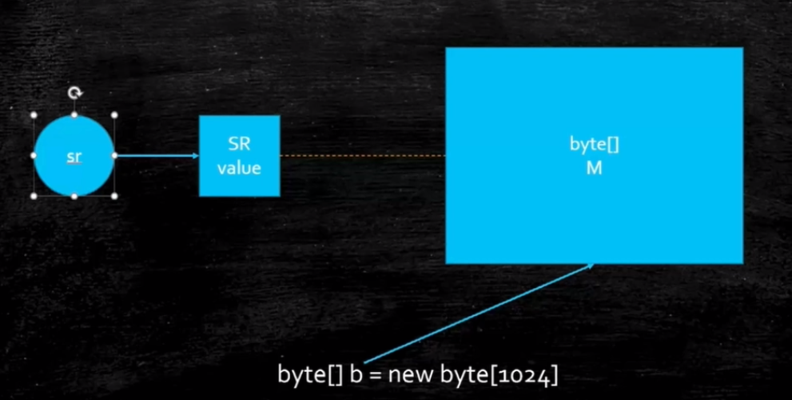

弱：WeakReference\<M> wr = new WeakReference<>(new M()); 类似软引用图。当gc执行时，不管内存是否充足，直接被干掉。

#### threadlocal两层内存泄漏

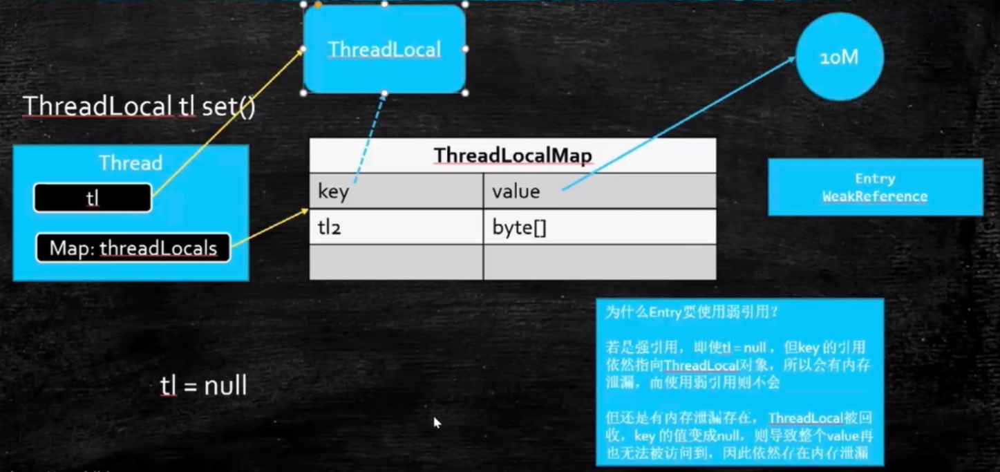

第一层：如果用的不是软引用的话，threadlocal 会被 tl 和 key 一同指向，如果只释放 tl，那么key的指向还在，threadlocal对象就不会被回收掉。造成内存泄漏。

第二层：使用的是线程池，线程如果不会被干掉，线程的threadlocalmap会一直存在，如果key value的数据一直存在，value引用的对象就不会被回收，也会造成内存泄漏，所以需要每次使用完之后，进行remove操作。  

## 9、实际的故障分析

### excel poi问题、

### cpu飙升、

### 内存oom处理、

### 常见的jvm参数

## 10、io多路复用

# spring框架

## spring 

### 1、IOC 理解

总：

**控制反转：**原来的对象是由使用者进行控制，有了spring之后，就可以把对象交给spring管理

​	       DI：依赖注入，把对应的属性的值通过autowire注入。

**容器：**存放对象，使用map结构存储，在spring中有三级缓存，singletonObj获取完成对象。bean生命周期，有创建到销毁都是由容器来管理的。（bean生命周期）

分：

1、beanfactory、defaultlistablebeanfactory，想bean工厂中设置一些参数，beanpostprocessor

2、加载解析bean对象，创建beandefinition（xml、注解）解析

3、beanfactoryprostprocessor处理，这是扩展点。

4、beanpostprocessor注册功能，方便后续对bean对象挖完成具体的扩展功能

5、通过反射方式，将beandefinition对象生成具体对象

6、bean对象初始化，填充属性，调用aware子类方法、beanprostprocessor前置处理方法、init-method方法、beanpostprocessor后处理器方法

7、生成完成bean对象，通过getbean方法获取

8、销毁过程

### 2、底层实现

反射、工厂、设计模式。

createBeanFactory、getBean、doGetBean、createBean、doCreateBean、newIntance、populateBean、initializingBean

1、通过createBeanFactory创建出bean工厂（definitionlistablebeanfactory）

2、开始循环创建对象、因为bean默认是单例的，先通过getBean、doGetBean从容器中查找，找不到的话

3、在通过createBean、doCreateBean方法，以反射的方式创建对象，一般使用无参的getDeclaredConstructor、newIntance

4、进行对象的属性填充populateBean

5、进行其他的初始化操作initializingBean

### 3、bean的生命周期

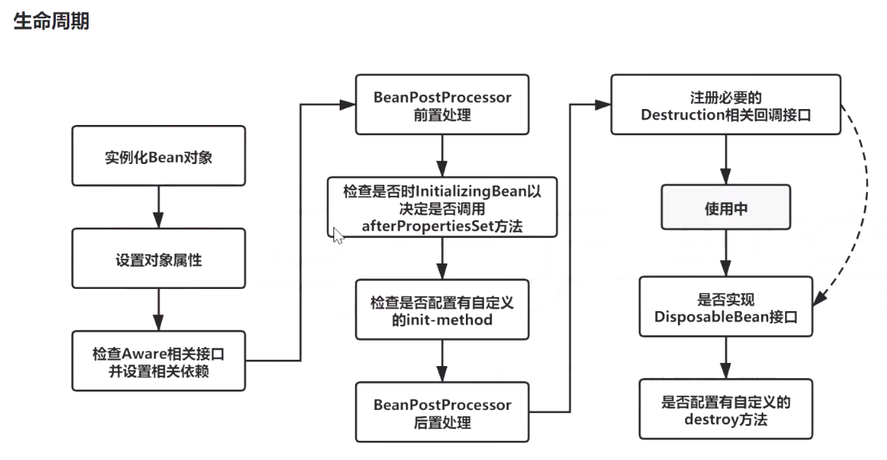

1、实例化Bean：反射的方式生成对象

2、填充bean属性：populateBean、可以引发循环依赖问题，三级缓存

3、调用aware接口方法：invokeAwareMethod（完成BeanName、BeanFactory、BeanClassLoader对象的属性设置）

4、调用BeanPostProcessor前置处理器方法：有applicationContextPostProcessor设置applicationcontext、environment、resourceLoader、embeddValueResolver等对象。

5、调用initmethod方法：invokeInitmethod（）判断是否实现了initializingBean接口，有调用afterPropertiesset方法

6、调用BeanPostProcessor的后置处理方法，spring的aop就在此处实现的，abstractAutoProxy

Createor注册destuction相关的回调接口

7、获取完整地对象，通过getBean方式来进行对象的获取

8、销毁流程：1判断是否实现了dispoableBean接口调用destorymethod方法 

### 4、spring循环依赖

三级缓存、提前暴露对象、aop

总：什么事循环依赖，A依赖B、B依赖A

分：先说明bean创建过程：实例化、初始化（填充属性）

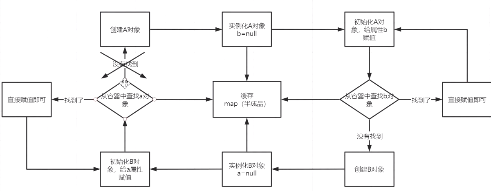

```java
// 从上至下 分表代表这“三级缓存”
	private final Map<String, Object> singletonObjects = new ConcurrentHashMap<>(256); //一级缓存
	private final Map<String, Object> earlySingletonObjects = new HashMap<>(16); // 二级缓存
	private final Map<String, ObjectFactory<?>> singletonFactories = new HashMap<>(16); // 三级缓存
```

singletonObjects：用于存放完全初始化好的 bean，从该缓存中取出的 bean 可以直接使用
earlySingletonObjects：提前曝光的单例对象的cache，存放原始的 bean 对象（尚未填充属性），用于解决循环依赖
singletonFactories：单例对象工厂的cache，存放 bean 工厂对象，用于解决循环依赖

1、先创建A对象，实例化A对象，此时B属性为空

2、从容器中查找B对象，如果存在，直接使用，找不到创建B对象

3、实例化B对象，此时B中的A为空，填充属性A

4、从容器中查找A对象，找不到，直接创建

此时，发现A对象存在，但是A是 不完整的状态，只是实例化了出来但未完成初始化，如果在程序的调用过程中，拥有了某个对象的引用，可以在后期给她赋值，可以有限把非完整状态的对象有限赋值，等待后续操作来完成赋值，相当于体现暴露了某个不完整对象的引用。

所以，核心在实例化和初始化操作分开，当所有对象都完成实例化、初始化操作之后，把完整地对象放到容器中。

### 5、beanfactory和factorybean区别

相同点：都是创建bean对象的

不同点：beanfactory创建的时候，必须严格遵循生命周期流程。如果想要自定义对象创建，交给spring来管理，就需要实现factorybean接口。主要有3个方法：

​	isSingleton：是否是单例对象 

​	getObjectType：获取返回对象类型

​	getObject：自定义创建对象的过程（new、反射、动态代理）

### 6、spring中的设计模式

工厂：beanfactory

模板：postprocessorbeanfactory

策略：xmlbeandefinitionreader

### 7、spring aop的底层实现原理

aop是ioc的一个扩展功能，现有ioc，再有aop，在ioc的BeanPostProcessor中对bean进行扩展实现。

1、代理对象的创建过程 advice、切面、切点

2、通过jdk或者cglib方式来生成代理对象

3、在执行方法调用的时候，会调用生成的字节码文件，直接找到拦截方法。

4、根据之前定义好的advice生成拦截器链

5、从拦截器链中依次获取每一个通知开发进行执行，从-1的位置开始查找执行的

### 8、sprinig的事务回滚

spring事务管理是如何实现的？

总：aop实现的，首先生成代理随想，然后按照aop流程来执行具体的操作逻辑，正常通过通知来完成核心功能，但是事务不是通过通知来实现的，是通过transactioninterceptor来实现的，然后调用invoke实现具体逻辑。

分：1、准备工作，解析各个放上事务相关的属性，根据具体的属性来判断是否开始新事务。

​		2、当需要开启时，获取数据库链接，关闭自动提交功能，开启事务

​		3、执行具体的sql逻辑操作

​		4、在操作过程中，失败了，通过completeTransactionAfterThrowing来完成事务的回滚操作，具体逻辑是通过dorollback方法实现，实现时也是先获取连接对象，通过连接 coon.rollback回滚

​		5、执行成功时，通过commitTransactionAfterReturning来完成事务提交操作，具体逻辑由doCommit实现。

​		6、当时吴执行完毕后需要清楚相关的事务信息 cleanupTransactionInfo

### 9、事务的传播特性

一共有7种

总：不同方法嵌套调用的过程中，事务应该如何处理，用一个还是不同事务，出现异常的时候是回滚还是提交，使用的比较多的是required、required_new、nested。

分：1、大概分为 3 类，支持当前事务、不支持当前事务、嵌套事务。

​		2、外层是required，内层是required、required_new、nested。

​		3、外层是required_new，内层是required、required_new、nested。

​		4、外层是nested，内层是required、required_new、nested。

核心逻辑：

1、判断内外方法是否是同一个事务，是：异常统一在外层方法处理 不是：内层方法有可能影响外层方法，但外层影响不到内层。

**REQUIRED**(Spring默认的事务传播类型 required：需要、依赖、依靠)：如果当前没有事务，则自己新建一个事务，如果当前存在事务则加入这个事务
当A调用B的时候：如果A中没有事务，B中有事务，那么B会新建一个事务；如果A中也有事务、B中也有事务，那么B会加入到A中去，变成一个事务，这时，要么都成功，要么都失败。（假如A中有2个SQL，B中有两个SQL，那么这四个SQL会变成一个SQL，要么都成功，要么都失败）

**SUPPORTS**（supports：支持;拥护）:当前存在事务，则加入当前事务，如果当前没有事务，就以非事务方法执行
如果A中有事务，则B方法的事务加入A事务中，成为一个事务（一起成功，一起失败），如果A中没有事务，那么B就以非事务方式运行（执行完直接提交）；

**MANDATORY**（mandatory：强制性的）:当前存在事务，则加入当前事务，如果当前事务不存在，则抛出异常。
如果A中有事务，则B方法的事务加入A事务中，成为一个事务（一起成功，一起失败）；如果A中没有事务，B中有事务，那么B就直接抛异常了，意思是B必须要支持回滚的事务中运行

**REQUIRES_NEW**（requires_new：需要新建）:创建一个新事务，如果存在当前事务，则挂起该事务。
B会新建一个事务，A和B事务互不干扰，他们出现问题回滚的时候，也都只回滚自己的事务；

**NOT_SUPPORTED**（not supported：不支持）:以非事务方式执行,如果当前存在事务，则挂起当前事务
被调用者B会以非事务方式运行（直接提交），如果当前有事务，也就是A中有事务，A会被挂起（不执行，等待B执行完，返回）；A和B出现异常需要回滚，互不影响

**NEVER**（never：从不）: 如果当前没有事务存在，就以非事务方式执行；如果有，就抛出异常。就是B从不以事务方式运行
A中不能有事务，如果没有，B就以非事务方式执行，如果A存在事务，那么直接抛异常

**NESTED**（nested：嵌套的）嵌套事务:如果当前事务存在，则在嵌套事务中执行，否则REQUIRED的操作一样(开启一个事务)
如果A中没有事务，那么B创建一个事务执行，如果A中也有事务，那么B会会把事务嵌套在里面。

### 源码理解

### 流程顺序

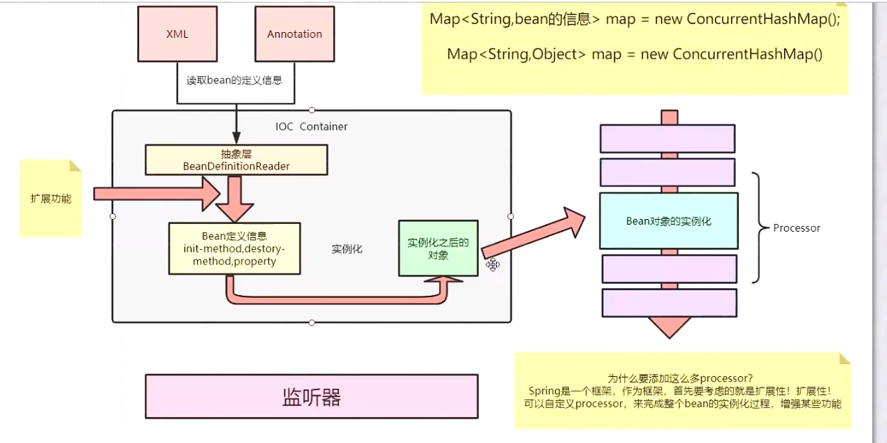

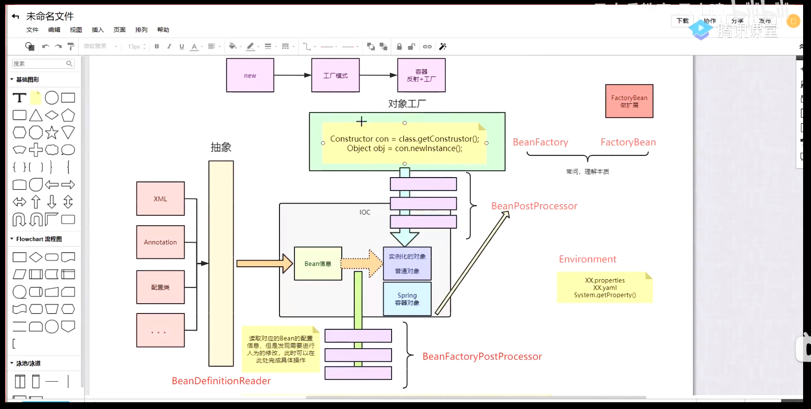


## springboot

自动装配、加载过程、springapplication注解

### 1、**核心注解 @SpringBootApplication：**

@ComponentScan扫描当钱包及子包下的所有类

@SpringBootConfiguration 组合了Configuration注解

@EnableAutoConfiguration 自动装配，META-INF/spring.factories文件加载需要自动注入的类

### 2、自动装配原理

在启动springboot项目的main方法的类中，有@SpringBootApplication 注解，包含了一个@EnableAutoConfiguration注解。这个就是自动装配，这个里面又包含了@Import注解，这个注解中引入了 importSelector 接口的类，在对应的selectImport方法中读取 META/INF 目录下的 spring.factories 文件中需要被加载的配置类，通过 spring-autoconfigure-metadata.properties文件做过滤。最后返回的就是需要自动装配的相关对象。

### 3、谈谈对starter的理解

starter作用是在 META/INF目录下提供了一个spring.factories文件，在该文件中添加了一个需要注入到容器中的对应配置类

第三方框架要想整合到springboot中，就需要提供spring.factories文件，相当于启动的同时，启动其他第三方框架。

### 4、常用starter

web，提供了springmvc+tomcat容器

### 5、bootstrap.yml文件作用？

在springcloud环境下支持，一个父容器，在springboot启动前加载初始化操作。

## springMVC

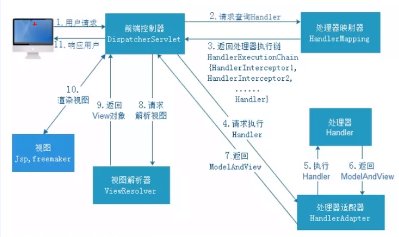

流程：

1、dispatcherServlet表示前端控制器，控制中心，用户发出请求，到这里拦截

2、handlerMapping为处理器映射，根据url查找对应handler

3、返回处理器执行链，根据url查找控制器，并且将解析后的信息传递给dispatcherServlet

4、handeradapter表示处理器适配器，按照特定规则执行handler

5、执行handler找到处理器

6、controller将具体的信息返回给handleradapter，如modelandview

7、由handleradapter传递给dispatcherServlet

8、dispatcherServlet调用视图解析器viewresolver解析modelandview

9、返回view对象给dispatcherServlet

10、调用具体的视图进行渲染

11、相应数据返回给客户端

## mybatis

框架原理，自动注入数据库、加载流程

# springcloud

## 1、nacos

注册中心+配置中心+服务管理平台

### 架构：

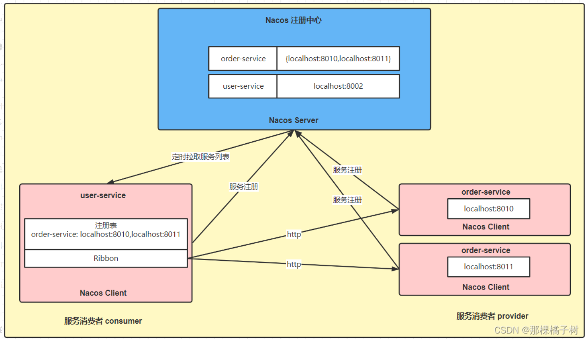

服务注册：通过rest请求向nacos server注册，提供自身元数据，服务名称、ip、端口

服务心跳：注册后，nacos client维护一个定时心跳通知nacos server，默认5s

服务同步：集群同步

服务发现：client发送请求获取注册服务清单，缓存到本地

服务健康检查：server 检查 15s 不在下线、 30s 不在剔除

### 配置

```shell
server:
  port: 8020
spring:
  application:
    name: order #名称
  cloud:
    nacos:
      server-addr: localhost:8848 #地址
      username: nacos
      password: nacos
      namespace: public
      ephemeral: false #永久实例 宕机也不会删除
```

如果是docker启动，addr是docker中给服务起的名字 container_name: ruoyi-nacos

复制服务：VM输入框 `-Dserver.port=8081`

通过api也可以进行服务注册。

命名空间：项目1、项目2

分组：开发环境、生产环境、测试环境

雪崩保护（保护阈值）：0-1之间，比如设置0.5，代表 健康实例/总实例树<保护阈值 会把不健康实例也拿来使用。（实例尚在，但可能下线了）一般不使用。

### 负载均衡：ribbon、loadbalance

### 配置中心

## 2、gateway

## 3、openfegin

服务之间的远程调用

### 简单使用：

1、pom配置，引入 openfeign 依赖，父pom中已经引入springcloud依赖

```shell
<dependency>
	<groupId>org.springframework.cloud</groupId>
	<artifactId>spring-cloud-starter-openfeign</artifactId>
</dependency>
```

2、springapplication 添加 @EnableFeignClients 注解（为了扫描@FeignClient，生成代理对象）

3、创建想要访问的服务接口 StockFeignService，添加 @FeignClient(name = "stock", path = "/stock") 注解，并发访问的服务名字、路径写上

4、在接口中复制访问的方法

5、注入使用

```java
package com.ex.order.feign;

import org.springframework.cloud.openfeign.FeignClient;
import org.springframework.web.bind.annotation.GetMapping;

@FeignClient(name = "stock", path = "/stock")
public interface StockFeignService {
    @GetMapping
    String getStock();
}
```

### 日志配置

4种级别：

**none**：不记录任何日志（默认配置）

**basic**：仅记录请求方法、url、响应状态码、执行时间（生产环境追踪问题）

**headers**：在basic基础上记录请求和响应的header

**full**：请求、响应的header、body、元数据（测试环境）

application中配置：

```shell
logging: 
  level:
    com.ex.order.feign: debug #打开单独日志
feign: 
  client:
    config:
      stock: #这里是服务名称
        loggerLevel: FULL
        connectTimeout: 5000 #连接超时时间 默认2s
        readTimeout: 3000 #请求处超时时间 默认5s sockettimeoutexception
```

### 原理分析

流程图

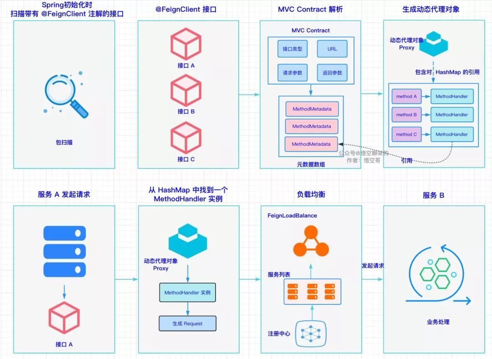

1、通过扫描注解，将有@FeignClient的接口解析出来

2、转换成bean，统一交给spring管理

3、通过mvccontract协议解析（注解、数据），放到methodmetadata中

4、基于接口生成动态代理对象，指向了一个包含对应方法的methodhandler的hashmap，代理对象会交给spring容器中，并注入到对应服务

5、调用接口，发起远程调用请求

6、从动态代理对象找到methodhandler实例，生成request对象

7、经过负载均衡算法，找到对应的ip，拼接url

8、向服务发起请求，执行业务逻辑，返回响应。

#### 如何注入到spring中的

关键的类：FeignClientFactoryBean bean工厂、beanDefinition 存储相关信息、交给BeanDefinitionReaderUtils

找到要处理的类->解析数据（name、path、url等）->构建beanDefinition ->交给spring

#### feignclient如何生成的

FeignClientFactoryBean实现了BeanFactory类，getObject（）

代理反射，并交给holder

#### 请求过程

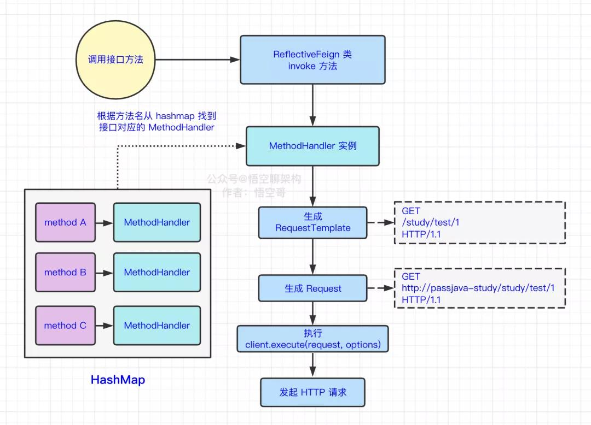

1、根据 method 名字从map中取 methodhandler

2、执行 invoke 方法，生成requestTemplate

3、在生成request方法，发起请求，等待数据

## 4、分布式事务seata

每个微服务都有自己的数据库，无法共同进行事务操作，所以需要分布式事务，有 AT、TCC、SAGA、XA 等模式。

分为两阶段（2PC）提交，划分两个阶段prepare、commit完成。

### 执行流程

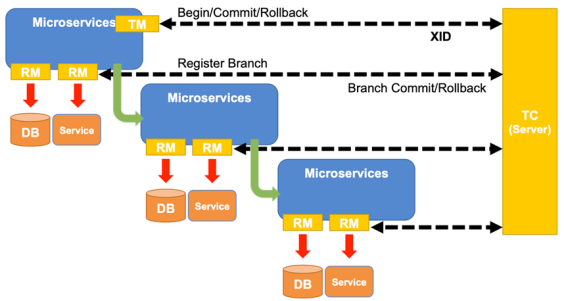

TC（transaction coordinator）事务协调者：维护事务状态，驱动提交、回滚（单独部署server）

TM（transaction manager）事务管理者：定义全局事务范围（嵌入client）

RM（resource manager）资源管理器：管理分支事务处理的资源（嵌入client）

在 Seata 中，分布式事务的执行流程：

- TM 开启分布式事务（TM 向 TC 注册全局事务记录）；
- 按业务场景，编排数据库、服务等事务内资源（RM 向 TC 汇报资源准备状态 ）；
- TM 结束分布式事务，事务一阶段结束（TM 通知 TC 提交/回滚分布式事务）；
- TC 汇总事务信息，决定分布式事务是提交还是回滚；
- TC 通知所有 RM 提交/回滚 资源，事务二阶段结束；

### 模式

**AT模式（auto transcation）**

无侵入式的分布式事务，也是分为2阶段提交。用户的 “业务 SQL” 作为一阶段，Seata 框架会自动生成事务的二阶段提交和回滚操作。

流程：


一阶段：

拦截业务sql，在更新数据前，保存旧数据为before image，执行业务sql，生成 after image，生成行锁。以上操作都在一个数据库，保证原子性。


二阶段提交：

因为数据已经提交到数据库，所以只需删除快照数据image和行锁即可。

二阶段回滚：

使用before image还原数据，还原之前进行脏写校验，出现脏写需要人工处理。没有直接执行逆向sql进行数据还原，删除image、行锁。

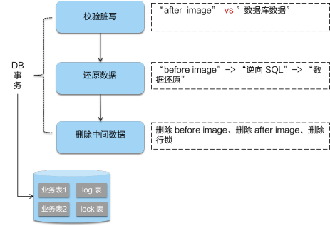

**TCC模式（try、confirm、cancel）**

需要用户根据自己的业务场景实现 Try、Confirm 和 Cancel 三个操作；事务发起方在一阶段执行 Try 方式，在二阶段提交执行 Confirm 方法，二阶段回滚执行 Cancel 方法。

**Try**：资源的检测和预留；

**Confirm**：执行的业务操作提交；要求 Try 成功 Confirm 一定要能成功；

**Cancel**：预留资源释放；


**Saga 模式**

长事务解决方案，有多个参与者，每一个都是冲正补偿服务，需要用户根据业务场景实现正向、逆向操作。


### 快速开始

#### seata server（TC）搭建：

server存储模式有三种：

1、file：单机模式（默认），信息写入root.data 性能高

2、db：高可用模式，通过数据库数据共享，性能差些

3、redis：配合redis持久化使用，否则有丢失风险

client：存放client sql 脚本，参数配置

config-center：配置中心参数导入脚本

server：数据库脚本及各个容器配置

修改config配置，配置db分布式、nacos注册中心、服务中心

**使用db搭建分布式**

1、修改file.conf，更换使用数据库 db 为存储端，存储sql 在 script中 https://github.com/seata/seata/tree/1.3.0/script

2、修改register.conf 使用 nacos 作为注册中心、服务中心。

3、将script中的config.txt导入到nacos注册中心

可直接执行 nacos 中的脚本命令，或者下面命令导入

```shell
sh ${SEATAPATH}/script/config-center/nacos/nacos-config.sh -h localhost -p 8848 -g SEATA_GROUP -t 5a3c7d6c-f497-4d68-a71a-2e5e3340b3ca
参数说明：
-h: host，默认值 localhost
-p: port，默认值 8848
-g: 配置分组，默认值为 'SEATA_GROUP'
-t: 租户信息，对应 Nacos 的命名空间ID字段, 默认值为空 ''
```

多实例部署：

```shell
-h --host 指定注册中心ip
-p --port 指定启动端口 默认8091
-m --storeMode 事务日志存储方式  默认file 支持file、db、redis
-n --serverNode 指定节点id 如1、2、3 默认1
-e --seataEnv 运行环境 dev 则使用 registry-dev.conf配置

bin/seata-server.sh -p 8092 -n 1
```

#### client 搭建：

1、导入依赖

```shell
<!-- seata分布式事务-->
<dependency>
	<groupId>com.alibaba.cloud</groupId>
	<artifactId>spring-cloud-starter-alibaba-seata</artifactId>
</dependency>
```

2、新建 undo_log表，用来存储数据（每一个库都需要创建）

```sql
-- 注意此处0.3.0+ 增加唯一索引 ux_undo_log
CREATE TABLE `undo_log` (
  `id` bigint(20) NOT NULL AUTO_INCREMENT,
  `branch_id` bigint(20) NOT NULL,
  `xid` varchar(100) NOT NULL,
  `context` varchar(128) NOT NULL,
  `rollback_info` longblob NOT NULL,
  `log_status` int(11) NOT NULL,
  `log_created` datetime NOT NULL,
  `log_modified` datetime NOT NULL,
  `ext` varchar(100) DEFAULT NULL,
  PRIMARY KEY (`id`),
  UNIQUE KEY `ux_undo_log` (`xid`,`branch_id`)
) ENGINE=InnoDB AUTO_INCREMENT=1 DEFAULT CHARSET=utf8;
```

3、Application.yml配置

```shell
spring:
  cloud:
    alibaba:
      seata: #seata配置使用组  进行数据隔离
        tx-service-group: my_test_tx_group
seata:
  registry:
    type: nacos
    nacos:
      server-addr: localhost:8848
      application: seata-server
      username: nacos
      password: nacos
      group: SEATA_GROUP
  config:
    type: nacos
    nacos:
      server-addr: localhost:8848
      username: nacos
      password: nacos
      group: SEATA_GROUP
```

4、方法上直接添加@GlobalTransactional注解

```java
@GlobalTransactional
@Override
public boolean create(Order order) {
    boolean save = save(order);
    boolean b = service.addStock(order.getProductId());
    int i = 1 / 0;
    return save && b;
}
```

自动进行全局注解

## 5、分布式锁

## 6、链路追踪

# mysql

## 1、SQL执行流程

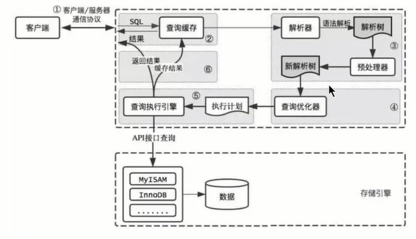

1、连接器进行连接，看是否有权限

2、查询缓存是否有数据，没有

3、分析器进行语句解析，有无错误、关键词提取

4、优化器进行优化，生成执行计划

5、交给执行器，调用执行引擎

### sql语句执行顺序

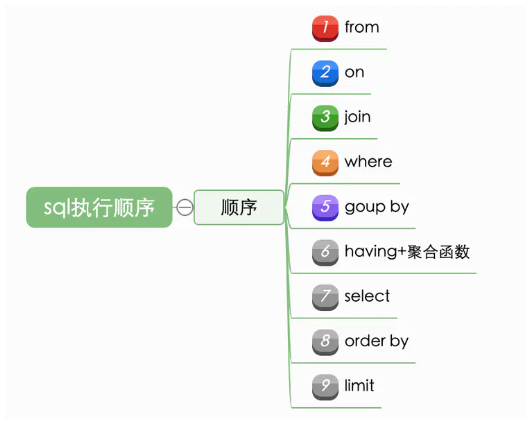

1、from 笛卡尔积

2、通过on筛选

3、通过join插入未匹配的行

4、where过滤

5、分组

6、having过滤

7、然后查询select

8、排序

9、取出指定行记录，返回给用户

## 2、执行引擎

### 执行引擎中，执行流程

1、将数据从磁盘加载到内存中，单位：页64kb。

2、加锁，防止其他人修改

3、写undo log，记录回滚指针，存储数据、以及反向操作

4、执行sql语句，修改内存中数据

5、将所有修改写入 redolog buffer

6、准备阶段，将 redolog、binlog刷盘

7、提交事务commit 完成事务

### 执行引擎分类

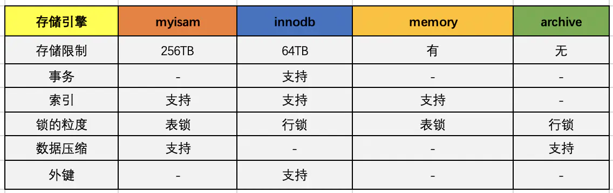

## 3、索引

数据库存储单位是页，每页16kb。三层 1000 x 1000 x 100 就是1千万数据了。

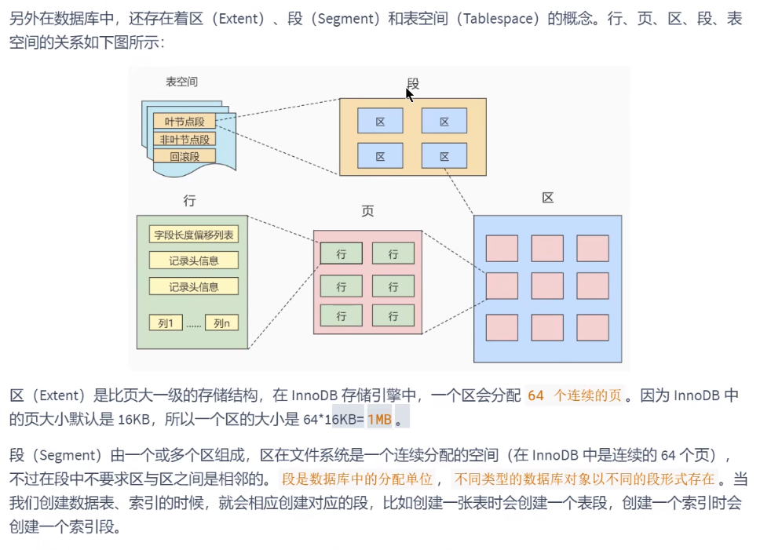


聚簇索引（主键索引）、二级索引（回表）、联合索引

聚簇索引 子节点保存的是每行的具体的数据，比如第2行的a、bc

二级索引 子节点保存的是数据位置，id是多少，自己是多少， 查其他的  再去回表

联合索引 存放的是几个字段的联合值 和 id。比如 name 和 tel  ，根据name查tel 不用回表。

### 索引失效：

**最根本原因就是不知道该往那边去，是左还是右**

1、联合索引的最左匹配原则

2、like %开头

3、使用 > 、< 、!= 等范围搜索

4、使用内置函数

5、优化器不走索引

6、or 有不是索引的字段

### InnoDB的B+树索引

自上而下构建，根节点不变

内节点中目录项记录唯一

一个页面最少存储2条记录

## 4、sql优化

1、**查询优化**

避免select* 全查、多表查询小表驱动大表、优化limit分页，SELECT id FROM t WHERE id > 10000 LIMIT 10;

2、**索引优化**

定期删除无用索引、避免不走索引的情况

3、**表设计**

设置not null，null会有额外存储、

## 5、事务

**四大特性：**ACID 原子性、隔离性、持久性、一致性

### **开启方式**

1、默认开启事务：autocommit 

```mysql
SHOW VARIABLES LIKE 'autocommit';
```

关闭：set autocommit = FALSE ； 针对 DML

2、显示开启事务：start transaction、begin 后面跟 read only / read write（默认）/ with consistent snapshot

链式事务、嵌套事务、分布式事务。

保存点：savepoint，创建中间的备份点

rollback to savepoint、savepoint 保存点名称、release savepoint 保存点名称

### 事务的隔离级别

隔离和并发如何权衡。 一个一个排队影响性能，不排队，影响数据是否正确。

#### 数据并发问题

**脏写**：相当于 A 的修改无效，因为被 B 回滚了。

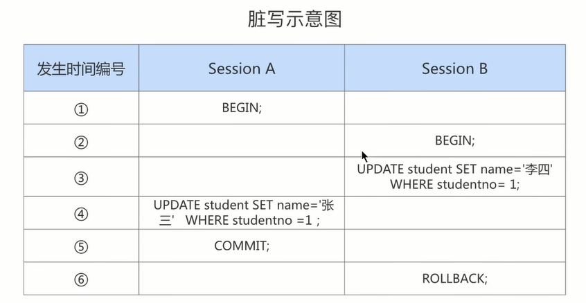

**脏读**：读取的是B中未提交的数据，但是回滚后，数据不存在。

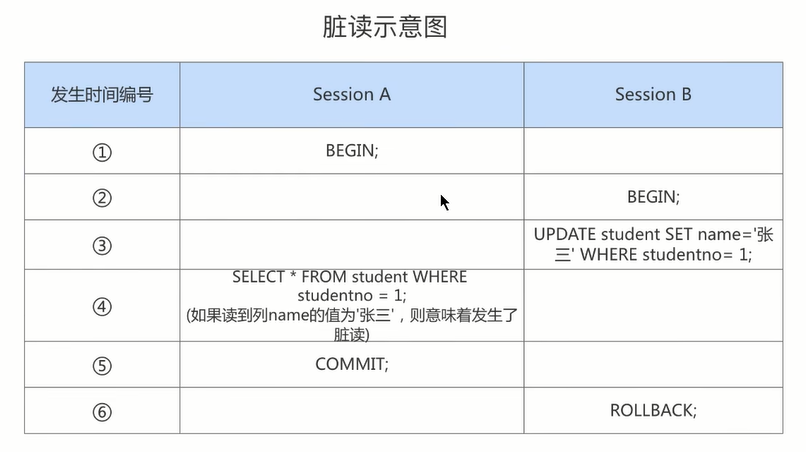

**不可重复读**：A 每次读取的数据都不一样，都是被 B 修改过的。体现不出隔离性

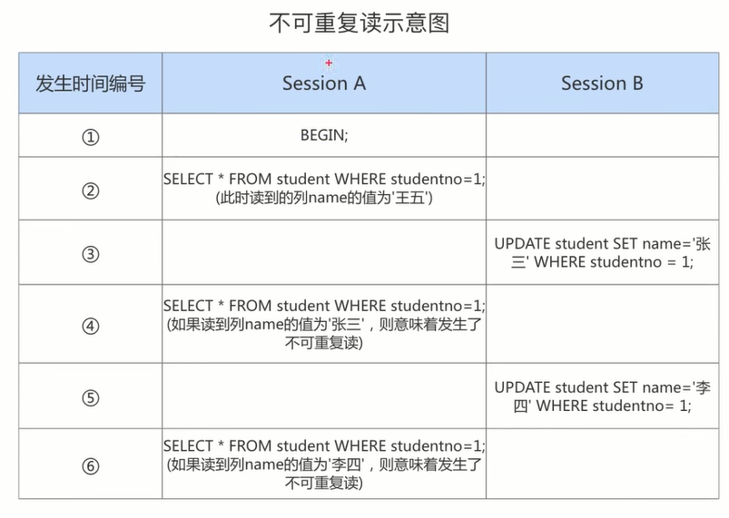

**幻读**：在 A 读取数据的过程中，有其他事务插入了数据，造成了数据读取前后的不一致性。

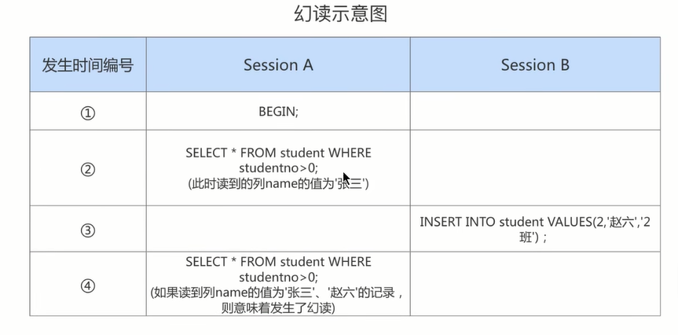

SQL中的四种隔离级别：

1、读未提交

2、读已提交

3、可重复读

4、可串行化

#### 事务日志

redo log 保证持久性。恢复提交事务修改的页操作。

undo log 保证原子性。回滚到某个特定版本。

mvcc 共同保证一致性

redo日志：

以一定的频率刷入磁盘。先写日志，在写磁盘。

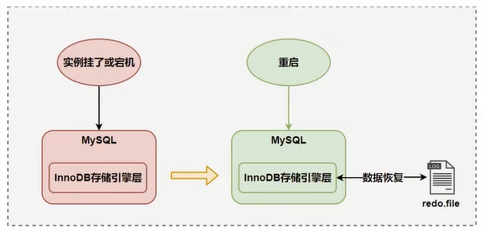

分为**重做日志的缓冲**（redo log buffer）内存中、**重做日志文件**（redo log file）硬盘中。

更新事务流程

 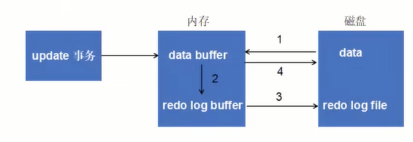


innodb_flush_log_at_trx_commit参数，控制commit提交事务时，将buffer刷到log的策略

1、设置0：每次提交不进行刷盘，由系统默认master thread每隔1s一次。

放飞自我，有丢失的可能，最多丢失一秒以内的事务。

2、设置1：每次提交时都同步，刷盘（默认）。 最安全。

3、设置2：写入page cache（后台每1s写一次到pagecache），交给os决定什么时候同步磁盘。

操作系统挂了，数据有丢失风险，因为是系统的内存。

如果优化，可能考虑使用设置2，时间介于0（最快）和1（最慢）之间。

#### undo日志

在逻辑上进行恢复，不是物理恢复。

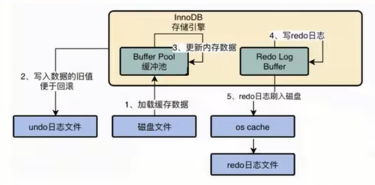

执行 insert，记录delete

执行 delete，记录insert

执行 update，记录旧值，update旧值

提交时，undo log放入列表中，后续purge线程操作删除。

#### undo redo 事务简化过程

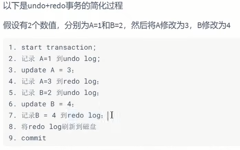

1-8时，宕机如果未提交，不会做任何操作。

8-9时，宕机，可以选择回滚或提交，redo已经持久化。

9后宕机，根据redolog数据刷回磁盘。

### MVCC

**Multi-Version Concurrency Control**，多版本并发控制。同一份数据临时保留多版本的一种方式，进而实现并发控制，简称一致性非锁定读。

**隐藏字段**

为了实现多版本控制，InnoDB 引擎在每一行数据中都添加了几个隐藏字段：

- `DB_TRX_ID`：记录最近一次对本记录做（insert/upadte）的事务 ID，大小为 6 字节；
- `DB_ROLL_PTR`：回滚指针，指向回滚段的 undo log，大小为 7 字节；
- `DB_ROW_ID`：单调递增的行 ID，大小为 6 字节，当表没有主键索引或者非空唯一索引的时候 InnoDB 就用这个字段创聚簇索引，这个字段跟MVCC的实现没有关系。

MVCC 在 InnoDB 的实现依赖 undo log 和 read view。undo log 中记录的是数据表记录行的多个版本，也就是事务执行过程中的回滚段，其实就是MVCC 中的一行原始数据的多个版本镜像数据。read view 主要用来判断当前版本数据的可见性。

**实现逻辑**

| ReadView 字段  | 描述                                                         |
| :------------- | :----------------------------------------------------------- |
| trx_ids        | 在生成 ReadView 时当前系统中活跃的读写事务，即Read View初始化时当前未提交的事务列表。 |
| low_limit_id   | 在生成 ReadView 时当前系统中活跃的读写事务中最小的事务 ID，事务号 >= low_limit_id 的记录，对于当前 Read View 都是不可见的 |
| up_limit_id    | 系统应该给下一个事务分配的 ID 值，事务号 < up_limit_id ，对于当前Read View都是可见的 |
| creator_trx_id | 生成该 ReadView 的事务 ID                                    |

**具体的比较算法如下:**

1. 如果 trx_id < up_limit_id, 那么表明 “最新修改该行的事务” 在 “当前事务” 创建快照之前就提交了，所以该记录行的值对当前事务是可见的。直接标识为可见，返回 true；
2. 如果 trx_id >= low_limit_id, 那么表明 “最新修改该行的事务” 在 “当前事务” 创建快照之后才被创建且修改该行的，所以该记录行的值对当前事务不可见。应该通过回滚指针找到上个记录行版本，判断是否可见。循环往复，直到可见；
3. 如果 up_limit_id <= trx_id < low_limit_id, 那就得通过二分查找判断 trx_id 是否在 trx_ids 列表出现过。
   1. 如果出现过，说明是当前 read view 中某个活跃的事务提交了，那当然是不可见的，应该通过回滚指针找到上个记录行版本，判断是否可见，循环往复，直到可见；
   2. 如果没有出现过，说明这个事务是已经提交了的，表示为可见，返回 true。

### 数据库其他日志

1、慢查询日志：记录所有执行时间超过long_query_time的查询

2、通用查询日志：记录所有连接的起始时间和终止时间，数据库指令，附

3、错误日志：启动、运行、停止时出现的问题

4、二进制日志：记录所有更改数据的语句，用于主从复制间的数据同步，故障时的数据恢复。

## 5、锁

保证隔离性，并发访问一致性。

### 分类

1、操作类型：共享锁、排它锁

2、锁粒度划分：表级锁、行级锁、页级锁

3、态度：悲观锁、乐观锁

4、加锁方式：隐式锁、显示锁

5、其他：全局锁、死锁

#### 表锁

不依赖存储引擎，开销小，并发性差、避免死锁。

**共享锁、排它锁**

**意向锁**：要加表锁，但是不知道有没有行锁，每条遍历很慢，所以在加行锁时会被表加上意向锁，然后要加表锁时，一看有意向锁，就不加了。

自增锁：id自增

**元数据锁**：不改变结构

#### 行锁

锁某一条记录，锁冲突概率低、并发高、开销大、容易出现死锁。

**记录锁**：针对记录加锁

**间隙锁**：防止在区间（间隙）插入数据。可能会导致死锁。

## 6、主从复制


1、首先从库在连接到主节点时会创建一个 IO 线程，用以请求主库更新的 binlog，并且把接收到的 binlog 信息写入一个叫做 relay log 的日志文件中

2、而主库也会创建一个 log dump 线程来发送 binlog 给从库；

3、同时，从库还会创建一个 SQL 线程读取 relay log 中的内容，并且在从库中做回放，最终实现主从的一致性。这是一种比较常见的主从复制方式。

因为随着从库数量增加，从库连接上来的 IO 线程比较多，主库也需要创建同样多的 log dump 线程来处理复制的请求，对于主库资源消耗比较高，同时受限于主库的网络带宽，所以在实际使用中，一般一个主库最多挂 3～5 个从库。

## 7、分库分表

shardingjdbc

# redis

## 1、基础

### 有哪些用

redis是一种key value 的数据存储系统，基于内存，速度很快。

1、缓存数据，减小数据库压力

2、解决分布式数据不一致问题

3、倒计时、定时等，利用有效期

4、分布式锁 setnx、watchdog续期

5、sort类型做排行榜

6、结合业务，做emqx，做消息缓存，减小服务器压力

### 存储的数据类型

**string、hash（{key:"value"}）、list、set、sortedset、geo（地理坐标）、bitmap、hyperlog**

### 底层数据机构

动态字符串、链表、字典、跳跃表、整数集合、压缩列表

## 2、redis持久化 RDB、AOF

### RDB

指定时间生成快照，用于数据备份、恢复、转移。

**原理**：子线程fork主线程数据，然后再进行保存，不保证实时性。fork频率高消耗cpu资源。

**实现**：rdbSave：立刻持久化、阻塞线程，无法提供服务。

​			rdbSaveBackground：后台异步，fork子线程中调用rdbSave。

### AOF

追加操作指令到文件中（类似mysql的redolog）

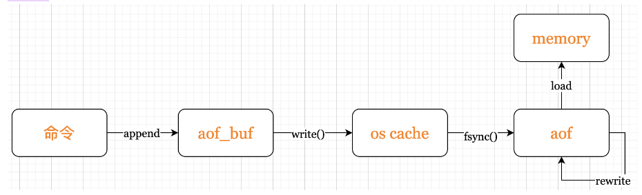

#### RDB vs AOF

##### RDB优点

- RDB是一个紧凑压缩的二进制文件，代表Redis在某一个时间点上的数据快照，非常适合用于备份、全量复制等场景。
- RDB对灾难恢复、数据迁移非常友好，RDB文件可以转移至任何需要的地方并重新加载。
- RDB是Redis数据的内存快照，数据恢复速度较快，相比于AOF的命令重放有着更高的性能。

##### RDB缺点

- RDB方式无法做到实时或秒级持久化。因为持久化过程是通过fork子进程后由子进程完成的，子进程的内存只是在fork操作那一时刻父进程的数据快照，而fork操作后父进程持续对外服务，内部数据时刻变更，子进程的数据不再更新，两者始终存在差异，所以无法做到实时性。
- RDB持久化过程中的fork操作，会导致内存占用加倍，而且父进程数据越多，fork过程越长。
- Redis请求高并发可能会频繁命中save规则，导致fork操作及持久化备份的频率不可控；
- RDB文件有文件格式要求，不同版本的Redis会对文件格式进行调整，存在老版本无法兼容新版本的问题。

##### AOF优点

- AOF持久化有更好的实时性，我们可以选择三种不同的方式（appendfsync）：no、every second、always，every second作为默认的策略具有最好的性能，极端情况下可能会丢失一秒的数据。
- AOF文件只有append操作，无复杂的seek等文件操作，没有损坏风险。即使最后写入数据被截断，也很容易使用`redis-check-aof`工具修复；
- 当AOF文件变大时，Redis可在后台自动重写。重写过程中旧文件会持续写入，重写完成后新文件将变得更小，并且重写过程中的增量命令也会append到新文件。
- AOF文件以已于理解与解析的方式包含了对Redis中数据的所有操作命令。即使不小心错误的清除了所有数据，只要没有对AOF文件重写，我们就可以通过移除最后一条命令找回所有数据。
- AOF已经支持混合持久化，文件大小可以有效控制，并提高了数据加载时的效率。

##### AOF缺点

- 对于相同的数据集合，AOF文件通常会比RDB文件大；
- 在特定的fsync策略下，AOF会比RDB略慢。一般来讲，fsync_every_second的性能仍然很高，fsync_no的性能与RDB相当。但是在巨大的写压力下，RDB更能提供最大的低延时保障。
- 在AOF上，Redis曾经遇到一些几乎不可能在RDB上遇到的罕见bug。一些特殊的指令（如BRPOPLPUSH）导致重新加载的数据与持久化之前不一致，Redis官方曾经在相同的条件下进行测试，但是无法复现问题。

## 3、缓存数据库一致性，延时双删

1、消息队列保证key被删除

2、数据库订阅+消息队列保证key删除

3、延时双删防止脏数据

删缓存、操作数据库、延时删缓存

4、设置缓存过期时间兜底

## 4、redis缓存击穿、穿透、雪崩、解决办法

MySQL 在 4 核 8G 上的 TPS = 5000，QPS = 10000 左右，读写平均耗时 10~100 ms。

**缓存击穿**

key不存在，直接到数据库查询，数据库也没有，多半是恶意攻击。

解决办法：布隆过滤器、缓存null值+过期时间、请求黑名单

**缓存穿透**

热点key值失效，导致大量请求进入数据库。

解决办法：缓存失效时，请求加锁，只有一个可以访问，访问后写缓存，同时其他线程休眠。

伪代码：

```java
public Object getData(String id) {
    String desc = redis.get(id);
        // 缓存为空，过期了
        if (desc == null) {
            // 互斥锁，只有一个请求可以成功
            if (redis(lockName)) {
                try
                    // 从数据库取出数据
                    desc = getFromDB(id);
                    // 写到 Redis
                    redis.set(id, desc, 60 * 60 * 24);
                } catch (Exception ex) {
                    LogHelper.error(ex);
                } finally {
                    // 确保最后删除，释放锁
                    redis.del(lockName);
                    return desc;
                }
            } else {
                // 否则睡眠200ms，接着获取锁
                Thread.sleep(200);
                return getData(id);
            }
        }
}
```

**缓存雪崩**

同一时刻，大量key失效，可能是同时过期或者redis宕机

解决办法：过期时间添加随机值、接口限流、加锁处理。

设置永不过期（物理不过期，直接不设置过期时间。逻辑过期，将过期时间写到value中）

宕机采用集群处理、

## 5、分布式锁

### 实现

**setnx + expire**，可能会造成忘记释放、提前释放等可能。

**redisson框架** 添加 watch dog 可以自动续期

不设置默认 30s，有看门狗负责延期

RLock 普通锁、RReadWriteLock 读写锁。

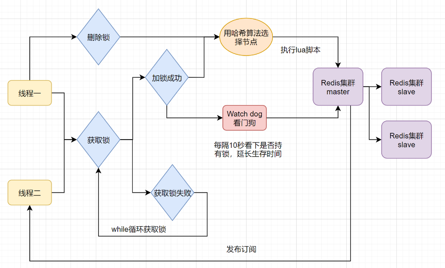

## 6、主从复制、一主多从

1、保存主节点信息

2、从节点建立主节点连接

3、发送ping指令进行通信

4、主节点验证权限认证

5、通信正常，把持有数据全部发给从节点

6、主节点持续发送数据

类似mysql

**全量复制**

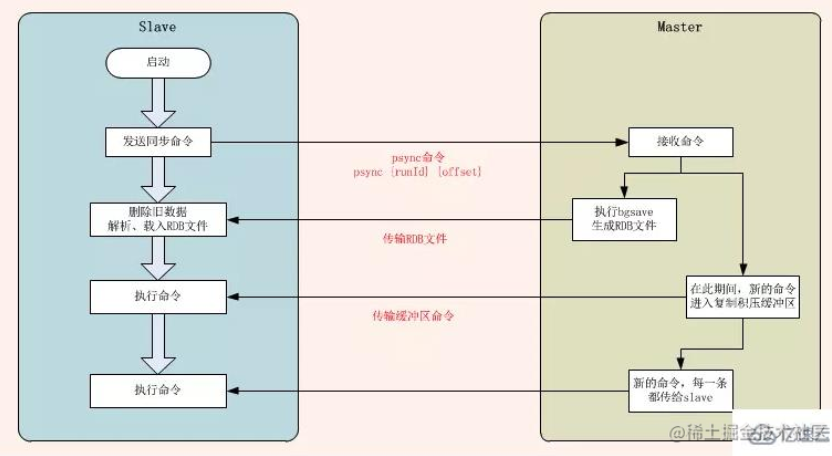

**「①」**slave发送psync，由于是第一次复制，不知道master的runid，自然也不知道offset，所以发送psync ？ -1

**「②」**master收到请求，发送master的runid和offset给从节点。

**「③」**从节点slave保存master的信息

**「④」**主节点bgsave保存rdb文件

**「⑤」**主机点发送rdb文件

并且在**「④」**和**「⑤」**的这个过程中产生的数据，会写到复制缓冲区repl_back_buffer之中去。

**「⑥」**主节点发送上面两个步骤产生的buffer到从节点slave

**「⑦」**从节点清空原来的数据，如果它之前有数据，那么久会清空数据

**「⑧」**从节点slave把rdb文件的数据装载进自身。

**部分复制**

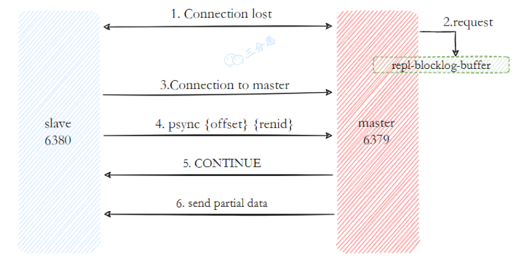

1.当主从节点之间⽹络出现中断时，如果超过repl-timeout时间，主节点会认为从节点故障并中断复制连接

2.主从连接中断期间主节点依然响应命令，但因复制连接中断命令⽆法发送给从节点，不过主节点内部存在的复制积压缓冲区，依然可以保存最近⼀段时间的写命令数据，默认最⼤缓存1MB。

3.当主从节点⽹络恢复后，从节点会再次连上主节点

4.当主从连接恢复后，由于从节点之前保存了⾃⾝已复制的偏移量和主节点的运⾏ID。因此会把它们当作psync参数发送给主节点，要求进行部分复制操作。

5.主节点接到psync命令后⾸先核对参数runId是否与自身一致，如果一致，说明之前复制的是当前主节点；之后根据参数offset在⾃⾝复制积压缓冲区查找，如果偏移量之后的数据存在缓冲区中，则对从节点发送+CONTINUE响应，表示可以进行部分复制。

6.主节点根据偏移量把复制积压缓冲区⾥的数据发送给从节点，保证主从复制进⼊正常状态。

## 7、集群

数据分区：节点取余、一致性hash、虚拟槽分区

## 8、运维

**key删除**：惰性删除、定期删除

**redis阻塞**：

API或数据结构不合理：慢查询（keys *、sort）使用scan、大对象（分散成小对象）

CPU饱和：并发极限、命令/内存

持久化相关的阻塞：fork阻塞、AOF刷盘、

## 9、多级缓存

**缓存策略**

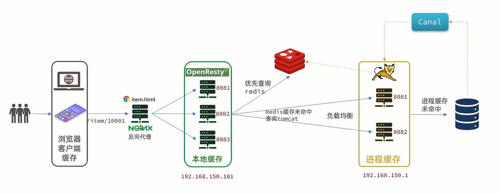

客户端缓存、nginx缓存（使用lua脚本直接查redis）、缓存预热、tomcat处理

缓存预热（使用大数据统计，把常用数据预热到redis中）

**数据同步策略**

直接过期、同步更新（事务中，直接修改）、异步更新（mq消息）

**canal**（ke nai l）

监听mysql的binlog，通知数据修改。通过伪装 slave ，开启主从复制。

整合的springboot依赖：https://github.com/NormanGyllenhaal/canal-client


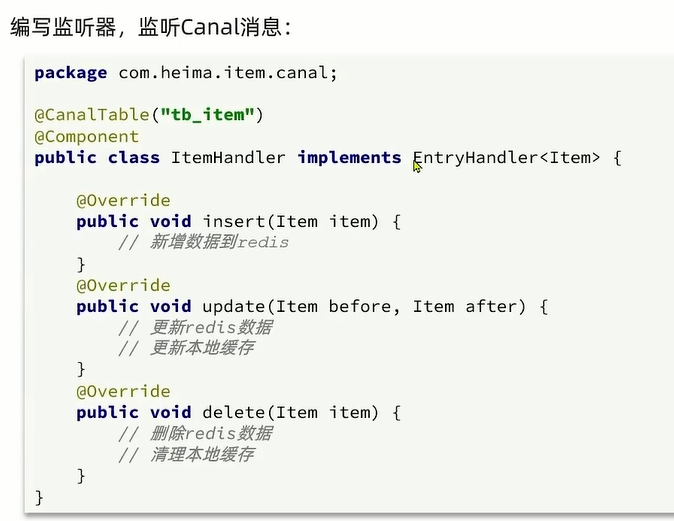


**openresty 获取 http 请求**

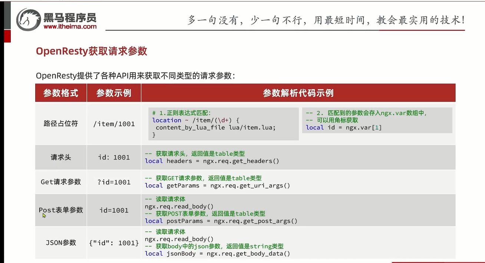


# RabbitMQ

## 1、协议

**AMQP**：高级消息队列，接收消息转发消息。有交换机、队列。

**MQTT**：基于发布订阅、开销小、流量小（固定头部2字节）、使用遗嘱进行下线

**mqtt和amqp协议差别、两种结构具体使用**

## 2、作用

1、削峰填谷、串行变并行

2、异步调用、解耦

3、死信队列、倒计时设计

基于tcp/ip协议基础上，构建的一种约定俗成的协议。

## 3、流程

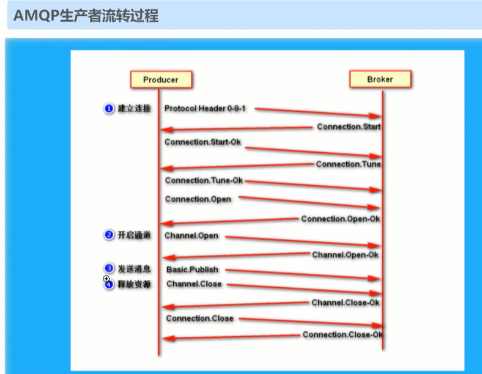

**为什么基于channel去处理而不是连接？**

使用tcp建立通道，采用类似NIO的方式，复用tcp连接，减少性能开销。

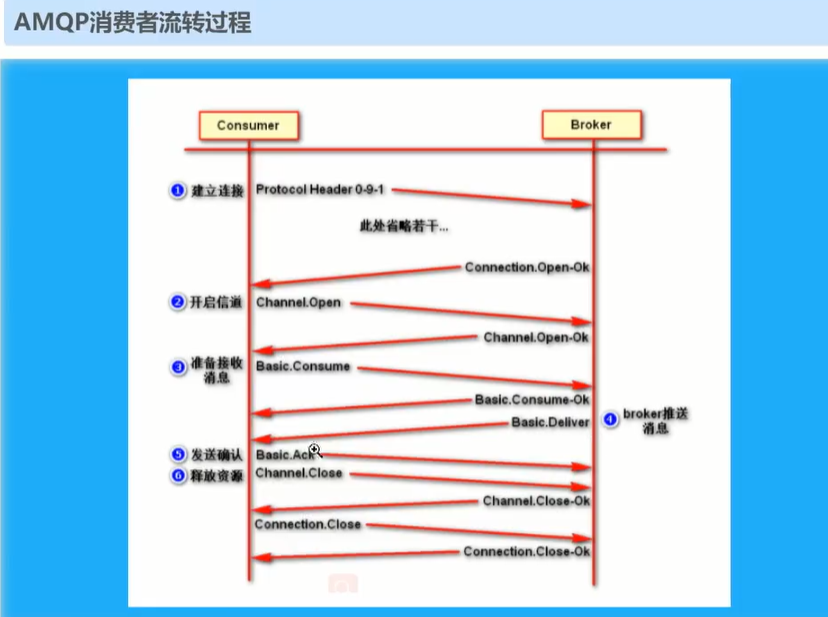

## 4、连接模型


生产者 ->连接（n多信道）-> 交换机 队列（虚拟机节点 隔离）<- 连接（n多信道）<-消费者

交换机投递消息给队列，不指定交换机使用默认交换机

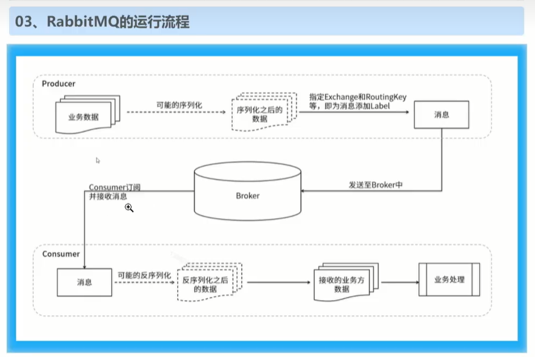

## 5、消息模式

1、简单模式 simple：使用的默认交换机

2、工作模式 work：一对多（一个生产一个交换机一个队列多个消费者）

两种模式：轮询分发（一人一个，不受时间影响）、能者多劳

3、发布订阅模式：创建交换机，绑定队列

4、路由模式：在绑定队列时，设定key，根据条件分发

5、主题topic模式：支持模糊匹配的路由key  #0、1、2、多个 *至少一个

### 信息过期 ttl

队列可以设置过期时间，map.put("x-message-ttl", 5000); // 设置5s超时

消息可以设置过期时间，message.getMessageProperties().setExpiration("5000");

同时设置，以最小的时间为准

如果超过时间，则放入死信队列或者删除（消息过期直接删除），如：订单倒计时

### 死信队列

有死信交换机绑定队列。定义队列时设置参数map.put("x-dead-letter-exchange", "dead");

消息被消费者拒绝接收且requeue=false

消息在队列中过期

队列达到最大长度

### 消息可靠性

消息可能丢失的三个地方（生产者->交换机->队列->消费者）

1、生产者没有投递到交换机

2、交换机没有投递到队列

3、消费者没有处理消息就挂了

**消息保证**

**1、发送方确认机制：**

```java
方式一：channel.waitForConfirms()普通发送方确认模式；
方式二：channel.waitForConfirmsOrDie()批量确认模式；
方式三：channel.addConfirmListener()异步监听发送方确认模式；
```

通常使用方式三

```java
channel.addConfirmListener(new ConfirmListener() {  
    @Override  
    public void handleNack(long deliveryTag, boolean multiple) throws IOException {  
        System.out.println("nack: deliveryTag = "+deliveryTag+" multiple: "+multiple);  
    }  
    @Override  
    public void handleAck(long deliveryTag, boolean multiple) throws IOException {  
        System.out.println("ack: deliveryTag = "+deliveryTag+" multiple: "+multiple);  
    }  
});
```

如果消息发过去没有exchange接收也会作为不成功。

消息找不到接收的exchange或者queue时，可以选择发给生产者去处理：

```java
    public void sendAndReturn() {
        User user = new User();

        log.info("Message content : " + user);

        rabbitTemplate.setReturnCallback((message, replyCode, replyText, exchange, routingKey) -> {
            log.info("被退回的消息为：{}", message);
            log.info("replyCode：{}", replyCode);
            log.info("replyText：{}", replyText);
            log.info("exchange：{}", exchange);
            log.info("routingKey：{}", routingKey);
        });

        rabbitTemplate.convertAndSend("fail",user);
        log.info("消息发送完毕。");
    }
```

**2、消息队列持久化**

创建交换机、队列时，将其设置为持久化。

消息也设置持久化（deliveryMode=2）。

只有持久化的消息才会有确认机制

**3、消费者确认处理消息**

关闭自动应答 ack，改为手动应答，在处理完消息之后。

### 消息幂等性

一个操作多次执行产生的结果与一次执行产生的结果一致。

为了保证消息不被重复消费，首先要保证每个消息是唯一的，所以可以给每一个消息携带一个唯一的id，流程如下：

1、消费者监听到消息后获取消息的MsgId（这个MsgId是我们自定义消息的字段，是主键），先去Redis中查询这个MsgId是否存在。也可以生产者发送消息时指给消息对象设置唯一的 MessageID，只有该 MessageID 没有被消费者存入到Redis中即该消息未被消费，这样重发的消息才能在重试机制中再次被消费。

2、如果不存在，则正常消费消息，并把消息的id存入Redis中。

3、如果存在则丢弃或者拒绝此消息并不返回队列。

## 6、其他

### 消息积压如何处理？

场景题：几千万条数据在MQ里积压了七八个小时。

分析：

1、生产者的生产速度与消费者的消费速度不匹配导致的。

2、消费者出现异常，消息消费失败反复复重试造成的。

方案：

如果是1，要么扩容消费端，要么在生产端限制流量。具体扩容方式可参考如下：

- 临时创建原先 N 倍数量的 queue ，然后写一个临时分发数据的消费者程序，将该程序部署上去消费队列中积压的数据，消费之后不做任何耗时处理，直接均匀轮询写入临时建立好的 N 倍数量的 queue 中；


- 临时征用 N 倍的机器来部署 consumer，每个 consumer 消费一个临时 queue 的数据


- 等快速消费完积压数据之后，恢复原先部署架构 ，重新用原先的 consumer 机器消费消息。

如果是2，则需要修复 consumer 的问题，确保其恢复消费速度，然后在按照1方案执行。

### MQ长时间未处理导致MQ写满的情况如何处理？

如果消息积压在MQ里，并且长时间都没处理掉，导致MQ都快写满了，这种情况肯定是临时扩容方案执行太慢，这种时候只好采用 “丢弃+批量重导” 的方式来解决了。

首先，临时写个程序，连接到mq里面消费数据，消费一个丢弃一个，快速消费掉积压的消息，降低MQ的压力，然后在流量低峰期时去手动查询重导丢失的这部分数据。

或者先写入redis，在慢慢写入数据库。

### 配置文件修改内存大小

```shell
#默认
#vm_memory_high_watermark.relative = 0.4
#使用relative相对值进行设置fraction，建议值在0.4~0.7之间 1代表全部
vm_memory_high_watermark.relative = 0.4
#使用absolute的绝对值方式
#vm_memory_high_watermark.absolute = 2GB
```

## 

# docker

## 1、docker image contain 网络 容积卷 端口

# 高并发、高性能、高可用

**在 4 核 8G 的机器上运 MySQL 5.7 时，大概可以支撑 500 的 TPS 和 10000 的 QPS**。

高并发：大流量

高性能：响应快速

高可用：不宕机，系统具备较高的无故障运行的能力。


可扩展性：弹性扩容

**数据库、缓存、依赖的第三方、负载均衡、交换机带宽等等** 都是系统扩展时需要考虑的因素。我们要知道系统并发到了某一个量级之后，哪一个因素会成为我们的瓶颈点，从而针对性地进行扩展。

解决方案

从请求发起开始，

app客户端缓存拦截、dns服务器、cdn服务、分配最近网络，nginx负载、网关拦截、流量控制、redis缓存、mq消息队列、mysql读写分离、分库分表。

黑名单：

运营商黑名单、服务器黑名单、nginx+redis+lua配置黑名单、网络拦截黑名单、后台查询账号禁用。

## 高并发流量治理：

1、横向扩展，分布式，把大流量分开，分到每一个机器上

2、缓存，减少对数据库的冲击

3、异步，现将请求返回，处理好之后在通知，aio

# 架构


我来解释一下这个分层架构中的每一层的作用：

- 终端显示层：

  各端模板渲染并执行显示的层。当前主要是 Velocity 渲染，JS 渲染， JSP 渲染，移动端展示等。

- 开放接口层：

  将 Service 层方法封装成开放接口，同时进行网关安全控制和流量控制等。

- Web 层：

  主要是对访问控制进行转发，各类基本参数校验，或者不复用的业务简单处理等。

- Service 层：业务逻辑层。

- Manager 层：

  通用业务处理层。这一层主要有两个作用：

  - 其一，你可以将原先 Service 层的一些通用能力下沉到这一层，比如 **与缓存和存储交互策略**，中间件的接入；
  - 其二，你也可以在这一层 **封装对第三方接口的调用，比如调用支付服务，调用审核服务等**。

- DAO 层：

  数据访问层，与底层 MySQL、Oracle、Hbase 等进行数据交互。

- 外部接口或第三方平台：

  包括其它部门 RPC 开放接口，基础平台，其它公司的 HTTP 接口。


# http

1、三次握手、四次挥手

2、https证书加密

# 项目

### 1、springsecurity具体判定流程、jwt存储、token交互，登录拦截、权限认证

### 2、mqtt消息及流量控制

topic分级、设置4个级别

压缩mqtt消息，对具体内容gzip压缩传输

内容播放素材的md5校验，缓存设计。本机缓存的lru算法

中继服务器缓存，每个门店统一放一个，直接让设备请求

下载时间控制，非收银高峰期进行任务下载

### 3、同步播放算法、任务排期算法及优化

### 4、rbac权限模型、如何自定义的权限，

用户 角色 权限  还有一层门店的概念

### 5、openfeign超时时间

连接 10s 读取 60s 超时，并发场景下 大量占用资源，资源耗尽

默认不重试

### cpu飙升问题排查

**常规操作**

1、top找出那个进程cpu高

2、top -Hp pid 找到进程中那个线程cpu高

3、jstack 导出线程堆栈

4、根据16进制查找线程分析方法

如果是定位到自己的代码，则去看逻辑

第三方代码，去看源码

gc就要去看内存、

可能问题：

1、while死循环 链表

2、频繁的 young gc 垃圾回收需要内存和cpu

3、死锁 

4、序列化、反序列化

5、密集的计算  复杂的正则等

#### 内存标高问题排查

1、可以设置heapdump，自动转储文件

2、停掉一台服务器，单独排查（多服务器情况下）

3、测试环境压测

原因：

内存泄漏，静态对象引用，导致局部变量无法释放。io操作没有及时释放。单例模式线程池中的对象引用，threadlocal。

查询过程

```
free -h # linux 命令，看一下总内存使用情况
jmap -histo <进程号> # 查看对象数量和大小
# jmap生成堆转储文件最好不要再线上使用。
jmap -dump:format=b,file=<导出目录+文件名>heap.hprof <进程号> #内存镜像
```

查看虚拟机配置 

java -XX:+PrintFlagsFinal -version

设置堆转储文件  -XX:+HeapDumpOnOutOfMemoryError -XX:HeapDumpPath=E:\Java

**arthas（阿尔萨斯）**：

通过全局视角实时查看应用 load、内存、gc、线程的状态信息

- jvm观察jvm信息
- thread定位线程问题
- dashboard 观察系统情况
- heapdump + jhat分析
- jad反编译
  动态代理生成类的问题定位
  第三方的类（观察代码）
  版本问题（确定自己最新提交的版本是不是被使用）
- redefine 热替换
  目前有些限制条件：只能改方法实现（方法已经运行完成），不能改方法名， 不能改属性
  m() -> mm()
- sc  - search class
- watch  - watch method

### 6、单体架构拆分遇到的问题

相互依赖关系。商品    模板   设备三者关系

一开始模板中写入样板，从商品取数据注入。但是后来商品数据变化也需要出发模板下发。

单独把下发拆成一个模块，商品和模板都把数据给他 推送下来。


# 其他

1、最难的、最有成就感

写排序算法、同步播放算法。

2、怎么解决问题的