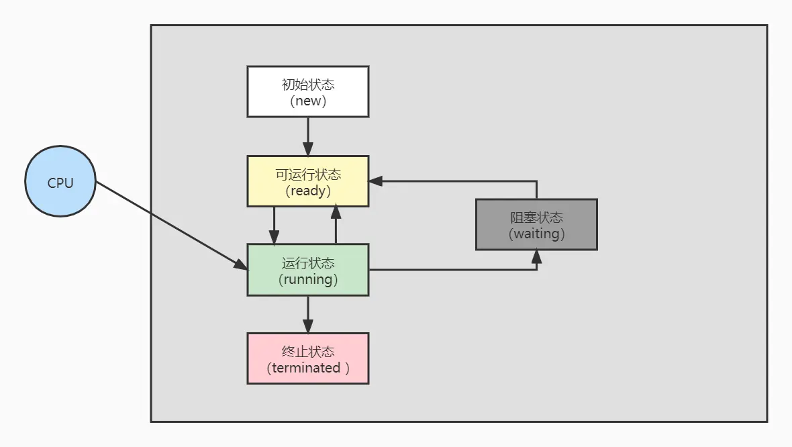

# JUC 并发编程

## 回顾

### 0. java8 函数式编程

runnable、function、consumer（BiConsumer）、supplier

参数、返回，用一个接口代替（接口只能有一个方法）

**作为参数：**

```java
interface DemoI {
    void eat();
}

public static void anyMeth(DemoI demoI) {
    demoI.eat();
}

public static void main(String[] args) {
    anyMeth(new DemoI() {
        @Override
        public void eat() {
		
        }
    });
    // 作为参数
    anyMeth(() -> {

    });
}
```

**作为返回：**

```java
public static DemoI anyMeth2(){
    return new DemoI() {
        @Override
        public void eat() {

        }
    };
}

public static DemoI anyMeth3(){
    // 作为返回
    return () -> {

    };
}
```

#### 1. Supplier

用来获取一个泛型参数指定类型的对象数据

该接口被称为生产型接口，指定接口的泛型是什么类型，那么get方法就会产生什么类型的数据

```java
@FunctionalInterface
public interface Supplier<T> {
    T get();
}
```

作用入参时，可以是一个方法，方法中返回泛型类

```java
public static void main(String[] args) {
    getS(() -> {
        String s = "adb";
        return s + "234";
    });
}

public static String getS(Supplier<String> supplier) {
    return supplier.get();
}
```

#### 2. Consumer

它不是生产一个数据，而是消费一个数据，其数据类型由指定的泛型决定

该接口包含抽象方法`void accept(T t)`，作用是消费一个指定泛型的数据，消费是自定义的(输出、计算....)

```java
@FunctionalInterface
public interface Consumer<T> {
    void accept(T t);
    default Consumer<T> andThen(Consumer<? super T> after) {
        Objects.requireNonNull(after);
        return (T t) -> { accept(t); after.accept(t); };
    }
}
```

#### 3. Predicate

当我们需要对某种类型的数据进行判断，从而得到一个boolean值结果，这时可以使用`java.util.function.Predicate<T>` 接口

```java
@FunctionalInterface
public interface Predicate<T> {

    boolean test(T t);

    default Predicate<T> and(Predicate<? super T> other) {
        Objects.requireNonNull(other);
        return (t) -> test(t) && other.test(t);
    }

    default Predicate<T> negate() {
        return (t) -> !test(t);
    }

    default Predicate<T> or(Predicate<? super T> other) {
        Objects.requireNonNull(other);
        return (t) -> test(t) || other.test(t);
    }

    static <T> Predicate<T> isEqual(Object targetRef) {
        return (null == targetRef)
                ? Objects::isNull
                : object -> targetRef.equals(object);
    }

    @SuppressWarnings("unchecked")
    static <T> Predicate<T> not(Predicate<? super T> target) {
        Objects.requireNonNull(target);
        return (Predicate<T>)target.negate();
    }
}
```

#### 4. Function

`java.util.function.Function<T,R>` 接口为一个转换类型的接口，用来根据一个类型的数据得到另一个类型的数据，T 称为前置条件，R 称为后置条件

```java
@FunctionalInterface
public interface Function<T, R> {
    R apply(T t);

    default <V> Function<V, R> compose(Function<? super V, ? extends T> before) {
        Objects.requireNonNull(before);
        return (V v) -> apply(before.apply(v));
    }

    default <V> Function<T, V> andThen(Function<? super R, ? extends V> after) {
        Objects.requireNonNull(after);
        return (T t) -> after.apply(apply(t));
    }

    static <T> Function<T, T> identity() {
        return t -> t;
    }
}
```


### 1. thread.start() 解析

**最基本的开启线程**

```java
Thread thread = new Thread(() -> {
    // do something...
});
thread.start();
```

start 方法中，最终调用 native 方法开启线程

```java
private native void start0();
```

**native 方法实现**

openjdk 源码地址：https://hg.openjdk.org/

涉及到的类：


在线地址：

https://hg.openjdk.org/jdk8u/jdk8u/jdk/file/7fcf35286d52/src/share/native/java/lang/Thread.c

https://hg.openjdk.org/jdk8u/jdk8u/hotspot/file/69087d08d473/src/share/vm/prims/jvm.cpp

https://hg.openjdk.org/jdk8u/jdk8u/hotspot/file/69087d08d473/src/share/vm/runtime/thread.cpp

JNI 一般与 java 文件一一对应，Thread.java 对应的就是 Thread.c，在 Thread.c 中找打对应方法 JVM_StartThread


JVM_StartThread具体实现在 jvm.cpp 中


方法最后调用 thread.cpp 中 的 Thread::start 方法


thread.cpp 中 的 Thread::start 方法，最终调用系统开启线程


整体图：


### 2. 线程状态

#### 1. 从操作系统上看，有 5 种状态



**【初始状态】**：仅是在语言层面创建了线程对象，还未与操作系统线程关联

**【可运行状态（就绪状态）】**：指该线程已经被创建（与操作系统线程关联），可以由CPU调度执行

**【运行状态】**：指获取了CPU时间片运行中的状态

- 当CPU时间片用完，会从**【运行状态】**切换至**【可运行状态】**，会导致线程上下文切换

**【阻塞状态】**

- 如果调用了阻塞API，如BIO读写文件，这时该线程实际不会用到CPU，会导致线程上下文切换，进入**【阻塞状态】**
- 等BIO操作完毕，会由操作系统唤醒阻塞的线程，转换至**【可运行状态】**
- 与**【可运行状态】**的区别是，对**【阻塞状态】**的线程来说只要它们一直不唤醒，调度器就一直不会考虑调度它们

**【终止状态】**：表示线程已经执行完毕，生命周期已经结束，不会再切换为其它状态

#### 2. 从 java api 来看 是 6 种状态


### 3. 常问

1. 核心线程、最大线程、队列
2. 任务满了的拒绝模式
3. 创建线程池的方法

## 线程

### 1. Runnable


### 2. FutureTask

```java
// 创建线程池
ExecutorService threadPool = Executors.newFixedThreadPool(3);

FutureTask<String> task1 = new FutureTask<>(() -> {
    TimeUnit.MILLISECONDS.sleep(200);
    return "task1 over";
});
// 提交
threadPool.submit(task1);
System.out.println(task1.get());
// 销毁
threadPool.shutdown();
```

**缺点**

**1.get() 会阻塞其他线程**

```java
// 第一种
threadPool.submit(task1);
System.out.println(task1.get());

threadPool.submit(task2);
System.out.println(task2.get());

vs
// 第二种
threadPool.submit(task1);
threadPool.submit(task2);

System.out.println(task1.get());
System.out.println(task2.get());    
```

第一种：时间是 task1+task2

第二种：时间是 max（task1，task2）

如果不愿意等待，可以添加超时设置，到时直接抛异常（TimeoutException）

```java
task3.get(3,TimeUnit.SECONDS)
```


**2.容易造成 cpu 空转**

实际中，并不会直接会用 get()，会轮询判断 task 是否完成（task.isDone()），完成后在调用 get() 获取值。

但这种情况需要定时去查询是否完成，造成 cpu 性能浪费

```
// task3 5s 执行完成
// 每 0.5s 查看是否完成
while (true) {
    if (task3.isDone()) {
        System.out.println(task3.get());
        break;
    } else {
        TimeUnit.MILLISECONDS.sleep(500);
        System.out.println("正在处理中");
    }
}
```


### 3. CompletableFuture

基于 FutureTask 缺点，以及无法处理复杂组合任务（有先后依赖关系），JDK8 设计出 CompletableFuture。提供观察者模式，完成后可以通知监听的一方。

```java
public class CompletableFuture<T> implements Future<T>, CompletionStage<T> 
```

CompletionStage：

- 代表异步计算的某一个阶段，一个完成后触发另一个
- 一个阶段的计算执行可以是一个 Function、Consumer、Runnable
- 可以单个触发，也可以多个阶段一起触发

#### 3.1 四大静态方法调用

1. runAsync 无返回值（是否传入线程池）
   - public static CompletableFuture<Void> runAsync(Runnable runnable)
   - public static CompletableFuture<Void> runAsync(Runnable runnable,Executor executor)
2. supplyAsync 有返回值（是否传入线程池）
   - public static <U> CompletableFuture<U> supplyAsync(Supplier<U> supplier)
   - public static <U> CompletableFuture<U> supplyAsync(Supplier<U> supplier,Executor executor)

不传入线程池时，默认使用 ForkJoinPool 线程池。默认创建的线程数是 CPU 的核数（可通过 JVM option:-Djava.util.concurrent.ForkJoinPool.common.parallelism 设置线程数）。

**main结束 会自动关闭，切记！**

```
import java.util.concurrent.*;

ExecutorService threadPool = Executors.newFixedThreadPool(3);
CompletableFuture<Void> runAsync = CompletableFuture.runAsync(() -> {
    System.out.println(Thread.currentThread().getName());
    try {
        TimeUnit.MILLISECONDS.sleep(200);
    } catch (InterruptedException e) {
        e.printStackTrace();
    }
}, threadPool);
System.out.println(runAsync.get());

CompletableFuture<String> supplyAsync = CompletableFuture.supplyAsync(() -> {
    System.out.println(Thread.currentThread().getName());
    try {
        TimeUnit.MILLISECONDS.sleep(200);
    } catch (InterruptedException e) {
        e.printStackTrace();
    }
    return "supplyAsync";
});
System.out.println(supplyAsync.get());
```

#### 3.2 任务异步回调


**不传、无返 thenRun/thenRunAsync**

**传参、无返 thenAccept/thenAcceptAsync**

**传参、有返 thenApply/thenApplyAsync**

**额外处理、有返 whenComplete**

**额外处理、无返 handle**

**异常处理 exceptionally**

**有无 async 区别：**

**无 async 共用同一个线程池**

**有 async 第一个用传入，第二个用ForkJoin**

#### 3.3 任务异步组合


#### 参考：

[异步编程利器：CompletableFuture详解 ｜Java 开发实战](https://juejin.cn/post/6970558076642394142)

#### 3.4 常用方法

1. 获得结果和触发计算
   - 获取结果：
     - T get：阻塞，可选超时方法
     - T join：
     - T getNow（T valueIfAbsent）：立即获取结果，不阻塞，没算完给传入值
   - 计算：
     - boolean complete（T value）：告诉是否计算完，没算完给传入值
2. 对计算结果进行处理，串行化
   - thenApply
   - handle
3. 对计算结果进行消费，无返回
4. 对计算结果进行选用
5. 对计算结果进行合并

## 锁

### 1. synchronized

修饰 方法、静态方法、代码块

锁当前对象(object)、锁类模板(.class文件)、锁指定对象(object)

.class 只有一份，锁的最高，不管你 new 多少对象，都是可以锁

object 同一个对象是锁一个，但是 new 多个时，不同对象无法相互锁

```
// -c 代码反汇编
javap -c *.class
// -v verbose 输出附加信息
javap -p *.class
```

#### 同步代码块

```
public void add() {
    synchronized (this) {
        i++;
    }
}
```

反编译字节码：

```
public class com.zhangpan.text.TestSync {
  public com.zhangpan.text.TestSync();
    Code:
       0: aload_0
       1: invokespecial #1                  // Method java/lang/Object."<init>":()V
       4: return

  public void add();
    Code:
       0: aload_0
       1: dup
       2: astore_1
       3: monitorenter    // synchronized关键字的入口
       4: getstatic     #2                  // Field i:I
       7: iconst_1
       8: iadd
       9: putstatic     #2                  // Field i:I
      12: aload_1
      13: monitorexit  // synchronized关键字的出口
      14: goto          22
      17: astore_2
      18: aload_1
      19: monitorexit // synchronized关键字的出口
      20: aload_2
      21: athrow
      22: return
    Exception table:
       from    to  target type
           4    14    17   any
          17    20    17   any
}
```

monitorenter 和 moniterexit 两条指令

当执行到monitorenter指令时，线程就会去尝试获取该对象对应的Monitor的所有权，即尝试获得该对象的锁。

当该对象的 monitor 的计数器count为0时，那线程可以成功取得 monitor，并将计数器值设置为 1，取锁成功。如果当前线程已经拥有该对象monitor的持有权，那它可以重入这个 monitor ，计数器的值也会加 1。而当执行monitorexit指令时，锁的计数器会减1。

倘若其他线程已经拥有monitor 的所有权，那么当前线程获取锁失败将被阻塞并进入到_EntryList中，直到等待的锁被释放为止。也就是说，当所有相应的monitorexit指令都被执行，计数器的值减为0，执行线程将释放 monitor(锁)，其他线程才有机会持有 monitor 。

#### 同步方法

```
public synchronized void add(){
       i++;
}
```

反编译字节码：

```
public synchronized void add();
    descriptor: ()V
    flags: (0x0021) ACC_PUBLIC, ACC_SYNCHRONIZED
    Code:
      stack=3, locals=1, args_size=1
         0: aload_0
         1: dup
         2: getfield      #2                  // Field i:I
         5: iconst_1
         6: iadd
         7: putfield      #2                  // Field i:I
        10: return
      LineNumberTable:
        line 5: 0
        line 6: 10
```

方法的 flag 上加入了 ACC_SYNCHRONIZED 的标记位。如果有的话则会尝试获取 monitor 对象锁。

### 2. 底层原理

#### 2.1 monitor 对象


#### 2.2 ObjectMonitor 实现类

每一个实例都会关联一个 monitor 对象，这个对象可以与对象一起创建销毁，也可以在线程获取锁的时候生成。monitor 对象被持有的时候，便处于锁定状态。

在HotSpot虚拟机中，Monitor是由 [ObjectMonitor](https://link.juejin.cn/?target=https%3A%2F%2Fhg.openjdk.java.net%2Fjdk8u%2Fjdk8u%2Fhotspot%2Ffile%2F782f3b88b5ba%2Fsrc%2Fshare%2Fvm%2Fruntime%2FobjectMonitor.hpp) 实现的,它是一个使用C++实现的类，主要数据结构如下：

```
ObjectMonitor() {
    _header       = NULL;
    _count        = 0; //记录个数
    _waiters      = 0,
    _recursions   = 0;  // 线程重入次数
    _object       = NULL;
    _owner        = NULL;
    _WaitSet      = NULL; // 调用wait方法后的线程会被加入到_WaitSet
    _WaitSetLock  = 0 ;
    _Responsible  = NULL ;
    _succ         = NULL ;
    _cxq          = NULL ; // 阻塞队列，线程被唤醒后根据决策判读是放入cxq还是EntryList
    FreeNext      = NULL ;
    _EntryList    = NULL ; // 没有抢到锁的线程会被放到这个队列
    _SpinFreq     = 0 ;
    _SpinClock    = 0 ;
    OwnerIsThread = 0 ;
  }
```

ObjectMonitor 中有五个重要部分，分别为 _ower, _WaitSet, _cxq, _EntryList 和 count。

- **_ower** 用来指向持有monitor的线程，它的初始值为NULL,表示当前没有任何线程持有monitor。当一个线程成功持有该锁之后会保存线程的ID标识，等到线程释放锁后_ower又会被重置为NULL;
- **_WaitSet** 调用了锁对象的wait方法后的线程会被加入到这个队列中；
- **_cxq**  是一个阻塞队列，线程被唤醒后根据决策判读是放入cxq还是EntryList;
- **_EntryList** 没有抢到锁的线程会被放到这个队列；
- **count** 用于记录线程获取锁的次数，成功获取到锁后count会加1，释放锁时count减1。

#### 2.3 具体过程


> 如果线程获取到对象的monitor后，就会将monitor中的ower设置为该线程的ID，同时monitor中的count进行加1. 如果调用锁对象的wait()方法，线程会释放当前持有的monitor，并将owner变量重置为NULL，且count减1,同时该线程会进入到_WaitSet集合中等待被唤醒。
>
> 另外_WaitSet，_cxq与_EntryList都是链表结构的队列，存放的是封装了线程的ObjectWaiter对象。如果不深入虚拟机查看相关源码很难理解这几个队列的作用，关于源码会在后边系列文章中分析。这里我简单说下它们之间的关系，如下：
>
> 在多条线程竞争monitor锁的时候，所有没有竞争到锁的线程会被封装成ObjectWaiter并加入_EntryList队列。 当一个已经获取到锁的线程，调用锁对象的wait方法后，线程也会被封装成一个ObjectWaiter并加入到_WaitSet队列中。 当调用锁对象的notify方法后，会根据不同的情况来决定是将_WaitSet集合中的元素转移到_cxq队列还是_EntryList队列。 等到获得锁的线程释放锁后，又会根据条件来执行_EntryList中的线程或者将_cxq转移到_EntryList中再执行_EntryList中的线程。
>
> 所以，可以看得出来，_WaitSet存放的是处于WAITING状态等待被唤醒的线程。而_EntryList队列中存放的是等待锁的BLOCKED状态。_cxq队列仅仅是临时存放，最终还是会被转移到_EntryList中等待获取锁。
>
> 链接：https://juejin.cn/post/6973571891915128846


### 3. 死锁

本质上是两个线程持有各自的锁，在没有释放的时候都想要获取对方的锁，进入等待状态。

手写一个死锁的例子：

```java
public class DeathLock {
    public static void main(String[] args) {
        // 锁1
        Object object1 = new Object();
        // 锁2
        Object object2 = new Object();

        new Thread(() -> {
            synchronized (object1) {
                System.out.println(Thread.currentThread().getName() + " 持有 obj1 希望获取 obj2");
                synchronized (object2) {
                    System.out.println(Thread.currentThread().getName() + "成功获取 obj2");
                }
            }
        }, "t1").start();
        new Thread(() -> {
            synchronized (object2) {
                System.out.println(Thread.currentThread().getName() + " 持有 obj2 希望获取 obj1");
                synchronized (object1) {
                    System.out.println(Thread.currentThread().getName() + "成功获取 obj1");
                }
            }
        }, "t2").start();
    }
}
```

当发生死锁时，排查方法：

```
// JVM Process Status Tool 获取当前所有 java 进程 pid 命令
jps -l
```

其他方式获取

```
top | grep java
ps -ef | grep java
```


```
//jstack pid 查看堆栈
jstack 15180
```


### 4. 线程中断机制

线程应该由自己进行停止或者中断，在 java 没有立即停止，java 提供了一种用于停止的协商机制——**中断**，中断标识协商机制。

#### 4.1 相关 API 

- **void interrupt()**：仅仅设置正常活动的线程中断状态为 true，发起协商不会立刻停止
- **static boolean interrupted()**：Thread.interrupted()。
  - 返回当前线程的中断状态
  - 清除线程的中断状态，重新设置为 false( 清除 通过 native 方法 private static native void clearInterruptEvent();)
- **boolean isInterrupted()**：返回当前线程的中断状态

底层都是通过 native interrupt0() 方法进行中断操作。

```java
public void interrupt() {
    if (this != Thread.currentThread()) {
        checkAccess();

        // thread may be blocked in an I/O operation
        synchronized (blockerLock) {
            Interruptible b = blocker;
            if (b != null) {
                interrupted = true;
                interrupt0();  // inform VM of interrupt
                b.interrupt(this);
                return;
            }
        }
    }
    interrupted = true;
    // inform VM of interrupt
    interrupt0();
}
private native void interrupt0();
```

#### 4.2 注意

**1.如果线程不活动了，不会产生任何影响。**

**2.异常情况：**

中断标志位 true，但线程调用 sleep、wait、join 等方法，会抛出异常（InterruptedException）

当抛出异常时，会清除中断标志位 false，造成无限循环

需要在 catch 中，再次调用中断方法，设置为 true，才可以停止程序

**sleep 异常例子：**

```java
package com.juc.zz;

import java.util.concurrent.TimeUnit;

public class InterruptDemo {
    public static void main(String[] args) {
        Thread t1 = new Thread(() -> {
            int i = 0;
            while (true) {
                if (Thread.currentThread().isInterrupted()) {
                    // 发现中止标记后 自己要定义处理逻辑
                    System.out.println(Thread.currentThread().getName() + " 标志位停止");
                    break;
                }
                try {
                    // 中断 sleep 状态  会把中断状态清除，同时抛出异常
                    TimeUnit.SECONDS.sleep(1);
                } catch (InterruptedException e) {
                    // 需要在重新进行中断
                    Thread.currentThread().interrupt();
                    e.printStackTrace();
                }
                i++;
                System.out.println("---> hello" + i);
            }
        }, "t1");
        t1.start();

        new Thread(() -> {
            try {
                TimeUnit.SECONDS.sleep(2);
                t1.interrupt();
                System.out.println(Thread.currentThread().getName() + " 设置 t1 中止");
            } catch (InterruptedException e) {
                e.printStackTrace();
            }
        }, "t2").start();
    }
}
```

**wait 异常例子：**

```java
package com.juc.zz;

import java.util.concurrent.TimeUnit;

public class InterruptDemo {
    public static void main(String[] args) {
        Thread t1 = new Thread(() -> {
            while (true) {
                if (Thread.currentThread().isInterrupted()) {
                    // 发现中止标记后 自己要定义处理逻辑
                    System.out.println(Thread.currentThread().getName() + " 标志位停止");
                    break;
                }
                System.out.println("启动");
                synchronized (Thread.currentThread()) {
                    try {
                        System.out.println("等待");
                        Thread.currentThread().wait();
                    } catch (InterruptedException e) {
                        // 异常后需要再次中止
                        Thread.currentThread().interrupt();
                        e.printStackTrace();
                    }
                }
            }
        });
        t1.start();
        
        try {
            TimeUnit.SECONDS.sleep(2);
            System.out.println("中断");
            synchronized (t1) {
                // wait 会抛出异常
                t1.interrupt();
            }
        } catch (InterruptedException e) {
            e.printStackTrace();
        }
    }
}
```


**使用例子：**

```
package com.juc.zz;

import java.util.concurrent.TimeUnit;

public class InterruptDemo {
    public static void main(String[] args) {
        Thread t1 = new Thread(() -> {
            while (true) {
                if (Thread.currentThread().isInterrupted()) {
                    // 发现中止标记后 自己要定义处理逻辑
                    System.out.println(Thread.currentThread().getName() + " 标志位停止");
                    break;
                }
                System.out.println("---> hello");
            }
        }, "t1");
        t1.start();

        new Thread(() -> {
            try {
                TimeUnit.SECONDS.sleep(2);
                t1.interrupt();
                System.out.println(Thread.currentThread().getName() + " 设置 t1 中止");
            } catch (InterruptedException e) {
                e.printStackTrace();
            }
        }, "t2").start();
    }
}
```

#### 4.3 LockSupport 

**阻塞、唤醒实现：**

1.object：wait、notify

2.Lock 的 Condition：await、signal

```java
Lock lock = new ReentrantLock();
Condition condition = new ReentrantLock().newCondition();
condition.await();
condition.signal();
```

3.LockSupport：park、unpark

一个线程阻塞工具类，所有方法都是静态方法，任意位置阻塞、唤醒。

使用 permit（许可）的概念，每个线程都有一个许可（最多一个，不能累加）。

**使用**

```java
package com.juc.zz;

import java.util.concurrent.TimeUnit;
import java.util.concurrent.locks.LockSupport;

public class LockSupportDemo {
    public static void main(String[] args) {
        Thread t1 = new Thread(() -> {
            System.out.println(Thread.currentThread().getName() + " come in");
            LockSupport.park();
            System.out.println(Thread.currentThread().getName() + " 被唤醒");
        }, "t1");
        t1.start();

        try {
            TimeUnit.SECONDS.sleep(2);
            System.out.println("发放通行证给 t1");
            LockSupport.unpark(t1);
        } catch (InterruptedException e) {
            e.printStackTrace();
        }

    }
}
```

**原理解析**

调用 unsafe 的 native 代码


LockSupport 和每个使用它的线程都有一个许可（permit）关联

park：如果有凭证，消耗凭证，正常退出（不阻塞）

如果没有凭证，就必须阻塞等待凭证可用

unpark：增加一个凭证，但凭证最多只有一个，累加无效。

### 其他

#### 1. ReentrantLock 非公平锁

```
// 默认非公平锁 true 公平
ReentrantLock lock = new ReentrantLock(true);
```

为什么默认非公平锁？（核心 减少切换，省cpu时间，减少其他开销）

1. 线程恢复挂起有时间差，不公平减少恢复挂起，可以较少 cpu 空闲
2. 线程切换也需要开销，不公平不需要来回切换，减少开销

**可重入锁**

synchronized 隐式重入，又计数器计数

reentrantLock 显示重入，需要自己加解锁

#### 2. synchronized 和 Lock 的区别？

- Lock是显示锁，需要手动开启和关闭。synchronized是隐士锁，可以自动释放锁。
- Lock是一个接口，是JDK实现的。synchronized是一个关键字，是依赖JVM实现的。
- Lock是可中断锁，synchronized是不可中断锁，需要线程执行完才能释放锁。
- 发生异常时，Lock不会主动释放占有的锁，必须通过unlock进行手动释放，因此可能引发死锁。synchronized在发生异常时会自动释放占有的锁，不会出现死锁的情况。
- Lock可以判断锁的状态，synchronized不可以判断锁的状态。
- Lock实现锁的类型是可重入锁、公平锁。synchronized 实现锁的类型是可重入锁，非公平锁。
- Lock适用于大量同步代码块的场景，synchronized适用于少量同步代码块的场景。

### 5. 锁优化

因为Java虚拟机是通过进入和退出Monitor对象来实现代码块同步和方法同步的，而Monitor是依靠底层操作系统的`Mutex Lock`来实现的，操作系统实现线程之间的切换需要从用户态转换到内核态，这个切换成本比较高，对性能影响较大

## 关键字

### 0. 内存模型 JMM

定义了一种 java 内存模型，屏蔽各种硬件和操作系统的内存访问差异，到达一致的内存访问效果。


规范：原子性、可见性、有序性

#### 可见性 

当一个线程修改了某一个共享变量的值，其他线程是否能够立即知道该变更，JMM 规定所有变量都存储在**主内存**中。

修改时，不直接修改主内存数据，需要拷贝一份到线程的本地内存，修改完成刷新回主内存。


#### 原子性

一个操作过程不可打断的，最小操作单元。即多线程下，操作也不能被其他线程干扰。

#### 有序性

代码不一定会从上到下，有序执行。编译器和处理器会对指令序列进行重新排序，只要最终结果相等，那么执行的执行顺序和代码顺序可以不一致。


#### 多线程先行先发原则 happens-before

1.第一个操作的如果发生在第二个操作之前，那么第一个操作的结果对第二个可见，第一个操作执行顺序排在第二个之前

2.如果重新排序后执行结果和 happens-before 一致，这种排序不非法

### 0. 缓存一致性协议

本质上来说就是数据读取时间大于计算时间，为了让 cpu 充分使用，设计 cpu 缓存，但多核 cpu 会有读取数据不一致问题，所以通过一致性协议来规避问题。

缓存一致性协议就是管理多个 CPU cache 之间数据的一致性。

#### 0.1 四种状态 MESI

协议在每一个 cache line 中维护一个两位的状态 “tag” ，这个 “tag” 在 cache line 的物理地址或者数据后。

四种状态

- M : modified（独占已修改数据）
- E : exclusive（独占未修改数据）
- S : shared（存在一个或多个 cpu cache 中）
- I : invalid（无数据）


|           | CPU是否独占数据 | cacheline数据 | memory数据 | 直接写数据 |
| --------- | --------------- | ------------- | ---------- | ---------- |
| modified  | 是              | 最新          | 最新       | 可以       |
| exclusive | 是              | 最新          | 最新       | 可以       |
| shared    | 否              | 最新          | 最新       | 不可以     |
| invalid   | 否（无数据）    | 无数据        | 最新       | 无数据     |

#### 0.2 六种操作

1. Read。"read" 消息用来获取指定物理地址上的 cache line 数据。
2. Read Response。该消息携带了 “read” 消息所请求的数据。read response 可能来自于 memory 或者是其他 CPU cache。
3. Invalidate。该消息将其他 CPU cache 中指定的数据设置为失效。该消息携带物理地址，其他 CPU cache 在收到该消息后，必须进行匹配，发现在自己的 cache line 中有该地址的数据，那么就将其从 cahe line 中移除，并响应 Invalidate Acknowledge 回应。
4. Invalidate Acknowledge。该消息用做回应 Invalidate 消息。
5. Read Invalidate。该消息中带有物理地址，用来说明想要读取哪一个 cache line 中的数据。这个消息还有 Invalidate 消息的效果。其实该消息是 read + Invalidate 消息的组合，发送该消息后 cache 期望收到一个 read response 消息。
6. Writeback。 该消息带有地址和数据，该消息用在 modified 状态的 cache line 被置换时发出，用来将最新的数据写回 memory 或其他下一级 cache 中。

#### 0.3 状态、操作转换图


根据 MESI 协议消息的发送和接收或者是对数据的读写，cache line 的状态会在 modified ， exclusive , shared , invalid 之间进行转换。


> a. cache 通过 writeback 将数据回写到 memory 或者下一级 cache 中。这时候状态由 modified 变成了 exclusive 。
>
> b. cpu 直接将数据写入 cache line ，导致状态变为了 modified 。
>
> c. CPU 收到一个 read invalidate 消息，此时 CPU 必须将对应 cache line 设置成 invalid 状态 , 并且响应一个 read response 消息和 invalidate acknowledge 消息。
>
> d. CPU 需要执行一个原子的 readmodify-write 操作，并且其 cache 中没有缓存数据。这时候 CPU 就会在总线上发送一个 read invalidate 消息来请求数据，并试图独占该数据。CPU 可以通过收到的 read response 消息获取到数据，并等待所有的 invalidate acknowledge 消息，然后将状态设置为 modifie 。
>
> e. CPU需要执行一个原子的readmodify-write操作，并且其local cache中有read only的缓存数据（cacheline处于shared状态），这时候，CPU就会在总线上发送一个invalidate请求其他cpu清空自己的local copy，以便完成其独自霸占对该数据的所有权的梦想。同样的，该cpu必须收集所有其他cpu发来的invalidate acknowledge之后才能更改状态为 modified。
>
> f. 在本cpu独自享受独占数据的时候，其他的cpu发起read请求，希望获取数据，这时候，本cpu必须以其local cacheline的数据回应，并以read response回应之前总线上的read请求。这时候，本cpu失去了独占权，该cacheline状态从Modified状态变成shared状态（有可能也会进行写回的动作）。
>
> g. 这个迁移和f类似，只不过开始cacheline的状态是exclusive，cacheline和memory的数据都是最新的，不存在写回的问题。总线上的操作也是在收到read请求之后，以read response回应。
>
> h. 如果cpu认为自己很快就会启动对处于shared状态的cacheline进行write操作，因此想提前先霸占上该数据。因此，该cpu会发送invalidate敦促其他cpu清空自己的local copy，当收到全部其他cpu的invalidate acknowledge之后，transaction完成，本cpu上对应的cacheline从shared状态切换exclusive状态。还有另外一种方法也可以完成这个状态切换：当所有其他的cpu对其local copy的cacheline进行写回操作，同时将cacheline中的数据设为无效（主要是为了为新的数据腾些地方），这时候，本cpu坐享其成，直接获得了对该数据的独占权。
>
> i. 其他的CPU进行一个原子的read-modify-write操作，但是，数据在本cpu的cacheline中，因此，其他的那个CPU会发送read invalidate，请求对该数据以及独占权。本cpu回送read response”和“invalidate acknowledge”，一方面把数据转移到其他cpu的cache中，另外一方面，清空自己的cacheline。
>
> j. cpu想要进行write的操作但是数据不在local cache中，因此，该cpu首先发送了read invalidate启动了一次总线transaction。在收到read response回应拿到数据，并且收集所有其他cpu发来的invalidate acknowledge之后（确保其他cpu没有local copy），完成整个bus transaction。当write操作完成之后，该cacheline的状态会从Exclusive状态迁移到Modified状态。
>
> k. 本CPU执行读操作，发现local cache没有数据，因此通过read发起一次bus transaction，来自其他的cpu local cache或者memory会通过read response回应，从而将该 cache line 从Invalid状态迁移到shared状态。
>
> l. 当cache line处于shared状态的时候，说明在多个cpu的local cache中存在副本，因此，这些cacheline中的数据都是read only的，一旦其中一个cpu想要执行数据写入的动作，必须先通过invalidate获取该数据的独占权，而其他的CPU会以invalidate acknowledge回应，清空数据并将其cacheline从shared状态修改成invalid状态。


### 0. 内存屏障

内存屏障 Memory Barrier

参考：https://zhuanlan.zhihu.com/p/125737864

**背景：**

在 缓存一致性协议中，由于需要发消息、等待消息回复、对于 cpu 来说，等待是很长的，所以暂时用一个 store-buffer 来存储等待消息的这个值，cpu 可以先做其他的事情，等收到其他 cpu 的消息后在进行处理。

这样做可以提高 cpu 效率，但是引入了新问题，就是 store-buffer 中如果存储了下一个计算需要使用的值，那么这个值就不是最新的值。

所以引入内存屏障（读、写屏障）来处理这个问题。强制让操作按照顺序执行，不可以跨越。

**含义：**

cpu 或编译器在对内存随机访问的操作中的一个同步点，使得此点之前的所有读写操作都执行之后才可开始执行此点之后的操作，避免代码重新排序。

**硬件层面：**

- **sfence**：即写屏障(Store Barrier)，在写指令之后插入写屏障，能让写入缓存的最新数据写回到主内存，以保证写入的数据立刻对其他线程可见
- **lfence**：即读屏障(Load Barrier)，在读指令前插入读屏障，可以让高速缓存中的数据失效，重新从主内存加载数据，以保证读取的是最新的数据。
- **mfence**：即全能屏障(modify/mix Barrier )，兼具sfence和lfence的功能

**硬件结构**


**JMM 四种策略**


**JMM 四种策略代码：**


### 1. volatile

#### 1.1 修饰变量特点

当写 volatile 变量时，JMM 会将本地内存中的变量立即刷新到主内存中

当读 volatile 变量时，JMM 将本地内存中的变量设置无效，重新回主内存中读取最新共享变量

相当于都从主内存读写变量。（严格来说都是从 store-buffer 刷到 cacheline）

#### 1.2 保证可见性

**volatile 读取过程**


- lock(锁定)：作用于主内存的变量，它把一个变量标识为一条线程独占的状态。
- unlock(解锁)：作用于主内存的变量，它把一个处于锁定状态的变量释放出来，释放后的变量才可以被其他线程锁定。
- read(读取)：作用于主内存的变量，它把一个变量的值从主内存传输到线程的工作内存中，以便随后的load动作使用。
- load(载入)：作用于工作内存的变量，它把read操作从主内存中得到的变量值放入工作内存的变量副本中。
- use(使用)：作用于工作内存的变量，它把工作内存中一个变量的值传递给执行引擎，每当虚拟机遇到一个需要使用到变量的值的字节码指令时将会执行这个操作。
- assign(赋值)：作用于工作内存的变量，它把一个从执行引擎接收到的值赋给工作内存的变量，每当虚拟机遇到一个给变量赋值的字节码指令时执行这个操作。
- store(存储)：作用于工作内存的变量，它把工作内存中一个变量的值传送到主内存中，以便随后的write操作使用。
- write(写入)：作用于主内存的变量，它把store操作从工作内存中得到的变量的值放入主内存的变量中。

**案例：**

```java
package com.juc.zz;

import java.util.concurrent.TimeUnit;

public class VolatileDemo {
    private static boolean flag1 = true;
    private static volatile boolean flag2 = true;

    public static void main(String[] args) throws InterruptedException {
        new Thread(() -> {
            while (flag2) {
            }
            System.out.println("感知 flag1 变化 停止循环 - " + System.currentTimeMillis());
        }, "t1").start();

        TimeUnit.SECONDS.sleep(2);
        flag2 = false;
        System.out.println("flag2 设置 false - " + System.currentTimeMillis());
    }
}
// 不添加 volatile 时，一直死循环
```

#### 1.3 不保证原子性

根据读取过程可知，如果是单 cpu，操作是顺序的，则不会发生问题。但实际的服务器都是多核 cpu，那么就会出现多并发问题。如下图：

当线程1对主内存对象发起 read 操作到 write 操作第一套流程的时间里，线程2都可以进行第二套操作


如：i++ 分为三步（加载、计算、赋值）


举例子：

A 、B 两个线程，共享变量 volatile 修饰，B 先读取变量（5）、+1操作（6），但是在写回的时候，A 线程也进行读取（5）、+1操作（6），并写回主内存，此时，主存更新，通知 B 失效，但是 B 此时进行完成了 +1 操作（通知的晚了），所以写回的也是 6 。


#### 1.4 保证顺序性

**总结：读之后，写之前 的顺序不能乱**


**volatile 读释义：**


**volatile写释义：**


案例：


#### 1.5 使用

1. 单一赋值，含有运算赋值不可以（i++）
2. 状态标记，boolean 这种
3. 开销比较低的读，写锁策略
4. DCL 双端锁（double check lock）

## CAS（compareAndSet）

### 0. Unsafe 类介绍

参考文章：https://zhuanlan.zhihu.com/p/82257645

Unsafe 类可以进行内存指针相关的操作（类似 c 直接控制内存）

#### 1. 相关 API 

开辟内存：allocateMemory 

扩充内存：reallocateMemory 

释放内存：freeMemory

在指定的内存块中设置值：setMemory 

未经安全检查的加载Class：defineClass

原子性的更新实例对象指定偏移内存地址的值：compareAndSwapObject 

获取系统的负载情况：getLoadAverage，等同于 linux 中的 uptime 不调用构造函数来创建一个类的实例：allocateInstance

#### 2. compareAndSwapInt

```java
/**
 * Atomically update Java variable to <tt>x</tt> if it is currently
 * holding <tt>expected</tt>.
 * 如果对象o指定offset所持有的值是expected，那么将它原子性的改为值x。
 * @return <tt>true</tt> if successful
 */
public final native boolean compareAndSwapInt(Object o, long offset,
                                              int expected,
                                              int x);
```

在OpenJDK中可以看到这个方法的native实现，在unsafe.cpp中。

```c
UNSAFE_ENTRY(jboolean, Unsafe_CompareAndSwapInt(JNIEnv *env, jobject unsafe, jobject obj, jlong offset, jint e, jint x))
  UnsafeWrapper("Unsafe_CompareAndSwapInt");
  // #1
  oop p = JNIHandles::resolve(obj);
  // #2
  jint* addr = (jint *) index_oop_from_field_offset_long(p, offset);
  // #3
  return (jint)(Atomic::cmpxchg(x, addr, e)) == e;
UNSAFE_END
```

代码#1将目标对象转换为oop，oop是本地实现中oopDesc类的实现，其定义在oop.hpp中。oopDesc是所有class的顶层baseClass，它描述了Java object的格式，使Java object中的field可以被C++访问。

代码#2负责获取oop中指定offset的内存地址，指针变量addr记录的就是这个地址中存储的int值。

代码#3调用Atomic::cmpxchg来原子性的完成值得替换。

#### 3. getAndAddInt

```java
/**
 * Atomically adds the given value to the current value of a field
 * or array element within the given object <code>o</code>
 * at the given <code>offset</code>.
 *
 * @param o object/array to update the field/element in
 * @param offset field/element offset
 * @param delta the value to add
 * @return the previous value
 * @since 1.8
 */
public final int getAndAddInt(Object o, long offset, int delta) {
    int v;
    do {
        v = getIntVolatile(o, offset);
    } while (!compareAndSwapInt(o, offset, v, v + delta));
    return v;
}
```

while 中的 compareAndSwapInt() 方法尝试修改 v 的值,具体地, 该方法也会通过obj和offset获取变量的值 如果这个值和v不一样, 说明其他线程修改了obj+offset地址处的值, 此时compareAndSwapInt()返回false, 继续循环 如果这个值和v一样, 说明没有其他线程修改obj+offset地址处的值, 此时可以将obj+offset地址处的值改为v+delta, compareAndSwapInt()返回true, 退出循环 Unsafe类中的compareAndSwapInt()方法是原子操作, 所以compareAndSwapInt()修改obj+offset地址处的值的时候不会被其他线程中断

### 1. 基础

CAS 是 jdk 提供的 非阻塞的原子性操作，通过硬件保证了比较-更新的原子性。

#### 1.1 原理

CAS 是一条指令（cmpxchg 指令），当执行时（具体由 Unsafe 类执行 native 底层），多核系统会给总线加锁，只有一个线程会对总线加锁成功，成功后执行 cas 操作（其他线程在执行时，不一致就会重新获取值在执行），实际上是 cpu 独占实现的，不需要内核切换，比 synchronized 消耗资源少。

#### 1.2 手写 CAS 锁

```java
package com.juc.zz;

import java.util.concurrent.TimeUnit;
import java.util.concurrent.atomic.AtomicReference;

public class CASDemo {
    AtomicReference<Thread> threadAtomicReference = new AtomicReference<>();

    public void lock() throws InterruptedException {
        Thread thread = Thread.currentThread();
        System.out.println(thread.getName() + " com in...");
        while (!threadAtomicReference.compareAndSet(null, thread)) {
            TimeUnit.MILLISECONDS.sleep(200);
            System.out.println(thread.getName() + " 自旋等待");
        }
    }

    public void unLock() {
        Thread thread = Thread.currentThread();
        threadAtomicReference.compareAndSet(thread, null);
        System.out.println(thread.getName() + " task over, unlock...");
    }

    public static void main(String[] args) throws InterruptedException {
        CASDemo demo = new CASDemo();

        new Thread(new Runnable() {
            @Override
            public void run() {
                System.out.println("线程 A 休眠开始");
                try {
                    demo.lock();
                    TimeUnit.SECONDS.sleep(2);
                } catch (InterruptedException e) {
                    e.printStackTrace();
                }
                System.out.println("线程 A 休眠结束");
                demo.unLock();
            }
        }, "A").start();
        TimeUnit.MILLISECONDS.sleep(500);
        new Thread(new Runnable() {
            @Override
            public void run() {
                System.out.println("线程 B 休眠开始");
                try {
                    demo.lock();
                    TimeUnit.SECONDS.sleep(2);
                } catch (InterruptedException e) {
                    e.printStackTrace();
                }
                System.out.println("线程 B 休眠结束");
                demo.unLock();
            }
        }, "B").start();
    }
}

```


#### 1.3 存在问题

1.cpu 空转，浪费性能

2.ABA 问题：添加版本号，类似于

#### 1.4 常用原子引用类

##### 1. 基本类型原子类

```java
// 可以原子方式更新的值 boolean
AtomicBoolean
// 可以原子方式更新的 int值
AtomicInteger
// 可以原子方式更新的 long值
AtomicLong
```

常用方法

```
public final int get();
public final int getAndSet(int new Value);
public final int getAndIncrement();
public final int getAndDecrement();
public final int getAndAdd(int delta);
public comapreAndSet(int expect,int update);
```

##### 2. 数组类型原子类

```java
// 一个 int数组，其中元素可以原子方式更新
AtomicIntegerArray
// 一个 long数组，其中元素可以原子方式更新
AtomicLongArray
// | 一组对象引用，其中元素可以原子方式更新
AtomicRreferenceArray
```

##### 3. 引用类型原子类

```java
// 可以原子方式更新的对象引用
AtomicReference
// AtomicStampedReference维护一个对象引用以及一个整数“标记”，可以原子方式更新
AtomicStampedReference
// AtomicMarkableReference维护一个对象引用以及一个标记位，可以原子方式更新
AtomicMarkableReference
```

AtomicStampedReference 携带版本号的引用类型原子类，可以解决ABA问题。解决修改过几次的问题

AtomicMarkableReference 解决是否修改过，它的定义就是将`状态戳`**简化**为`true|false`，类似一次性筷子

**AtomicReference 例子**

```java
package com.juc.zz;

import java.util.concurrent.atomic.AtomicInteger;
import java.util.concurrent.atomic.AtomicReference;

public class CASDemo {
    public static void main(String[] args) {
        // 常用 AtomicInteger 等
        AtomicReference<User> atomUser = new AtomicReference<>();
        
        User u1 = new User("zhangsan", 10);
        User u2 = new User("lisi", 15);

        atomUser.set(u1);
        boolean b = atomUser.compareAndSet(u1, u2);
        System.out.println("操作---" + b + " 当前值---" + atomUser.get().toString());
    }
}

class User {
    public User(String name, int age) {
        this.name = name;
        this.age = age;
    }

    @Override
    public String toString() {
        return "User{" +
                "name='" + name + '\'' +
                ", age=" + age +
                '}';
    }

    private String name;
    private int age;
}

```

##### 4. 对象的属性修改原子类

```java
// 原子更新对象中int类型字段的值
AtomicIntegerFieldUpdater
// 原子更新对象中Long类型字段的值
AtomicLongFieldUpdater
// 原子更新引用类型字段的值
AtomicReferenceFieldUpdater
```

**使用目的**

以一种线程安全带 方式操作非线程安全对象内的某些字段

**使用要求**

1. 更新的对象属性必须使用 public volatile 修饰符
2. 因为对象的属性修改类型原子类都是抽象类，所以每次使用都必须使用静态方法 newUpdater() 创建一个更新器，并且需要设置想要更新的类和属性

如果使用 synchronized，这种方法虽然安全了，但是锁的粒度太大了我只是修改money却把我真个bankAccount对象都给锁了

```java
class BankAccount {

    String bankName = "CCB";

    public int money = 0;
    
    public synchronized void add() {
        money ++;
    }
}

/**
 * @author zjh
 */
public class AtomicReferenceFieldUpdaterDemo {

    public static void main(String[] args) throws InterruptedException {

        BankAccount bankAccount = new BankAccount();
        CountDownLatch countDownLatch = new CountDownLatch(10);

        for (int i = 0; i < 10; i++) {
            new Thread(() -> {
                try {
                    for (int j = 0; j < 1000; j++) {
                        bankAccount.add();
                    }
                } finally {
                    countDownLatch.countDown();
                }
            }, String.valueOf(i)).start();
        }

        countDownLatch.await();
        System.out.println(Thread.currentThread().getName() + "\t" + "result：" + bankAccount.money);
    }
}
```

**AtomicReferenceFieldUpdater**

这块只针对 money 字段进行了原子操作

```java
class BankAccount {

    String bankName = "CCB";
    
    // 更新的对象属性必须使用public volatile修饰符
    public volatile int money = 0;
    
    // 因为对象的属性修改类型原子类都是抽象类，所以每次使用都必须使用静态方法newUpdater()创建一个更新器，并且需要设置想要更新的类和属性
    AtomicIntegerFieldUpdater<BankAccount> atomicIntegerFieldUpdater =
            AtomicIntegerFieldUpdater.newUpdater(BankAccount.class,"money");

    public void add(BankAccount bankAccount) {
        atomicIntegerFieldUpdater.getAndIncrement(bankAccount);
    }
}

/**
 * @author zjh
 */
public class AtomicReferenceFieldUpdaterDemo {

    public static void main(String[] args) throws InterruptedException {

        BankAccount bankAccount = new BankAccount();
        CountDownLatch countDownLatch = new CountDownLatch(10);

        for (int i = 0; i < 10; i++) {
            new Thread(() -> {
                try {
                    for (int j = 0; j < 1000; j++) {
                        bankAccount.add(bankAccount);
                    }
                } finally {
                    countDownLatch.countDown();
                }
            }, String.valueOf(i)).start();
        }

        countDownLatch.await();
        System.out.println(Thread.currentThread().getName() + "\t" + "result：" + bankAccount.money);
    }
}
```

##### java 8 新增

```java
// 前面所讲的几种类型java5就有了，下面这些是java8才有的
DoubleAccumulator
DoubleAdder
LongAccumulator
LongAdder
```


### 使用总结

#### AtomicLong

1. 线程安全，可允许一些性能损耗，要求高精度时可使用
2. 保证精度，性能代价
3. AtomicLong是多个线程针对单个热点值value进行原子操作

#### LongAdder

1. 当需要在高并发下有较好的性能表现，且对值的精确度要求不高时，可以使用
2. 保证性能，精度代价
3. LongAdder是每个线程拥有自己的槽，各个线程一般只对自己槽中的那个值进行CAS操作

原理：分散到多个 cell 中进行累加操作，取最终值时，再进行累加求和


LongAdder 的扩展类

LongAdder 只能从 0 开始，做加法，一些有初始值和其他计算方法无法实现，可以使用 LongAccumulator

```java
LongAdder longAdder = new LongAdder();
longAdder.increment();
longAdder.increment();
longAdder.increment();
longAdder.increment();
System.out.println(longAdder.sum());

LongAccumulator longAccumulator = new LongAccumulator(new LongBinaryOperator() {
    @Override
    public long applyAsLong(long left, long right) {
        // 自定义计算规则
        return left + right;
    }
// 自定义初始值
}, 10);

longAccumulator.accumulate(1);
longAccumulator.accumulate(3);
System.out.println(longAccumulator.get());
```


#### 总结

AtomicLong

1. 原理
   CAS+自旋
2. 场景
   低并发下的全局计算，AtomicLong 能保证并发情况下计数的准确性，其内部通过 CAS 来解决并发安全性的问题
3. 缺陷
   高并发后性能急剧下降，AtomicLong 的自旋会称为瓶颈（N个线程CAS操作修改线程的值，每次只有一个成功过，其它N - 1失败，失败的不停的自旋直到成功，这样大量失败自旋的情况，一下子cpu就打高了。）

LongAdder

1. 原理
   CAS + Base + Cell 数组分散，空间换时间并分散了热点数据
2. 场景
   高并发的全局计算
3. 缺陷
   sum 求和后还有计算线程修改结果的话，最后结果不够准确

## ThreaLocal

主要解决了让每个线程有自己的值，通过 get set 方法，获取修改值的副本，避免线程安全问题。

继承关系


为何使用软引用？为什么导致内存泄露？

四种对象引用（强软弱虚）


强：oom 也不回收，new 对象都是

软：不足回收，够了不回收 

```JAVA
SoftReference<Object> softReference = new SoftReference<>(new Object());
```

弱：gc 一启动，马上就回收（高速缓存、预览图片）

```java
WeakReference<Object> weakReference = new WeakReference<>(new Object());
```

虚：用的很少

引用关系


1.为什么不是强引用？

强引用时，如果对应的 threadlocal 对象销毁时，有 map 中的 key 指向它，这会导致对象无法销毁，造成内存泄露，弱引用则可一定程度避免。

2.为什么还可能泄露？

线程池一般都是复用，造成大量的 null -> value 冗余，还会泄露。

使用完 要调用 remove 清除无效引用。

3.为什么不直接使用 map，还要用 threadlocal 包装

只有 map，那么只能保存一个 value，而可以通过 new 多个 threadlocal 进行分别保存，类似：

```
userLocal -> 
t1 : userA
t2 : userB
t3 : userC
nameLocal -> 
t1 : nameA
t2 : nameB
t3 : nameC
```

4.为什么不放在 thread 中维护

threadlocalmap 不一定会使用，会增加成本。通过 threadlocal 管控。

## 内存布局

### 对象组成

对象头、实例数据、对齐填充

#### 对象头

类型指针：类型信息模板，来自于哪里 class 的内容


分代年龄是 4 位，所以就是 0-15 ，配置大于 15 时，启动失败。

压缩指针，默认开启

#### jol 工具

全称：java object layout，展现 java 对象

使用：pom 引入

```xml
<dependency>
            <groupId>org.openjdk.jol</groupId>
            <artifactId>jol-core</artifactId>
            <version>0.9</version>
</dependency>
```

```java
public class Test {

    public static void main(String[] args) {
        // 虚拟机详细信息
//        System.out.println(VM.current().details());
//        # Running 64-bit HotSpot VM.
//        # Using compressed oop with 3-bit shift.
//        # Using compressed klass with 3-bit shift.
//        # Objects are 8 bytes aligned.
//        # Field sizes by type: 4, 1, 1, 2, 2, 4, 4, 8, 8 [bytes]
//        # Array element sizes: 4, 1, 1, 2, 2, 4, 4, 8, 8 [bytes]
    }
}
```

对象信息

```java
 // 打印 object 对象信息
Object o = new Object();
System.out.println(ClassLayout.parseInstance(o).toPrintable());
```


打印内存等配置信息

```java
java -XX:+PrintCommandLineFlags -version
```


#### synchronized和对象头说明


偏向锁：线程id

轻量锁：指向线程栈中 lock record 指针

关于 lock record 指针：JVM 为每个线程在当前栈帧中创建存储锁记录的空间，称为 displaced mark word，如果是轻量级锁，会把锁的 markword 复制到 displaced mark word 中，线程使用 cas 将锁的 markword 替换为指向锁记录的指针。成功则获取锁，失败，则自旋。

重量锁：堆中 monitor 对象指针

#### markword 对象头对照


代码对照


#### 查看偏向锁配置

15默认关闭、17废弃，因为繁琐，维护成本高

```java
java -XX:+PrintFlagsInitial | grep BiasedLock*
```


#### 偏向锁、轻量锁、重量锁，hashcode 保存在哪里？

当一个对象已经计算过一致性哈希码后，它就再也无法进入偏向锁状态了;而当一个对象当前正处于偏向锁状态，又收到需要计算其一致性哈希码请求时，它的偏向状态会被立即撤销，并且锁会膨胀为重量级锁

在重量级锁的实现中，对象头指向了重量级锁的位置，代表重量级锁的ObiectMonitor类里有字段可以记录非加锁状态（标志位为“01”）下的Mark Word，其中自然可以存储原来的哈希码。

### 锁升级


锁消除

每个线程一个锁，jit 无视它，没有用，消除了锁的作用

锁粗化

方法中首尾相接，前后都是一个锁对象，会合并成一个大块

## AQS

抽象队列同步器，主要解决锁分配给谁的问题。通过抽象的 FIFO 队列来完成资源获取线程的排队工作，并通过一个 int 类变量表示持有锁的状态


关于 node 节点类的字段含义


#### ReentrantLock

```
lock.lock();
```

addWaiter 线程加入等待队列


acquireQueued 抢占不成阻塞


-1表示后面一个节点阻塞了，有唤醒下一个节点的责任

```
lock.unlock();
```

tryRelease 尝试释放


unparkSuccessor 解锁线程


cancelAcquire 取消，可能不排了，取消了之后的处理

