# React

# 路线图

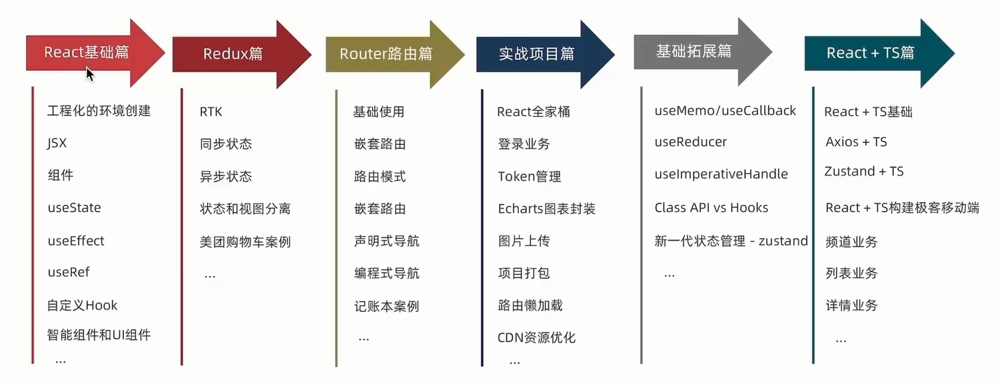

# 基础

## 1.创建

1.create-react-app 快速搭建环境（类似 spring-boot interlize）创建项目，底层由 webpack 构建

命令：

```react
npx create-react-app react-basic
// npx node.js 工具命令
// create-react-app 核心包（固定）
// react-basic 项目名称
```

2.目录结构

package.json 包管理文件

index.js 程序入口

渲染路径 App -> index.js -> public/index.html（root）

## 2.JSX

JavaScript 和 XML 缩写，在 js 代码中写 html 模板

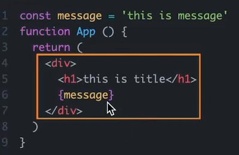

编译过程

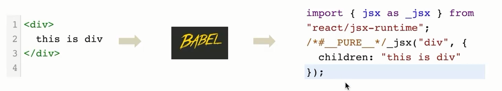

**JSX 中使用 JS 表达式**

大括号 {} 识别 js 表达式，常见

1. 字符串
2. js 变量
3. 函数/方法调用
4. 使用 js 对象

注意：if、switch、变量声明属于语句，不是表达式，不能出现在 {} 中

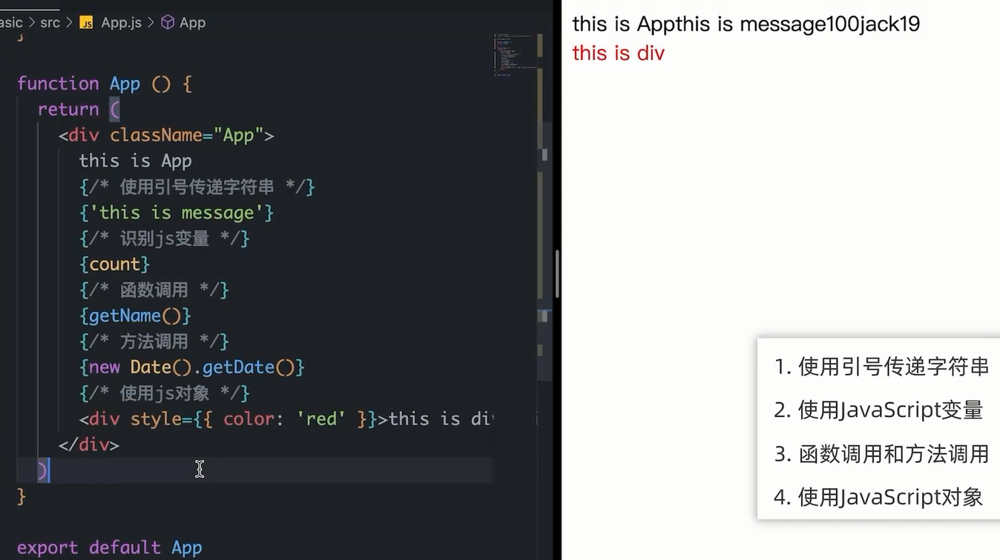

**列表渲染**

使用 js map 方法遍历渲染列表

```react
const list = [
  { id: 1001, name: 'vue' },
  { id: 1002, name: 'react' },
  { id: 1003, name: 'angular' }
]
<ul>
    {list.map(item =>
              <li key={item.id}>
                  {item.name}
              </li>)}
</ul>
```

**条件渲染**

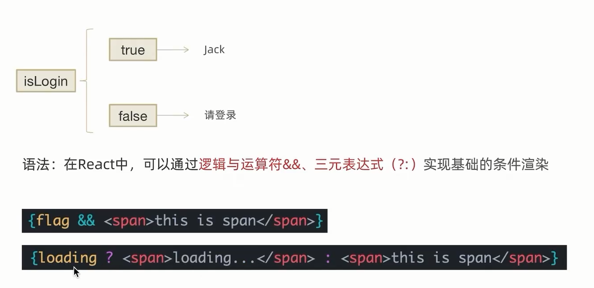

**复杂情况**

通过函数和 if 判断

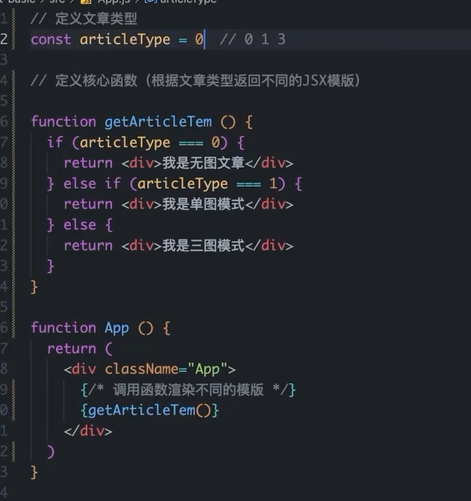

## 3.事件绑定

语法：on + 事件名称 = { 事件处理程序 }

```react
function App() {
  const clickHandle = () => {
    console.log('按钮点击')
  }
  return (
    <div className="App">
      <button onClick={clickHandle}>按钮</button>
    </div>
  );
}
```

自定义函数

```react
function App() {
  // e element
  const clickHandle = (name, e) => {
    console.log(name + '按钮点击')
  }
  return (
    <div className="App">
      <button onClick={(e) => clickHandle('abc',e)}>按钮</button>
    </div>
  );
}
```

```react
// 错误写法 直接写 相当于是方法调用 不是绑定方法
<button onClick={clickHandle('abc')}>按钮</button>
```

## 4.组件

抽取通用 view ，引入使用

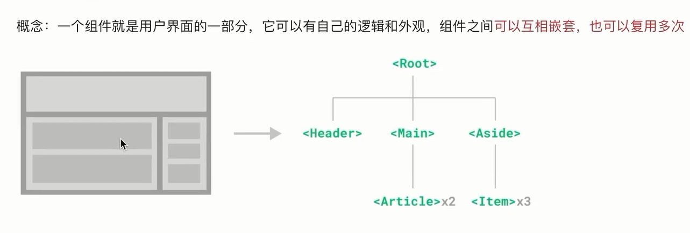

```react
function Button() {
  return <button>组件按钮</button>
}
function App() {
  return (
    <div className="App">
      <Button />
    </div>
  );
}
```

## 5.useState

React Hook（函数），添加一个状态变量，影响组件的渲染结果（数据驱动视图）

类似于 mvvm 的刷新

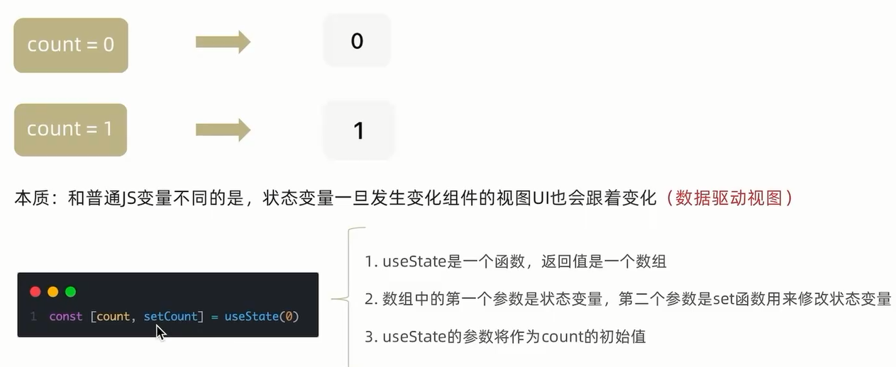

注意：状态不可改

> 状态被认为是只读的，始终要替换它，而不是修改它，修改不会引起视图更新

## 6.组件样式

两种方式

1.行内样式（不推荐）

```react
<p style={{ color: 'red' ,fontSize: '20px'}}>红色标签</p>
```

2.class 类名控制

index.css 定义样式（样式抽取）

```css
.foo{
    color: rgb(0, 21, 255)
}
```

使用时，直接 className 引入

```react
import './index.css'; 
<p className="foo">蓝色标签</p>
```

## 7.受控表单绑定

useState 控制表单状态，视图和数据的绑定


```react
import { useState } from 'react';

function App() {
  const [value, setValue] = useState('');


  return (
    <div className="App">
      <h1>欢迎</h1>
      <input value={value} onChange={(e) => setValue(e.target.value)}></input>
    </div>
  );
}

export default App;
```

## 8.react 获取 DOM

使用 useRef 钩子函数

1.创建 ref 对象（useRef），并与 jsx 绑定

2.DOM 可用时，通过 inputRef.current 拿到 DOM 对象

```react
import { useState, useRef } from 'react';
import dayjs from 'dayjs';

function App() {
  const inputRef = useRef(null);

  const showDown = () => {
    console.log(inputRef.current);
    console.dir(inputRef.current);
    inputRef.current.focus();
  }
  return (
    <div className='App'>
      <input type='text' ref={inputRef} />
      <button onClick={showDown} >点击</button>
      <p>{dayjs(new Date()).format()}</p>
    </div>
  );
}
export default App;
```

## 9.组件通信

组件之间的数据传递

### 父传子

props 可以传递任意类型

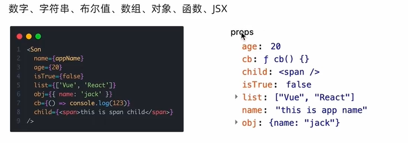

支持开放和封闭标签传递数据，开放标签默认使用 children 名字（多个时会变成数组）

```react
export default Compone;

function Son(props) {
    return (
        <div> 这是封闭子标签 {props.namea}</div>
    );
}

function Child(props) {
    console.log(props)
    return (
        <div> 这是开放子标签 {props.children[1]}</div>
    );
}

function Compone() {
    const value = '这是传递的数据';
    return (
        <div>
            这是父组件
            <Son namea={value} />
            <Child>
                <span>这是span标签</span>
                sldiaj
            </Child>
        </div>
    );
}
```

### 子传父

父组件写接受方法，然后把方法传递给子组件，子组件调用方法传递数据

```react
import { useState } from "react";

export default Son;

// function Child(props) {
//     props.onGetMsg('传递的数据');
//     return <div>
//         这是子组件
//     </div>
// }

function Child({ onGetMsg }) {
    const msg = '传递的数据';
    return <div>
        这是子组件
        <button onClick={() => onGetMsg(msg)}>传递数据</button>
    </div>
}
function Son() {
    const [msg, setMsg] = useState('');
    const getMsg = (msg) => {
        console.log('接收到的数据' + msg);
        setMsg(msg);
    }
    return (
        <div>
            子传父通信,{msg}
            <Child onGetMsg={getMsg} />
        </div>);
}
```

### 兄弟组建通信

通过子传父，父在传子进行数据传递，类似 父 view 中转

### context 机制跨层级组件通信

步骤：（系统封装的对象，可以到处流转binder通信）

1. createContext创建一个上下文对象 ctx
2. 顶层组件（app）通过 ctx.Provider 提供数据
3. 底层组件（B）通过 useContext 钩子函数获取数据

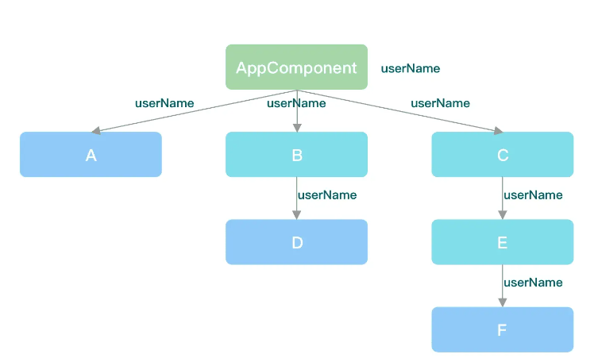

context -> context1 -> context2 嵌套

context 给 context2 传递数据

context.js

```react
import { createContext } from "react";
import Context1 from "./context1";

export default Context;
export const Ctx = createContext();

function Context() {
    const value = '我是传递的数据';
    return (
        <div>
            我是context
            <Ctx.Provider value={value}>
                <Context1 />
            </Ctx.Provider>
        </div>
    );
}
```

context1.js

```react
import Context2 from "./context2";

export default Context1;

function Context1() {
    return (
        <div>
            我是context1
            <Context2 />
        </div>
    );
}
```

context2.js

```react
import { useContext } from "react";
import { Ctx } from "./context"

function Context2() {
    const ctx = useContext(Ctx);
    return (
        <div>
            我是context2
            <p>
                {ctx}
            </p>
        </div>
    );
}
export default Context2;
```

## 10.useEffect

创建不是又事件引起而是由渲染本身引起的操作（view 初始化完成，onstart 里面 http 请求），比如：发送 ajax、更改 dom

语法：`useEffect(() => { },[])`

参数 1 是一个函数，可叫做副作用函数，内部放置要执行的操作

参数 2 是一个数组（可选），放置依赖，不同依赖影响第一个参数执行，若空，只执行一次

```react
import { useEffect, useState } from "react";

const URL = '/gzh/web/weChatMiniProgram/v2/faq/list/1';
function App() {
    const [list, setList] = useState([]);
    async function getList() {
        const res = await fetch(URL);
        const resJson = await res.json();
        console.log(resJson);
        setList(resJson.data);
    }

    useEffect(() => {
        getList();
    }, [])

    return (
        <div>
            加载数据。。。
            <ul>
                {list.map(item =><li key={item.id}>{item.faqTitle}</li>)}
            </ul>
        </div>
    );
}

export default App;
```

**依赖参数说明**

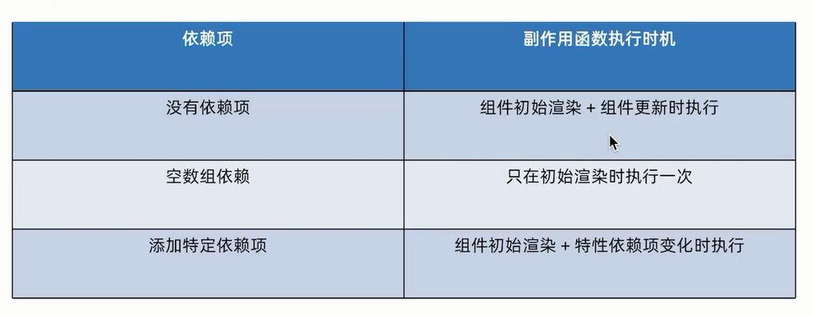

**清理副作用**

组件卸载时，自动清理组件里面的东西（定时器），否则会内存泄露

```react
import { useEffect, useState } from "react";
function Son() {
    useEffect(() => {
        const timer = setInterval(() => {
            console.log('定时执行中。。。')
        }, 1000);

        return () => { 
            clearInterval(timer);
        }
    }, [])
    return (
        <div>
            这是 son 组件
        </div>
    );
}

function Clear() {
    const [flag, setFlag] = useState(true);
    return (
        <div>
            {flag && <Son />}
            <button onClick={() => { setFlag(false) }}>关闭</button>
        </div>
    );
}

export default Clear;
```

## 11.自定义 Hook

通用方法抽取出来，进行统一调用

```react
import { useState } from "react";

function useToggle() {
    const [value, setValue] = useState(true)
    const toggle = () => {
        setValue(!value)
    }

    return {
        value, toggle
    }
}

function Hook() {
    const { value, toggle } = useToggle();
    return (
        <div>
            hook相关<br />
            {value && <div>测试显示隐藏</div>}
            <button onClick={toggle}>按钮</button>
        </div>
    );
}

export default Hook;
```

react hook 使用规则

1.不可以在组件外使用

2.不可以在 if for 组件内部使用


