# web开发

js

合约开发、部署、调用

vue+web3+solidity

## 区块链

区块 + 链

**特征**

去中心化：对等网络每个节点即是服务器又是客户端

共识机制：PoW（工作量证明，算题）、PoS

不可篡改：修改数据会影响整个链的其他数据

**类型**

公链、私链、联盟链、混合链


**记账挖矿**


**共识机制**

- PoW：工作量证明
- PoS：权益证明机制
- PoA：权威证明机制
- PoC：容量证明机制
- CPoC：有条件的容量证明机制

## ETH

智能合约 Solidity 语言

### infura地址

https：

- https://mainnet.infura.io/v3/eb5886c723264071aa5eb6ca988c10df
- https://goerli.infura.io/v3/eb5886c723264071aa5eb6ca988c10df
- https://sepolia.infura.io/v3/eb5886c723264071aa5eb6ca988c10df

websocket：

- wss://mainnet.infura.io/ws/v3/eb5886c723264071aa5eb6ca988c10df
- wss://goerli.infura.io/ws/v3/eb5886c723264071aa5eb6ca988c10df
- wss://sepolia.infura.io/ws/v3/eb5886c723264071aa5eb6ca988c10df

### web3 简介

官方提供的一个连接以太坊区块链的模块，使用 http、ipc 与本地或远程以太坊节点进行交互，包含以太坊生态的所有功能。

连接以太坊暴露出来的 PRC 层，可以连接任何暴露的节点，从而与区块链交互。

JavaScript API 叫 web3.js，还有 web3.py 等

- web3.eth：用于以太坊区块链和智能合约之间的交互
- web3.utils：一些辅助方法
- web3.shh：用于协议进行通信的 P2P 和广播
- web3.bzz：用于与群网络交互的 Bzz 模块

**相关地址**：

github地址：https://github.com/web3/web3.js

开发文档：https://web3js.readthedocs.io/en/v1.10.0/

中文文档：https://learnblockchain.cn/docs/web3.js/

**常用 api**：

需要先实例化 web3 相当于 java new 对象

```vue
// 实例化
var web3 = new Web3(Web3.givenProvider || "wss://goerli.infura.io/ws/v3/cb7e63cf28244e4499b4b6fb6162e746");
```

#### 1.创建账户

script 中写逻辑

```vue
<script setup>
// 导包
import { ref } from 'vue';
import Web3 from 'web3';
// 创建账户 参数-密码 可不填 
const account = web3.eth.accounts.create('123456');
// 账户对象 
console.log(account);
// 获取地址 "0x4C2a92E7CC53Ea722FC9B816b108D87ccB701aDc"
console.log(account.address);
// 获取私钥 "0xc4c81dd272f1b73682da85b93ba4bd0318dff02f2e2d8f35bb4672ef97ee4c62"
console.log(account.privateKey);
</script>
```

#### 2.余额获取

script 中写逻辑

```vue
<script setup>
// 先固定一个账户
const address = ref('0x0aD25a2B10C80DCabBd2baF3edf93aE752112018');

// 获取余额 异步获取需要使用 then
const mount = ref(-1);
web3.eth.getBalance(address.value).then((res) => {
    mount.value = res;
});
</script>
```

template 中可直接使用显示

```vue
<template>
    <h1>
        账户信息
    </h1>
    <p>
        地址：{{ address }}
    </p>
    <p>
        私钥：0x56484b333f965e581cf7576a32a73f1cf8483def6ed8f555ab060a3148902cad
    </p>
    <p>
        余额：{{ mount }}
    </p>
</template>
```

#### 3.单位转换

单位：wei 是最小的单位

- Kwei(Babbage) = 10**3 Wei
- Mwei(Lovelace) = 10**6 Wei
- Gwei(Shannon) = 10**9 Wei
- Microether(Szabo) = 10**12 Wei
- Milliether(Finney) = 10**15 Wei
- Ether = 10**18 Wei 最小单位
- **Ether = 10\**9 Gwei** 小狐狸 gas 使用计量单位

可使用 web3 对象 或者静态方法

```vue
// Eth 转 wei
const num1 = Web3.utils.toWei("0.31","wei");
const num2 = web3.utils.toWei("0.32","wei");
// wei 转 Eth
const num3 = Web3.utils.fromWei("2100000000","ether");
const num4 = web3.utils.fromWei("2200000000","ether");
```

#### 4.转账

4.1 加密用到的包

```vue
npm install ethereumjs-tx@1.3.7
```

加密包版本问题，需要导入一个插件

```vue
// 安装
npm i node-polyfill-webpack-plugin
// vue.config 引入
const NodePolyfillWebpackPlugin = require("node-polyfill-webpack-plugin");
module.exports = defineConfig({
  transpileDependencies: true,
  configureWebpack: {
    plugins: [
      new NodePolyfillWebpackPlugin(),
      CompentsPlugin({ resolvers: [VantResolver()] })]
  }
})
```

4.2 转账的参数准备

```vue
// 获取交易次数 nonce
const nonce = await web3.eth.getTransactionCount(address.value);
// 获取预计转账 也可以直接给出固定值 gas 单位 单位：wei
const gasPrice = await web3.eth.getGasPrice();

// 参数
var txObject = {
	// 交易的次数 每次加一
	nonce: web3.utils.toHex(nonce),
	gasPrice: web3.utils.toHex(web3.utils.toWei('10', 'gwei')),
	gasLimit: web3.utils.toHex(21000),
	to: '0x428E78b1642fa63e160a8af5DF3934001BA14a18',
	// 转账金额
	value: web3.utils.toHex(web3.utils.toWei('0.012', 'ether')),
}
```

4.3 私钥

```vue
// 私钥处理 注意 去掉 0x 开头 否则报错
const pKey = Buffer(primaryKey.value.slice(2), "hex");
const privateKey = Buffer.from('56484b333f965e581cf7576a32a73f1cf8483def6ed8f555ab060a3148902cad', 'hex');
```

4.4 使用 ethereumjs-tx 加密数据

```vue
import Tx from 'ethereumjs-tx';
或
const Tx = require('ethereumjs-tx');

// 创建对象
const tx = new Tx(txObject);
// 使用秘钥签名
tx.sign(privateKey);
// 获取数据
const serializedTx = tx.serialize();
// 转 hex 拼接 0x
const signedTransactionData = '0x' + serializedTx.toString('hex');
```

4.5 发起转账

```vue
const trans = web3.eth.sendSignedTransaction(serializedTx);
// 监听事件
// 交易hash
trans.on("transactionHash", (txid) => {
	console.log('交易id：', txid);
	console.log(`https://sepolia.etherscan.io/tx/${txid}`);
});
// 节点确认 只触发一次
trans.on("receipt", (res) => {
	console.log("第一个节点确认", res);
});
// 节点确认 多节点确认
trans.on("confirmation", (res) => {
	console.log("第n个节点确认", res);
});
```

### 账户系统

#### 助记词创建账户

bip39 协议将助记词转换成 seed 种子，通过 ethereumjs-wallet 生成 hd 钱包，根据路径的不同从 hd 钱包获取不同的 keypair（扩展公钥、私钥），keypair 生成 wallet 管理账户，wallet 有地址、私钥等全部信息。

助记词可以获取所有关联的账号，获取到公钥、私钥、地址等数据信息。


1.依赖库：

`npm install bip39 ethereumjs-wallet ethereumjs-util`

bip39 生成助记词

ethereumjs-wallet 私钥、钱包相关

2.导入相关包

```vue
import * as bip39 from 'bip39';
import ethwallet, { hdkey } from 'ethereumjs-wallet';
```

3.开始

```vue
// bip 39 生成助记词
const mnemonic = bip39.generateMnemonic();
console.log(mnemonic);
// const mnemonic = ref("good castle artefact joy dinosaur ginger fog exist save mention include fish");

// 根据助记词生成 seed 种子
const seed = await bip39.mnemonicToSeed(mnemonic.value);

// 根据种子生成 hdWallet
const hdWallet = hdkey.fromMasterSeed(seed);

// hdWallet 生成秘钥对 keypair
const keypair = hdWallet.derivePath("m/44'/60'/0'/0/1");
// console.log(keypair);

// keypair 获取钱包账户 从而获取所有的信息
const wallet = keypair.getWallet();
```

**derivePath**

> BIP44 则是为这个路径约定了一个规范的含义(也扩展了对多币种的支持)，BIP0044 指定了包含 5 个预定义树状层级的结构：
> **m / purpose' / coin' / account' / change / address_index**
> m 是固定的, Purpose 也是固定的，值为 44（或者 0x8000002C）
> **Coin type**
> 这个代表的是币种，0 代表比特币，1 代表比特币测试链，60 代表以太坊
> 完整的币种列表地址：https://github.com/satoshilabs/slips/blob/master/slip-0044.md
> **Account**
> 代表这个币的账户索引，从 0 开始
> **Change**
> 常量 0 用于外部(收款地址)，常量 1 用于内部（也称为找零地址）。外部用于在钱包外可见的地址（例如，用于接收付款）。内部链用于在钱包外部不可见的地址，用于返回交易变更。 (所以一般使用 0 )
> **address_index**
> 这就是地址索引，从 0 开始，代表生成第几个地址，官方建议，每个 account 下的 address_index 不要超过 20
>
> 根据  EIP85 提议的讨论以太坊钱包也遵循 BIP44 标准，确定路径是 **m/44'/60'/a'/0/n**
> a 表示帐号，n 是第 n 生成的地址，60 是在 SLIP44 提案中确定的以太坊的编码。所以我们要开发以太坊钱包同样需要对比特币的钱包提案 BIP32、BIP39 有所了解。

4.钱包账户获取私钥 privateKey、秘钥仓库 keystore（json 格式）

```vue
// 地址 校验地址 私钥
const lowerCaseAddress = wallet.getAddressString();
console.log('钱包地址' + lowerCaseAddress);

const checkAddress = wallet.getChecksumAddressString();
console.log('校验地址' + checkAddress);

const priKey = wallet.getPrivateKey().toString('hex');
console.log('私钥---' + priKey);

// 导出 keystore 需要设置密码
const keystore = await wallet.toV3('111111');
console.log('keystore---' + JSON.stringify(keystore));
```

5.秘钥仓库 keystore 获取地址

```vue
// keystore 获取地址
// 其实就是 keystore 转换成 wallet
const walletFromKeystore =await ethwallet.fromV3(keystore, '111111');
console.log('地址---' + walletFromKeystore.getAddressString());
```

6.私钥 privatekey 获取地址

```vue
// privatekey 获取地址
// 其实就是 privatekey 转换成 wallet
const priKeyBuffer = Buffer(priKey, 'hex');
const walletFromPrikey = ethwallet.fromPrivateKey(priKeyBuffer);
console.log('地址---' + walletFromPrikey.getAddressString());
```

## 实战

### 1.编写一个智能钱包

#### 基础准备

**环境准备**

- 工具：vscode
- 环境：node.js 

**创建项目**

1.安装 vue cli `npm install -g @vue/cli` 地址： (https://cli.vuejs.org/zh/#%E8%B5%B7%E6%AD%A5)

2.生成项目 `vue create web-wallet`，执行结果如下：


3.选择自定义操作，选择如下：


4.版本选择：


5.CSS 样式选择：


6.单独配置文件：


7.是否保存配置：**选No**（否则后面没法选了）


创建完成后可使用 `npm run serve` 运行，运行完成可点击链接打开


#### web3相关包引入 

1.安装 web3.js： 

```vue
npm install web3 bip39 ethereumjs-tx@1.3.7 ethereumjs-util ethereumjs-wallet
```

2.实例化：

```vue
var web3 = new Web3(Web3.givenProvider || "ws://localhost:8545");
```

3.获取以太坊网络的节点地址

infura 提供公开的主网和测试网节点，infura.io 注册即可获取地址

#### 配置 vant-ui ui 组件库 （可选）

地址：https://vant-contrib.gitee.io/vant/#/zh-CN

1.安装：npm=node package manager 、i=install

```vue
npm install vant
npm install unplugin-vue-components -D
```

2.在 vue.config.js 配置插件

```vue
const { defineConfig } = require('@vue/cli-service')
++ const { VantResolver } = require('unplugin-vue-components/resolvers')
++ const CompentsPlugin = require('unplugin-vue-components/webpack')
module.exports = defineConfig({
  transpileDependencies: true,
++  configureWebpack: {
++    plugins: [CompentsPlugin({ resolvers: [VantResolver()] })]
++  }
})
```

3.测试 在 app.vue 文件添加代码

```vue
<button>创建钱包</button>
// 替换为
<van-button type="primary">创建钱包</van-button>
```

#### 垫片包（低版本兼容高版本）

否则无法使用 ethereumjs-tx@1.3.7

1.安装

```vue
npm i node-polyfill-webpack-plugin
```

2.vue.config.js 配置

```vue
++ const NodePolyfillWebpackPlugin = require("node-polyfill-webpack-plugin");
module.exports = defineConfig({
  transpileDependencies: true,
  configureWebpack: {
    plugins: [
++      new NodePolyfillWebpackPlugin(),
      CompentsPlugin({ resolvers: [VantResolver()] })]
  }
})
```

#### 存储工具类 store2

```vue
npm install store2
```

# openbuild

## 杂

1.部署智能合约

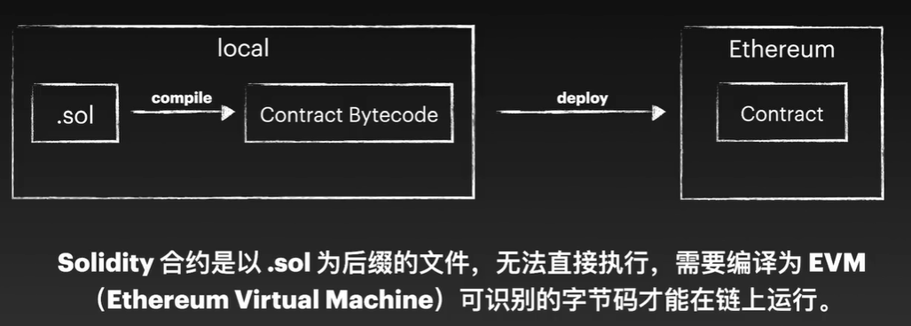

2.开发框架

brownie（python）：简洁 py 语法，便于本地调试与部署测试

hardhat（javascript）：丰富插件，适合复杂的合约项目

foundry（solidity）：使用 solidity 编写合约、测试和脚本

3.工具

Remin IDE：完整的 IDE、变异、部署、调试、节点环境、账户等

Anvil/Ganache：提供一个虚拟区块链网络，可通过 ide 或工具框架与之交互，适合有一定规模的项目进行本地调试测试

others：metamask、infura、openzeppelin、chainlink

## solidity

### 数据类型

基本：boolean、int、uint、address、bytes

枚举：enum

数组：array

```solidity
// 定义数组类型
uint[7] public arr;
// 添加数据
arr.push(7);
// 删除最后一个数据
arr.pop();
// 删除某个索引值数据
delete arr[1];
// 获取数组长度
uint len = arr.length;
```

mapping

```solidity
// 定义嵌套 mapping 类型
mapping(string => mapping(string => string)) nestedMap;
// 设置值
nestedMap[id][key] = '0707';
// 读取值
string value = nestedMap[id][key];
// 删除值
delete nestedMap[id][key];
```

struct

```solidity
contract Struct{
	struct Data{
		string id;
		string hash;
	}
	Data public data;
	// 添加数据
	function create(string calldata _id) public {
		data = Data{id: _id, hash: "1232134"};
	}
	// 更新数据
	function update(string _id) public {
		// 查询数据
		string id = data.id;
		// 更新
		data.hash = "22223444";
	}
}
```

变量：

local内存、state链上、global全局

关键字：

storage链上、memory方法调用时、calldata调用方法

常量：

constant 值不可变，节约 gas fee

immutable 可以在 constructor 中初始化，不可在变

### 函数

可见性：

public 任何 、privite 内部 、internal 继承 、external 外部

关键字：

view 可读不可改、pure 不可读不可改

函数：

modifier

```solidity
modifier onlyOwner(){
	require(msg.sender == owner,"Not owner");
	_;
}
_; 执行前的校验
```

选择器 call abi.encodeWithSignature 缺省匹配，节省 gas

合约 

constructor 初始化数据

new 创建

import 导入

事件

event 把 log 日志放在链上

错误处理

require 不满足 抛异常

revert 回滚 不上链

asser 必须满足的条件

try / catch

资产

payable

发送

接受 receive、fallback

### 技巧

calldata 代替 memory、状态变量存入内存、使用 i++ 不用 ++i、缓存数组元素

## 框架

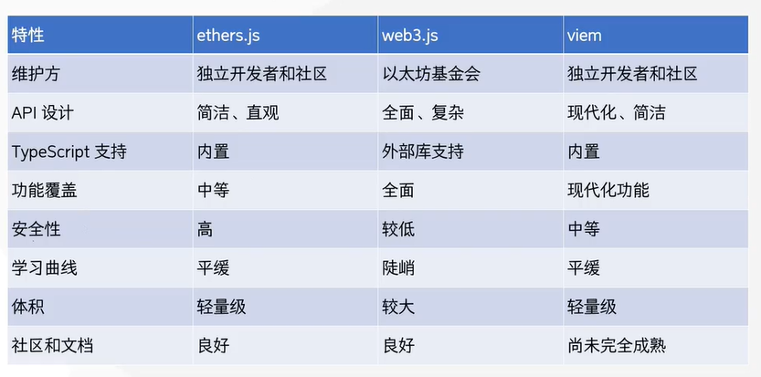

### vite

vite 创建项目

```
npm init vite@latest
```

npm install

npm run dev

## task3

#### 1.开发工具，使用 remix 页面开发工具开发合约，

npm本地安装 remixd 将，本地和页面关联

remixd官网

https://remix-ide.readthedocs.io/en/latest/remixd.html#remixd-installation

```node
npm install -g @remix-project/remixd
```

链接

```
remixd
// 按照路径共享
remixd -s D:\code\github\Web3-Frontend-Bootcamp\members\zhangloveyan\task3\task3\src --remix-ide https://remix.ethereum.org
```

可能问题：证书过期

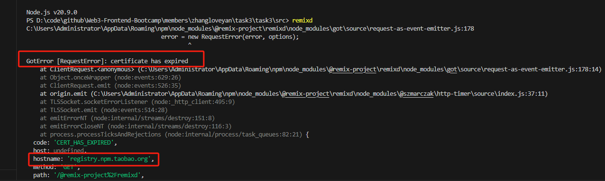

因为用的是淘宝，证书过期，ssl 认证报错。

处理方法：都可以

1.更换官网

```
npm config set registry https://registry.npmjs.org/
```

2.忽略ssl检测（不安全）

在执行 `remixd` 命令时添加 `NODE_TLS_REJECT_UNAUTHORIZED` 环境变量：

```
NODE_TLS_REJECT_UNAUTHORIZED=0 remixd -s /path/to/your/folder --remix-ide https://remix.ethereum.org
```

重入攻击：buy 确认的过程中，不能在进行其他交易，本质加个锁。

测试网查询哈希地址：https://sepolia.etherscan.io/tx/{哈希}


账户准备、作用

账户一：部署 token（SH）、nft（SHT）、market 合约 

0x428E78b1642fa63e160a8af5DF3934001BA14a18

账户二：mint nft、上架 nft

0xfea59810Bd1d21a5b9Ed056aaf10871aF825b673

账户三：购买 nft 

0x28E205Aff9D194979A7D8684aF21545F454a1470


交互步骤：

1.账户一部署合约：

选择账户一，选择合约，部署。部署完一个切换另一个，部署完成后，记录合约地址，后面要用。


token 合约地址：

0x1D1c1F1217e9Ac91aa3c72BC4Eb458F39baAE957

nft 合约地址：

0x5c7122ded287d82cdc35b0d5da44bcf7ce8455c7

market 合约地址：

0x2FAe6C0Cbe090AAD62fA8e48EE2de06D0c924f33

2.账户二 mint NFT

切换到账户二

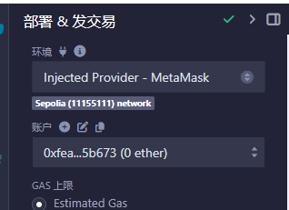

选择 NFT 合约，选择 mint 方法，填入账户二地址，点击 transact ，等待弹出钱包，点击确定。

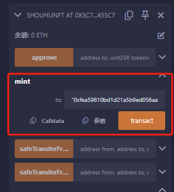

等待出块完成，这时你的账户二就可以查到这个 NFT 了。

也可通过 ownerOf 方法查询

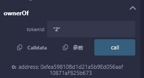

3.账户二 授权 market 转移 NFT

market 要有操作 NFT 的权限，才可以转移（卖）你的 NFT ，切记主网要这个权限的，不要乱给。

仍是账户二，选择 NFT 合约，选择 setApprovalForAll 方法，operator 填写 market 合约地址，如下：

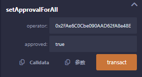

4.账户二 上架 NFT

仍是账户二，选择 market 合约，选择 listNFT 方法，填入 nft 合约地址、tokenId、价格。

含义：二号 NFT 价格 2 SH 代币。

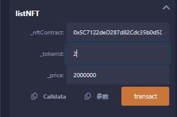

完成后的哈希值，就是作业需要提交的 上架 NFT 的哈希。

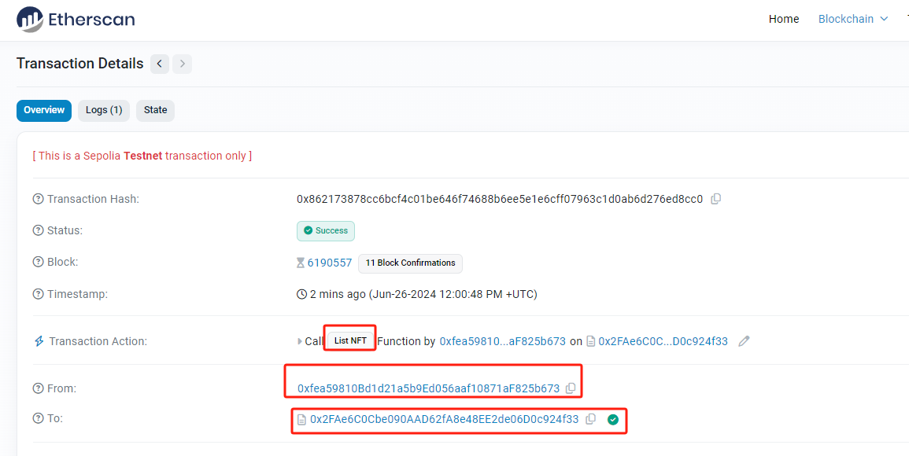

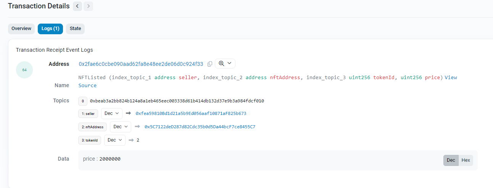

5.账户一通过 token 合约给账户三转 SH 代币

账户三暂时没钱，所以无法购买 NFT ，那么就需要账户一（token 合约拥有者）转账 SH 代币给账户三，用来购买 NFT。

切换到账户一，选择 token 合约，transfer 方法，填写账户三地址，转账金额。

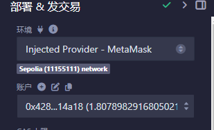

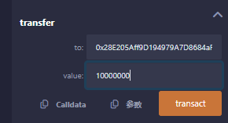

转账完成后账户三就有 SHH 代币买 NFT 了。

6.账户三授权 market 使用代币

和转移 NFT 类似，market 也要有权限转移（买）资金，完成后续操作。

切换至账户三，选择 token 合约，approve 方法，填入 market 地址、使用数量。

含义：授权 market 合约允许最大使用上限 5 个 SH 代币

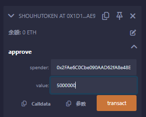

7.购买 NFT

仍是账户三，选择 market 合约，选择 buyNFT 方法。

输入 NFT 合约地址，要购买的 tokenId。

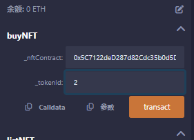

完成后的哈希值，就是作业需要提交的 购买 NFT 的哈希。

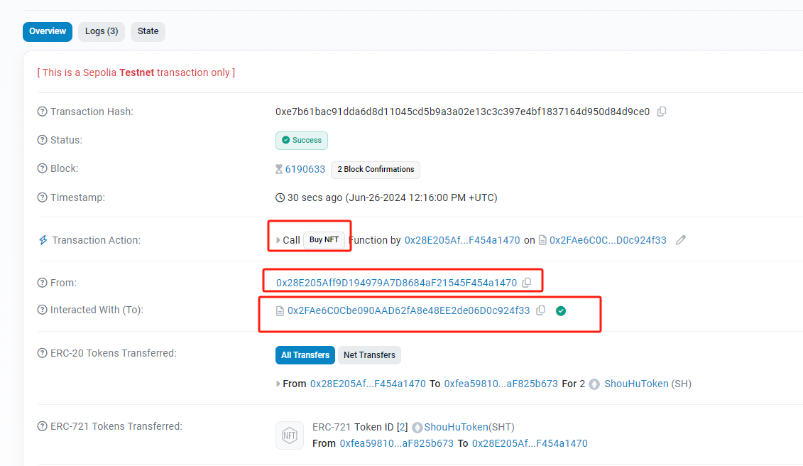

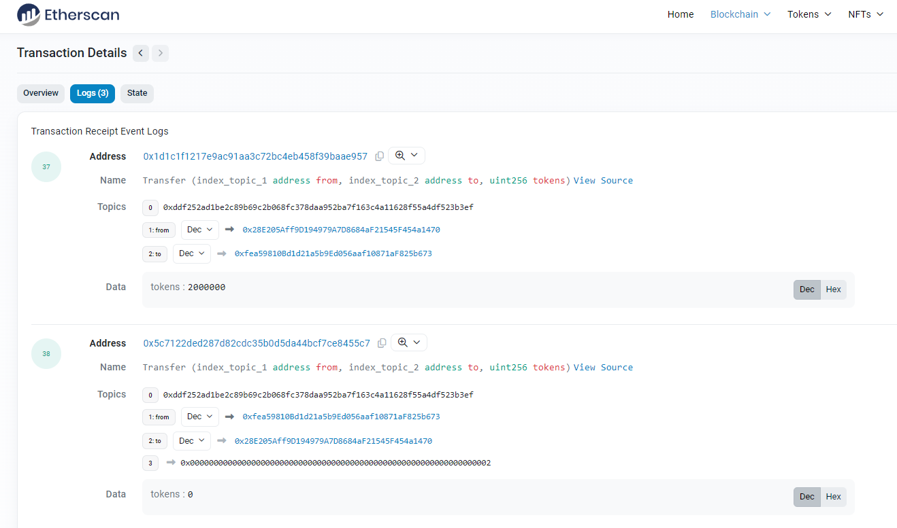

提交作业，搞定。


上架NFT

0x19380876d94ea719871e593729abe519dea54120f1b29079bd8705921619cb47

购买NFT 

0x1d93c8db7e968fa76d17aeb3fca2f05aba41f5ba088edad96ebc434baa145501

#### 参考网站

合约例子：https://solidity-by-example.org/app/erc721/

标准合约：https://docs.openzeppelin.com/contracts/5.x/erc20

#### 出现的问题

1.ssl问题

2.编译版本问题

## task4

框架 wagmi ：https://wagmi.sh/react/getting-started

安装使用

abi 文档 as const 不出提示

遇到的问题：

1.abi多合约

2.useReadContract 接收参数

hook函数使用，不能在for 循环，不改合约不可能了

## uniswap

https://github.com/Uniswap/v2-sdk

http://docs.uniswap.org/sdk/v2/overview

https://github.com/IAmJaysWay/dexFinal

yarn 自动解决冲突

https://www.rainbowkit.com/zh-CN

yarn add @rainbow-me/rainbowkit wagmi viem@2.x @tanstack/react-query


yarn add @uniswap/v2-sdk

yarn add @uniswap/v2-core
