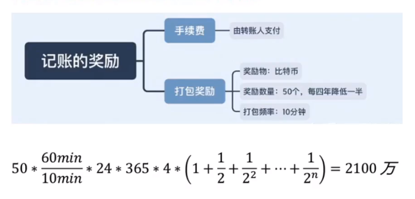
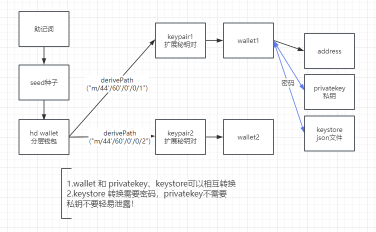
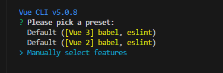
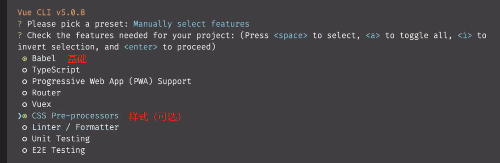
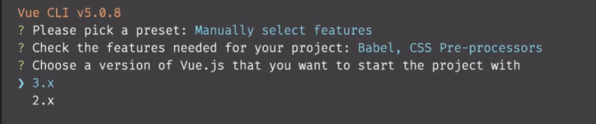
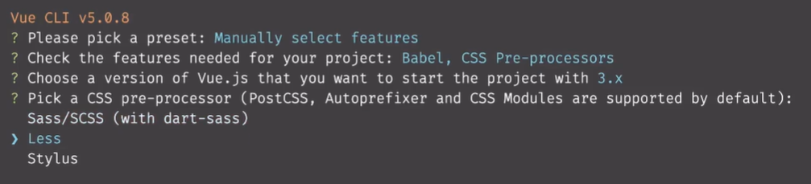
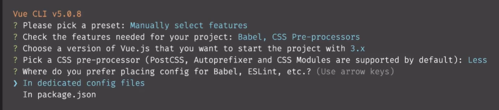
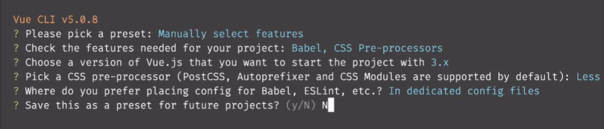
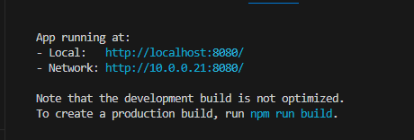

# web开发

js

合约开发、部署、调用

vue+web3+solidity

## 区块链

区块 + 链

**特征**

去中心化：对等网络每个节点即是服务器又是客户端

共识机制：PoW（工作量证明，算题）、PoS

不可篡改：修改数据会影响整个链的其他数据

**类型**

公链、私链、联盟链、混合链


**记账挖矿**



**共识机制**

- PoW：工作量证明
- PoS：权益证明机制
- PoA：权威证明机制
- PoC：容量证明机制
- CPoC：有条件的容量证明机制

## ETH

智能合约 Solidity 语言

### infura地址

https：

- https://mainnet.infura.io/v3/eb5886c723264071aa5eb6ca988c10df
- https://goerli.infura.io/v3/eb5886c723264071aa5eb6ca988c10df
- https://sepolia.infura.io/v3/eb5886c723264071aa5eb6ca988c10df

websocket：

- wss://mainnet.infura.io/ws/v3/eb5886c723264071aa5eb6ca988c10df
- wss://goerli.infura.io/ws/v3/eb5886c723264071aa5eb6ca988c10df
- wss://sepolia.infura.io/ws/v3/eb5886c723264071aa5eb6ca988c10df

### web3 简介

官方提供的一个连接以太坊区块链的模块，使用 http、ipc 与本地或远程以太坊节点进行交互，包含以太坊生态的所有功能。

连接以太坊暴露出来的 PRC 层，可以连接任何暴露的节点，从而与区块链交互。

JavaScript API 叫 web3.js，还有 web3.py 等

- web3.eth：用于以太坊区块链和智能合约之间的交互
- web3.utils：一些辅助方法
- web3.shh：用于协议进行通信的 P2P 和广播
- web3.bzz：用于与群网络交互的 Bzz 模块

**相关地址**：

github地址：https://github.com/web3/web3.js

开发文档：https://web3js.readthedocs.io/en/v1.10.0/

中文文档：https://learnblockchain.cn/docs/web3.js/

**常用 api**：

需要先实例化 web3 相当于 java new 对象

```vue
// 实例化
var web3 = new Web3(Web3.givenProvider || "wss://goerli.infura.io/ws/v3/cb7e63cf28244e4499b4b6fb6162e746");
```

#### 1.创建账户

script 中写逻辑

```vue
<script setup>
// 导包
import { ref } from 'vue';
import Web3 from 'web3';
// 创建账户 参数-密码 可不填 
const account = web3.eth.accounts.create('123456');
// 账户对象 
console.log(account);
// 获取地址 "0x4C2a92E7CC53Ea722FC9B816b108D87ccB701aDc"
console.log(account.address);
// 获取私钥 "0xc4c81dd272f1b73682da85b93ba4bd0318dff02f2e2d8f35bb4672ef97ee4c62"
console.log(account.privateKey);
</script>
```

#### 2.余额获取

script 中写逻辑

```vue
<script setup>
// 先固定一个账户
const address = ref('0x0aD25a2B10C80DCabBd2baF3edf93aE752112018');

// 获取余额 异步获取需要使用 then
const mount = ref(-1);
web3.eth.getBalance(address.value).then((res) => {
    mount.value = res;
});
</script>
```

template 中可直接使用显示

```vue
<template>
    <h1>
        账户信息
    </h1>
    <p>
        地址：{{ address }}
    </p>
    <p>
        私钥：0x56484b333f965e581cf7576a32a73f1cf8483def6ed8f555ab060a3148902cad
    </p>
    <p>
        余额：{{ mount }}
    </p>
</template>
```

#### 3.单位转换

单位：wei 是最小的单位

- Kwei(Babbage) = 10**3 Wei
- Mwei(Lovelace) = 10**6 Wei
- Gwei(Shannon) = 10**9 Wei
- Microether(Szabo) = 10**12 Wei
- Milliether(Finney) = 10**15 Wei
- Ether = 10**18 Wei 最小单位
- **Ether = 10\**9 Gwei** 小狐狸 gas 使用计量单位

可使用 web3 对象 或者静态方法

```vue
// Eth 转 wei
const num1 = Web3.utils.toWei("0.31","wei");
const num2 = web3.utils.toWei("0.32","wei");
// wei 转 Eth
const num3 = Web3.utils.fromWei("2100000000","ether");
const num4 = web3.utils.fromWei("2200000000","ether");
```

#### 4.转账

4.1 加密用到的包

```vue
npm install ethereumjs-tx@1.3.7
```

加密包版本问题，需要导入一个插件

```vue
// 安装
npm i node-polyfill-webpack-plugin
// vue.config 引入
const NodePolyfillWebpackPlugin = require("node-polyfill-webpack-plugin");
module.exports = defineConfig({
  transpileDependencies: true,
  configureWebpack: {
    plugins: [
      new NodePolyfillWebpackPlugin(),
      CompentsPlugin({ resolvers: [VantResolver()] })]
  }
})
```

4.2 转账的参数准备

```vue
// 获取交易次数 nonce
const nonce = await web3.eth.getTransactionCount(address.value);
// 获取预计转账 也可以直接给出固定值 gas 单位 单位：wei
const gasPrice = await web3.eth.getGasPrice();

// 参数
var txObject = {
	// 交易的次数 每次加一
	nonce: web3.utils.toHex(nonce),
	gasPrice: web3.utils.toHex(web3.utils.toWei('10', 'gwei')),
	gasLimit: web3.utils.toHex(21000),
	to: '0x428E78b1642fa63e160a8af5DF3934001BA14a18',
	// 转账金额
	value: web3.utils.toHex(web3.utils.toWei('0.012', 'ether')),
}
```

4.3 私钥

```vue
// 私钥处理 注意 去掉 0x 开头 否则报错
const pKey = Buffer(primaryKey.value.slice(2), "hex");
const privateKey = Buffer.from('56484b333f965e581cf7576a32a73f1cf8483def6ed8f555ab060a3148902cad', 'hex');
```

4.4 使用 ethereumjs-tx 加密数据

```vue
import Tx from 'ethereumjs-tx';
或
const Tx = require('ethereumjs-tx');

// 创建对象
const tx = new Tx(txObject);
// 使用秘钥签名
tx.sign(privateKey);
// 获取数据
const serializedTx = tx.serialize();
// 转 hex 拼接 0x
const signedTransactionData = '0x' + serializedTx.toString('hex');
```

4.5 发起转账

```vue
const trans = web3.eth.sendSignedTransaction(serializedTx);
// 监听事件
// 交易hash
trans.on("transactionHash", (txid) => {
	console.log('交易id：', txid);
	console.log(`https://sepolia.etherscan.io/tx/${txid}`);
});
// 节点确认 只触发一次
trans.on("receipt", (res) => {
	console.log("第一个节点确认", res);
});
// 节点确认 多节点确认
trans.on("confirmation", (res) => {
	console.log("第n个节点确认", res);
});
```

### 账户系统

#### 助记词创建账户

bip39 协议将助记词转换成 seed 种子，通过 ethereumjs-wallet 生成 hd 钱包，根据路径的不同从 hd 钱包获取不同的 keypair（扩展公钥、私钥），keypair 生成 wallet 管理账户，wallet 有地址、私钥等全部信息。

助记词可以获取所有关联的账号，获取到公钥、私钥、地址等数据信息。



1.依赖库：

`npm install bip39 ethereumjs-wallet ethereumjs-util`

bip39 生成助记词

ethereumjs-wallet 私钥、钱包相关

2.导入相关包

```vue
import * as bip39 from 'bip39';
import ethwallet, { hdkey } from 'ethereumjs-wallet';
```

3.开始

```vue
// bip 39 生成助记词
const mnemonic = bip39.generateMnemonic();
console.log(mnemonic);
// const mnemonic = ref("good castle artefact joy dinosaur ginger fog exist save mention include fish");

// 根据助记词生成 seed 种子
const seed = await bip39.mnemonicToSeed(mnemonic.value);

// 根据种子生成 hdWallet
const hdWallet = hdkey.fromMasterSeed(seed);

// hdWallet 生成秘钥对 keypair
const keypair = hdWallet.derivePath("m/44'/60'/0'/0/1");
// console.log(keypair);

// keypair 获取钱包账户 从而获取所有的信息
const wallet = keypair.getWallet();
```

**derivePath**

> BIP44 则是为这个路径约定了一个规范的含义(也扩展了对多币种的支持)，BIP0044 指定了包含 5 个预定义树状层级的结构：
> **m / purpose' / coin' / account' / change / address_index**
> m 是固定的, Purpose 也是固定的，值为 44（或者 0x8000002C）
> **Coin type**
> 这个代表的是币种，0 代表比特币，1 代表比特币测试链，60 代表以太坊
> 完整的币种列表地址：https://github.com/satoshilabs/slips/blob/master/slip-0044.md
> **Account**
> 代表这个币的账户索引，从 0 开始
> **Change**
> 常量 0 用于外部(收款地址)，常量 1 用于内部（也称为找零地址）。外部用于在钱包外可见的地址（例如，用于接收付款）。内部链用于在钱包外部不可见的地址，用于返回交易变更。 (所以一般使用 0 )
> **address_index**
> 这就是地址索引，从 0 开始，代表生成第几个地址，官方建议，每个 account 下的 address_index 不要超过 20
>
> 根据  EIP85 提议的讨论以太坊钱包也遵循 BIP44 标准，确定路径是 **m/44'/60'/a'/0/n**
> a 表示帐号，n 是第 n 生成的地址，60 是在 SLIP44 提案中确定的以太坊的编码。所以我们要开发以太坊钱包同样需要对比特币的钱包提案 BIP32、BIP39 有所了解。

4.钱包账户获取私钥 privateKey、秘钥仓库 keystore（json 格式）

```vue
// 地址 校验地址 私钥
const lowerCaseAddress = wallet.getAddressString();
console.log('钱包地址' + lowerCaseAddress);

const checkAddress = wallet.getChecksumAddressString();
console.log('校验地址' + checkAddress);

const priKey = wallet.getPrivateKey().toString('hex');
console.log('私钥---' + priKey);

// 导出 keystore 需要设置密码
const keystore = await wallet.toV3('111111');
console.log('keystore---' + JSON.stringify(keystore));
```

5.秘钥仓库 keystore 获取地址

```vue
// keystore 获取地址
// 其实就是 keystore 转换成 wallet
const walletFromKeystore =await ethwallet.fromV3(keystore, '111111');
console.log('地址---' + walletFromKeystore.getAddressString());
```

6.私钥 privatekey 获取地址

```vue
// privatekey 获取地址
// 其实就是 privatekey 转换成 wallet
const priKeyBuffer = Buffer(priKey, 'hex');
const walletFromPrikey = ethwallet.fromPrivateKey(priKeyBuffer);
console.log('地址---' + walletFromPrikey.getAddressString());
```

## 实战

### 1.编写一个智能钱包

#### 基础准备

**环境准备**

- 工具：vscode
- 环境：node.js 

**创建项目**

1.安装 vue cli `npm install -g @vue/cli` 地址： (https://cli.vuejs.org/zh/#%E8%B5%B7%E6%AD%A5)

2.生成项目 `vue create web-wallet`，执行结果如下：



3.选择自定义操作，选择如下：



4.版本选择：



5.CSS 样式选择：



6.单独配置文件：



7.是否保存配置：**选No**（否则后面没法选了）



创建完成后可使用 `npm run serve` 运行，运行完成可点击链接打开



#### web3相关包引入 

1.安装 web3.js： 

```vue
npm install web3 bip39 ethereumjs-tx@1.3.7 ethereumjs-util ethereumjs-wallet
```

2.实例化：

```vue
var web3 = new Web3(Web3.givenProvider || "ws://localhost:8545");
```

3.获取以太坊网络的节点地址

infura 提供公开的主网和测试网节点，infura.io 注册即可获取地址

#### 配置 vant-ui ui 组件库 （可选）

地址：https://vant-contrib.gitee.io/vant/#/zh-CN

1.安装：npm=node package manager 、i=install

```vue
npm install vant
npm install unplugin-vue-components -D
```

2.在 vue.config.js 配置插件

```vue
const { defineConfig } = require('@vue/cli-service')
++ const { VantResolver } = require('unplugin-vue-components/resolvers')
++ const CompentsPlugin = require('unplugin-vue-components/webpack')
module.exports = defineConfig({
  transpileDependencies: true,
++  configureWebpack: {
++    plugins: [CompentsPlugin({ resolvers: [VantResolver()] })]
++  }
})
```

3.测试 在 app.vue 文件添加代码

```vue
<button>创建钱包</button>
// 替换为
<van-button type="primary">创建钱包</van-button>
```

#### 垫片包（低版本兼容高版本）

否则无法使用 ethereumjs-tx@1.3.7

1.安装

```vue
npm i node-polyfill-webpack-plugin
```

2.vue.config.js 配置

```vue
++ const NodePolyfillWebpackPlugin = require("node-polyfill-webpack-plugin");
module.exports = defineConfig({
  transpileDependencies: true,
  configureWebpack: {
    plugins: [
++      new NodePolyfillWebpackPlugin(),
      CompentsPlugin({ resolvers: [VantResolver()] })]
  }
})
```

#### 存储工具类 store2

```vue
npm install store2
```

