# 计算机组成原理

### 前言

1.本课程位置

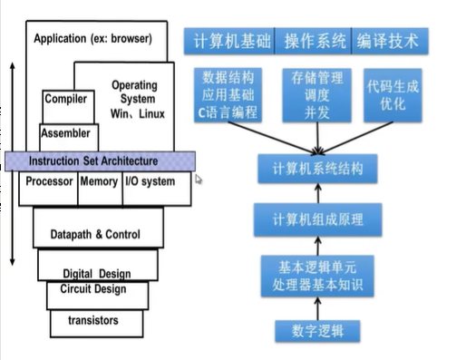

2.各个架构

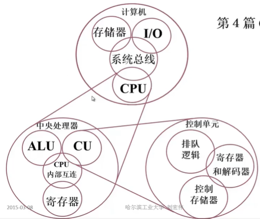

## 

## 1. 计算机系统的层次结构

### 1.1 层级

**语言层级**

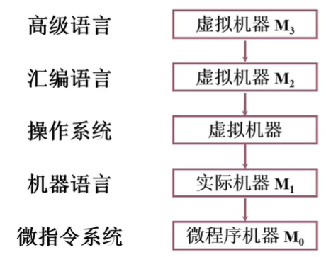

**软硬件：**

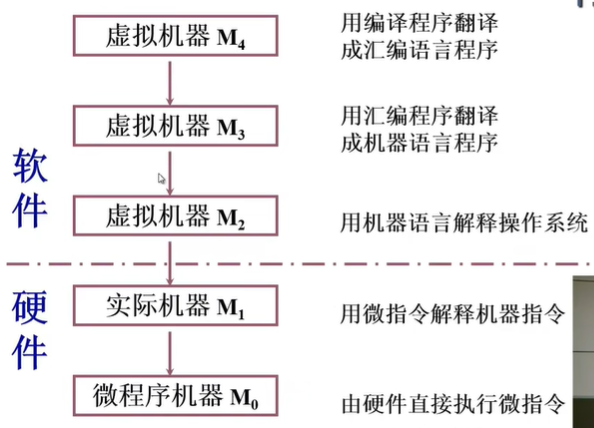

### 1.2 结构

**冯诺依曼计算机**：简化结构

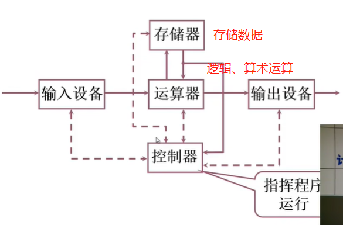

存在问题：

1.运算器为中心，成为瓶颈

2.没有层次结构，混乱

**现代计算机结构**

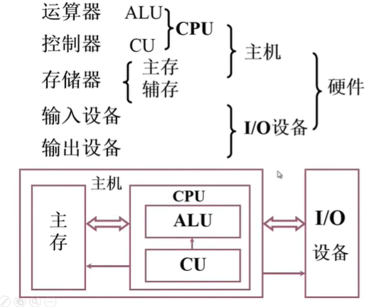

### 1.3 编程实质

1.建立数学模型

2.确定计算方法

举例：

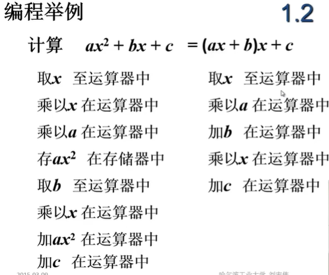

相比较右边更好，步骤更少

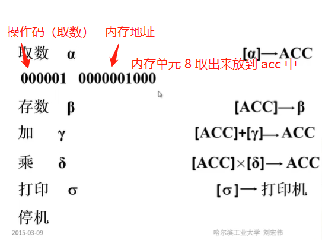

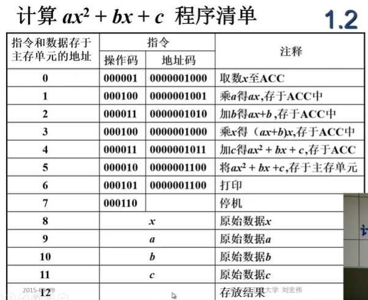

### 1.4 存储器的基本组成

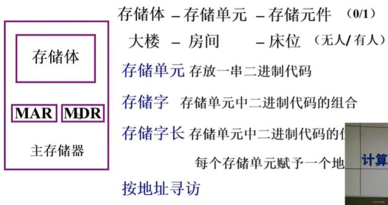

MAR：存储器地址寄存器，反映存储单元的个数（有多少个房间）

MDR：存储器数据寄存器，反映存储字长

设 MAR = 4位 , MDR = 8 位 那么，存储单元个数 16 个（2^4（0000->1111））,存储字长 8

### 1.5 运算器的基本组成

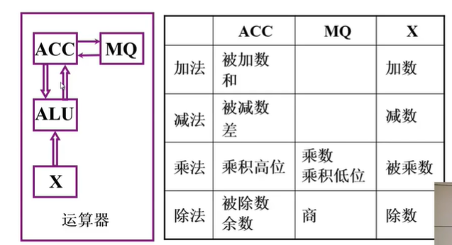

**MQ：**乘商寄存器，在做乘除运算使用

**加法运算：**其中 [M] 的 [ ] 代表内存地址的数

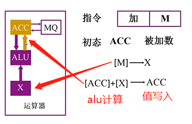

**[ACC]+[X]->ACC ：将 ACC 内存地址的值 与 X 内存地址的值相加 结果写入 ACC 的内存地址**

被加数+加数=和

被减数-减数=差

被乘数x乘数=积

被除数÷除数=商……余数

**减法运算：**同加法，符号区别

**乘法运算**：

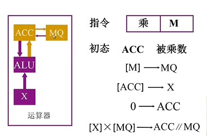

**除法运算：**

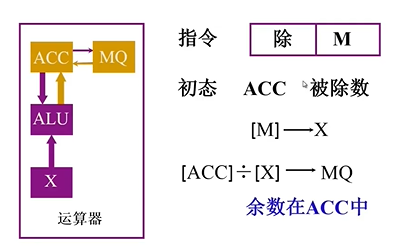

### 1.6 控制器

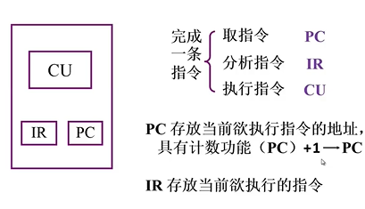

PC 内存地址  IR 地址里面的值（指令）CU 执行他们（控制指挥）

**总流程图：**

取数指令：

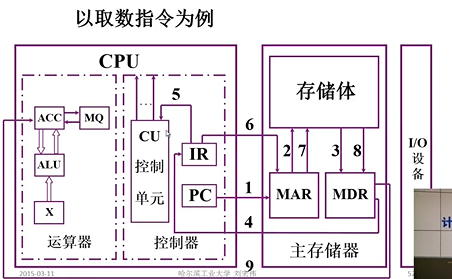

存数指令：

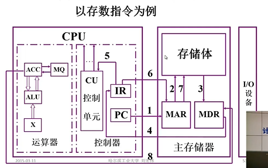

**举例：**

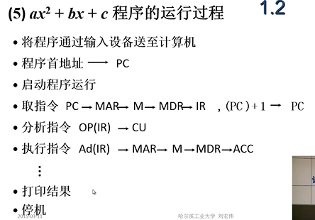

其中：取指令、分析指令、执行指令，这三步是循环的，进行每一步的操作

1.基本结构、组织方式

## 2.运算操作原理

## 3.部件、单元的设计思想

## 其他

### 名词解析：

**系统软件（System Software）:**

系统软件位于计算机系统中最靠近硬件的一层，其他软件一般都通过系统软件发挥作用。它与具体的应用领域无关。包括操作系统、计算机语言处理程序（各种程序翻译软件，包括编译程序、解释程序、汇编程序）、服务性程序、数据库管理系统和网络软件等。

**应用软件（Application）:**

应用软件是指为针对使用者的某种应用目的所撰写的软件。包括办公自动化系统，互连网，多媒体，分析软件，协作软件，商务软件，数据库等。

**高级语言（High-level programming Language ）:**

面向问题和算法描述的语言，也称为算法语言。用这种语言编写程序时，程序员不必了解实际机器的结构、指令系统等细节，而通过一种比较习惯的、直接的方式来描述问题和算法。

**汇编语言（Assembly Language） :**

汇编语言是一种面向实际机器的低级语言，是机器语言的符号表示，与机器语言一一对应。所以，汇编语言程序员必须对机器的结构和指令系统等细节非常清楚。

**机器语言（Machine Language）:**

机器语言是指直接用二进制代码（即：指令）表示的语言。用户必须用二进制代码来编写程序。所以机器语言程序员必须对机器的结构和指令系统等细节非常清楚。

**源程序（Source Program）:**

编译程序、解释程序和汇编程序统称为语言处理程序。各种语言处理程序处理的对象称为源程序，它们是用高级（算法）语言或汇编语言编写的程序。如，C语言源程序，Java语言源程序，汇编语言源程序等。

**目标程序（Object Program）:**

编译程序和汇编程序对源程序进行翻译处理所得到的结果程序称为目标程序，是由机器指令组成的二进制代码。

**编译程序（Complier）:**

编译程序完成从高级语言源程序到目标程序的转换。它将高级语言源程序全部翻译成目标程序，每次执行程序时，直接执行对应的目标程序，因此，只要源程序不变，就无需重新编译。

**解释程序（Interpreter）:**

解释程序将源程序的一条语句翻译成对应的机器目标代码，并立即执行，然后翻译下一条源程序语句并执行，直至所有源程序中的语句全部被翻译并执行完。所以，解释程序的执行过程是翻译一句，执行一句。直接输出源程序的执行结果，而不是输出目标程序。所以每次执行程序时，直接启动源程序执行。

**汇编程序（Assembler）:**

汇编程序也是一种语言翻译程序，它把汇编语言写的源程序翻译为机器语言目标程序。

**操作系统（Operating System）:**

操作系统（Operating System，简称OS），是计算机系统中负责支撑应用程序运行环境以及用户操作环境的系统软件，同时也是计算机系统的核心与基石。它的职责常包括对硬件的直接监管、对各种计算资源（如内存、处理器时间等）的管理、以及提供诸如作业管理之类的面向应用程序的服务等等。 目前比较流行的操作系统主要有两个家族：类Unix家族和微软Windows家族。

**算术逻辑单元 （Arithmetic Logic Unit 简称 ALU）:**

它是计算机对数据进行加工处理的部件，包括算术运算和逻辑运算。

**累加器（Accumulator）:**

在中央处理器 CPU 中，累加器 (accumulator 简称 ACC) 是一种暂存器，用来储存计算所产生的中间结果。如果没有像累加器这样的暂存器，那么在每次计算后就必须要把结果写回到内存，然后可能还要再读回来。这样，就会增加访问内存的次数，降低程序运行的效率。典型的例子就是把一列数字加起来。一开始累加器设定为零，每个数字依序被加到累加器中，当所有数字都被加入后，结果才写回到主内存中。

**运算器（Arithmetic Logic Unit , ALU）:**

运算器主要由算术逻辑单元和一组寄存器组成。有专门的定点数运算器和浮点数运算器。早期机器只包含累加器、Q乘商寄存器等少量几个寄存器。现代计算机中有专门的定点运算用的定点寄存器组和浮点运算用的浮点寄存器组。

**控制器（Control Unit）:**

控制器负责从存储器中取出指令，并对指令进行译码；根据指令的要求，按时间的先后顺序，负责向其它各部件发出控制信号，保证各部件协调一致地工作，一步一步地完成各种操作。控制器主要由指令寄存器IR、指令译码器ID、程序计数器PC、控制部件CU等组成。

**控制单元（Control Unit）:**

控制单元（Control Unit 简称 CU），有时也称为“微操作信号形成部件”。其作用是对指令译码信号、状态标志信号、时序信号等进行组合，产生各种操作控制信号。

**中央处理器（Central Processing Unit ， CPU ）:**

中央处理器（CPU）是计算机中最重要的一个部分，由运算器和控制器组成。其内部结构归纳起来可以分为控制单元、逻辑单元和存储单元三大部分，这三个部分相互协调，对命令和数据进行分析、判断、运算并控制计算机各部分协调工作。

**程序计数器（Program Counter）:**

程序计数器（Program Counter，简称PC）又称指令计数器，用来存放指令的地址，以便准确地指出后继指令的存储单元地址。通常程序是顺序执行的，程序的指令序列在内存中一般也是按连续地址存放的。在开始运行程序之前，总是将第一条指令的地址放入PC。当第一条指令被取出执行，控制器就使PC的内容自动增量（加“1”），指明下一条要执行的指令所存放的存储单元地址，以控制指令的顺序执行。在遇到需要改变程序执行顺序的情况时，一般由转移类指令将转移目标地址送往程序计数器，即可实现程序的转移。

**指令寄存器（Instruction Register）:**

指令寄存器（Instruction Register 简称IR）用来保存当前正在执行的一条指令。当执行一条指令时，先从存储器取出指令，然后送至指令寄存器。指令寄存器中的操作码部分被送到指令译码器ID(Instruction Decoder)，经ID译码(识别这条指令的功能)后，送到操作控制单元CU，由CU对指令译码信号、状态标志信号、时序信号等进行组合，最终送出具体的操作控制信号。

**存储器（Memory）:**

计算机的存储器主要由两部分组成——内存储器和外存储器。内存存取速度快、容量小、价格贵；外存容量大、价格低，但是存取速度慢。

**主存（内存）（Main Memory）:**

位于CPU之外，用来存放已被启动的程序及所用的数据。有ROM芯片和RAM芯片组成相应的ROM存储区和RAM存储区。RAM存储区用动态随机访问存储器实现。

**辅存（外存）（Secondary Memory）:**

位于主机之外，用来存放暂不运行的程序和数据，容量大而速度慢。外存也属于输入输出设备，它只能与主存直接交换信息。外存储器主要有磁盘存储器、磁带存储器和光盘存储器。磁盘是最常用的外存储器，通常它分为软盘和硬盘两类。容量极大、价格便宜的磁带机和光盘组等称为海量存储器，常用作数据备份。

**记忆单元（存储基元、存储元）（Memory Cell）:**

具有两种稳态的能够表示二进制数码0和1的物理器件。所以，一个记忆单元表示1位信息。

**存储单元（Memory Unit）:**

主存中具有相同地址的那些位构成一个存储单元。因此，存储单元的宽度等于一个编址单位的长度，可以是8位、16位、32位等。现在，大多数计算机是按字节编址的，即：每一个字节（8位）有一个地址，编址单位就是一个字节，所以一个存储单元的宽度（位数）是8位。

**存储器地址寄存器 （Memory Address Register - MAR）:**

CPU中用来存放存储器地址的寄存器，地址在送到总线的地址线之前，现寄存在MAR中。所以，它的宽度应该等于地址线的宽度，也等于主存储器的地址位数，其值决定了主存最大的寻址空间。

**存储器数据寄存器（Memory Data Register，MDR）:**

CPU中用来存放写入主存或从主存读出的数据的寄存器，数据在送到总线的数据线之前，或从主存读到CPU时，都先寄存在MDR中。所以，它的宽度应该等于总线数据线的宽度。

**存储容量（Memory Capacity）:**

存储器能够容纳的二进制信息量。常用存储单元数与每个单元的位数的乘积表示，或用字节数表示。如：64M x 8位，或64MB。

**机器字长（Machine Word Length）:**

机器字长定义为CPU中在同一时间内一次能够处理的二进制数的位数，即：运算器中参加运算的寄存器的位数。一般把CPU中定点运算器的数据通路宽度定义为字长。

**指令字长（Instruction Length）:**

一条指令的二进制代码位数。有定长指令字机器和不定长指令字机器。定长指令字机器中所有指令的位数是相同的，目前定长指令字大多是32位指令字。不定长指令字机器的指令有长有短，但每条指令的长度一般都是8的倍数。

**CPI（Cycle Per Instruction）:**

衡量CPU性能的一种计量单位。表示执行一条指令所需的时钟个数。

**MIPS （Million Instructions Per Second）:**

是计算机定点运算速度的一种计量单位。用来表示每秒钟执行多少百万条指令。

**FLOPS（floating-point operations per second）:**

是计算机浮点运算速度的一种计量单位。表示每秒所执行的浮点运算次数。

链接：http://media.njude.com.cn/vclass/Courses/15201A/CourseDetail.aspx?id=4630

### 参考书籍：

计算机组成原理（第 2 版）

Computer Organization And Design

Digital Design and Computer Architecture

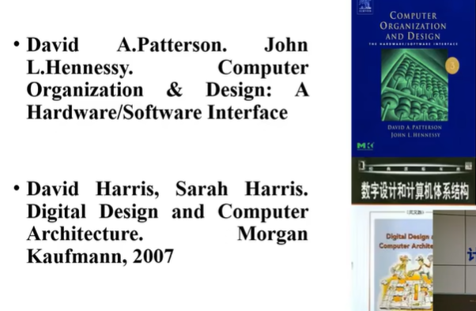