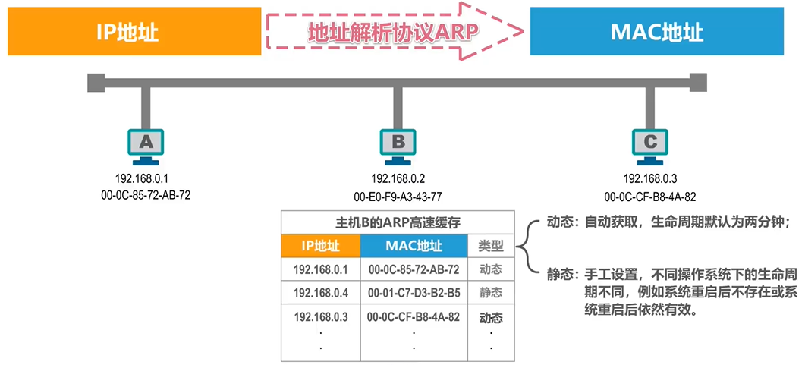

# 计算机网络

## 1. 概述

### 1.1 电路交换、报文交换、分组交换的对比

分组类似 CPU 流水。

**网络分组**

### 1.2 性能指标

**常用的数据量单位**

1 Byte = 8 bit (比特位)

1 KB = 2^10B (1024B)

1 MB = K*KB = 2^20B

1 GB = K*MB = 2^30B

1 TB = K*GB = 2^40B

250G(10进制) = 250 x 10^9 / 2^30 = 232.8GB 

**速率** bit/s (b/s bps)

kb/s = 10^3 b/s （1000 b/s）

Mb/s = k*kb/s = 10^6 b/s （1000 b/s）

...

一个是 1024 进制 一个 1000 进制 计算时换算成最小 bit 使用

例子：

一个待发送数据块大小 100M，速率 为 100Mbps，求发送时间？

100 x 1024(K) x 1024(B) x 8bit / 100 x 10^6 bps = 8.388608s

**带宽**

用来表示网络的通信线路所能传送数据的能力，因此网络带宽标识在单位时间内从网络中的某一点到另一点所能通过的“最高数据率”，单位同速率

**吞吐量**

表示在单位时间内通过某个网络或信道、接口的数据量

**时延**

发送时延（分组长度(b)/发送速率(b/s)）

传播时延（信道长度(m)/电磁波传播速率(m/s)）

自由空间：3x10^8 铜线：2.3x10^8 光纤：2.0x10^8

处理时延（不方便计算）

**时延带宽积**

**往返时间**

一般交互都是双向交互，双向交互一次的时间是往返时间 RTT

**利用率**

信道利用率：信道有百分之几的时间是被利用的（有数据通过）

网络利用率：全网络的信道利用率的加权平均

利用率并非越高越好，增大时时延也会增加

一些较大主干网 ISP 利用率超过 50% 就要准备扩容

**丢包率**

一定时间内，丢失的分组数量与总分组数量的比率

接口、结点、链路、路径、网络丢包率等

原因：分组误码、网络拥塞

### 1.3 体系结构

**OSI 体系结构、TCP/IP体系结构**

四层结构

**各层需要解决的问题**

应用层：解决通过应用进程的交互来实现特定网络应用的问题（进程号、端口）

运输层：解决进程之间基于网络的通信问题

网络层：解决分组在多个网络上传输（路由）的问题

数据链路层：解决分组在一个网络（一段链路）上传输的问题

物理层：解决使用何种信号来传输比特的问题（0,1方波）

从浏览器发起请求，到服务器响应 从 应用层开始 HTTP 每经过一层便会加上一层协议（运输层加 TCP、网络层加 IP、数据链路加 ETH、物理层转为 bit（01进制数据））由路由解析到网络层定位 IP 地址，转发到目标服务器。

## 2. 物理层

### 2.1 基本概念

传输 01 bit 信号，分为以下两种：

导引型：光纤、同轴电缆、双绞线、电力线

非导引型：无线电波、微波、红外线、可见光 2-40GHz

**传输方式：**

串行、并行传输，同步、异步传输，单向、双向交替、双向同时通信

**编码与调制：**

不归零编码、归零编码、曼彻斯特编码、差分曼特斯特编码

## 3. 数据链路层

### 3.1 基础

**链路：**从一个结点到相邻结点的一段物理线路，中间没有任何其他交换结点

**数据链路：**把视线通信协议的硬件和软件加到链路上，就构成了数据链路

数据链路层以**帧**为单位传输和处理数据

**封装成帧：**添加帧头和帧尾

**差错检测：**帧尾有检测码，CRC 检测

**可靠传输：**不管如何都能收到

ppp使用帧头帧尾来区分每一帧

**透明传输：**因为帧头帧尾也是 0 1 ，如何判定是头尾而非数据？或者需要好几个帧传输数据，又如何不让其结束？插入转义字符（特点标记esc）遇到了就说明没有结束

每一种数据链路都规定了帧的数据部分长度上线，最大传送单元 MTU(Maximum Transfer Unit)

### 3.2 点对点协议 PPP

### 3.3 媒体计入控制 MAC

#### 静态划分信道 

**信道复用**：频分复用 FDM、时分复用 TDM、波分复用 WDM、码分复用 CDM

多个用户使用一个信道传输数据

#### 动态接入控制

**受控接入：**集中控制、分散控制  

**随机接入：**

多址接入MA、载波监听CS、碰撞检测CD

CSMA/CD协议-争用期（碰撞窗口）

**MAC 地址**ARP 协议

每 四 位用一个十六进制标识 一共是12个十六进制数（四十八位）

前 6 位是 IEEE 组织机构分配管理，后 6 位 自己分配

**IP 地址**

网络编号：标识因特网上的网络

主机编号：标识同一网络上不同主机

**数据包转发过程中 IP 地址与 MAC 地址的变化情况：**

ip 是源地址 -> 目的地址	mac 当前路由 ->下个路由

**ARP 协议**

地址解析协议，不能跨网络使用。

如何获取 ip 地址？

### 3.4 集线器、交换机区别

