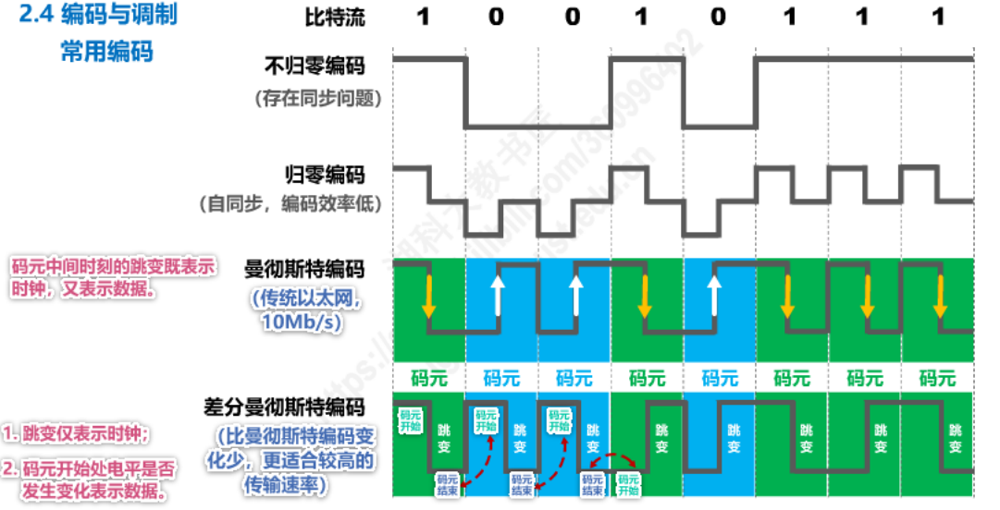

# 计算机网络

## 1. 概述

### 1.1 电路交换、报文交换、分组交换的对比


分组类似 CPU 流水。

**网络分组**


### 1.2 性能指标

**常用的数据量单位**

1 Byte = 8 bit (比特位)

1 KB = 2^10B (1024B)

1 MB = K*KB = 2^20B

1 GB = K*MB = 2^30B

1 TB = K*GB = 2^40B

250G(10进制) = 250 x 10^9 / 2^30 = 232.8GB 

**速率** bit/s (b/s bps)

kb/s = 10^3 b/s （1000 b/s）

Mb/s = k*kb/s = 10^6 b/s （1000 b/s）

...

一个是 1024 进制 一个 1000 进制 计算时换算成最小 bit 使用

例子：

一个待发送数据块大小 100M，速率 为 100Mbps，求发送时间？

100 x 1024(K) x 1024(B) x 8bit / 100 x 10^6 bps = 8.388608s


**带宽**

用来表示网络的通信线路所能传送数据的能力，因此网络带宽标识在单位时间内从网络中的某一点到另一点所能通过的“最高数据率”，单位同速率

**吞吐量**

表示在单位时间内通过某个网络或信道、接口的数据量

**时延**

发送时延（分组长度(b)/发送速率(b/s)）

传播时延（信道长度(m)/电磁波传播速率(m/s)）

自由空间：3x10^8 铜线：2.3x10^8 光纤：2.0x10^8

处理时延（不方便计算）

**时延带宽积**

**往返时间**

一般交互都是双向交互，双向交互一次的时间是往返时间 RTT

**利用率**

信道利用率：信道有百分之几的时间是被利用的（有数据通过）

网络利用率：全网络的信道利用率的加权平均

利用率并非越高越好，增大时时延也会增加

一些较大主干网 ISP 利用率超过 50% 就要准备扩容

**丢包率**

一定时间内，丢失的分组数量与总分组数量的比率

接口、结点、链路、路径、网络丢包率等

原因：分组误码、网络拥塞

### 1.3 体系结构

**OSI 体系结构、TCP/IP体系结构**


四层结构


**各层需要解决的问题**

应用层：解决通过应用进程的交互来实现特定网络应用的问题（进程号、端口）

运输层：解决进程之间基于网络的通信问题

网络层：解决分组在多个网络上传输（路由）的问题

数据链路层：解决分组在一个网络（一段链路）上传输的问题

物理层：解决使用何种信号来传输比特的问题（0,1方波）


从浏览器发起请求，到服务器响应 从 应用层开始 HTTP 每经过一层便会加上一层协议（运输层加 TCP、网络层加 IP、数据链路加 ETH、物理层转为 bit（01进制数据））由路由解析到网络层定位 IP 地址，转发到目标服务器。


## 2. 物理层

### 2.1 基本概念

传输 01 bit 信号，分为以下两种：

导引型：光纤、同轴电缆、双绞线、电力线

非导引型：无线电波、微波、红外线、可见光 2-40GHz

**传输方式：**

串行、并行传输，同步、异步传输，单向、双向交替、双向同时通信

**编码与调制：**

不归零编码、归零编码、曼彻斯特编码、差分曼特斯特编码



## 3. 数据链路层

### 3.1 基础

**链路：**从一个结点到相邻结点的一段物理线路，中间没有任何其他交换结点

**数据链路：**把视线通信协议的硬件和软件加到链路上，就构成了数据链路

数据链路层以**帧**为单位传输和处理数据

**封装成帧：**添加帧头和帧尾

**差错检测：**帧尾有检测码，CRC 检测

**可靠传输：**不管如何都能收到


ppp使用帧头帧尾来区分每一帧

**透明传输：**因为帧头帧尾也是 0 1 ，如何判定是头尾而非数据？或者需要好几个帧传输数据，又如何不让其结束？插入转义字符（特点标记esc）遇到了就说明没有结束

每一种数据链路都规定了帧的数据部分长度上线，最大传送单元 MTU(Maximum Transfer Unit)

### 3.2 点对点协议 PPP


### 3.3 媒体计入控制 MAC

#### 静态划分信道 

**信道复用**：频分复用 FDM、时分复用 TDM、波分复用 WDM、码分复用 CDM

多个用户使用一个信道传输数据

#### 动态接入控制

**受控接入：**集中控制、分散控制  

**随机接入：**

多址接入MA、载波监听CS、碰撞检测CD

CSMA/CD协议-争用期（碰撞窗口）

**MAC 地址**ARP 协议


每 四 位用一个十六进制标识 一共是12个十六进制数（四十八位）

前 6 位是 IEEE 组织机构分配管理，后 6 位 自己分配

**IP 地址**

网络编号：标识因特网上的网络

主机编号：标识同一网络上不同主机

**数据包转发过程中 IP 地址与 MAC 地址的变化情况：**


ip 是源地址 -> 目的地址	mac 当前路由 ->下个路由

**ARP 协议**

地址解析协议，不能跨网络使用。

如何获取 ip 地址？


### 3.4 集线器、交换机区别


以太网交换机自学习和转发帧的流程


盲目泛洪相当于都发，因为不知道是谁，待有对应关系才能明确发送

记录有有效时间，因为可能有情况（更换网卡等），导致失效。

**生成树协议 STP**

生成逻辑上没有环状的网络结构

**虚拟局域网 VLAN**

一种将局域网内的设备划分成与物理位置无关的逻辑组技术，这些组有共同需求


## 4. 网络层

网络层主要任务是实现网络互连，进而实现数据包在各网络之间的传输。

主要解决以下问题：

- 网络层向运输层提供怎样的服务（可靠 or 不可靠）
- 网络层寻址问题
- 路由选择问题

### 4.1 提供的两种服务

**面向连接的虚电路服务**

可靠通信由网络保证，必须建立网络层连接-虚电路（逻辑层），然后发送携带地址和虚电路编号。不会丢包、误码（因为建立了连接）。

**无连接的数据报服务**

可靠性由用户主机（自己判断是否丢包、重复等）保证，不需要建立网络层连接，可能误码、失序。


### 4.2 IPv4 地址

**第一个地址为网络地址，最后一个地址是广播地址**

32 位比特地址，采用点分十进制表示方法，方便使用。


**子网掩码**

可以表明分类 IP 地址的主机号部分被借用了几个比特作为子网号

将子网的 IPv4 地址与相应的子网掩码进行逻辑与运算就可以得到子网的网络地址

**解释：** 最后 1-254 这些如果没用满，还想分网管理，在前位区分浪费 ip ，所以用掩码这个概念来在 1-254 做分网

例子：

> 某个小型公司有四个部门：行政、研发、营销、售后，每个部门各40台计算机接入公司局域网交换机，如果要在192.168.1.0网段为每个部门划分子网，子网掩码应该怎么设置，每个子网的地址范围分别是什么？
>
> 192.168.1.0网段共256个地址，划分4个子网，每个子网需要64个地址；64是2的6次方，子网掩码应该以6个0结尾，剩下的用1补齐，由26个1和6个0组成，转换成十进制是255.255.255.192；每个子网共64个IP地址，掐头去尾后可用地址只有62个，
>
> 第1个子网的可用IP地址范围是：192.168.1.1-62，
>
> 第2个子网可用IP地址范围是192.168.1.65-126，
>
> 第3个子网的可用IP地址范围是：192.168.1.129-190，
>
> 第4个子网可用IP地址范围是192.168.1.193-254；
>
> 该公司各部门计算机按照3中的IP地址范围进行设置，所有计算机的子网掩码都必须设置为255.255.255.192，设置完毕后各部门内的计算机能正常联网，不同部门间的计算机无法直接联通。

**无分类编址的 IPv4 地址**

地址/掩码1位数

192.168.4.0/30


### 4.3 IP 数据报的发送和转发过程

主机发送IP数据报

路由转发IP数据报

### 4.4 IPv4 数据报的首部格式

首部格式 


- **版本：** 4bit，协议版本
- **首部长度：**4bit，报文首部长度。单位4字节，如：5 对应 20字节（5x4bit）15对应 60字节（20固定+40可变）
- **可选字段：**1-40byte 之间，支持排错、测量、安全等
- **填充字段：**确保首部是 4 的整数倍，使用 0 填充
- **区分服务：**8bit，不常用
- **总长度：**16bit，ip数据总长度（首部+数据载荷），最大 65535byte + 1024kb
- **标识：**16bit，属于同一个数据报的各分片报文需要一致。
- **标志：** 3bit，含义如下：
  - DF：1：不允许分片 0 允许分片
  - MF：1：后面还有分片 0：最后一个分片
  - 保留位：必须为 0
- **片偏移：**13bit，分片数据报的数据载荷在其原始数据报的偏移量是多少，以 8 个字节为单位
- **生存时间：**8bit，表示 IP 数据报的生存时间
- **协议：**8bit，何种协议单元。常用如下：

| 协议名称   | ICMP | IGMP | TCP  | UDP  | IPv6 | OSPF |
| ---------- | ---- | ---- | ---- | ---- | ---- | ---- |
| 协议字段值 | 1    | 2    | 6    | 17   | 41   | 89   |

- **首部检验和：**16bit，检验数据是否出错，如 CRC 检验码
- **源 IP 地址和目的 IP 地址：**各 32bit，

例题：


### 4.5 虚拟专用网络 vpn 与网络地址转换 nat

## 5. 运输层

### 5.1 基础


计算机上用进程标识符 PID 表示进程（哪一个程序）

TCP/IP 使用端口号来区分不用应用进程，端口号 16bit 范围 0-65535

- 熟知端口号：0-1023，划分给 TCP/IP 一些重要协议，FTP：21/20 HTTP 80 DNS 53
- 登记端口号：1024-49151，在 IANA 登记的应用程序，mysql 3306
- 短暂端口号：49152-65535，留给客户进程使用。使用结束后可以给其他的继续使用

**发送方复用和接收方分用**


#### 常用端口号


#### 一次http请求（网页输入地址回车到页面出现数据的流程）


#### UDP 和 TCP 数据报首部


### 5.2 TCP 的流量控制

**滑动窗口：**相当于很多车，在运输报文（数据），车可多可少，由被接受方控制

**0 窗口：**相当于不让发了，不让发的时候，发送方启动计时器，到点询问是否可发送，防止接收方发送可接受数据丢失

**零窗口探测报文**：上面说的计时器发送的询问报文，这个接收方必须接受


### 5.3 TCP 拥塞控制

某段时间，网络中某一资源需求超过了该资源所能提供的可用部分，网络性能就要变坏，叫拥塞。


**拥塞控制：**慢开始、拥塞避免、快重传、快恢复。 


### 5.4 TCP 可靠传输

基于以字节为单位的滑动窗口来实现可靠性传输

 

### 5.5 TCP 连接

建立连接需要解决以下三个问题

- tcp双方都能感知对方的存在
- tcp双方协商一些参数（最大窗口值、是否扩大、时间戳，服务质量）
- tcp双方对运输实体资源（缓存大小、项目）进行分配

**三次握手**


SYN：同步位，用来同步序号（1时，不能携带报文，消耗一个序号）

seq：序号，数据的每个字节都有序号，依次排序

ACK：确认报文

ack：x+1 确认 这是给 seq = x 的收到的确认

**四次挥手**


**首部格式**


- **源端口和目的端口**字段——各占 2 字节（16位）。端口是运输层与应用层的服务接口。运输层的复用和分用功能都要通过端口才能实现。

- **序号**字段——占 4 字节。TCP 连接中传送的数据流中的每一个字节都编上一个序号。序号字段的值则指的是本报文段所发送的数据的第一个字节的序号。

- **确认号**字段——占 4 字节，是期望收到对方的下一个报文段的数据的第一个字节的序号。如：返回 5 则说明需要接收 5，5 之前的 1、2、3、4 都接收完成

- **数据偏移**（即首部长度）——占 4 位，它指出 TCP 报文段的数据起始处距离 TCP 报文段的起始处有多远，也就是TCP首部的长度。
- **保留**字段——占 6 位，保留为今后使用，但目前应置为 0。

这里的六位二进制位，分别表示不同含义：

- **紧急 URG** —— 当 URG = 1 时，表明紧急指针字段有效。它告诉系统此报文段中有紧急数据，应尽快传送(相当于高优先级的数据)。 即URG=1的数据包不用排队直接优先传输。

- **同步 SYN** —— 同步 SYN = 1 表示这是一个连接请求或连接接受报文。即A想与B建立连接，发送过去的第一个数据包（第一次握手）中SYN=1；B返回的数据包（第二次握手）中SYN=1表示同意建立连接。

- **确认 ACK** —— 只有当 ACK = 1 时确认号字段才有效。当 ACK = 0 时，确认号无效。

  ACK是对已接受数据的确认，当A与B还在请求连接阶段，A向B发送的第一个数据包（第一次握手）中ACK=0，无效，所以数据包中不显示，表示还没从B中接收到数据；序号Seq也为0，表示A还未向B发送数据；SYN=1，表示正在建立连接。

  同理，B向A返回一个数据包（第二次握手）中，确认号ACK=1，表示B收到了A序号为0的数据包；序号Seq=0，也表示B还未向A发送数据；SYN=1表示同意建立连接。

  A再向B发送一个数据包（第三次握手）中，确认号ACK=1，表示A收到了B发出的数据包；序号Seq=1，表示A已向B发送了1个数据包（即第一次握手）；SYN=0，表示已建立连接。

- **推送 PSH** (PuSH) —— 接收 TCP 收到 PSH = 1 的报文段，就尽快地交付接收应用进程，而不再等到整个缓存都填满了后再向上交付。
- **复位 RST** (ReSeT) —— 当 RST = 1 时，表明 TCP 连接中出现严重差错（如由于主机崩溃或其他原因），必须释放连接，然后再重新建立运输连接。
- **终止 FIN** (FINis) —— 用来释放一个连接。FIN = 1 表明此报文段的发送端的数据已发送完毕，并要求释放运输连接。

- **窗口**字段 —— 占 2 字节，用来让对方设置发送窗口的依据，单位为字节。

- **检验和** —— 占 2 字节。检验和字段检验的范围包括首部和数据这两部分。在计算检验和时，要在 TCP 报文段的前面加上 12 字节的伪首部。

- **紧急指针**字段 —— 占 16 位，指出在本报文段中紧急数据共有多少个字节（紧急数据放在本报文段数据的最前面）。

- **选项**字段 —— 长度可变。TCP 最初只规定了一种选项，即最大报文段长度 MSS (Maximum Segment Size)是 TCP 报文段中的数据字段的最大长度。数据字段加上 TCP 首部才等于整个的 TCP 报文段。

  MSS 告诉对方 TCP：“我的缓存所能接收的报文段的数据字段的最大长度是 MSS 个字节。”

  **其他选项**有：窗口扩大选项、时间戳选项、选择确认选项（SACK）。

- **填充**字段 —— 这是为了使整个首部长度是 4 字节的整数倍。

## 6. 应用层

### 6.1 http

#### 请求报文

请求行（request line）、请求头部（header）、空行和请求数据4个部分组成


**请求行：**请求方法字段、URL字段和HTTP协议版本

```
GET /index.html HTTP/1.1
```

**请求头：**由关键字/值对组成，每行一对，关键字和值用英文冒号“:”分隔。

```
User-Agent：产生请求的浏览器类型。
Accept：客户端可识别的内容类型列表。
Host：请求的主机名，允许多个域名同处一个IP地址，即虚拟主机。
```

**请求空行：**最后一个请求头之后是一个空行，发送回车符和换行符，通知服务器以下不再有请求头。

**请求数据：** post 请求使用

#### 响应报文

由状态行、消息报头、响应正文组成


**状态行**：HTTP协议版本号， 状态码， 状态消息组成

```
HTTP/1.1 200 OK
```

**消息报头：**用来说明客户端要使用的一些附加信息

```
Date: Fri, 22 May 2009 06:07:21 GMT
Content-Type: text/html; charset=UTF-8
```

Date:生成响应的日期和时间；Content-Type:指定了MIME类型的HTML(text/html),编码类型是UTF-8

**请求空行：**最后一个响应头后是一个空行，发送回车符和换行符，通知不再有响应头。

**响应正文：**服务器返回给客户端的文本信息。

#### 常见响应码

```
200 OK                        //客户端请求成功
400 Bad Request               //客户端请求有语法错误，不能被服务器所理解
401 Unauthorized              //请求未经授权，这个状态代码必须和WWW-Authenticate报头域一起使用 
403 Forbidden                 //服务器收到请求，但是拒绝提供服务
404 Not Found                 //请求资源不存在，eg：输入了错误的URL
500 Internal Server Error     //服务器发生不可预期的错误
503 Server Unavailable        //服务器当前不能处理客户端的请求，一段时间后可能恢复正常
```


